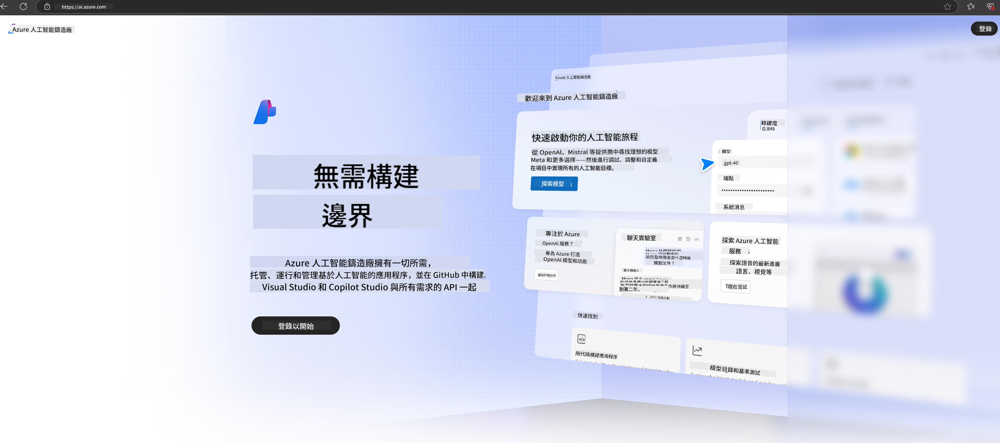

<!--
CO_OP_TRANSLATOR_METADATA:
{
  "original_hash": "6525689374197af33b41a93811e473a2",
  "translation_date": "2025-04-04T06:53:41+00:00",
  "source_file": "md\\02.QuickStart\\AzureAIFoundry_QuickStart.md",
  "language_code": "tw"
}
-->
# **使用 Phi-3 在 Azure AI Foundry**

隨著生成式 AI 的發展，我們希望能夠使用統一的平台來管理不同的 LLM 和 SLM，進行企業數據整合、微調/RAG 操作，以及評估整合 LLM 和 SLM 後的各種企業業務等，從而更好地實現生成式 AI 的智慧應用。[Azure AI Foundry](https://ai.azure.com) 是一個企業級的生成式 AI 應用平台。

使用 Azure AI Foundry，您可以評估大型語言模型（LLM）的回應，並通過 Prompt Flow 協調提示應用元件以獲得更好的性能。該平台支持從概念驗證快速擴展到完整的生產環境，並提供持續的監控和改進以支持長期成功。

我們可以通過簡單的步驟快速在 Azure AI Foundry 上部署 Phi-3 模型，然後使用 Azure AI Foundry 完成與 Phi-3 相關的 Playground/Chat、微調、評估等工作。

## **1. 準備工作**

如果您已在您的設備上安裝 [Azure Developer CLI](https://learn.microsoft.com/azure/developer/azure-developer-cli/overview?WT.mc_id=aiml-138114-kinfeylo)，只需在新目錄中運行以下命令即可使用該模板。

## 手動創建

創建 Microsoft Azure AI Foundry 項目和 Hub 是組織和管理您的 AI 工作的好方法。以下是入門的分步指南：

### 在 Azure AI Foundry 中創建項目

1. **進入 Azure AI Foundry**：登錄 Azure AI Foundry 的門戶。
2. **創建項目**：
   - 如果您已在某個項目中，請選擇頁面左上角的 "Azure AI Foundry"，回到主頁。
   - 點擊 "+ Create project"。
   - 為項目輸入一個名稱。
   - 如果您已經有 Hub，將默認選中。如果您擁有多個 Hub 的訪問權限，可以從下拉菜單中選擇其他 Hub。如果您想創建新的 Hub，請選擇 "Create new hub" 並輸入名稱。
   - 點擊 "Create"。

### 在 Azure AI Foundry 中創建 Hub

1. **進入 Azure AI Foundry**：使用您的 Azure 賬號登錄。
2. **創建 Hub**：
   - 從左側菜單選擇管理中心。
   - 點擊 "All resources"，然後在 "+ New project" 下拉菜單中選擇 "+ New hub"。
   - 在 "Create a new hub" 對話框中，輸入 Hub 的名稱（例如 contoso-hub），並根據需要修改其他字段。
   - 點擊 "Next"，檢查信息，然後點擊 "Create"。

更詳細的指導，您可以參考官方 [Microsoft 文檔](https://learn.microsoft.com/azure/ai-studio/how-to/create-projects)。

創建成功後，您可以通過 [ai.azure.com](https://ai.azure.com/) 訪問您創建的 Studio。

一個 AI Foundry 可以包含多個項目。在 AI Foundry 中創建項目以完成準備工作。

創建 Azure AI Foundry [快速入門](https://learn.microsoft.com/azure/ai-studio/quickstarts/get-started-code)

## **2. 在 Azure AI Foundry 中部署 Phi 模型**

點擊項目的 Explore 選項，進入 Model Catalog 並選擇 Phi-3

選擇 Phi-3-mini-4k-instruct

點擊 'Deploy' 部署 Phi-3-mini-4k-instruct 模型

> [!NOTE]
>
> 部署時可以選擇計算能力

## **3. 在 Azure AI Foundry 中使用 Playground 與 Phi 聊天**

進入部署頁面，選擇 Playground，並與 Azure AI Foundry 的 Phi-3 進行聊天

## **4. 從 Azure AI Foundry 部署模型**

要從 Azure Model Catalog 部署模型，您可以按照以下步驟進行：

- 登錄 Azure AI Foundry。
- 從 Azure AI Foundry 模型目錄中選擇您想要部署的模型。
- 在模型的詳細信息頁面，選擇 Deploy，然後選擇使用 Azure AI Content Safety 的 Serverless API。
- 選擇您希望部署模型的項目。若使用 Serverless API，您的工作空間必須屬於 East US 2 或 Sweden Central 地區。您可以自定義 Deployment 名稱。
- 在部署向導中，選擇 Pricing and terms 了解定價和使用條款。
- 點擊 Deploy。等待部署完成，系統會將您重定向到 Deployments 頁面。
- 點擊 Open in playground 開始與模型互動。
- 您可以返回 Deployments 頁面，選擇部署，並記下端點的 Target URL 和 Secret Key，這些可以用於調用部署並生成完成。
- 您可以隨時通過導航到 Build 標籤並從 Components 部分選擇 Deployments，找到端點的詳細信息、URL 和訪問密鑰。

> [!NOTE]
> 請注意，您的帳戶必須在資源組上擁有 Azure AI Developer 角色權限才能執行這些步驟。

## **5. 在 Azure AI Foundry 中使用 Phi API**

您可以通過 Postman GET 訪問 https://{Your project name}.region.inference.ml.azure.com/swagger.json，並結合 Key 了解提供的接口。

您可以非常方便地獲取請求參數以及回應參數。

**免責聲明**：  
本文檔使用 AI 翻譯服務 [Co-op Translator](https://github.com/Azure/co-op-translator) 進行翻譯。雖然我們致力於提供準確的翻譯，但請注意，自動翻譯可能包含錯誤或不準確之處。原始語言的文件應被視為權威來源。對於關鍵信息，建議尋求專業人工翻譯。我們不對因使用此翻譯而引起的任何誤解或錯誤解釋承擔責任。