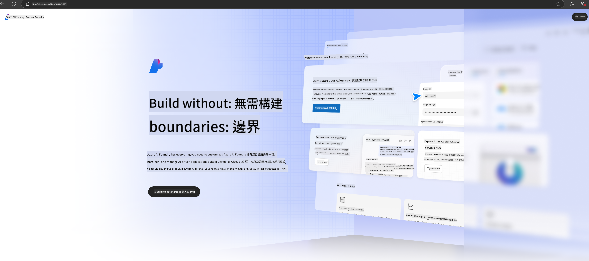

<!--
CO_OP_TRANSLATOR_METADATA:
{
  "original_hash": "3a1e48b628022485aac989c9f733e792",
  "translation_date": "2025-05-08T05:00:04+00:00",
  "source_file": "md/02.QuickStart/AzureAIFoundry_QuickStart.md",
  "language_code": "tw"
}
-->
# **在 Azure AI Foundry 使用 Phi-3**

隨著生成式 AI 的發展，我們希望能用一個統一的平台來管理不同的 LLM 和 SLM、企業資料整合、微調/RAG 操作，以及整合 LLM 和 SLM 後對不同企業業務的評估，讓生成式 AI 更好地應用在智慧化應用上。[Azure AI Foundry](https://ai.azure.com) 是一個企業級的生成式 AI 應用平台。

透過 Azure AI Foundry，你可以評估大型語言模型（LLM）的回應，並利用 prompt flow 協調提示應用元件，提升效能。此平台支援擴展性，讓概念驗證輕鬆轉型為正式生產環境。持續監控與優化，助力長期成功。

我們可以透過簡單步驟快速在 Azure AI Foundry 部署 Phi-3 模型，接著利用 Azure AI Foundry 完成 Phi-3 相關的 Playground/Chat、微調、評估等工作。

## **1. 準備工作**

如果你已經在機器上安裝了 [Azure Developer CLI](https://learn.microsoft.com/azure/developer/azure-developer-cli/overview?WT.mc_id=aiml-138114-kinfeylo)，使用這個範本只要在新資料夾執行這個指令就很簡單了。

## 手動建立

建立 Microsoft Azure AI Foundry 專案和 hub 是整理與管理 AI 工作的好方法。以下是逐步指引，幫助你開始：

### 在 Azure AI Foundry 建立專案

1. **前往 Azure AI Foundry**：登入 Azure AI Foundry 入口網站。
2. **建立專案**：
   - 如果你已在某個專案中，點選頁面左上角的「Azure AI Foundry」回到首頁。
   - 選擇「+ Create project」。
   - 輸入專案名稱。
   - 如果你已有 hub，會預設選擇該 hub。如果你有多個 hub 權限，可以從下拉選單挑選不同的 hub。若想新建 hub，選擇「Create new hub」並輸入名稱。
   - 點選「Create」。

### 在 Azure AI Foundry 建立 Hub

1. **前往 Azure AI Foundry**：用你的 Azure 帳號登入。
2. **建立 Hub**：
   - 從左側選單選擇管理中心（Management center）。
   - 選擇「All resources」，接著點擊「+ New project」旁的下拉箭頭，選擇「+ New hub」。
   - 在「Create a new hub」視窗中，輸入 hub 名稱（例如 contoso-hub），並依需求修改其他欄位。
   - 點選「Next」，檢視資訊後，點選「Create」。

更詳細的操作說明，請參考官方 [Microsoft 文件](https://learn.microsoft.com/azure/ai-studio/how-to/create-projects)。

成功建立後，你可以透過 [ai.azure.com](https://ai.azure.com/) 進入剛建立的 studio。

一個 AI Foundry 可以有多個專案，請先在 AI Foundry 建立專案做準備。

建立 Azure AI Foundry [快速入門](https://learn.microsoft.com/azure/ai-studio/quickstarts/get-started-code)

## **2. 在 Azure AI Foundry 部署 Phi 模型**

點選專案中的 Explore 選項，進入模型目錄並選擇 Phi-3

選擇 Phi-3-mini-4k-instruct

點擊「Deploy」部署 Phi-3-mini-4k-instruct 模型

> [!NOTE]
>
> 部署時可以選擇運算資源

## **3. 在 Azure AI Foundry Playground 與 Phi 聊天**

進入部署頁面，選擇 Playground，與 Azure AI Foundry 的 Phi-3 進行聊天

## **4. 從 Azure AI Foundry 部署模型**

要從 Azure 模型目錄部署模型，可以依照以下步驟：

- 登入 Azure AI Foundry。
- 從 Azure AI Foundry 模型目錄中選擇想要部署的模型。
- 在模型詳細頁面，選擇 Deploy，接著選擇帶有 Azure AI Content Safety 的 Serverless API。
- 選擇你要部署模型的專案。要使用 Serverless API，工作區必須屬於 East US 2 或 Sweden Central 區域。你可以自訂部署名稱。
- 在部署精靈中，選擇定價與條款以了解使用價格和條款。
- 點擊 Deploy，等待部署完成並自動導向部署頁面。
- 選擇「Open in playground」開始與模型互動。
- 你可以回到部署頁面，選擇該部署，並記下端點的目標 URL 以及 Secret Key，用來呼叫部署並產生回應。
- 你也可以在 Build 分頁，從 Components 區塊中選擇 Deployments，隨時找到端點詳細資訊、URL 和存取金鑰。

> [!NOTE]
> 請注意，你的帳號必須在資源群組擁有 Azure AI Developer 角色權限才能執行這些步驟。

## **5. 在 Azure AI Foundry 使用 Phi API**

你可以透過 Postman 使用 GET 方法存取 https://{Your project name}.region.inference.ml.azure.com/swagger.json，並搭配 Key 了解提供的介面。

你可以很方便地取得請求參數以及回應參數。

**免責聲明**：  
本文件係使用 AI 翻譯服務 [Co-op Translator](https://github.com/Azure/co-op-translator) 進行翻譯。雖然我們致力於提供準確的翻譯，但請注意自動翻譯可能包含錯誤或不準確之處。原始文件的母語版本應視為權威來源。對於重要資訊，建議採用專業人工翻譯。我們不對因使用本翻譯所產生的任何誤解或誤譯負責。