<!--
CO_OP_TRANSLATOR_METADATA:
{
  "original_hash": "94e7d7ab455720bab75ead5c28521c97",
  "translation_date": "2025-04-04T06:56:43+00:00",
  "source_file": "md\\03.FineTuning\\FineTuning_AIFoundry.md",
  "language_code": "tw"
}
-->
# 使用 Azure AI Foundry 微調 Phi-3 模型

讓我們來探索如何使用 Azure AI Foundry 微調微軟的 Phi-3 Mini 語言模型。透過微調，您可以使 Phi-3 Mini 適應特定任務，讓它更強大且具上下文感知能力。

## 注意事項

- **能力：** 哪些模型可以進行微調？基礎模型可以被微調來完成什麼樣的任務？
- **成本：** 微調的定價模式是什麼？
- **可定制性：** 我可以以什麼方式修改基礎模型？修改幅度有多大？
- **便利性：** 微調過程是如何進行的？我是否需要撰寫自訂程式碼？是否需要自行提供運算資源？
- **安全性：** 微調模型已知可能存在安全風險——是否有任何防護措施來避免意外傷害？

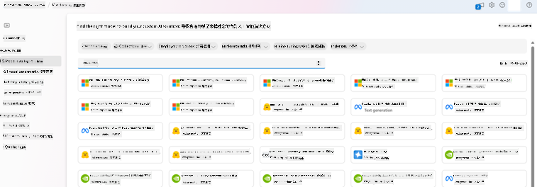

## 微調準備工作

### 先決條件

> [!NOTE]
> 對於 Phi-3 系列模型，按需付費的微調服務僅適用於 **East US 2** 區域建立的 Hub。

- 一個 Azure 訂閱。如果您尚未擁有 Azure 訂閱，請建立一個 [付費 Azure 帳戶](https://azure.microsoft.com/pricing/purchase-options/pay-as-you-go) 以開始使用。

- 一個 [AI Foundry 專案](https://ai.azure.com?WT.mc_id=aiml-138114-kinfeylo)。
- Azure 基於角色的存取控制 (Azure RBAC)，用於授予 Azure AI Foundry 的操作權限。要執行本文中的步驟，您的使用者帳戶必須被分配到資源群組中的 __Azure AI Developer 角色__。

### 訂閱提供者註冊

確認訂閱已註冊到 `Microsoft.Network` 資源提供者。

1. 登錄 [Azure portal](https://portal.azure.com)。
1. 從左側選單中選擇 **Subscriptions**。
1. 選擇您要使用的訂閱。
1. 從左側選單中選擇 **AI project settings** > **Resource providers**。
1. 確認 **Microsoft.Network** 在資源提供者列表中。如果未列出，請將其添加。

### 資料準備

準備您的訓練和驗證數據以微調模型。您的訓練數據和驗證數據集應包含輸入與輸出示例，展示您希望模型如何執行。

確保所有訓練示例符合推論的預期格式。為了有效地微調模型，請確保數據集平衡且多樣化。

這包括維持數據平衡、涵蓋多種情境，並定期精煉訓練數據以符合現實世界期望，最終提高模型的準確性與平衡性。

不同模型類型需要不同格式的訓練數據。

### Chat Completion

您使用的訓練和驗證數據**必須**格式化為 JSON Lines (JSONL) 文件。對於 `Phi-3-mini-128k-instruct`，微調數據集必須採用 Chat completions API 使用的對話格式。

### 示例文件格式

```json
    {"messages": [{"role": "system", "content": "You are an Xbox customer support agent whose primary goal is to help users with issues they are experiencing with their Xbox devices. You are friendly and concise. You only provide factual answers to queries, and do not provide answers that are not related to Xbox."}, {"role": "user", "content": "Is Xbox better than PlayStation?"}, {"role": "assistant", "content": "I apologize, but I cannot provide personal opinions. My primary job is to assist you with any issues related to your Xbox device. Do you have any Xbox-related issues that need addressing?"}]}
    {"messages": [{"role": "system", "content": "You are an Xbox customer support agent whose primary goal is to help users with issues they are experiencing with their Xbox devices. You are friendly and concise. You only provide factual answers to queries, and do not provide answers that are not related to Xbox."}, {"role": "user", "content": "Can I play PC games on my Xbox?"}, {"role": "assistant", "content": "While Xbox consoles don't natively support PC games, they can play an array of Xbox games, many of which are also available on PC. Can I assist you with finding games compatible with your Xbox device?"}]}
    {"messages": [{"role": "system", "content": "You are an Xbox customer support agent whose primary goal is to help users with issues they are experiencing with their Xbox devices. You are friendly and concise. You only provide factual answers to queries, and do not provide answers that are not related to Xbox."}, {"role": "user", "content": "I'm having trouble connecting my Xbox to the Wi-Fi."}, {"role": "assistant", "content": "No worries, let's go through the network settings on your Xbox. Can you please tell me what happens when you try to connect it to the Wi-Fi?"}]}
```

支持的文件類型為 JSON Lines。文件會被上傳到預設數據存儲並在您的專案中可用。

## 使用 Azure AI Foundry 微調 Phi-3

Azure AI Foundry 允許您透過微調過程使用個人數據集來定制大型語言模型。微調具有重要價值，能夠針對特定任務和應用進行定制和優化。它能帶來性能提升、成本效益、降低延遲以及定制化輸出。

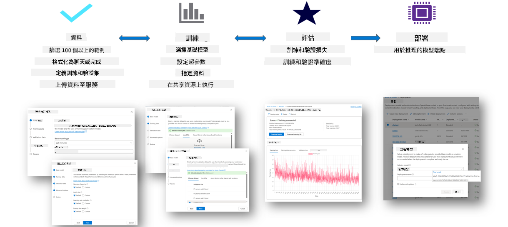

### 創建新專案

1. 登錄 [Azure AI Foundry](https://ai.azure.com)。

1. 選擇 **+New project** 以在 Azure AI Foundry 中創建新專案。

    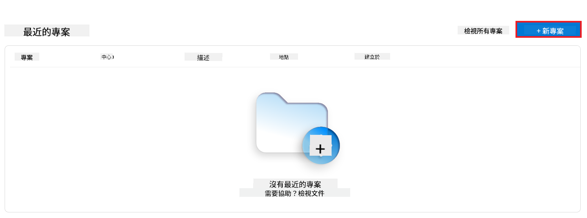

1. 執行以下任務：

    - 專案 **Hub 名稱**。必須是唯一值。
    - 選擇要使用的 **Hub**（如有需要可創建新 Hub）。

    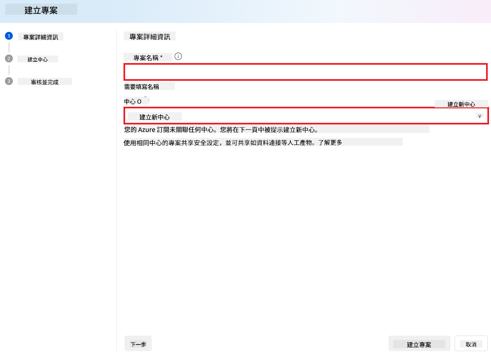

1. 執行以下任務以創建新 Hub：

    - 輸入 **Hub 名稱**。必須是唯一值。
    - 選擇您的 Azure **Subscription**。
    - 選擇要使用的 **Resource group**（如有需要可創建新資源群組）。
    - 選擇您希望使用的 **Location**。
    - 選擇 **Connect Azure AI Services**（如有需要可創建新的）。
    - 選擇 **Connect Azure AI Search** 為 **Skip connecting**。

    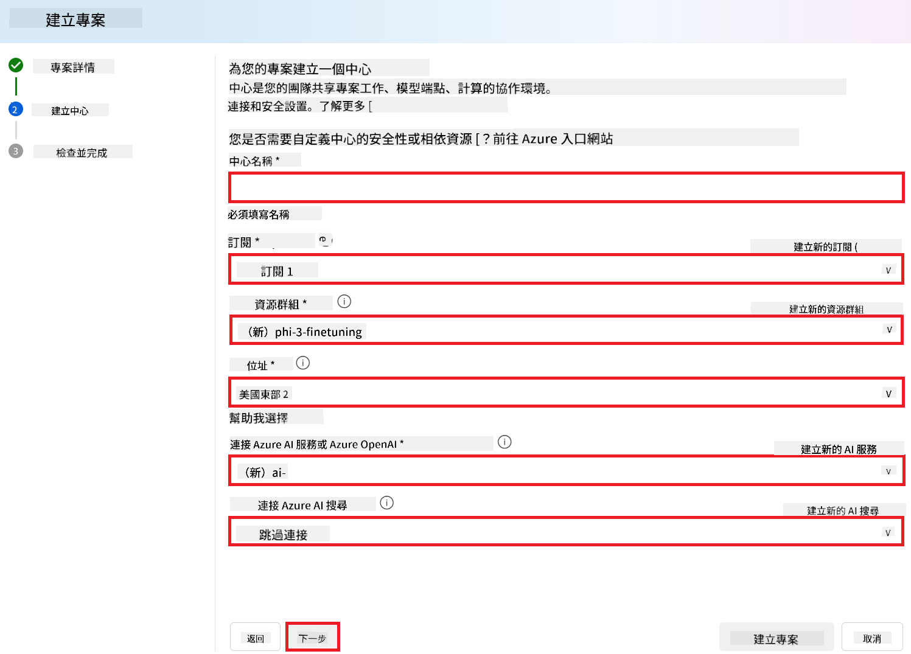

1. 選擇 **Next**。
1. 選擇 **Create a project**。

### 資料準備

在微調之前，收集或創建與您的任務相關的數據集，例如聊天指令、問答配對或其他相關文本數據。清理並預處理這些數據，包括移除雜訊、處理缺失值以及進行文本分詞。

### 在 Azure AI Foundry 微調 Phi-3 模型

> [!NOTE]
> Phi-3 模型的微調目前僅支持位於 East US 2 的專案。

1. 從左側選項卡中選擇 **Model catalog**。

1. 在 **搜索欄**中輸入 *phi-3*，並選擇您想使用的 phi-3 模型。

    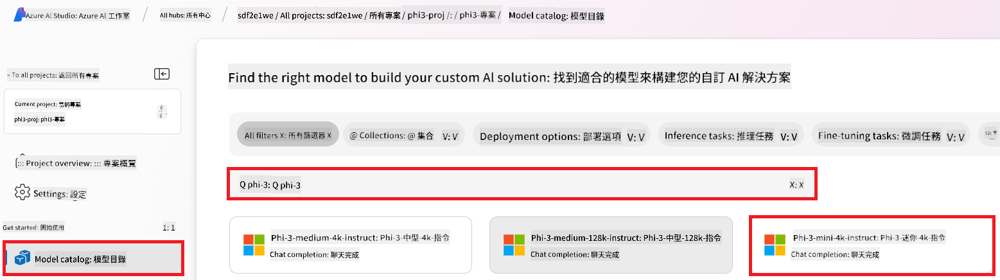

1. 選擇 **Fine-tune**。

    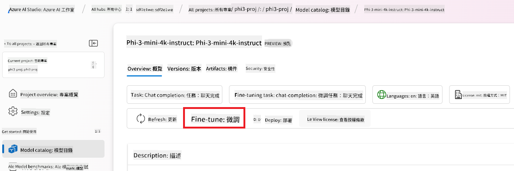

1. 輸入 **微調後模型名稱**。

    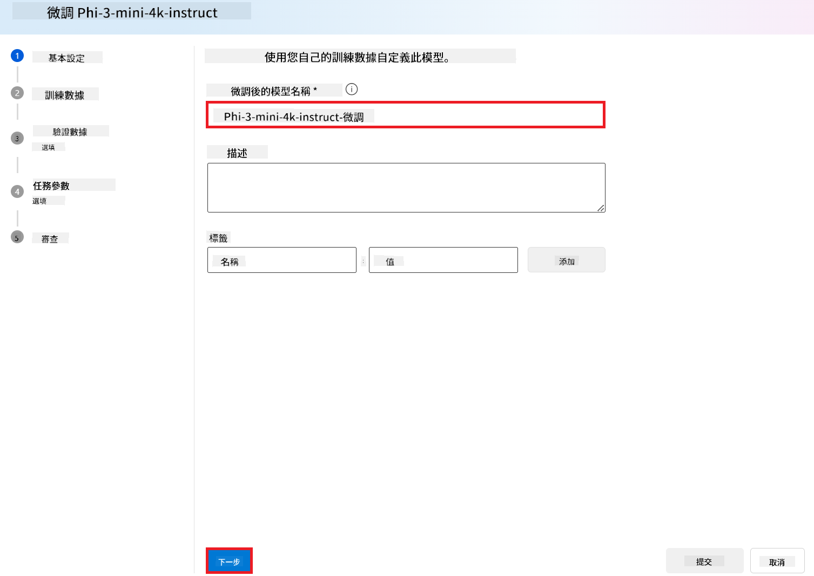

1. 選擇 **Next**。

1. 執行以下任務：

    - 選擇 **任務類型**為 **Chat completion**。
    - 選擇您希望使用的 **訓練數據**。您可以通過 Azure AI Foundry 的數據或從本地環境上傳。

    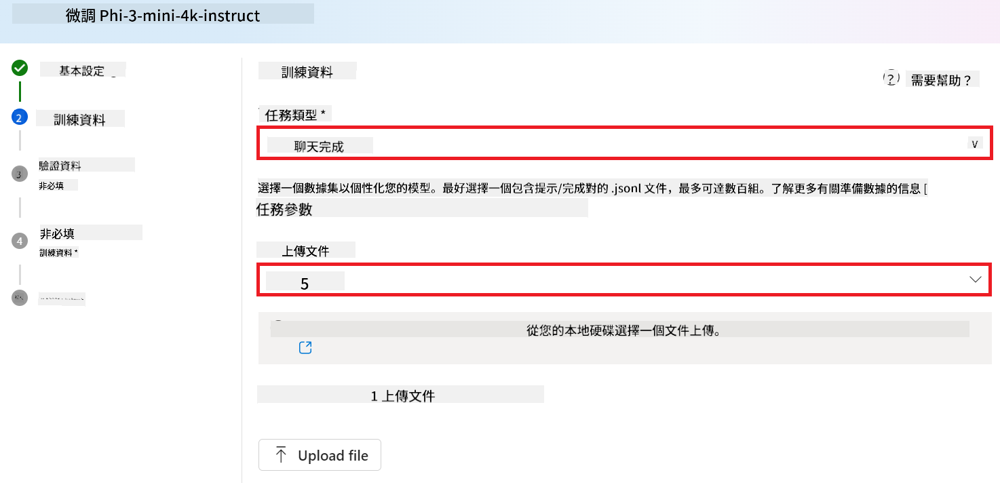

1. 選擇 **Next**。

1. 上傳您希望使用的 **驗證數據**，或選擇 **自動分割訓練數據**。

    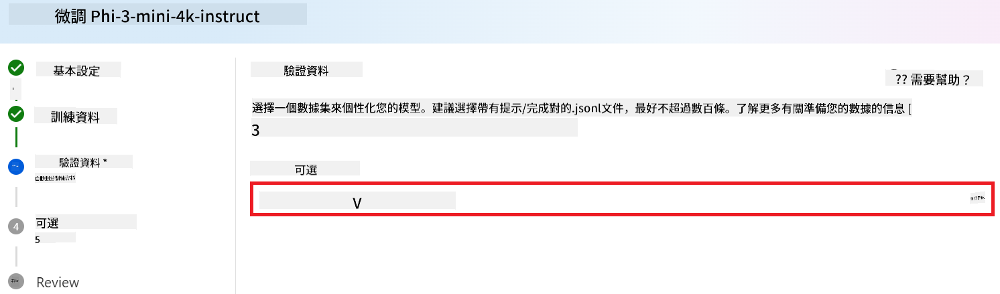

1. 選擇 **Next**。

1. 執行以下任務：

    - 選擇您希望使用的 **批次大小倍數**。
    - 選擇您希望使用的 **學習率**。
    - 選擇您希望使用的 **訓練迭代次數**。

    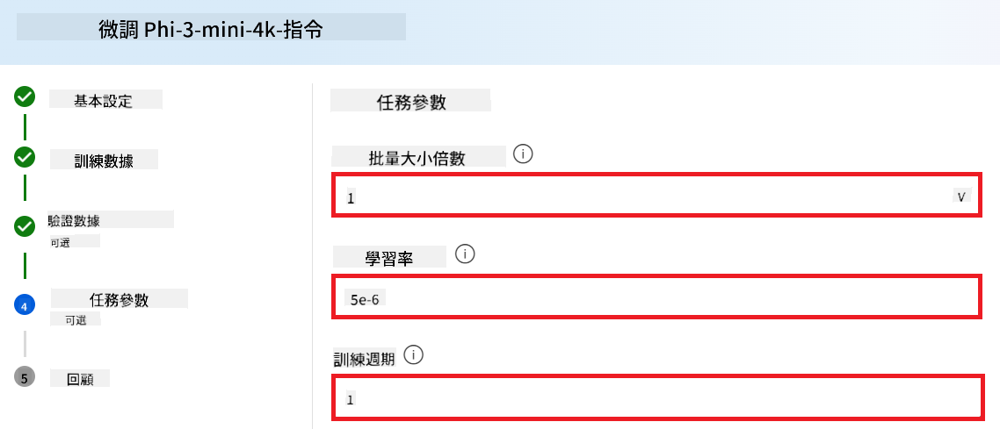

1. 選擇 **Submit** 以開始微調過程。

    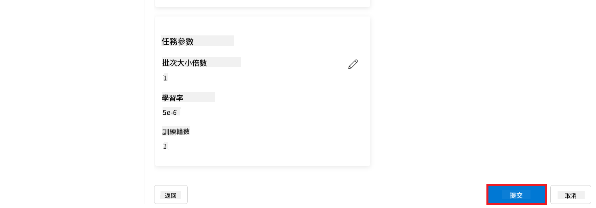

1. 一旦您的模型微調完成，狀態將顯示為 **Completed**，如下圖所示。現在您可以部署模型並在自己的應用程式、沙盒或提示流程中使用。欲了解更多資訊，請參閱 [如何使用 Azure AI Foundry 部署 Phi-3 系列小型語言模型](https://learn.microsoft.com/azure/ai-studio/how-to/deploy-models-phi-3?tabs=phi-3-5&pivots=programming-language-python)。

    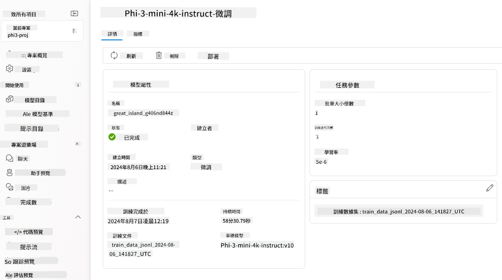

> [!NOTE]
> 有關微調 Phi-3 的更多詳細資訊，請參閱 [在 Azure AI Foundry 微調 Phi-3 模型](https://learn.microsoft.com/azure/ai-studio/how-to/fine-tune-phi-3?tabs=phi-3-mini)。

## 清理微調後的模型

您可以從 [Azure AI Foundry](https://ai.azure.com) 的微調模型列表或模型詳細資訊頁面中刪除微調後的模型。從微調頁面中選擇要刪除的微調模型，然後選擇刪除按鈕以刪除該模型。

> [!NOTE]
> 如果自訂模型已部署，則無法刪除。您必須先刪除模型部署，才能刪除自訂模型。

## 成本與配額

### Phi-3 模型微調服務的成本與配額考量

微調作為服務的 Phi 模型由微軟提供並與 Azure AI Foundry 整合使用。您可以在 [部署](https://learn.microsoft.com/azure/ai-studio/how-to/deploy-models-phi-3?tabs=phi-3-5&pivots=programming-language-python)或微調模型時，於部署精靈的定價與條款標籤中找到定價資訊。

## 內容過濾

以即付即用方式部署的模型受 Azure AI 內容安全保護。在部署到即時端點時，您可以選擇停用此功能。有了 Azure AI 內容安全，提示與完成都會通過一組分類模型，用於檢測和防止有害內容的輸出。內容過濾系統能檢測並對輸入提示和輸出完成中的特定類別的潛在有害內容採取行動。了解更多 [Azure AI 內容安全](https://learn.microsoft.com/azure/ai-studio/concepts/content-filtering)。

**微調配置**

超參數：定義超參數，例如學習率、批次大小和訓練迭代次數。

**損失函數**

選擇適合任務的損失函數（例如，交叉熵）。

**優化器**

選擇一個優化器（例如 Adam），用於訓練過程中的梯度更新。

**微調過程**

- 加載預訓練模型：加載 Phi-3 Mini 的檢查點。
- 添加自訂層：添加特定任務的層（例如，用於聊天指令的分類頭）。

**訓練模型**
使用準備好的數據集微調模型。監控訓練進度並根據需要調整超參數。

**評估與驗證**

驗證集：將您的數據分割為訓練集和驗證集。

**評估性能**

使用準確率、F1 分數或困惑度等指標來評估模型性能。

## 保存微調後的模型

**檢查點**
保存微調後的模型檢查點以供未來使用。

## 部署

- 部署為 Web 服務：將微調後的模型部署為 Azure AI Foundry 中的 Web 服務。
- 測試端點：向部署的端點發送測試查詢以驗證其功能。

## 迭代與改進

迭代：如果性能不令人滿意，通過調整超參數、添加更多數據或增加微調迭代次數進行迭代。

## 監控與精進

持續監控模型行為並根據需要進行改進。

## 自訂與擴展

自訂任務：Phi-3 Mini 可微調用於各種任務，不僅限於聊天指令。探索其他使用案例！
實驗：嘗試不同的架構、層組合和技術以提升性能。

> [!NOTE]
> 微調是一個迭代過程。實驗、學習並調整您的模型，以達到特定任務的最佳結果！

**免責聲明**：  
本文件使用 AI 翻譯服務 [Co-op Translator](https://github.com/Azure/co-op-translator) 進行翻譯。雖然我們努力確保準確性，但請注意，自動翻譯可能包含錯誤或不準確之處。原始文件的母語版本應被視為權威來源。對於關鍵信息，建議使用專業人工翻譯。我們對因使用此翻譯而產生的任何誤解或誤釋不承擔責任。