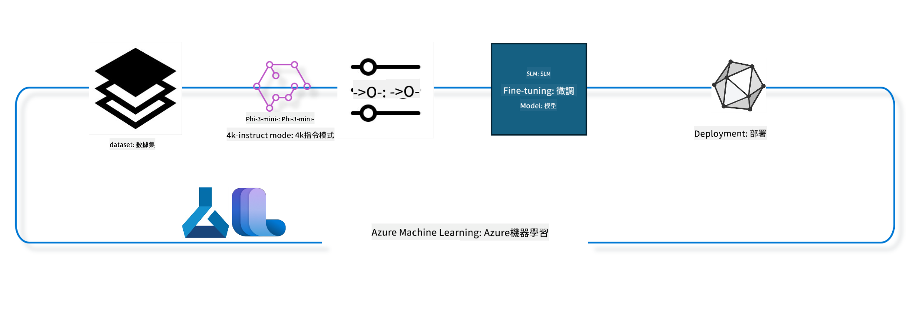

<!--
CO_OP_TRANSLATOR_METADATA:
{
  "original_hash": "ef071f0e903a1a38f8a5f8cbb253a9ca",
  "translation_date": "2025-04-04T07:05:04+00:00",
  "source_file": "md\\03.FineTuning\\FineTuning_MLSDK.md",
  "language_code": "tw"
}
-->
## 如何使用 Azure ML 系统注册表中的聊天完成组件对模型进行微调

在此示例中，我们将对 Phi-3-mini-4k-instruct 模型进行微调，以完成使用 ultrachat_200k 数据集的两人对话。



此示例将向您展示如何使用 Azure ML SDK 和 Python 进行微调，然后将微调后的模型部署到在线端点以进行实时推理。

### 训练数据

我们将使用 ultrachat_200k 数据集。该数据集是 UltraChat 数据集的经过严格筛选的版本，用于训练 Zephyr-7B-β，这是一种先进的 7b 聊天模型。

### 模型

我们将使用 Phi-3-mini-4k-instruct 模型来展示用户如何微调模型以完成聊天任务。如果您是从特定模型卡打开此笔记本，请记得替换具体的模型名称。

### 任务

- 选择要微调的模型。
- 选择并探索训练数据。
- 配置微调任务。
- 运行微调任务。
- 审查训练和评估指标。
- 注册微调后的模型。
- 部署微调后的模型以进行实时推理。
- 清理资源。

## 1. 设置先决条件

- 安装依赖项
- 连接到 AzureML 工作区。了解更多信息请参阅 SDK 身份验证设置。替换 <WORKSPACE_NAME>, <RESOURCE_GROUP> 和 <SUBSCRIPTION_ID>。
- 连接到 azureml 系统注册表
- 设置可选实验名称
- 检查或创建计算资源。

> [!NOTE]
> 要求单个 GPU 节点可以包含多个 GPU 卡。例如，在 Standard_NC24rs_v3 的一个节点中有 4 个 NVIDIA V100 GPU，而在 Standard_NC12s_v3 中有 2 个 NVIDIA V100 GPU。有关此信息，请参阅文档。节点中的 GPU 卡数量在下面的参数 gpus_per_node 中设置。正确设置此值将确保节点中所有 GPU 的利用率。推荐的 GPU 计算 SKU 可在此处和此处找到。

### Python 库

通过运行以下代码单元安装依赖项。如果是在新的环境中运行，这是一个不可跳过的步骤。

```bash
pip install azure-ai-ml
pip install azure-identity
pip install datasets==2.9.0
pip install mlflow
pip install azureml-mlflow
```

### 与 Azure ML 交互

1. 此 Python 脚本用于与 Azure 机器学习 (Azure ML) 服务交互。以下是其功能的分解：

    - 导入 azure.ai.ml、azure.identity 和 azure.ai.ml.entities 包中的必要模块。还导入了 time 模块。

    - 尝试使用 DefaultAzureCredential() 进行身份验证，该方法提供了一种简化的身份验证体验以快速开始开发运行在 Azure 云中的应用程序。如果失败，则回退到 InteractiveBrowserCredential()，它提供交互式登录提示。

    - 尝试使用 from_config 方法创建一个 MLClient 实例，该方法从默认配置文件 (config.json) 中读取配置。如果失败，则通过手动提供 subscription_id、resource_group_name 和 workspace_name 来创建 MLClient 实例。

    - 创建另一个 MLClient 实例，这次用于名为 "azureml" 的 Azure ML 注册表。此注册表存储模型、微调管道和环境。

    - 将实验名称设置为 "chat_completion_Phi-3-mini-4k-instruct"。

    - 通过将当前时间（以浮点数形式表示的自纪元以来的秒数）转换为整数然后转换为字符串，生成唯一时间戳。此时间戳可用于创建唯一的名称和版本。

    ```python
    # Import necessary modules from Azure ML and Azure Identity
    from azure.ai.ml import MLClient
    from azure.identity import (
        DefaultAzureCredential,
        InteractiveBrowserCredential,
    )
    from azure.ai.ml.entities import AmlCompute
    import time  # Import time module
    
    # Try to authenticate using DefaultAzureCredential
    try:
        credential = DefaultAzureCredential()
        credential.get_token("https://management.azure.com/.default")
    except Exception as ex:  # If DefaultAzureCredential fails, use InteractiveBrowserCredential
        credential = InteractiveBrowserCredential()
    
    # Try to create an MLClient instance using the default config file
    try:
        workspace_ml_client = MLClient.from_config(credential=credential)
    except:  # If that fails, create an MLClient instance by manually providing the details
        workspace_ml_client = MLClient(
            credential,
            subscription_id="<SUBSCRIPTION_ID>",
            resource_group_name="<RESOURCE_GROUP>",
            workspace_name="<WORKSPACE_NAME>",
        )
    
    # Create another MLClient instance for the Azure ML registry named "azureml"
    # This registry is where models, fine-tuning pipelines, and environments are stored
    registry_ml_client = MLClient(credential, registry_name="azureml")
    
    # Set the experiment name
    experiment_name = "chat_completion_Phi-3-mini-4k-instruct"
    
    # Generate a unique timestamp that can be used for names and versions that need to be unique
    timestamp = str(int(time.time()))
    ```

## 2. 选择要微调的基础模型

1. Phi-3-mini-4k-instruct 是一个具有 3.8B 参数的轻量级先进开放模型，基于用于 Phi-2 的数据集构建。该模型属于 Phi-3 模型系列，Mini 版本有两种变体，分别支持 4K 和 128K 的上下文长度（以 tokens 为单位）。我们需要根据具体需求对模型进行微调以便使用。您可以在 AzureML Studio 的模型目录中浏览这些模型，并通过聊天完成任务进行筛选。在此示例中，我们使用 Phi-3-mini-4k-instruct 模型。如果您为其他模型打开了此笔记本，请相应地替换模型名称和版本。

    > [!NOTE]
    > 模型的 id 属性。这将在微调任务中作为输入传递。在 AzureML Studio 模型目录的模型详细信息页面中也可以看到此字段。

2. 此 Python 脚本与 Azure 机器学习 (Azure ML) 服务交互。以下是其功能的分解：

    - 将 model_name 设置为 "Phi-3-mini-4k-instruct"。

    - 使用 registry_ml_client 对象的 models 属性的 get 方法，从 Azure ML 注册表中检索具有指定名称的最新版本模型。get 方法使用两个参数：模型名称和指定检索最新版本模型的标签。

    - 打印一条消息到控制台，指示将用于微调的模型的名称、版本和 id。使用字符串的 format 方法将模型的名称、版本和 id 插入到消息中。模型的名称、版本和 id 作为 foundation_model 对象的属性访问。

    ```python
    # Set the model name
    model_name = "Phi-3-mini-4k-instruct"
    
    # Get the latest version of the model from the Azure ML registry
    foundation_model = registry_ml_client.models.get(model_name, label="latest")
    
    # Print the model name, version, and id
    # This information is useful for tracking and debugging
    print(
        "\n\nUsing model name: {0}, version: {1}, id: {2} for fine tuning".format(
            foundation_model.name, foundation_model.version, foundation_model.id
        )
    )
    ```

## 3. 创建用于任务的计算资源

微调任务仅适用于 GPU 计算资源。计算资源的大小取决于模型的大小，在大多数情况下，确定适合任务的计算资源变得很棘手。在此单元中，我们指导用户选择适合任务的计算资源。

> [!NOTE]
> 以下列出的计算资源适用于最优化的配置。对配置的任何更改可能会导致 Cuda 内存不足错误。在这种情况下，请尝试将计算资源升级到更大的计算规模。

> [!NOTE]
> 在选择下面的 compute_cluster_size 时，请确保计算资源可用于您的资源组。如果某个特定计算资源不可用，您可以提交请求以获取计算资源的访问权限。

### 检查模型是否支持微调

1. 此 Python 脚本与 Azure 机器学习 (Azure ML) 模型交互。以下是其功能的分解：

    - 导入 ast 模块，该模块提供处理 Python 抽象语法树的功能。

    - 检查 foundation_model 对象（代表 Azure ML 中的模型）是否具有名为 finetune_compute_allow_list 的标签。Azure ML 中的标签是键值对，您可以创建并用于筛选和排序模型。

    - 如果存在 finetune_compute_allow_list 标签，则使用 ast.literal_eval 函数安全地解析标签的值（字符串）为 Python 列表。然后将此列表分配给 computes_allow_list 变量。接着打印一条消息，指示应从列表中创建计算资源。

    - 如果不存在 finetune_compute_allow_list 标签，则将 computes_allow_list 设置为 None，并打印一条消息，指示 finetune_compute_allow_list 标签不是模型标签的一部分。

    - 总之，此脚本检查模型元数据中的特定标签，将标签的值转换为列表（如果存在），并相应地向用户提供反馈。

    ```python
    # Import the ast module, which provides functions to process trees of the Python abstract syntax grammar
    import ast
    
    # Check if the 'finetune_compute_allow_list' tag is present in the model's tags
    if "finetune_compute_allow_list" in foundation_model.tags:
        # If the tag is present, use ast.literal_eval to safely parse the tag's value (a string) into a Python list
        computes_allow_list = ast.literal_eval(
            foundation_model.tags["finetune_compute_allow_list"]
        )  # convert string to python list
        # Print a message indicating that a compute should be created from the list
        print(f"Please create a compute from the above list - {computes_allow_list}")
    else:
        # If the tag is not present, set computes_allow_list to None
        computes_allow_list = None
        # Print a message indicating that the 'finetune_compute_allow_list' tag is not part of the model's tags
        print("`finetune_compute_allow_list` is not part of model tags")
    ```

### 检查计算实例

1. 此 Python 脚本与 Azure 机器学习 (Azure ML) 服务交互，并对计算实例执行多个检查。以下是其功能的分解：

    - 尝试从 Azure ML 工作区检索名称存储在 compute_cluster 中的计算实例。如果计算实例的配置状态为 "failed"，则引发 ValueError。

    - 检查 computes_allow_list 是否不为 None。如果不为 None，则将列表中的所有计算规模转换为小写，并检查当前计算实例的规模是否在列表中。如果不在，则引发 ValueError。

    - 如果 computes_allow_list 为 None，则检查当前计算实例的规模是否在不支持的 GPU VM 规模列表中。如果在，则引发 ValueError。

    - 检索工作区中所有可用计算规模的列表。然后迭代此列表，对于每个计算规模，检查其名称是否与当前计算实例的规模匹配。如果匹配，则检索该计算规模的 GPU 数量，并将 gpu_count_found 设置为 True。

    - 如果 gpu_count_found 为 True，则打印计算实例中的 GPU 数量。如果 gpu_count_found 为 False，则引发 ValueError。

    - 总之，此脚本对 Azure ML 工作区中的计算实例执行多个检查，包括检查其配置状态、规模与允许列表或禁止列表的匹配情况以及 GPU 数量。

    ```python
    # Print the exception message
    print(e)
    # Raise a ValueError if the compute size is not available in the workspace
    raise ValueError(
        f"WARNING! Compute size {compute_cluster_size} not available in workspace"
    )
    
    # Retrieve the compute instance from the Azure ML workspace
    compute = workspace_ml_client.compute.get(compute_cluster)
    # Check if the provisioning state of the compute instance is "failed"
    if compute.provisioning_state.lower() == "failed":
        # Raise a ValueError if the provisioning state is "failed"
        raise ValueError(
            f"Provisioning failed, Compute '{compute_cluster}' is in failed state. "
            f"please try creating a different compute"
        )
    
    # Check if computes_allow_list is not None
    if computes_allow_list is not None:
        # Convert all compute sizes in computes_allow_list to lowercase
        computes_allow_list_lower_case = [x.lower() for x in computes_allow_list]
        # Check if the size of the compute instance is in computes_allow_list_lower_case
        if compute.size.lower() not in computes_allow_list_lower_case:
            # Raise a ValueError if the size of the compute instance is not in computes_allow_list_lower_case
            raise ValueError(
                f"VM size {compute.size} is not in the allow-listed computes for finetuning"
            )
    else:
        # Define a list of unsupported GPU VM sizes
        unsupported_gpu_vm_list = [
            "standard_nc6",
            "standard_nc12",
            "standard_nc24",
            "standard_nc24r",
        ]
        # Check if the size of the compute instance is in unsupported_gpu_vm_list
        if compute.size.lower() in unsupported_gpu_vm_list:
            # Raise a ValueError if the size of the compute instance is in unsupported_gpu_vm_list
            raise ValueError(
                f"VM size {compute.size} is currently not supported for finetuning"
            )
    
    # Initialize a flag to check if the number of GPUs in the compute instance has been found
    gpu_count_found = False
    # Retrieve a list of all available compute sizes in the workspace
    workspace_compute_sku_list = workspace_ml_client.compute.list_sizes()
    available_sku_sizes = []
    # Iterate over the list of available compute sizes
    for compute_sku in workspace_compute_sku_list:
        available_sku_sizes.append(compute_sku.name)
        # Check if the name of the compute size matches the size of the compute instance
        if compute_sku.name.lower() == compute.size.lower():
            # If it does, retrieve the number of GPUs for that compute size and set gpu_count_found to True
            gpus_per_node = compute_sku.gpus
            gpu_count_found = True
    # If gpu_count_found is True, print the number of GPUs in the compute instance
    if gpu_count_found:
        print(f"Number of GPU's in compute {compute.size}: {gpus_per_node}")
    else:
        # If gpu_count_found is False, raise a ValueError
        raise ValueError(
            f"Number of GPU's in compute {compute.size} not found. Available skus are: {available_sku_sizes}."
            f"This should not happen. Please check the selected compute cluster: {compute_cluster} and try again."
        )
    ```

## 4. 选择用于微调模型的数据集

1. 我们使用 ultrachat_200k 数据集。该数据集有四个分割，适合以下任务：

    - 监督微调 (sft)
    - 生成排名 (gen)

    每个分割的示例数量如下：

    ```bash
    train_sft test_sft  train_gen  test_gen
    207865  23110  256032  28304
    ```

1. 接下来的几个单元展示了微调的基本数据准备：

### 可视化一些数据行

为了让此示例运行更快，保存 train_sft 和 test_sft 文件，其中包含已经裁剪的 5% 行。这意味着微调后的模型将具有较低的准确性，因此不应用于实际场景。
download-dataset.py 用于下载 ultrachat_200k 数据集并将数据集转换为微调管道组件可消费的格式。此外，由于数据集较大，因此这里只使用了部分数据集。

1. 运行以下脚本仅下载 5% 的数据。这可以通过将 dataset_split_pc 参数更改为所需的百分比来增加。

    > [!NOTE]
    > 某些语言模型具有不同的语言代码，因此数据集中的列名应反映相应的代码。

1. 以下是数据应具有的样例：
聊天完成数据集以 parquet 格式存储，每个条目使用以下模式：

    - 这是一个 JSON（JavaScript 对象表示法）文档，是一种流行的数据交换格式。以下是其结构的分解：

    - "prompt": 此键包含一个字符串值，表示提供给 AI 助手的任务或问题。

    - "messages": 此键包含一个对象数组。每个对象表示用户与 AI 助手之间对话中的一条消息。每个消息对象有两个键：

    - "content": 此键包含一个字符串值，表示消息内容。
    - "role": 此键包含一个字符串值，表示发送消息的实体角色。可以是 "user" 或 "assistant"。
    - "prompt_id": 此键包含一个字符串值，表示提示的唯一标识符。

1. 在此特定 JSON 文档中，表示了一次对话，其中用户要求 AI 助手为一个反乌托邦故事创建主角。助手响应后，用户进一步要求提供更多细节。助手同意提供更多细节。整个对话与特定的 prompt_id 相关联。

    ```python
    {
        // The task or question posed to an AI assistant
        "prompt": "Create a fully-developed protagonist who is challenged to survive within a dystopian society under the rule of a tyrant. ...",
        
        // An array of objects, each representing a message in a conversation between a user and an AI assistant
        "messages":[
            {
                // The content of the user's message
                "content": "Create a fully-developed protagonist who is challenged to survive within a dystopian society under the rule of a tyrant. ...",
                // The role of the entity that sent the message
                "role": "user"
            },
            {
                // The content of the assistant's message
                "content": "Name: Ava\n\n Ava was just 16 years old when the world as she knew it came crashing down. The government had collapsed, leaving behind a chaotic and lawless society. ...",
                // The role of the entity that sent the message
                "role": "assistant"
            },
            {
                // The content of the user's message
                "content": "Wow, Ava's story is so intense and inspiring! Can you provide me with more details.  ...",
                // The role of the entity that sent the message
                "role": "user"
            }, 
            {
                // The content of the assistant's message
                "content": "Certainly! ....",
                // The role of the entity that sent the message
                "role": "assistant"
            }
        ],
        
        // A unique identifier for the prompt
        "prompt_id": "d938b65dfe31f05f80eb8572964c6673eddbd68eff3db6bd234d7f1e3b86c2af"
    }
    ```

### 下载数据

1. 此 Python 脚本用于使用名为 download-dataset.py 的辅助脚本下载数据集。以下是其功能的分解：

    - 导入 os 模块，该模块提供使用操作系统相关功能的便捷方式。

    - 使用 os.system 函数在 shell 中运行 download-dataset.py 脚本，并传递特定的命令行参数。参数指定要下载的数据集 (HuggingFaceH4/ultrachat_200k)、下载到的目录 (ultrachat_200k_dataset) 和数据集分割的百分比 (5)。os.system 函数返回所执行命令的退出状态；此状态存储在 exit_status 变量中。

    - 检查 exit_status 是否不为 0。在类 Unix 操作系统中，退出状态为 0 通常表示命令成功，而任何其他数字表示错误。如果 exit_status 不为 0，则引发一个异常，并附带指示下载数据集时出错的消息。

    - 总之，此脚本运行命令以使用辅助脚本下载数据集，如果命令失败则引发异常。

    ```python
    # Import the os module, which provides a way of using operating system dependent functionality
    import os
    
    # Use the os.system function to run the download-dataset.py script in the shell with specific command-line arguments
    # The arguments specify the dataset to download (HuggingFaceH4/ultrachat_200k), the directory to download it to (ultrachat_200k_dataset), and the percentage of the dataset to split (5)
    # The os.system function returns the exit status of the command it executed; this status is stored in the exit_status variable
    exit_status = os.system(
        "python ./download-dataset.py --dataset HuggingFaceH4/ultrachat_200k --download_dir ultrachat_200k_dataset --dataset_split_pc 5"
    )
    
    # Check if exit_status is not 0
    # In Unix-like operating systems, an exit status of 0 usually indicates that a command has succeeded, while any other number indicates an error
    # If exit_status is not 0, raise an Exception with a message indicating that there was an error downloading the dataset
    if exit_status != 0:
        raise Exception("Error downloading dataset")
    ```

### 将数据加载到 DataFrame

1. 此 Python 脚本将 JSON Lines 文件加载到 pandas DataFrame 中并显示前 5 行。以下是其功能的分解：

    - 导入 pandas 库，这是一个强大的数据处理和分析库。

    - 将 pandas 的显示选项中的最大列宽设置为 0。这意味着在打印 DataFrame 时，每列的完整文本将显示而不会被截断。

    - 使用 pd.read_json 函数将 ultrachat_200k_dataset 目录中的 train_sft.jsonl 文件加载到 DataFrame 中。lines=True 参数指示文件为 JSON Lines 格式，其中每行是一个单独的 JSON 对象。

    - 使用 head 方法显示 DataFrame 的前 5 行。如果 DataFrame 的行数少于 5 行，则会显示所有行。

    - 总之，此脚本将 JSON Lines 文件加载到 DataFrame 中，并显示前 5 行的完整列文本。

    ```python
    # Import the pandas library, which is a powerful data manipulation and analysis library
    import pandas as pd
    
    # Set the maximum column width for pandas' display options to 0
    # This means that the full text of each column will be displayed without truncation when the DataFrame is printed
    pd.set_option("display.max_colwidth", 0)
    
    # Use the pd.read_json function to load the train_sft.jsonl file from the ultrachat_200k_dataset directory into a DataFrame
    # The lines=True argument indicates that the file is in JSON Lines format, where each line is a separate JSON object
    df = pd.read_json("./ultrachat_200k_dataset/train_sft.jsonl", lines=True)
    
    # Use the head method to display the first 5 rows of the DataFrame
    # If the DataFrame has less than 5 rows, it will display all of them
    df.head()
    ```

## 5. 使用模型和数据作为输入提交微调任务

创建使用聊天完成管道组件的任务。了解有关支持微调的所有参数的更多信息。

### 定义微调参数

1. 微调参数可以分为两类：训练参数和优化参数。

1. 训练参数定义训练方面，例如：

    - 要使用的优化器和调度器
    - 优化微调的指标
    - 训练步骤数、批量大小等

1. 优化参数帮助优化 GPU 内存并有效利用计算资源。

    - 启用 DeepSpeed 和 LoRA
    - 启用混合精度训练
    - 启用多节点训练

> [!NOTE]
> 监督微调可能导致对齐丢失或灾难性遗忘。我们建议在微调后检查此问题并运行对齐阶段。

### 微调参数

1. 此 Python 脚本设置机器学习模型微调的参数。以下是其功能的分解：

    - 设置默认训练参数，例如训练 epochs 数量、训练和评估的批量大小、学习率和学习率调度器类型。

    - 设置默认优化参数，例如是否应用 Layer-wise Relevance Propagation (LoRa) 和 DeepSpeed，以及 DeepSpeed 阶段。

    - 将训练和优化参数组合到一个名为 finetune_parameters 的字典中。

    - 检查 foundation_model 是否具有任何模型特定的默认参数。如果有，则打印一条警告消息，并使用这些模型特定的默认参数更新 finetune_parameters 字典。使用 ast.literal_eval 函数将模型特定的默认参数从字符串转换为 Python 字典。

    - 打印将用于运行的最终微调参数。

    - 总之，此脚本设置机器学习模型微调的参数，并能够使用模型特定的参数覆盖默认参数。

    ```python
    # Set up default training parameters such as the number of training epochs, batch sizes for training and evaluation, learning rate, and learning rate scheduler type
    training_parameters = dict(
        num_train_epochs=3,
        per_device_train_batch_size=1,
        per_device_eval_batch_size=1,
        learning_rate=5e-6,
        lr_scheduler_type="cosine",
    )
    
    # Set up default optimization parameters such as whether to apply Layer-wise Relevance Propagation (LoRa) and DeepSpeed, and the DeepSpeed stage
    optimization_parameters = dict(
        apply_lora="true",
        apply_deepspeed="true",
        deepspeed_stage=2,
    )
    
    # Combine the training and optimization parameters into a single dictionary called finetune_parameters
    finetune_parameters = {**training_parameters, **optimization_parameters}
    
    # Check if the foundation_model has any model-specific default parameters
    # If it does, print a warning message and update the finetune_parameters dictionary with these model-specific defaults
    # The ast.literal_eval function is used to convert the model-specific defaults from a string to a Python dictionary
    if "model_specific_defaults" in foundation_model.tags:
        print("Warning! Model specific defaults exist. The defaults could be overridden.")
        finetune_parameters.update(
            ast.literal_eval(  # convert string to python dict
                foundation_model.tags["model_specific_defaults"]
            )
        )
    
    # Print the final set of fine-tuning parameters that will be used for the run
    print(
        f"The following finetune parameters are going to be set for the run: {finetune_parameters}"
    )
    ```

### 训练管道

1. 此 Python 脚本定义一个函数以生成机器学习训练管道的显示名称，然后调用此函数生成并打印显示名称。以下是其功能的分解：

    1. 定义 get_pipeline_display_name 函数。此函数基于与训练管道相关的各种参数生成显示名称。

    1. 在函数内部，通过乘以每设备批量大小、梯度累积步骤数量、每节点 GPU 数量和用于微调的节点数量，计算总批量大小。

    1. 检索其他参数，例如学习率调度器类型、是否应用 DeepSpeed 和其阶段、是否应用 Layer-wise Relevance Propagation (LoRa)、模型检查点的保留数量限制以及最大序列长度。

    1. 构造一个包含所有这些参数的字符串，以连字符分隔。如果应用了 DeepSpeed 或 LoRa，则字符串包括 "ds" 后跟 DeepSpeed 阶段，或者包括 "lora"。如果没有，则分别包括 "nods" 或 "nolora"。

    1. 函数返回此字符串，作为训练管道的显示名称。

    1. 定义函数后，调用它生成显示名称，然后打印。

    1. 总之，此脚本生成机器学习训练管道的显示名称。
### 訓練管道基於各種參數，並顯示其名稱  
```python
    # Define a function to generate a display name for the training pipeline
    def get_pipeline_display_name():
        # Calculate the total batch size by multiplying the per-device batch size, the number of gradient accumulation steps, the number of GPUs per node, and the number of nodes used for fine-tuning
        batch_size = (
            int(finetune_parameters.get("per_device_train_batch_size", 1))
            * int(finetune_parameters.get("gradient_accumulation_steps", 1))
            * int(gpus_per_node)
            * int(finetune_parameters.get("num_nodes_finetune", 1))
        )
        # Retrieve the learning rate scheduler type
        scheduler = finetune_parameters.get("lr_scheduler_type", "linear")
        # Retrieve whether DeepSpeed is applied
        deepspeed = finetune_parameters.get("apply_deepspeed", "false")
        # Retrieve the DeepSpeed stage
        ds_stage = finetune_parameters.get("deepspeed_stage", "2")
        # If DeepSpeed is applied, include "ds" followed by the DeepSpeed stage in the display name; if not, include "nods"
        if deepspeed == "true":
            ds_string = f"ds{ds_stage}"
        else:
            ds_string = "nods"
        # Retrieve whether Layer-wise Relevance Propagation (LoRa) is applied
        lora = finetune_parameters.get("apply_lora", "false")
        # If LoRa is applied, include "lora" in the display name; if not, include "nolora"
        if lora == "true":
            lora_string = "lora"
        else:
            lora_string = "nolora"
        # Retrieve the limit on the number of model checkpoints to keep
        save_limit = finetune_parameters.get("save_total_limit", -1)
        # Retrieve the maximum sequence length
        seq_len = finetune_parameters.get("max_seq_length", -1)
        # Construct the display name by concatenating all these parameters, separated by hyphens
        return (
            model_name
            + "-"
            + "ultrachat"
            + "-"
            + f"bs{batch_size}"
            + "-"
            + f"{scheduler}"
            + "-"
            + ds_string
            + "-"
            + lora_string
            + f"-save_limit{save_limit}"
            + f"-seqlen{seq_len}"
        )
    
    # Call the function to generate the display name
    pipeline_display_name = get_pipeline_display_name()
    # Print the display name
    print(f"Display name used for the run: {pipeline_display_name}")
    ```  

### 配置管道  
此 Python 腳本使用 Azure Machine Learning SDK 定義並配置機器學習管道。以下是它的功能概述：  
1. 它從 Azure AI ML SDK 中導入必要的模組。  
2. 它從註冊表中獲取名為 "chat_completion_pipeline" 的管道組件。  
3. 它使用 `@pipeline` decorator and the function `create_pipeline`. The name of the pipeline is set to `pipeline_display_name`.

1. Inside the `create_pipeline` function, it initializes the fetched pipeline component with various parameters, including the model path, compute clusters for different stages, dataset splits for training and testing, the number of GPUs to use for fine-tuning, and other fine-tuning parameters.

1. It maps the output of the fine-tuning job to the output of the pipeline job. This is done so that the fine-tuned model can be easily registered, which is required to deploy the model to an online or batch endpoint.

1. It creates an instance of the pipeline by calling the `create_pipeline` function.

1. It sets the `force_rerun` setting of the pipeline to `True`, meaning that cached results from previous jobs will not be used.

1. It sets the `continue_on_step_failure` setting of the pipeline to `False` 定義了一個管道作業，這意味著如果任何步驟失敗，管道將停止執行。  
4. 總結來說，該腳本使用 Azure Machine Learning SDK 定義並配置了一個針對聊天完成任務的機器學習管道。  
```python
    # Import necessary modules from the Azure AI ML SDK
    from azure.ai.ml.dsl import pipeline
    from azure.ai.ml import Input
    
    # Fetch the pipeline component named "chat_completion_pipeline" from the registry
    pipeline_component_func = registry_ml_client.components.get(
        name="chat_completion_pipeline", label="latest"
    )
    
    # Define the pipeline job using the @pipeline decorator and the function create_pipeline
    # The name of the pipeline is set to pipeline_display_name
    @pipeline(name=pipeline_display_name)
    def create_pipeline():
        # Initialize the fetched pipeline component with various parameters
        # These include the model path, compute clusters for different stages, dataset splits for training and testing, the number of GPUs to use for fine-tuning, and other fine-tuning parameters
        chat_completion_pipeline = pipeline_component_func(
            mlflow_model_path=foundation_model.id,
            compute_model_import=compute_cluster,
            compute_preprocess=compute_cluster,
            compute_finetune=compute_cluster,
            compute_model_evaluation=compute_cluster,
            # Map the dataset splits to parameters
            train_file_path=Input(
                type="uri_file", path="./ultrachat_200k_dataset/train_sft.jsonl"
            ),
            test_file_path=Input(
                type="uri_file", path="./ultrachat_200k_dataset/test_sft.jsonl"
            ),
            # Training settings
            number_of_gpu_to_use_finetuning=gpus_per_node,  # Set to the number of GPUs available in the compute
            **finetune_parameters
        )
        return {
            # Map the output of the fine tuning job to the output of pipeline job
            # This is done so that we can easily register the fine tuned model
            # Registering the model is required to deploy the model to an online or batch endpoint
            "trained_model": chat_completion_pipeline.outputs.mlflow_model_folder
        }
    
    # Create an instance of the pipeline by calling the create_pipeline function
    pipeline_object = create_pipeline()
    
    # Don't use cached results from previous jobs
    pipeline_object.settings.force_rerun = True
    
    # Set continue on step failure to False
    # This means that the pipeline will stop if any step fails
    pipeline_object.settings.continue_on_step_failure = False
    ```  

### 提交作業  
1. 此 Python 腳本向 Azure Machine Learning 工作區提交一個機器學習管道作業，並等待作業完成。以下是它的功能概述：  
   - 它通過調用 workspace_ml_client 的 jobs 物件的 create_or_update 方法提交管道作業。要運行的管道由 pipeline_object 指定，作業所在的實驗由 experiment_name 指定。  
   - 它接著調用 workspace_ml_client 的 jobs 物件的 stream 方法，等待管道作業完成。要等待的作業由 pipeline_job 物件的 name 屬性指定。  
   - 總結來說，該腳本向 Azure Machine Learning 工作區提交了一個機器學習管道作業，並等待作業完成。  
```python
    # Submit the pipeline job to the Azure Machine Learning workspace
    # The pipeline to be run is specified by pipeline_object
    # The experiment under which the job is run is specified by experiment_name
    pipeline_job = workspace_ml_client.jobs.create_or_update(
        pipeline_object, experiment_name=experiment_name
    )
    
    # Wait for the pipeline job to complete
    # The job to wait for is specified by the name attribute of the pipeline_job object
    workspace_ml_client.jobs.stream(pipeline_job.name)
    ```  

## 6. 將微調後的模型註冊到工作區  
我們將把微調作業的輸出模型註冊到工作區中。這樣可以追蹤微調模型與微調作業之間的關聯性。此外，微調作業還追蹤基礎模型、數據和訓練代碼的關聯性。  

### 註冊機器學習模型  
1. 此 Python 腳本將微調後的機器學習模型註冊到 Azure Machine Learning 管道中。以下是它的功能概述：  
   - 它從 Azure AI ML SDK 中導入必要的模組。  
   - 它通過調用 workspace_ml_client 的 jobs 物件的 get 方法並訪問其 outputs 屬性，檢查是否可以從管道作業中獲取 trained_model 輸出。  
   - 它通過格式化字符串構造模型的路徑，該字符串包括管道作業的名稱和輸出的名稱 ("trained_model")。  
   - 它定義微調模型的名稱，將 "-ultrachat-200k" 添加到原始模型名稱並將任何斜杠替換為連字符。  
   - 它通過使用各種參數（包括模型的路徑、模型的類型（MLflow 模型）、模型的名稱和版本以及模型的描述）創建 Model 物件來準備註冊模型。  
   - 它通過調用 workspace_ml_client 的 models 物件的 create_or_update 方法並將 Model 物件作為參數來註冊模型。  
   - 它打印註冊的模型。  
1. 總結來說，該腳本將微調後的機器學習模型註冊到 Azure Machine Learning 管道中。  
```python
    # Import necessary modules from the Azure AI ML SDK
    from azure.ai.ml.entities import Model
    from azure.ai.ml.constants import AssetTypes
    
    # Check if the `trained_model` output is available from the pipeline job
    print("pipeline job outputs: ", workspace_ml_client.jobs.get(pipeline_job.name).outputs)
    
    # Construct a path to the trained model by formatting a string with the name of the pipeline job and the name of the output ("trained_model")
    model_path_from_job = "azureml://jobs/{0}/outputs/{1}".format(
        pipeline_job.name, "trained_model"
    )
    
    # Define a name for the fine-tuned model by appending "-ultrachat-200k" to the original model name and replacing any slashes with hyphens
    finetuned_model_name = model_name + "-ultrachat-200k"
    finetuned_model_name = finetuned_model_name.replace("/", "-")
    
    print("path to register model: ", model_path_from_job)
    
    # Prepare to register the model by creating a Model object with various parameters
    # These include the path to the model, the type of the model (MLflow model), the name and version of the model, and a description of the model
    prepare_to_register_model = Model(
        path=model_path_from_job,
        type=AssetTypes.MLFLOW_MODEL,
        name=finetuned_model_name,
        version=timestamp,  # Use timestamp as version to avoid version conflict
        description=model_name + " fine tuned model for ultrachat 200k chat-completion",
    )
    
    print("prepare to register model: \n", prepare_to_register_model)
    
    # Register the model by calling the create_or_update method of the models object in the workspace_ml_client with the Model object as the argument
    registered_model = workspace_ml_client.models.create_or_update(
        prepare_to_register_model
    )
    
    # Print the registered model
    print("registered model: \n", registered_model)
    ```  

## 7. 將微調後的模型部署到線上端點  
線上端點提供持久化的 REST API，可用於與需要使用模型的應用程式進行集成。  

### 管理端點  
1. 此 Python 腳本為已註冊的模型在 Azure Machine Learning 中創建一個托管的線上端點。以下是它的功能概述：  
   - 它從 Azure AI ML SDK 中導入必要的模組。  
   - 它通過將時間戳附加到字符串 "ultrachat-completion-" 定義端點的唯一名稱。  
   - 它通過創建 ManagedOnlineEndpoint 物件並設置多個參數（包括端點的名稱、描述和身份驗證模式（"key"））準備創建線上端點。  
   - 它通過調用 workspace_ml_client 的 begin_create_or_update 方法並將 ManagedOnlineEndpoint 物件作為參數創建線上端點。接著通過調用 wait 方法等待創建操作完成。  
1. 總結來說，該腳本為已註冊的模型在 Azure Machine Learning 中創建了一個托管的線上端點。  
```python
    # Import necessary modules from the Azure AI ML SDK
    from azure.ai.ml.entities import (
        ManagedOnlineEndpoint,
        ManagedOnlineDeployment,
        ProbeSettings,
        OnlineRequestSettings,
    )
    
    # Define a unique name for the online endpoint by appending a timestamp to the string "ultrachat-completion-"
    online_endpoint_name = "ultrachat-completion-" + timestamp
    
    # Prepare to create the online endpoint by creating a ManagedOnlineEndpoint object with various parameters
    # These include the name of the endpoint, a description of the endpoint, and the authentication mode ("key")
    endpoint = ManagedOnlineEndpoint(
        name=online_endpoint_name,
        description="Online endpoint for "
        + registered_model.name
        + ", fine tuned model for ultrachat-200k-chat-completion",
        auth_mode="key",
    )
    
    # Create the online endpoint by calling the begin_create_or_update method of the workspace_ml_client with the ManagedOnlineEndpoint object as the argument
    # Then wait for the creation operation to complete by calling the wait method
    workspace_ml_client.begin_create_or_update(endpoint).wait()
    ```  

> [!NOTE]  
> 您可以在此處找到部署支持的 SKU 列表 - [Managed online endpoints SKU list](https://learn.microsoft.com/azure/machine-learning/reference-managed-online-endpoints-vm-sku-list)  

### 部署機器學習模型  
1. 此 Python 腳本將已註冊的機器學習模型部署到 Azure Machine Learning 的托管線上端點。以下是它的功能概述：  
   - 它導入 ast 模組，該模組提供處理 Python 抽象語法樹的函數。  
   - 它將部署的實例類型設置為 "Standard_NC6s_v3"。  
   - 它檢查基礎模型中是否存在 inference_compute_allow_list 標籤。如果存在，則將標籤值從字符串轉換為 Python 列表並分配給 inference_computes_allow_list；如果不存在，則將 inference_computes_allow_list 設置為 None。  
   - 它檢查指定的實例類型是否在允許列表中。如果不在，則打印消息，要求用戶從允許列表中選擇一個實例類型。  
   - 它通過創建 ManagedOnlineDeployment 物件並設置多個參數（包括部署的名稱、端點的名稱、模型的 ID、實例類型和數量、存活性探測設置以及請求設置）準備創建部署。  
   - 它通過調用 workspace_ml_client 的 begin_create_or_update 方法並將 ManagedOnlineDeployment 物件作為參數創建部署。接著通過調用 wait 方法等待創建操作完成。  
   - 它將端點的流量設置為 100% 指向 "demo" 部署。  
   - 它通過調用 workspace_ml_client 的 begin_create_or_update 方法並將端點物件作為參數更新端點。接著通過調用 result 方法等待更新操作完成。  
1. 總結來說，該腳本將已註冊的機器學習模型部署到 Azure Machine Learning 的托管線上端點。  
```python
    # Import the ast module, which provides functions to process trees of the Python abstract syntax grammar
    import ast
    
    # Set the instance type for the deployment
    instance_type = "Standard_NC6s_v3"
    
    # Check if the `inference_compute_allow_list` tag is present in the foundation model
    if "inference_compute_allow_list" in foundation_model.tags:
        # If it is, convert the tag value from a string to a Python list and assign it to `inference_computes_allow_list`
        inference_computes_allow_list = ast.literal_eval(
            foundation_model.tags["inference_compute_allow_list"]
        )
        print(f"Please create a compute from the above list - {computes_allow_list}")
    else:
        # If it's not, set `inference_computes_allow_list` to `None`
        inference_computes_allow_list = None
        print("`inference_compute_allow_list` is not part of model tags")
    
    # Check if the specified instance type is in the allow list
    if (
        inference_computes_allow_list is not None
        and instance_type not in inference_computes_allow_list
    ):
        print(
            f"`instance_type` is not in the allow listed compute. Please select a value from {inference_computes_allow_list}"
        )
    
    # Prepare to create the deployment by creating a `ManagedOnlineDeployment` object with various parameters
    demo_deployment = ManagedOnlineDeployment(
        name="demo",
        endpoint_name=online_endpoint_name,
        model=registered_model.id,
        instance_type=instance_type,
        instance_count=1,
        liveness_probe=ProbeSettings(initial_delay=600),
        request_settings=OnlineRequestSettings(request_timeout_ms=90000),
    )
    
    # Create the deployment by calling the `begin_create_or_update` method of the `workspace_ml_client` with the `ManagedOnlineDeployment` object as the argument
    # Then wait for the creation operation to complete by calling the `wait` method
    workspace_ml_client.online_deployments.begin_create_or_update(demo_deployment).wait()
    
    # Set the traffic of the endpoint to direct 100% of the traffic to the "demo" deployment
    endpoint.traffic = {"demo": 100}
    
    # Update the endpoint by calling the `begin_create_or_update` method of the `workspace_ml_client` with the `endpoint` object as the argument
    # Then wait for the update operation to complete by calling the `result` method
    workspace_ml_client.begin_create_or_update(endpoint).result()
    ```  

## 8. 使用樣本數據測試端點  
我們將從測試數據集中提取一些樣本數據並提交到線上端點進行推斷。接著我們將顯示得分標籤和真實標籤的對比。  

### 讀取結果  
1. 此 Python 腳本將一個 JSON Lines 文件讀取到 pandas DataFrame 中，隨機抽樣並重置索引。以下是它的功能概述：  
   - 它將文件 ./ultrachat_200k_dataset/test_gen.jsonl 讀取到 pandas DataFrame 中。由於文件是 JSON Lines 格式（每行是一個單獨的 JSON 對象），因此使用了 read_json 函數並設置 lines=True。  
   - 它從 DataFrame 中隨機抽取 1 行樣本。使用 sample 函數並設置 n=1 參數來指定要選擇的隨機行數。  
   - 它重置 DataFrame 的索引。使用 reset_index 函數並設置 drop=True 參數以刪除原始索引並用新的默認整數索引替換。  
   - 它使用 head 函數設置參數 2 顯示 DataFrame 的前 2 行。然而，由於抽樣後 DataFrame 只包含一行，因此只會顯示該一行。  
1. 總結來說，該腳本將一個 JSON Lines 文件讀取到 pandas DataFrame 中，隨機抽取 1 行樣本，重置索引並顯示第一行。  
```python
    # Import pandas library
    import pandas as pd
    
    # Read the JSON Lines file './ultrachat_200k_dataset/test_gen.jsonl' into a pandas DataFrame
    # The 'lines=True' argument indicates that the file is in JSON Lines format, where each line is a separate JSON object
    test_df = pd.read_json("./ultrachat_200k_dataset/test_gen.jsonl", lines=True)
    
    # Take a random sample of 1 row from the DataFrame
    # The 'n=1' argument specifies the number of random rows to select
    test_df = test_df.sample(n=1)
    
    # Reset the index of the DataFrame
    # The 'drop=True' argument indicates that the original index should be dropped and replaced with a new index of default integer values
    # The 'inplace=True' argument indicates that the DataFrame should be modified in place (without creating a new object)
    test_df.reset_index(drop=True, inplace=True)
    
    # Display the first 2 rows of the DataFrame
    # However, since the DataFrame only contains one row after the sampling, this will only display that one row
    test_df.head(2)
    ```  

### 創建 JSON 對象  
1. 此 Python 腳本創建一個帶有特定參數的 JSON 對象並保存到文件中。以下是它的功能概述：  
   - 它導入 json 模組，該模組提供處理 JSON 數據的函數。  
   - 它創建一個字典 parameters，其中包含代表機器學習模型參數的鍵和值。鍵包括 "temperature"、"top_p"、"do_sample" 和 "max_new_tokens"，其對應的值分別為 0.6、0.9、True 和 200。  
   - 它創建另一個字典 test_json，包含兩個鍵："input_data" 和 "params"。"input_data" 的值是一個字典，其中包含鍵 "input_string" 和 "parameters"。"input_string" 的值是一個列表，包含 test_df DataFrame 的第一條消息。"parameters" 的值是之前創建的 parameters 字典。"params" 的值是一個空字典。  
   - 它打開一個名為 sample_score.json 的文件  
```python
    # Import the json module, which provides functions to work with JSON data
    import json
    
    # Create a dictionary `parameters` with keys and values that represent parameters for a machine learning model
    # The keys are "temperature", "top_p", "do_sample", and "max_new_tokens", and their corresponding values are 0.6, 0.9, True, and 200 respectively
    parameters = {
        "temperature": 0.6,
        "top_p": 0.9,
        "do_sample": True,
        "max_new_tokens": 200,
    }
    
    # Create another dictionary `test_json` with two keys: "input_data" and "params"
    # The value of "input_data" is another dictionary with keys "input_string" and "parameters"
    # The value of "input_string" is a list containing the first message from the `test_df` DataFrame
    # The value of "parameters" is the `parameters` dictionary created earlier
    # The value of "params" is an empty dictionary
    test_json = {
        "input_data": {
            "input_string": [test_df["messages"][0]],
            "parameters": parameters,
        },
        "params": {},
    }
    
    # Open a file named `sample_score.json` in the `./ultrachat_200k_dataset` directory in write mode
    with open("./ultrachat_200k_dataset/sample_score.json", "w") as f:
        # Write the `test_json` dictionary to the file in JSON format using the `json.dump` function
        json.dump(test_json, f)
    ```  

### 調用端點  
1. 此 Python 腳本調用 Azure Machine Learning 的線上端點來對 JSON 文件進行得分。以下是它的功能概述：  
   - 它調用 workspace_ml_client 物件的 online_endpoints 屬性的 invoke 方法。此方法用於向線上端點發送請求並獲取響應。  
   - 它通過 endpoint_name 和 deployment_name 參數指定端點和部署的名稱。在此情況下，端點名稱存儲在 online_endpoint_name 變數中，部署名稱為 "demo"。  
   - 它通過 request_file 參數指定要得分的 JSON 文件的路徑。在此情況下，文件為 ./ultrachat_200k_dataset/sample_score.json。  
   - 它將端點的響應存儲在 response 變數中。  
   - 它打印原始響應。  
1. 總結來說，該腳本調用 Azure Machine Learning 的線上端點對 JSON 文件進行得分並打印響應。  
```python
    # Invoke the online endpoint in Azure Machine Learning to score the `sample_score.json` file
    # The `invoke` method of the `online_endpoints` property of the `workspace_ml_client` object is used to send a request to an online endpoint and get a response
    # The `endpoint_name` argument specifies the name of the endpoint, which is stored in the `online_endpoint_name` variable
    # The `deployment_name` argument specifies the name of the deployment, which is "demo"
    # The `request_file` argument specifies the path to the JSON file to be scored, which is `./ultrachat_200k_dataset/sample_score.json`
    response = workspace_ml_client.online_endpoints.invoke(
        endpoint_name=online_endpoint_name,
        deployment_name="demo",
        request_file="./ultrachat_200k_dataset/sample_score.json",
    )
    
    # Print the raw response from the endpoint
    print("raw response: \n", response, "\n")
    ```  

## 9. 刪除線上端點  
1. 不要忘記刪除線上端點，否則將會持續計費，用於端點使用的計算資源。此 Python 代碼行刪除 Azure Machine Learning 的線上端點。以下是它的功能概述：  
   - 它調用 workspace_ml_client 物件的 online_endpoints 屬性的 begin_delete 方法。此方法用於開始刪除線上端點。  
   - 它通過 name 參數指定要刪除的端點名稱。在此情況下，端點名稱存儲在 online_endpoint_name 變數中。  
   - 它調用 wait 方法等待刪除操作完成。這是一個阻塞操作，意味著在刪除完成之前，腳本將無法繼續執行。  
   - 總結來說，此代碼行開始刪除 Azure Machine Learning 的線上端點並等待操作完成。  
```python
    # Delete the online endpoint in Azure Machine Learning
    # The `begin_delete` method of the `online_endpoints` property of the `workspace_ml_client` object is used to start the deletion of an online endpoint
    # The `name` argument specifies the name of the endpoint to be deleted, which is stored in the `online_endpoint_name` variable
    # The `wait` method is called to wait for the deletion operation to complete. This is a blocking operation, meaning that it will prevent the script from continuing until the deletion is finished
    workspace_ml_client.online_endpoints.begin_delete(name=online_endpoint_name).wait()
    ```  

**免責聲明**：  
本文檔使用 AI 翻譯服務 [Co-op Translator](https://github.com/Azure/co-op-translator) 進行翻譯。我們努力追求翻譯的準確性，但請注意，自動翻譯可能包含錯誤或不準確之處。原始語言的文件應被視為具有權威性的來源。對於關鍵信息，建議使用專業的人工翻譯。我們不對因使用此翻譯而引起的任何誤解或錯誤解釋承擔責任。