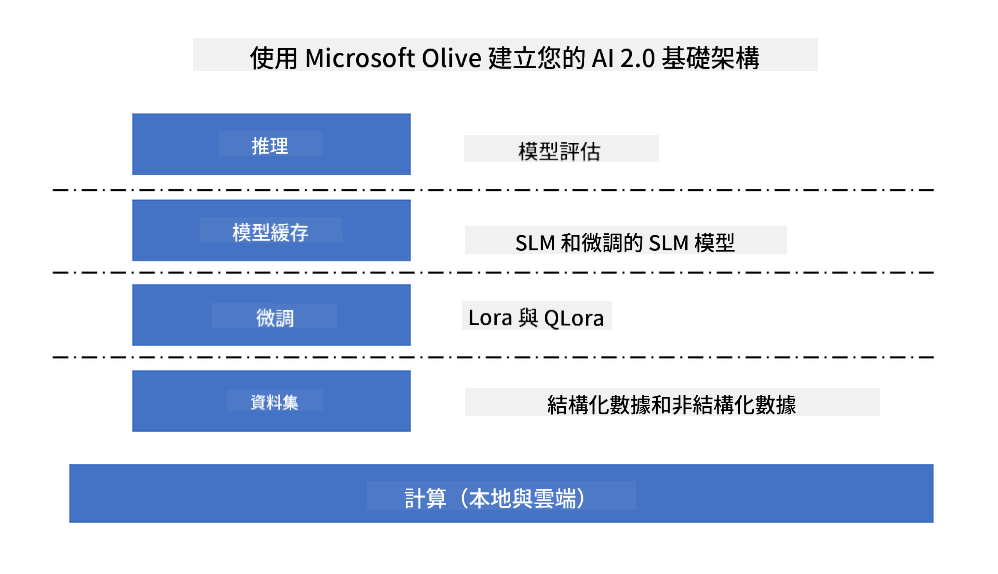
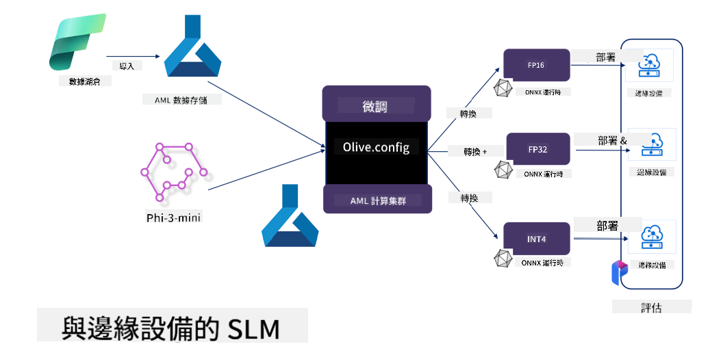

<!--
CO_OP_TRANSLATOR_METADATA:
{
  "original_hash": "727978e690ed9c055f594a4bfe01d75c",
  "translation_date": "2025-04-04T07:01:42+00:00",
  "source_file": "md\\03.FineTuning\\FineTuning_MicrosoftOlive.md",
  "language_code": "tw"
}
-->
# **使用 Microsoft Olive 微調 Phi-3**

[Olive](https://github.com/microsoft/OLive?WT.mc_id=aiml-138114-kinfeylo) 是一款易於使用且硬體導向的模型優化工具，結合了業界領先的模型壓縮、優化和編譯技術。

它旨在簡化機器學習模型的優化流程，確保模型能高效地利用特定硬體架構。

無論您是在開發基於雲端的應用程式還是邊緣設備，Olive 都能幫助您輕鬆且有效地優化模型。

## 主要功能:
- Olive 集成並自動化了針對特定硬體目標的優化技術。
- 沒有單一的優化技術能適用所有場景，因此 Olive 支援擴展性，允許業界專家插入自己的優化創新。

## 降低工程成本:
- 開發者通常需要學習並使用多種硬體供應商特定的工具鏈來準備和優化訓練模型以進行部署。
- Olive 通過自動化所需硬體的優化技術，簡化了這一過程。

## 即用型的端到端優化解決方案:

透過整合和調整技術，Olive 提供了一個統一的端到端優化解決方案。
在優化模型時，會考慮到準確性和延遲等限制條件。

## 使用 Microsoft Olive 進行微調

Microsoft Olive 是一款非常易於使用的開源模型優化工具，可涵蓋生成式人工智慧領域中的微調和參考工作。只需簡單配置，結合使用開源的小型語言模型及相關執行環境（AzureML / 本地 GPU、CPU、DirectML），即可通過自動優化完成模型的微調或參考，並找到最佳模型以部署到雲端或邊緣設備。企業可以在本地或雲端構建自己的行業垂直模型。



## 使用 Microsoft Olive 微調 Phi-3 



## Phi-3 Olive 範例代碼和示例
在此示例中，您將使用 Olive 完成以下工作：

- 微調 LoRA 適配器以將短語分類為悲傷、喜悅、恐懼、驚訝。
- 將適配器的權重合併到基礎模型中。
- 將模型優化並量化為 int4。

[範例代碼](../../code/03.Finetuning/olive-ort-example/README.md)

### 安裝 Microsoft Olive

Microsoft Olive 的安裝非常簡單，並且可以針對 CPU、GPU、DirectML 和 Azure ML 進行安裝。

```bash
pip install olive-ai
```

如果您希望使用 CPU 執行 ONNX 模型，可以使用以下方法：

```bash
pip install olive-ai[cpu]
```

如果您希望使用 GPU 執行 ONNX 模型，可以使用以下方法：

```python
pip install olive-ai[gpu]
```

如果您希望使用 Azure ML，可以使用以下方法：

```python
pip install git+https://github.com/microsoft/Olive#egg=olive-ai[azureml]
```

**注意**
作業系統要求：Ubuntu 20.04 / 22.04 

### **Microsoft Olive 的 Config.json**

安裝完成後，您可以通過 Config 文件配置不同模型的設置，包括數據、計算、訓練、部署以及模型生成。

**1. 數據**

在 Microsoft Olive 上，可以支援使用本地數據和雲端數據進行訓練，並可以在設置中進行配置。

*本地數據設置*

您可以簡單地設置需要進行微調訓練的數據集，通常為 json 格式，並根據數據模板進行適配。這需要根據模型的需求進行調整（例如，適配至 Microsoft Phi-3-mini 所需的格式。如果您使用其他模型，請參考其他模型所需的微調格式進行處理）

```json

    "data_configs": [
        {
            "name": "dataset_default_train",
            "type": "HuggingfaceContainer",
            "load_dataset_config": {
                "params": {
                    "data_name": "json", 
                    "data_files":"dataset/dataset-classification.json",
                    "split": "train"
                }
            },
            "pre_process_data_config": {
                "params": {
                    "dataset_type": "corpus",
                    "text_cols": [
                            "phrase",
                            "tone"
                    ],
                    "text_template": "### Text: {phrase}\n### The tone is:\n{tone}",
                    "corpus_strategy": "join",
                    "source_max_len": 2048,
                    "pad_to_max_len": false,
                    "use_attention_mask": false
                }
            }
        }
    ],
```

**雲端數據來源設置**

通過連結 Azure AI Studio/Azure Machine Learning Service 的數據存儲，可以將雲端中的數據引入。您可以選擇通過 Microsoft Fabric 和 Azure Data 將不同的數據源引入 Azure AI Studio/Azure Machine Learning Service，作為微調數據的支援。

```json

    "data_configs": [
        {
            "name": "dataset_default_train",
            "type": "HuggingfaceContainer",
            "load_dataset_config": {
                "params": {
                    "data_name": "json", 
                    "data_files": {
                        "type": "azureml_datastore",
                        "config": {
                            "azureml_client": {
                                "subscription_id": "Your Azure Subscrition ID",
                                "resource_group": "Your Azure Resource Group",
                                "workspace_name": "Your Azure ML Workspaces name"
                            },
                            "datastore_name": "workspaceblobstore",
                            "relative_path": "Your train_data.json Azure ML Location"
                        }
                    },
                    "split": "train"
                }
            },
            "pre_process_data_config": {
                "params": {
                    "dataset_type": "corpus",
                    "text_cols": [
                            "Question",
                            "Best Answer"
                    ],
                    "text_template": "<|user|>\n{Question}<|end|>\n<|assistant|>\n{Best Answer}\n<|end|>",
                    "corpus_strategy": "join",
                    "source_max_len": 2048,
                    "pad_to_max_len": false,
                    "use_attention_mask": false
                }
            }
        }
    ],
    
```

**2. 計算配置**

如果需要使用本地環境，可以直接使用本地數據資源。如果需要使用 Azure AI Studio / Azure Machine Learning Service 的資源，則需要配置相關的 Azure 參數、計算資源名稱等。

```json

    "systems": {
        "aml": {
            "type": "AzureML",
            "config": {
                "accelerators": ["gpu"],
                "hf_token": true,
                "aml_compute": "Your Azure AI Studio / Azure Machine Learning Service Compute Name",
                "aml_docker_config": {
                    "base_image": "Your Azure AI Studio / Azure Machine Learning Service docker",
                    "conda_file_path": "conda.yaml"
                }
            }
        },
        "azure_arc": {
            "type": "AzureML",
            "config": {
                "accelerators": ["gpu"],
                "aml_compute": "Your Azure AI Studio / Azure Machine Learning Service Compute Name",
                "aml_docker_config": {
                    "base_image": "Your Azure AI Studio / Azure Machine Learning Service docker",
                    "conda_file_path": "conda.yaml"
                }
            }
        }
    },
```

***注意***

由於通過容器在 Azure AI Studio/Azure Machine Learning Service 上運行，所需的環境需要進行配置。這是在 conda.yaml 環境中配置的。

```yaml

name: project_environment
channels:
  - defaults
dependencies:
  - python=3.8.13
  - pip=22.3.1
  - pip:
      - einops
      - accelerate
      - azure-keyvault-secrets
      - azure-identity
      - bitsandbytes
      - datasets
      - huggingface_hub
      - peft
      - scipy
      - sentencepiece
      - torch>=2.2.0
      - transformers
      - git+https://github.com/microsoft/Olive@jiapli/mlflow_loading_fix#egg=olive-ai[gpu]
      - --extra-index-url https://aiinfra.pkgs.visualstudio.com/PublicPackages/_packaging/ORT-Nightly/pypi/simple/ 
      - ort-nightly-gpu==1.18.0.dev20240307004
      - --extra-index-url https://aiinfra.pkgs.visualstudio.com/PublicPackages/_packaging/onnxruntime-genai/pypi/simple/
      - onnxruntime-genai-cuda

    

```

**3. 選擇您的 SLM**

您可以直接使用 Hugging Face 上的模型，也可以直接結合 Azure AI Studio / Azure Machine Learning 的模型目錄選擇要使用的模型。在下面的代碼示例中，我們將使用 Microsoft Phi-3-mini 作為示例。

如果您有本地模型，可以使用以下方法：

```json

    "input_model":{
        "type": "PyTorchModel",
        "config": {
            "hf_config": {
                "model_name": "model-cache/microsoft/phi-3-mini",
                "task": "text-generation",
                "model_loading_args": {
                    "trust_remote_code": true
                }
            }
        }
    },
```

如果您希望使用 Azure AI Studio / Azure Machine Learning Service 上的模型，可以使用以下方法：

```json

    "input_model":{
        "type": "PyTorchModel",
        "config": {
            "model_path": {
                "type": "azureml_registry_model",
                "config": {
                    "name": "microsoft/Phi-3-mini-4k-instruct",
                    "registry_name": "azureml-msr",
                    "version": "11"
                }
            },
             "model_file_format": "PyTorch.MLflow",
             "hf_config": {
                "model_name": "microsoft/Phi-3-mini-4k-instruct",
                "task": "text-generation",
                "from_pretrained_args": {
                    "trust_remote_code": true
                }
            }
        }
    },
```

**注意:**
我們需要與 Azure AI Studio / Azure Machine Learning Service 集成，因此在設置模型時，請參考版本號及相關命名。

Azure 上的所有模型都需要設置為 PyTorch.MLflow。

您需要擁有 Hugging Face 帳號，並將密鑰綁定至 Azure AI Studio / Azure Machine Learning 的 Key 值。

**4. 演算法**

Microsoft Olive 對 Lora 和 QLora 微調演算法進行了良好的封裝。您只需要配置一些相關參數。以下以 QLora 為例。

```json
        "lora": {
            "type": "LoRA",
            "config": {
                "target_modules": [
                    "o_proj",
                    "qkv_proj"
                ],
                "double_quant": true,
                "lora_r": 64,
                "lora_alpha": 64,
                "lora_dropout": 0.1,
                "train_data_config": "dataset_default_train",
                "eval_dataset_size": 0.3,
                "training_args": {
                    "seed": 0,
                    "data_seed": 42,
                    "per_device_train_batch_size": 1,
                    "per_device_eval_batch_size": 1,
                    "gradient_accumulation_steps": 4,
                    "gradient_checkpointing": false,
                    "learning_rate": 0.0001,
                    "num_train_epochs": 3,
                    "max_steps": 10,
                    "logging_steps": 10,
                    "evaluation_strategy": "steps",
                    "eval_steps": 187,
                    "group_by_length": true,
                    "adam_beta2": 0.999,
                    "max_grad_norm": 0.3
                }
            }
        },
```

如果需要進行量化轉換，Microsoft Olive 主分支已支援 onnxruntime-genai 方法。您可以根據需要進行設置：

1. 將適配器權重合併到基礎模型中。
2. 使用 ModelBuilder 將模型轉換為所需精度的 ONNX 模型，例如轉換為量化的 INT4。

```json

        "merge_adapter_weights": {
            "type": "MergeAdapterWeights"
        },
        "builder": {
            "type": "ModelBuilder",
            "config": {
                "precision": "int4"
            }
        }
```

**注意** 
- 如果使用 QLoRA，目前不支援 ONNXRuntime-genai 的量化轉換。

- 需要注意的是，您可以根據自己的需求設置上述步驟。並非必須完全配置所有步驟。根據需求，您可以直接使用演算法的步驟而不進行微調。最後，您需要配置相關的引擎。

```json

    "engine": {
        "log_severity_level": 0,
        "host": "aml",
        "target": "aml",
        "search_strategy": false,
        "execution_providers": ["CUDAExecutionProvider"],
        "cache_dir": "../model-cache/models/phi3-finetuned/cache",
        "output_dir" : "../model-cache/models/phi3-finetuned"
    }
```

**5. 完成微調**

在命令行中，於 olive-config.json 的目錄中執行：

```bash
olive run --config olive-config.json  
```

**免責聲明**：  
本文檔使用 AI 翻譯服務 [Co-op Translator](https://github.com/Azure/co-op-translator) 進行翻譯。雖然我們努力確保翻譯的準確性，但請注意，自動翻譯可能會包含錯誤或不準確之處。原始語言的文件應被視為具有權威性的來源。對於關鍵信息，建議使用專業人工翻譯。我們對因使用此翻譯而引起的任何誤解或錯誤解釋不承擔責任。