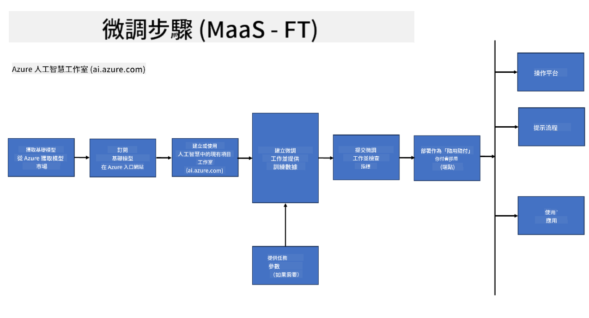

<!--
CO_OP_TRANSLATOR_METADATA:
{
  "original_hash": "cd52a3c9a424a77d2ec0470770c93846",
  "translation_date": "2025-04-04T07:12:37+00:00",
  "source_file": "md\\03.FineTuning\\FineTuning_Scenarios.md",
  "language_code": "tw"
}
-->
## 微調情境

**平台** 包括 Azure AI Foundry、Azure Machine Learning、AI 工具、Kaito 和 ONNX Runtime 等多種技術。

**基礎架構** 包括 CPU 和 FPGA，這些是微調過程中的重要組成部分。以下是每種技術的圖示。

**工具與框架** 包括 ONNX Runtime 和 ONNX Runtime。以下是每種技術的圖示。
[插入 ONNX Runtime 和 ONNX Runtime 的圖示]

使用 Microsoft 技術進行微調過程涉及多種元件和工具。透過了解並運用這些技術，我們可以有效地微調應用程式並創造更佳的解決方案。

## 模型即服務

使用託管微調進行模型微調，無需自行建立和管理計算資源。

Phi-3-mini 和 Phi-3-medium 模型提供無伺服器微調功能，使開發者能快速輕鬆地為雲端和邊緣場景自訂模型，無需安排計算資源。我們也宣布 Phi-3-small 現已透過模型即服務的方式提供，讓開發者能快速輕鬆地開始 AI 開發，而不必管理底層基礎架構。

## 模型即平台

用戶自行管理計算資源以微調模型。

[微調範例](https://github.com/Azure/azureml-examples/blob/main/sdk/python/foundation-models/system/finetune/chat-completion/chat-completion.ipynb)

## 微調情境

| | | | | | | |
|-|-|-|-|-|-|-|
|情境|LoRA|QLoRA|PEFT|DeepSpeed|ZeRO|DORA|
|將預訓練的 LLM 調整至特定任務或領域|是|是|是|是|是|是|
|針對 NLP 任務進行微調，例如文本分類、命名實體識別和機器翻譯|是|是|是|是|是|是|
|針對 QA 任務進行微調|是|是|是|是|是|是|
|針對聊天機器人生成類似人類的回應進行微調|是|是|是|是|是|是|
|針對音樂、藝術或其他形式的創作進行微調|是|是|是|是|是|是|
|降低計算和財務成本|是|是|否|是|是|否|
|降低記憶體使用量|否|是|否|是|是|是|
|使用較少的參數進行高效微調|否|是|是|否|否|是|
|記憶體高效的數據並行形式，可使用所有 GPU 設備的總 GPU 記憶體|否|否|否|是|是|是|

## 微調效能範例

**免責聲明**：  
本文檔使用 AI 翻譯服務 [Co-op Translator](https://github.com/Azure/co-op-translator) 進行翻譯。我們努力確保翻譯的準確性，但請注意，自動翻譯可能會包含錯誤或不準確之處。應以原文檔的母語版本作為權威來源。對於關鍵信息，建議尋求專業人工翻譯。我們對因使用此翻譯而引起的任何誤解或錯誤解釋不承擔責任。