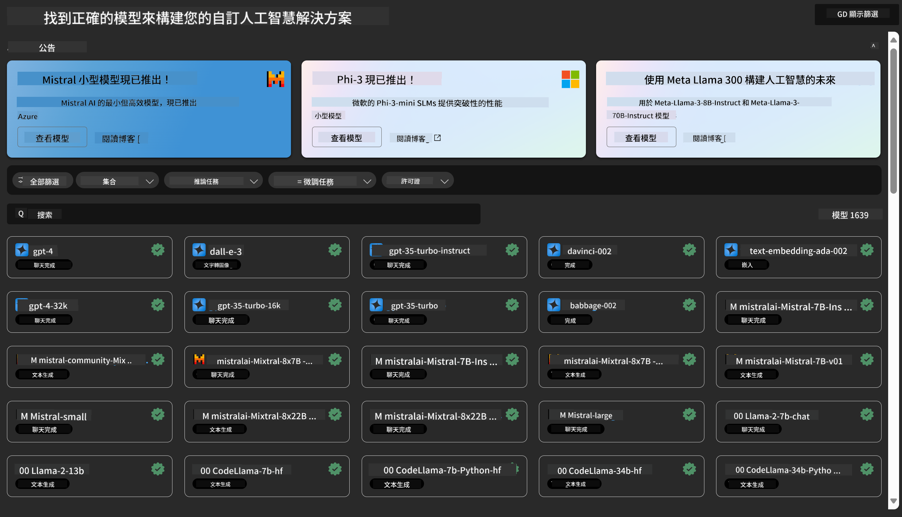
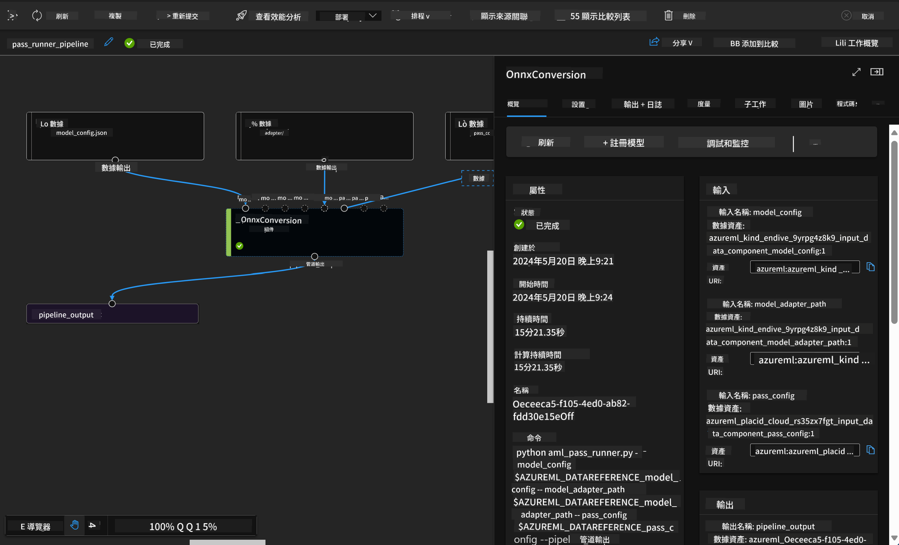

<!--
CO_OP_TRANSLATOR_METADATA:
{
  "original_hash": "315566447513c4c6215ea5a004315e4f",
  "translation_date": "2025-04-04T07:17:04+00:00",
  "source_file": "md\\03.FineTuning\\Introduce_AzureML.md",
  "language_code": "tw"
}
-->
# **介紹 Azure Machine Learning Service**

[Azure Machine Learning](https://ml.azure.com?WT.mc_id=aiml-138114-kinfeylo) 是一項雲端服務，用於加速和管理機器學習（ML）專案的生命週期。

ML 專家、資料科學家和工程師可以在日常工作流程中使用它來：

- 訓練和部署模型。
- 管理機器學習操作（MLOps）。
- 您可以在 Azure Machine Learning 中建立模型，也可以使用基於開源平台（例如 PyTorch、TensorFlow 或 scikit-learn）建立的模型。
- MLOps 工具幫助您監控、重新訓練和重新部署模型。

## Azure Machine Learning 的目標使用者

**資料科學家和 ML 工程師**

他們可以使用工具來加速和自動化日常工作流程。  
Azure ML 提供公平性、可解釋性、追蹤性和審核性的功能。

**應用程式開發者**

他們可以無縫地將模型整合到應用程式或服務中。

**平台開發者**

他們可以使用由穩健的 Azure Resource Manager API 支援的一整套工具。  
這些工具可以用於構建進階的 ML 工具。

**企業**

在 Microsoft Azure 雲端中運行的企業可受益於熟悉的安全性和基於角色的存取控制。  
設置專案以控制對受保護資料和特定操作的存取。

## 提升團隊每位成員的生產力  
ML 專案通常需要具有多樣化技能的團隊來構建和維護。

Azure ML 提供工具，使您能夠：  
- 透過共享的筆記本、計算資源、無伺服器計算、資料和環境與團隊協作。  
- 開發具有公平性、可解釋性、追蹤性和審核性的模型，以滿足來源追蹤和審核合規要求。  
- 快速且輕鬆地大規模部署 ML 模型，並使用 MLOps 高效地管理和治理它們。  
- 透過內建的治理、安全性和合規性，隨時隨地運行機器學習工作負載。

## 跨平台工具的兼容性  

ML 團隊中的任何人都可以使用自己喜歡的工具完成工作。  
無論是進行快速實驗、超參數調整、構建管線還是管理推理，您都可以使用熟悉的介面，包括：  
- Azure Machine Learning Studio  
- Python SDK (v2)  
- Azure CLI (v2)  
- Azure Resource Manager REST APIs  

在改進模型並在開發週期中協作時，您可以在 Azure Machine Learning Studio 的 UI 中共享並找到資產、資源和指標。

## **Azure ML 中的 LLM/SLM**

Azure ML 增加了許多與 LLM/SLM 相關的功能，結合 LLMOps 和 SLMOps，打造企業級生成式人工智慧技術平台。

### **模型目錄**

企業用戶可以根據不同的業務場景通過模型目錄部署不同的模型，並以 Model as Service 的形式提供服務，供企業開發者或用戶存取。

Azure Machine Learning Studio 中的模型目錄是探索和使用各種模型的中心，可幫助您構建生成式 AI 應用程式。模型目錄提供數百種模型，涵蓋多個模型提供商，例如 Azure OpenAI Service、Mistral、Meta、Cohere、Nvidia、Hugging Face，以及 Microsoft 訓練的模型。來自 Microsoft 以外提供商的模型屬於非 Microsoft 產品，根據 Microsoft 的產品條款進行定義，並受模型附帶的條款約束。

### **任務管線**

機器學習管線的核心是將完整的機器學習任務拆分為多步驟的工作流程。每個步驟都是可管理的組件，可以單獨開發、優化、配置和自動化。步驟通過明確定義的介面相連。Azure Machine Learning 管線服務會自動協調管線步驟之間的所有依賴關係。

在微調 SLM / LLM 時，我們可以通過管線管理我們的資料、訓練和生成過程。

### **Prompt flow**

使用 Azure Machine Learning Prompt flow 的好處  
Azure Machine Learning Prompt flow 提供一系列幫助用戶從構思到實驗，最終構建可投入生產的基於 LLM 應用程式的好處：

**Prompt 工程的靈活性**

互動式編輯體驗：Azure Machine Learning Prompt flow 提供流結構的可視化表示，讓用戶可以輕鬆理解和導航其專案。它還提供類似筆記本的編碼體驗，以提高流開發和除錯效率。  
Prompt 調整的變體：用戶可以創建和比較多個 Prompt 變體，促進迭代改進過程。  

評估：內建的評估流使用戶能夠評估 Prompt 和流的質量與效果。  

全面資源：Azure Machine Learning Prompt flow 包括內建工具、範例和模板的庫，為開發提供起點，激發創造力並加速過程。

**基於 LLM 應用程式的企業級準備**

協作：Azure Machine Learning Prompt flow 支援團隊協作，允許多位用戶共同參與 Prompt 工程專案，分享知識並維護版本控制。  

一站式平台：Azure Machine Learning Prompt flow 簡化了整個 Prompt 工程過程，從開發和評估到部署和監控。用戶可以輕鬆地將流部署為 Azure Machine Learning 端點，並實時監控其性能，確保最佳運行和持續改進。  

Azure Machine Learning 的企業級解決方案：Prompt flow 利用 Azure Machine Learning 的強大企業級解決方案，提供安全、可擴展且可靠的基礎，用於流的開發、實驗和部署。

通過 Azure Machine Learning Prompt flow，用戶可以釋放 Prompt 工程的靈活性，高效協作，並利用企業級解決方案，成功開發和部署基於 LLM 的應用程式。

結合 Azure ML 的計算能力、資料和不同組件，企業開發者可以輕鬆構建自己的人工智慧應用程式。

**免責聲明**：  
本文檔使用AI翻譯服務 [Co-op Translator](https://github.com/Azure/co-op-translator) 進行翻譯。我們致力於提高準確性，但請注意，自動翻譯可能包含錯誤或不精確之處。原文檔的母語版本應被視為權威來源。對於關鍵信息，建議使用專業人工翻譯。我們對因使用此翻譯而引起的任何誤解或錯誤解釋不承擔責任。