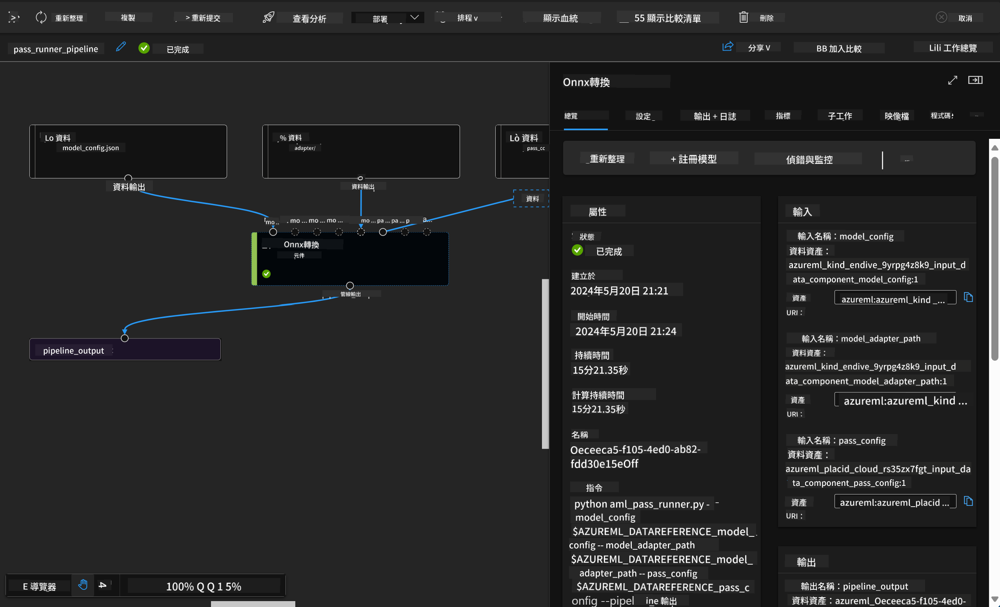

<!--
CO_OP_TRANSLATOR_METADATA:
{
  "original_hash": "7fe541373802e33568e94e13226d463c",
  "translation_date": "2025-05-08T05:18:11+00:00",
  "source_file": "md/03.FineTuning/Introduce_AzureML.md",
  "language_code": "tw"
}
-->
# **介紹 Azure Machine Learning Service**

[Azure Machine Learning](https://ml.azure.com?WT.mc_id=aiml-138114-kinfeylo) 是一個雲端服務，用來加速並管理機器學習（ML）專案的整個生命週期。

ML 專業人士、資料科學家與工程師可以在日常工作流程中使用它來：

- 訓練與部署模型。
- 管理機器學習運營（MLOps）。
- 你可以在 Azure Machine Learning 裡建立模型，或使用來自開源平台如 PyTorch、TensorFlow 或 scikit-learn 所建立的模型。
- MLOps 工具幫助你監控、重新訓練與重新部署模型。

## Azure Machine Learning 適合誰？

**資料科學家與 ML 工程師**

他們可以使用工具來加速與自動化日常工作流程。  
Azure ML 提供公平性、可解釋性、追蹤與審計功能。

**應用程式開發者**  
可以輕鬆將模型整合進應用程式或服務中。

**平台開發者**

他們可使用由持久 Azure Resource Manager API 支持的強大工具組。  
這些工具讓他們能建構進階的 ML 工具。

**企業**

在 Microsoft Azure 雲端工作，企業可享受熟悉的安全性與基於角色的存取控制。  
可設定專案以控制對受保護資料與特定操作的存取權限。

## 團隊中每個人的生產力

ML 專案通常需要多元技能的團隊來建置與維護。

Azure ML 提供的工具讓你能：

- 透過共用筆記本、運算資源、無伺服器運算、資料與環境與團隊協作。
- 開發具公平性、可解釋性、追蹤與審計功能的模型，以符合血緣與稽核合規需求。
- 快速且輕鬆地大規模部署 ML 模型，並透過 MLOps 有效管理與治理它們。
- 在任何地方執行機器學習工作負載，並具備內建治理、安全與合規性。

## 跨平台相容工具

ML 團隊中的任何人都可以使用自己習慣的工具完成工作。  
無論你是在執行快速實驗、超參數調整、建立管線或管理推論，都可以使用熟悉的介面，包括：

- Azure Machine Learning Studio  
- Python SDK (v2)  
- Azure CLI (v2)  
- Azure Resource Manager REST APIs  

在你精進模型並在開發週期中協作時，可以在 Azure Machine Learning Studio UI 中分享與尋找資產、資源與指標。

## **Azure ML 中的 LLM/SLM**

Azure ML 新增了許多與 LLM/SLM 相關的功能，結合 LLMOps 與 SLMOps，打造企業級的生成式人工智慧技術平台。

### **模型目錄**

企業用戶可透過模型目錄，依不同商業場景部署不同模型，並提供模型即服務（Model as Service），讓企業開發者或使用者存取。

Azure Machine Learning Studio 中的模型目錄是探索與使用多樣模型的中心，讓你能建立生成式 AI 應用。模型目錄涵蓋數百種模型，來自 Azure OpenAI 服務、Mistral、Meta、Cohere、Nvidia、Hugging Face 等模型供應商，包括微軟訓練的模型。非微軟供應商的模型為非微軟產品，依微軟產品條款定義，並受模型附帶條款約束。

### **工作管線**

機器學習管線的核心是將完整的機器學習任務拆分成多步驟工作流程。每個步驟都是可管理的元件，可以獨立開發、優化、配置與自動化。步驟之間透過明確定義的介面連接。Azure Machine Learning 管線服務會自動協調所有管線步驟間的依賴關係。

在微調 SLM / LLM 時，我們可以透過管線管理資料、訓練與生成流程。

### **Prompt flow**

使用 Azure Machine Learning prompt flow 的好處  
Azure Machine Learning prompt flow 提供一系列優勢，幫助使用者從構思到實驗，最終達成生產就緒的基於 LLM 的應用：

**Prompt 工程靈活性**

互動式撰寫體驗：Azure Machine Learning prompt flow 提供流程結構的視覺化呈現，讓使用者輕鬆理解與導覽專案，也提供類筆記本的編碼體驗，方便流程開發與除錯。  
Prompt 調整變體：使用者可以建立並比較多個 prompt 變體，促進反覆精進。

評估：內建評估流程讓使用者能評估 prompt 與流程的品質與效果。

豐富資源：Azure Machine Learning prompt flow 包含內建工具庫、範例與範本，作為開發起點，激發創意並加速流程。

**企業級 LLM 應用準備**

協作：Azure Machine Learning prompt flow 支援團隊協作，讓多位使用者共同參與 prompt 工程專案，分享知識並維護版本控制。

一站式平台：Azure Machine Learning prompt flow 簡化整個 prompt 工程流程，從開發、評估到部署與監控。使用者可輕鬆將流程部署為 Azure Machine Learning 端點，並即時監控其效能，確保最佳運作與持續改進。

Azure Machine Learning 企業就緒解決方案：Prompt flow 利用 Azure Machine Learning 強大的企業就緒解決方案，提供安全、可擴展且可靠的基礎，支援流程的開發、實驗與部署。

透過 Azure Machine Learning prompt flow，使用者能釋放 prompt 工程靈活性，有效協作，並利用企業級解決方案，成功開發與部署基於 LLM 的應用。

結合 Azure ML 的運算能力、資料與不同元件，企業開發者能輕鬆打造自家的人工智慧應用。

**免責聲明**：  
本文件係使用 AI 翻譯服務 [Co-op Translator](https://github.com/Azure/co-op-translator) 進行翻譯。雖然我們努力追求準確性，但請注意自動翻譯可能包含錯誤或不精確之處。原始文件的母語版本應視為權威來源。對於重要資訊，建議採用專業人工翻譯。我們不對因使用本翻譯而產生的任何誤解或誤釋負責。