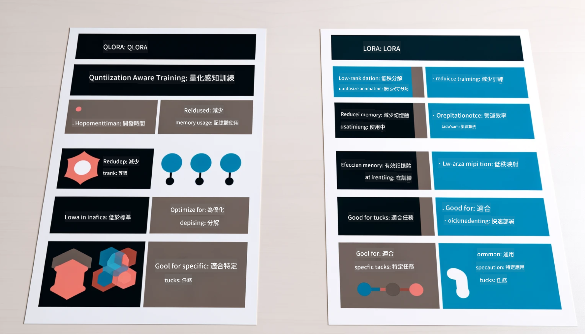

<!--
CO_OP_TRANSLATOR_METADATA:
{
  "original_hash": "ef0e3b9f4e65cc05e80efb30723aed40",
  "translation_date": "2025-04-04T07:18:22+00:00",
  "source_file": "md\\03.FineTuning\\LetPhi3gotoIndustriy.md",
  "language_code": "tw"
}
-->
# **讓 Phi-3 成為產業專家**

要將 Phi-3 模型應用到某個產業中，需要為 Phi-3 模型加入該產業的業務數據。我們有兩種不同的選擇，第一種是 RAG（檢索增強生成），第二種是微調。

## **RAG vs 微調**

### **檢索增強生成**

RAG 是數據檢索加文本生成。企業的結構化數據和非結構化數據會存儲在向量數據庫中。在搜索相關內容時，能找到相關摘要和內容來形成上下文，並結合 LLM/SLM 的文本補全能力來生成內容。

### **微調**

微調是基於某個模型的改進，它不需要從模型算法開始，但需要不斷累積數據。如果在產業應用中需要更精準的術語和語言表達，微調會是更好的選擇。但如果數據變化頻繁，微調可能會變得很複雜。

### **如何選擇**

1. 如果我們的答案需要引入外部數據，RAG 是最佳選擇。

2. 如果需要輸出穩定且精確的行業知識，微調會是更好的選擇。RAG 優先檢索相關內容，但可能無法完全捕捉到專業細節。

3. 微調需要高質量的數據集，如果只是小範圍的數據，效果不會有太大差異。RAG 更具靈活性。

4. 微調是一個黑盒子，帶有一些玄學，難以理解其內部機制。但 RAG 可以更容易追溯數據來源，從而有效地調整幻覺或內容錯誤，並提供更好的透明度。

### **場景**

1. 垂直行業需要特定的專業術語和表達，***微調*** 是最佳選擇。

2. 問答系統，涉及不同知識點的綜合，***RAG*** 是最佳選擇。

3. 結合自動化業務流程，***RAG + 微調*** 是最佳選擇。

## **如何使用 RAG**

向量數據庫是一種以數學形式存儲數據的集合。向量數據庫使機器學習模型更容易記住之前的輸入，從而支持搜索、推薦和文本生成等應用場景。數據可以基於相似性指標進行識別，而不是完全匹配，使得計算機模型能理解數據的上下文。

向量數據庫是實現 RAG 的關鍵。我們可以通過像 text-embedding-3、jina-ai-embedding 等向量模型將數據轉換為向量存儲。

了解更多如何創建 RAG 應用：[https://github.com/microsoft/Phi-3CookBook](https://github.com/microsoft/Phi-3CookBook?WT.mc_id=aiml-138114-kinfeylo)

## **如何使用微調**

微調中常用的算法有 Lora 和 QLora。如何選擇？
- [透過此範例筆記本了解更多](../../../../code/04.Finetuning/Phi_3_Inference_Finetuning.ipynb)
- [Python 微調範例](../../../../code/04.Finetuning/FineTrainingScript.py)

### **Lora 和 QLora**

LoRA（低秩適配）和 QLoRA（量化低秩適配）是兩種用於微調大型語言模型（LLMs）的技術，採用參數高效微調（PEFT）。PEFT 技術旨在比傳統方法更高效地訓練模型。

LoRA 是一種獨立的微調技術，通過對權重更新矩陣應用低秩近似來減少記憶體佔用。它提供快速的訓練時間，且性能接近傳統微調方法。

QLoRA 是 LoRA 的擴展版本，結合了量化技術進一步減少記憶體使用。QLoRA 將預訓練 LLM 的權重參數量化為 4 位精度，比 LoRA 更節省記憶體。然而，由於額外的量化和反量化步驟，QLoRA 的訓練速度比 LoRA 慢約 30%。

QLoRA 使用 LoRA 作為輔助工具來修正量化過程中引入的誤差。QLoRA 使得擁有數十億參數的超大型模型能在相對小型且易獲得的 GPU 上進行微調。例如，QLoRA 可以用僅 2 個 GPU 微調需要 36 個 GPU 的 70B 參數模型。

**免責聲明**：  
本文件使用 AI 翻譯服務 [Co-op Translator](https://github.com/Azure/co-op-translator) 進行翻譯。我們致力於提供準確的翻譯，但請注意，機器翻譯可能包含錯誤或不精確之處。應以原始語言的文件作為權威來源。對於關鍵資訊，建議尋求專業的人工翻譯。我們不對因使用本翻譯而引起的任何誤解或錯誤解釋承擔責任。