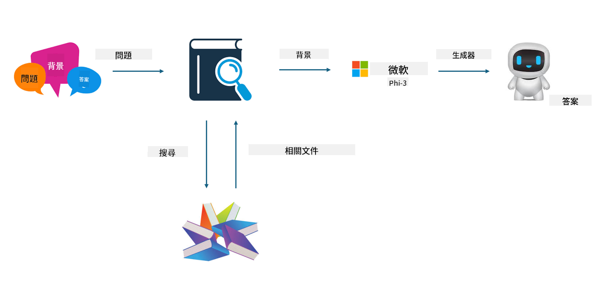

<!--
CO_OP_TRANSLATOR_METADATA:
{
  "original_hash": "743d7e9cb9c4e8ea642d77bee657a7fa",
  "translation_date": "2025-05-08T05:19:51+00:00",
  "source_file": "md/03.FineTuning/LetPhi3gotoIndustriy.md",
  "language_code": "tw"
}
-->
# **讓 Phi-3 成為產業專家**

要將 Phi-3 模型應用到產業中，需要將產業的商業數據加入 Phi-3 模型。我們有兩種不同的選擇，第一是 RAG（檢索增強生成），第二是微調（Fine Tuning）。

## **RAG 與微調比較**

### **檢索增強生成**

RAG 是資料檢索加上文本生成。企業的結構化資料與非結構化資料會存放在向量資料庫中。當搜尋相關內容時，會找到相關摘要與內容組成上下文，再結合 LLM/SLM 的文本補全能力來生成內容。

### **微調**

微調是基於某個模型的改進。它不需要從模型演算法開始，但需要持續累積資料。如果想在產業應用中有更精準的專業術語和語言表達，微調會是更好的選擇。但如果資料變動頻繁，微調可能會變得複雜。

### **如何選擇**

1. 如果回答需要導入外部資料，RAG 是最佳選擇

2. 如果需要輸出穩定且精確的產業知識，微調會是好選擇。RAG 優先拉取相關內容，但不一定能完全掌握專業細節。

3. 微調需要高品質資料集，如果資料量很小，效果不大。RAG 較有彈性

4. 微調像是黑箱、玄學，內部機制難以理解。但 RAG 可以更容易找到資料來源，有效調整幻覺或內容錯誤，提供更好的透明度。

### **應用場景**

1. 垂直產業需要特定專業詞彙與表達，***微調*** 是最佳選擇

2. QA 系統，涉及不同知識點綜合，***RAG*** 是最佳選擇

3. 自動化業務流程結合 ***RAG + 微調*** 是最佳選擇

## **如何使用 RAG**

向量資料庫是以數學形式儲存資料的集合。向量資料庫讓機器學習模型更容易記住之前的輸入，使機器學習能應用於搜尋、推薦和文本生成等場景。資料可根據相似度指標辨識，而非完全匹配，讓模型能理解資料的上下文。

向量資料庫是實現 RAG 的關鍵。我們可以透過 text-embedding-3、jina-ai-embedding 等向量模型將資料轉成向量儲存。

想了解更多如何建立 RAG 應用，請參考 [https://github.com/microsoft/Phi-3CookBook](https://github.com/microsoft/Phi-3CookBook?WT.mc_id=aiml-138114-kinfeylo)

## **如何使用微調**

微調常用的演算法有 Lora 與 QLora。如何選擇？
- [透過此範例筆記本了解更多](../../../../code/04.Finetuning/Phi_3_Inference_Finetuning.ipynb)
- [Python 微調範例示範](../../../../code/04.Finetuning/FineTrainingScript.py)

### **Lora 與 QLora**

LoRA（低秩調整）與 QLoRA（量化低秩調整）都是利用參數高效微調（PEFT）技術來微調大型語言模型（LLM）的方法。PEFT 技術能比傳統方法更有效率地訓練模型。

LoRA 是獨立的微調技術，透過對權重更新矩陣做低秩近似，減少記憶體占用。它訓練速度快，且效能接近傳統微調方法。

QLoRA 是 LoRA 的延伸版本，結合量化技術進一步降低記憶體使用。QLoRA 將預訓練 LLM 的權重參數量化到 4-bit 精度，比 LoRA 更省記憶體。不過因為多了量化與反量化步驟，QLoRA 的訓練速度比 LoRA 慢約 30%。

QLoRA 使用 LoRA 作為輔助，修正量化帶來的誤差。QLoRA 讓數十億參數的巨型模型可以在相對小型且容易取得的 GPU 上進行微調。例如，QLoRA 可以微調需要 36 張 GPU 的 70B 參數模型，只需 2 張 GPU 即可完成。

**免責聲明**：  
本文件係使用 AI 翻譯服務 [Co-op Translator](https://github.com/Azure/co-op-translator) 進行翻譯。雖然我們努力確保翻譯的準確性，但請注意，自動翻譯可能包含錯誤或不準確之處。原始文件的母語版本應視為權威來源。對於重要資訊，建議採用專業人工翻譯。我們不對因使用本翻譯所產生的任何誤解或誤譯負責。