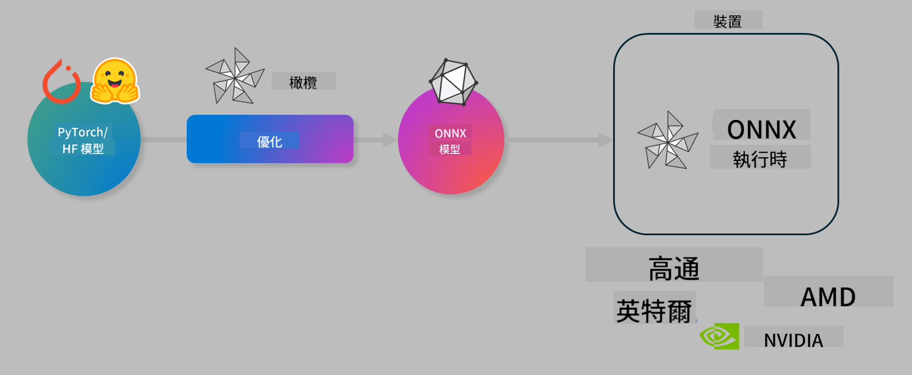

<!--
CO_OP_TRANSLATOR_METADATA:
{
  "original_hash": "76956c0c22e5686908a6d85ec72126af",
  "translation_date": "2025-04-04T07:20:23+00:00",
  "source_file": "md\\03.FineTuning\\olive-lab\\readme.md",
  "language_code": "tw"
}
-->
# 實驗：優化 AI 模型以進行設備端推論

## 介紹

> [!IMPORTANT]
> 此實驗需要安裝 **Nvidia A10 或 A100 GPU** 及其相關驅動程式和 CUDA 工具包（版本 12+）。

> [!NOTE]
> 這是一個 **35 分鐘** 的實驗，將帶領您動手了解使用 OLIVE 優化模型以進行設備端推論的核心概念。

## 學習目標

完成此實驗後，您將能使用 OLIVE：

- 使用 AWQ 量化方法對 AI 模型進行量化。
- 為特定任務微調 AI 模型。
- 生成 LoRA 配接器（微調模型），以便在 ONNX Runtime 上進行高效的設備端推論。

### 什麼是 Olive

Olive (*O*NNX *live*) 是一款模型優化工具包，配有 CLI，可幫助您為 ONNX Runtime +++https://onnxruntime.ai+++ 部署模型，並提供高品質和性能。



Olive 的輸入通常是 PyTorch 或 Hugging Face 模型，輸出則是經過優化的 ONNX 模型，可在運行 ONNX Runtime 的設備（部署目標）上執行。Olive 會根據硬件供應商（如 Qualcomm、AMD、Nvidia 或 Intel）提供的 AI 加速器（NPU、GPU、CPU）優化模型以適應部署目標。

Olive 執行 *工作流*，即一系列按順序排列的模型優化任務，稱為 *passes*。示例任務包括：模型壓縮、圖捕捉、量化、圖優化。每個任務都有一組可調參數，用於達到最佳的指標（如準確性和延遲），這些指標由相應的評估器進行評估。Olive 使用搜索算法來逐一或成組調整每個任務的參數。

#### Olive 的優勢

- **減少挫折感和時間成本**：避免使用試錯法手動實驗不同的圖優化、壓縮和量化技術。您只需定義品質和性能約束，Olive 會自動幫您找到最佳模型。
- **40 多個內建模型優化組件**：涵蓋量化、壓縮、圖優化和微調的前沿技術。
- **易於使用的 CLI**：用於常見模型優化任務，例如 olive quantize、olive auto-opt、olive finetune。
- 集成模型打包和部署功能。
- 支援生成 **多 LoRA 服務** 模型。
- 使用 YAML/JSON 構建工作流，協調模型優化和部署任務。
- **Hugging Face** 和 **Azure AI** 集成。
- 內建 **緩存** 機制以 **節省成本**。

## 實驗指南
> [!NOTE]
> 請確保已根據實驗 1 設置 Azure AI Hub 和專案，並配置您的 A100 計算環境。

### 步驟 0：連接至 Azure AI 計算環境

您將使用 **VS Code** 的遠程功能連接至 Azure AI 計算環境。

1. 打開您的 **VS Code** 桌面應用程式：
1. 使用 **Shift+Ctrl+P** 打開 **命令面板**。
1. 在命令面板中搜尋 **AzureML - remote: Connect to compute instance in New Window**。
1. 按屏幕指示連接至計算環境，這將涉及選擇您在實驗 1 中設置的 Azure 訂閱、資源群組、專案和計算名稱。
1. 連接至 Azure ML 計算節點後，您可以在 **VS Code 的左下角** `><Azure ML: Compute Name` 看見連接狀態。

### 步驟 1：克隆此存儲庫

在 VS Code 中，您可以使用 **Ctrl+J** 打開新終端並克隆此存儲庫：

在終端中，您應該看到提示

```
azureuser@computername:~/cloudfiles/code$ 
```
克隆解決方案

```bash
cd ~/localfiles
git clone https://github.com/microsoft/phi-3cookbook.git
```

### 步驟 2：在 VS Code 中打開文件夾

要在 VS Code 中打開相關文件夾，請在終端中執行以下命令，這將打開一個新窗口：

```bash
code phi-3cookbook/code/04.Finetuning/Olive-lab
```

或者，您可以通過選擇 **文件** > **打開文件夾** 來打開文件夾。

### 步驟 3：安裝依賴項

在 VS Code 中的 Azure AI 計算環境中打開一個終端窗口（提示：**Ctrl+J**），執行以下命令以安裝依賴項：

```bash
conda create -n olive-ai python=3.11 -y
conda activate olive-ai
pip install -r requirements.txt
az extension remove -n azure-cli-ml
az extension add -n ml
```

> [!NOTE]
> 安裝所有依賴項大約需要 5 分鐘。

在此實驗中，您將下載並上傳模型至 Azure AI 模型目錄。為了訪問模型目錄，您需要使用以下命令登錄 Azure：

```bash
az login
```

> [!NOTE]
> 登錄時，您將被要求選擇訂閱。請確保選擇實驗提供的訂閱。

### 步驟 4：執行 Olive 命令 

在 VS Code 中的 Azure AI 計算環境中打開終端窗口（提示：**Ctrl+J**），並確保已激活 `olive-ai` conda 環境：

```bash
conda activate olive-ai
```

接下來，在命令行中執行以下 Olive 命令。

1. **檢查數據：** 在此示例中，您將微調 Phi-3.5-Mini 模型，使其專門回答與旅行相關的問題。以下代碼顯示數據集的前幾條記錄，這些記錄採用 JSON 行格式：

    ```bash
    head data/data_sample_travel.jsonl
    ```
1. **量化模型：** 在訓練模型之前，您首先使用以下命令進行量化，該命令採用名為 Active Aware Quantization (AWQ) 的技術 +++https://arxiv.org/abs/2306.00978+++。AWQ 根據推論期間生成的激活值對模型權重進行量化。這意味著量化過程考慮了激活中的實際數據分佈，與傳統權重量化方法相比，能更好地保留模型的準確性。

    ```bash
    olive quantize \
       --model_name_or_path microsoft/Phi-3.5-mini-instruct \
       --trust_remote_code \
       --algorithm awq \
       --output_path models/phi/awq \
       --log_level 1
    ```
    
    AWQ 量化大約需要 **8 分鐘**，並將 **模型大小從約 7.5GB 減少到約 2.5GB**。
   
   在此實驗中，我們展示如何從 Hugging Face 輸入模型（例如：`microsoft/Phi-3.5-mini-instruct`). However, Olive also allows you to input models from the Azure AI catalog by updating the `model_name_or_path` argument to an Azure AI asset ID (for example:  `azureml://registries/azureml/models/Phi-3.5-mini-instruct/versions/4`). 

1. **Train the model:** Next, the `olive finetune` 命令微調量化模型。在微調之前進行量化，而不是之後，能獲得更好的準確性，因為微調過程能恢復一些量化導致的損失。

    ```bash
    olive finetune \
        --method lora \
        --model_name_or_path models/phi/awq \
        --data_files "data/data_sample_travel.jsonl" \
        --data_name "json" \
        --text_template "<|user|>\n{prompt}<|end|>\n<|assistant|>\n{response}<|end|>" \
        --max_steps 100 \
        --output_path ./models/phi/ft \
        --log_level 1
    ```
    
    微調大約需要 **6 分鐘**（100 步）。

1. **優化：** 模型訓練完成後，您可以使用 Olive 的 `auto-opt` command, which will capture the ONNX graph and automatically perform a number of optimizations to improve the model performance for CPU by compressing the model and doing fusions. It should be noted, that you can also optimize for other devices such as NPU or GPU by just updating the `--device` and `--provider` 參數優化模型 - 在此實驗中我們將使用 CPU。

    ```bash
    olive auto-opt \
       --model_name_or_path models/phi/ft/model \
       --adapter_path models/phi/ft/adapter \
       --device cpu \
       --provider CPUExecutionProvider \
       --use_ort_genai \
       --output_path models/phi/onnx-ao \
       --log_level 1
    ```
    
    優化過程大約需要 **5 分鐘**。

### 步驟 5：快速測試模型推論

要測試模型推論，請在您的文件夾中創建一個名為 **app.py** 的 Python 文件，並複製以下代碼：

```python
import onnxruntime_genai as og
import numpy as np

print("loading model and adapters...", end="", flush=True)
model = og.Model("models/phi/onnx-ao/model")
adapters = og.Adapters(model)
adapters.load("models/phi/onnx-ao/model/adapter_weights.onnx_adapter", "travel")
print("DONE!")

tokenizer = og.Tokenizer(model)
tokenizer_stream = tokenizer.create_stream()

params = og.GeneratorParams(model)
params.set_search_options(max_length=100, past_present_share_buffer=False)
user_input = "what is the best thing to see in chicago"
params.input_ids = tokenizer.encode(f"<|user|>\n{user_input}<|end|>\n<|assistant|>\n")

generator = og.Generator(model, params)

generator.set_active_adapter(adapters, "travel")

print(f"{user_input}")

while not generator.is_done():
    generator.compute_logits()
    generator.generate_next_token()

    new_token = generator.get_next_tokens()[0]
    print(tokenizer_stream.decode(new_token), end='', flush=True)

print("\n")
```

使用以下命令執行代碼：

```bash
python app.py
```

### 步驟 6：將模型上傳至 Azure AI

將模型上傳至 Azure AI 模型存儲庫可以使模型與開發團隊的其他成員共享，並處理模型的版本控制。要上傳模型，請執行以下命令：

> [!NOTE]
> 更新 `{}` placeholders with the name of your resource group and Azure AI Project Name. 

To find your resource group `"resourceGroup"` 和 Azure AI 專案名稱，執行以下命令

```
az ml workspace show
```

或者，您可以訪問 +++ai.azure.com+++，選擇 **管理中心** > **專案** > **概覽**。

更新 `{}` 佔位符為您的資源群組名稱和 Azure AI 專案名稱。

```bash
az ml model create \
    --name ft-for-travel \
    --version 1 \
    --path ./models/phi/onnx-ao \
    --resource-group {RESOURCE_GROUP_NAME} \
    --workspace-name {PROJECT_NAME}
```
接著，您可以在 https://ml.azure.com/model/list 查看已上傳的模型並部署模型。

**免責聲明**：  
本文件使用 AI 翻譯服務 [Co-op Translator](https://github.com/Azure/co-op-translator) 進行翻譯。儘管我們努力確保翻譯的準確性，但請注意，自動翻譯可能包含錯誤或不精確之處。原始語言的文件應被視為具權威性的來源。對於關鍵信息，建議使用專業的人工翻譯。我們對因使用本翻譯而引起的任何誤解或誤釋不承擔責任。