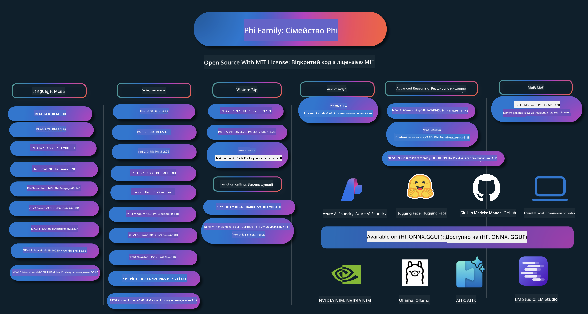

<!--
CO_OP_TRANSLATOR_METADATA:
{
  "original_hash": "ef3a50368712b1a7483d0def1f70c490",
  "translation_date": "2025-12-21T14:23:40+00:00",
  "source_file": "README.md",
  "language_code": "uk"
}
-->
# Phi Cookbook: Практичні приклади з моделями Phi від Microsoft

Phi — це серія відкритих моделей ШІ, розроблених Microsoft. 

Наразі Phi — найпотужніша та економічно ефективна мала мовна модель (SLM), з дуже хорошими результатами у багатомовності, міркуванні, генерації тексту/чатів, програмуванні, роботі з зображеннями, аудіо та інших сценаріях. 

Ви можете розгорнути Phi в хмарі або на периферійних пристроях, і легко створювати генеративні застосунки ШІ з обмеженими обчислювальними ресурсами.

Виконайте ці кроки, щоб почати використовувати ці ресурси:
1. **Зробіть форк репозиторію**: Натисніть 
2. **Клонуйте репозиторій**:   `git clone https://github.com/microsoft/PhiCookBook.git`
3. [**Приєднайтеся до спільноти Microsoft AI у Discord та зустрічайте експертів і інших розробників**](https://discord.com/invite/ByRwuEEgH4?WT.mc_id=aiml-137032-kinfeylo)

### 🌐 Підтримка декількох мов

#### Підтримується через GitHub Action (Автоматично й завжди актуально)

<!-- CO-OP TRANSLATOR LANGUAGES TABLE START -->
[Арабська](../ar/README.md) | [Бенгальська](../bn/README.md) | [Болгарська](../bg/README.md) | [Бирманська (М'янма)](../my/README.md) | [Китайська (спрощена)](../zh/README.md) | [Китайська (традиційна, Гонконг)](../hk/README.md) | [Китайська (традиційна, Макао)](../mo/README.md) | [Китайська (традиційна, Тайвань)](../tw/README.md) | [Хорватська](../hr/README.md) | [Чеська](../cs/README.md) | [Данська](../da/README.md) | [Нідерландська](../nl/README.md) | [Естонська](../et/README.md) | [Фінська](../fi/README.md) | [Французька](../fr/README.md) | [Німецька](../de/README.md) | [Грецька](../el/README.md) | [Іврит](../he/README.md) | [Гінді](../hi/README.md) | [Угорська](../hu/README.md) | [Індонезійська](../id/README.md) | [Італійська](../it/README.md) | [Японська](../ja/README.md) | [Каннада](../kn/README.md) | [Корейська](../ko/README.md) | [Литовська](../lt/README.md) | [Малайська](../ms/README.md) | [Малаялам](../ml/README.md) | [Мараті](../mr/README.md) | [Непальська](../ne/README.md) | [Нігерійський пі́джин](../pcm/README.md) | [Норвезька](../no/README.md) | [Перська (фарсі)](../fa/README.md) | [Польська](../pl/README.md) | [Португальська (Бразилія)](../br/README.md) | [Португальська (Португалія)](../pt/README.md) | [Пенджабі (гурмухі)](../pa/README.md) | [Румунська](../ro/README.md) | [Російська](../ru/README.md) | [Сербська (кирилиця)](../sr/README.md) | [Словацька](../sk/README.md) | [Словенська](../sl/README.md) | [Іспанська](../es/README.md) | [Свахілі](../sw/README.md) | [Шведська](../sv/README.md) | [Тагальська (філіппінська)](../tl/README.md) | [Тамільська](../ta/README.md) | [Телугу](../te/README.md) | [Тайська](../th/README.md) | [Турецька](../tr/README.md) | [Українська](./README.md) | [Урду](../ur/README.md) | [В'єтнамська](../vi/README.md)
<!-- CO-OP TRANSLATOR LANGUAGES TABLE END -->

## Зміст

- Вступ
  - [Ласкаво просимо у родину Phi](./md/01.Introduction/01/01.PhiFamily.md)
  - [Налаштування середовища](./md/01.Introduction/01/01.EnvironmentSetup.md)
  - [Розуміння ключових технологій](./md/01.Introduction/01/01.Understandingtech.md)
  - [Безпека ШІ для моделей Phi](./md/01.Introduction/01/01.AISafety.md)
  - [Підтримка апаратного забезпечення Phi](./md/01.Introduction/01/01.Hardwaresupport.md)
  - [Моделі Phi та доступність на різних платформах](./md/01.Introduction/01/01.Edgeandcloud.md)
  - [Використання Guidance-ai та Phi](./md/01.Introduction/01/01.Guidance.md)
  - [Моделі GitHub Marketplace](https://github.com/marketplace/models)
  - [Каталог моделей Azure AI](https://ai.azure.com)

- Інференс Phi в різних середовищах
    -  [Hugging face](./md/01.Introduction/02/01.HF.md)
    -  [GitHub Models](./md/01.Introduction/02/02.GitHubModel.md)
    -  [Azure AI Foundry Model Catalog](./md/01.Introduction/02/03.AzureAIFoundry.md)
    -  [Ollama](./md/01.Introduction/02/04.Ollama.md)
    -  [AI Toolkit VSCode (AITK)](./md/01.Introduction/02/05.AITK.md)
    -  [NVIDIA NIM](./md/01.Introduction/02/06.NVIDIA.md)
    -  [Foundry Local](./md/01.Introduction/02/07.FoundryLocal.md)

- Інференс сімейства Phi
    - [Інференс Phi на iOS](./md/01.Introduction/03/iOS_Inference.md)
    - [Інференс Phi на Android](./md/01.Introduction/03/Android_Inference.md)
    - [Інференс Phi на Jetson](./md/01.Introduction/03/Jetson_Inference.md)
    - [Інференс Phi на AI PC](./md/01.Introduction/03/AIPC_Inference.md)
    - [Інференс Phi з фреймворком Apple MLX](./md/01.Introduction/03/MLX_Inference.md)
    - [Інференс Phi на локальному сервері](./md/01.Introduction/03/Local_Server_Inference.md)
    - [Інференс Phi на віддаленому сервері з використанням AI Toolkit](./md/01.Introduction/03/Remote_Interence.md)
    - [Інференс Phi з Rust](./md/01.Introduction/03/Rust_Inference.md)
    - [Інференс Phi — Vision локально](./md/01.Introduction/03/Vision_Inference.md)
    - [Інференс Phi з Kaito AKS, Azure Containers (офіційна підтримка)](./md/01.Introduction/03/Kaito_Inference.md)
-  [Квантифікація сімейства Phi](./md/01.Introduction/04/QuantifyingPhi.md)
    - [Квантування Phi-3.5 / 4 за допомогою llama.cpp](./md/01.Introduction/04/UsingLlamacppQuantifyingPhi.md)
    - [Квантування Phi-3.5 / 4 за допомогою розширень Generative AI для onnxruntime](./md/01.Introduction/04/UsingORTGenAIQuantifyingPhi.md)
    - [Квантування Phi-3.5 / 4 за допомогою Intel OpenVINO](./md/01.Introduction/04/UsingIntelOpenVINOQuantifyingPhi.md)
    - [Квантування Phi-3.5 / 4 за допомогою Apple MLX Framework](./md/01.Introduction/04/UsingAppleMLXQuantifyingPhi.md)

-  Оцінювання Phi
    - [Відповідальна AI](./md/01.Introduction/05/ResponsibleAI.md)
    - [Azure AI Foundry для оцінювання](./md/01.Introduction/05/AIFoundry.md)
    - [Використання Promptflow для оцінювання](./md/01.Introduction/05/Promptflow.md)
 
- RAG з Azure AI Search
    - [Як використовувати Phi-4-mini і Phi-4-multimodal(RAG) з Azure AI Search](https://github.com/microsoft/PhiCookBook/blob/main/code/06.E2E/E2E_Phi-4-RAG-Azure-AI-Search.ipynb)

- Приклади розробки застосунків Phi
  - Текстові та чат-застосунки
    - Phi-4 Приклади 🆕
      - [📓] [Чат з моделлю Phi-4-mini ONNX](./md/02.Application/01.TextAndChat/Phi4/ChatWithPhi4ONNX/README.md)
      - [Чат з локальною ONNX-моделлю Phi-4 .NET](../../md/04.HOL/dotnet/src/LabsPhi4-Chat-01OnnxRuntime)
      - [Консольний .NET чат-застосунок з Phi-4 ONNX з використанням Sementic Kernel](../../md/04.HOL/dotnet/src/LabsPhi4-Chat-02SK)
    - Phi-3 / 3.5 Приклади
      - [Локальний чат-бот у браузері з використанням Phi3, ONNX Runtime Web та WebGPU](https://github.com/microsoft/onnxruntime-inference-examples/tree/main/js/chat)
      - [Чат OpenVINO](./md/02.Application/01.TextAndChat/Phi3/E2E_OpenVino_Chat.md)
      - [Багатомодельний - інтерактивний Phi-3-mini та OpenAI Whisper](./md/02.Application/01.TextAndChat/Phi3/E2E_Phi-3-mini_with_whisper.md)
      - [MLFlow - Створення обгортки та використання Phi-3 з MLFlow](./md//02.Application/01.TextAndChat/Phi3/E2E_Phi-3-MLflow.md)
      - [Оптимізація моделі - Як оптимізувати модель Phi-3-min для ONNX Runtime Web за допомогою Olive](https://github.com/microsoft/Olive/tree/main/examples/phi3)
      - [Додаток WinUI3 з Phi-3 mini-4k-instruct-onnx](https://github.com/microsoft/Phi3-Chat-WinUI3-Sample/)
      -[WinUI3 приклад багатомодельного додатку для нотаток з підтримкою AI](https://github.com/microsoft/ai-powered-notes-winui3-sample)
      - [Тонке налаштування та інтеграція кастомних моделей Phi-3 з Prompt flow](./md/02.Application/01.TextAndChat/Phi3/E2E_Phi-3-FineTuning_PromptFlow_Integration.md)
      - [Тонке налаштування та інтеграція кастомних моделей Phi-3 з Prompt flow в Azure AI Foundry](./md/02.Application/01.TextAndChat/Phi3/E2E_Phi-3-FineTuning_PromptFlow_Integration_AIFoundry.md)
      - [Оцінка тонко налаштованої моделі Phi-3 / Phi-3.5 в Azure AI Foundry з акцентом на принципи відповідального ШІ Microsoft](./md/02.Application/01.TextAndChat/Phi3/E2E_Phi-3-Evaluation_AIFoundry.md)
      - [📓] [Phi-3.5-mini-instruct приклад прогнозування мови (китайська/англійська)](./md/02.Application/01.TextAndChat/Phi3/phi3-instruct-demo.ipynb)
      - [Phi-3.5-Instruct WebGPU RAG чат-бот](./md/02.Application/01.TextAndChat/Phi3/WebGPUWithPhi35Readme.md)
      - [Використання GPU Windows для створення рішення Prompt flow з Phi-3.5-Instruct ONNX](./md/02.Application/01.TextAndChat/Phi3/UsingPromptFlowWithONNX.md)
      - [Використання Microsoft Phi-3.5 tflite для створення Android додатка](./md/02.Application/01.TextAndChat/Phi3/UsingPhi35TFLiteCreateAndroidApp.md)
      - [Приклад Q&A на .NET з локальною ONNX моделлю Phi-3, що використовує Microsoft.ML.OnnxRuntime](../../md/04.HOL/dotnet/src/LabsPhi301)
      - [Консольний чат-додаток .NET з Semantic Kernel та Phi-3](../../md/04.HOL/dotnet/src/LabsPhi302)

  - Azure AI Inference SDK Code Based Samples 
    - Phi-4 Samples 🆕
      - [📓] [Згенерувати код проекту з використанням Phi-4-multimodal](./md/02.Application/02.Code/Phi4/GenProjectCode/README.md)
    - Phi-3 / 3.5 Samples
      - [Створіть власний чат GitHub Copilot для Visual Studio Code з сімейством Microsoft Phi-3](./md/02.Application/02.Code/Phi3/VSCodeExt/README.md)
      - [Створіть власного чат-агента Copilot для Visual Studio Code з Phi-3.5 від GitHub Models](/md/02.Application/02.Code/Phi3/CreateVSCodeChatAgentWithGitHubModels.md)

  - Advanced Reasoning Samples
    - Phi-4 Samples 🆕
      - [📓] [Phi-4-mini-reasoning або Phi-4-reasoning Приклади](./md/02.Application/03.AdvancedReasoning/Phi4/AdvancedResoningPhi4mini/README.md)
      - [📓] [Тонке налаштування Phi-4-mini-reasoning з Microsoft Olive](./md/02.Application/03.AdvancedReasoning/Phi4/AdvancedResoningPhi4mini/olive_ft_phi_4_reasoning_with_medicaldata.ipynb)
      - [📓] [Тонке налаштування Phi-4-mini-reasoning з Apple MLX](./md/02.Application/03.AdvancedReasoning/Phi4/AdvancedResoningPhi4mini/mlx_ft_phi_4_reasoning_with_medicaldata.ipynb)
      - [📓] [Phi-4-mini-reasoning з GitHub Models](./md/02.Application/02.Code/Phi4r/github_models_inference.ipynb)
      - [📓] [Phi-4-mini-reasoning з моделями Azure AI Foundry](./md/02.Application/02.Code/Phi4r/azure_models_inference.ipynb)
  - Demos
      - [Phi-4-mini демонстрації, розміщені на Hugging Face Spaces](https://huggingface.co/spaces/microsoft/phi-4-mini?WT.mc_id=aiml-137032-kinfeylo)
      - [Phi-4-multimodal демонстрації, розміщені на Hugginge Face Spaces](https://huggingface.co/spaces/microsoft/phi-4-multimodal?WT.mc_id=aiml-137032-kinfeylo)
  - Vision Samples
    - Phi-4 Samples 🆕
      - [📓] [Використання Phi-4-multimodal для читання зображень та генерації коду](./md/02.Application/04.Vision/Phi4/CreateFrontend/README.md) 
    - Phi-3 / 3.5 Samples
      -  [📓][Phi-3-vision — перетворення зображення в текст](./md/02.Application/04.Vision/Phi3/E2E_Phi-3-vision-image-text-to-text-online-endpoint.ipynb)
      - [Phi-3-vision-ONNX](https://onnxruntime.ai/docs/genai/tutorials/phi3-v.html)
      - [📓][Phi-3-vision CLIP-вбудовування](./md/02.Application/04.Vision/Phi3/E2E_Phi-3-vision-image-text-to-text-online-endpoint.ipynb)
      - [DEMO: Phi-3 Recycling](https://github.com/jennifermarsman/PhiRecycling/)
      - [Phi-3-vision - Візуальний мовний асистент - з Phi3-Vision та OpenVINO](https://docs.openvino.ai/nightly/notebooks/phi-3-vision-with-output.html)
      - [Phi-3 Vision Nvidia NIM](./md/02.Application/04.Vision/Phi3/E2E_Nvidia_NIM_Vision.md)
      - [Phi-3 Vision OpenVino](./md/02.Application/04.Vision/Phi3/E2E_OpenVino_Phi3Vision.md)
      - [📓][Phi-3.5 Vision приклад для багатьох кадрів або зображень](./md/02.Application/04.Vision/Phi3/phi3-vision-demo.ipynb)
      - [Phi-3 Vision Local ONNX Model using the Microsoft.ML.OnnxRuntime .NET](../../md/04.HOL/dotnet/src/LabsPhi303)
      - [Menu based Phi-3 Vision Local ONNX Model using the Microsoft.ML.OnnxRuntime .NET](../../md/04.HOL/dotnet/src/LabsPhi304)

  - Math Samples
    -  Phi-4-Mini-Flash-Reasoning-Instruct приклади 🆕 [Математичне демо з Phi-4-Mini-Flash-Reasoning-Instruct](./md/02.Application/09.Math/MathDemo.ipynb)

  - Audio Samples
    - Phi-4 Samples 🆕
      - [📓] [Екстракція аудіо-транскриптів за допомогою Phi-4-multimodal](./md/02.Application/05.Audio/Phi4/Transciption/README.md)
      - [📓] [Приклад аудіо Phi-4-multimodal](./md/02.Application/05.Audio/Phi4/Siri/demo.ipynb)
      - [📓] [Приклад перекладу мовлення Phi-4-multimodal](./md/02.Application/05.Audio/Phi4/Translate/demo.ipynb)
      - [.NET консольний додаток, що використовує Phi-4-multimodal Audio для аналізу аудіофайлу та генерації транскрипту](../../md/04.HOL/dotnet/src/LabsPhi4-MultiModal-02Audio)

  - MOE Samples
    - Phi-3 / 3.5 Samples
      - [📓] [Phi-3.5 Mixture of Experts Models (MoEs) приклад для соціальних мереж](./md/02.Application/06.MoE/Phi3/phi3_moe_demo.ipynb)
      - [📓] [Створення конвеєра Retrieval-Augmented Generation (RAG) з NVIDIA NIM Phi-3 MOE, Azure AI Search і LlamaIndex](./md/02.Application/06.MoE/Phi3/azure-ai-search-nvidia-rag.ipynb)
      - 
  - Function Calling Samples
    - Phi-4 Samples 🆕
      -  [📓] [Using Function Calling With Phi-4-mini](./md/02.Application/07.FunctionCalling/Phi4/FunctionCallingBasic/README.md)
      -  [📓] [Using Function Calling to create multi-agents With Phi-4-mini](./md/02.Application/07.FunctionCalling/Phi4/Multiagents/Phi_4_mini_multiagent.ipynb)
      -  [📓] [Using Function Calling with Ollama](./md/02.Application/07.FunctionCalling/Phi4/Ollama/ollama_functioncalling.ipynb)
      -  [📓] [Using Function Calling with ONNX](./md/02.Application/07.FunctionCalling/Phi4/ONNX/onnx_parallel_functioncalling.ipynb)
  - Multimodal Mixing Samples
    - Phi-4 Samples 🆕
      -  [📓] [Using Phi-4-multimodal as a Technology journalist](./md/02.Application/08.Multimodel/Phi4/TechJournalist/phi_4_mm_audio_text_publish_news.ipynb)
      - [.NET console application using Phi-4-multimodal to analyze images](../../md/04.HOL/dotnet/src/LabsPhi4-MultiModal-01Images)

- Тонке налаштування моделей Phi
  - [Сценарії тонкого налаштування](./md/03.FineTuning/FineTuning_Scenarios.md)
  - [Тонке налаштування проти RAG](./md/03.FineTuning/FineTuning_vs_RAG.md)
  - [Тонке налаштування: Нехай Phi-3 стане галузевим експертом](./md/03.FineTuning/LetPhi3gotoIndustriy.md)
  - [Тонке налаштування Phi-3 з AI Toolkit для VS Code](./md/03.FineTuning/Finetuning_VSCodeaitoolkit.md)
  - [Тонке налаштування Phi-3 з Azure Machine Learning Service](./md/03.FineTuning/Introduce_AzureML.md)
  - [Тонке налаштування Phi-3 з Lora](./md/03.FineTuning/FineTuning_Lora.md)
  - [Тонке налаштування Phi-3 з QLora](./md/03.FineTuning/FineTuning_Qlora.md)
  - [Тонке налаштування Phi-3 з Azure AI Foundry](./md/03.FineTuning/FineTuning_AIFoundry.md)
  - [Тонке налаштування Phi-3 з Azure ML CLI/SDK](./md/03.FineTuning/FineTuning_MLSDK.md)
  - [Тонке налаштування з Microsoft Olive](./md/03.FineTuning/FineTuning_MicrosoftOlive.md)
  - [Практична лабораторія з тонкого налаштування з Microsoft Olive](./md/03.FineTuning/olive-lab/readme.md)
  - [Тонке налаштування Phi-3-vision з Weights and Bias](./md/03.FineTuning/FineTuning_Phi-3-visionWandB.md)
  - [Тонке налаштування Phi-3 з Apple MLX Framework](./md/03.FineTuning/FineTuning_MLX.md)
  - [Тонке налаштування Phi-3-vision (офіційна підтримка)](./md/03.FineTuning/FineTuning_Vision.md)
  - [Тонке налаштування Phi-3 з Kaito AKS , Azure Containers(офіційна підтримка)](./md/03.FineTuning/FineTuning_Kaito.md)
  - [Тонке налаштування Phi-3 та 3.5 Vision](https://github.com/2U1/Phi3-Vision-Finetune)

- Практична лабораторія
  - [Дослідження передових моделей: LLMs, SLMs, локальна розробка та інше](https://github.com/microsoft/aitour-exploring-cutting-edge-models)
  - [Розкриття потенціалу NLP: тонке налаштування з Microsoft Olive](https://github.com/azure/Ignite_FineTuning_workshop)

- Академічні наукові праці та публікації
  - [Textbooks Are All You Need II: phi-1.5 технічний звіт](https://arxiv.org/abs/2309.05463)
  - [Phi-3 технічний звіт: високопродуктивна мовна модель локально на вашому телефоні](https://arxiv.org/abs/2404.14219)
  - [Phi-4 технічний звіт](https://arxiv.org/abs/2412.08905)
  - [Phi-4-Mini Technical Report: Compact yet Powerful Multimodal Language Models via Mixture-of-LoRAs](https://arxiv.org/abs/2503.01743)
  - [Optimizing Small Language Models for In-Vehicle Function-Calling](https://arxiv.org/abs/2501.02342)
  - [(WhyPHI) Fine-Tuning PHI-3 for Multiple-Choice Question Answering: Methodology, Results, and Challenges](https://arxiv.org/abs/2501.01588)
  - [Phi-4-reasoning Technical Report](https://www.microsoft.com/en-us/research/wp-content/uploads/2025/04/phi_4_reasoning.pdf)
  - [Phi-4-mini-reasoning Technical Report](https://huggingface.co/microsoft/Phi-4-mini-reasoning/blob/main/Phi-4-Mini-Reasoning.pdf)

## Використання моделей Phi

### Phi в Azure AI Foundry

Ви можете дізнатися, як використовувати Microsoft Phi та як створювати E2E рішення для різних апаратних пристроїв. Щоб випробувати Phi на власному досвіді, почніть з експериментів з моделями та налаштування Phi під ваші сценарії, використовуючи [Azure AI Foundry Azure AI Model Catalog](https://aka.ms/phi3-azure-ai) більше інформації можна знайти в розділі Початок роботи з [Azure AI Foundry](/md/02.QuickStart/AzureAIFoundry_QuickStart.md)

**Пісочниця**
Кожна модель має власну пісочницю для тестування моделі [Azure AI Playground](https://aka.ms/try-phi3).

### Phi на GitHub Models

Ви можете дізнатися, як використовувати Microsoft Phi та як створювати E2E рішення для різних апаратних пристроїв. Щоб випробувати Phi на власному досвіді, почніть з експериментів з моделлю та налаштування Phi під ваші сценарії, використовуючи [GitHub Model Catalog](https://github.com/marketplace/models?WT.mc_id=aiml-137032-kinfeylo) більше інформації можна знайти в розділі Початок роботи з [GitHub Model Catalog](/md/02.QuickStart/GitHubModel_QuickStart.md)

**Пісочниця**
Кожна модель має виділену [пісочницю для тестування моделі](/md/02.QuickStart/GitHubModel_QuickStart.md).

### Phi на Hugging Face

Ви також можете знайти модель на [Hugging Face](https://huggingface.co/microsoft)

**Пісочниця**
 [Hugging Chat пісочниця](https://huggingface.co/chat/models/microsoft/Phi-3-mini-4k-instruct)

 ## 🎒 Інші курси

Наша команда випускає інші курси! Перегляньте:

<!-- CO-OP TRANSLATOR OTHER COURSES START -->
### LangChain

---

### Azure / Edge / MCP / Agents

---
 
### Generative AI Series

[-9333EA?style=for-the-badge&labelColor=E5E7EB&color=9333EA)](https://github.com/microsoft/Generative-AI-for-beginners-dotnet?WT.mc_id=academic-105485-koreyst)
[-C084FC?style=for-the-badge&labelColor=E5E7EB&color=C084FC)](https://github.com/microsoft/generative-ai-for-beginners-java?WT.mc_id=academic-105485-koreyst)
[-E879F9?style=for-the-badge&labelColor=E5E7EB&color=E879F9)](https://github.com/microsoft/generative-ai-with-javascript?WT.mc_id=academic-105485-koreyst)

---
 
### Core Learning

---
 
### Copilot Series

<!-- CO-OP TRANSLATOR OTHER COURSES END -->

## Відповідальний ШІ 

Microsoft прагне допомагати нашим клієнтам відповідально використовувати наші продукти зі штучного інтелекту, ділитися напрацюваннями та будувати партнерства на основі довіри за допомогою інструментів, таких як Transparency Notes та Impact Assessments. Багато з цих ресурсів можна знайти за адресою [https://aka.ms/RAI](https://aka.ms/RAI).
Підхід Microsoft до відповідального ШІ ґрунтується на наших принципах ШІ: справедливість, надійність і безпека, приватність і безпека, інклюзивність, прозорість і підзвітність.

Великомасштабні моделі для обробки природної мови, зображень і мовлення — як ті, що використовуються в цьому прикладі — потенційно можуть поводитися несправедливо, ненадійно або образливо, що може призводити до шкоди. Будь ласка, ознайомтеся з [Azure OpenAI service Transparency note](https://learn.microsoft.com/legal/cognitive-services/openai/transparency-note?tabs=text), щоб дізнатися про ризики та обмеження.

Рекомендований підхід до пом’якшення цих ризиків — включити в архітектуру систему безпеки, яка може виявляти та запобігати шкідливій поведінці. [Azure AI Content Safety](https://learn.microsoft.com/azure/ai-services/content-safety/overview) надає незалежний рівень захисту, здатний виявляти шкідливий користувацький та згенерований ШІ вміст у програмах і сервісах. Azure AI Content Safety включає API для тексту та зображень, які дозволяють виявляти шкідливі матеріали. В межах Azure AI Foundry сервіс Content Safety дозволяє переглядати, досліджувати та випробовувати приклади коду для виявлення шкідливого вмісту в різних модальностях. Наступна [довідкова документація для швидкого старту](https://learn.microsoft.com/azure/ai-services/content-safety/quickstart-text?tabs=visual-studio%2Clinux&pivots=programming-language-rest) проводить вас через процес виконання запитів до сервісу.

Ще одним аспектом, який варто враховувати, є загальна продуктивність застосунку. У мультимодальних і мульти-модельних додатках продуктивність означає, що система працює так, як ви та ваші користувачі очікують, включно з тим, щоб не генерувати шкідливі результати. Важливо оцінювати продуктивність вашого загального застосунку за допомогою [Performance and Quality and Risk and Safety evaluators](https://learn.microsoft.com/azure/ai-studio/concepts/evaluation-metrics-built-in). Ви також маєте можливість створювати та оцінювати за допомогою [custom evaluators](https://learn.microsoft.com/azure/ai-studio/how-to/develop/evaluate-sdk#custom-evaluators).

Ви можете оцінити ваш ШІ-застосунок у середовищі розробки, використовуючи [Azure AI Evaluation SDK](https://microsoft.github.io/promptflow/index.html). Маючи тестовий набір даних або ціль, генерації вашого генеративного ШІ-застосунку кількісно вимірюються вбудованими або власними оцінювачами на ваш вибір. Щоб почати роботу з azure ai evaluation sdk для оцінювання вашої системи, ви можете ознайомитися з [довідкою для швидкого старту](https://learn.microsoft.com/azure/ai-studio/how-to/develop/flow-evaluate-sdk). Після виконання запуску оцінювання ви можете [візуалізувати результати в Azure AI Foundry](https://learn.microsoft.com/azure/ai-studio/how-to/evaluate-flow-results). 

## Торгові марки
Цей проєкт може містити торгові марки або логотипи проєктів, продуктів чи послуг. Авторизоване використання торгових марок або логотипів Microsoft підпадає під дію і має відповідати [Правилам щодо торгових марок і бренду Microsoft](https://www.microsoft.com/legal/intellectualproperty/trademarks/usage/general).
Використання торгових марок або логотипів Microsoft у змінених версіях цього проєкту не повинно вводити в оману або створювати враження спонсорства Microsoft. Будь-яке використання торгових марок або логотипів третіх сторін підлягає політикам відповідних третіх сторін.

## Отримати допомогу

Якщо ви застрягли або маєте запитання щодо розробки додатків зі ШІ, приєднуйтесь:

Якщо у вас є відгуки щодо продукту або ви зіткнулися з помилками під час розробки, відвідайте:

---

<!-- CO-OP TRANSLATOR DISCLAIMER START -->
Відмова від відповідальності:
Цей документ було перекладено за допомогою сервісу перекладу на основі штучного інтелекту [Co-op Translator](https://github.com/Azure/co-op-translator). Хоча ми прагнемо до точності, зверніть увагу, що автоматичні переклади можуть містити помилки або неточності. Оригінальний документ рідною мовою слід вважати авторитетним джерелом. Для критичної інформації рекомендується звернутися до професійного перекладача. Ми не несемо відповідальності за будь-які непорозуміння або неправильні тлумачення, що виникли внаслідок використання цього перекладу.
<!-- CO-OP TRANSLATOR DISCLAIMER END -->