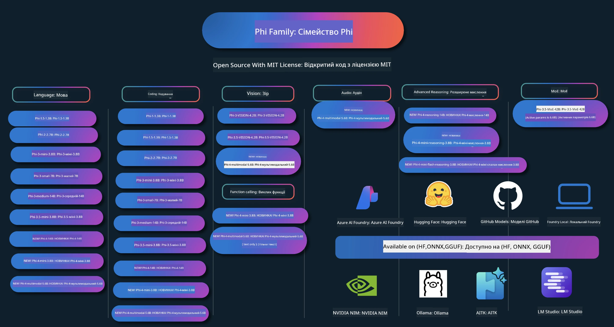

# Phi Cookbook: Практичні приклади з моделями Phi від Microsoft

[](https://codespaces.new/microsoft/phicookbook)
[](https://vscode.dev/redirect?url=vscode://ms-vscode-remote.remote-containers/cloneInVolume?url=https://github.com/microsoft/phicookbook)

[](https://GitHub.com/microsoft/phicookbook/graphs/contributors/?WT.mc_id=aiml-137032-kinfeylo)
[](https://GitHub.com/microsoft/phicookbook/issues/?WT.mc_id=aiml-137032-kinfeylo)
[](https://GitHub.com/microsoft/phicookbook/pulls/?WT.mc_id=aiml-137032-kinfeylo)
[](http://makeapullrequest.com?WT.mc_id=aiml-137032-kinfeylo)

[](https://GitHub.com/microsoft/phicookbook/watchers/?WT.mc_id=aiml-137032-kinfeylo)
[](https://GitHub.com/microsoft/phicookbook/network/?WT.mc_id=aiml-137032-kinfeylo)
[](https://GitHub.com/microsoft/phicookbook/stargazers/?WT.mc_id=aiml-137032-kinfeylo)

[](https://discord.com/invite/ByRwuEEgH4)

Phi — це серія відкритих AI моделей, розроблених Microsoft.

На даний момент Phi — найпотужніша та найефективніша за вартістю мала мовна модель (SLM), що демонструє дуже хороші показники в багатомовності, логічному мисленні, генерації тексту/чатів, кодуванні, обробці зображень, аудіо та інших сценаріях.

Ви можете розгортати Phi у хмарі або на периферійних пристроях, а також легко створювати генеративні AI-застосунки з обмеженими обчислювальними ресурсами.

Виконайте наступні кроки, щоб почати працювати з цим ресурсом:
1. **Форкніть репозиторій**: Натисніть [](https://GitHub.com/microsoft/phicookbook/network/?WT.mc_id=aiml-137032-kinfeylo)
2. **Склонуйте репозиторій**: `git clone https://github.com/microsoft/PhiCookBook.git`
3. [**Приєднуйтесь до Microsoft AI Discord спільноти та знайомтесь з експертами і розробниками**](https://discord.com/invite/ByRwuEEgH4?WT.mc_id=aiml-137032-kinfeylo)



### 🌐 Підтримка багатьох мов

#### Підтримується через GitHub Actions (автоматично і завжди актуально)

<!-- CO-OP TRANSLATOR LANGUAGES TABLE START -->
[Арабська](../ar/README.md) | [Бенгальська](../bn/README.md) | [Болгарська](../bg/README.md) | [Бірманська (М’янма)](../my/README.md) | [Китайська (спрощена)](../zh-CN/README.md) | [Китайська (традиційна, Гонконг)](../zh-HK/README.md) | [Китайська (традиційна, Макао)](../zh-MO/README.md) | [Китайська (традиційна, Тайвань)](../zh-TW/README.md) | [Хорватська](../hr/README.md) | [Чеська](../cs/README.md) | [Данська](../da/README.md) | [Нідерландська](../nl/README.md) | [Естонська](../et/README.md) | [Фінська](../fi/README.md) | [Французька](../fr/README.md) | [Німецька](../de/README.md) | [Грецька](../el/README.md) | [Іврит](../he/README.md) | [Гінді](../hi/README.md) | [Угорська](../hu/README.md) | [Індонезійська](../id/README.md) | [Італійська](../it/README.md) | [Японська](../ja/README.md) | [Каннада](../kn/README.md) | [Корейська](../ko/README.md) | [Литовська](../lt/README.md) | [Малайська](../ms/README.md) | [Малаялам](../ml/README.md) | [Маратхі](../mr/README.md) | [Непальська](../ne/README.md) | [Нігерійський пиджин](../pcm/README.md) | [Норвезька](../no/README.md) | [Перська (фарсі)](../fa/README.md) | [Польська](../pl/README.md) | [Португальська (Бразилія)](../pt-BR/README.md) | [Португальська (Португалія)](../pt-PT/README.md) | [Панджабі (гурмухі)](../pa/README.md) | [Румунська](../ro/README.md) | [Російська](../ru/README.md) | [Сербська (кирилиця)](../sr/README.md) | [Словацька](../sk/README.md) | [Словенська](../sl/README.md) | [Іспанська](../es/README.md) | [Суахілі](../sw/README.md) | [Шведська](../sv/README.md) | [Тагалог (філіппінська)](../tl/README.md) | [Тамільська](../ta/README.md) | [Телугу](../te/README.md) | [Тайська](../th/README.md) | [Турецька](../tr/README.md) | [Українська](./README.md) | [Урду](../ur/README.md) | [В’єтнамська](../vi/README.md)

> **Віддаєте перевагу локальному клонуванню?**
>
> Цей репозиторій містить понад 50 мовних перекладів, що значно збільшує розмір завантаження. Щоб клонувати без перекладів, використовуйте sparse checkout:
>
> **Bash / macOS / Linux:**
> ```bash
> git clone --filter=blob:none --sparse https://github.com/microsoft/PhiCookBook.git
> cd PhiCookBook
> git sparse-checkout set --no-cone '/*' '!translations' '!translated_images'
> ```
>
> **CMD (Windows):**
> ```cmd
> git clone --filter=blob:none --sparse https://github.com/microsoft/PhiCookBook.git
> cd PhiCookBook
> git sparse-checkout set --no-cone "/*" "!translations" "!translated_images"
> ```
>
> Це дасть вам все необхідне для проходження курсу з набагато швидшим завантаженням.
<!-- CO-OP TRANSLATOR LANGUAGES TABLE END -->

## Зміст

- Вступ
  - [Ласкаво просимо до родини Phi](./md/01.Introduction/01/01.PhiFamily.md)
  - [Налаштування середовища](./md/01.Introduction/01/01.EnvironmentSetup.md)
  - [Розуміння ключових технологій](./md/01.Introduction/01/01.Understandingtech.md)
  - [Безпека AI для моделей Phi](./md/01.Introduction/01/01.AISafety.md)
  - [Підтримка апаратного забезпечення Phi](./md/01.Introduction/01/01.Hardwaresupport.md)
  - [Моделі Phi та їх доступність на різних платформах](./md/01.Introduction/01/01.Edgeandcloud.md)
  - [Використання Guidance-ai та Phi](./md/01.Introduction/01/01.Guidance.md)
  - [Моделі на GitHub Marketplace](https://github.com/marketplace/models)
  - [Каталог моделей Azure AI](https://ai.azure.com)

- Інференс Phi в різних середовищах
    -  [Hugging face](./md/01.Introduction/02/01.HF.md)
    -  [Моделі GitHub](./md/01.Introduction/02/02.GitHubModel.md)
    -  [Каталог моделей Microsoft Foundry](./md/01.Introduction/02/03.AzureAIFoundry.md)
    -  [Ollama](./md/01.Introduction/02/04.Ollama.md)
    -  [AI Toolkit для VSCode (AITK)](./md/01.Introduction/02/05.AITK.md)
    -  [NVIDIA NIM](./md/01.Introduction/02/06.NVIDIA.md)
    -  [Foundry Local](./md/01.Introduction/02/07.FoundryLocal.md)

- Інференс родини Phi
    - [Інференс Phi в iOS](./md/01.Introduction/03/iOS_Inference.md)
    - [Інференс Phi в Android](./md/01.Introduction/03/Android_Inference.md)
    - [Інференс Phi в Jetson](./md/01.Introduction/03/Jetson_Inference.md)
    - [Інференс Phi в AI ПК](./md/01.Introduction/03/AIPC_Inference.md)
    - [Інференс Phi з використанням Apple MLX Framework](./md/01.Introduction/03/MLX_Inference.md)
    - [Інференс Phi на локальному сервері](./md/01.Introduction/03/Local_Server_Inference.md)
    - [Інференс Phi на віддаленому сервері з AI Toolkit](./md/01.Introduction/03/Remote_Interence.md)
    - [Інференс Phi з Rust](./md/01.Introduction/03/Rust_Inference.md)
    - [Інференс Phi — Vision локально](./md/01.Introduction/03/Vision_Inference.md)
    - [Інференс Phi з Kaito AKS, Azure Containers (офіційна підтримка)](./md/01.Introduction/03/Kaito_Inference.md)
-  [Квантизація родини Phi](./md/01.Introduction/04/QuantifyingPhi.md)
    - [Квантизація Phi-3.5 / 4 за допомогою llama.cpp](./md/01.Introduction/04/UsingLlamacppQuantifyingPhi.md)
    - [Квантизація Phi-3.5 / 4 з розширеннями генеративного AI для onnxruntime](./md/01.Introduction/04/UsingORTGenAIQuantifyingPhi.md)
    - [Квантизація Phi-3.5 / 4 з Intel OpenVINO](./md/01.Introduction/04/UsingIntelOpenVINOQuantifyingPhi.md)
    - [Квантизація Phi-3.5 / 4 з Apple MLX Framework](./md/01.Introduction/04/UsingAppleMLXQuantifyingPhi.md)

-  Оцінка Phi
    - [Відповідальний AI](./md/01.Introduction/05/ResponsibleAI.md)
    - [Microsoft Foundry для оцінки](./md/01.Introduction/05/AIFoundry.md)
    - [Використання Promptflow для оцінки](./md/01.Introduction/05/Promptflow.md)
 
- RAG з Azure AI Search
    - [Як використовувати Phi-4-mini і Phi-4-мультимодальну (RAG) з Azure AI Search](https://github.com/microsoft/PhiCookBook/blob/main/code/06.E2E/E2E_Phi-4-RAG-Azure-AI-Search.ipynb)

- Приклади розробки застосунків Phi
  - Текстові та чат-застосунки
    - Phi-4 Зразки 🆕
      - [📓] [Чат з Phi-4-mini ONNX моделлю](./md/02.Application/01.TextAndChat/Phi4/ChatWithPhi4ONNX/README.md)
      - [Чат з локальною Phi-4 ONNX моделлю .NET](../../md/04.HOL/dotnet/src/LabsPhi4-Chat-01OnnxRuntime)
      - [Консольний чат .NET з Phi-4 ONNX за допомогою Semantic Kernel](../../md/04.HOL/dotnet/src/LabsPhi4-Chat-02SK)
    - Phi-3 / 3.5 Приклади
      - [Локальний чатбот у браузері з використанням Phi3, ONNX Runtime Web та WebGPU](https://github.com/microsoft/onnxruntime-inference-examples/tree/main/js/chat)
      - [OpenVino Чат](./md/02.Application/01.TextAndChat/Phi3/E2E_OpenVino_Chat.md)
      - [Мульти-модель – Інтерактивний Phi-3-mini та OpenAI Whisper](./md/02.Application/01.TextAndChat/Phi3/E2E_Phi-3-mini_with_whisper.md)
      - [MLFlow – Створення оболонки та використання Phi-3 з MLFlow](./md//02.Application/01.TextAndChat/Phi3/E2E_Phi-3-MLflow.md)
      - [Оптимізація моделі – Як оптимізувати модель Phi-3-min для ONNX Runtime Web з Olive](https://github.com/microsoft/Olive/tree/main/examples/phi3)
      - [WinUI3 додаток з Phi-3 mini-4k-instruct-onnx](https://github.com/microsoft/Phi3-Chat-WinUI3-Sample/)
      -[WinUI3 Мульти-Модель AI-Привеликий додаток для нотаток з прикладом](https://github.com/microsoft/ai-powered-notes-winui3-sample)
      - [Тонке налаштування та інтеграція кастомних моделей Phi-3 з Prompt flow](./md/02.Application/01.TextAndChat/Phi3/E2E_Phi-3-FineTuning_PromptFlow_Integration.md)
      - [Тонке налаштування та інтеграція кастомних моделей Phi-3 з Prompt flow в Microsoft Foundry](./md/02.Application/01.TextAndChat/Phi3/E2E_Phi-3-FineTuning_PromptFlow_Integration_AIFoundry.md)
      - [Оцінка тонко налаштованої моделі Phi-3 / Phi-3.5 в Microsoft Foundry з акцентом на принципи відповідального ШІ Microsoft](./md/02.Application/01.TextAndChat/Phi3/E2E_Phi-3-Evaluation_AIFoundry.md)
      - [📓] [Phi-3.5-mini-instruct зразок прогнозування мови (китайська/англійська)](./md/02.Application/01.TextAndChat/Phi3/phi3-instruct-demo.ipynb)
      - [Phi-3.5-Instruct WebGPU RAG Чатбот](./md/02.Application/01.TextAndChat/Phi3/WebGPUWithPhi35Readme.md)
      - [Використання Windows GPU для створення рішення Prompt flow з Phi-3.5-Instruct ONNX](./md/02.Application/01.TextAndChat/Phi3/UsingPromptFlowWithONNX.md)
      - [Використання Microsoft Phi-3.5 tflite для створення Android додатку](./md/02.Application/01.TextAndChat/Phi3/UsingPhi35TFLiteCreateAndroidApp.md)
      - [Q&A .NET приклад із використанням локальної ONNX моделі Phi-3 через Microsoft.ML.OnnxRuntime](../../md/04.HOL/dotnet/src/LabsPhi301)
      - [Консольний чат .NET додаток з Semantic Kernel та Phi-3](../../md/04.HOL/dotnet/src/LabsPhi302)

  - Приклади коду Azure AI Inference SDK 
    - Приклади Phi-4 🆕
      - [📓] [Генерація проектного коду з Phi-4-multimodal](./md/02.Application/02.Code/Phi4/GenProjectCode/README.md)
    - Приклади Phi-3 / 3.5
      - [Створіть свій власний чат GitHub Copilot для Visual Studio Code з Microsoft Phi-3 Family](./md/02.Application/02.Code/Phi3/VSCodeExt/README.md)
      - [Створіть свого власного агента чату GitHub Copilot для Visual Studio Code з Phi-3.5 від GitHub Models](/md/02.Application/02.Code/Phi3/CreateVSCodeChatAgentWithGitHubModels.md)

  - Приклади розширеного мислення
    - Приклади Phi-4 🆕
      - [📓] [Приклади логіки Phi-4-mini-reasoning або Phi-4-reasoning](./md/02.Application/03.AdvancedReasoning/Phi4/AdvancedResoningPhi4mini/README.md)
      - [📓] [Тонке налаштування Phi-4-mini-reasoning з Microsoft Olive](./md/02.Application/03.AdvancedReasoning/Phi4/AdvancedResoningPhi4mini/olive_ft_phi_4_reasoning_with_medicaldata.ipynb)
      - [📓] [Тонке налаштування Phi-4-mini-reasoning з Apple MLX](./md/02.Application/03.AdvancedReasoning/Phi4/AdvancedResoningPhi4mini/mlx_ft_phi_4_reasoning_with_medicaldata.ipynb)
      - [📓] [Phi-4-mini-reasoning з GitHub Models](./md/02.Application/02.Code/Phi4r/github_models_inference.ipynb)
      - [📓] [Phi-4-mini-reasoning з Microsoft Foundry Models](./md/02.Application/02.Code/Phi4r/azure_models_inference.ipynb)
  - Демонстрації
      - [Phi-4-mini демонстрації на Hugging Face Spaces](https://huggingface.co/spaces/microsoft/phi-4-mini?WT.mc_id=aiml-137032-kinfeylo)
      - [Phi-4-multimodal демонстрації на Hugginge Face Spaces](https://huggingface.co/spaces/microsoft/phi-4-multimodal?WT.mc_id=aiml-137032-kinfeylo)
  - Приклади зору
    - Приклади Phi-4 🆕
      - [📓] [Використайте Phi-4-multimodal для читання зображень та генерації коду](./md/02.Application/04.Vision/Phi4/CreateFrontend/README.md) 
    - Приклади Phi-3 / 3.5
      -  [📓][Phi-3-vision-Текст зображення до тексту](./md/02.Application/04.Vision/Phi3/E2E_Phi-3-vision-image-text-to-text-online-endpoint.ipynb)
      - [Phi-3-vision-ONNX](https://onnxruntime.ai/docs/genai/tutorials/phi3-v.html)
      - [📓][Phi-3-vision CLIP Embedding](./md/02.Application/04.Vision/Phi3/E2E_Phi-3-vision-image-text-to-text-online-endpoint.ipynb)
      - [ДЕМО: Phi-3 Переробка](https://github.com/jennifermarsman/PhiRecycling/)
      - [Phi-3-vision – Візуальний мовний асистент – з Phi3-Vision та OpenVINO](https://docs.openvino.ai/nightly/notebooks/phi-3-vision-with-output.html)
      - [Phi-3 Vision Nvidia NIM](./md/02.Application/04.Vision/Phi3/E2E_Nvidia_NIM_Vision.md)
      - [Phi-3 Vision OpenVino](./md/02.Application/04.Vision/Phi3/E2E_OpenVino_Phi3Vision.md)
      - [📓][Phi-3.5 Vision мульти-кадр або мульти-зображення зразок](./md/02.Application/04.Vision/Phi3/phi3-vision-demo.ipynb)
      - [Phi-3 Vision Локальна ONNX модель за допомогою Microsoft.ML.OnnxRuntime .NET](../../md/04.HOL/dotnet/src/LabsPhi303)
      - [Меню-орієнтована Phi-3 Vision Локальна ONNX модель за допомогою Microsoft.ML.OnnxRuntime .NET](../../md/04.HOL/dotnet/src/LabsPhi304)

  - Приклади з математики
    -  Phi-4-Mini-Flash-Reasoning-Instruct приклади 🆕 [Демонстрація математики з Phi-4-Mini-Flash-Reasoning-Instruct](./md/02.Application/09.Math/MathDemo.ipynb)

  - Приклади аудіо
    - Приклади Phi-4 🆕
      - [📓] [Витяг аудіо транскриптів за допомогою Phi-4-multimodal](./md/02.Application/05.Audio/Phi4/Transciption/README.md)
      - [📓] [Phi-4-multimodal аудіо зразок](./md/02.Application/05.Audio/Phi4/Siri/demo.ipynb)
      - [📓] [Phi-4-multimodal зразок перекладу мови](./md/02.Application/05.Audio/Phi4/Translate/demo.ipynb)
      - [.NET консольний додаток з використанням Phi-4-multimodal Audio для аналізу аудіо файлу та генерації транскрипту](../../md/04.HOL/dotnet/src/LabsPhi4-MultiModal-02Audio)

  - Приклади MOE
    - Приклади Phi-3 / 3.5
      - [📓] [Phi-3.5 Моделі Суміші Експертів (MoEs) зразок для соціальних мереж](./md/02.Application/06.MoE/Phi3/phi3_moe_demo.ipynb)
      - [📓] [Створення ланцюга генерації з доповненням пошуку (RAG) з NVIDIA NIM Phi-3 MOE, Azure AI Search та LlamaIndex](./md/02.Application/06.MoE/Phi3/azure-ai-search-nvidia-rag.ipynb)
      - 
  - Приклади Function Calling
    - Приклади Phi-4 🆕
      -  [📓] [Використання виклику функцій з Phi-4-mini](./md/02.Application/07.FunctionCalling/Phi4/FunctionCallingBasic/README.md)
      -  [📓] [Використання виклику функцій для створення мульти-агентів з Phi-4-mini](./md/02.Application/07.FunctionCalling/Phi4/Multiagents/Phi_4_mini_multiagent.ipynb)
      -  [📓] [Використання виклику функцій з Ollama](./md/02.Application/07.FunctionCalling/Phi4/Ollama/ollama_functioncalling.ipynb)
      -  [📓] [Використання виклику функцій з ONNX](./md/02.Application/07.FunctionCalling/Phi4/ONNX/onnx_parallel_functioncalling.ipynb)
  - Приклади Мульти-модального змішування
    - Приклади Phi-4 🆕
      -  [📓] [Використання Phi-4-multimodal як технологічного журналіста](./md/02.Application/08.Multimodel/Phi4/TechJournalist/phi_4_mm_audio_text_publish_news.ipynb)
      - [.NET консольний додаток, що використовує Phi-4-multimodal для аналізу зображень](../../md/04.HOL/dotnet/src/LabsPhi4-MultiModal-01Images)

- Тонке налаштування Phi прикладів
  - [Сценарії тонкого налаштування](./md/03.FineTuning/FineTuning_Scenarios.md)
  - [Тонке налаштування проти RAG](./md/03.FineTuning/FineTuning_vs_RAG.md)
  - [Тонке налаштування: Дайте Phi-3 стати експертом галузі](./md/03.FineTuning/LetPhi3gotoIndustriy.md)
  - [Тонке налаштування Phi-3 з AI Toolkit для VS Code](./md/03.FineTuning/Finetuning_VSCodeaitoolkit.md)
  - [Тонке налаштування Phi-3 з Azure Machine Learning Service](./md/03.FineTuning/Introduce_AzureML.md)
  - [Тонке налаштування Phi-3 з Lora](./md/03.FineTuning/FineTuning_Lora.md)
  - [Тонке налаштування Phi-3 з QLora](./md/03.FineTuning/FineTuning_Qlora.md)
  - [Тонке налаштування Phi-3 з Microsoft Foundry](./md/03.FineTuning/FineTuning_AIFoundry.md)
  - [Тонке налаштування Phi-3 з Azure ML CLI/SDK](./md/03.FineTuning/FineTuning_MLSDK.md)
  - [Тонке налаштування з Microsoft Olive](./md/03.FineTuning/FineTuning_MicrosoftOlive.md)
  - [Лабораторна робота з Microsoft Olive для тонкого налаштування](./md/03.FineTuning/olive-lab/readme.md)
  - [Тонке налаштування Phi-3-vision з Weights and Bias](./md/03.FineTuning/FineTuning_Phi-3-visionWandB.md)
  - [Тонке налаштування Phi-3 з Apple MLX Framework](./md/03.FineTuning/FineTuning_MLX.md)
  - [Тонке налаштування Phi-3-vision (офіційна підтримка)](./md/03.FineTuning/FineTuning_Vision.md)
  - [Тонке налаштування Phi-3 з Kaito AKS, Azure Containers (офіційна підтримка)](./md/03.FineTuning/FineTuning_Kaito.md)
  - [Тонке налаштування Phi-3 та 3.5 Vision](https://github.com/2U1/Phi3-Vision-Finetune)

- Лабораторна робота
  - [Дослідження передових моделей: LLM, SLM, локальна розробка та інше](https://github.com/microsoft/aitour-exploring-cutting-edge-models)
  - [Розкриття потенціалу NLP: Тонке налаштування з Microsoft Olive](https://github.com/azure/Ignite_FineTuning_workshop)
- Академічні наукові роботи та публікації
  - [Тільки підручники: технічний звіт phi-1.5](https://arxiv.org/abs/2309.05463)
  - [Технічний звіт Phi-3: Надзвичайно здатна мовна модель локально на вашому телефоні](https://arxiv.org/abs/2404.14219)
  - [Технічний звіт Phi-4](https://arxiv.org/abs/2412.08905)
  - [Технічний звіт Phi-4-Mini: Компактні, але потужні мультимодальні мовні моделі через Mixture-of-LoRAs](https://arxiv.org/abs/2503.01743)
  - [Оптимізація малих мовних моделей для виклику функцій у транспортних засобах](https://arxiv.org/abs/2501.02342)
  - [(WhyPHI) Тонке налаштування PHI-3 для мультиваріантних питань: методологія, результати та виклики](https://arxiv.org/abs/2501.01588)
  - [Технічний звіт Phi-4-reasoning](https://www.microsoft.com/en-us/research/wp-content/uploads/2025/04/phi_4_reasoning.pdf)
  - [Технічний звіт Phi-4-mini-reasoning](https://huggingface.co/microsoft/Phi-4-mini-reasoning/blob/main/Phi-4-Mini-Reasoning.pdf)

## Використання моделей Phi

### Phi на Microsoft Foundry

Ви можете дізнатися, як використовувати Microsoft Phi та як будувати E2E рішення на ваших різних апаратних пристроях. Щоб самому випробувати Phi, почніть гратися з моделями та налаштовувати Phi для своїх сценаріїв за допомогою [Microsoft Foundry Azure AI Model Catalog](https://aka.ms/phi3-azure-ai). Більше інформації можна знайти в розділі Початок роботи з [Microsoft Foundry](/md/02.QuickStart/AzureAIFoundry_QuickStart.md)

**Пісочниця**
Кожна модель має виділену пісочницю для тестування моделі [Azure AI Playground](https://aka.ms/try-phi3).

### Phi на GitHub Models

Ви можете дізнатися, як використовувати Microsoft Phi та як будувати E2E рішення на ваших різних апаратних пристроях. Щоб самому випробувати Phi, почніть гратися з моделлю та налаштовувати Phi для своїх сценаріїв за допомогою [GitHub Model Catalog](https://github.com/marketplace/models?WT.mc_id=aiml-137032-kinfeylo). Більше інформації можна знайти в розділі Початок роботи з [GitHub Model Catalog](/md/02.QuickStart/GitHubModel_QuickStart.md)

**Пісочниця**
Кожна модель має виділену [пісочницю для тестування моделі](/md/02.QuickStart/GitHubModel_QuickStart.md).

### Phi на Hugging Face

Ви також можете знайти модель на [Hugging Face](https://huggingface.co/microsoft)

**Пісочниця**
 [Hugging Chat playground](https://huggingface.co/chat/models/microsoft/Phi-3-mini-4k-instruct)

 ## 🎒 Інші курси

Наша команда створює й інші курси! Перегляньте:

<!-- CO-OP TRANSLATOR OTHER COURSES START -->
### LangChain
[](https://aka.ms/langchain4j-for-beginners)
[](https://aka.ms/langchainjs-for-beginners?WT.mc_id=m365-94501-dwahlin)
[](https://github.com/microsoft/langchain-for-beginners?WT.mc_id=m365-94501-dwahlin)
---

### Azure / Edge / MCP / Agents
[](https://github.com/microsoft/AZD-for-beginners?WT.mc_id=academic-105485-koreyst)
[](https://github.com/microsoft/edgeai-for-beginners?WT.mc_id=academic-105485-koreyst)
[](https://github.com/microsoft/mcp-for-beginners?WT.mc_id=academic-105485-koreyst)
[](https://github.com/microsoft/ai-agents-for-beginners?WT.mc_id=academic-105485-koreyst)

---
 
### Серія Generative AI
[](https://github.com/microsoft/generative-ai-for-beginners?WT.mc_id=academic-105485-koreyst)
[-9333EA?style=for-the-badge&labelColor=E5E7EB&color=9333EA)](https://github.com/microsoft/Generative-AI-for-beginners-dotnet?WT.mc_id=academic-105485-koreyst)
[-C084FC?style=for-the-badge&labelColor=E5E7EB&color=C084FC)](https://github.com/microsoft/generative-ai-for-beginners-java?WT.mc_id=academic-105485-koreyst)
[-E879F9?style=for-the-badge&labelColor=E5E7EB&color=E879F9)](https://github.com/microsoft/generative-ai-with-javascript?WT.mc_id=academic-105485-koreyst)

---
 
### Основне навчання
[](https://aka.ms/ml-beginners?WT.mc_id=academic-105485-koreyst)
[](https://aka.ms/datascience-beginners?WT.mc_id=academic-105485-koreyst)
[](https://aka.ms/ai-beginners?WT.mc_id=academic-105485-koreyst)
[](https://github.com/microsoft/Security-101?WT.mc_id=academic-96948-sayoung)
[](https://aka.ms/webdev-beginners?WT.mc_id=academic-105485-koreyst)
[](https://aka.ms/iot-beginners?WT.mc_id=academic-105485-koreyst)
[](https://github.com/microsoft/xr-development-for-beginners?WT.mc_id=academic-105485-koreyst)

---
 
### Серія Copilot
[](https://aka.ms/GitHubCopilotAI?WT.mc_id=academic-105485-koreyst)
[](https://github.com/microsoft/mastering-github-copilot-for-dotnet-csharp-developers?WT.mc_id=academic-105485-koreyst)
[](https://github.com/microsoft/CopilotAdventures?WT.mc_id=academic-105485-koreyst)
<!-- CO-OP TRANSLATOR OTHER COURSES END -->

## Відповідальний ШІ

Microsoft прагне допомагати нашим клієнтам відповідально використовувати наші AI продукти, ділитися власним досвідом і будувати партнерство на довірі за допомогою інструментів, таких як Transparency Notes та Impact Assessments. Багато з цих ресурсів можна знайти на [https://aka.ms/RAI](https://aka.ms/RAI).  
Підхід Microsoft до відповідального ШІ базується на наших принципах ШІ: справедливість, надійність і безпека, конфіденційність і безпека, інклюзивність, прозорість і підзвітність.

Великі природні мовні, зображувальні та мовні моделі – такі, як ті, що використовуються в цьому прикладі – потенційно можуть поводитись несправедливо, ненадійно або образливо, що може спричиняти шкоду. Будь ласка, ознайомтеся з [Azure OpenAI service Transparency note](https://learn.microsoft.com/legal/cognitive-services/openai/transparency-note?tabs=text), щоб дізнатися про ризики та обмеження.

Рекомендований підхід для пом’якшення цих ризиків полягає у включенні безпекової системи у вашу архітектуру, яка зможе виявляти та запобігати шкідливій поведінці. [Azure AI Content Safety](https://learn.microsoft.com/azure/ai-services/content-safety/overview) забезпечує незалежний рівень захисту, здатний виявляти шкідливий контент, створений користувачами та ШІ, у додатках і службах. Azure AI Content Safety включає API для тексту та зображень, які дозволяють виявляти шкідливі матеріали. В Microsoft Foundry сервіс Content Safety дозволяє переглядати, досліджувати та випробовувати приклади коду для виявлення шкідливого контенту у різних модальностях. Наступна [документація для швидкого старту](https://learn.microsoft.com/azure/ai-services/content-safety/quickstart-text?tabs=visual-studio%2Clinux&pivots=programming-language-rest) проведе вас через процес запитів до сервісу.
Ще одним аспектом, який слід враховувати, є загальна продуктивність застосунку. У випадку мультимодальних і мультимодельних застосунків під продуктивністю розуміють те, що система працює так, як ви та ваші користувачі очікуєте, включно з відсутністю шкідливих результатів. Важливо оцінити продуктивність вашого загального застосунку, використовуючи [Оцінювачі продуктивності, якості, ризиків і безпеки](https://learn.microsoft.com/azure/ai-studio/concepts/evaluation-metrics-built-in). Ви також маєте можливість створювати та оцінювати з [індивідуальними оцінювачами](https://learn.microsoft.com/azure/ai-studio/how-to/develop/evaluate-sdk#custom-evaluators).

Ви можете оцінити ваш AI-застосунок у середовищі розробки, використовуючи [Azure AI Evaluation SDK](https://microsoft.github.io/promptflow/index.html). Маючи тестовий набір даних або ціль, генерації вашого генеративного AI застосунку кількісно вимірюються вбудованими або вибраними кастомними оцінювачами. Щоб розпочати роботу з azure ai evaluation sdk для оцінки вашої системи, ви можете скористатися [керівництвом зі швидкого старту](https://learn.microsoft.com/azure/ai-studio/how-to/develop/flow-evaluate-sdk). Після виконання оцінки ви можете [візуалізувати результати в Microsoft Foundry](https://learn.microsoft.com/azure/ai-studio/how-to/evaluate-flow-results).

## Торгові марки

Цей проект може містити торгові марки або логотипи проектів, продуктів чи послуг. Авторизоване використання торгових марок або логотипів Microsoft підлягає та має відповідати [Керівництву Microsoft щодо торгових марок і брендів](https://www.microsoft.com/legal/intellectualproperty/trademarks/usage/general).
Використання торгових марок або логотипів Microsoft у змінених версіях цього проекту не повинно спричиняти плутанину або створювати враження спонсорства Microsoft. Використання торгових марок або логотипів третіх сторін підпорядковується політикам цих третіх сторін.

## Отримання допомоги

Якщо у вас виникли труднощі або питання щодо створення AI-застосунків, приєднуйтесь до:

[](https://aka.ms/foundry/discord)

Якщо у вас є відгуки про продукт або помилки під час створення, відвідайте:

[](https://aka.ms/foundry/forum)

---

<!-- CO-OP TRANSLATOR DISCLAIMER START -->
**Відмова від відповідальності**:  
Цей документ було перекладено за допомогою сервісу автоматичного перекладу [Co-op Translator](https://github.com/Azure/co-op-translator). Хоча ми прагнемо до точності, будь ласка, майте на увазі, що автоматичні переклади можуть містити помилки або неточності. Оригінальний документ рідною мовою слід розглядати як авторитетне джерело. Для критично важливої інформації рекомендується звертатися до професійного людського перекладу. Ми не несемо відповідальності за будь-які непорозуміння або неправильне тлумачення, що виникли внаслідок використання цього перекладу.
<!-- CO-OP TRANSLATOR DISCLAIMER END -->