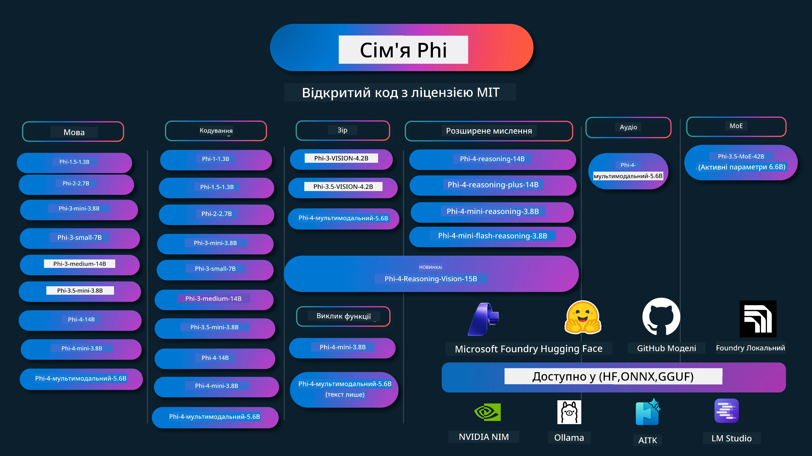

# Phi Cookbook: Практичні приклади з моделями Phi від Microsoft

[](https://codespaces.new/microsoft/phicookbook)
[](https://vscode.dev/redirect?url=vscode://ms-vscode-remote.remote-containers/cloneInVolume?url=https://github.com/microsoft/phicookbook)

[](https://GitHub.com/microsoft/phicookbook/graphs/contributors/?WT.mc_id=aiml-137032-kinfeylo)
[](https://GitHub.com/microsoft/phicookbook/issues/?WT.mc_id=aiml-137032-kinfeylo)
[](https://GitHub.com/microsoft/phicookbook/pulls/?WT.mc_id=aiml-137032-kinfeylo)
[](http://makeapullrequest.com?WT.mc_id=aiml-137032-kinfeylo)

[](https://GitHub.com/microsoft/phicookbook/watchers/?WT.mc_id=aiml-137032-kinfeylo)
[](https://GitHub.com/microsoft/phicookbook/network/?WT.mc_id=aiml-137032-kinfeylo)
[](https://GitHub.com/microsoft/phicookbook/stargazers/?WT.mc_id=aiml-137032-kinfeylo)

[](https://discord.com/invite/ByRwuEEgH4)

Phi — це серія відкритих моделей штучного інтелекту, розроблених Microsoft.

Наразі Phi є найпотужнішою та найекономічнішою малою мовною моделлю (SLM) з дуже хорошими показниками в багатомовних, логічних, текстових/чат-генерації, кодуванні, обробці зображень, аудіо та інших сценаріях.

Ви можете розгортати Phi у хмарі або на пристроях на периферії, а також легко створювати генеративні AI-застосунки з обмеженою обчислювальною потужністю.

Виконайте ці кроки, щоб почати використовувати ці ресурси:
1. **Fork the Repository**: Click [](https://GitHub.com/microsoft/phicookbook/network/?WT.mc_id=aiml-137032-kinfeylo)
2. **Clone the Repository**:   `git clone https://github.com/microsoft/PhiCookBook.git`
3. [**Приєднуйтесь до спільноти Microsoft AI Discord та зустрічайтеся з експертами та іншими розробниками**](https://discord.com/invite/ByRwuEEgH4?WT.mc_id=aiml-137032-kinfeylo)



### 🌐 Підтримка багатьох мов

#### Підтримується через GitHub Action (Автоматично і завжди актуально)

<!-- CO-OP TRANSLATOR LANGUAGES TABLE START -->
[Arabic](../ar/README.md) | [Bengali](../bn/README.md) | [Bulgarian](../bg/README.md) | [Burmese (Myanmar)](../my/README.md) | [Chinese (Simplified)](../zh-CN/README.md) | [Chinese (Traditional, Hong Kong)](../zh-HK/README.md) | [Chinese (Traditional, Macau)](../zh-MO/README.md) | [Chinese (Traditional, Taiwan)](../zh-TW/README.md) | [Croatian](../hr/README.md) | [Czech](../cs/README.md) | [Danish](../da/README.md) | [Dutch](../nl/README.md) | [Estonian](../et/README.md) | [Finnish](../fi/README.md) | [French](../fr/README.md) | [German](../de/README.md) | [Greek](../el/README.md) | [Hebrew](../he/README.md) | [Hindi](../hi/README.md) | [Hungarian](../hu/README.md) | [Indonesian](../id/README.md) | [Italian](../it/README.md) | [Japanese](../ja/README.md) | [Kannada](../kn/README.md) | [Khmer](../km/README.md) | [Korean](../ko/README.md) | [Lithuanian](../lt/README.md) | [Malay](../ms/README.md) | [Malayalam](../ml/README.md) | [Marathi](../mr/README.md) | [Nepali](../ne/README.md) | [Nigerian Pidgin](../pcm/README.md) | [Norwegian](../no/README.md) | [Persian (Farsi)](../fa/README.md) | [Polish](../pl/README.md) | [Portuguese (Brazil)](../pt-BR/README.md) | [Portuguese (Portugal)](../pt-PT/README.md) | [Punjabi (Gurmukhi)](../pa/README.md) | [Romanian](../ro/README.md) | [Russian](../ru/README.md) | [Serbian (Cyrillic)](../sr/README.md) | [Slovak](../sk/README.md) | [Slovenian](../sl/README.md) | [Spanish](../es/README.md) | [Swahili](../sw/README.md) | [Swedish](../sv/README.md) | [Tagalog (Filipino)](../tl/README.md) | [Tamil](../ta/README.md) | [Telugu](../te/README.md) | [Thai](../th/README.md) | [Turkish](../tr/README.md) | [Ukrainian](./README.md) | [Urdu](../ur/README.md) | [Vietnamese](../vi/README.md)

> **Віддаєте перевагу клонувати локально?**
>
> Цей репозиторій включає понад 50 перекладів мов, що значно збільшує розмір завантаження. Щоб клонувати без перекладів, використовуйте sparse checkout:
>
> **Bash / macOS / Linux:**
> ```bash
> git clone --filter=blob:none --sparse https://github.com/microsoft/PhiCookBook.git
> cd PhiCookBook
> git sparse-checkout set --no-cone '/*' '!translations' '!translated_images'
> ```
>
> **CMD (Windows):**
> ```cmd
> git clone --filter=blob:none --sparse https://github.com/microsoft/PhiCookBook.git
> cd PhiCookBook
> git sparse-checkout set --no-cone "/*" "!translations" "!translated_images"
> ```
>
> Це дасть вам усе необхідне для проходження курсу з набагато швидшим завантаженням.
<!-- CO-OP TRANSLATOR LANGUAGES TABLE END -->

## Зміст таблиці
- Вступ - [Ласкаво просимо до родини Phi](./md/01.Introduction/01/01.PhiFamily.md) - [Налаштування вашого середовища](./md/01.Introduction/01/01.EnvironmentSetup.md) - [Розуміння ключових технологій](./md/01.Introduction/01/01.Understandingtech.md) - [Безпека ШІ для моделей Phi](./md/01.Introduction/01/01.AISafety.md) - [Підтримка апаратного забезпечення Phi](./md/01.Introduction/01/01.Hardwaresupport.md) - [Моделі Phi та їх доступність на різних платформах](./md/01.Introduction/01/01.Edgeandcloud.md) - [Використання Guidance-ai та Phi](./md/01.Introduction/01/01.Guidance.md) - [Моделі GitHub Marketplace](https://github.com/marketplace/models) - [Каталог моделей Azure AI](https://ai.azure.com) - Інференція Phi в різних середовищах - [Hugging face](./md/01.Introduction/02/01.HF.md) - [Моделі GitHub](./md/01.Introduction/02/02.GitHubModel.md) - [Каталог моделей Microsoft Foundry](./md/01.Introduction/02/03.AzureAIFoundry.md) - [Ollama](./md/01.Introduction/02/04.Ollama.md) - [AI Toolkit VSCode (AITK)](./md/01.Introduction/02/05.AITK.md) - [NVIDIA NIM](./md/01.Introduction/02/06.NVIDIA.md) - [Foundry Local](./md/01.Introduction/02/07.FoundryLocal.md) - Інференція Phi Family - [Інференція Phi на iOS](./md/01.Introduction/03/iOS_Inference.md) - [Інференція Phi на Android](./md/01.Introduction/03/Android_Inference.md) - [Інференція Phi на Jetson](./md/01.Introduction/03/Jetson_Inference.md) - [Інференція Phi на AI ПК](./md/01.Introduction/03/AIPC_Inference.md) - [Інференція Phi з використанням Apple MLX Framework](./md/01.Introduction/03/MLX_Inference.md) - [Інференція Phi на локальному сервері](./md/01.Introduction/03/Local_Server_Inference.md) - [Інференція Phi на віддаленому сервері з використанням AI Toolkit](./md/01.Introduction/03/Remote_Interence.md) - [Інференція Phi з Rust](./md/01.Introduction/03/Rust_Inference.md) - [Інференція Phi--Vision локально](./md/01.Introduction/03/Vision_Inference.md) - [Інференція Phi з Kaito AKS, Azure Containers (офіційна підтримка)](./md/01.Introduction/03/Kaito_Inference.md) - [Квантизація Phi Family](./md/01.Introduction/04/QuantifyingPhi.md) - [Квантизація Phi-3.5 / 4 з використанням llama.cpp](./md/01.Introduction/04/UsingLlamacppQuantifyingPhi.md) - [Квантизація Phi-3.5 / 4 з використанням генеративних розширень AI для onnxruntime](./md/01.Introduction/04/UsingORTGenAIQuantifyingPhi.md) - [Квантизація Phi-3.5 / 4 з використанням Intel OpenVINO](./md/01.Introduction/04/UsingIntelOpenVINOQuantifyingPhi.md) - [Квантизація Phi-3.5 / 4 з використанням Apple MLX Framework](./md/01.Introduction/04/UsingAppleMLXQuantifyingPhi.md) - Оцінка Phi - [Відповідальний ШІ](./md/01.Introduction/05/ResponsibleAI.md) - [Microsoft Foundry для оцінки](./md/01.Introduction/05/AIFoundry.md) - [Використання Promptflow для оцінки](./md/01.Introduction/05/Promptflow.md) - RAG з Azure AI Search - [Як використовувати Phi-4-mini та Phi-4-мультимодальний (RAG) з Azure AI Search](https://github.com/microsoft/PhiCookBook/blob/main/code/06.E2E/E2E_Phi-4-RAG-Azure-AI-Search.ipynb) - Приклади розробки додатків Phi - Текстові та чат-додатки - Приклади Phi-4 - [📓] [Чат з моделью Phi-4-mini ONNX](./md/02.Application/01.TextAndChat/Phi4/ChatWithPhi4ONNX/README.md) - [Чат з локальною моделлю Phi-4 ONNX .NET](../../md/04.HOL/dotnet/src/LabsPhi4-Chat-01OnnxRuntime) - [Консольний .NET чат-додаток з Phi-4 ONNX з використанням Semantic Kernel](../../md/04.HOL/dotnet/src/LabsPhi4-Chat-02SK) - Приклади Phi-3 / 3.5 - [Локальний чатбот у браузері з Phi3, ONNX Runtime Web та WebGPU](https://github.com/microsoft/onnxruntime-inference-examples/tree/main/js/chat) - [OpenVino чат](./md/02.Application/01.TextAndChat/Phi3/E2E_OpenVino_Chat.md) - [Мультимодель - інтерактивний Phi-3-mini та OpenAI Whisper](./md/02.Application/01.TextAndChat/Phi3/E2E_Phi-3-mini_with_whisper.md) - [MLFlow - створення обгортки та використання Phi-3 з MLFlow](./md//02.Application/01.TextAndChat/Phi3/E2E_Phi-3-MLflow.md) - [Оптимізація моделі - як оптимізувати модель Phi-3-min для ONNX Runtime Web із Olive](https://github.com/microsoft/Olive/tree/main/examples/phi3) - [WinUI3 додаток з Phi-3 mini-4k-instruct-onnx](https://github.com/microsoft/Phi3-Chat-WinUI3-Sample/) -[Зразок додатку нотаток з підтримкою ШІ WinUI3 Multi Model](https://github.com/microsoft/ai-powered-notes-winui3-sample) - [Тонке налаштування та інтеграція користувацьких моделей Phi-3 з Prompt flow](./md/02.Application/01.TextAndChat/Phi3/E2E_Phi-3-FineTuning_PromptFlow_Integration.md) - [Тонке налаштування та інтеграція користувацьких моделей Phi-3 з Prompt flow в Microsoft Foundry](./md/02.Application/01.TextAndChat/Phi3/E2E_Phi-3-FineTuning_PromptFlow_Integration_AIFoundry.md) - [Оцінка тонко налаштованої моделі Phi-3 / Phi-3.5 в Microsoft Foundry з акцентом на Принципи відповідального ШІ від Microsoft](./md/02.Application/01.TextAndChat/Phi3/E2E_Phi-3-Evaluation_AIFoundry.md) - [📓] [Приклад передбачення мови Phi-3.5-mini-instruct (китайська/англійська)](./md/02.Application/01.TextAndChat/Phi3/phi3-instruct-demo.ipynb) - [Phi-3.5-Instruct WebGPU RAG чатбот](./md/02.Application/01.TextAndChat/Phi3/WebGPUWithPhi35Readme.md) - [Використання Windows GPU для створення рішення Prompt flow з Phi-3.5-Instruct ONNX](./md/02.Application/01.TextAndChat/Phi3/UsingPromptFlowWithONNX.md) - [Створення Android додатку з Microsoft Phi-3.5 tflite](./md/02.Application/01.TextAndChat/Phi3/UsingPhi35TFLiteCreateAndroidApp.md) - [Приклад Q&A .NET з локальною моделлю ONNX Phi-3 з використанням Microsoft.ML.OnnxRuntime](../../md/04.HOL/dotnet/src/LabsPhi301) - [Консольний чат .NET додаток з Semantic Kernel і Phi-3](../../md/04.HOL/dotnet/src/LabsPhi302) - Приклади на основі SDK Azure AI Inference - Приклади Phi-4 - [📓] [Генерація коду проекту з використанням Phi-4-мультимодального](./md/02.Application/02.Code/Phi4/GenProjectCode/README.md) - Приклади Phi-3 / 3.5 - [Створіть власного чат-агента Visual Studio Code GitHub Copilot з сімейством Microsoft Phi-3](./md/02.Application/02.Code/Phi3/VSCodeExt/README.md) - [Створіть власного чат-агента Visual Studio Code Copilot з Phi-3.5 за допомогою моделей GitHub](/md/02.Application/02.Code/Phi3/CreateVSCodeChatAgentWithGitHubModels.md) - Приклади розширеного мислення - Приклади Phi-4 - [📓] [Приклади Phi-4-mini-reasoning або Phi-4-reasoning](./md/02.Application/03.AdvancedReasoning/Phi4/AdvancedResoningPhi4mini/README.md) - [📓] [Тонке налаштування Phi-4-mini-reasoning з Microsoft Olive](./md/02.Application/03.AdvancedReasoning/Phi4/AdvancedResoningPhi4mini/olive_ft_phi_4_reasoning_with_medicaldata.ipynb) - [📓] [Тонке налаштування Phi-4-mini-reasoning з Apple MLX](./md/02.Application/03.AdvancedReasoning/Phi4/AdvancedResoningPhi4mini/mlx_ft_phi_4_reasoning_with_medicaldata.ipynb) - [📓] [Phi-4-mini-reasoning з моделями GitHub](./md/02.Application/02.Code/Phi4r/github_models_inference.ipynb) - [📓] [Phi-4-mini-reasoning з моделями Microsoft Foundry](./md/02.Application/02.Code/Phi4r/azure_models_inference.ipynb) -
Демонстрації - [Phi-4-mini демонстрації, розміщені на Hugging Face Spaces](https://huggingface.co/spaces/microsoft/phi-4-mini?WT.mc_id=aiml-137032-kinfeylo) - [Phi-4-мультимодальні демонстрації, розміщені на Hugging Face Spaces](https://huggingface.co/spaces/microsoft/phi-4-multimodal?WT.mc_id=aiml-137032-kinfeylo) - Зразки зору - Зразки Phi-4 - [📓] [Використання Phi-4-мультимодального для зчитування зображень та генерації коду](./md/02.Application/04.Vision/Phi4/CreateFrontend/README.md) - Зразки Phi-3 / 3.5 - [📓][Phi-3-зір-Зображення текст у текст](./md/02.Application/04.Vision/Phi3/E2E_Phi-3-vision-image-text-to-text-online-endpoint.ipynb) - [Phi-3-зір-ONNX](https://onnxruntime.ai/docs/genai/tutorials/phi3-v.html) - [📓][Phi-3-зір CLIP Вбудовування](./md/02.Application/04.Vision/Phi3/E2E_Phi-3-vision-image-text-to-text-online-endpoint.ipynb) - [ДЕМО: Phi-3 Переробка](https://github.com/jennifermarsman/PhiRecycling/) - [Phi-3-зір - Візуальний мовний асистент - з Phi3-Vision та OpenVINO](https://docs.openvino.ai/nightly/notebooks/phi-3-vision-with-output.html) - [Phi-3 Зорова Nvidia NIM](./md/02.Application/04.Vision/Phi3/E2E_Nvidia_NIM_Vision.md) - [Phi-3 Зорова OpenVino](./md/02.Application/04.Vision/Phi3/E2E_OpenVino_Phi3Vision.md) - [📓][Phi-3.5 Зорова мультикадрова або мультизображеннева демонстрація](./md/02.Application/04.Vision/Phi3/phi3-vision-demo.ipynb) - [Phi-3 Зорова локальна ONNX модель з використанням Microsoft.ML.OnnxRuntime .NET](../../md/04.HOL/dotnet/src/LabsPhi303) - [Меню-базована Phi-3 Зорова локальна ONNX модель з використанням Microsoft.ML.OnnxRuntime .NET](../../md/04.HOL/dotnet/src/LabsPhi304) - Зразки розуміння-зору - Phi-4-Розуміння-зору-15B - [📓] [Використання Phi-4-Розуміння-зору-15B для виявлення порушення правил переходу дороги](./md/02.Application/10.ReasoningVision/Phi_4_reasoning_vision_15b_Jaywalking.ipynb) - [📓] [Використання Phi-4-Розуміння-зору-15B для математики](./md/02.Application/10.ReasoningVision/Phi_4_reasoning_vision_15b_Math.ipynb) - [📓] [Використання Phi-4-Розуміння-зору-15B для виявлення інтерфейсу користувача](./md/02.Application/10.ReasoningVision/Phi_4_reasoning_vision_15b_ui.ipynb) - Зразки математики - Phi-4-Міні-Флеш-Розуміння-Інструкт Зразки [Математичне Демонстрація з Phi-4-Міні-Флеш-Розуміння-Інструкт](./md/02.Application/09.Math/MathDemo.ipynb) - Зразки аудіо - Зразки Phi-4 - [📓] [Вилучення аудіо транскриптів з використанням Phi-4-мультимодального](./md/02.Application/05.Audio/Phi4/Transciption/README.md) - [📓] [Зразок аудіо Phi-4-мультимодального](./md/02.Application/05.Audio/Phi4/Siri/demo.ipynb) - [📓] [Зразок розпізнавання мови з перекладом Phi-4-мультимодального](./md/02.Application/05.Audio/Phi4/Translate/demo.ipynb) - [.NET консольний застосунок з використанням Phi-4-мультимодального аудіо для аналізу аудіофайлу та генерації транскрипту](../../md/04.HOL/dotnet/src/LabsPhi4-MultiModal-02Audio) - Зразки змішування моделей експертів (MOE) - Зразки Phi-3 / 3.5 - [📓] [Phi-3.5 Моделі суміші експертів (MoEs) Зразок соціальних мереж](./md/02.Application/06.MoE/Phi3/phi3_moe_demo.ipynb) - [📓] [Створення конвеєра Retrieval-Augmented Generation (RAG) з NVIDIA NIM Phi-3 MOE, Azure AI Search та LlamaIndex](./md/02.Application/06.MoE/Phi3/azure-ai-search-nvidia-rag.ipynb) - - Зразки виклику функцій - Зразки Phi-4 🆕 - [📓] [Використання виклику функцій з Phi-4-mini](./md/02.Application/07.FunctionCalling/Phi4/FunctionCallingBasic/README.md) - [📓] [Використання виклику функцій для створення мультиагентів з Phi-4-mini](./md/02.Application/07.FunctionCalling/Phi4/Multiagents/Phi_4_mini_multiagent.ipynb) - [📓] [Використання виклику функцій з Ollama](./md/02.Application/07.FunctionCalling/Phi4/Ollama/ollama_functioncalling.ipynb) - [📓] [Використання виклику функцій з ONNX](./md/02.Application/07.FunctionCalling/Phi4/ONNX/onnx_parallel_functioncalling.ipynb) - Зразки мультимодального змішування - Зразки Phi-4 🆕 - [📓] [Використання Phi-4-мультимодального як журналіста-технолога](./md/02.Application/08.Multimodel/Phi4/TechJournalist/phi_4_mm_audio_text_publish_news.ipynb) - [.NET консольний застосунок з використанням Phi-4-мультимодального для аналізу зображень](../../md/04.HOL/dotnet/src/LabsPhi4-MultiModal-01Images) - Зразки тонкого налаштування Phi - [Сценарії тонкого налаштування](./md/03.FineTuning/FineTuning_Scenarios.md) - [Тонке налаштування vs RAG](./md/03.FineTuning/FineTuning_vs_RAG.md) - [Тонке налаштування: Нехай Phi-3 стане галузевим експертом](./md/03.FineTuning/LetPhi3gotoIndustriy.md) - [Тонке налаштування Phi-3 за допомогою AI Toolkit для VS Code](./md/03.FineTuning/Finetuning_VSCodeaitoolkit.md) - [Тонке налаштування Phi-3 з Azure Machine Learning Service](./md/03.FineTuning/Introduce_AzureML.md) - [Тонке налаштування Phi-3 з Lora](./md/03.FineTuning/FineTuning_Lora.md) - [Тонке налаштування Phi-3 з QLora](./md/03.FineTuning/FineTuning_Qlora.md) - [Тонке налаштування Phi-3 з Microsoft Foundry](./md/03.FineTuning/FineTuning_AIFoundry.md) - [Тонке налаштування Phi-3 з Azure ML CLI/SDK](./md/03.FineTuning/FineTuning_MLSDK.md) - [Тонке налаштування з Microsoft Olive](./md/03.FineTuning/FineTuning_MicrosoftOlive.md) - [Практичний лабораторний курс з тонкого налаштування з Microsoft Olive](./md/03.FineTuning/olive-lab/readme.md) - [Тонке налаштування Phi-3-зору з Weights and Bias](./md/03.FineTuning/FineTuning_Phi-3-visionWandB.md) - [Тонке налаштування Phi-3 з Apple MLX Framework](./md/03.FineTuning/FineTuning_MLX.md) - [Тонке налаштування Phi-3-зору (офіційна підтримка)](./md/03.FineTuning/FineTuning_Vision.md) - [Тонке налаштування Phi-3 з Kaito AKS, Azure Containers (офіційна підтримка)](./md/03.FineTuning/FineTuning_Kaito.md) - [Тонке налаштування Phi-3 і 3.5-зору](https://github.com/2U1/Phi3-Vision-Finetune) - Практична лабораторія - [Дослідження передових моделей: LLMs, SLMs, локальна розробка та інше](https://github.com/microsoft/aitour-exploring-cutting-edge-models) - [Розкриття потенціалу NLP: Тонке налаштування з Microsoft Olive](https://github.com/azure/Ignite_FineTuning_workshop) - Академічні наукові статті та публікації - [Textbooks Are All You Need II: технічний звіт phi-1.5](https://arxiv.org/abs/2309.05463) - [Phi-3 Технічний звіт: високоміцна мовна модель локально на вашому телефоні](https://arxiv.org/abs/2404.14219) - [Phi-4 Технічний звіт](https://arxiv.org/abs/2412.08905) - [Phi-4-Mini Технічний звіт: компактні, але потужні мультимодальні мовні моделі за допомогою суміші LoRA](https://arxiv.org/abs/2503.01743) - [Оптимізація малих мовних моделей для виклику функцій у транспортних засобах](https://arxiv.org/abs/2501.02342) - [(WhyPHI) Тонке налаштування PHI-3 для відповідей на запитання з множинним вибором: методологія, результати та виклики](https://arxiv.org/abs/2501.01588) - [Phi-4-розуміння Технічний звіт](https://www.microsoft.com/en-us/research/wp-content/uploads/2025/04/phi_4_reasoning.pdf)
- [Технічний звіт Phi-4-mini-reasoning](https://huggingface.co/microsoft/Phi-4-mini-reasoning/blob/main/Phi-4-Mini-Reasoning.pdf)
# Phi Cookbook: Практичні приклади з моделями Phi від Microsoft

[](https://codespaces.new/microsoft/phicookbook)
[](https://vscode.dev/redirect?url=vscode://ms-vscode-remote.remote-containers/cloneInVolume?url=https://github.com/microsoft/phicookbook)

[](https://GitHub.com/microsoft/phicookbook/graphs/contributors/?WT.mc_id=aiml-137032-kinfeylo)
[](https://GitHub.com/microsoft/phicookbook/issues/?WT.mc_id=aiml-137032-kinfeylo)
[](https://GitHub.com/microsoft/phicookbook/pulls/?WT.mc_id=aiml-137032-kinfeylo)
[](http://makeapullrequest.com?WT.mc_id=aiml-137032-kinfeylo)

[](https://GitHub.com/microsoft/phicookbook/watchers/?WT.mc_id=aiml-137032-kinfeylo)
[](https://GitHub.com/microsoft/phicookbook/network/?WT.mc_id=aiml-137032-kinfeylo)
[](https://GitHub.com/microsoft/phicookbook/stargazers/?WT.mc_id=aiml-137032-kinfeylo)

[](https://discord.com/invite/ByRwuEEgH4)

Phi — це серія моделей штучного інтелекту з відкритим вихідним кодом, розроблених компанією Microsoft.

На сьогодні Phi є найпотужнішою та найекономічнішою малою мовною моделлю (SLM), з дуже хорошими показниками в багатомовних, логічних, текстових/чат-генерації, кодуванні, зображеннях, аудіо та інших сценаріях.

Ви можете розгорнути Phi у хмарі або на пристроях на периферії та легко створювати генеративні AI-застосунки з обмеженими обчислювальними ресурсами.

Дотримуйтесь цих кроків, щоб почати користуватися цими ресурсами:
1. **Зробіть форк репозиторію**: Натисніть [](https://GitHub.com/microsoft/phicookbook/network/?WT.mc_id=aiml-137032-kinfeylo)
2. **Клонуйте репозиторій**:   `git clone https://github.com/microsoft/PhiCookBook.git`
3. [**Приєднуйтесь до спільноти Microsoft AI Discord та знайомтесь з експертами і розробниками**](https://discord.com/invite/ByRwuEEgH4?WT.mc_id=aiml-137032-kinfeylo)


### 🌐 Багатомовна підтримка

#### Підтримується через GitHub Action (Автоматично та завжди актуально)

<!-- CO-OP TRANSLATOR LANGUAGES TABLE START -->
[Арабська](../ar/README.md) | [Бенгальська](../bn/README.md) | [Болгарська](../bg/README.md) | [Бирманська (М’янма)](../my/README.md) | [Китайська (спрощена)](../zh-CN/README.md) | [Китайська (традиційна, Гонконг)](../zh-HK/README.md) | [Китайська (традиційна, Макао)](../zh-MO/README.md) | [Китайська (традиційна, Тайвань)](../zh-TW/README.md) | [Хорватська](../hr/README.md) | [Чеська](../cs/README.md) | [Данська](../da/README.md) | [Голландська](../nl/README.md) | [Естонська](../et/README.md) | [Фінська](../fi/README.md) | [Французька](../fr/README.md) | [Німецька](../de/README.md) | [Грецька](../el/README.md) | [Іврит](../he/README.md) | [Хінді](../hi/README.md) | [Угорська](../hu/README.md) | [Індонезійська](../id/README.md) | [Італійська](../it/README.md) | [Японська](../ja/README.md) | [Каннада](../kn/README.md) | [Кхмер](../km/README.md) | [Корейська](../ko/README.md) | [Литовська](../lt/README.md) | [Малайська](../ms/README.md) | [Малаялам](../ml/README.md) | [Маратхі](../mr/README.md) | [Непальська](../ne/README.md) | [Нігерійський піджин](../pcm/README.md) | [Норвезька](../no/README.md) | [Перська (фарсі)](../fa/README.md) | [Польська](../pl/README.md) | [Португальська (Бразилія)](../pt-BR/README.md) | [Португальська (Португалія)](../pt-PT/README.md) | [Пенджабі (Гурмухі)](../pa/README.md) | [Румунська](../ro/README.md) | [Російська](../ru/README.md) | [Сербська (кирилиця)](../sr/README.md) | [Словацька](../sk/README.md) | [Словенська](../sl/README.md) | [Іспанська](../es/README.md) | [Суахілі](../sw/README.md) | [Шведська](../sv/README.md) | [Тагалог (філіппінська)](../tl/README.md) | [Тамільська](../ta/README.md) | [Телугу](../te/README.md) | [Тайська](../th/README.md) | [Турецька](../tr/README.md) | [Українська](./README.md) | [Урду](../ur/README.md) | [В’єтнамська](../vi/README.md)

> **Віддаєте перевагу локальному клонуванню?**
>
> Цей репозиторій містить понад 50 мовних перекладів, що значно збільшує розмір завантаження. Щоб клонувати без перекладів, використовуйте sparse checkout:
>
> **Bash / macOS / Linux:**
> ```bash
> git clone --filter=blob:none --sparse https://github.com/microsoft/PhiCookBook.git
> cd PhiCookBook
> git sparse-checkout set --no-cone '/*' '!translations' '!translated_images'
> ```
>
> **CMD (Windows):**
> ```cmd
> git clone --filter=blob:none --sparse https://github.com/microsoft/PhiCookBook.git
> cd PhiCookBook
> git sparse-checkout set --no-cone "/*" "!translations" "!translated_images"
> ```
>
> Це дасть вам усе необхідне для проходження курсу з значно швидшим завантаженням.
<!-- CO-OP TRANSLATOR LANGUAGES TABLE END -->

## Зміст

## Використання моделей Phi

### Phi на Microsoft Foundry

Ви можете дізнатись, як користуватись Microsoft Phi та створювати комплексні рішення на різних апаратних пристроях. Щоб спробувати Phi самостійно, почніть з роботи з моделями та налаштування Phi для ваших сценаріїв за допомогою [каталогу моделей Microsoft Foundry Azure AI](https://aka.ms/phi3-azure-ai). Більше інформації дивіться в Інструкції початку роботи з [Microsoft Foundry](/md/02.QuickStart/AzureAIFoundry_QuickStart.md)

**Пісочниця**
Кожна модель має спеціальний майданчик для тестування моделі [Azure AI Playground](https://aka.ms/try-phi3).

### Phi на GitHub Models

Ви можете дізнатися, як користуватись Microsoft Phi та створювати комплексні рішення на різних апаратних пристроях. Щоб спробувати Phi самостійно, почніть з роботи з моделлю та налаштування Phi для ваших сценаріїв за допомогою [GitHub Model Catalog](https://github.com/marketplace/models?WT.mc_id=aiml-137032-kinfeylo). Більше інформації дивіться в Інструкції початку роботи з [GitHub Model Catalog](/md/02.QuickStart/GitHubModel_QuickStart.md)

**Пісочниця**
Кожна модель має спеціальний [майданчик для тестування моделі](/md/02.QuickStart/GitHubModel_QuickStart.md).

### Phi на Hugging Face

Ви також можете знайти модель на [Hugging Face](https://huggingface.co/microsoft)

**Пісочниця**
 [Hugging Chat майданчик](https://huggingface.co/chat/models/microsoft/Phi-3-mini-4k-instruct)

 ## 🎒 Інші курси

Наша команда створює інші курси! Перегляньте:

<!-- CO-OP TRANSLATOR OTHER COURSES START -->
### LangChain
[](https://aka.ms/langchain4j-for-beginners)
[](https://aka.ms/langchainjs-for-beginners?WT.mc_id=m365-94501-dwahlin)
[](https://github.com/microsoft/langchain-for-beginners?WT.mc_id=m365-94501-dwahlin)
---

### Azure / Edge / MCP / Agents
[](https://github.com/microsoft/AZD-for-beginners?WT.mc_id=academic-105485-koreyst)
[](https://github.com/microsoft/edgeai-for-beginners?WT.mc_id=academic-105485-koreyst)
[](https://github.com/microsoft/mcp-for-beginners?WT.mc_id=academic-105485-koreyst)
[](https://github.com/microsoft/ai-agents-for-beginners?WT.mc_id=academic-105485-koreyst)

---
 
### Серія Генеративного ШІ
[](https://github.com/microsoft/generative-ai-for-beginners?WT.mc_id=academic-105485-koreyst)
[-9333EA?style=for-the-badge&labelColor=E5E7EB&color=9333EA)](https://github.com/microsoft/Generative-AI-for-beginners-dotnet?WT.mc_id=academic-105485-koreyst)
[-C084FC?style=for-the-badge&labelColor=E5E7EB&color=C084FC)](https://github.com/microsoft/generative-ai-for-beginners-java?WT.mc_id=academic-105485-koreyst)
[-E879F9?style=for-the-badge&labelColor=E5E7EB&color=E879F9)](https://github.com/microsoft/generative-ai-with-javascript?WT.mc_id=academic-105485-koreyst)

---
 
### Основне навчання
[](https://aka.ms/ml-beginners?WT.mc_id=academic-105485-koreyst)
[](https://aka.ms/datascience-beginners?WT.mc_id=academic-105485-koreyst)
[](https://aka.ms/ai-beginners?WT.mc_id=academic-105485-koreyst)
[](https://github.com/microsoft/Security-101?WT.mc_id=academic-96948-sayoung)
[](https://aka.ms/webdev-beginners?WT.mc_id=academic-105485-koreyst)
[](https://aka.ms/iot-beginners?WT.mc_id=academic-105485-koreyst)
[](https://github.com/microsoft/xr-development-for-beginners?WT.mc_id=academic-105485-koreyst)

---
 
### Серія Copilot
[](https://aka.ms/GitHubCopilotAI?WT.mc_id=academic-105485-koreyst)
[](https://github.com/microsoft/mastering-github-copilot-for-dotnet-csharp-developers?WT.mc_id=academic-105485-koreyst)
[](https://github.com/microsoft/CopilotAdventures?WT.mc_id=academic-105485-koreyst)
<!-- CO-OP TRANSLATOR OTHER COURSES END -->

## Відповідальний ШІ

Microsoft прагне допомогти нашим клієнтам відповідально використовувати продукти ШІ, ділитися нашими напрацюваннями та будувати партнерські відносини на основі довіри через такі інструменти, як Примітки прозорості та Оцінка впливу. Багато з цих ресурсів можна знайти за адресою [https://aka.ms/RAI](https://aka.ms/RAI).
Підхід Microsoft до відповідального ШІ базується на наших принципах ШІ: справедливість, надійність і безпека, конфіденційність та безпека, інклюзивність, прозорість і підзвітність.

Великомасштабні моделі природної мови, зображень і мовлення — як ті, що використовуються в цьому прикладі — потенційно можуть поводитися несправедливо, ненадійно або образливо, що може призвести до шкоди. Будь ласка, ознайомтеся з [приміткою прозорості служби Azure OpenAI](https://learn.microsoft.com/legal/cognitive-services/openai/transparency-note?tabs=text), щоб дізнатися про ризики та обмеження.

Рекомендований підхід до зменшення цих ризиків полягає у включенні системи безпеки в архітектуру, яка може виявляти та запобігати шкідливій поведінці. [Azure AI Content Safety](https://learn.microsoft.com/azure/ai-services/content-safety/overview) надає незалежний рівень захисту, здатний виявляти шкідливий контент, створений користувачами та ШІ, у застосунках і службах. Azure AI Content Safety включає API для тексту та зображень, які дозволяють виявляти шкідливий матеріал. У Microsoft Foundry служба Content Safety дозволяє переглядати, досліджувати та пробувати приклади коду для виявлення шкідливого контенту в різних модальностях. Наступна [документація для швидкого запуску](https://learn.microsoft.com/azure/ai-services/content-safety/quickstart-text?tabs=visual-studio%2Clinux&pivots=programming-language-rest) проведе вас через процес роботи з сервісом.

Іншим аспектом, який слід враховувати, є загальна продуктивність застосунку. Для багатомодальних і багатомодельних застосунків під продуктивністю ми розуміємо, що система працює так, як ви та ваші користувачі очікують, включно з тим, що не генерує шкідливих результатів. Важливо оцінювати продуктивність вашого загального застосунку за допомогою [оцінювачів продуктивності і якості та оцінювачів ризиків і безпеки](https://learn.microsoft.com/azure/ai-studio/concepts/evaluation-metrics-built-in). Ви також можете створювати й оцінювати з допомогою [кастомних оцінювачів](https://learn.microsoft.com/azure/ai-studio/how-to/develop/evaluate-sdk#custom-evaluators).

Ви можете оцінити свій ШІ-застосунок у середовищі розробки, використовуючи [Azure AI Evaluation SDK](https://microsoft.github.io/promptflow/index.html). Маючи тестовий набір даних або ціль, генерації вашого генеративного ШІ-застосунку кількісно оцінюються за допомогою вбудованих або кастомних оцінювачів на ваш вибір. Щоб почати роботу з azure ai evaluation sdk для оцінки вашої системи, ви можете скористатися [керівництвом для швидкого запуску](https://learn.microsoft.com/azure/ai-studio/how-to/develop/flow-evaluate-sdk). Після запуску оцінювання, ви можете [візуалізувати результати в Microsoft Foundry](https://learn.microsoft.com/azure/ai-studio/how-to/evaluate-flow-results).

## Торговельні марки

Цей проєкт може містити торговельні марки або логотипи проєктів, продуктів чи сервісів. Авторизоване використання торговельних марок чи логотипів Microsoft підпорядковується і повинно дотримуватися [Правил використання торговельних марок та брендів Microsoft](https://www.microsoft.com/legal/intellectualproperty/trademarks/usage/general).
Використання торговельних марок чи логотипів Microsoft у змінених версіях цього проєкту не повинно викликати плутанину чи натякати на спонсорство Microsoft. Використання торговельних марок або логотипів третіх сторін підпорядковується політикам відповідних третіх сторін.

## Отримання допомоги

Якщо ви застрягли або маєте запитання щодо створення застосунків ШІ, приєднуйтесь:

[](https://aka.ms/foundry/discord)

Якщо у вас є відгуки про продукт або помилки під час створення, відвідайте:

[](https://aka.ms/foundry/forum)

---

<!-- CO-OP TRANSLATOR DISCLAIMER START -->
**Відмова від відповідальності**:
Цей документ було перекладено за допомогою сервісу автоматичного перекладу [Co-op Translator](https://github.com/Azure/co-op-translator). Хоча ми прагнемо до точності, будь ласка, майте на увазі, що автоматичні переклади можуть містити помилки або неточності. Оригінальний документ його рідною мовою слід вважати авторитетним джерелом. Для критично важливої інформації рекомендується користуватися професійним людським перекладом. Ми не несемо відповідальності за будь-які непорозуміння чи неправильні тлумачення, що виникли внаслідок використання цього перекладу.
<!-- CO-OP TRANSLATOR DISCLAIMER END -->