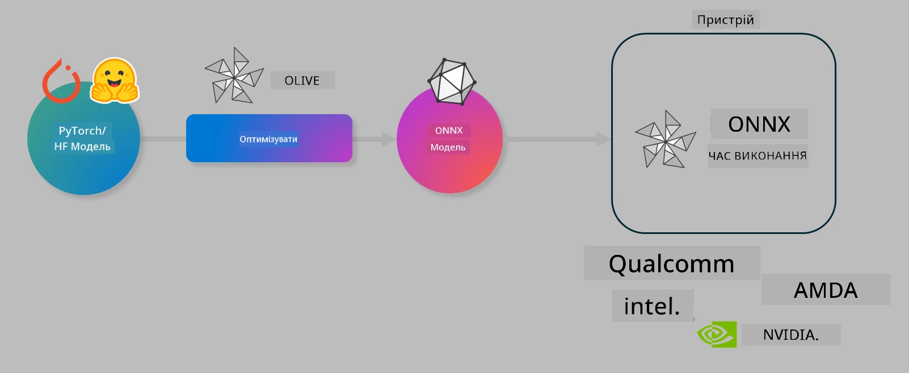

<!--
CO_OP_TRANSLATOR_METADATA:
{
  "original_hash": "6bbe47de3b974df7eea29dfeccf6032b",
  "translation_date": "2025-07-16T16:00:15+00:00",
  "source_file": "code/03.Finetuning/olive-lab/readme.md",
  "language_code": "uk"
}
-->
# Лабораторна робота. Оптимізація AI моделей для виконання на пристрої

## Вступ

> [!IMPORTANT]
> Для цієї лабораторної роботи потрібен **Nvidia A10 або A100 GPU** з відповідними драйверами та встановленим CUDA toolkit (версія 12+).

> [!NOTE]
> Це **35-хвилинна** лабораторна робота, яка дасть вам практичне ознайомлення з основними концепціями оптимізації моделей для виконання на пристрої за допомогою OLIVE.

## Цілі навчання

Після завершення цієї лабораторної роботи ви зможете використовувати OLIVE для:

- Квантування AI моделі за допомогою методу квантування AWQ.
- Тонкого налаштування AI моделі для конкретного завдання.
- Генерації LoRA адаптерів (тонко налаштованої моделі) для ефективного виконання на пристрої за допомогою ONNX Runtime.

### Що таке Olive

Olive (*O*NNX *live*) — це набір інструментів для оптимізації моделей з командним рядком, який дозволяє доставляти моделі для ONNX runtime +++https://onnxruntime.ai+++ з високою якістю та продуктивністю.



Вхідними даними для Olive зазвичай є модель PyTorch або Hugging Face, а вихідними — оптимізована ONNX модель, яка виконується на пристрої (цільовому середовищі розгортання) з ONNX runtime. Olive оптимізує модель під AI акселератор цільового пристрою (NPU, GPU, CPU), який надає виробник апаратного забезпечення, наприклад Qualcomm, AMD, Nvidia або Intel.

Olive виконує *workflow* — впорядковану послідовність окремих завдань оптимізації моделі, які називаються *passes* (проходи). Прикладами проходів є: стиснення моделі, захоплення графа, квантування, оптимізація графа. Кожен прохід має набір параметрів, які можна налаштовувати для досягнення найкращих метрик, наприклад точності та затримки, що оцінюються відповідним оцінювачем. Olive використовує стратегію пошуку, яка застосовує алгоритм пошуку для автоматичного налаштування кожного проходу по черзі або набору проходів разом.

#### Переваги Olive

- **Зменшення розчарування та часу** на ручні експерименти методом спроб і помилок з різними техніками оптимізації графа, стиснення та квантування. Визначте ваші вимоги до якості та продуктивності, і Olive автоматично знайде найкращу модель для вас.
- **Понад 40 вбудованих компонентів оптимізації моделей**, що охоплюють передові методи квантування, стиснення, оптимізації графа та тонкого налаштування.
- **Зручний CLI** для поширених завдань оптимізації моделей. Наприклад, olive quantize, olive auto-opt, olive finetune.
- Вбудоване пакування та розгортання моделей.
- Підтримка генерації моделей для **Multi LoRA сервінгу**.
- Створення workflow за допомогою YAML/JSON для оркестрації завдань оптимізації та розгортання моделей.
- Інтеграція з **Hugging Face** та **Azure AI**.
- Вбудований механізм **кешування** для **економії коштів**.

## Інструкції до лабораторної роботи

> [!NOTE]
> Переконайтеся, що ви створили Azure AI Hub і проект, а також налаштували обчислювальний ресурс A100 відповідно до Лабораторної роботи 1.

### Крок 0: Підключення до Azure AI Compute

Ви підключитесь до Azure AI Compute за допомогою функції віддаленого підключення у **VS Code**.

1. Відкрийте настільний додаток **VS Code**.
2. Відкрийте **command palette** за допомогою **Shift+Ctrl+P**.
3. У командній палітрі знайдіть **AzureML - remote: Connect to compute instance in New Window**.
4. Дотримуйтесь інструкцій на екрані для підключення до Compute. Вам потрібно буде вибрати вашу підписку Azure, групу ресурсів, проект і ім’я обчислювального ресурсу, які ви налаштували в Лабораторній роботі 1.
5. Після підключення до вашого Azure ML Compute вузла це буде відображено в **нижньому лівому куті Visual Code** як `><Azure ML: Compute Name`.

### Крок 1: Клонування репозиторію

У VS Code відкрийте новий термінал за допомогою **Ctrl+J** і клонувати цей репозиторій:

У терміналі ви побачите запрошення

```
azureuser@computername:~/cloudfiles/code$ 
```  
Клонувати рішення

```bash
cd ~/localfiles
git clone https://github.com/microsoft/phi-3cookbook.git
```

### Крок 2: Відкрити папку у VS Code

Щоб відкрити VS Code у відповідній папці, виконайте наступну команду в терміналі, яка відкриє нове вікно:

```bash
code phi-3cookbook/code/04.Finetuning/Olive-lab
```

Або відкрийте папку через меню **File** > **Open Folder**.

### Крок 3: Встановлення залежностей

Відкрийте термінал у VS Code на вашому Azure AI Compute Instance (порада: **Ctrl+J**) і виконайте наступні команди для встановлення залежностей:

```bash
conda create -n olive-ai python=3.11 -y
conda activate olive-ai
pip install -r requirements.txt
az extension remove -n azure-cli-ml
az extension add -n ml
```

> [!NOTE]
> Встановлення всіх залежностей займе приблизно 5 хвилин.

У цій лабораторній роботі ви будете завантажувати та відправляти моделі до каталогу моделей Azure AI. Щоб отримати доступ до каталогу моделей, потрібно увійти в Azure за допомогою:

```bash
az login
```

> [!NOTE]
> Під час входу вас попросять вибрати підписку. Переконайтеся, що ви обрали підписку, надану для цієї лабораторної роботи.

### Крок 4: Виконання команд Olive

Відкрийте термінал у VS Code на вашому Azure AI Compute Instance (порада: **Ctrl+J**) і переконайтеся, що активовано середовище `olive-ai` conda:

```bash
conda activate olive-ai
```

Далі виконайте наступні команди Olive у командному рядку.

1. **Перегляд даних:** У цьому прикладі ви тонко налаштовуєте модель Phi-3.5-Mini, щоб вона спеціалізувалась на відповідях на питання, пов’язані з подорожами. Код нижче показує перші кілька записів датасету у форматі JSON lines:

    ```bash
    head data/data_sample_travel.jsonl
    ```

2. **Квантування моделі:** Перед тренуванням моделі спочатку виконайте квантування за допомогою команди, що використовує техніку Active Aware Quantization (AWQ) +++https://arxiv.org/abs/2306.00978+++. AWQ квантує ваги моделі, враховуючи активації, які виникають під час інференсу. Це означає, що процес квантування враховує реальний розподіл даних в активаціях, що дозволяє краще зберегти точність моделі порівняно з традиційними методами квантування ваг.

    ```bash
    olive quantize \
       --model_name_or_path microsoft/Phi-3.5-mini-instruct \
       --trust_remote_code \
       --algorithm awq \
       --output_path models/phi/awq \
       --log_level 1
    ```

    Квантування AWQ займає приблизно **8 хвилин** і **зменшує розмір моделі з ~7.5 ГБ до ~2.5 ГБ**.

    У цій лабораторній роботі ми показуємо, як вводити моделі з Hugging Face (наприклад: `microsoft/Phi-3.5-mini-instruct`). Однак Olive також дозволяє вводити моделі з каталогу Azure AI, оновивши аргумент `model_name_or_path` на ID ресурсу Azure AI (наприклад: `azureml://registries/azureml/models/Phi-3.5-mini-instruct/versions/4`).

3. **Тренування моделі:** Далі команда `olive finetune` тонко налаштовує квантизовану модель. Квантування моделі *перед* тонким налаштуванням, а не після, дає кращу точність, оскільки процес тонкого налаштування відновлює частину втрат, спричинених квантуванням.

    ```bash
    olive finetune \
        --method lora \
        --model_name_or_path models/phi/awq \
        --data_files "data/data_sample_travel.jsonl" \
        --data_name "json" \
        --text_template "<|user|>\n{prompt}<|end|>\n<|assistant|>\n{response}<|end|>" \
        --max_steps 100 \
        --output_path ./models/phi/ft \
        --log_level 1
    ```

    Тонке налаштування займає приблизно **6 хвилин** (100 кроків).

4. **Оптимізація:** Після тренування моделі виконайте оптимізацію за допомогою команди `auto-opt` Olive, яка захоплює ONNX граф і автоматично виконує низку оптимізацій для покращення продуктивності моделі на CPU шляхом стиснення та ф’южн операцій. Варто зазначити, що ви також можете оптимізувати модель для інших пристроїв, таких як NPU або GPU, просто оновивши аргументи `--device` та `--provider` — але для цієї лабораторної роботи ми використовуємо CPU.

    ```bash
    olive auto-opt \
       --model_name_or_path models/phi/ft/model \
       --adapter_path models/phi/ft/adapter \
       --device cpu \
       --provider CPUExecutionProvider \
       --use_ort_genai \
       --output_path models/phi/onnx-ao \
       --log_level 1
    ```

    Оптимізація займає приблизно **5 хвилин**.

### Крок 5: Швидке тестування інференсу моделі

Щоб протестувати інференс моделі, створіть у вашій папці Python файл з назвою **app.py** і скопіюйте туди наступний код:

```python
import onnxruntime_genai as og
import numpy as np

print("loading model and adapters...", end="", flush=True)
model = og.Model("models/phi/onnx-ao/model")
adapters = og.Adapters(model)
adapters.load("models/phi/onnx-ao/model/adapter_weights.onnx_adapter", "travel")
print("DONE!")

tokenizer = og.Tokenizer(model)
tokenizer_stream = tokenizer.create_stream()

params = og.GeneratorParams(model)
params.set_search_options(max_length=100, past_present_share_buffer=False)
user_input = "what is the best thing to see in chicago"
params.input_ids = tokenizer.encode(f"<|user|>\n{user_input}<|end|>\n<|assistant|>\n")

generator = og.Generator(model, params)

generator.set_active_adapter(adapters, "travel")

print(f"{user_input}")

while not generator.is_done():
    generator.compute_logits()
    generator.generate_next_token()

    new_token = generator.get_next_tokens()[0]
    print(tokenizer_stream.decode(new_token), end='', flush=True)

print("\n")
```

Запустіть код за допомогою:

```bash
python app.py
```

### Крок 6: Завантаження моделі в Azure AI

Завантаження моделі до репозиторію моделей Azure AI робить модель доступною для інших членів вашої команди розробників, а також забезпечує контроль версій моделі. Щоб завантажити модель, виконайте наступну команду:

> [!NOTE]
> Замініть `{}` на назву вашої групи ресурсів та назву проекту Azure AI.

Щоб дізнатися назву вашої групи ресурсів `"resourceGroup"` та назву проекту Azure AI, виконайте команду:

```
az ml workspace show
```

Або зайдіть на +++ai.azure.com+++ і виберіть **management center** > **project** > **overview**

Замініть `{}` на назву вашої групи ресурсів та назву проекту Azure AI.

```bash
az ml model create \
    --name ft-for-travel \
    --version 1 \
    --path ./models/phi/onnx-ao \
    --resource-group {RESOURCE_GROUP_NAME} \
    --workspace-name {PROJECT_NAME}
```

Потім ви зможете побачити завантажену модель і розгорнути її на https://ml.azure.com/model/list

**Відмова від відповідальності**:  
Цей документ було перекладено за допомогою сервісу автоматичного перекладу [Co-op Translator](https://github.com/Azure/co-op-translator). Хоча ми прагнемо до точності, будь ласка, майте на увазі, що автоматичні переклади можуть містити помилки або неточності. Оригінальний документ рідною мовою слід вважати авторитетним джерелом. Для критично важливої інформації рекомендується звертатися до професійного людського перекладу. Ми не несемо відповідальності за будь-які непорозуміння або неправильні тлумачення, що виникли внаслідок використання цього перекладу.