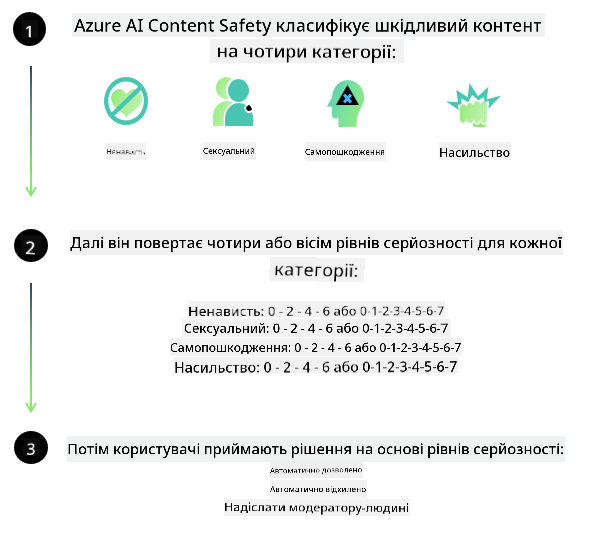

<!--
CO_OP_TRANSLATOR_METADATA:
{
  "original_hash": "839ccc4b3886ef10cfd4e64977f5792d",
  "translation_date": "2026-01-05T16:02:03+00:00",
  "source_file": "md/01.Introduction/01/01.AISafety.md",
  "language_code": "uk"
}
-->
# Безпека ШІ для моделей Phi
Серія моделей Phi була розроблена відповідно до [Стандарту відповідального ШІ Microsoft](https://www.microsoft.com/ai/principles-and-approach#responsible-ai-standard), який є загальнокорпоративним набором вимог, заснованих на шести принципах: підзвітність, прозорість, справедливість, надійність і безпека, конфіденційність і захист, а також інклюзивність, які формують [Принципи відповідального ШІ Microsoft](https://www.microsoft.com/ai/responsible-ai).

Як і попередні моделі Phi, було прийнято багатогранний підхід до оцінки безпеки та посттренувального забезпечення безпеки, з додатковими заходами, що враховують багатомовні можливості цього релізу. Наш підхід до тренування безпеки та оцінок, включаючи тестування кількома мовами та за категоріями ризиків, описаний у [статті Phi Safety Post-Training Paper](https://arxiv.org/abs/2407.13833). Хоча моделі Phi отримують користь від цього підходу, розробники повинні застосовувати найкращі практики відповідального ШІ, включно з картографуванням, вимірюванням та зменшенням ризиків, пов’язаних із їхнім конкретним випадком використання та культурним і мовним контекстом.

## Найкращі практики

Як і інші моделі, серія Phi потенційно може поводитися несправедливо, ненадійно або образливо.

Деякі обмеження поведінки SLM та LLM, про які слід знати, включають:

- **Якість обслуговування:** Моделі Phi треновані в основному на текстах англійською мовою. Мови, крім англійської, демонструватимуть гірші результати. Варіанти англійської мови, менш представлені у тренувальних даних, можуть мати гіршу продуктивність порівняно зі стандартною американською англійською.
- **Представлення шкоди та підтримання стереотипів:** Ці моделі можуть надмірно або недостатньо представляти певні групи людей, ігнорувати представлення деяких груп або посилювати принизливі чи негативні стереотипи. Незважаючи на посттренувальне забезпечення безпеки, ці обмеження можуть залишатися через різні рівні представленості груп або наявність прикладів негативних стереотипів у навчальних даних, що відображають реальні шаблони і суспільні упередження.
- **Неприйнятний або образливий контент:** Ці моделі можуть генерувати інші типи неприйнятного або образливого контенту, що може робити їх неприйнятними для використання у чутливих контекстах без додаткових заходів, специфічних для даного випадку.
- **Надійність інформації:** Мовні моделі можуть створювати безглуздий контент або вигадувати інформацію, яка звучить правдоподібно, але є неточною або застарілою.
- **Обмежена сфера застосування коду:** Більшість тренувальних даних Phi-3 базується на Python та використовує популярні пакети, такі як "typing, math, random, collections, datetime, itertools". Якщо модель генерує скрипти Python з використанням інших пакетів або скрипти іншими мовами, ми настійно рекомендуємо користувачам вручну перевіряти всі виклики API.

Розробники повинні дотримуватись кращих практик відповідального ШІ та нести відповідальність за відповідність конкретного випадку використання чинним законам і нормативам (наприклад, конфіденційність, торгівля тощо).

## Зауваження щодо відповідального ШІ

Як і інші мовні моделі, серія Phi потенційно може поводитися несправедливо, ненадійно або образливо. Деякі обмеження, про які слід знати:

**Якість обслуговування:** Моделі Phi треновані переважно на текстах англійською мовою. Інші мови демонструватимуть гіршу продуктивність. Варіанти англійської з меншим представленням у тренувальних даних можуть працювати гірше за стандартну американську англійську.

**Представлення шкоди та підтримання стереотипів:** Ці моделі можуть надмірно або недостатньо представляти групи людей, стирати представлення деяких груп або підсилювати принизливі чи негативні стереотипи. Незважаючи на посттренувальне забезпечення безпеки, ці обмеження можуть залишатися через різні рівні представленості груп або наявність прикладів негативних стереотипів у навчальних даних, що відображають реальні суспільні упередження.

**Неприйнятний або образливий контент:** Моделі можуть створювати інші типи неприйнятного або образливого контенту, що робить їх неприйнятними для використання у чутливих контекстах без додаткових заходів, специфічних для випадку використання.  
Надійність інформації: мовні моделі можуть виробляти безглуздий або вигадуваний контент, що звучить правдоподібно, але є неточним чи застарілим.

**Обмежена сфера застосування коду:** Більшість тренувальних даних Phi-3 базується на Python та використовує популярні пакети, такі як "typing, math, random, collections, datetime, itertools". Якщо модель створює Python-скрипти з використанням інших пакетів або скрипти іншими мовами, настійно рекомендуємо користувачам вручну перевіряти всі виклики API.

Розробники повинні застосовувати найкращі практики відповідального ШІ та відповідати за відповідність конкретного випадку чинним законам і нормативам (наприклад, конфіденційність, торгівля тощо). Важливі аспекти для розгляду включають:

**Розподіл:** Моделі можуть бути непридатними для сценаріїв, які можуть суттєво вплинути на правовий статус або розподіл ресурсів чи життєвих можливостей (наприклад, житло, працевлаштування, кредитування) без додаткових оцінок та технік усунення упереджень.

**Високоризикові сценарії:** Розробники повинні оцінювати придатність використання моделей у високоризикових сценаріях, де несправедливі, ненадійні або образливі результати можуть бути вкрай коштовними або призвести до шкоди. Це включає надання порад у чутливих чи експертних сферах, де точність і надійність критично важливі (наприклад, юридичні або медичні консультації). Додаткові заходи безпеки мають бути впроваджені на рівні застосунку залежно від контексту розгортання.

**Дезінформація:** Моделі можуть надавати неточну інформацію. Розробники повинні дотримуватися найкращих практик прозорості та інформувати кінцевих користувачів, що вони взаємодіють із системою ШІ. На рівні застосунку розробники можуть створювати механізми зворотного зв’язку та конвеєри для підкріплення відповідей інформацією, специфічною для випадку використання, технікою, відомою як Retrieval Augmented Generation (RAG).

**Генерація шкідливого контенту:** Розробники повинні оцінювати вихідні дані моделі з урахуванням контексту та використовувати доступні класифікатори безпеки або власні рішення, відповідні для конкретного випадку.

**Зловживання:** Можливі інші форми зловживання, такі як шахрайство, спам чи створення шкідливих програм, тому розробники повинні забезпечити, що їхні застосунки не порушують чинні закони та нормативи.

### Тонке налаштування та безпека контенту ШІ

Після тонкого налаштування моделі ми настійно рекомендуємо використовувати заходи [Azure AI Content Safety](https://learn.microsoft.com/azure/ai-services/content-safety/overview) для моніторингу контенту, який генерують моделі, виявлення та блокування потенційних ризиків, загроз і проблем якості.

[Azure AI Content Safety](https://learn.microsoft.com/azure/ai-services/content-safety/overview) підтримує як текстовий, так і зображений контент. Його можна розгортати в хмарі, у відключених контейнерах і на периферійних/вбудованих пристроях.

## Огляд Azure AI Content Safety

Azure AI Content Safety не є універсальним рішенням; його можна налаштовувати відповідно до конкретних політик бізнесу. Крім того, його багатомовні моделі дозволяють розуміти кілька мов одночасно.

- **Azure AI Content Safety**  
- **Microsoft Developer**  
- **5 відео**

Сервіс Azure AI Content Safety виявляє шкідливий контент, створений користувачами та ШІ, у додатках і сервісах. Він містить API для тексту і зображень, які дозволяють виявляти шкідливий або неприйнятний матеріал.

[AI Content Safety Playlist](https://www.youtube.com/playlist?list=PLlrxD0HtieHjaQ9bJjyp1T7FeCbmVcPkQ)

---

<!-- CO-OP TRANSLATOR DISCLAIMER START -->
**Відмова від відповідальності**:
Цей документ було перекладено за допомогою сервісу автоматичного перекладу [Co-op Translator](https://github.com/Azure/co-op-translator). Хоча ми прагнемо до точності, будь ласка, враховуйте, що автоматичні переклади можуть містити помилки або неточності. Оригінальний документ його рідною мовою слід розглядати як авторитетне джерело. Для критично важливої інформації рекомендується професійний переклад людиною. Ми не несемо відповідальності за будь-які непорозуміння або неправильні тлумачення, що можуть виникнути внаслідок використання цього перекладу.
<!-- CO-OP TRANSLATOR DISCLAIMER END -->