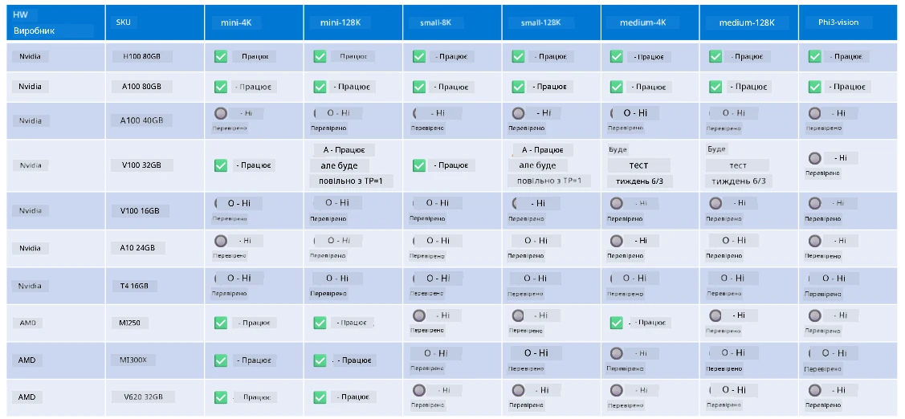

<!--
CO_OP_TRANSLATOR_METADATA:
{
  "original_hash": "8cdc17ce0f10535da30b53d23fe1a795",
  "translation_date": "2025-07-16T18:27:48+00:00",
  "source_file": "md/01.Introduction/01/01.Hardwaresupport.md",
  "language_code": "uk"
}
-->
# Підтримка апаратного забезпечення Phi

Microsoft Phi оптимізовано для ONNX Runtime і підтримує Windows DirectML. Він добре працює на різних типах апаратного забезпечення, включно з GPU, CPU та навіть мобільними пристроями.

## Апаратне забезпечення пристрою  
Зокрема, підтримуване апаратне забезпечення включає:

- GPU SKU: RTX 4090 (DirectML)
- GPU SKU: 1 A100 80GB (CUDA)
- CPU SKU: Standard F64s v2 (64 vCPU, 128 ГБ пам’яті)

## Мобільні SKU

- Android – Samsung Galaxy S21
- Apple iPhone 14 або новіший з процесором A16/A17

## Технічні характеристики апаратного забезпечення Phi

- Мінімальна необхідна конфігурація.
- Windows: GPU з підтримкою DirectX 12 та мінімум 4 ГБ сумарної оперативної пам’яті

CUDA: NVIDIA GPU з Compute Capability >= 7.02



## Запуск onnxruntime на кількох GPU

Наразі доступні моделі Phi ONNX підтримують лише 1 GPU. Можлива підтримка мульти-GPU для моделей Phi, але ORT з 2 GPU не гарантує вищу пропускну здатність порівняно з двома окремими інстансами ort. Будь ласка, дивіться [ONNX Runtime](https://onnxruntime.ai/) для останніх оновлень.

На [Build 2024 команда GenAI ONNX](https://youtu.be/WLW4SE8M9i8?si=EtG04UwDvcjunyfC) оголосила, що вони ввели підтримку мульти-інстансів замість мульти-GPU для моделей Phi.

Наразі це дозволяє запускати один інстанс onnnxruntime або onnxruntime-genai з використанням змінної середовища CUDA_VISIBLE_DEVICES таким чином.

```Python
CUDA_VISIBLE_DEVICES=0 python infer.py
CUDA_VISIBLE_DEVICES=1 python infer.py
```

Не соромтеся досліджувати Phi далі в [Azure AI Foundry](https://ai.azure.com)

**Відмова від відповідальності**:  
Цей документ було перекладено за допомогою сервісу автоматичного перекладу [Co-op Translator](https://github.com/Azure/co-op-translator). Хоча ми прагнемо до точності, будь ласка, майте на увазі, що автоматичні переклади можуть містити помилки або неточності. Оригінальний документ рідною мовою слід вважати авторитетним джерелом. Для критично важливої інформації рекомендується звертатися до професійного людського перекладу. Ми не несемо відповідальності за будь-які непорозуміння або неправильні тлумачення, що виникли внаслідок використання цього перекладу.