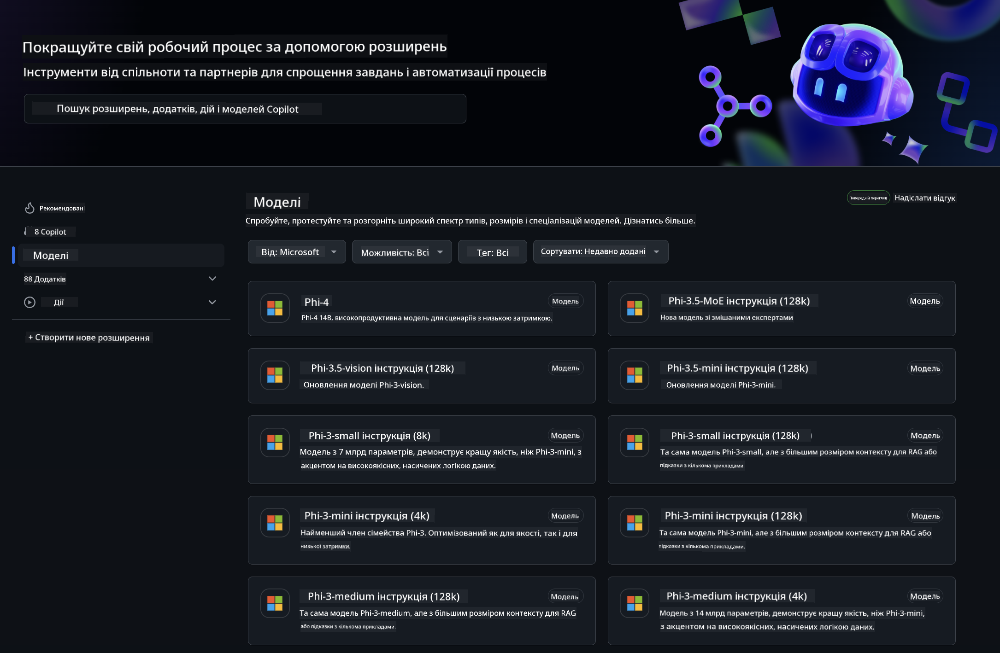
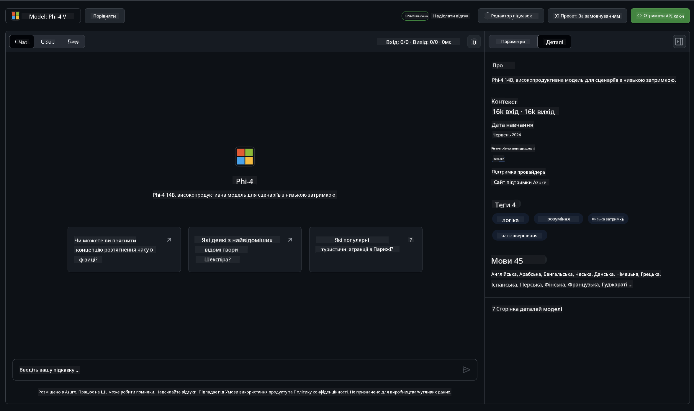
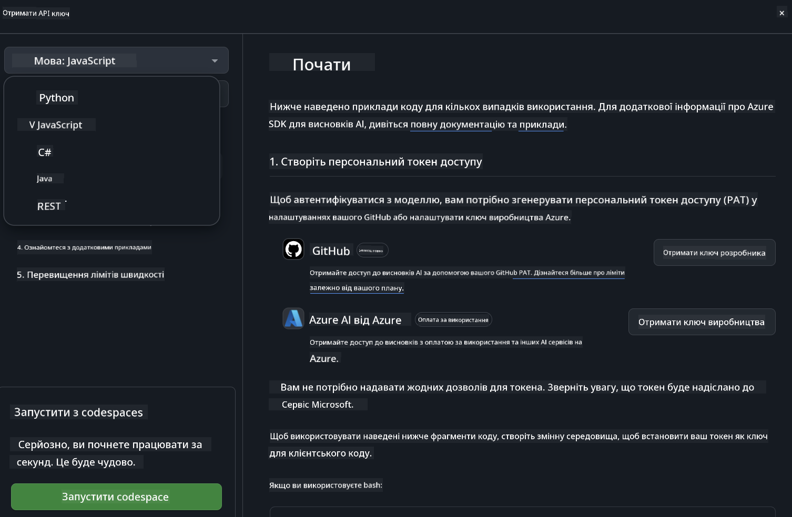
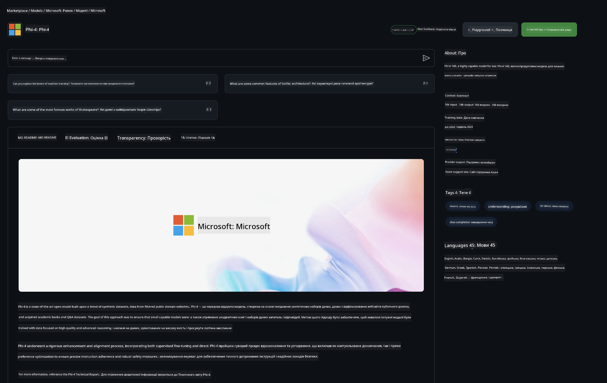

<!--
CO_OP_TRANSLATOR_METADATA:
{
  "original_hash": "fb67a08b9fc911a10ed58081fadef416",
  "translation_date": "2025-07-16T19:06:08+00:00",
  "source_file": "md/01.Introduction/02/02.GitHubModel.md",
  "language_code": "uk"
}
-->
## Родина Phi у GitHub Models

Ласкаво просимо до [GitHub Models](https://github.com/marketplace/models)! Усе готово для вас, щоб досліджувати AI-моделі, розміщені на Azure AI.



Для отримання додаткової інформації про моделі, доступні на GitHub Models, перегляньте [GitHub Model Marketplace](https://github.com/marketplace/models)

## Доступні моделі

Кожна модель має власний майданчик для тестування та приклади коду



### Родина Phi у каталозі GitHub Models

- [Phi-4](https://github.com/marketplace/models/azureml/Phi-4)

- [Phi-3.5-MoE instruct (128k)](https://github.com/marketplace/models/azureml/Phi-3-5-MoE-instruct)

- [Phi-3.5-vision instruct (128k)](https://github.com/marketplace/models/azureml/Phi-3-5-vision-instruct)

- [Phi-3.5-mini instruct (128k)](https://github.com/marketplace/models/azureml/Phi-3-5-mini-instruct)

- [Phi-3-Medium-128k-Instruct](https://github.com/marketplace/models/azureml/Phi-3-medium-128k-instruct)

- [Phi-3-medium-4k-instruct](https://github.com/marketplace/models/azureml/Phi-3-medium-4k-instruct)

- [Phi-3-mini-128k-instruct](https://github.com/marketplace/models/azureml/Phi-3-mini-128k-instruct)

- [Phi-3-mini-4k-instruct](https://github.com/marketplace/models/azureml/Phi-3-mini-4k-instruct)

- [Phi-3-small-128k-instruct](https://github.com/marketplace/models/azureml/Phi-3-small-128k-instruct)

- [Phi-3-small-8k-instruct](https://github.com/marketplace/models/azureml/Phi-3-small-8k-instruct)

## Початок роботи

Є кілька базових прикладів, готових до запуску. Ви можете знайти їх у каталозі samples. Якщо хочете одразу перейти до улюбленої мови програмування, приклади доступні для таких мов:

- Python  
- JavaScript  
- C#  
- Java  
- cURL  

Також є спеціальне середовище Codespaces для запуску прикладів і моделей.



## Приклад коду

Нижче наведені приклади коду для кількох сценаріїв використання. Для додаткової інформації про Azure AI Inference SDK дивіться повну документацію та приклади.

## Налаштування

1. Створіть персональний токен доступу  
Вам не потрібно надавати жодних дозволів для токена. Зверніть увагу, що токен буде передаватися до сервісу Microsoft.

Щоб використовувати наведені нижче фрагменти коду, створіть змінну середовища, в якій ваш токен буде ключем для клієнтського коду.

Якщо ви використовуєте bash:  
```
export GITHUB_TOKEN="<your-github-token-goes-here>"
```  
Якщо ви у powershell:  

```
$Env:GITHUB_TOKEN="<your-github-token-goes-here>"
```  

Якщо ви використовуєте командний рядок Windows:  

```
set GITHUB_TOKEN=<your-github-token-goes-here>
```  

## Приклад на Python

### Встановлення залежностей  
Встановіть Azure AI Inference SDK за допомогою pip (потрібен Python версії >=3.8):

```
pip install azure-ai-inference
```  
### Запуск базового прикладу коду

Цей приклад демонструє базовий виклик API для завершення чату. Він використовує кінцеву точку GitHub AI model inference та ваш GitHub токен. Виклик є синхронним.

```python
import os
from azure.ai.inference import ChatCompletionsClient
from azure.ai.inference.models import SystemMessage, UserMessage
from azure.core.credentials import AzureKeyCredential

endpoint = "https://models.inference.ai.azure.com"
model_name = "Phi-4"
token = os.environ["GITHUB_TOKEN"]

client = ChatCompletionsClient(
    endpoint=endpoint,
    credential=AzureKeyCredential(token),
)

response = client.complete(
    messages=[
        UserMessage(content="I have $20,000 in my savings account, where I receive a 4% profit per year and payments twice a year. Can you please tell me how long it will take for me to become a millionaire? Also, can you please explain the math step by step as if you were explaining it to an uneducated person?"),
    ],
    temperature=0.4,
    top_p=1.0,
    max_tokens=2048,
    model=model_name
)

print(response.choices[0].message.content)
```

### Запуск багатокрокової розмови

Цей приклад демонструє багатокрокову розмову з API для завершення чату. При використанні моделі для чат-додатку потрібно керувати історією розмови та надсилати моделі останні повідомлення.

```
import os
from azure.ai.inference import ChatCompletionsClient
from azure.ai.inference.models import AssistantMessage, SystemMessage, UserMessage
from azure.core.credentials import AzureKeyCredential

token = os.environ["GITHUB_TOKEN"]
endpoint = "https://models.inference.ai.azure.com"
# Replace Model_Name
model_name = "Phi-4"

client = ChatCompletionsClient(
    endpoint=endpoint,
    credential=AzureKeyCredential(token),
)

messages = [
    SystemMessage(content="You are a helpful assistant."),
    UserMessage(content="What is the capital of France?"),
    AssistantMessage(content="The capital of France is Paris."),
    UserMessage(content="What about Spain?"),
]

response = client.complete(messages=messages, model=model_name)

print(response.choices[0].message.content)
```

### Потокова передача результату

Для кращого користувацького досвіду варто передавати відповідь моделі по частинах, щоб перший токен з’явився швидше і не доводилось довго чекати на повну відповідь.

```
import os
from azure.ai.inference import ChatCompletionsClient
from azure.ai.inference.models import SystemMessage, UserMessage
from azure.core.credentials import AzureKeyCredential

token = os.environ["GITHUB_TOKEN"]
endpoint = "https://models.inference.ai.azure.com"
# Replace Model_Name
model_name = "Phi-4"

client = ChatCompletionsClient(
    endpoint=endpoint,
    credential=AzureKeyCredential(token),
)

response = client.complete(
    stream=True,
    messages=[
        SystemMessage(content="You are a helpful assistant."),
        UserMessage(content="Give me 5 good reasons why I should exercise every day."),
    ],
    model=model_name,
)

for update in response:
    if update.choices:
        print(update.choices[0].delta.content or "", end="")

client.close()
```

## Безкоштовне використання та обмеження швидкості для GitHub Models



[Обмеження швидкості для майданчика та безкоштовного API](https://docs.github.com/en/github-models/prototyping-with-ai-models#rate-limits) покликані допомогти вам експериментувати з моделями та прототипувати AI-додатки. Для використання понад ці ліміти та масштабування вашого додатку потрібно виділити ресурси з облікового запису Azure та аутентифікуватися через нього замість персонального токена GitHub. Вам не потрібно змінювати інший код. Використайте це посилання, щоб дізнатися, як вийти за межі безкоштовного рівня в Azure AI.

### Відмови від відповідальності

Пам’ятайте, що при взаємодії з моделлю ви експериментуєте з AI, тому можливі помилки у вмісті.

Функція має різні обмеження (включно з кількістю запитів за хвилину, за день, токенів на запит та одночасних запитів) і не призначена для використання у виробничих сценаріях.

GitHub Models використовує Azure AI Content Safety. Ці фільтри не можна вимкнути в рамках досвіду GitHub Models. Якщо ви вирішите використовувати моделі через платний сервіс, налаштуйте фільтри вмісту відповідно до ваших вимог.

Цей сервіс працює відповідно до Умов попереднього релізу GitHub.

**Відмова від відповідальності**:  
Цей документ було перекладено за допомогою сервісу автоматичного перекладу [Co-op Translator](https://github.com/Azure/co-op-translator). Хоча ми прагнемо до точності, будь ласка, майте на увазі, що автоматичні переклади можуть містити помилки або неточності. Оригінальний документ рідною мовою слід вважати авторитетним джерелом. Для критично важливої інформації рекомендується звертатися до професійного людського перекладу. Ми не несемо відповідальності за будь-які непорозуміння або неправильні тлумачення, що виникли внаслідок використання цього перекладу.