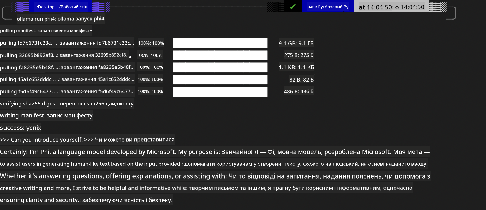
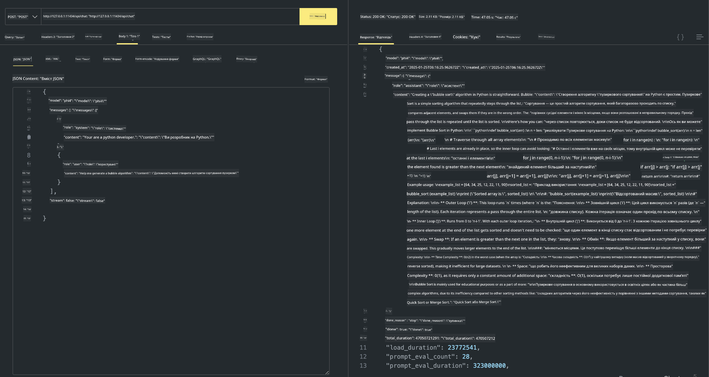

<!--
CO_OP_TRANSLATOR_METADATA:
{
  "original_hash": "0b38834693bb497f96bf53f0d941f9a1",
  "translation_date": "2025-07-16T19:19:55+00:00",
  "source_file": "md/01.Introduction/02/04.Ollama.md",
  "language_code": "uk"
}
-->
## Родина Phi в Ollama


[Ollama](https://ollama.com) дає змогу більшій кількості людей безпосередньо запускати відкриті LLM або SLM за допомогою простих скриптів, а також створювати API для підтримки локальних сценаріїв застосування Copilot.

## **1. Встановлення**

Ollama підтримує роботу на Windows, macOS та Linux. Ви можете встановити Ollama за цим посиланням ([https://ollama.com/download](https://ollama.com/download)). Після успішного встановлення ви можете безпосередньо використовувати скрипт Ollama для виклику Phi-3 через термінал. Ви можете переглянути всі [доступні бібліотеки в Ollama](https://ollama.com/library). Якщо ви відкриєте цей репозиторій у Codespace, Ollama вже буде встановлено.

```bash

ollama run phi4

```

> [!NOTE]
> Модель буде завантажена вперше при першому запуску. Звісно, ви також можете одразу вказати завантажену модель Phi-4. Для прикладу ми використовуємо WSL для запуску команди. Після успішного завантаження моделі ви можете безпосередньо взаємодіяти через термінал.



## **2. Виклик API phi-4 з Ollama**

Якщо ви хочете викликати API Phi-4, створений Ollama, ви можете запустити сервер Ollama за допомогою цієї команди в терміналі.

```bash

ollama serve

```

> [!NOTE]
> Якщо ви працюєте на MacOS або Linux, зверніть увагу, що може з’явитися помилка **"Error: listen tcp 127.0.0.1:11434: bind: address already in use"**. Цю помилку можна отримати при запуску команди. Ви можете її ігнорувати, оскільки зазвичай це означає, що сервер вже запущений, або зупинити та перезапустити Ollama:

**macOS**

```bash

brew services restart ollama

```

**Linux**

```bash

sudo systemctl stop ollama

```

Ollama підтримує два API: generate та chat. Ви можете викликати API моделі, яку надає Ollama, відповідно до ваших потреб, надсилаючи запити до локального сервісу, що працює на порту 11434.

**Chat**

```bash

curl http://127.0.0.1:11434/api/chat -d '{
  "model": "phi3",
  "messages": [
    {
      "role": "system",
      "content": "Your are a python developer."
    },
    {
      "role": "user",
      "content": "Help me generate a bubble algorithm"
    }
  ],
  "stream": false
  
}'

This is the result in Postman



## Additional Resources

Check the list of available models in Ollama in [their library](https://ollama.com/library).

Pull your model from the Ollama server using this command

```bash
ollama pull phi4
```

Run the model using this command

```bash
ollama run phi4
```

***Note:*** Visit this link [https://github.com/ollama/ollama/blob/main/docs/api.md](https://github.com/ollama/ollama/blob/main/docs/api.md) to learn more

## Calling Ollama from Python

You can use `requests` or `urllib3` to make requests to the local server endpoints used above. However, a popular way to use Ollama in Python is via the [openai](https://pypi.org/project/openai/) SDK, since Ollama provides OpenAI-compatible server endpoints as well.

Here is an example for phi3-mini:

```python
import openai

client = openai.OpenAI(
    base_url="http://localhost:11434/v1",
    api_key="nokeyneeded",
)

response = client.chat.completions.create(
    model="phi4",
    temperature=0.7,
    n=1,
    messages=[
        {"role": "system", "content": "Ви — корисний помічник."},
        {"role": "user", "content": "Напиши хайку про голодного кота"},
    ],
)

print("Відповідь:")
print(response.choices[0].message.content)
```

## Calling Ollama from JavaScript 

```javascript
// Приклад підсумовування файлу за допомогою Phi-4
script({
    model: "ollama:phi4",
    title: "Підсумувати за допомогою Phi-4",
    system: ["system"],
})

// Приклад підсумовування
const file = def("FILE", env.files)
$`Підсумуй ${file} в одному абзаці.`
```

## Calling Ollama from C#

Create a new C# Console application and add the following NuGet package:

```bash
dotnet add package Microsoft.SemanticKernel --version 1.34.0
```

Then replace this code in the `Program.cs` file

```csharp
using Microsoft.SemanticKernel;
using Microsoft.SemanticKernel.ChatCompletion;

// додати сервіс чат-комплішенів, використовуючи локальний сервер ollama
#pragma warning disable SKEXP0001, SKEXP0003, SKEXP0010, SKEXP0011, SKEXP0050, SKEXP0052
builder.AddOpenAIChatCompletion(
    modelId: "phi4",
    endpoint: new Uri("http://localhost:11434/"),
    apiKey: "non required");

// виклик простого запиту до чат-сервісу
string prompt = "Напиши жарт про кошенят";
var response = await kernel.InvokePromptAsync(prompt);
Console.WriteLine(response.GetValue<string>());
```

Run the app with the command:

```bash
dotnet run


**Відмова від відповідальності**:  
Цей документ було перекладено за допомогою сервісу автоматичного перекладу [Co-op Translator](https://github.com/Azure/co-op-translator). Хоча ми прагнемо до точності, будь ласка, майте на увазі, що автоматичні переклади можуть містити помилки або неточності. Оригінальний документ рідною мовою слід вважати авторитетним джерелом. Для критично важливої інформації рекомендується звертатися до професійного людського перекладу. Ми не несемо відповідальності за будь-які непорозуміння або неправильні тлумачення, що виникли внаслідок використання цього перекладу.