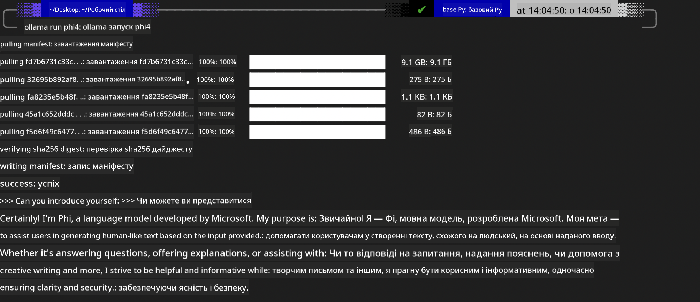

<!--
CO_OP_TRANSLATOR_METADATA:
{
  "original_hash": "2aa35f3c8b437fd5dc9995d53909d495",
  "translation_date": "2025-12-21T14:28:25+00:00",
  "source_file": "md/01.Introduction/02/04.Ollama.md",
  "language_code": "uk"
}
-->
## Сімейство Phi в Ollama


[Ollama](https://ollama.com) дозволяє більшій кількості людей безпосередньо розгортати відкриті LLM або SLM за допомогою простих скриптів, а також може створювати API для підтримки локальних сценаріїв застосування Copilot.

## **1. Встановлення**

Ollama підтримує запуск на Windows, macOS і Linux. Ви можете встановити Ollama за цим посиланням ([https://ollama.com/download](https://ollama.com/download)). Після успішної інсталяції ви можете безпосередньо використовувати скрипт Ollama для виклику Phi-3 через вікно терміналу. Ви можете переглянути всі [доступні бібліотеки в Ollama](https://ollama.com/library). Якщо ви відкриєте цей репозиторій у Codespace, в ньому вже буде встановлено Ollama.

```bash

ollama run phi4

```

> [!NOTE]
> Спочатку при першому запуску модель буде завантажена. Звичайно, ви також можете безпосередньо вказати вже завантажену модель Phi-4. Ми беремо WSL як приклад для виконання команди. Після успішного завантаження моделі ви можете взаємодіяти безпосередньо в терміналі.



## **2. Виклик API phi-4 через Ollama**

Якщо ви хочете викликати API Phi-4, згенерований Ollama, ви можете використати цю команду в терміналі, щоб запустити сервер Ollama.

```bash

ollama serve

```

> [!NOTE]
> Якщо виконувати на MacOS або Linux, зауважте, що ви можете зіткнутися з такою помилкою **"Error: listen tcp 127.0.0.1:11434: bind: address already in use"**. Ви можете отримати цю помилку при виконанні команди. Ви можете або ігнорувати цю помилку, оскільки вона зазвичай вказує на те, що сервер уже запущено, або зупинити та перезапустити Ollama:

**macOS**

```bash

brew services restart ollama

```

**Linux**

```bash

sudo systemctl stop ollama

```

Ollama підтримує два API: generate та chat. Ви можете викликати API моделі, що надається Ollama, відповідно до ваших потреб, надсилаючи запити до локального сервісу, який працює на порту 11434.

**Chat**

```bash

curl http://127.0.0.1:11434/api/chat -d '{
  "model": "phi3",
  "messages": [
    {
      "role": "system",
      "content": "Your are a python developer."
    },
    {
      "role": "user",
      "content": "Help me generate a bubble algorithm"
    }
  ],
  "stream": false
  
}'
```

This is the result in Postman


## Додаткові ресурси

Перегляньте список доступних моделей в Ollama у [їхній бібліотеці](https://ollama.com/library).

Витягніть вашу модель з сервера Ollama, використовуючи цю команду

```bash
ollama pull phi4
```

Запустіть модель, використовуючи цю команду

```bash
ollama run phi4
```

***Примітка:*** Відвідайте це посилання [https://github.com/ollama/ollama/blob/main/docs/api.md](https://github.com/ollama/ollama/blob/main/docs/api.md), щоб дізнатися більше

## Виклик Ollama з Python

Ви можете використовувати `requests` або `urllib3` для надсилання запитів до локальних кінцевих точок сервера, згаданих вище. Однак поширений спосіб використання Ollama в Python — через SDK [openai](https://pypi.org/project/openai/), оскільки Ollama також надає сумісні з OpenAI кінцеві точки сервера.

Ось приклад для phi3-mini:

```python
import openai

client = openai.OpenAI(
    base_url="http://localhost:11434/v1",
    api_key="nokeyneeded",
)

response = client.chat.completions.create(
    model="phi4",
    temperature=0.7,
    n=1,
    messages=[
        {"role": "system", "content": "You are a helpful assistant."},
        {"role": "user", "content": "Write a haiku about a hungry cat"},
    ],
)

print("Response:")
print(response.choices[0].message.content)
```

## Виклик Ollama з JavaScript 
```javascript
// Приклад підсумовування файлу за допомогою Phi-4
script({
    model: "ollama:phi4",
    title: "Summarize with Phi-4",
    system: ["system"],
})

// Приклад підсумовування
const file = def("FILE", env.files)
$`Summarize ${file} in a single paragraph.`
```

## Виклик Ollama з C#

Створіть новий консольний додаток C# і додайте наступний пакет NuGet:

```bash
dotnet add package Microsoft.SemanticKernel --version 1.34.0
```

Потім замініть цей код у файлі `Program.cs`

```csharp
using Microsoft.SemanticKernel;
using Microsoft.SemanticKernel.ChatCompletion;

// add chat completion service using the local ollama server endpoint
#pragma warning disable SKEXP0001, SKEXP0003, SKEXP0010, SKEXP0011, SKEXP0050, SKEXP0052
builder.AddOpenAIChatCompletion(
    modelId: "phi4",
    endpoint: new Uri("http://localhost:11434/"),
    apiKey: "non required");

// invoke a simple prompt to the chat service
string prompt = "Write a joke about kittens";
var response = await kernel.InvokePromptAsync(prompt);
Console.WriteLine(response.GetValue<string>());
```

Запустіть додаток за допомогою команди:

```bash
dotnet run
```

---

<!-- CO-OP TRANSLATOR DISCLAIMER START -->
Відмова від відповідальності:
Цей документ було перекладено за допомогою сервісу машинного перекладу на основі ШІ Co-op Translator (https://github.com/Azure/co-op-translator). Хоча ми прагнемо до точності, просимо врахувати, що автоматичні переклади можуть містити помилки або неточності. Оригінальний документ його рідною мовою слід вважати авторитетним джерелом. Для критично важливої інформації рекомендується професійний переклад, виконаний людиною. Ми не несемо відповідальності за будь‑які непорозуміння або неправильні тлумачення, що виникли внаслідок використання цього перекладу.
<!-- CO-OP TRANSLATOR DISCLAIMER END -->