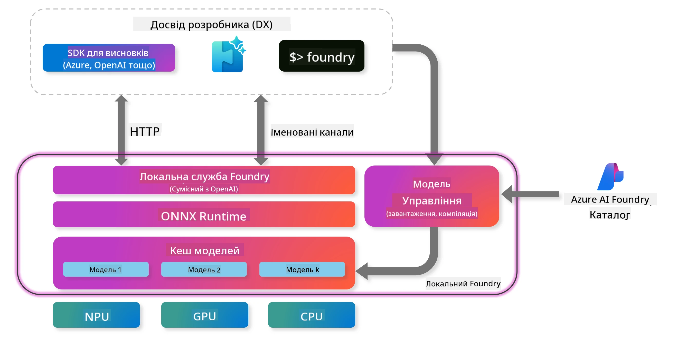
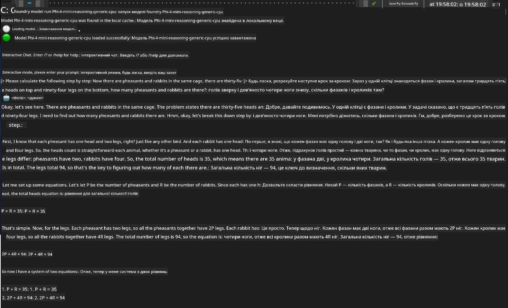

<!--
CO_OP_TRANSLATOR_METADATA:
{
  "original_hash": "52973a5680a65a810aa80b7036afd31f",
  "translation_date": "2025-07-16T19:52:29+00:00",
  "source_file": "md/01.Introduction/02/07.FoundryLocal.md",
  "language_code": "uk"
}
-->
## Початок роботи з моделями Phi-Family у Foundry Local

### Вступ до Foundry Local

Foundry Local — це потужне рішення для AI-інференсу безпосередньо на пристрої, яке надає корпоративний рівень AI можливостей прямо на вашому локальному обладнанні. Цей посібник допоможе вам налаштувати та використовувати моделі Phi-Family з Foundry Local, забезпечуючи повний контроль над AI-навантаженнями, зберігаючи конфіденційність і знижуючи витрати.

Foundry Local забезпечує переваги в продуктивності, конфіденційності, налаштуванні та вартості, запускаючи AI-моделі локально на вашому пристрої. Він безшовно інтегрується у ваші існуючі робочі процеси та додатки через зручний CLI, SDK та REST API.




### Чому варто обрати Foundry Local?

Розуміння переваг Foundry Local допоможе вам прийняти обґрунтоване рішення щодо стратегії розгортання AI:

- **Інференс на пристрої:** Запускайте моделі локально на власному обладнанні, знижуючи витрати та зберігаючи всі дані на вашому пристрої.

- **Налаштування моделей:** Обирайте з готових моделей або використовуйте власні, щоб відповідати конкретним вимогам і сценаріям використання.

- **Економія коштів:** Усуньте повторювані витрати на хмарні сервіси, використовуючи наявне обладнання, роблячи AI більш доступним.

- **Безшовна інтеграція:** Підключайтеся до ваших додатків через SDK, API або CLI з легким масштабуванням до Azure AI Foundry у міру зростання потреб.

> **Примітка для початку:** Цей посібник зосереджений на використанні Foundry Local через інтерфейси CLI та SDK. Ви ознайомитеся з обома підходами, щоб обрати найкращий для вашого випадку.

## Частина 1: Налаштування Foundry Local CLI

### Крок 1: Встановлення

Foundry Local CLI — це ваш інструмент для керування та запуску AI-моделей локально. Почнемо з його встановлення на вашу систему.

**Підтримувані платформи:** Windows та macOS

Для детальних інструкцій з встановлення зверніться до [офіційної документації Foundry Local](https://github.com/microsoft/Foundry-Local/blob/main/README.md).

### Крок 2: Ознайомлення з доступними моделями

Після встановлення Foundry Local CLI ви можете дізнатися, які моделі доступні для вашого випадку. Ця команда покаже всі підтримувані моделі:


```bash
foundry model list
```

### Крок 3: Розуміння моделей Phi Family

Phi Family пропонує різноманітні моделі, оптимізовані для різних сценаріїв та конфігурацій обладнання. Ось моделі Phi, доступні у Foundry Local:

**Доступні моделі Phi:** 

- **phi-3.5-mini** — компактна модель для базових завдань
- **phi-3-mini-128k** — версія з розширеним контекстом для довших розмов
- **phi-3-mini-4k** — стандартна модель з контекстом для загального використання
- **phi-4** — просунута модель з покращеними можливостями
- **phi-4-mini** — полегшена версія Phi-4
- **phi-4-mini-reasoning** — спеціалізована для складних завдань з логічним мисленням

> **Сумісність з обладнанням:** Кожну модель можна налаштувати для різного апаратного прискорення (CPU, GPU) залежно від можливостей вашої системи.

### Крок 4: Запуск першої моделі Phi

Почнемо з практичного прикладу. Запустимо модель `phi-4-mini-reasoning`, яка відмінно справляється з поетапним розв’язанням складних задач.


**Команда для запуску моделі:**

```bash
foundry model run Phi-4-mini-reasoning-generic-cpu
```

> **Перший запуск:** При першому запуску модель автоматично завантажиться на ваш пристрій. Час завантаження залежить від швидкості вашого інтернет-з’єднання, тому будьте терплячі під час початкового налаштування.

### Крок 5: Тестування моделі на реальній задачі

Тепер перевіримо модель на класичній логічній задачі, щоб побачити, як вона виконує поетапне логічне мислення:

**Приклад задачі:**

```txt
Please calculate the following step by step: Now there are pheasants and rabbits in the same cage, there are thirty-five heads on top and ninety-four legs on the bottom, how many pheasants and rabbits are there?
```

**Очікувана поведінка:** Модель має розбити цю задачу на логічні кроки, використовуючи факт, що фазан має 2 ноги, а кролик — 4 ноги, щоб розв’язати систему рівнянь.

**Результати:**



## Частина 2: Створення додатків з Foundry Local SDK

### Чому варто використовувати SDK?

Хоча CLI ідеально підходить для тестування та швидких взаємодій, SDK дозволяє інтегрувати Foundry Local у ваші додатки програмно. Це відкриває можливості для:

- Створення кастомних AI-додатків
- Автоматизації робочих процесів
- Інтеграції AI-функцій у існуючі системи
- Розробки чатботів та інтерактивних інструментів

### Підтримувані мови програмування

Foundry Local надає SDK для кількох мов програмування, щоб відповідати вашим уподобанням у розробці:

**📦 Доступні SDK:**

- **C# (.NET):** [Документація та приклади SDK](https://github.com/microsoft/Foundry-Local/tree/main/sdk/cs)
- **Python:** [Документація та приклади SDK](https://github.com/microsoft/Foundry-Local/tree/main/sdk/python)
- **JavaScript:** [Документація та приклади SDK](https://github.com/microsoft/Foundry-Local/tree/main/sdk/js)
- **Rust:** [Документація та приклади SDK](https://github.com/microsoft/Foundry-Local/tree/main/sdk/rust)

### Наступні кроки

1. **Обрати потрібний SDK** відповідно до вашого середовища розробки
2. **Дотримуватися документації SDK** для детальних інструкцій з реалізації
3. **Почати з простих прикладів** перед створенням складних додатків
4. **Ознайомитися з прикладами коду**, що надаються у кожному репозиторії SDK

## Висновок

Тепер ви навчилися:
- ✅ Встановлювати та налаштовувати Foundry Local CLI
- ✅ Знаходити та запускати моделі Phi Family
- ✅ Тестувати моделі на реальних задачах
- ✅ Розуміти варіанти SDK для розробки додатків

Foundry Local забезпечує потужну основу для впровадження AI можливостей безпосередньо у ваше локальне середовище, даючи контроль над продуктивністю, конфіденційністю та витратами, зберігаючи гнучкість масштабування до хмарних рішень за потреби.

**Відмова від відповідальності**:  
Цей документ було перекладено за допомогою сервісу автоматичного перекладу [Co-op Translator](https://github.com/Azure/co-op-translator). Хоча ми прагнемо до точності, будь ласка, майте на увазі, що автоматичні переклади можуть містити помилки або неточності. Оригінальний документ рідною мовою слід вважати авторитетним джерелом. Для критично важливої інформації рекомендується звертатися до професійного людського перекладу. Ми не несемо відповідальності за будь-які непорозуміння або неправильні тлумачення, що виникли внаслідок використання цього перекладу.