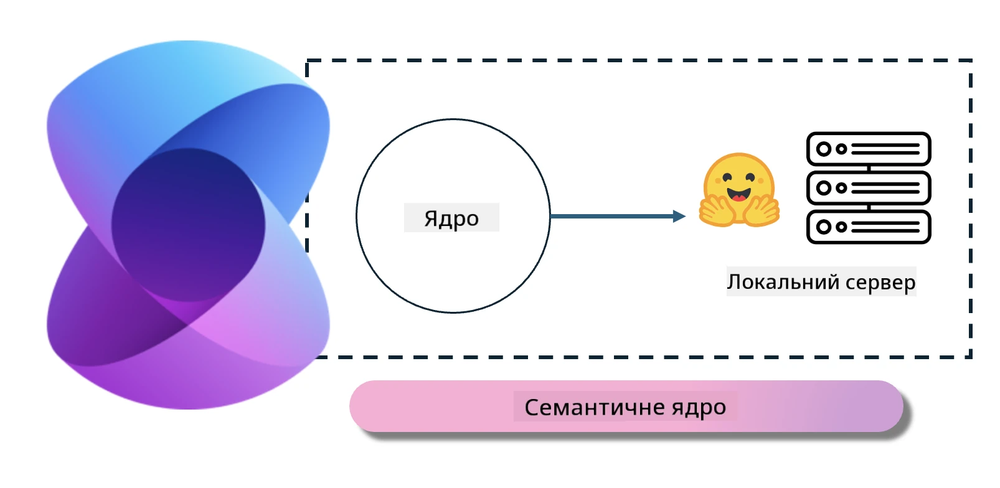
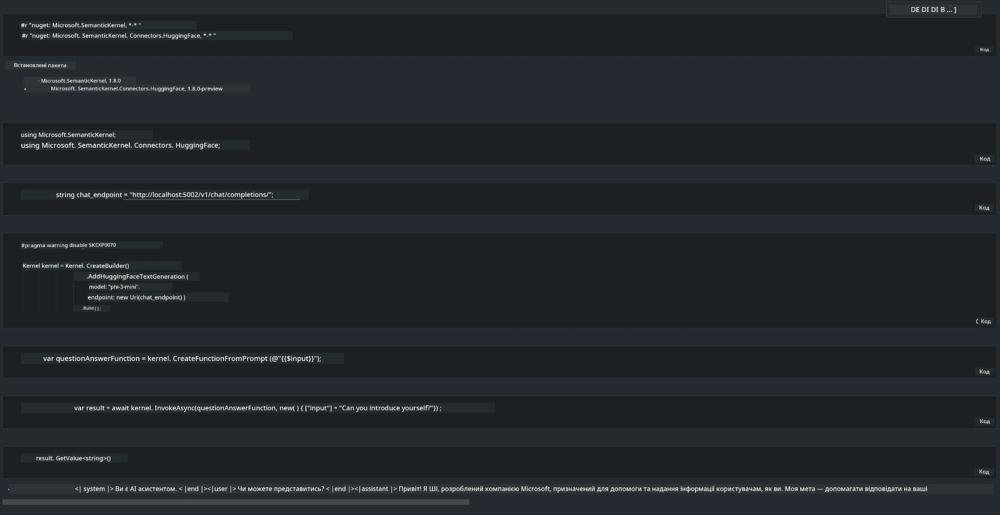

# **Інференс Phi-3 на локальному сервері**

Ми можемо розгорнути Phi-3 на локальному сервері. Користувачі можуть обрати рішення [Ollama](https://ollama.com) або [LM Studio](https://llamaedge.com), або написати власний код. Ви можете підключити локальні сервіси Phi-3 через [Semantic Kernel](https://github.com/microsoft/semantic-kernel?WT.mc_id=aiml-138114-kinfeylo) або [Langchain](https://www.langchain.com/) для створення додатків Copilot.

## **Використання Semantic Kernel для доступу до Phi-3-mini**

У додатку Copilot ми створюємо програми через Semantic Kernel / LangChain. Такий тип фреймворку зазвичай сумісний із Azure OpenAI Service / моделями OpenAI, а також може підтримувати open source моделі на Hugging Face і локальні моделі. Що робити, якщо ми хочемо використовувати Semantic Kernel для доступу до Phi-3-mini? На прикладі .NET ми можемо поєднати його з Hugging Face Connector у Semantic Kernel. За замовчуванням він відповідає ідентифікатору моделі на Hugging Face (при першому використанні модель буде завантажена з Hugging Face, що займає багато часу). Також можна підключитися до власноруч створеного локального сервісу. Порівняно з двома варіантами, ми рекомендуємо використовувати другий, оскільки він забезпечує більшу автономність, особливо у корпоративних додатках.

З рисунка видно, що доступ до локальних сервісів через Semantic Kernel легко підключається до самостійно створеного сервера моделі Phi-3-mini. Ось результат виконання

***Приклад коду*** https://github.com/kinfey/Phi3MiniSamples/tree/main/semantickernel

**Відмова від відповідальності**:  
Цей документ було перекладено за допомогою сервісу автоматичного перекладу [Co-op Translator](https://github.com/Azure/co-op-translator). Хоча ми прагнемо до точності, будь ласка, майте на увазі, що автоматичні переклади можуть містити помилки або неточності. Оригінальний документ рідною мовою слід вважати авторитетним джерелом. Для критично важливої інформації рекомендується звертатися до професійного людського перекладу. Ми не несемо відповідальності за будь-які непорозуміння або неправильні тлумачення, що виникли внаслідок використання цього перекладу.