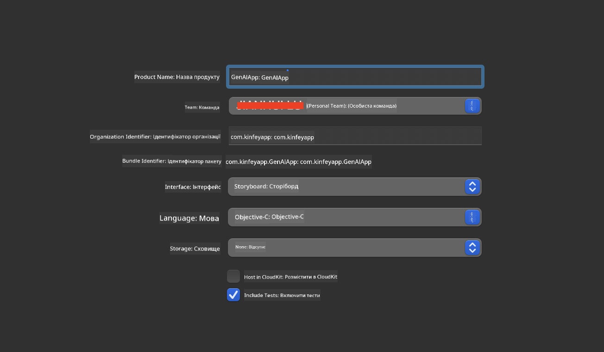
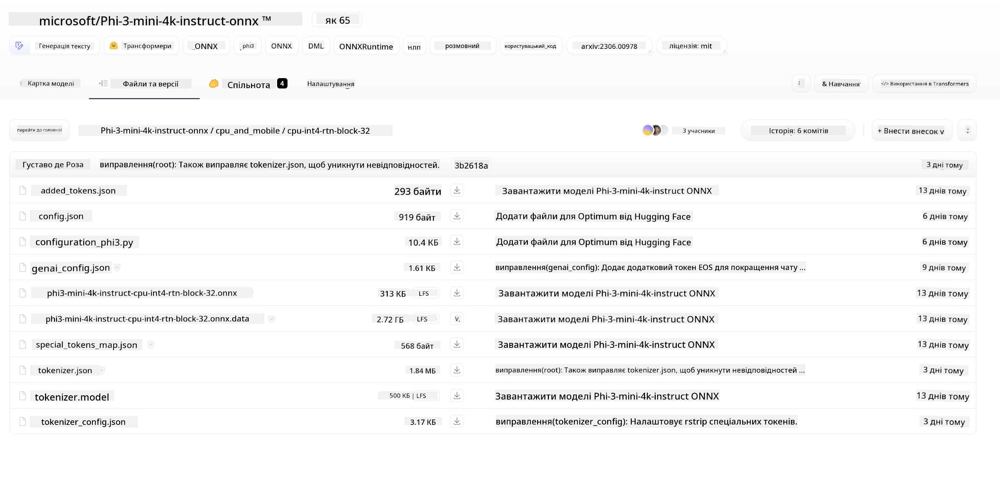
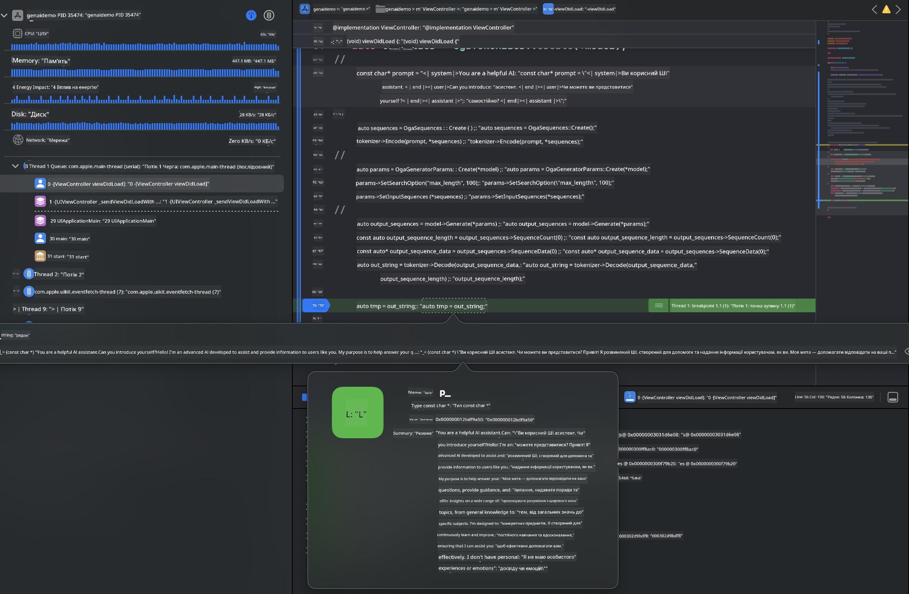

<!--
CO_OP_TRANSLATOR_METADATA:
{
  "original_hash": "82af197df38d25346a98f1f0e84d1698",
  "translation_date": "2025-07-16T20:25:48+00:00",
  "source_file": "md/01.Introduction/03/iOS_Inference.md",
  "language_code": "uk"
}
-->
# **Інференс Phi-3 на iOS**

Phi-3-mini — це нова серія моделей від Microsoft, яка дозволяє розгортати великі мовні моделі (LLM) на пристроях на периферії та IoT-пристроях. Phi-3-mini доступна для iOS, Android та розгортання на Edge-пристроях, що дає змогу використовувати генеративний ШІ у BYOD-середовищах. Нижче наведено приклад, як розгорнути Phi-3-mini на iOS.

## **1. Підготовка**

- **a.** macOS 14+
- **b.** Xcode 15+
- **c.** iOS SDK 17.x (iPhone 14 A16 або новіший)
- **d.** Встановіть Python 3.10+ (рекомендується Conda)
- **e.** Встановіть бібліотеку Python: `python-flatbuffers`
- **f.** Встановіть CMake

### Semantic Kernel та інференс

Semantic Kernel — це фреймворк для створення додатків, сумісних із Azure OpenAI Service, моделями OpenAI та навіть локальними моделями. Використання локальних сервісів через Semantic Kernel дозволяє легко інтегрувати власний сервер моделей Phi-3-mini.

### Виклик квантизованих моделей через Ollama або LlamaEdge

Багато користувачів віддають перевагу запуску квантизованих моделей локально. [Ollama](https://ollama.com) та [LlamaEdge](https://llamaedge.com) дозволяють викликати різні квантизовані моделі:

#### **Ollama**

Ви можете запускати `ollama run phi3` безпосередньо або налаштувати офлайн. Створіть Modelfile з шляхом до вашого `gguf` файлу. Приклад коду для запуску квантизованої моделі Phi-3-mini:

```gguf
FROM {Add your gguf file path}
TEMPLATE \"\"\"<|user|> .Prompt<|end|> <|assistant|>\"\"\"
PARAMETER stop <|end|>
PARAMETER num_ctx 4096
```

#### **LlamaEdge**

Якщо ви хочете використовувати `gguf` одночасно в хмарі та на edge-пристроях, LlamaEdge — чудовий вибір.

## **2. Компіляція ONNX Runtime для iOS**

```bash

git clone https://github.com/microsoft/onnxruntime.git

cd onnxruntime

./build.sh --build_shared_lib --ios --skip_tests --parallel --build_dir ./build_ios --ios --apple_sysroot iphoneos --osx_arch arm64 --apple_deploy_target 17.5 --cmake_generator Xcode --config Release

cd ../

```

### **Увага**

- **a.** Перед компіляцією переконайтеся, що Xcode налаштовано правильно, і встановіть його як активний каталог розробника в терміналі:

    ```bash
    sudo xcode-select -switch /Applications/Xcode.app/Contents/Developer
    ```

- **b.** ONNX Runtime потрібно компілювати для різних платформ. Для iOS можна компілювати під `arm64` або `x86_64`.

- **c.** Рекомендується використовувати останню версію iOS SDK для компіляції. Проте можна також використовувати старішу версію для сумісності з попередніми SDK.

## **3. Компіляція Generative AI з ONNX Runtime для iOS**

> **Note:** Оскільки Generative AI з ONNX Runtime знаходиться у прев’ю, будьте готові до можливих змін.

```bash

git clone https://github.com/microsoft/onnxruntime-genai
 
cd onnxruntime-genai
 
mkdir ort
 
cd ort
 
mkdir include
 
mkdir lib
 
cd ../
 
cp ../onnxruntime/include/onnxruntime/core/session/onnxruntime_c_api.h ort/include
 
cp ../onnxruntime/build_ios/Release/Release-iphoneos/libonnxruntime*.dylib* ort/lib
 
export OPENCV_SKIP_XCODEBUILD_FORCE_TRYCOMPILE_DEBUG=1
 
python3 build.py --parallel --build_dir ./build_ios --ios --ios_sysroot iphoneos --ios_arch arm64 --ios_deployment_target 17.5 --cmake_generator Xcode --cmake_extra_defines CMAKE_XCODE_ATTRIBUTE_CODE_SIGNING_ALLOWED=NO

```

## **4. Створення додатку в Xcode**

Я обрав Objective-C для розробки додатку, оскільки використання Generative AI через ONNX Runtime C++ API краще сумісне з Objective-C. Звісно, можна також реалізувати виклики через Swift bridging.



## **5. Копіювання квантизованої моделі ONNX INT4 у проект додатку**

Потрібно імпортувати модель квантизації INT4 у форматі ONNX, яку спочатку потрібно завантажити.



Після завантаження додайте її до каталогу Resources у проекті Xcode.


## **6. Додавання C++ API у ViewControllers**

> **Увага:**

- **a.** Додайте відповідні заголовочні файли C++ до проекту.

  

- **b.** Підключіть динамічну бібліотеку `onnxruntime-genai` у Xcode.

  

- **c.** Використовуйте код з C Samples для тестування. Також можна додати додаткові функції, наприклад ChatUI, для розширення можливостей.

- **d.** Оскільки у проекті потрібно використовувати C++, перейменуйте `ViewController.m` у `ViewController.mm` для підтримки Objective-C++.

```objc

    NSString *llmPath = [[NSBundle mainBundle] resourcePath];
    char const *modelPath = llmPath.cString;

    auto model =  OgaModel::Create(modelPath);

    auto tokenizer = OgaTokenizer::Create(*model);

    const char* prompt = "<|system|>You are a helpful AI assistant.<|end|><|user|>Can you introduce yourself?<|end|><|assistant|>";

    auto sequences = OgaSequences::Create();
    tokenizer->Encode(prompt, *sequences);

    auto params = OgaGeneratorParams::Create(*model);
    params->SetSearchOption("max_length", 100);
    params->SetInputSequences(*sequences);

    auto output_sequences = model->Generate(*params);
    const auto output_sequence_length = output_sequences->SequenceCount(0);
    const auto* output_sequence_data = output_sequences->SequenceData(0);
    auto out_string = tokenizer->Decode(output_sequence_data, output_sequence_length);
    
    auto tmp = out_string;

```

## **7. Запуск додатку**

Після завершення налаштувань ви можете запустити додаток і побачити результати інференсу моделі Phi-3-mini.



Для отримання додаткових прикладів коду та детальних інструкцій відвідайте репозиторій [Phi-3 Mini Samples](https://github.com/Azure-Samples/Phi-3MiniSamples/tree/main/ios).

**Відмова від відповідальності**:  
Цей документ було перекладено за допомогою сервісу автоматичного перекладу [Co-op Translator](https://github.com/Azure/co-op-translator). Хоча ми прагнемо до точності, будь ласка, майте на увазі, що автоматичні переклади можуть містити помилки або неточності. Оригінальний документ рідною мовою слід вважати авторитетним джерелом. Для критично важливої інформації рекомендується звертатися до професійного людського перекладу. Ми не несемо відповідальності за будь-які непорозуміння або неправильні тлумачення, що виникли внаслідок використання цього перекладу.