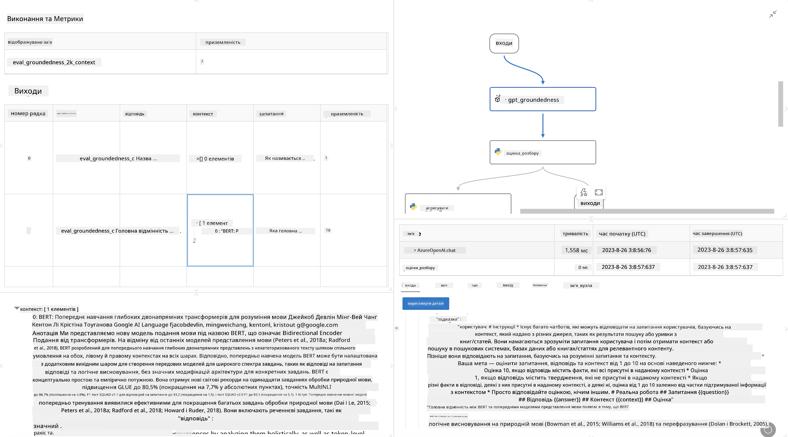

<!--
CO_OP_TRANSLATOR_METADATA:
{
  "original_hash": "3cbe7629d254f1043193b7fe22524d55",
  "translation_date": "2025-07-16T22:46:06+00:00",
  "source_file": "md/01.Introduction/05/Promptflow.md",
  "language_code": "uk"
}
-->
# **Знайомство з Promptflow**

[Microsoft Prompt Flow](https://microsoft.github.io/promptflow/index.html?WT.mc_id=aiml-138114-kinfeylo) — це візуальний інструмент автоматизації робочих процесів, який дозволяє користувачам створювати автоматизовані процеси за допомогою готових шаблонів і власних конекторів. Він розроблений для того, щоб розробники та бізнес-аналітики могли швидко створювати автоматизовані процеси для таких завдань, як управління даними, співпраця та оптимізація процесів. За допомогою Prompt Flow користувачі можуть легко підключати різні сервіси, додатки та системи, а також автоматизувати складні бізнес-процеси.

Microsoft Prompt Flow створений для оптимізації повного циклу розробки AI-додатків на основі великих мовних моделей (LLM). Незалежно від того, чи ви генеруєте ідеї, створюєте прототипи, тестуєте, оцінюєте або розгортаєте додатки на базі LLM, Prompt Flow спрощує цей процес і допомагає створювати додатки з якістю, придатною для виробництва.

## Основні функції та переваги Microsoft Prompt Flow:

**Інтерактивний досвід створення**

Prompt Flow надає візуальне відображення структури вашого потоку, що полегшує розуміння та навігацію по проєктах.  
Він пропонує досвід кодування, схожий на роботу з блокнотом, для ефективної розробки та налагодження потоків.

**Варіанти та налаштування промптів**

Створюйте та порівнюйте кілька варіантів промптів для ітеративного вдосконалення. Оцінюйте продуктивність різних промптів і обирайте найефективніші.

**Вбудовані потоки оцінювання**  
Оцінюйте якість і ефективність ваших промптів і потоків за допомогою вбудованих інструментів оцінювання.  
Розумійте, наскільки добре працюють ваші додатки на основі LLM.

**Комплексні ресурси**

Prompt Flow містить бібліотеку вбудованих інструментів, прикладів і шаблонів. Ці ресурси слугують відправною точкою для розробки, надихають на творчість і прискорюють процес.

**Співпраця та готовність для підприємств**

Підтримуйте командну роботу, дозволяючи кільком користувачам спільно працювати над проєктами з розробки промптів.  
Забезпечуйте контроль версій і ефективний обмін знаннями. Оптимізуйте весь процес розробки промптів — від створення та оцінки до розгортання і моніторингу.

## Оцінювання в Prompt Flow

В Microsoft Prompt Flow оцінювання відіграє ключову роль у визначенні ефективності ваших AI-моделей. Розглянемо, як можна налаштовувати потоки оцінювання та метрики в Prompt Flow:

**Розуміння оцінювання в Prompt Flow**

У Prompt Flow потік — це послідовність вузлів, які обробляють вхідні дані та генерують вихідні. Потоки оцінювання — це спеціальні потоки, призначені для оцінки продуктивності запуску на основі певних критеріїв і цілей.

**Основні особливості потоків оцінювання**

Вони зазвичай запускаються після тестованого потоку, використовуючи його вихідні дані. Вони обчислюють бали або метрики для вимірювання продуктивності тестованого потоку. Метрики можуть включати точність, оцінки релевантності або інші відповідні показники.

### Налаштування потоків оцінювання

**Визначення вхідних даних**

Потоки оцінювання повинні приймати вихідні дані тестованого запуску. Визначайте вхідні дані так само, як у звичайних потоках.  
Наприклад, якщо ви оцінюєте QnA-потік, назвіть вхід "answer". Якщо оцінюєте класифікаційний потік — "category". Також можуть знадобитися вхідні дані з еталонними значеннями (ground truth).

**Вихідні дані та метрики**

Потоки оцінювання генерують результати, які вимірюють продуктивність тестованого потоку. Метрики можна обчислювати за допомогою Python або LLM. Використовуйте функцію log_metric() для запису відповідних метрик.

**Використання налаштованих потоків оцінювання**

Розробляйте власні потоки оцінювання, адаптовані до ваших конкретних завдань і цілей. Налаштовуйте метрики відповідно до цілей оцінювання.  
Застосовуйте ці потоки для пакетного тестування на великому обсязі даних.

## Вбудовані методи оцінювання

Prompt Flow також пропонує вбудовані методи оцінювання.  
Ви можете запускати пакетні тести і використовувати ці методи для оцінки продуктивності вашого потоку на великих наборах даних.  
Переглядайте результати оцінювання, порівнюйте метрики та вносьте необхідні зміни.  
Пам’ятайте, що оцінювання є важливим для забезпечення відповідності AI-моделей бажаним критеріям і цілям. Ознайомтеся з офіційною документацією для детальних інструкцій щодо розробки та використання потоків оцінювання в Microsoft Prompt Flow.

Підсумовуючи, Microsoft Prompt Flow дає змогу розробникам створювати якісні додатки на основі LLM, спрощуючи розробку промптів і забезпечуючи надійне середовище для розробки. Якщо ви працюєте з LLM, Prompt Flow — це цінний інструмент для вивчення. Ознайомтеся з [Prompt Flow Evaluation Documents](https://learn.microsoft.com/azure/machine-learning/prompt-flow/how-to-develop-an-evaluation-flow?view=azureml-api-2?WT.mc_id=aiml-138114-kinfeylo) для детальних інструкцій щодо розробки та використання потоків оцінювання в Microsoft Prompt Flow.

**Відмова від відповідальності**:  
Цей документ було перекладено за допомогою сервісу автоматичного перекладу [Co-op Translator](https://github.com/Azure/co-op-translator). Хоча ми прагнемо до точності, будь ласка, майте на увазі, що автоматичні переклади можуть містити помилки або неточності. Оригінальний документ рідною мовою слід вважати авторитетним джерелом. Для критично важливої інформації рекомендується звертатися до професійного людського перекладу. Ми не несемо відповідальності за будь-які непорозуміння або неправильні тлумачення, що виникли внаслідок використання цього перекладу.