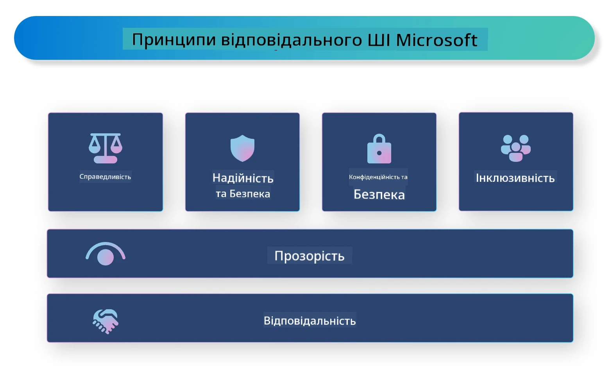

# **Вступ до Відповідального ШІ**

[Microsoft Responsible AI](https://www.microsoft.com/ai/responsible-ai?WT.mc_id=aiml-138114-kinfeylo) — це ініціатива, яка допомагає розробникам та організаціям створювати системи ШІ, що є прозорими, надійними та підзвітними. Ініціатива надає рекомендації та ресурси для розробки відповідальних рішень у сфері ШІ, які відповідають етичним принципам, таким як конфіденційність, справедливість і прозорість. Ми також розглянемо деякі виклики та найкращі практики, пов’язані зі створенням відповідальних систем ШІ.

## Огляд Microsoft Responsible AI

**Етичні принципи**

Microsoft Responsible AI керується набором етичних принципів, таких як конфіденційність, справедливість, прозорість, підзвітність і безпека. Ці принципи покликані забезпечити етичний та відповідальний підхід до розробки систем ШІ.

**Прозорий ШІ**

Microsoft Responsible AI підкреслює важливість прозорості в системах ШІ. Це включає надання чітких пояснень того, як працюють моделі ШІ, а також забезпечення публічної доступності джерел даних і алгоритмів.

**Підзвітний ШІ**

[Microsoft Responsible AI](https://www.microsoft.com/ai/responsible-ai?WT.mc_id=aiml-138114-kinfeylo) сприяє розвитку підзвітних систем ШІ, які можуть надавати розуміння того, як моделі приймають рішення. Це допомагає користувачам краще розуміти та довіряти результатам систем ШІ.

**Інклюзивність**

Системи ШІ мають бути розроблені так, щоб приносити користь усім. Microsoft прагне створювати інклюзивний ШІ, який враховує різноманітні точки зору та уникає упереджень або дискримінації.

**Надійність і безпека**

Забезпечення надійності та безпеки систем ШІ є надзвичайно важливим. Microsoft зосереджується на створенні стійких моделей, які працюють стабільно та запобігають шкідливим наслідкам.

**Справедливість у ШІ**

Microsoft Responsible AI визнає, що системи ШІ можуть підтримувати упередження, якщо вони навчені на упереджених даних або алгоритмах. Ініціатива надає рекомендації для розробки справедливих систем ШІ, які не дискримінують за ознаками раси, статі чи віку.

**Конфіденційність і безпека**

Microsoft Responsible AI наголошує на важливості захисту конфіденційності користувачів і безпеки даних у системах ШІ. Це включає впровадження надійного шифрування даних і контролю доступу, а також регулярний аудит систем ШІ на предмет вразливостей.

**Підзвітність і відповідальність**

Microsoft Responsible AI підтримує підзвітність і відповідальність у розробці та впровадженні ШІ. Це означає, що розробники та організації мають усвідомлювати потенційні ризики, пов’язані з системами ШІ, і вживати заходів для їх мінімізації.

## Найкращі практики для створення відповідальних систем ШІ

**Розробляйте моделі ШІ на основі різноманітних наборів даних**

Щоб уникнути упереджень у системах ШІ, важливо використовувати різноманітні набори даних, які відображають широкий спектр точок зору та досвіду.

**Використовуйте методи пояснюваного ШІ**

Методи пояснюваного ШІ допомагають користувачам зрозуміти, як моделі приймають рішення, що підвищує довіру до системи.

**Регулярно проводьте аудит систем ШІ на вразливості**

Регулярні аудити допомагають виявляти потенційні ризики та вразливості, які потребують усунення.

**Впроваджуйте надійне шифрування даних і контроль доступу**

Шифрування даних і контроль доступу допомагають захистити конфіденційність і безпеку користувачів у системах ШІ.

**Дотримуйтесь етичних принципів у розробці ШІ**

Дотримання етичних принципів, таких як справедливість, прозорість і підзвітність, сприяє формуванню довіри до систем ШІ та забезпечує їх відповідальну розробку.

## Використання AI Foundry для Відповідального ШІ

[Azure AI Foundry](https://ai.azure.com?WT.mc_id=aiml-138114-kinfeylo) — це потужна платформа, яка дозволяє розробникам і організаціям швидко створювати інтелектуальні, передові, готові до ринку та відповідальні додатки. Ось деякі ключові функції та можливості Azure AI Foundry:

**Готові до використання API та моделі**

Azure AI Foundry надає попередньо створені та настроювані API і моделі. Вони охоплюють широкий спектр завдань ШІ, включаючи генеративний ШІ, обробку природної мови для діалогів, пошук, моніторинг, переклад, розпізнавання мови, зору та прийняття рішень.

**Prompt Flow**

Prompt flow в Azure AI Foundry дозволяє створювати досвід розмовного ШІ. Це дає змогу проєктувати та керувати діалоговими потоками, що полегшує створення чатботів, віртуальних помічників та інших інтерактивних додатків.

**Retrieval Augmented Generation (RAG)**

RAG — це метод, який поєднує підходи на основі пошуку інформації та генерації. Він підвищує якість згенерованих відповідей, використовуючи як наявні знання (пошук), так і творчий генеративний підхід (генерація).

**Метрики оцінки та моніторингу для генеративного ШІ**

Azure AI Foundry надає інструменти для оцінки та моніторингу моделей генеративного ШІ. Ви можете оцінювати їхню продуктивність, справедливість та інші важливі показники для забезпечення відповідального впровадження. Крім того, якщо ви створили інформаційну панель, можна скористатися інтерфейсом без коду в Azure Machine Learning Studio для налаштування та створення Responsible AI Dashboard і відповідної scorecard на основі [Repsonsible AI Toolbox](https://responsibleaitoolbox.ai/?WT.mc_id=aiml-138114-kinfeylo) Python-бібліотек. Ця scorecard допомагає ділитися ключовими висновками щодо справедливості, важливості ознак та інших аспектів відповідального впровадження як з технічними, так і з нетехнічними зацікавленими сторонами.

Щоб використовувати AI Foundry з відповідальним ШІ, дотримуйтесь таких найкращих практик:

**Визначте проблему та цілі вашої системи ШІ**

Перед початком розробки важливо чітко визначити проблему або мету, яку має вирішувати ваша система ШІ. Це допоможе визначити необхідні дані, алгоритми та ресурси для створення ефективної моделі.

**Збирайте та попередньо обробляйте релевантні дані**

Якість і кількість даних, що використовуються для навчання системи ШІ, суттєво впливають на її продуктивність. Тому важливо збирати релевантні дані, очищати їх, попередньо обробляти та забезпечувати їх репрезентативність для населення або проблеми, яку ви намагаєтеся розв’язати.

**Обирайте відповідні методи оцінки**

Існує багато алгоритмів оцінки. Важливо обрати найбільш підходящий алгоритм залежно від ваших даних і задачі.

**Оцінюйте та інтерпретуйте модель**

Після створення моделі ШІ важливо оцінити її продуктивність за допомогою відповідних метрик і прозоро інтерпретувати результати. Це допоможе виявити упередження або обмеження моделі та внести необхідні покращення.

**Забезпечуйте прозорість і пояснюваність**

Системи ШІ мають бути прозорими та пояснюваними, щоб користувачі могли розуміти, як вони працюють і як приймаються рішення. Це особливо важливо для застосунків, які мають значний вплив на життя людей, таких як охорона здоров’я, фінанси та юридичні системи.

**Моніторинг і оновлення моделі**

Системи ШІ слід постійно моніторити та оновлювати, щоб вони залишалися точними та ефективними з часом. Це вимагає регулярного обслуговування, тестування та повторного навчання моделі.

На завершення, Microsoft Responsible AI — це ініціатива, яка допомагає розробникам і організаціям створювати прозорі, надійні та підзвітні системи ШІ. Впровадження відповідального ШІ є надзвичайно важливим, і Azure AI Foundry прагне зробити це практичним для організацій. Дотримуючись етичних принципів і найкращих практик, ми можемо забезпечити відповідальну розробку та впровадження систем ШІ, що приносять користь суспільству в цілому.

**Відмова від відповідальності**:  
Цей документ було перекладено за допомогою сервісу автоматичного перекладу [Co-op Translator](https://github.com/Azure/co-op-translator). Хоча ми прагнемо до точності, будь ласка, майте на увазі, що автоматичні переклади можуть містити помилки або неточності. Оригінальний документ рідною мовою слід вважати авторитетним джерелом. Для критично важливої інформації рекомендується звертатися до професійного людського перекладу. Ми не несемо відповідальності за будь-які непорозуміння або неправильні тлумачення, що виникли внаслідок використання цього перекладу.