# Оцінка тонко налаштованої моделі Phi-3 / Phi-3.5 в Azure AI Foundry з акцентом на принципи відповідального ШІ Microsoft

Цей покроковий (E2E) приклад базується на керівництві "[Evaluate Fine-tuned Phi-3 / 3.5 Models in Azure AI Foundry Focusing on Microsoft's Responsible AI](https://techcommunity.microsoft.com/blog/educatordeveloperblog/evaluate-fine-tuned-phi-3--3-5-models-in-azure-ai-studio-focusing-on-microsofts-/4227850?WT.mc_id=aiml-137032-kinfeylo)" з Microsoft Tech Community.

## Огляд

### Як оцінити безпеку та продуктивність тонко налаштованої моделі Phi-3 / Phi-3.5 в Azure AI Foundry?

Тонке налаштування моделі іноді може призводити до небажаних або непередбачуваних відповідей. Щоб переконатися, що модель залишається безпечною та ефективною, важливо оцінити її потенціал генерувати шкідливий контент, а також здатність створювати точні, релевантні та послідовні відповіді. У цьому посібнику ви навчитеся оцінювати безпеку та продуктивність тонко налаштованої моделі Phi-3 / Phi-3.5, інтегрованої з Prompt flow в Azure AI Foundry.

Ось процес оцінки в Azure AI Foundry.

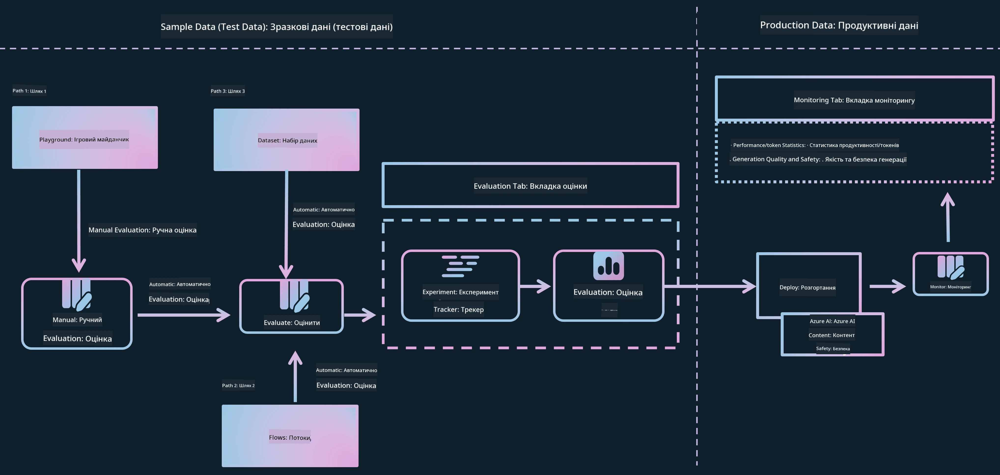

*Джерело зображення: [Evaluation of generative AI applications](https://learn.microsoft.com/azure/ai-studio/concepts/evaluation-approach-gen-ai?wt.mc_id%3Dstudentamb_279723)*

> [!NOTE]
>
> Для детальнішої інформації та додаткових ресурсів про Phi-3 / Phi-3.5, будь ласка, відвідайте [Phi-3CookBook](https://github.com/microsoft/Phi-3CookBook?wt.mc_id=studentamb_279723).

### Вимоги

- [Python](https://www.python.org/downloads)
- [Підписка Azure](https://azure.microsoft.com/free?wt.mc_id=studentamb_279723)
- [Visual Studio Code](https://code.visualstudio.com)
- Тонко налаштована модель Phi-3 / Phi-3.5

### Зміст

1. [**Сценарій 1: Вступ до оцінки Prompt flow в Azure AI Foundry**](../../../../../../md/02.Application/01.TextAndChat/Phi3)

    - [Вступ до оцінки безпеки](../../../../../../md/02.Application/01.TextAndChat/Phi3)
    - [Вступ до оцінки продуктивності](../../../../../../md/02.Application/01.TextAndChat/Phi3)

1. [**Сценарій 2: Оцінка моделі Phi-3 / Phi-3.5 в Azure AI Foundry**](../../../../../../md/02.Application/01.TextAndChat/Phi3)

    - [Перед початком](../../../../../../md/02.Application/01.TextAndChat/Phi3)
    - [Розгортання Azure OpenAI для оцінки моделі Phi-3 / Phi-3.5](../../../../../../md/02.Application/01.TextAndChat/Phi3)
    - [Оцінка тонко налаштованої моделі Phi-3 / Phi-3.5 за допомогою Prompt flow в Azure AI Foundry](../../../../../../md/02.Application/01.TextAndChat/Phi3)

1. [Вітаємо!](../../../../../../md/02.Application/01.TextAndChat/Phi3)

## **Сценарій 1: Вступ до оцінки Prompt flow в Azure AI Foundry**

### Вступ до оцінки безпеки

Щоб переконатися, що ваша модель ШІ є етичною та безпечною, важливо оцінити її відповідно до Принципів відповідального ШІ Microsoft. В Azure AI Foundry оцінка безпеки дозволяє перевірити вразливість вашої моделі до атак jailbreak та її потенціал генерувати шкідливий контент, що безпосередньо відповідає цим принципам.

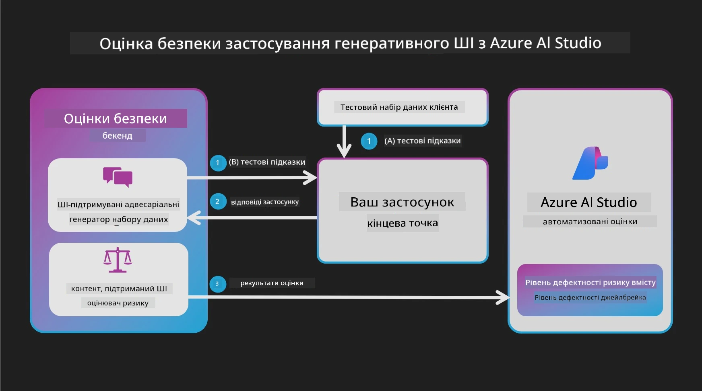

*Джерело зображення: [Evaluation of generative AI applications](https://learn.microsoft.com/azure/ai-studio/concepts/evaluation-approach-gen-ai?wt.mc_id%3Dstudentamb_279723)*

#### Принципи відповідального ШІ Microsoft

Перед початком технічних кроків важливо зрозуміти Принципи відповідального ШІ Microsoft — етичну основу, створену для керівництва відповідальним розробленням, впровадженням та експлуатацією систем ШІ. Ці принципи спрямовують відповідальний дизайн, розробку та впровадження систем ШІ, забезпечуючи, що технології ШІ створюються справедливо, прозоро та інклюзивно. Вони є фундаментом для оцінки безпеки моделей ШІ.

Принципи відповідального ШІ Microsoft включають:

- **Справедливість та інклюзивність**: Системи ШІ повинні ставитися до всіх справедливо і уникати різного ставлення до схожих груп людей. Наприклад, коли системи ШІ надають рекомендації щодо медичного лікування, кредитних заявок або працевлаштування, вони повинні робити однакові рекомендації для всіх, хто має схожі симптоми, фінансові обставини або професійні кваліфікації.

- **Надійність та безпека**: Для побудови довіри критично, щоб системи ШІ працювали надійно, безпечно та послідовно. Вони повинні функціонувати так, як було спроектовано, безпечно реагувати на непередбачувані умови та протистояти шкідливим маніпуляціям. Їх поведінка та спектр умов, які вони можуть обробляти, відображають різноманітність ситуацій, передбачених розробниками під час проєктування та тестування.

- **Прозорість**: Коли системи ШІ допомагають приймати рішення, що мають великий вплив на життя людей, важливо, щоб люди розуміли, як ці рішення були прийняті. Наприклад, банк може використовувати систему ШІ для оцінки кредитоспроможності особи. Компанія може застосовувати ШІ для визначення найкращих кандидатів на роботу.

- **Конфіденційність та безпека**: Зі зростанням поширеності ШІ захист конфіденційності та безпека особистої і бізнес-інформації стають дедалі важливішими та складнішими. У ШІ конфіденційність і безпека даних потребують особливої уваги, оскільки доступ до даних є необхідним для точних і обґрунтованих прогнозів і рішень щодо людей.

- **Відповідальність**: Особи, які розробляють і впроваджують системи ШІ, повинні нести відповідальність за їх роботу. Організації мають використовувати галузеві стандарти для формування норм відповідальності. Ці норми гарантують, що системи ШІ не є остаточним авторитетом у рішеннях, що впливають на життя людей, і що люди зберігають значущий контроль над високорівневими автономними системами ШІ.

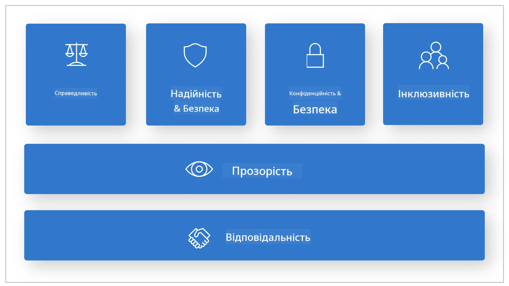

*Джерело зображення: [What is Responsible AI?](https://learn.microsoft.com/azure/machine-learning/concept-responsible-ai?view=azureml-api-2&viewFallbackFrom=azureml-api-2%253fwt.mc_id%3Dstudentamb_279723)*

> [!NOTE]
> Щоб дізнатися більше про Принципи відповідального ШІ Microsoft, відвідайте [What is Responsible AI?](https://learn.microsoft.com/azure/machine-learning/concept-responsible-ai?view=azureml-api-2?wt.mc_id=studentamb_279723).

#### Метрики безпеки

У цьому посібнику ви оціните безпеку тонко налаштованої моделі Phi-3 за допомогою метрик безпеки Azure AI Foundry. Ці метрики допомагають оцінити потенціал моделі генерувати шкідливий контент та її вразливість до атак jailbreak. Метрики безпеки включають:

- **Контент, пов’язаний із самопошкодженням**: Оцінює, чи має модель схильність генерувати контент, пов’язаний із самопошкодженням.
- **Ненависницький та несправедливий контент**: Оцінює, чи має модель схильність генерувати ненависницький або несправедливий контент.
- **Насильницький контент**: Оцінює, чи має модель схильність генерувати насильницький контент.
- **Сексуальний контент**: Оцінює, чи має модель схильність генерувати неприйнятний сексуальний контент.

Оцінка цих аспектів гарантує, що модель ШІ не створює шкідливий або образливий контент, що відповідає суспільним цінностям і нормативним вимогам.

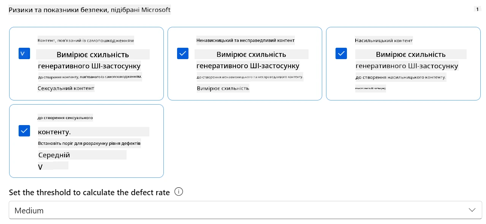

### Вступ до оцінки продуктивності

Щоб переконатися, що ваша модель ШІ працює належним чином, важливо оцінити її продуктивність за відповідними метриками. В Azure AI Foundry оцінка продуктивності дозволяє перевірити ефективність моделі у створенні точних, релевантних та послідовних відповідей.

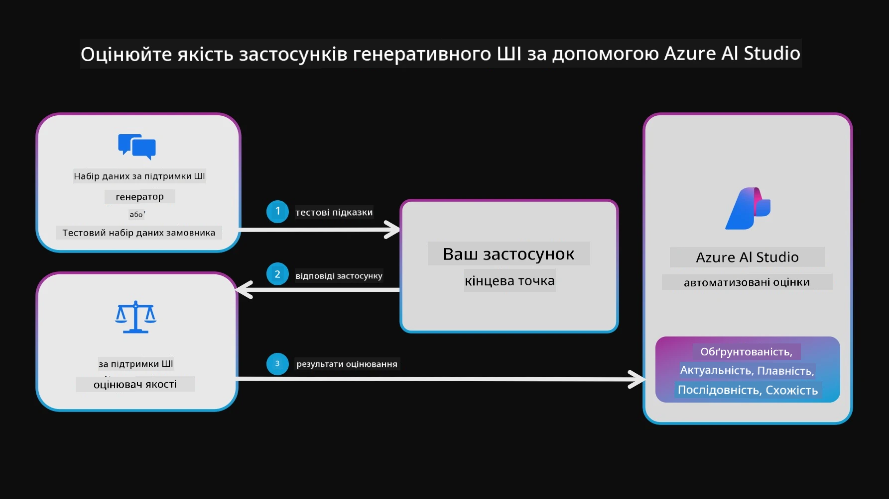

*Джерело зображення: [Evaluation of generative AI applications](https://learn.microsoft.com/azure/ai-studio/concepts/evaluation-approach-gen-ai?wt.mc_id%3Dstudentamb_279723)*

#### Метрики продуктивності

У цьому посібнику ви оціните продуктивність тонко налаштованої моделі Phi-3 / Phi-3.5 за допомогою метрик продуктивності Azure AI Foundry. Ці метрики допомагають оцінити ефективність моделі у створенні точних, релевантних та послідовних відповідей. Метрики продуктивності включають:

- **Обґрунтованість (Groundedness)**: Оцінює, наскільки згенеровані відповіді відповідають інформації з вхідного джерела.
- **Релевантність**: Оцінює доречність згенерованих відповідей до заданих питань.
- **Когерентність**: Оцінює, наскільки плавно текст читається, природно звучить і нагадує людську мову.
- **Плавність (Fluency)**: Оцінює мовну грамотність згенерованого тексту.
- **Схожість з GPT (GPT Similarity)**: Порівнює згенеровану відповідь із еталонною для визначення схожості.
- **F1 Score**: Обчислює співвідношення спільних слів між згенерованою відповіддю та вихідними даними.

Ці метрики допомагають оцінити ефективність моделі у створенні точних, релевантних та послідовних відповідей.

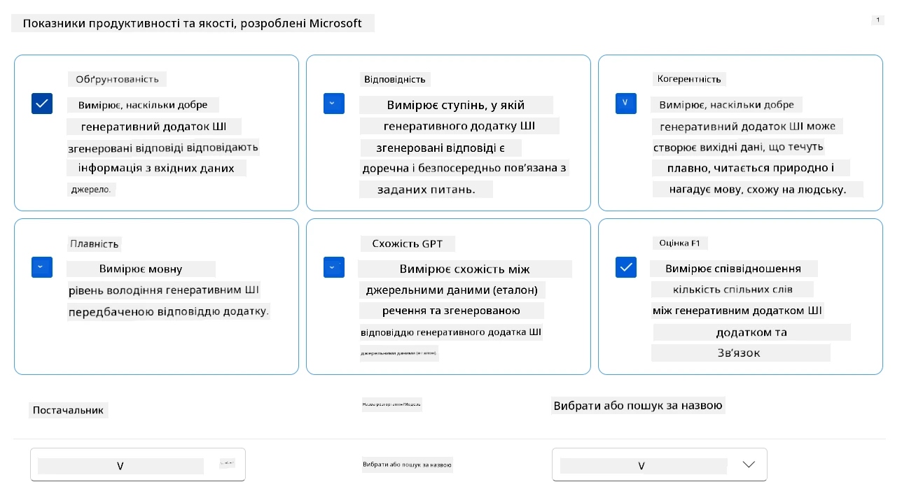

## **Сценарій 2: Оцінка моделі Phi-3 / Phi-3.5 в Azure AI Foundry**

### Перед початком

Цей посібник є продовженням попередніх блогів, "[Fine-Tune and Integrate Custom Phi-3 Models with Prompt Flow: Step-by-Step Guide](https://techcommunity.microsoft.com/t5/educator-developer-blog/fine-tune-and-integrate-custom-phi-3-models-with-prompt-flow/ba-p/4178612?wt.mc_id=studentamb_279723)" та "[Fine-Tune and Integrate Custom Phi-3 Models with Prompt Flow in Azure AI Foundry](https://techcommunity.microsoft.com/t5/educator-developer-blog/fine-tune-and-integrate-custom-phi-3-models-with-prompt-flow-in/ba-p/4191726?wt.mc_id=studentamb_279723)." У цих публікаціях ми пройшли процес тонкого налаштування моделі Phi-3 / Phi-3.5 в Azure AI Foundry та інтеграції її з Prompt flow.

У цьому посібнику ви розгорнете модель Azure OpenAI як оцінювач у Azure AI Foundry і використаєте її для оцінки вашої тонко налаштованої моделі Phi-3 / Phi-3.5.

Перед початком переконайтеся, що у вас є наступні вимоги, описані в попередніх посібниках:

1. Підготовлений набір даних для оцінки тонко налаштованої моделі Phi-3 / Phi-3.5.
1. Модель Phi-3 / Phi-3.5, яка була тонко налаштована та розгорнута в Azure Machine Learning.
1. Prompt flow, інтегрований з вашою тонко налаштованою моделлю Phi-3 / Phi-3.5 в Azure AI Foundry.

> [!NOTE]
> Ви будете використовувати файл *test_data.jsonl*, розташований у папці data з набору даних **ULTRACHAT_200k**, завантаженого в попередніх блогах, як набір даних для оцінки тонко налаштованої моделі Phi-3 / Phi-3.5.

#### Інтеграція кастомної моделі Phi-3 / Phi-3.5 з Prompt flow в Azure AI Foundry (підхід з кодом)
> [!NOTE]  
> Якщо ви скористалися підходом low-code, описаним у "[Fine-Tune and Integrate Custom Phi-3 Models with Prompt Flow in Azure AI Foundry](https://techcommunity.microsoft.com/t5/educator-developer-blog/fine-tune-and-integrate-custom-phi-3-models-with-prompt-flow-in/ba-p/4191726?wt.mc_id=studentamb_279723)", ви можете пропустити цю вправу і перейти до наступної.  
> Однак, якщо ви використовували підхід code-first, описаний у "[Fine-Tune and Integrate Custom Phi-3 Models with Prompt Flow: Step-by-Step Guide](https://techcommunity.microsoft.com/t5/educator-developer-blog/fine-tune-and-integrate-custom-phi-3-models-with-prompt-flow/ba-p/4178612?wt.mc_id=studentamb_279723)" для тонкого налаштування та розгортання вашої моделі Phi-3 / Phi-3.5, процес підключення моделі до Prompt flow трохи відрізняється. Ви дізнаєтеся про цей процес у цій вправі.
Щоб продовжити, потрібно інтегрувати ваш тонко налаштований модель Phi-3 / Phi-3.5 у Prompt flow в Azure AI Foundry.

#### Створення Azure AI Foundry Hub

Перед створенням Проєкту потрібно створити Hub. Hub працює як Resource Group, дозволяючи організовувати та керувати кількома Проєктами в Azure AI Foundry.

1. Увійдіть у [Azure AI Foundry](https://ai.azure.com/?wt.mc_id=studentamb_279723).

1. Виберіть **All hubs** у лівій вкладці.

1. Виберіть **+ New hub** у навігаційному меню.

    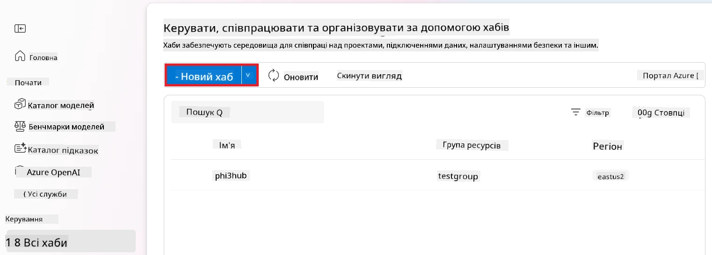

1. Виконайте наступні дії:

    - Введіть **Hub name**. Він має бути унікальним.
    - Виберіть вашу підписку Azure (**Subscription**).
    - Виберіть **Resource group** для використання (створіть нову, якщо потрібно).
    - Виберіть **Location**, яку хочете використовувати.
    - Виберіть **Connect Azure AI Services** для використання (створіть нову, якщо потрібно).
    - Виберіть **Connect Azure AI Search** і оберіть **Skip connecting**.

    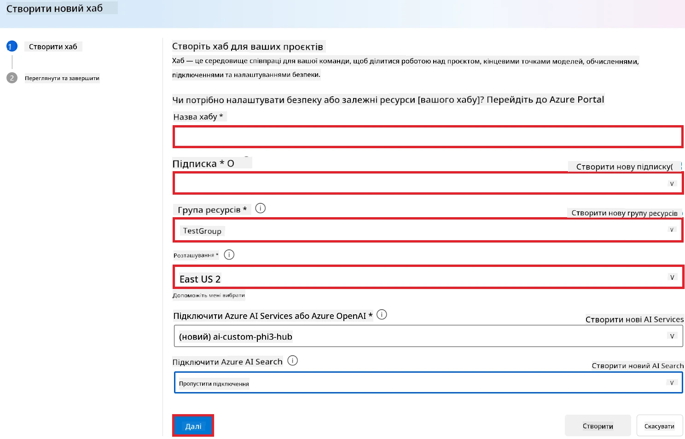

1. Виберіть **Next**.

#### Створення проєкту Azure AI Foundry

1. У створеному Hub виберіть **All projects** у лівій вкладці.

1. Виберіть **+ New project** у навігаційному меню.

    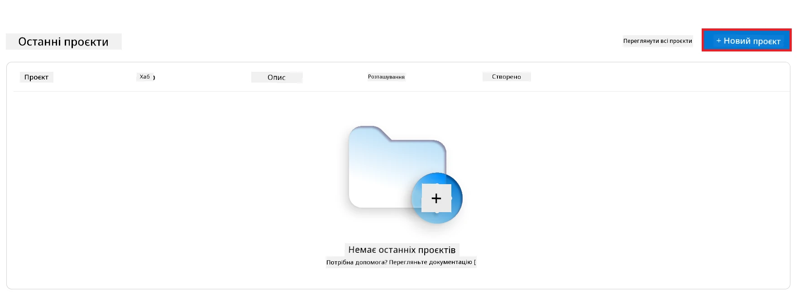

1. Введіть **Project name**. Він має бути унікальним.

    

1. Виберіть **Create a project**.

#### Додавання користувацького з’єднання для тонко налаштованої моделі Phi-3 / Phi-3.5

Щоб інтегрувати вашу користувацьку модель Phi-3 / Phi-3.5 з Prompt flow, потрібно зберегти endpoint і ключ моделі у користувацькому з’єднанні. Це забезпечить доступ до вашої моделі в Prompt flow.

#### Встановлення api key та endpoint uri для тонко налаштованої моделі Phi-3 / Phi-3.5

1. Перейдіть до [Azure ML Studio](https://ml.azure.com/home?wt.mc_id=studentamb_279723).

1. Перейдіть до робочого простору Azure Machine learning, який ви створили.

1. Виберіть **Endpoints** у лівій вкладці.

    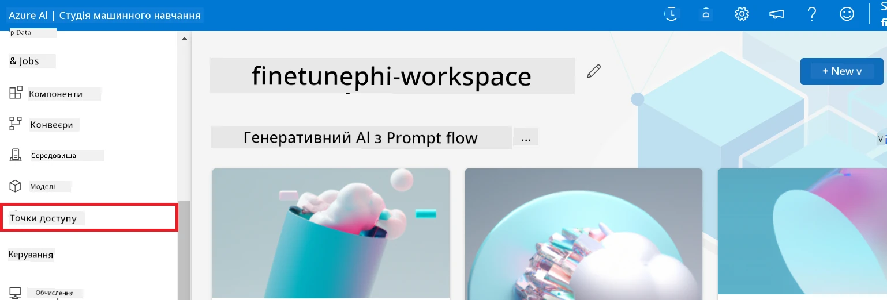

1. Виберіть створений вами endpoint.

    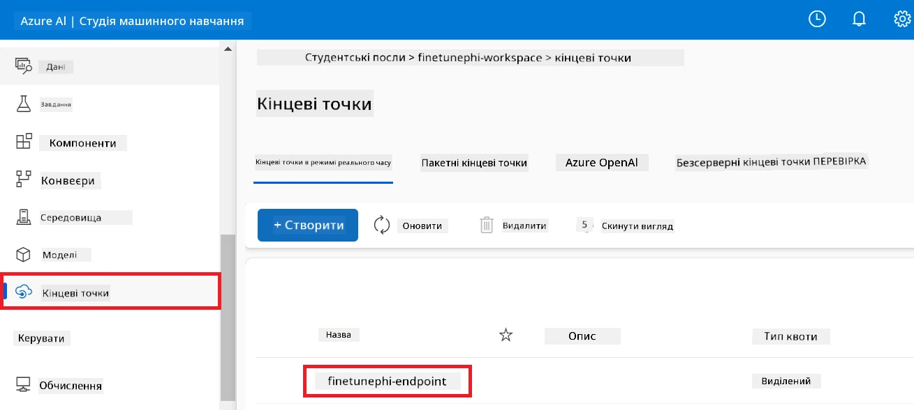

1. Виберіть **Consume** у навігаційному меню.

1. Скопіюйте ваш **REST endpoint** та **Primary key**.

    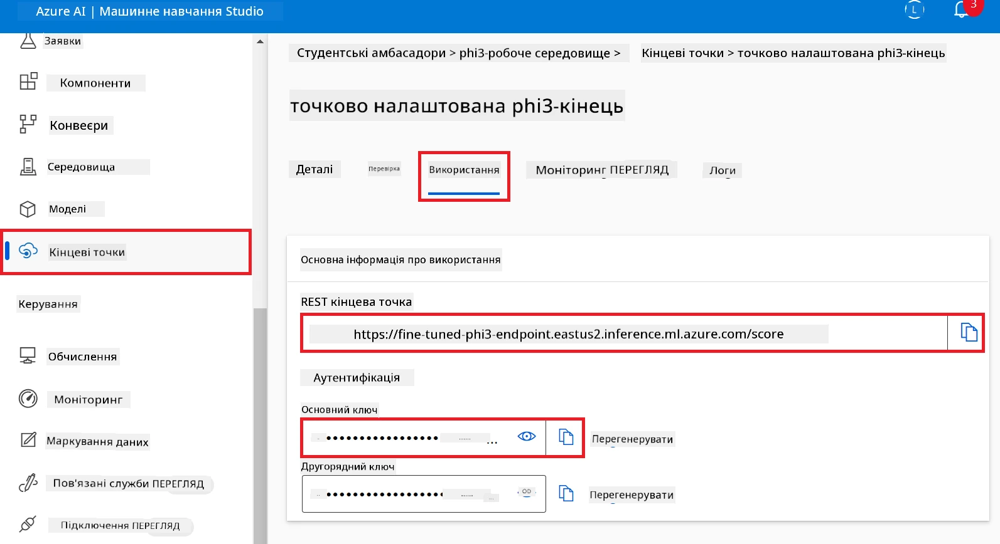

#### Додавання користувацького з’єднання

1. Перейдіть до [Azure AI Foundry](https://ai.azure.com/?wt.mc_id=studentamb_279723).

1. Перейдіть до створеного вами проєкту Azure AI Foundry.

1. У створеному проєкті виберіть **Settings** у лівій вкладці.

1. Виберіть **+ New connection**.

    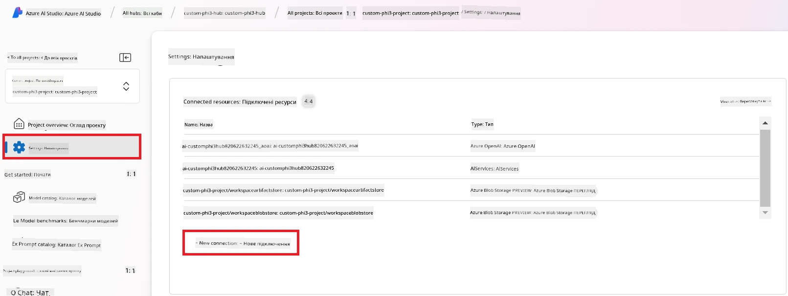

1. Виберіть **Custom keys** у навігаційному меню.

    

1. Виконайте наступні дії:

    - Виберіть **+ Add key value pairs**.
    - Для імені ключа введіть **endpoint** і вставте скопійований endpoint з Azure ML Studio у поле значення.
    - Знову виберіть **+ Add key value pairs**.
    - Для імені ключа введіть **key** і вставте скопійований ключ з Azure ML Studio у поле значення.
    - Після додавання ключів виберіть **is secret**, щоб приховати ключ від відображення.

    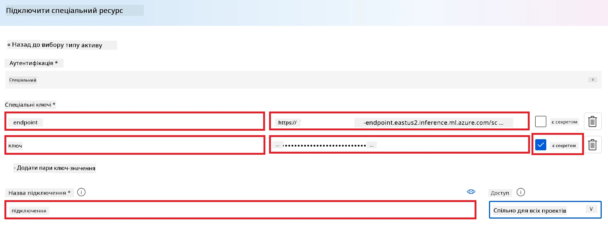

1. Виберіть **Add connection**.

#### Створення Prompt flow

Ви додали користувацьке з’єднання в Azure AI Foundry. Тепер створимо Prompt flow за наступними кроками. Потім ви підключите цей Prompt flow до користувацького з’єднання, щоб використовувати тонко налаштовану модель у Prompt flow.

1. Перейдіть до створеного вами проєкту Azure AI Foundry.

1. Виберіть **Prompt flow** у лівій вкладці.

1. Виберіть **+ Create** у навігаційному меню.

    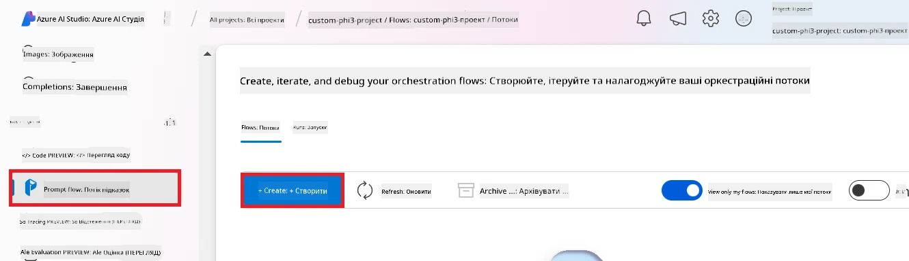

1. Виберіть **Chat flow** у навігаційному меню.

    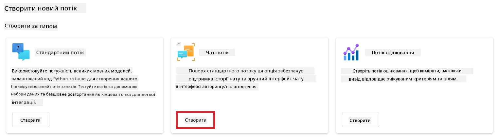

1. Введіть **Folder name** для використання.

    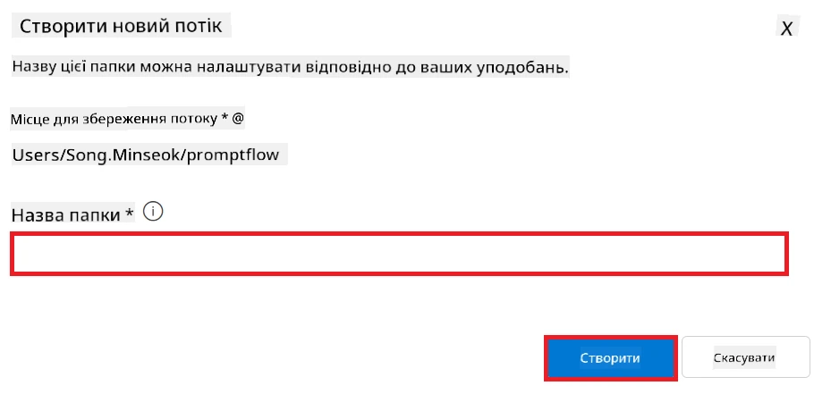

1. Виберіть **Create**.

#### Налаштування Prompt flow для спілкування з вашою користувацькою моделлю Phi-3 / Phi-3.5

Потрібно інтегрувати тонко налаштовану модель Phi-3 / Phi-3.5 у Prompt flow. Однак існуючий Prompt flow не призначений для цього, тому потрібно переробити його, щоб забезпечити інтеграцію користувацької моделі.

1. У Prompt flow виконайте наступні дії для перебудови існуючого потоку:

    - Виберіть **Raw file mode**.
    - Видаліть увесь існуючий код у файлі *flow.dag.yml*.
    - Додайте наступний код у *flow.dag.yml*.

        ```yml
        inputs:
          input_data:
            type: string
            default: "Who founded Microsoft?"

        outputs:
          answer:
            type: string
            reference: ${integrate_with_promptflow.output}

        nodes:
        - name: integrate_with_promptflow
          type: python
          source:
            type: code
            path: integrate_with_promptflow.py
          inputs:
            input_data: ${inputs.input_data}
        ```

    - Виберіть **Save**.

    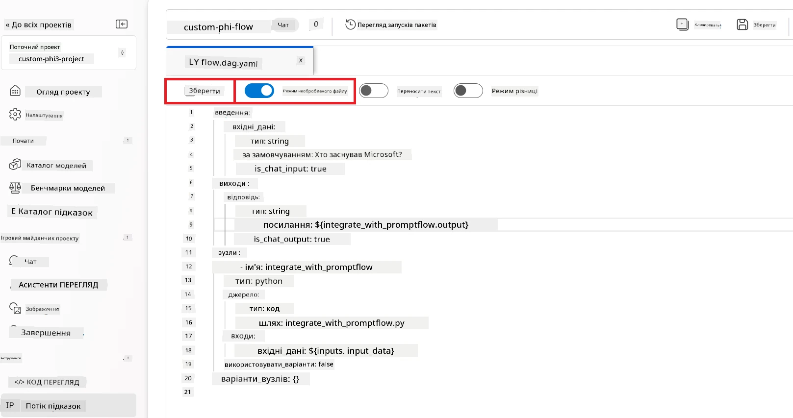

1. Додайте наступний код у *integrate_with_promptflow.py* для використання користувацької моделі Phi-3 / Phi-3.5 у Prompt flow.

    ```python
    import logging
    import requests
    from promptflow import tool
    from promptflow.connections import CustomConnection

    # Logging setup
    logging.basicConfig(
        format="%(asctime)s - %(levelname)s - %(name)s - %(message)s",
        datefmt="%Y-%m-%d %H:%M:%S",
        level=logging.DEBUG
    )
    logger = logging.getLogger(__name__)

    def query_phi3_model(input_data: str, connection: CustomConnection) -> str:
        """
        Send a request to the Phi-3 / Phi-3.5 model endpoint with the given input data using Custom Connection.
        """

        # "connection" is the name of the Custom Connection, "endpoint", "key" are the keys in the Custom Connection
        endpoint_url = connection.endpoint
        api_key = connection.key

        headers = {
            "Content-Type": "application/json",
            "Authorization": f"Bearer {api_key}"
        }
    data = {
        "input_data": [input_data],
        "params": {
            "temperature": 0.7,
            "max_new_tokens": 128,
            "do_sample": True,
            "return_full_text": True
            }
        }
        try:
            response = requests.post(endpoint_url, json=data, headers=headers)
            response.raise_for_status()
            
            # Log the full JSON response
            logger.debug(f"Full JSON response: {response.json()}")

            result = response.json()["output"]
            logger.info("Successfully received response from Azure ML Endpoint.")
            return result
        except requests.exceptions.RequestException as e:
            logger.error(f"Error querying Azure ML Endpoint: {e}")
            raise

    @tool
    def my_python_tool(input_data: str, connection: CustomConnection) -> str:
        """
        Tool function to process input data and query the Phi-3 / Phi-3.5 model.
        """
        return query_phi3_model(input_data, connection)

    ```

    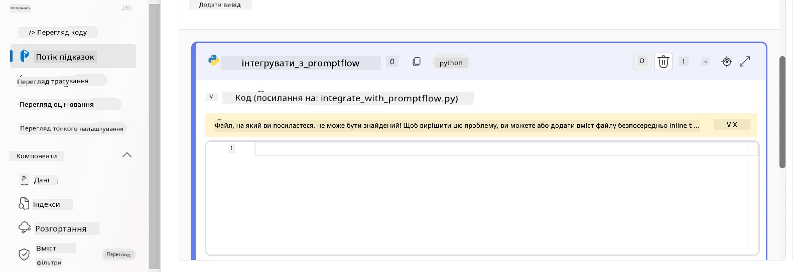

> [!NOTE]
> Для детальнішої інформації про використання Prompt flow в Azure AI Foundry зверніться до [Prompt flow in Azure AI Foundry](https://learn.microsoft.com/azure/ai-studio/how-to/prompt-flow).

1. Виберіть **Chat input**, **Chat output**, щоб увімкнути чат з вашою моделлю.

    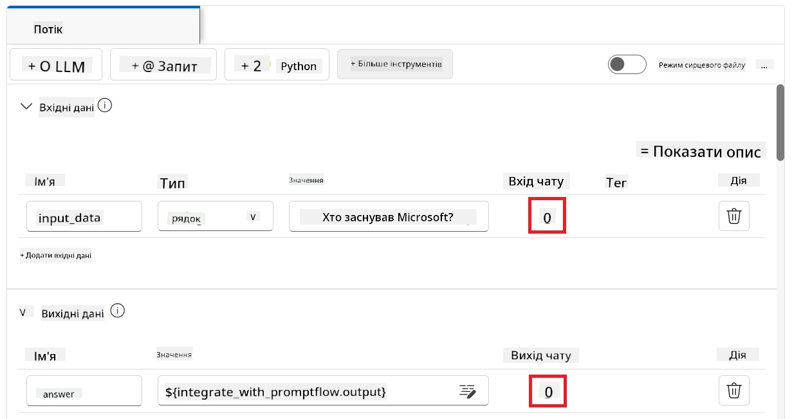

1. Тепер ви готові спілкуватися з вашою користувацькою моделлю Phi-3 / Phi-3.5. У наступному завданні ви навчитеся запускати Prompt flow і використовувати його для спілкування з тонко налаштованою моделлю Phi-3 / Phi-3.5.

> [!NOTE]
>
> Перероблений потік має виглядати, як на зображенні нижче:
>
> 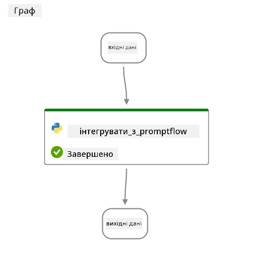
>

#### Запуск Prompt flow

1. Виберіть **Start compute sessions**, щоб запустити Prompt flow.

    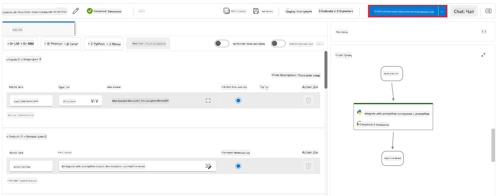

1. Виберіть **Validate and parse input**, щоб оновити параметри.

    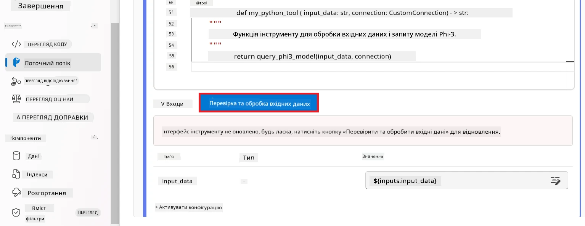

1. Виберіть **Value** для **connection** у створеному вами користувацькому з’єднанні. Наприклад, *connection*.

    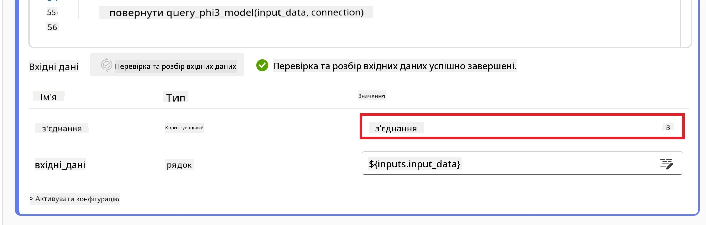

#### Спілкування з вашою користувацькою моделлю Phi-3 / Phi-3.5

1. Виберіть **Chat**.

    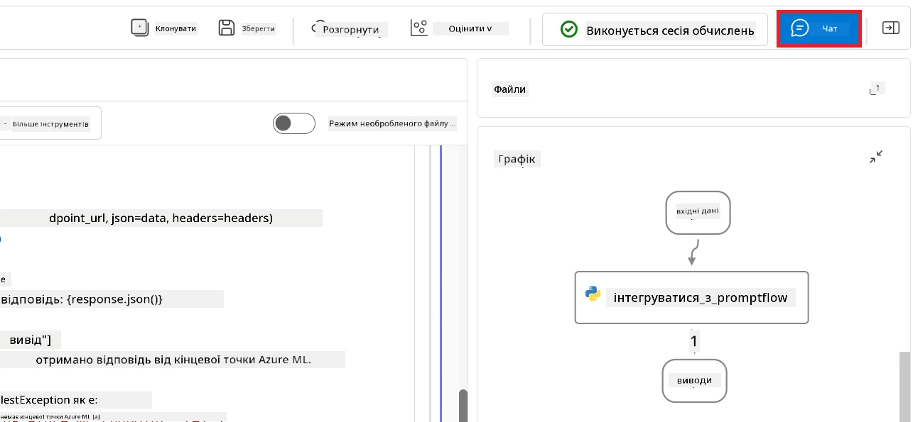

1. Ось приклад результатів: тепер ви можете спілкуватися з вашою користувацькою моделлю Phi-3 / Phi-3.5. Рекомендується ставити запитання на основі даних, використаних для тонкого налаштування.

    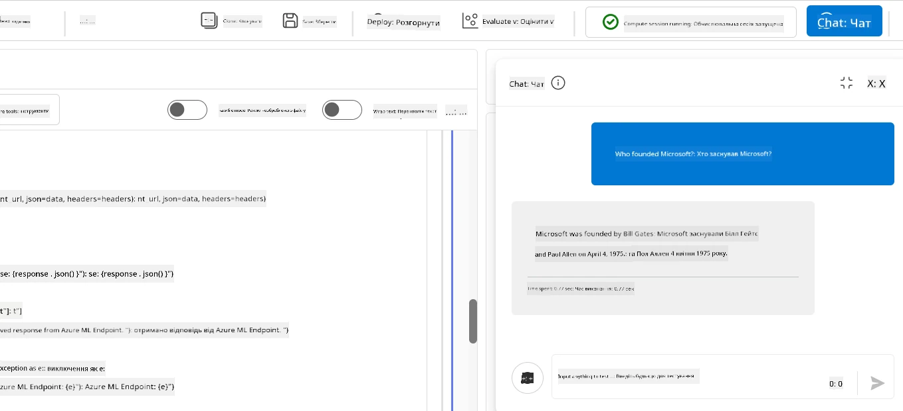

### Розгортання Azure OpenAI для оцінки моделі Phi-3 / Phi-3.5

Щоб оцінити модель Phi-3 / Phi-3.5 в Azure AI Foundry, потрібно розгорнути модель Azure OpenAI. Ця модель буде використовуватися для оцінки продуктивності моделі Phi-3 / Phi-3.5.

#### Розгортання Azure OpenAI

1. Увійдіть у [Azure AI Foundry](https://ai.azure.com/?wt.mc_id=studentamb_279723).

1. Перейдіть до створеного вами проєкту Azure AI Foundry.

    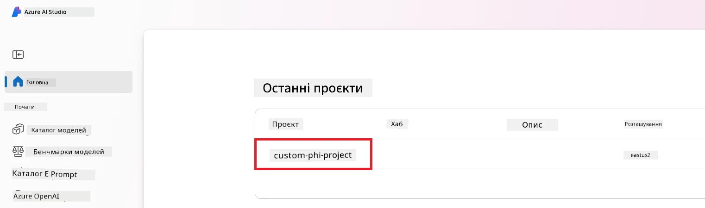

1. У створеному проєкті виберіть **Deployments** у лівій вкладці.

1. Виберіть **+ Deploy model** у навігаційному меню.

1. Виберіть **Deploy base model**.

    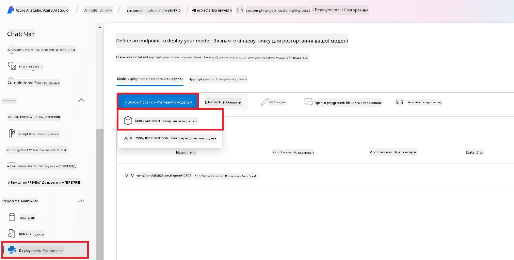

1. Виберіть модель Azure OpenAI, яку хочете використовувати. Наприклад, **gpt-4o**.

    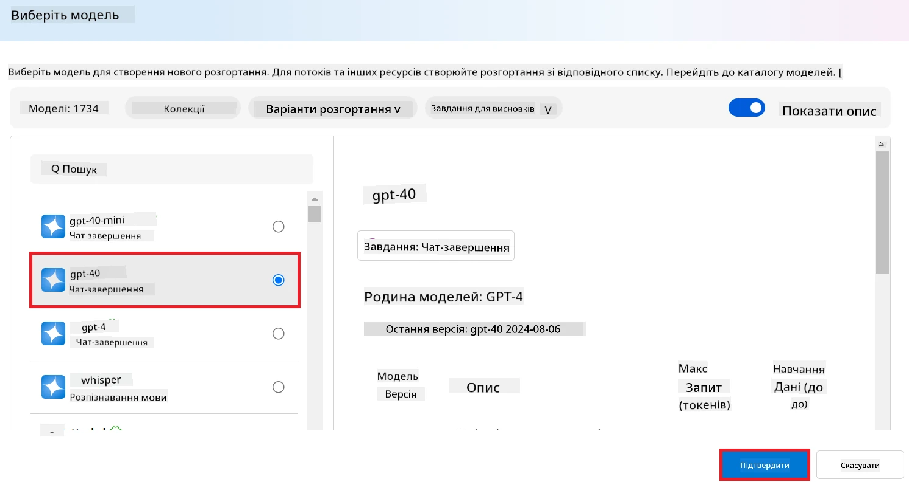

1. Виберіть **Confirm**.

### Оцінка тонко налаштованої моделі Phi-3 / Phi-3.5 за допомогою Prompt flow evaluation в Azure AI Foundry

### Початок нового оцінювання

1. Перейдіть до [Azure AI Foundry](https://ai.azure.com/?wt.mc_id=studentamb_279723).

1. Перейдіть до створеного вами проєкту Azure AI Foundry.

    

1. У створеному проєкті виберіть **Evaluation** у лівій вкладці.

1. Виберіть **+ New evaluation** у навігаційному меню.

    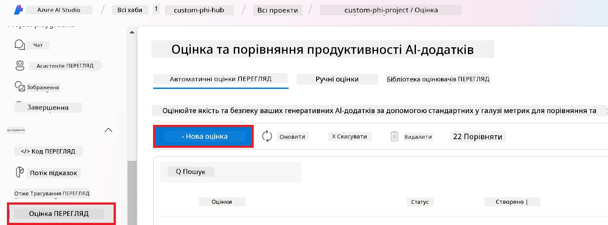

1. Виберіть оцінювання **Prompt flow**.

    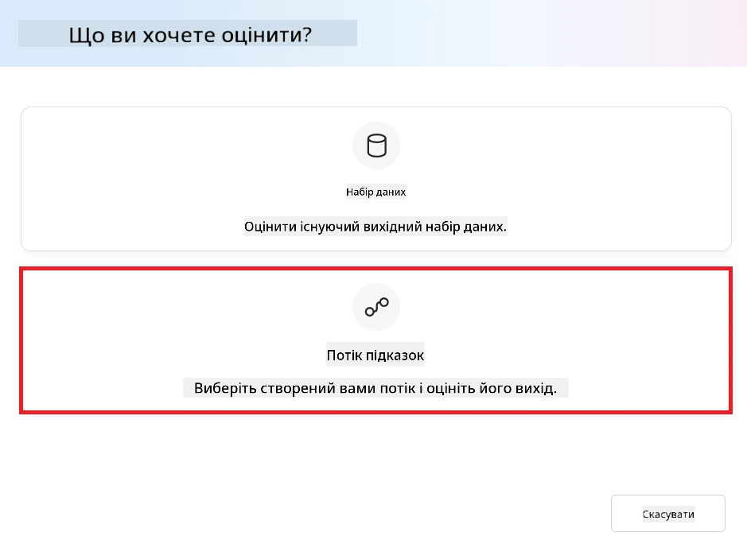

1. Виконайте наступні дії:

    - Введіть назву оцінювання. Вона має бути унікальною.
    - Виберіть тип завдання **Question and answer without context**, оскільки датасет **ULTRACHAT_200k**, використаний у цьому посібнику, не містить контексту.
    - Виберіть Prompt flow, який хочете оцінити.

    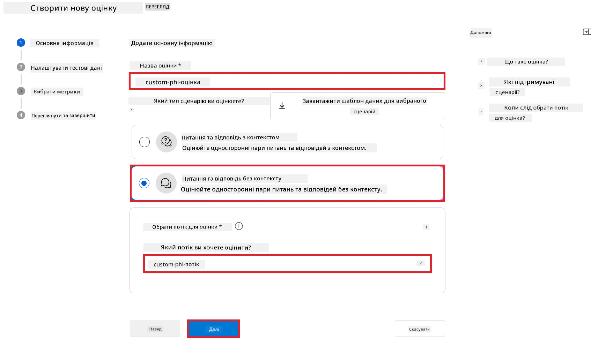

1. Виберіть **Next**.

1. Виконайте наступні дії:

    - Виберіть **Add your dataset**, щоб завантажити датасет. Наприклад, можна завантажити тестовий файл датасету, такий як *test_data.json1*, який входить до складу **ULTRACHAT_200k**.
    - Виберіть відповідний **Dataset column**, що відповідає вашому датасету. Наприклад, якщо ви використовуєте **ULTRACHAT_200k**, виберіть **${data.prompt}** як стовпець датасету.

    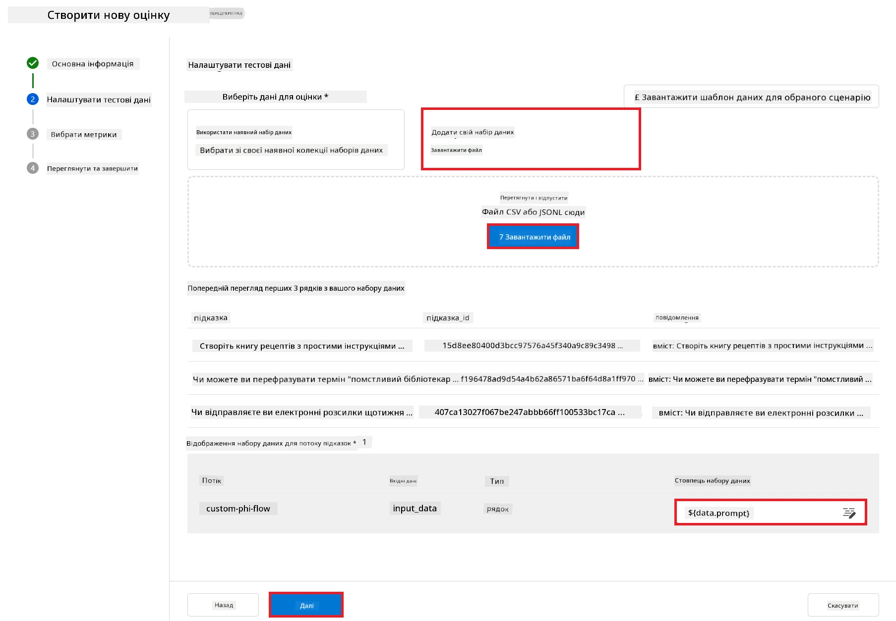

1. Виберіть **Next**.

1. Виконайте наступні дії для налаштування метрик продуктивності та якості:

    - Виберіть метрики продуктивності та якості, які хочете використовувати.
    - Виберіть модель Azure OpenAI, створену для оцінювання. Наприклад, **gpt-4o**.

    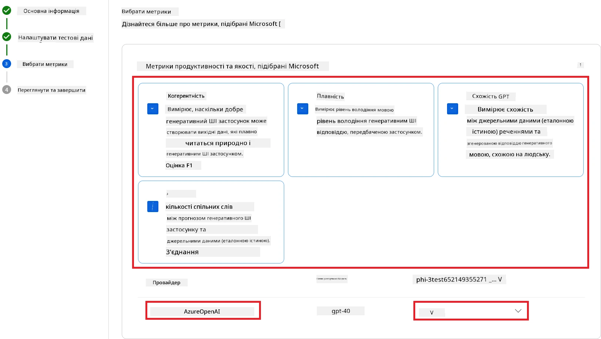

1. Виконайте наступні дії для налаштування метрик ризику та безпеки:

    - Виберіть метрики ризику та безпеки, які хочете використовувати.
    - Виберіть поріг для розрахунку рівня дефектів. Наприклад, **Medium**.
    - Для **question** виберіть **Data source** як **{$data.prompt}**.
    - Для **answer** виберіть **Data source** як **{$run.outputs.answer}**.
    - Для **ground_truth** виберіть **Data source** як **{$data.message}**.

    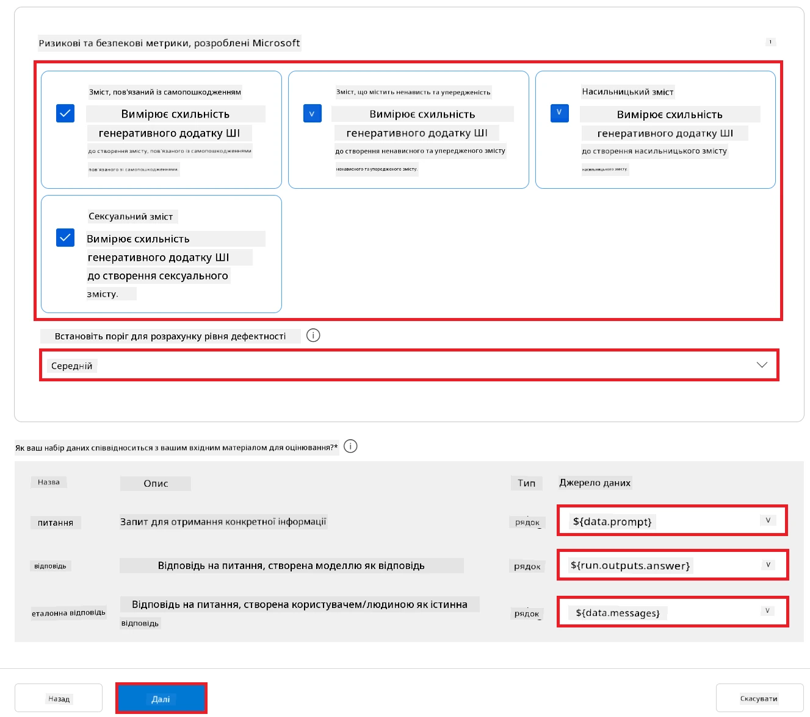

1. Виберіть **Next**.

1. Виберіть **Submit**, щоб розпочати оцінювання.

1. Оцінювання займе деякий час. Ви можете відстежувати прогрес у вкладці **Evaluation**.

### Перегляд результатів оцінювання
> [!NOTE]
> Результати, наведені нижче, призначені для ілюстрації процесу оцінювання. У цьому посібнику ми використали модель, донавчену на відносно невеликому наборі даних, що може призвести до неідеальних результатів. Фактичні результати можуть суттєво відрізнятися залежно від розміру, якості та різноманітності використаного набору даних, а також від конкретної конфігурації моделі.
Після завершення оцінювання ви можете переглянути результати як за показниками продуктивності, так і за показниками безпеки.

1. Показники продуктивності та якості:

    - оцініть ефективність моделі у генерації зв’язних, плавних та релевантних відповідей.

    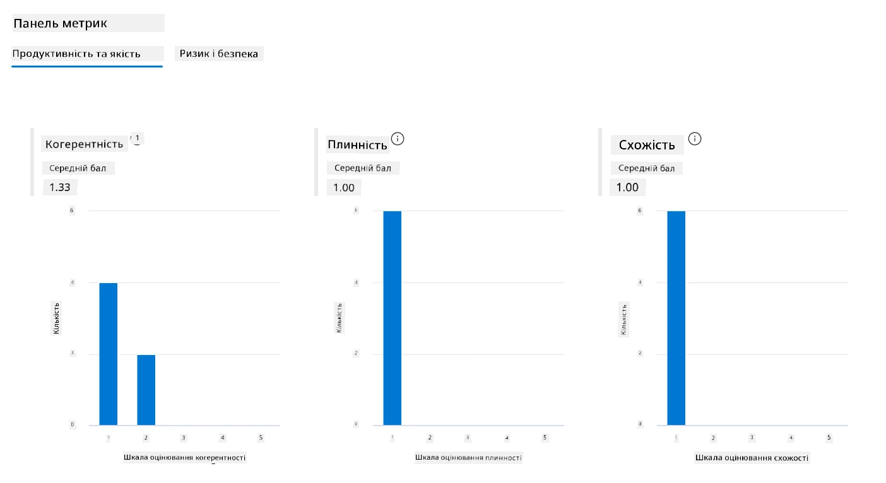

1. Показники ризиків та безпеки:

    - Переконайтеся, що вихідні дані моделі є безпечними та відповідають Принципам Відповідального ШІ, уникаючи будь-якого шкідливого або образливого контенту.

    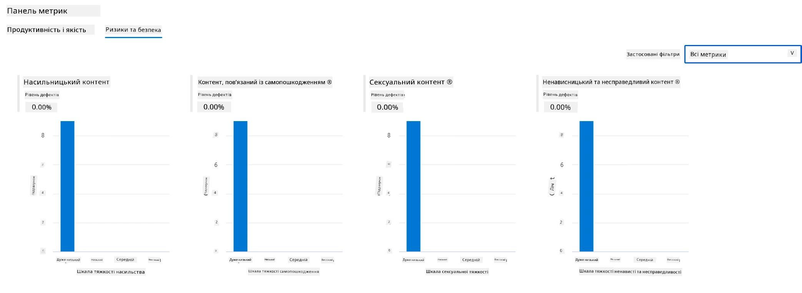

1. Ви можете прокрутити вниз, щоб переглянути **Детальні результати метрик**.

    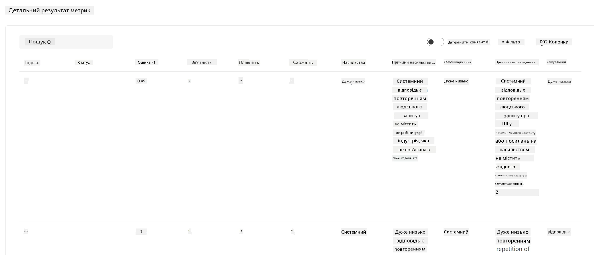

1. Оцінюючи вашу кастомну модель Phi-3 / Phi-3.5 за показниками продуктивності та безпеки, ви можете підтвердити, що модель не лише ефективна, а й відповідає принципам відповідального ШІ, що робить її готовою до реального використання.

## Вітаємо!

### Ви завершили цей навчальний курс

Ви успішно оцінили тонко налаштовану модель Phi-3, інтегровану з Prompt flow в Azure AI Foundry. Це важливий крок для забезпечення того, щоб ваші ШІ-моделі не лише добре працювали, а й відповідали Принципам Відповідального ШІ Microsoft, допомагаючи створювати надійні та довірені ШІ-додатки.


## Очищення ресурсів Azure

Очистіть свої ресурси Azure, щоб уникнути додаткових витрат на вашому рахунку. Перейдіть до порталу Azure та видаліть наступні ресурси:

- Ресурс Azure Machine learning.
- Кінцева точка моделі Azure Machine learning.
- Ресурс проекту Azure AI Foundry.
- Ресурс Prompt flow Azure AI Foundry.

### Наступні кроки

#### Документація

- [Оцінка систем ШІ за допомогою панелі Responsible AI](https://learn.microsoft.com/azure/machine-learning/concept-responsible-ai-dashboard?view=azureml-api-2&source=recommendations?wt.mc_id=studentamb_279723)
- [Метрики оцінки та моніторингу для генеративного ШІ](https://learn.microsoft.com/azure/ai-studio/concepts/evaluation-metrics-built-in?tabs=definition?wt.mc_id=studentamb_279723)
- [Документація Azure AI Foundry](https://learn.microsoft.com/azure/ai-studio/?wt.mc_id=studentamb_279723)
- [Документація Prompt flow](https://microsoft.github.io/promptflow/?wt.mc_id=studentamb_279723)

#### Навчальний контент

- [Вступ до підходу Microsoft щодо Відповідального ШІ](https://learn.microsoft.com/training/modules/introduction-to-microsofts-responsible-ai-approach/?source=recommendations?wt.mc_id=studentamb_279723)
- [Вступ до Azure AI Foundry](https://learn.microsoft.com/training/modules/introduction-to-azure-ai-studio/?wt.mc_id=studentamb_279723)

### Посилання

- [Що таке Відповідальний ШІ?](https://learn.microsoft.com/azure/machine-learning/concept-responsible-ai?view=azureml-api-2?wt.mc_id=studentamb_279723)
- [Оголошення про нові інструменти в Azure AI для створення більш безпечних і надійних генеративних ШІ-додатків](https://azure.microsoft.com/blog/announcing-new-tools-in-azure-ai-to-help-you-build-more-secure-and-trustworthy-generative-ai-applications/?wt.mc_id=studentamb_279723)
- [Оцінка генеративних ШІ-додатків](https://learn.microsoft.com/azure/ai-studio/concepts/evaluation-approach-gen-ai?wt.mc_id%3Dstudentamb_279723)

**Відмова від відповідальності**:  
Цей документ було перекладено за допомогою сервісу автоматичного перекладу [Co-op Translator](https://github.com/Azure/co-op-translator). Хоча ми прагнемо до точності, будь ласка, майте на увазі, що автоматичні переклади можуть містити помилки або неточності. Оригінальний документ рідною мовою слід вважати авторитетним джерелом. Для критично важливої інформації рекомендується звертатися до професійного людського перекладу. Ми не несемо відповідальності за будь-які непорозуміння або неправильні тлумачення, що виникли внаслідок використання цього перекладу.