# Додаткова настройка та інтеграція користувацьких моделей Phi-3 з Prompt flow

Цей кінцевий (E2E) приклад базується на керівництві "[Додаткова настройка та інтеграція користувацьких моделей Phi-3 з Prompt Flow: покроковий посібник](https://techcommunity.microsoft.com/t5/educator-developer-blog/fine-tune-and-integrate-custom-phi-3-models-with-prompt-flow/ba-p/4178612?WT.mc_id=aiml-137032-kinfeylo)" з Microsoft Tech Community. Він знайомить з процесами додаткової настройки, розгортання та інтеграції користувацьких моделей Phi-3 з Prompt flow.

## Огляд

У цьому E2E прикладі ви навчитесь додатково налаштовувати модель Phi-3 та інтегрувати її з Prompt flow. Використовуючи Azure Machine Learning і Prompt flow, ви створите робочий процес для розгортання та використання користувацьких моделей ШІ. Цей приклад поділено на три сценарії:

**Сценарій 1: Створення ресурсів Azure та підготовка до додаткової настройки**

**Сценарій 2: Додаткова настройка моделі Phi-3 та розгортання в Azure Machine Learning Studio**

**Сценарій 3: Інтеграція з Prompt flow та спілкування з вашою користувацькою моделлю**

Нижче наведено огляд цього E2E прикладу.

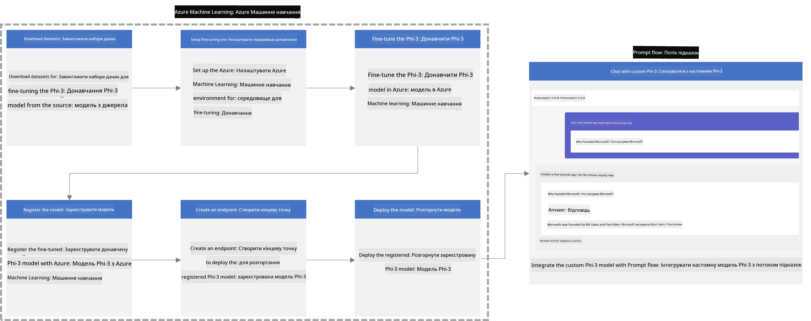

### Зміст

1. **[Сценарій 1: Створення ресурсів Azure та підготовка до додаткової настройки](../../../../../../md/02.Application/01.TextAndChat/Phi3)**
    - [Створення робочої області Azure Machine Learning](../../../../../../md/02.Application/01.TextAndChat/Phi3)
    - [Запит квоти GPU в підписці Azure](../../../../../../md/02.Application/01.TextAndChat/Phi3)
    - [Додавання призначення ролі](../../../../../../md/02.Application/01.TextAndChat/Phi3)
    - [Настроювання проекту](../../../../../../md/02.Application/01.TextAndChat/Phi3)
    - [Підготовка набору даних для додаткової настройки](../../../../../../md/02.Application/01.TextAndChat/Phi3)

1. **[Сценарій 2: Додаткова настройка моделі Phi-3 та розгортання в Azure Machine Learning Studio](../../../../../../md/02.Application/01.TextAndChat/Phi3)**
    - [Налаштування Azure CLI](../../../../../../md/02.Application/01.TextAndChat/Phi3)
    - [Додаткова настройка моделі Phi-3](../../../../../../md/02.Application/01.TextAndChat/Phi3)
    - [Розгортання додатково налаштованої моделі](../../../../../../md/02.Application/01.TextAndChat/Phi3)

1. **[Сценарій 3: Інтеграція з Prompt flow та спілкування з вашою користувацькою моделлю](../../../../../../md/02.Application/01.TextAndChat/Phi3)**
    - [Інтеграція користувацької моделі Phi-3 з Prompt flow](../../../../../../md/02.Application/01.TextAndChat/Phi3)
    - [Спілкування з вашою користувацькою моделлю](../../../../../../md/02.Application/01.TextAndChat/Phi3)

## Сценарій 1: Створення ресурсів Azure та підготовка до додаткової настройки

### Створення робочої області Azure Machine Learning

1. Введіть *azure machine learning* у **рядок пошуку** у верхній частині порталу та виберіть **Azure Machine Learning** із запропонованих варіантів.

    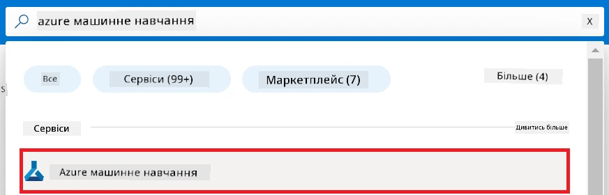

1. Виберіть **+ Створити** у меню навігації.

1. Виберіть **Нова робоча область** у меню навігації.

    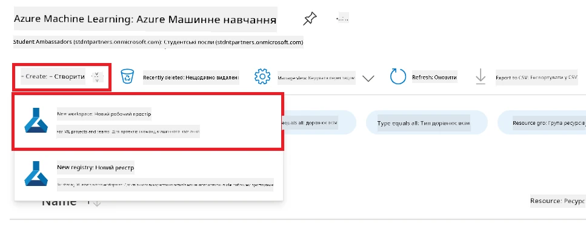

1. Виконайте наступні дії:

    - Виберіть вашу підписку Azure **Subscription**.
    - Виберіть **Resource group** для використання (за потребою створіть нову).
    - Введіть **Назву робочої області**. Вона має бути унікальною.
    - Виберіть потрібний **Регіон**.
    - Виберіть **Обліковий запис зберігання** для використання (за потребою створіть новий).
    - Виберіть **Key vault** для використання (за потребою створіть новий).
    - Виберіть **Application insights** для використання (за потребою створіть новий).
    - Виберіть **Реєстр контейнерів** для використання (за потребою створіть новий).

    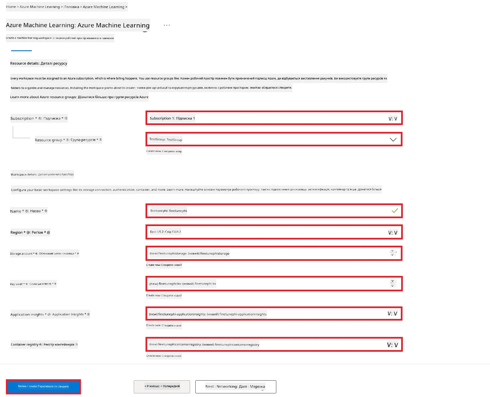

1. Виберіть **Перевірити + створити**.

1. Виберіть **Створити**.

### Запит квоти GPU в підписці Azure

У цьому E2E прикладі ви будете використовувати *Standard_NC24ads_A100_v4 GPU* для додаткової настройки, що потребує запиту квоти, а також *Standard_E4s_v3* CPU для розгортання, що не потребує запиту квоти.

> [!NOTE]
>
> Тільки підписки Pay-As-You-Go (стандартний тип підписки) мають право на виділення GPU; підписки зі спеціальними перевагами наразі не підтримуються.
>
> Для користувачів з підписками зі спеціальними перевагами (наприклад, Visual Studio Enterprise Subscription) або тих, хто хоче швидко протестувати процес додаткової настройки і розгортання, у цьому посібнику також є інструкції щодо додаткової настройки з використанням мінімального набору даних на CPU. Важливо врахувати, що результати додаткової настройки набагато кращі при використанні GPU з більшими наборами даних.

1. Відвідайте [Azure ML Studio](https://ml.azure.com/home?wt.mc_id=studentamb_279723).

1. Виконайте наступні дії, щоб запросити квоту *Standard NCADSA100v4 Family*:

    - Виберіть **Quota** зі вкладки зліва.
    - Виберіть сімейство віртуальних машин **Virtual machine family**, яке потрібно використовувати. Наприклад, виберіть **Standard NCADSA100v4 Family Cluster Dedicated vCPUs**, що включає *Standard_NC24ads_A100_v4* GPU.
    - Виберіть **Запросити квоту** у меню навігації.

        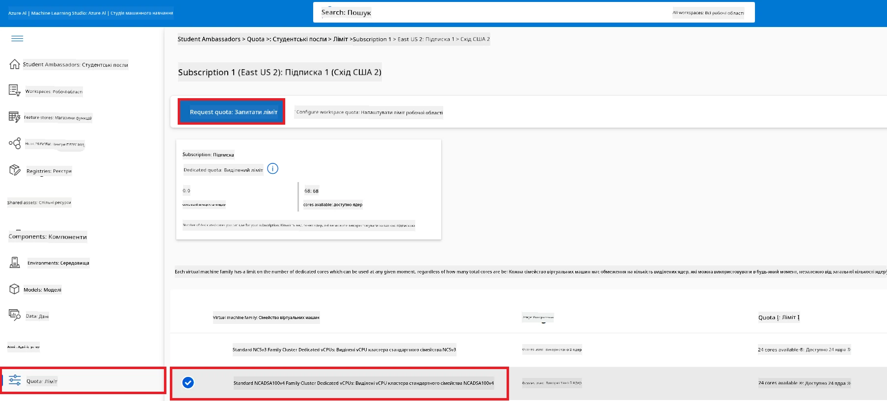

    - На сторінці запиту квоти введіть бажаний **Новий ліміт ядер**. Наприклад, 24.
    - На сторінці запиту квоти виберіть **Надіслати** для запиту квоти GPU.

> [!NOTE]
> Ви можете вибрати відповідний GPU або CPU згідно з вашими потребами за допомогою документації [Розміри віртуальних машин в Azure](https://learn.microsoft.com/azure/virtual-machines/sizes/overview?tabs=breakdownseries%2Cgeneralsizelist%2Ccomputesizelist%2Cmemorysizelist%2Cstoragesizelist%2Cgpusizelist%2Cfpgasizelist%2Chpcsizelist).

### Додавання призначення ролі

Для додаткової настройки та розгортання моделей спочатку потрібно створити Керовану ідентичність користувача (User Assigned Managed Identity, UAI) і надати їй відповідні дозволи. Ця UAI буде використовуватися для аутентифікації під час розгортання.

#### Створення Керованої ідентичності користувача (UAI)

1. Введіть *managed identities* у **рядок пошуку** у верхній частині порталу та виберіть **Managed Identities** із запропонованих варіантів.

    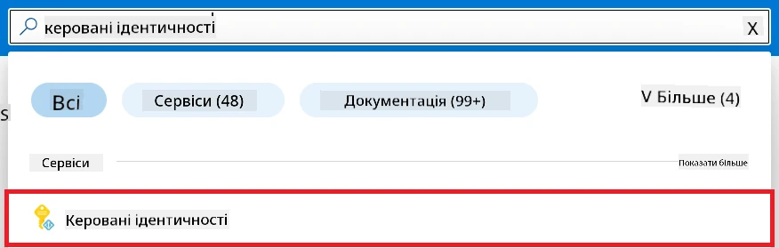

1. Виберіть **+ Створити**.

    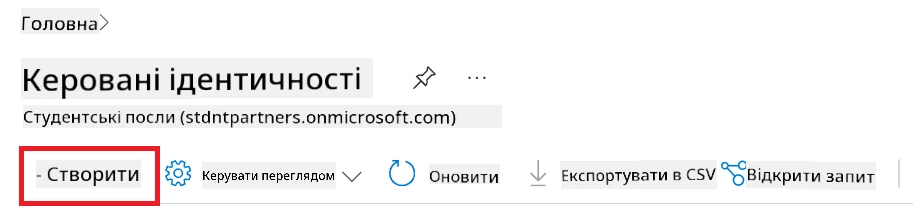

1. Виконайте наступні дії:

    - Виберіть вашу підписку Azure **Subscription**.
    - Виберіть **Resource group** для використання (за потребою створіть нову).
    - Виберіть потрібний **Регіон**.
    - Введіть **Назву**. Вона має бути унікальною.

1. Виберіть **Перевірити + створити**.

1. Виберіть **+ Створити**.

#### Додавання ролі Учасника (Contributor) керованій ідентичності

1. Перейдіть до ресурсу Керованої ідентичності, який ви створили.

1. Виберіть **Azure role assignments** зі вкладки зліва.

1. Натисніть **+ Додати призначення ролі** у меню навігації.

1. На сторінці додавання призначення ролі виконайте такі дії:
    - Встановіть область **Scope** на **Resource group**.
    - Виберіть вашу підписку Azure **Subscription**.
    - Виберіть потрібну **Resource group**.
    - Виберіть роль **Contributor** (Учасник).

    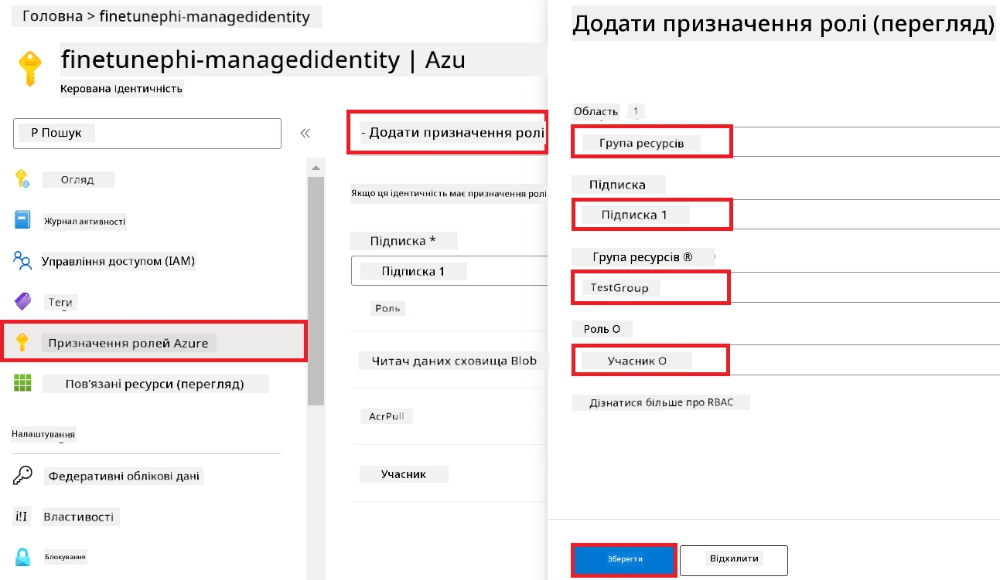

1. Натисніть **Зберегти**.

#### Додавання ролі читача Blob-зберігання (Storage Blob Data Reader) керованій ідентичності

1. Введіть *storage accounts* у **рядок пошуку** у верхній частині порталу та виберіть **Storage accounts** із запропонованих варіантів.

    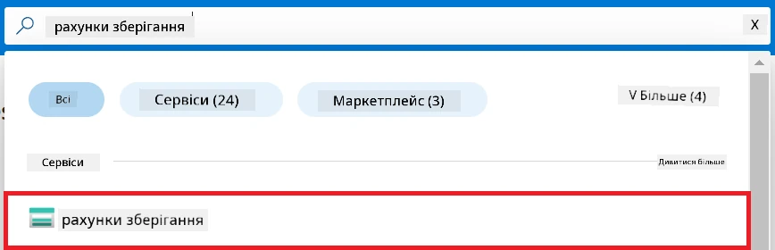

1. Виберіть обліковий запис зберігання, що пов’язаний із робочою областю Azure Machine Learning, яку ви створили. Наприклад, *finetunephistorage*.

1. Виконайте наступні дії, щоб перейти на сторінку додавання призначення ролі:

    - Перейдіть до облікового запису зберігання Azure, який ви створили.
    - Виберіть **Access Control (IAM)** зі вкладки зліва.
    - Виберіть **+ Додати** у меню навігації.
    - Виберіть **Додати призначення ролі** у меню навігації.

    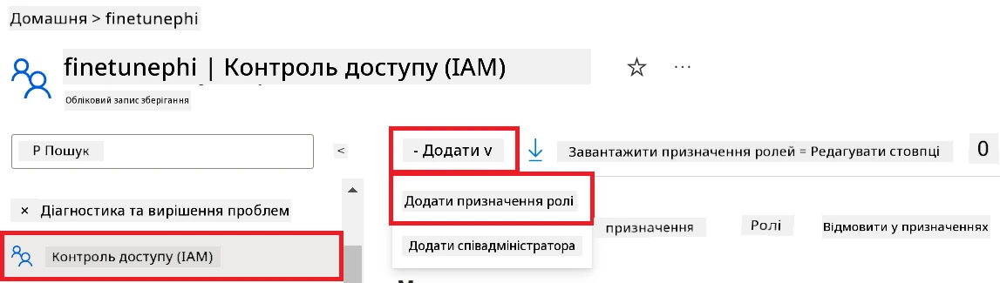

1. На сторінці додавання призначення ролі виконайте такі дії:

    - У полі ролі введіть *Storage Blob Data Reader* у **рядку пошуку** та виберіть **Storage Blob Data Reader** із варіантів.
    - Натисніть **Далі**.
    - На сторінці учасників виберіть **Призначити доступ для** **Керованої ідентичності**.
    - Натисніть **+ Вибрати учасників**.
    - На сторінці вибору керованих ідентичностей оберіть вашу підписку Azure.
    - Виберіть керовану ідентичність зі списку (Manage Identity).
    - Виберіть керовану ідентичність, яку ви створили. Наприклад, *finetunephi-managedidentity*.
    - Натисніть **Вибрати**.

    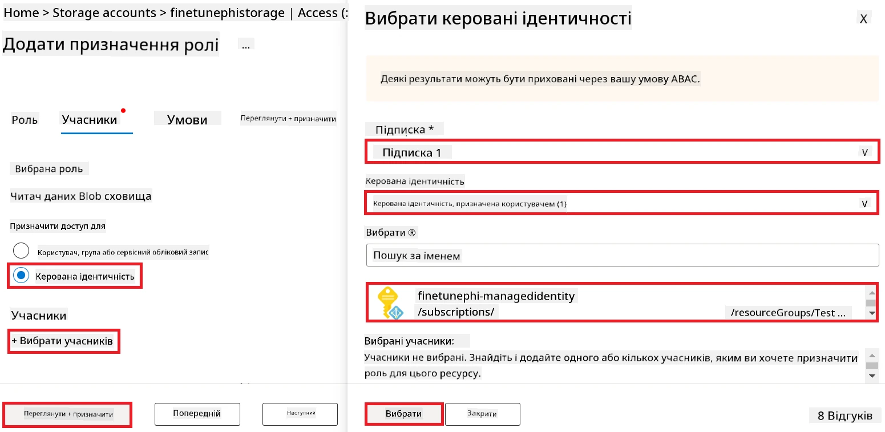

1. Виберіть **Перевірити + призначити**.

#### Додавання ролі AcrPull керованій ідентичності

1. Введіть *container registries* у **рядок пошуку** у верхній частині порталу та виберіть **Container registries** із запропонованих варіантів.

    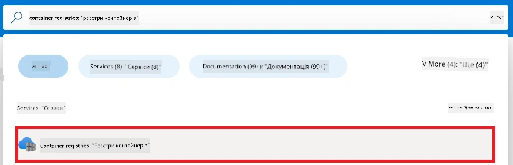

1. Виберіть реєстр контейнерів, що пов’язаний із робочою областю Azure Machine Learning. Наприклад, *finetunephicontainerregistries*

1. Виконайте наступні дії, щоб перейти на сторінку додавання призначення ролі:

    - Виберіть **Access Control (IAM)** зі вкладки зліва.
    - Виберіть **+ Додати** у меню навігації.
    - Виберіть **Додати призначення ролі** у меню навігації.

1. На сторінці додавання призначення ролі виконайте такі дії:

    - У полі ролі введіть *AcrPull* у **рядку пошуку** та виберіть **AcrPull** із варіантів.
    - Натисніть **Далі**.
    - На сторінці учасників виберіть **Призначити доступ для** **Керованої ідентичності**.
    - Натисніть **+ Вибрати учасників**.
    - На сторінці вибору керованих ідентичностей виберіть вашу підписку Azure.
    - Виберіть керовану ідентичність зі списку (Manage Identity).
    - Виберіть керовану ідентичність, яку ви створили. Наприклад, *finetunephi-managedidentity*.
    - Натисніть **Вибрати**.
    - Виберіть **Перевірити + призначити**.

### Налаштування проекту

Тепер ви створите папку для роботи та налаштуєте віртуальне середовище для розробки програми, яка взаємодіятиме з користувачами і використовуватиме збережену історію чатів з Azure Cosmos DB для формування відповідей.

#### Створення папки для роботи

1. Відкрийте термінал і введіть наступну команду, щоб створити папку з назвою *finetune-phi* у стандартному шляху.

    ```console
    mkdir finetune-phi
    ```

1. Введіть наступну команду в терміналі, щоб перейти до створеної папки *finetune-phi*.

    ```console
    cd finetune-phi
    ```

#### Створення віртуального середовища

1. Введіть наступну команду в терміналі, щоб створити віртуальне середовище з назвою *.venv*.

    ```console
    python -m venv .venv
    ```

1. Введіть наступну команду в терміналі, щоб активувати віртуальне середовище.

    ```console
    .venv\Scripts\activate.bat
    ```

> [!NOTE]
>
> Якщо все спрацювало, перед запрошенням командного рядка має з’явитись *(venv)*.

#### Встановлення необхідних пакетів

1. Введіть наступні команди в терміналі для встановлення необхідних пакетів.

    ```console
    pip install datasets==2.19.1
    pip install transformers==4.41.1
    pip install azure-ai-ml==1.16.0
    pip install torch==2.3.1
    pip install trl==0.9.4
    pip install promptflow==1.12.0
    ```

#### Створення файлів проекту
У цій вправі ви створите необхідні файли для нашого проєкту. Ці файли включають скрипти для завантаження датасету, налаштування середовища Azure Machine Learning, донавчання моделі Phi-3 та розгортання донавченої моделі. Ви також створите файл *conda.yml* для налаштування середовища донавчання.

У цій вправі ви:

- Створите файл *download_dataset.py* для завантаження датасету.
- Створите файл *setup_ml.py* для налаштування середовища Azure Machine Learning.
- Створите файл *fine_tune.py* у папці *finetuning_dir* для донавчання моделі Phi-3 за допомогою датасету.
- Створите файл *conda.yml* для налаштування середовища донавчання.
- Створите файл *deploy_model.py* для розгортання донавченої моделі.
- Створите файл *integrate_with_promptflow.py* для інтеграції донавченої моделі та запуску моделі за допомогою Prompt flow.
- Створите файл flow.dag.yml для налаштування структури робочого процесу Prompt flow.
- Створите файл *config.py* для введення інформації Azure.

> [!NOTE]
>
> Повна структура папок:
>
> ```text
> └── YourUserName
> .    └── finetune-phi
> .        ├── finetuning_dir
> .        │      └── fine_tune.py
> .        ├── conda.yml
> .        ├── config.py
> .        ├── deploy_model.py
> .        ├── download_dataset.py
> .        ├── flow.dag.yml
> .        ├── integrate_with_promptflow.py
> .        └── setup_ml.py
> ```

1. Відкрийте **Visual Studio Code**.

1. Виберіть **File** у меню.

1. Виберіть **Open Folder**.

1. Виберіть папку *finetune-phi*, яку ви створили, що знаходиться за адресою *C:\Users\yourUserName\finetune-phi*.

    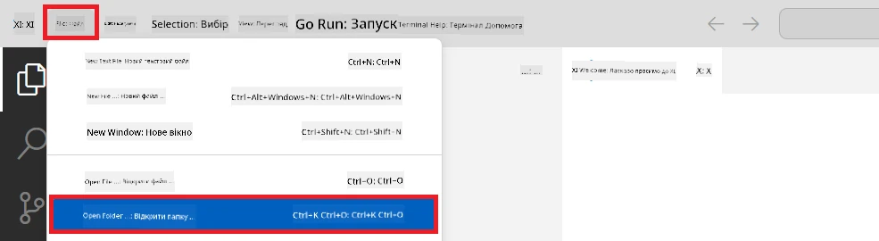

1. У лівій панелі Visual Studio Code клацніть правою кнопкою миші та виберіть **New File**, щоб створити новий файл з ім’ям *download_dataset.py*.

1. У лівій панелі Visual Studio Code клацніть правою кнопкою миші та виберіть **New File**, щоб створити новий файл з ім’ям *setup_ml.py*.

1. У лівій панелі Visual Studio Code клацніть правою кнопкою миші та виберіть **New File**, щоб створити новий файл з ім’ям *deploy_model.py*.

    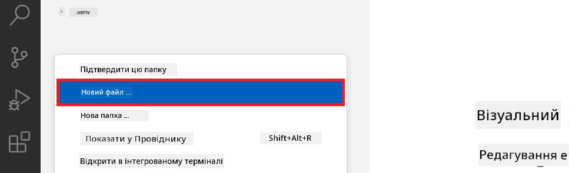

1. У лівій панелі Visual Studio Code клацніть правою кнопкою миші та виберіть **New Folder**, щоб створити нову папку з ім’ям *finetuning_dir*.

1. У папці *finetuning_dir* створіть новий файл з ім’ям *fine_tune.py*.

#### Створення та налаштування файлу *conda.yml*

1. У лівій панелі Visual Studio Code клацніть правою кнопкою миші та виберіть **New File**, щоб створити новий файл з ім’ям *conda.yml*.

1. Додайте наведений нижче код у файл *conda.yml* для налаштування середовища донавчання моделі Phi-3.

    ```yml
    name: phi-3-training-env
    channels:
      - defaults
      - conda-forge
    dependencies:
      - python=3.10
      - pip
      - numpy<2.0
      - pip:
          - torch==2.4.0
          - torchvision==0.19.0
          - trl==0.8.6
          - transformers==4.41
          - datasets==2.21.0
          - azureml-core==1.57.0
          - azure-storage-blob==12.19.0
          - azure-ai-ml==1.16
          - azure-identity==1.17.1
          - accelerate==0.33.0
          - mlflow==2.15.1
          - azureml-mlflow==1.57.0
    ```

#### Створення та налаштування файлу *config.py*

1. У лівій панелі Visual Studio Code клацніть правою кнопкою миші та виберіть **New File**, щоб створити новий файл з ім’ям *config.py*.

1. Додайте наведений нижче код у файл *config.py* для введення вашої інформації Azure.

    ```python
    # Налаштування Azure
    AZURE_SUBSCRIPTION_ID = "your_subscription_id"
    AZURE_RESOURCE_GROUP_NAME = "your_resource_group_name" # "TestGroup"

    # Налаштування Azure Machine Learning
    AZURE_ML_WORKSPACE_NAME = "your_workspace_name" # "finetunephi-workspace"

    # Налаштування Керованої Ідентичності Azure
    AZURE_MANAGED_IDENTITY_CLIENT_ID = "your_azure_managed_identity_client_id"
    AZURE_MANAGED_IDENTITY_NAME = "your_azure_managed_identity_name" # "finetunephi-mangedidentity"
    AZURE_MANAGED_IDENTITY_RESOURCE_ID = f"/subscriptions/{AZURE_SUBSCRIPTION_ID}/resourceGroups/{AZURE_RESOURCE_GROUP_NAME}/providers/Microsoft.ManagedIdentity/userAssignedIdentities/{AZURE_MANAGED_IDENTITY_NAME}"

    # Шляхи до файлів набору даних
    TRAIN_DATA_PATH = "data/train_data.jsonl"
    TEST_DATA_PATH = "data/test_data.jsonl"

    # Налаштування доопрацьованої моделі
    AZURE_MODEL_NAME = "your_fine_tuned_model_name" # "finetune-phi-model"
    AZURE_ENDPOINT_NAME = "your_fine_tuned_model_endpoint_name" # "finetune-phi-endpoint"
    AZURE_DEPLOYMENT_NAME = "your_fine_tuned_model_deployment_name" # "finetune-phi-deployment"

    AZURE_ML_API_KEY = "your_fine_tuned_model_api_key"
    AZURE_ML_ENDPOINT = "your_fine_tuned_model_endpoint_uri" # "https://{your-endpoint-name}.{your-region}.inference.ml.azure.com/score"
    ```

#### Додайте змінні середовища Azure

1. Виконайте наступні дії, щоб додати ідентифікатор підписки Azure:

    - Введіть *subscriptions* у **панелі пошуку** зверху на порталі та виберіть **Subscriptions** із запропонованих варіантів.
    - Виберіть підписку Azure, яку ви зараз використовуєте.
    - Скопіюйте та вставте ваш Subscription ID у файл *config.py*.

    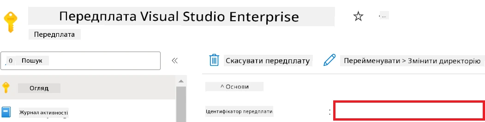

1. Виконайте наступні дії, щоб додати назву робочого простору Azure:

    - Перейдіть до ресурсу Azure Machine Learning, який ви створили.
    - Скопіюйте та вставте назву вашого облікового запису у файл *config.py*.

    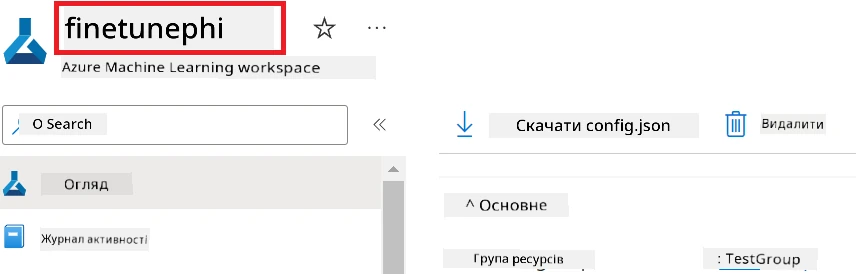

1. Виконайте наступні дії, щоб додати назву групи ресурсів Azure:

    - Перейдіть до ресурсу Azure Machine Learning, який ви створили.
    - Скопіюйте та вставте назву вашої групи ресурсів Azure у файл *config.py*.

    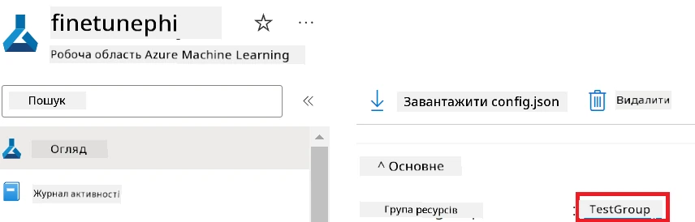

2. Виконайте наступні дії, щоб додати назву керованої ідентичності Azure

    - Перейдіть до ресурсу Managed Identities, який ви створили.
    - Скопіюйте та вставте назву вашої керованої ідентичності Azure у файл *config.py*.

    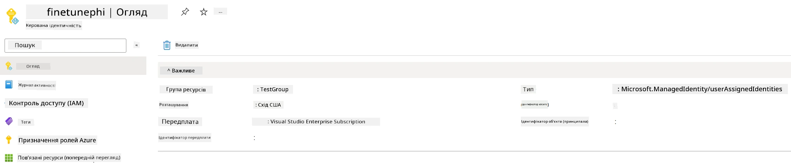

### Підготовка датасету для донавчання

У цій вправі ви запустите файл *download_dataset.py*, щоб завантажити датасети *ULTRACHAT_200k* у ваше локальне середовище. Потім ви використаєте цей датасет для донавчання моделі Phi-3 в Azure Machine Learning.

#### Завантаження датасету за допомогою *download_dataset.py*

1. Відкрийте файл *download_dataset.py* у Visual Studio Code.

1. Додайте наступний код у файл *download_dataset.py*.

    ```python
    import json
    import os
    from datasets import load_dataset
    from config import (
        TRAIN_DATA_PATH,
        TEST_DATA_PATH)

    def load_and_split_dataset(dataset_name, config_name, split_ratio):
        """
        Load and split a dataset.
        """
        # Завантажити набір даних із заданою назвою, конфігурацією та коефіцієнтом розподілу
        dataset = load_dataset(dataset_name, config_name, split=split_ratio)
        print(f"Original dataset size: {len(dataset)}")
        
        # Розділити набір даних на тренувальний і тестовий набори (80% тренувальний, 20% тестовий)
        split_dataset = dataset.train_test_split(test_size=0.2)
        print(f"Train dataset size: {len(split_dataset['train'])}")
        print(f"Test dataset size: {len(split_dataset['test'])}")
        
        return split_dataset

    def save_dataset_to_jsonl(dataset, filepath):
        """
        Save a dataset to a JSONL file.
        """
        # Створити директорію, якщо вона не існує
        os.makedirs(os.path.dirname(filepath), exist_ok=True)
        
        # Відкрити файл у режимі запису
        with open(filepath, 'w', encoding='utf-8') as f:
            # Ітеруватися по кожному запису в наборі даних
            for record in dataset:
                # Вивантажити запис у вигляді JSON-об’єкта і записати його у файл
                json.dump(record, f)
                # Записати символ нової строки для розділення записів
                f.write('\n')
        
        print(f"Dataset saved to {filepath}")

    def main():
        """
        Main function to load, split, and save the dataset.
        """
        # Завантажити і розділити набір даних ULTRACHAT_200k із певною конфігурацією та коефіцієнтом розподілу
        dataset = load_and_split_dataset("HuggingFaceH4/ultrachat_200k", 'default', 'train_sft[:1%]')
        
        # Витягти тренувальний та тестовий набори даних із розподілу
        train_dataset = dataset['train']
        test_dataset = dataset['test']

        # Зберегти тренувальний набір у файл формату JSONL
        save_dataset_to_jsonl(train_dataset, TRAIN_DATA_PATH)
        
        # Зберегти тестовий набір у окремий файл формату JSONL
        save_dataset_to_jsonl(test_dataset, TEST_DATA_PATH)

    if __name__ == "__main__":
        main()

    ```

> [!TIP]
>
> **Рекомендації щодо донавчання мінімальним датасетом за допомогою CPU**
>
> Якщо ви хочете використати CPU для донавчання, цей підхід ідеально підходить для тих, хто має пільгові підписки (наприклад, Visual Studio Enterprise Subscription) або для швидкого тестування процесу донавчання та розгортання.
>
> Замініть `dataset = load_and_split_dataset("HuggingFaceH4/ultrachat_200k", 'default', 'train_sft[:1%]')` на `dataset = load_and_split_dataset("HuggingFaceH4/ultrachat_200k", 'default', 'train_sft[:10]')`
>

1. Введіть наступну команду у терміналі, щоб запустити скрипт і завантажити датасет у ваше локальне середовище.

    ```console
    python download_data.py
    ```

1. Перевірте, що датасети успішно збережені у вашому локальному каталозі *finetune-phi/data*.

> [!NOTE]
>
> **Розмір датасету та час донавчання**
>
> У цьому прикладі E2E ви використовуєте лише 1% датасету (`train_sft[:1%]`). Це значно скорочує обсяг даних, прискорюючи як завантаження, так і процес донавчання. Ви можете змінювати відсоток, щоб знайти оптимальний баланс між часом тренування та продуктивністю моделі. Використання меншої частини датасету зменшує час, необхідний для донавчання, що робить процес більш керованим для прикладу E2E.

## Сценарій 2: Донавчити модель Phi-3 та розгорнути в Azure Machine Learning Studio

### Налаштування Azure CLI

Вам потрібно налаштувати Azure CLI для автентифікації вашого середовища. Azure CLI дозволяє керувати ресурсами Azure безпосередньо з командного рядка та надає облікові дані, необхідні для доступу Azure Machine Learning до цих ресурсів. Щоб почати, встановіть [Azure CLI](https://learn.microsoft.com/cli/azure/install-azure-cli)

1. Відкрийте вікно термінала і введіть таку команду, щоб увійти у свій акаунт Azure.

    ```console
    az login
    ```

1. Виберіть свій акаунт Azure для використання.

1. Виберіть підписку Azure для використання.

    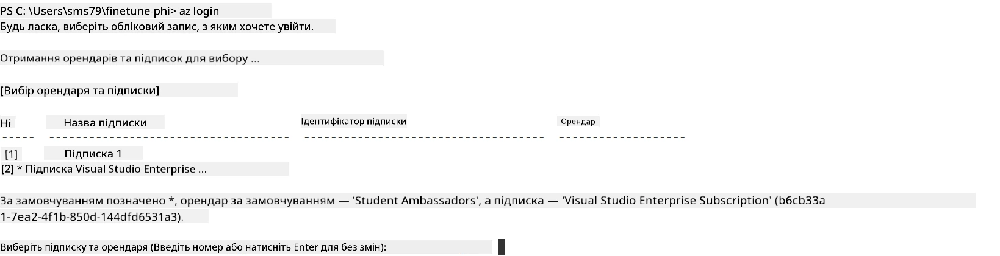

> [!TIP]
>
> Якщо у вас виникають проблеми з входом в Azure, спробуйте використовувати код пристрою. Відкрийте вікно термінала і введіть наступну команду для входу в обліковий запис Azure:
>
> ```console
> az login --use-device-code
> ```
>

### Донавчання моделі Phi-3

У цій вправі ви донавчите модель Phi-3, використовуючи наданий датасет. Спершу ви визначите процес донавчання у файлі *fine_tune.py*. Потім ви налаштуєте середовище Azure Machine Learning і ініціюєте процес донавчання, запустивши файл *setup_ml.py*. Цей скрипт гарантує, що донавчання відбуватиметься в середовищі Azure Machine Learning.

Запустивши *setup_ml.py*, ви запустите процес донавчання в середовищі Azure Machine Learning.

#### Додайте код у файл *fine_tune.py*

1. Перейдіть у папку *finetuning_dir* та відкрийте файл *fine_tune.py* у Visual Studio Code.

1. Додайте наступний код у файл *fine_tune.py*.

    ```python
    import argparse
    import sys
    import logging
    import os
    from datasets import load_dataset
    import torch
    import mlflow
    from transformers import AutoModelForCausalLM, AutoTokenizer, TrainingArguments
    from trl import SFTTrainer

    # Щоб уникнути помилки INVALID_PARAMETER_VALUE в MLflow, вимкніть інтеграцію MLflow
    os.environ["DISABLE_MLFLOW_INTEGRATION"] = "True"

    # Налаштування журналювання
    logging.basicConfig(
        format="%(asctime)s - %(levelname)s - %(name)s - %(message)s",
        datefmt="%Y-%m-%d %H:%M:%S",
        handlers=[logging.StreamHandler(sys.stdout)],
        level=logging.WARNING
    )
    logger = logging.getLogger(__name__)

    def initialize_model_and_tokenizer(model_name, model_kwargs):
        """
        Initialize the model and tokenizer with the given pretrained model name and arguments.
        """
        model = AutoModelForCausalLM.from_pretrained(model_name, **model_kwargs)
        tokenizer = AutoTokenizer.from_pretrained(model_name)
        tokenizer.model_max_length = 2048
        tokenizer.pad_token = tokenizer.unk_token
        tokenizer.pad_token_id = tokenizer.convert_tokens_to_ids(tokenizer.pad_token)
        tokenizer.padding_side = 'right'
        return model, tokenizer

    def apply_chat_template(example, tokenizer):
        """
        Apply a chat template to tokenize messages in the example.
        """
        messages = example["messages"]
        if messages[0]["role"] != "system":
            messages.insert(0, {"role": "system", "content": ""})
        example["text"] = tokenizer.apply_chat_template(
            messages, tokenize=False, add_generation_prompt=False
        )
        return example

    def load_and_preprocess_data(train_filepath, test_filepath, tokenizer):
        """
        Load and preprocess the dataset.
        """
        train_dataset = load_dataset('json', data_files=train_filepath, split='train')
        test_dataset = load_dataset('json', data_files=test_filepath, split='train')
        column_names = list(train_dataset.features)

        train_dataset = train_dataset.map(
            apply_chat_template,
            fn_kwargs={"tokenizer": tokenizer},
            num_proc=10,
            remove_columns=column_names,
            desc="Applying chat template to train dataset",
        )

        test_dataset = test_dataset.map(
            apply_chat_template,
            fn_kwargs={"tokenizer": tokenizer},
            num_proc=10,
            remove_columns=column_names,
            desc="Applying chat template to test dataset",
        )

        return train_dataset, test_dataset

    def train_and_evaluate_model(train_dataset, test_dataset, model, tokenizer, output_dir):
        """
        Train and evaluate the model.
        """
        training_args = TrainingArguments(
            bf16=True,
            do_eval=True,
            output_dir=output_dir,
            eval_strategy="epoch",
            learning_rate=5.0e-06,
            logging_steps=20,
            lr_scheduler_type="cosine",
            num_train_epochs=3,
            overwrite_output_dir=True,
            per_device_eval_batch_size=4,
            per_device_train_batch_size=4,
            remove_unused_columns=True,
            save_steps=500,
            seed=0,
            gradient_checkpointing=True,
            gradient_accumulation_steps=1,
            warmup_ratio=0.2,
        )

        trainer = SFTTrainer(
            model=model,
            args=training_args,
            train_dataset=train_dataset,
            eval_dataset=test_dataset,
            max_seq_length=2048,
            dataset_text_field="text",
            tokenizer=tokenizer,
            packing=True
        )

        train_result = trainer.train()
        trainer.log_metrics("train", train_result.metrics)

        mlflow.transformers.log_model(
            transformers_model={"model": trainer.model, "tokenizer": tokenizer},
            artifact_path=output_dir,
        )

        tokenizer.padding_side = 'left'
        eval_metrics = trainer.evaluate()
        eval_metrics["eval_samples"] = len(test_dataset)
        trainer.log_metrics("eval", eval_metrics)

    def main(train_file, eval_file, model_output_dir):
        """
        Main function to fine-tune the model.
        """
        model_kwargs = {
            "use_cache": False,
            "trust_remote_code": True,
            "torch_dtype": torch.bfloat16,
            "device_map": None,
            "attn_implementation": "eager"
        }

        # pretrained_model_name = "microsoft/Phi-3-mini-4k-instruct"
        pretrained_model_name = "microsoft/Phi-3.5-mini-instruct"

        with mlflow.start_run():
            model, tokenizer = initialize_model_and_tokenizer(pretrained_model_name, model_kwargs)
            train_dataset, test_dataset = load_and_preprocess_data(train_file, eval_file, tokenizer)
            train_and_evaluate_model(train_dataset, test_dataset, model, tokenizer, model_output_dir)

    if __name__ == "__main__":
        parser = argparse.ArgumentParser()
        parser.add_argument("--train-file", type=str, required=True, help="Path to the training data")
        parser.add_argument("--eval-file", type=str, required=True, help="Path to the evaluation data")
        parser.add_argument("--model_output_dir", type=str, required=True, help="Directory to save the fine-tuned model")
        args = parser.parse_args()
        main(args.train_file, args.eval_file, args.model_output_dir)

    ```

1. Збережіть і закрийте файл *fine_tune.py*.

> [!TIP]
> **Ви можете донавчати модель Phi-3.5**
>
> У файлі *fine_tune.py* ви можете змінити `pretrained_model_name` з `"microsoft/Phi-3-mini-4k-instruct"` на будь-яку модель, яку хочете донавчити. Наприклад, якщо змінити на `"microsoft/Phi-3.5-mini-instruct"`, ви будете використовувати модель Phi-3.5-mini-instruct для донавчання. Щоб знайти та використати потрібну модель, завітайте на [Hugging Face](https://huggingface.co/), знайдіть модель, що вас цікавить, і скопіюйте та вставте її назву у поле `pretrained_model_name` у ваш скрипт.
>
> <image type="content" src="../../../../imgs/02/FineTuning-PromptFlow/finetunephi3.5.png" alt-text="Донавчання Phi-3.5.">
>

#### Додайте код у файл *setup_ml.py*

1. Відкрийте файл *setup_ml.py* у Visual Studio Code.

1. Додайте наступний код у файл *setup_ml.py*.

    ```python
    import logging
    from azure.ai.ml import MLClient, command, Input
    from azure.ai.ml.entities import Environment, AmlCompute
    from azure.identity import AzureCliCredential
    from config import (
        AZURE_SUBSCRIPTION_ID,
        AZURE_RESOURCE_GROUP_NAME,
        AZURE_ML_WORKSPACE_NAME,
        TRAIN_DATA_PATH,
        TEST_DATA_PATH
    )

    # Константи

    # Розкоментуйте наступні рядки, щоб використовувати інстанцію CPU для навчання
    # COMPUTE_INSTANCE_TYPE = "Standard_E16s_v3" # cpu
    # COMPUTE_NAME = "cpu-e16s-v3"
    # DOCKER_IMAGE_NAME = "mcr.microsoft.com/azureml/openmpi4.1.0-ubuntu20.04:latest"

    # Розкоментуйте наступні рядки, щоб використовувати інстанцію GPU для навчання
    COMPUTE_INSTANCE_TYPE = "Standard_NC24ads_A100_v4"
    COMPUTE_NAME = "gpu-nc24s-a100-v4"
    DOCKER_IMAGE_NAME = "mcr.microsoft.com/azureml/curated/acft-hf-nlp-gpu:59"

    CONDA_FILE = "conda.yml"
    LOCATION = "eastus2" # Замініть на розташування вашого обчислювального кластеру
    FINETUNING_DIR = "./finetuning_dir" # Шлях до скрипту донавчання
    TRAINING_ENV_NAME = "phi-3-training-environment" # Назва середовища для навчання
    MODEL_OUTPUT_DIR = "./model_output" # Шлях до каталогу виводу моделі в Azure ML

    # Налаштування логування для відстеження процесу
    logger = logging.getLogger(__name__)
    logging.basicConfig(
        format="%(asctime)s - %(levelname)s - %(name)s - %(message)s",
        datefmt="%Y-%m-%d %H:%M:%S",
        level=logging.WARNING
    )

    def get_ml_client():
        """
        Initialize the ML Client using Azure CLI credentials.
        """
        credential = AzureCliCredential()
        return MLClient(credential, AZURE_SUBSCRIPTION_ID, AZURE_RESOURCE_GROUP_NAME, AZURE_ML_WORKSPACE_NAME)

    def create_or_get_environment(ml_client):
        """
        Create or update the training environment in Azure ML.
        """
        env = Environment(
            image=DOCKER_IMAGE_NAME,  # Docker образ для середовища
            conda_file=CONDA_FILE,  # Файл середовища Conda
            name=TRAINING_ENV_NAME,  # Назва середовища
        )
        return ml_client.environments.create_or_update(env)

    def create_or_get_compute_cluster(ml_client, compute_name, COMPUTE_INSTANCE_TYPE, location):
        """
        Create or update the compute cluster in Azure ML.
        """
        try:
            compute_cluster = ml_client.compute.get(compute_name)
            logger.info(f"Compute cluster '{compute_name}' already exists. Reusing it for the current run.")
        except Exception:
            logger.info(f"Compute cluster '{compute_name}' does not exist. Creating a new one with size {COMPUTE_INSTANCE_TYPE}.")
            compute_cluster = AmlCompute(
                name=compute_name,
                size=COMPUTE_INSTANCE_TYPE,
                location=location,
                tier="Dedicated",  # Рівень обчислювального кластеру
                min_instances=0,  # Мінімальна кількість інстанцій
                max_instances=1  # Максимальна кількість інстанцій
            )
            ml_client.compute.begin_create_or_update(compute_cluster).wait()  # Очікування створення кластеру
        return compute_cluster

    def create_fine_tuning_job(env, compute_name):
        """
        Set up the fine-tuning job in Azure ML.
        """
        return command(
            code=FINETUNING_DIR,  # Шлях до fine_tune.py
            command=(
                "python fine_tune.py "
                "--train-file ${{inputs.train_file}} "
                "--eval-file ${{inputs.eval_file}} "
                "--model_output_dir ${{inputs.model_output}}"
            ),
            environment=env,  # Середовище навчання
            compute=compute_name,  # Обчислювальний кластер для використання
            inputs={
                "train_file": Input(type="uri_file", path=TRAIN_DATA_PATH),  # Шлях до файла з навчальними даними
                "eval_file": Input(type="uri_file", path=TEST_DATA_PATH),  # Шлях до файла з даними для оцінки
                "model_output": MODEL_OUTPUT_DIR
            }
        )

    def main():
        """
        Main function to set up and run the fine-tuning job in Azure ML.
        """
        # Ініціалізація ML клієнта
        ml_client = get_ml_client()

        # Створення середовища
        env = create_or_get_environment(ml_client)
        
        # Створення або отримання існуючого обчислювального кластеру
        create_or_get_compute_cluster(ml_client, COMPUTE_NAME, COMPUTE_INSTANCE_TYPE, LOCATION)

        # Створення та відправлення завдання для донавчання
        job = create_fine_tuning_job(env, COMPUTE_NAME)
        returned_job = ml_client.jobs.create_or_update(job)  # Відправлення завдання
        ml_client.jobs.stream(returned_job.name)  # Потокове відображення логів завдання
        
        # Захоплення імені завдання
        job_name = returned_job.name
        print(f"Job name: {job_name}")

    if __name__ == "__main__":
        main()

    ```

1. Замініть `COMPUTE_INSTANCE_TYPE`, `COMPUTE_NAME` та `LOCATION` на ваші конкретні дані.

    ```python
   # Розкоментуйте наступні рядки, щоб використовувати GPU-інстанс для навчання
    COMPUTE_INSTANCE_TYPE = "Standard_NC24ads_A100_v4"
    COMPUTE_NAME = "gpu-nc24s-a100-v4"
    ...
    LOCATION = "eastus2" # Замініть на розташування вашого обчислювального кластера
    ```

> [!TIP]
>
> **Рекомендації щодо донавчання мінімальним датасетом за допомогою CPU**
>
> Якщо ви хочете використати CPU для донавчання, цей підхід ідеально підходить для тих, хто має пільгові підписки (наприклад, Visual Studio Enterprise Subscription) або для швидкого тестування процесу донавчання та розгортання.
>
> 1. Відкрийте файл *setup_ml*.
> 1. Замініть `COMPUTE_INSTANCE_TYPE`, `COMPUTE_NAME` та `DOCKER_IMAGE_NAME` на наведені нижче значення. Якщо у вас немає доступу до *Standard_E16s_v3*, ви можете використати еквівалентний екземпляр CPU або запитати нову квоту.
> 1. Замініть `LOCATION` на ваші конкретні дані.
>
>    ```python
>    # Uncomment the following lines to use a CPU instance for training
>    COMPUTE_INSTANCE_TYPE = "Standard_E16s_v3" # cpu
>    COMPUTE_NAME = "cpu-e16s-v3"
>    DOCKER_IMAGE_NAME = "mcr.microsoft.com/azureml/openmpi4.1.0-ubuntu20.04:latest"
>    LOCATION = "eastus2" # Replace with the location of your compute cluster
>    ```
>

1. Введіть наступну команду, щоб запустити скрипт *setup_ml.py* і розпочати процес донавчання в Azure Machine Learning.

    ```python
    python setup_ml.py
    ```

1. У цій вправі ви успішно донавчили модель Phi-3 за допомогою Azure Machine Learning. Запустивши скрипт *setup_ml.py*, ви налаштували середовище Azure Machine Learning та ініціювали процес донавчання, визначений у файлі *fine_tune.py*. Зверніть увагу, що процес донавчання може зайняти значний час. Після запуску команди `python setup_ml.py` потрібно дочекатися завершення процесу. Ви можете відстежувати статус завдання донавчання, перейшовши за посиланням, яке відображається у терміналі, до порталу Azure Machine Learning.

    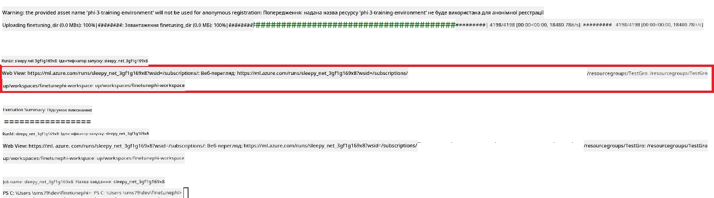

### Розгортання донавченої моделі

Щоб інтегрувати донавчену модель Phi-3 із Prompt Flow, потрібно розгорнути модель, щоб зробити її доступною для інференсу в режимі реального часу. Цей процес включає реєстрацію моделі, створення онлайн-ендпоінта та розгортання моделі.

#### Встановлення імені моделі, імені ендпоінта та імені розгортання для розгортання

1. Відкрийте файл *config.py*.

1. Замініть `AZURE_MODEL_NAME = "your_fine_tuned_model_name"` на бажане ім’я вашої моделі.

1. Замініть `AZURE_ENDPOINT_NAME = "your_fine_tuned_model_endpoint_name"` на бажане ім’я вашого ендпоінта.

1. Замініть `AZURE_DEPLOYMENT_NAME = "your_fine_tuned_model_deployment_name"` на бажане ім’я вашого розгортання.

#### Додайте код у файл *deploy_model.py*

Запуск файлу *deploy_model.py* автоматизує увесь процес розгортання. Він реєструє модель, створює ендпоінт і виконує розгортання на основі налаштувань, вказаних у файлі *config.py*, який містить ім'я моделі, ім'я ендпоінта та ім'я розгортання.

1. Відкрийте файл *deploy_model.py* у Visual Studio Code.

1. Додайте наступний код у файл *deploy_model.py*.

    ```python
    import logging
    from azure.identity import AzureCliCredential
    from azure.ai.ml import MLClient
    from azure.ai.ml.entities import Model, ProbeSettings, ManagedOnlineEndpoint, ManagedOnlineDeployment, IdentityConfiguration, ManagedIdentityConfiguration, OnlineRequestSettings
    from azure.ai.ml.constants import AssetTypes

    # Імпорти конфігурації
    from config import (
        AZURE_SUBSCRIPTION_ID,
        AZURE_RESOURCE_GROUP_NAME,
        AZURE_ML_WORKSPACE_NAME,
        AZURE_MANAGED_IDENTITY_RESOURCE_ID,
        AZURE_MANAGED_IDENTITY_CLIENT_ID,
        AZURE_MODEL_NAME,
        AZURE_ENDPOINT_NAME,
        AZURE_DEPLOYMENT_NAME
    )

    # Константи
    JOB_NAME = "your-job-name"
    COMPUTE_INSTANCE_TYPE = "Standard_E4s_v3"

    deployment_env_vars = {
        "SUBSCRIPTION_ID": AZURE_SUBSCRIPTION_ID,
        "RESOURCE_GROUP_NAME": AZURE_RESOURCE_GROUP_NAME,
        "UAI_CLIENT_ID": AZURE_MANAGED_IDENTITY_CLIENT_ID,
    }

    # Налаштування логування
    logging.basicConfig(
        format="%(asctime)s - %(levelname)s - %(name)s - %(message)s",
        datefmt="%Y-%m-%d %H:%M:%S",
        level=logging.DEBUG
    )
    logger = logging.getLogger(__name__)

    def get_ml_client():
        """Initialize and return the ML Client."""
        credential = AzureCliCredential()
        return MLClient(credential, AZURE_SUBSCRIPTION_ID, AZURE_RESOURCE_GROUP_NAME, AZURE_ML_WORKSPACE_NAME)

    def register_model(ml_client, model_name, job_name):
        """Register a new model."""
        model_path = f"azureml://jobs/{job_name}/outputs/artifacts/paths/model_output"
        logger.info(f"Registering model {model_name} from job {job_name} at path {model_path}.")
        run_model = Model(
            path=model_path,
            name=model_name,
            description="Model created from run.",
            type=AssetTypes.MLFLOW_MODEL,
        )
        model = ml_client.models.create_or_update(run_model)
        logger.info(f"Registered model ID: {model.id}")
        return model

    def delete_existing_endpoint(ml_client, endpoint_name):
        """Delete existing endpoint if it exists."""
        try:
            endpoint_result = ml_client.online_endpoints.get(name=endpoint_name)
            logger.info(f"Deleting existing endpoint {endpoint_name}.")
            ml_client.online_endpoints.begin_delete(name=endpoint_name).result()
            logger.info(f"Deleted existing endpoint {endpoint_name}.")
        except Exception as e:
            logger.info(f"No existing endpoint {endpoint_name} found to delete: {e}")

    def create_or_update_endpoint(ml_client, endpoint_name, description=""):
        """Create or update an endpoint."""
        delete_existing_endpoint(ml_client, endpoint_name)
        logger.info(f"Creating new endpoint {endpoint_name}.")
        endpoint = ManagedOnlineEndpoint(
            name=endpoint_name,
            description=description,
            identity=IdentityConfiguration(
                type="user_assigned",
                user_assigned_identities=[ManagedIdentityConfiguration(resource_id=AZURE_MANAGED_IDENTITY_RESOURCE_ID)]
            )
        )
        endpoint_result = ml_client.online_endpoints.begin_create_or_update(endpoint).result()
        logger.info(f"Created new endpoint {endpoint_name}.")
        return endpoint_result

    def create_or_update_deployment(ml_client, endpoint_name, deployment_name, model):
        """Create or update a deployment."""

        logger.info(f"Creating deployment {deployment_name} for endpoint {endpoint_name}.")
        deployment = ManagedOnlineDeployment(
            name=deployment_name,
            endpoint_name=endpoint_name,
            model=model.id,
            instance_type=COMPUTE_INSTANCE_TYPE,
            instance_count=1,
            environment_variables=deployment_env_vars,
            request_settings=OnlineRequestSettings(
                max_concurrent_requests_per_instance=3,
                request_timeout_ms=180000,
                max_queue_wait_ms=120000
            ),
            liveness_probe=ProbeSettings(
                failure_threshold=30,
                success_threshold=1,
                period=100,
                initial_delay=500,
            ),
            readiness_probe=ProbeSettings(
                failure_threshold=30,
                success_threshold=1,
                period=100,
                initial_delay=500,
            ),
        )
        deployment_result = ml_client.online_deployments.begin_create_or_update(deployment).result()
        logger.info(f"Created deployment {deployment.name} for endpoint {endpoint_name}.")
        return deployment_result

    def set_traffic_to_deployment(ml_client, endpoint_name, deployment_name):
        """Set traffic to the specified deployment."""
        try:
            # Отримати поточні деталі кінцевої точки
            endpoint = ml_client.online_endpoints.get(name=endpoint_name)
            
            # Записати у лог поточний розподіл трафіку для налагодження
            logger.info(f"Current traffic allocation: {endpoint.traffic}")
            
            # Встановити розподіл трафіку для розгортання
            endpoint.traffic = {deployment_name: 100}
            
            # Оновити кінцеву точку з новим розподілом трафіку
            endpoint_poller = ml_client.online_endpoints.begin_create_or_update(endpoint)
            updated_endpoint = endpoint_poller.result()
            
            # Записати у лог оновлений розподіл трафіку для налагодження
            logger.info(f"Updated traffic allocation: {updated_endpoint.traffic}")
            logger.info(f"Set traffic to deployment {deployment_name} at endpoint {endpoint_name}.")
            return updated_endpoint
        except Exception as e:
            # Записати у лог будь-які помилки, що виникають під час процесу
            logger.error(f"Failed to set traffic to deployment: {e}")
            raise


    def main():
        ml_client = get_ml_client()

        registered_model = register_model(ml_client, AZURE_MODEL_NAME, JOB_NAME)
        logger.info(f"Registered model ID: {registered_model.id}")

        endpoint = create_or_update_endpoint(ml_client, AZURE_ENDPOINT_NAME, "Endpoint for finetuned Phi-3 model")
        logger.info(f"Endpoint {AZURE_ENDPOINT_NAME} is ready.")

        try:
            deployment = create_or_update_deployment(ml_client, AZURE_ENDPOINT_NAME, AZURE_DEPLOYMENT_NAME, registered_model)
            logger.info(f"Deployment {AZURE_DEPLOYMENT_NAME} is created for endpoint {AZURE_ENDPOINT_NAME}.")

            set_traffic_to_deployment(ml_client, AZURE_ENDPOINT_NAME, AZURE_DEPLOYMENT_NAME)
            logger.info(f"Traffic is set to deployment {AZURE_DEPLOYMENT_NAME} at endpoint {AZURE_ENDPOINT_NAME}.")
        except Exception as e:
            logger.error(f"Failed to create or update deployment: {e}")

    if __name__ == "__main__":
        main()

    ```

1. Виконайте наступні дії, щоб отримати `JOB_NAME`:

    - Перейдіть до ресурсу Azure Machine Learning, який ви створили.
    - Виберіть **Studio web URL**, щоб відкрити робочий простір Azure Machine Learning.
    - Виберіть **Jobs** з лівої панелі.
    - Виберіть експеримент для донавчання. Наприклад, *finetunephi*.
    - Виберіть створене вами завдання.
- Скопіюйте та вставте назву вашої роботи в `JOB_NAME = "your-job-name"` у файлі *deploy_model.py*.

1. Замініть `COMPUTE_INSTANCE_TYPE` на ваші конкретні дані.

1. Введіть наступну команду, щоб запустити скрипт *deploy_model.py* і розпочати процес розгортання в Azure Machine Learning.

    ```python
    python deploy_model.py
    ```

> [!WARNING]
> Щоб уникнути додаткових списань з вашого рахунку, обов’язково видаліть створену кінцеву точку в робочому просторі Azure Machine Learning.
>

#### Перевірка стану розгортання в робочому просторі Azure Machine Learning

1. Відвідайте [Azure ML Studio](https://ml.azure.com/home?wt.mc_id=studentamb_279723).

1. Перейдіть до робочого простору Azure Machine Learning, який ви створили.

1. Виберіть **Studio web URL**, щоб відкрити робочий простір Azure Machine Learning.

1. Виберіть **Endpoints** на панелі зліва.

    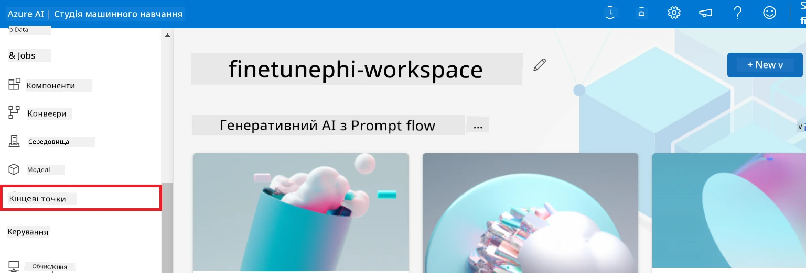

2. Виберіть кінцеву точку, яку ви створили.

    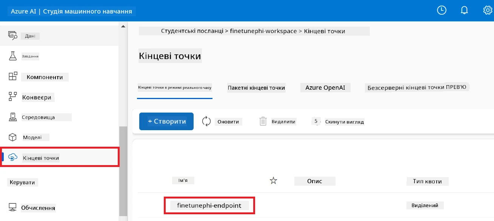

3. На цій сторінці ви можете керувати кінцевими точками, створеними під час процесу розгортання.

## Сценарій 3: Інтеграція з Prompt flow та спілкування з вашим кастомним моделлю

### Інтеграція кастомної моделі Phi-3 з Prompt flow

Після успішного розгортання вашої тонко налаштованої моделі, ви тепер можете інтегрувати її з Prompt flow для використання моделі в реальному часі, що дозволяє виконувати різноманітні інтерактивні завдання з вашим кастомним моделлю Phi-3.

#### Встановлення api ключа та URI кінцевої точки тонко налаштованої моделі Phi-3

1. Перейдіть до робочого простору Azure Machine Learning, який ви створили.
1. Виберіть **Endpoints** на панелі зліва.
1. Виберіть кінцеву точку, яку ви створили.
1. Виберіть **Consume** у меню навігації.
1. Скопіюйте та вставте вашу **REST endpoint** у файл *config.py*, замінивши `AZURE_ML_ENDPOINT = "your_fine_tuned_model_endpoint_uri"` на вашу **REST endpoint**.
1. Скопіюйте та вставте ваш **Primary key** у файл *config.py*, замінивши `AZURE_ML_API_KEY = "your_fine_tuned_model_api_key"` на ваш **Primary key**.

    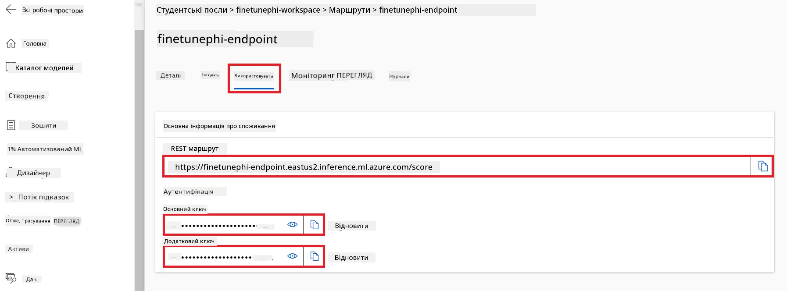

#### Додайте код у файл *flow.dag.yml*

1. Відкрийте файл *flow.dag.yml* у Visual Studio Code.

1. Додайте наступний код у файл *flow.dag.yml*.

    ```yml
    inputs:
      input_data:
        type: string
        default: "Who founded Microsoft?"

    outputs:
      answer:
        type: string
        reference: ${integrate_with_promptflow.output}

    nodes:
    - name: integrate_with_promptflow
      type: python
      source:
        type: code
        path: integrate_with_promptflow.py
      inputs:
        input_data: ${inputs.input_data}
    ```

#### Додайте код у файл *integrate_with_promptflow.py*

1. Відкрийте файл *integrate_with_promptflow.py* у Visual Studio Code.

1. Додайте наступний код у файл *integrate_with_promptflow.py*.

    ```python
    import logging
    import requests
    from promptflow.core import tool
    import asyncio
    import platform
    from config import (
        AZURE_ML_ENDPOINT,
        AZURE_ML_API_KEY
    )

    # Налаштування логування
    logging.basicConfig(
        format="%(asctime)s - %(levelname)s - %(name)s - %(message)s",
        datefmt="%Y-%m-%d %H:%M:%S",
        level=logging.DEBUG
    )
    logger = logging.getLogger(__name__)

    def query_azml_endpoint(input_data: list, endpoint_url: str, api_key: str) -> str:
        """
        Send a request to the Azure ML endpoint with the given input data.
        """
        headers = {
            "Content-Type": "application/json",
            "Authorization": f"Bearer {api_key}"
        }
        data = {
            "input_data": [input_data],
            "params": {
                "temperature": 0.7,
                "max_new_tokens": 128,
                "do_sample": True,
                "return_full_text": True
            }
        }
        try:
            response = requests.post(endpoint_url, json=data, headers=headers)
            response.raise_for_status()
            result = response.json()[0]
            logger.info("Successfully received response from Azure ML Endpoint.")
            return result
        except requests.exceptions.RequestException as e:
            logger.error(f"Error querying Azure ML Endpoint: {e}")
            raise

    def setup_asyncio_policy():
        """
        Setup asyncio event loop policy for Windows.
        """
        if platform.system() == 'Windows':
            asyncio.set_event_loop_policy(asyncio.WindowsSelectorEventLoopPolicy())
            logger.info("Set Windows asyncio event loop policy.")

    @tool
    def my_python_tool(input_data: str) -> str:
        """
        Tool function to process input data and query the Azure ML endpoint.
        """
        setup_asyncio_policy()
        return query_azml_endpoint(input_data, AZURE_ML_ENDPOINT, AZURE_ML_API_KEY)

    ```

### Спілкування з вашим кастомним моделлю

1. Введіть наступну команду, щоб запустити скрипт *deploy_model.py* і розпочати процес розгортання в Azure Machine Learning.

    ```python
    pf flow serve --source ./ --port 8080 --host localhost
    ```

1. Ось приклад результатів: тепер ви можете спілкуватися з вашим кастомним моделлю Phi-3. Рекомендується ставити запитання на основі даних, використаних для тонкої настройки.

    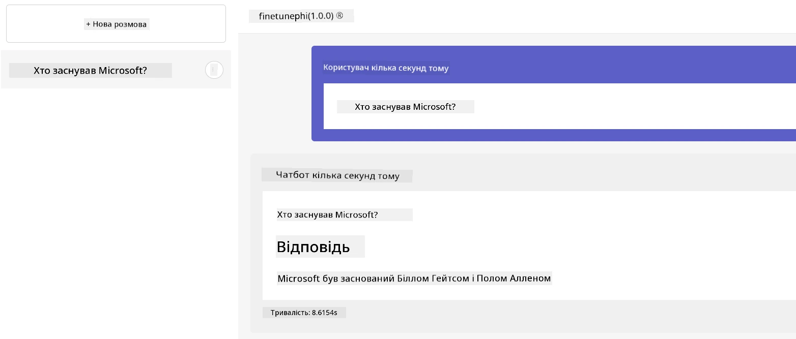

---

<!-- CO-OP TRANSLATOR DISCLAIMER START -->
**Відмова від відповідальності**:
Цей документ було перекладено за допомогою сервісу автоматичного перекладу [Co-op Translator](https://github.com/Azure/co-op-translator). Хоча ми намагаємося забезпечити точність, просимо враховувати, що автоматичні переклади можуть містити помилки або неточності. Оригінальний документ рідною мовою слід вважати авторитетним джерелом. Для отримання критично важливої інформації рекомендується звертатися до професійного людського перекладу. Ми не несемо відповідальності за будь-які непорозуміння або неправильні тлумачення, що виникли внаслідок використання цього перекладу.
<!-- CO-OP TRANSLATOR DISCLAIMER END -->