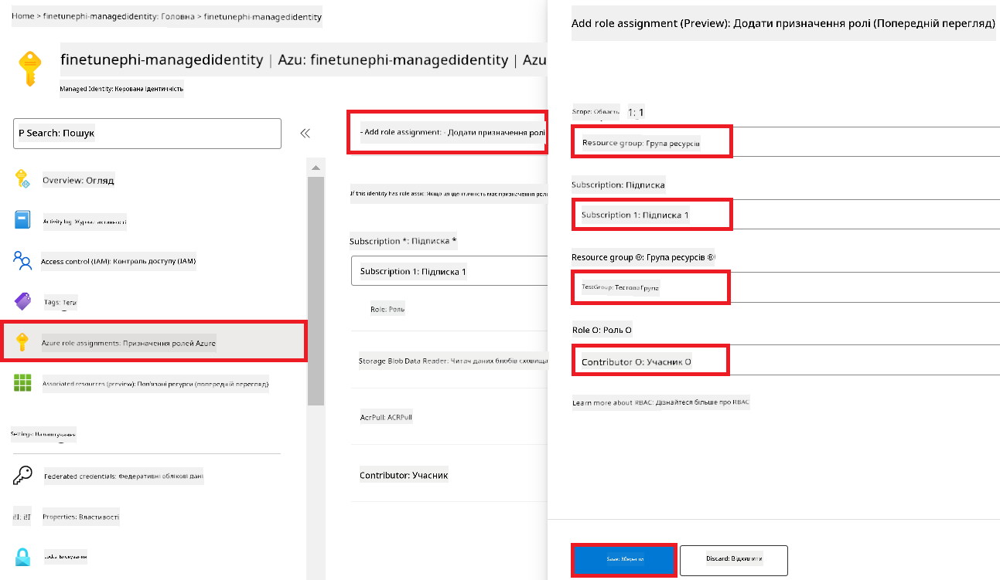
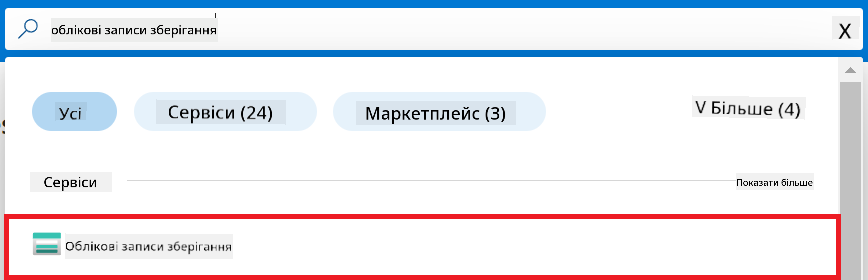
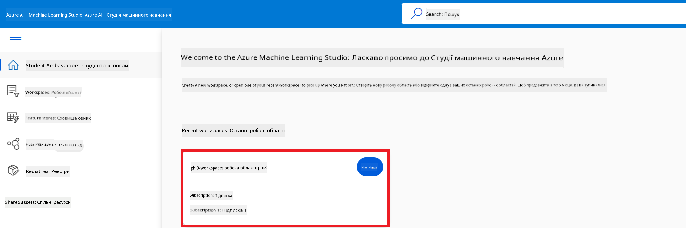
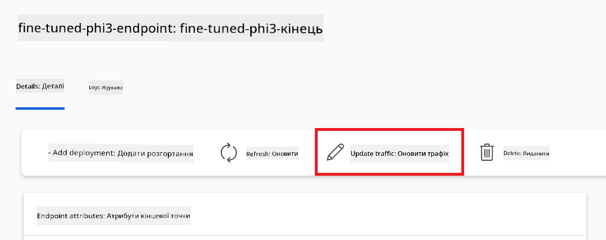
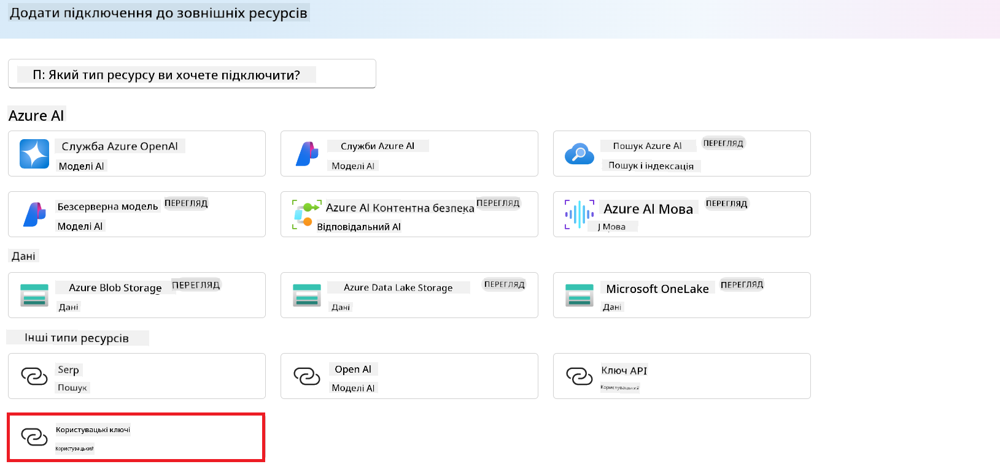
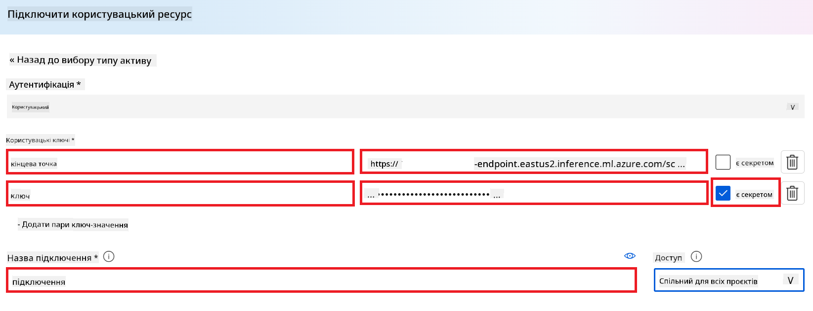
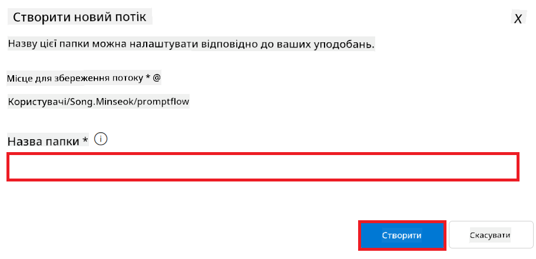

<!--
CO_OP_TRANSLATOR_METADATA:
{
  "original_hash": "0df910a227098303cc392b6ad204c271",
  "translation_date": "2026-01-06T05:24:43+00:00",
  "source_file": "md/02.Application/01.TextAndChat/Phi3/E2E_Phi-3-FineTuning_PromptFlow_Integration_AIFoundry.md",
  "language_code": "uk"
}
-->
# Налаштування та інтеграція кастомних моделей Phi-3 з Prompt flow в Azure AI Foundry

Цей приклад end-to-end (E2E) базується на посібнику "[Fine-Tune and Integrate Custom Phi-3 Models with Prompt Flow in Azure AI Foundry](https://techcommunity.microsoft.com/t5/educator-developer-blog/fine-tune-and-integrate-custom-phi-3-models-with-prompt-flow-in/ba-p/4191726?WT.mc_id=aiml-137032-kinfeylo)" із Microsoft Tech Community. Він представляє процеси тонкого налаштування, розгортання та інтеграції кастомних моделей Phi-3 з Prompt flow в Azure AI Foundry.
На відміну від E2E прикладу "[Fine-Tune and Integrate Custom Phi-3 Models with Prompt Flow](./E2E_Phi-3-FineTuning_PromptFlow_Integration.md)", який передбачав запуск коду локально, цей посібник повністю зосереджений на тонкому налаштуванні та інтеграції вашої моделі в середовищі Azure AI / ML Studio.

## Огляд

У цьому прикладі E2E ви навчитеся тонко налаштовувати модель Phi-3 та інтегрувати її з Prompt flow в Azure AI Foundry. Використовуючи Azure AI / ML Studio, ви створите робочий процес для розгортання та використання кастомних AI-моделей. Цей приклад E2E поділений на три сценарії:

**Сценарій 1: Налаштування ресурсів Azure та підготовка до тонкого налаштування**

**Сценарій 2: Тонке налаштування моделі Phi-3 та розгортання в Azure Machine Learning Studio**

**Сценарій 3: Інтеграція з Prompt flow та чат з вашою кастомною моделлю в Azure AI Foundry**

Ось огляд цього прикладу E2E.


### Зміст

1. **[Сценарій 1: Налаштування ресурсів Azure та підготовка до тонкого налаштування](../../../../../../md/02.Application/01.TextAndChat/Phi3)**
    - [Створення робочої області Azure Machine Learning](../../../../../../md/02.Application/01.TextAndChat/Phi3)
    - [Запит квот на GPU у підписці Azure](../../../../../../md/02.Application/01.TextAndChat/Phi3)
    - [Додавання призначення ролі](../../../../../../md/02.Application/01.TextAndChat/Phi3)
    - [Налаштування проєкту](../../../../../../md/02.Application/01.TextAndChat/Phi3)
    - [Підготовка набору даних для тонкого налаштування](../../../../../../md/02.Application/01.TextAndChat/Phi3)

1. **[Сценарій 2: Тонке налаштування моделі Phi-3 та розгортання в Azure Machine Learning Studio](../../../../../../md/02.Application/01.TextAndChat/Phi3)**
    - [Тонке налаштування моделі Phi-3](../../../../../../md/02.Application/01.TextAndChat/Phi3)
    - [Розгортання тонко налаштованої моделі Phi-3](../../../../../../md/02.Application/01.TextAndChat/Phi3)

1. **[Сценарій 3: Інтеграція з Prompt flow та чат з вашою кастомною моделлю в Azure AI Foundry](../../../../../../md/02.Application/01.TextAndChat/Phi3)**
    - [Інтеграція кастомної моделі Phi-3 з Prompt flow](../../../../../../md/02.Application/01.TextAndChat/Phi3)
    - [Спілкування з вашою кастомною моделлю Phi-3](../../../../../../md/02.Application/01.TextAndChat/Phi3)

## Сценарій 1: Налаштування ресурсів Azure та підготовка до тонкого налаштування

### Створення робочої області Azure Machine Learning

1. Введіть у **рядку пошуку** вгорі порталу *azure machine learning* та виберіть **Azure Machine Learning** зі списку варіантів.

    

2. Оберіть **+ Create** у меню навігації.

3. Оберіть **New workspace** у меню навігації.

    

4. Виконайте наступні дії:

    - Виберіть вашу підписку Azure (**Subscription**).
    - Виберіть **Resource group**, яку хочете використати (створіть нову, якщо потрібно).
    - Введіть **Workspace Name**. Воно повинно бути унікальним.
    - Виберіть регіон (**Region**), який бажаєте використовувати.
    - Виберіть обліковий запис сховища (**Storage account**) (створіть новий, якщо потрібно).
    - Виберіть сховище ключів (**Key vault**) (створіть нове, якщо потрібно).
    - Виберіть **Application insights** (створіть новий, якщо потрібно).
    - Виберіть реєстр контейнерів (**Container registry**) (створіть новий, якщо потрібно).

    

5. Оберіть **Review + Create**.

6. Оберіть **Create**.

### Запит квот на GPU у підписці Azure

У цьому посібнику ви навчитеся тонко налаштовувати та розгортати модель Phi-3, використовуючи GPU. Для тонкого налаштування використовується GPU *Standard_NC24ads_A100_v4*, що вимагає запиту квоти. Для розгортання використовується GPU *Standard_NC6s_v3*, що також вимагає запиту квоти.

> [!NOTE]
>
> Виділення GPU доступне лише для підписок типу Pay-As-You-Go; підписки з пільгами наразі не підтримуються.
>

1. Відвідайте [Azure ML Studio](https://ml.azure.com/home?wt.mc_id=studentamb_279723).

1. Виконайте дії, щоб запросити квоту для *Standard NCADSA100v4 Family*:

    - Оберіть **Quota** у вкладці зліва.
    - Оберіть сімейство віртуальних машин (*Virtual machine family*), наприклад **Standard NCADSA100v4 Family Cluster Dedicated vCPUs**, яке включає GPU *Standard_NC24ads_A100_v4*.
    - Оберіть **Request quota** у меню навігації.

        

    - На сторінці Request quota введіть бажаний **New cores limit**, наприклад, 24.
    - Натисніть **Submit** для запиту квоти.

1. Аналогічно, виконайте дії для запиту квоти *Standard NCSv3 Family*:

    - Оберіть **Quota** зліва.
    - Оберіть сімейство віртуальних машин, наприклад, **Standard NCSv3 Family Cluster Dedicated vCPUs**, яке містить GPU *Standard_NC6s_v3*.
    - Оберіть **Request quota**.
    - Введіть бажаний **New cores limit**, наприклад, 24.
    - Натисніть **Submit** для запиту квоти.

### Додавання призначення ролі

Щоб тонко налаштовувати і розгортати моделі, потрібно створити User Assigned Managed Identity (UAI) та призначити їй відповідні дозволи. Ця UAI буде використовуватися для аутентифікації під час розгортання.

#### Створення User Assigned Managed Identity (UAI)

1. Введіть у **рядку пошуку** вгорі порталу *managed identities* і виберіть **Managed Identities** з варіантів.

    

1. Оберіть **+ Create**.

    

1. Виконайте наступні кроки:

    - Оберіть вашу підписку Azure (**Subscription**).
    - Оберіть **Resource group** для використання (створіть нову, якщо потрібно).
    - Оберіть регіон (**Region**).
    - Введіть унікальне ім'я (**Name**).

    

1. Оберіть **Review + create**.

1. Оберіть **+ Create**.

#### Призначення ролі Contributor для Managed Identity

1. Перейдіть до ресурсу Managed Identity, який створили.

1. Оберіть **Azure role assignments** у вкладці зліва.

1. Оберіть **+Add role assignment** у меню навігації.

1. На сторінці додавання призначення ролі виконайте наступне:
    - Виберіть область (**Scope**) – **Resource group**.
    - Виберіть підписку Azure.
    - Оберіть ресурсну групу.
    - Виберіть роль (**Role**) – **Contributor**.

    

2. Оберіть **Save**.

#### Призначення ролі Storage Blob Data Reader для Managed Identity

1. Введіть у **рядку пошуку** вгорі порталу *storage accounts* і оберіть **Storage accounts** із варіантів.

    

1. Оберіть обліковий запис зберігання, який пов’язаний із робочою областю Azure Machine Learning, наприклад *finetunephistorage*.

1. Виконайте дії для переходу на сторінку додавання призначення ролі:

    - Перейдіть до облікового запису Azure Storage, який створили.
    - Оберіть **Access Control (IAM)** з лівого меню.
    - Оберіть **+ Add** у меню навігації.
    - Оберіть **Add role assignment** у меню навігації.

    

1. На сторінці додавання призначення ролі виконайте:

    - У рядку пошуку ролей введіть *Storage Blob Data Reader* і виберіть цю роль.
    - Натисніть **Next**.
    - У вікні вибору членів оберіть **Assign access to** – **Managed identity**.
    - Натисніть **+ Select members**.
    - Виберіть вашу підписку Azure.
    - Оберіть Managed identity для управління (**Manage Identity**).
    - Оберіть Managed Identity, яку створили, наприклад *finetunephi-managedidentity*.
    - Натисніть **Select**.

    

1. Оберіть **Review + assign**.

#### Призначення ролі AcrPull для Managed Identity

1. Введіть у **рядку пошуку** вгорі порталу *container registries* і оберіть **Container registries** із варіантів.

    

1. Оберіть контейнерний реєстр, пов’язаний із робочою областю Azure Machine Learning, наприклад *finetunephicontainerregistry*.

1. Виконайте дії для переходу на сторінку додавання ролі:

    - Оберіть у лівому меню **Access Control (IAM)**.
    - Оберіть **+ Add** у меню навігації.
    - Оберіть **Add role assignment**.

1. На сторінці додавання ролі виконайте:

    - У рядку пошуку ролей введіть *AcrPull* і виберіть цю роль.
    - Натисніть **Next**.
    - Виберіть **Assign access to** – **Managed identity**.
    - Натисніть **+ Select members**.
    - Оберіть вашу підписку Azure.
    - Оберіть Managed identity для управління.
    - Оберіть Managed Identity, яку створили (наприклад, *finetunephi-managedidentity*).
    - Натисніть **Select**.
    - Оберіть **Review + assign**.

### Налаштування проєкту

Для завантаження наборів даних, потрібних для тонкого налаштування, налаштуйте локальне середовище.

В цьому завданні ви:

- Створите папку для роботи.
- Створите віртуальне середовище.
- Встановите необхідні пакети.
- Створите файл *download_dataset.py* для завантаження набору даних.

#### Створення папки для роботи

1. Відкрийте вікно терміналу та виконайте команду для створення папки з ім'ям *finetune-phi* у стандартному шляху.

    ```console
    mkdir finetune-phi
    ```

2. Введіть наступну команду у вашому терміналі, щоб перейти до папки *finetune-phi*, яку ви створили.

    ```console
    cd finetune-phi
    ```

#### Створіть віртуальне оточення

1. Введіть наступну команду у вашому терміналі, щоб створити віртуальне оточення з назвою *.venv*.

    ```console
    python -m venv .venv
    ```

2. Введіть наступну команду у вашому терміналі, щоб активувати віртуальне оточення.

    ```console
    .venv\Scripts\activate.bat
    ```

> [!NOTE]
> Якщо все спрацювало, ви повинні побачити *(.venv)* перед командним рядком.

#### Встановіть необхідні пакети

1. Введіть наступні команди у вашому терміналі, щоб встановити необхідні пакети.

    ```console
    pip install datasets==2.19.1
    ```

#### Створіть `donload_dataset.py`

> [!NOTE]
> Повна структура папок:
>
> ```text
> └── YourUserName
> .    └── finetune-phi
> .        └── download_dataset.py
> ```

1. Відкрийте **Visual Studio Code**.

1. Виберіть **File** у меню.

1. Виберіть **Open Folder**.

1. Виберіть папку *finetune-phi*, яку ви створили, розташовану за адресою *C:\Users\yourUserName\finetune-phi*.

    

1. У лівій панелі Visual Studio Code клацніть правою кнопкою миші та виберіть **New File**, щоб створити новий файл з назвою *download_dataset.py*.

    

### Підготуйте датасет для донавчання

У цьому завданні ви запустите файл *download_dataset.py*, щоб завантажити набори даних *ultrachat_200k* у ваше локальне середовище. Потім ви використаєте ці набори даних для донавчання моделі Phi-3 у Azure Machine Learning.

У цьому завданні ви:

- Додасте код у файл *download_dataset.py* для завантаження наборів даних.
- Запустите файл *download_dataset.py*, щоб завантажити набори даних у ваше локальне середовище.

#### Завантажте ваш датасет за допомогою *download_dataset.py*

1. Відкрийте файл *download_dataset.py* у Visual Studio Code.

1. Додайте наступний код у файл *download_dataset.py*.

    ```python
    import json
    import os
    from datasets import load_dataset

    def load_and_split_dataset(dataset_name, config_name, split_ratio):
        """
        Load and split a dataset.
        """
        # Завантажити набір даних із вказаною назвою, конфігурацією та співвідношенням розбиття
        dataset = load_dataset(dataset_name, config_name, split=split_ratio)
        print(f"Original dataset size: {len(dataset)}")
        
        # Розбити набір даних на тренувальний та тестовий набори (80% тренування, 20% тест)
        split_dataset = dataset.train_test_split(test_size=0.2)
        print(f"Train dataset size: {len(split_dataset['train'])}")
        print(f"Test dataset size: {len(split_dataset['test'])}")
        
        return split_dataset

    def save_dataset_to_jsonl(dataset, filepath):
        """
        Save a dataset to a JSONL file.
        """
        # Створити каталог, якщо він не існує
        os.makedirs(os.path.dirname(filepath), exist_ok=True)
        
        # Відкрити файл у режимі запису
        with open(filepath, 'w', encoding='utf-8') as f:
            # Ітеруватися по кожному запису у наборі даних
            for record in dataset:
                # Записати запис у форматі JSON та записати його у файл
                json.dump(record, f)
                # Записати символ нового рядка для розділення записів
                f.write('\n')
        
        print(f"Dataset saved to {filepath}")

    def main():
        """
        Main function to load, split, and save the dataset.
        """
        # Завантажити та розбити набір даних ULTRACHAT_200k зі специфічною конфігурацією та співвідношенням розбиття
        dataset = load_and_split_dataset("HuggingFaceH4/ultrachat_200k", 'default', 'train_sft[:1%]')
        
        # Витягти тренувальний та тестовий набори з розбиття
        train_dataset = dataset['train']
        test_dataset = dataset['test']

        # Зберегти тренувальний набір у файл формату JSONL
        save_dataset_to_jsonl(train_dataset, "data/train_data.jsonl")
        
        # Зберегти тестовий набір у окремий файл формату JSONL
        save_dataset_to_jsonl(test_dataset, "data/test_data.jsonl")

    if __name__ == "__main__":
        main()

    ```

1. Введіть наступну команду у вашому терміналі, щоб запустити скрипт і завантажити датасет у ваше локальне середовище.

    ```console
    python download_dataset.py
    ```

1. Перевірте, чи були набори даних успішно збережені у вашій локальній директорії *finetune-phi/data*.

> [!NOTE]
>
> #### Примітка про розмір датасету та час донавчання
>
> У цьому посібнику ви використовуєте лише 1% датасету (`split='train[:1%]'`). Це суттєво зменшує обсяг даних, прискорюючи як завантаження, так і процес донавчання. Ви можете коригувати відсоток, щоб знайти оптимальний баланс між часом навчання та продуктивністю моделі. Використання меншого піднабору датасету зменшує час, необхідний для донавчання, роблячи процес більш керованим для навчального посібника.

## Сценарій 2: Донавчання моделі Phi-3 і розгортання в Azure Machine Learning Studio

### Донавчання моделі Phi-3

У цьому завданні ви донатимете модель Phi-3 у Azure Machine Learning Studio.

У цьому завданні ви:

- Створите комп’ютерний кластер для донавчання.
- Донатимете модель Phi-3 у Azure Machine Learning Studio.

#### Створіть комп’ютерний кластер для донавчання

1. Відвідайте [Azure ML Studio](https://ml.azure.com/home?wt.mc_id=studentamb_279723).

1. Виберіть **Compute** у лівому меню.

1. Виберіть **Compute clusters** у навігаційному меню.

1. Виберіть **+ New**.

    

1. Виконайте наступні дії:

    - Виберіть регіон (**Region**), який ви хочете використовувати.
    - Виберіть рівень віртуальної машини (**Virtual machine tier**) як **Dedicated**.
    - Виберіть тип віртуальної машини (**Virtual machine type**) як **GPU**.
    - Для фільтру розміру віртуальної машини (**Virtual machine size**) виберіть **Select from all options**.
    - Виберіть розмір віртуальної машини (**Virtual machine size**) як **Standard_NC24ads_A100_v4**.

    

1. Виберіть **Next**.

1. Виконайте наступні дії:

    - Введіть назву кластера (**Compute name**). Вона має бути унікальною.
    - Виберіть мінімальну кількість вузлів (**Minimum number of nodes**) як **0**.
    - Виберіть максимальну кількість вузлів (**Maximum number of nodes**) як **1**.
    - Встановіть час бездіяльності перед зменшенням масштабування (**Idle seconds before scale down**) на **120**.

    

1. Виберіть **Create**.

#### Донавчання моделі Phi-3

1. Відвідайте [Azure ML Studio](https://ml.azure.com/home?wt.mc_id=studentamb_279723).

1. Виберіть створений вами робочий простір Azure Machine Learning.

    

1. Виконайте наступні дії:

    - Виберіть **Model catalog** у лівому меню.
    - Введіть *phi-3-mini-4k* у рядок пошуку і виберіть **Phi-3-mini-4k-instruct** зі списку.

    

1. Виберіть **Fine-tune** у навігаційному меню.

    

1. Виконайте наступні дії:

    - Виберіть **Select task type** як **Chat completion**.
    - Виберіть **+ Select data** для завантаження **Traning data**.
    - Виберіть тип завантаження даних для перевірки як **Provide different validation data**.
    - Виберіть **+ Select data** для завантаження **Validation data**.

    

> [!TIP]
>
> Ви можете вибрати **Advanced settings**, щоб налаштувати параметри, такі як **learning_rate** та **lr_scheduler_type**, щоб оптимізувати процес донавчання відповідно до ваших потреб.

1. Виберіть **Finish**.

1. У цьому завданні ви успішно донатили модель Phi-3 за допомогою Azure Machine Learning. Зверніть увагу, що процес донавчання може зайняти значний час. Після запуску завдання донавчання, потрібно дочекатися його завершення. Ви можете спостерігати статус завдання у вкладці Jobs у лівому меню вашого Azure Machine Learning Workspace. У наступній серії ви розгорнете донавчену модель і інтегруєте її з Prompt flow.

    

### Розгорніть донавчену модель Phi-3

Щоб інтегрувати донавчену модель Phi-3 з Prompt flow, потрібно розгорнути модель, щоб мати доступ до неї для реального часу. Цей процес включає реєстрацію моделі, створення онлайн-точки доступу та розгортання моделі.

У цьому завданні ви:

- Зареєструєте донавчену модель у робочому просторі Azure Machine Learning.
- Створите онлайн-точку доступу.
- Розгорнете зареєстровану донавчену модель Phi-3.

#### Зареєструйте донавчену модель

1. Відвідайте [Azure ML Studio](https://ml.azure.com/home?wt.mc_id=studentamb_279723).

1. Виберіть створений вами робочий простір Azure Machine Learning.

    

1. Виберіть **Models** у лівому меню.
1. Виберіть **+ Register**.
1. Виберіть **From a job output**.

    

1. Виберіть створене вами завдання.

    

1. Виберіть **Next**.

1. Виберіть **Model type** як **MLflow**.

1. Переконайтеся, що вибрано **Job output**; це має бути обрано автоматично.

    

2. Виберіть **Next**.

3. Виберіть **Register**.

    

4. Ви можете переглянути зареєстровану модель у меню **Models** у лівому меню.

    

#### Розгорніть донавчену модель

1. Перейдіть до створеного вами робочого простору Azure Machine Learning.

1. Виберіть **Endpoints** у лівому меню.

1. Виберіть **Real-time endpoints** у навігаційному меню.

    

1. Виберіть **Create**.

1. Виберіть зареєстровану модель, яку ви створили.

    

1. Виберіть **Select**.

1. Виконайте наступні дії:

    - Виберіть віртуальну машину (**Virtual machine**) як *Standard_NC6s_v3*.
    - Виберіть кількість екземплярів (**Instance count**), яку хочете використовувати, наприклад, *1*.
    - Виберіть **Endpoint** як **New**, щоб створити точку доступу.
    - Введіть унікальну назву точки доступу (**Endpoint name**).
    - Введіть унікальну назву розгортання (**Deployment name**).

    

1. Виберіть **Deploy**.

> [!WARNING]
> Щоб уникнути додаткових витрат на ваш рахунок, обов’язково видаліть створену точку доступу в робочому просторі Azure Machine Learning.
>

#### Перевірте статус розгортання у робочому просторі Azure Machine Learning

1. Перейдіть до створеного вами робочого простору Azure Machine Learning.

1. Виберіть **Endpoints** у лівому меню.

1. Виберіть створену вами точку доступу.

    

1. На цій сторінці ви можете керувати точками доступу під час процесу розгортання.

> [!NOTE]
> Після завершення розгортання переконайтеся, що **Live traffic** встановлено на **100%**. Якщо ні, виберіть **Update traffic**, щоб відрегулювати налаштування трафіку. Зверніть увагу, що ви не зможете тестувати модель, якщо трафік встановлено на 0%.
>
> 
>

## Сценарій 3: Інтеграція з Prompt flow та спілкування з вашою кастомною моделлю в Azure AI Foundry

### Інтегруйте кастомну модель Phi-3 з Prompt flow

Після успішного розгортання донавченої моделі ви можете інтегрувати її з Prompt Flow для використання у реальних програмах, що дозволяє виконувати різноманітні інтерактивні завдання з вашою кастомною моделлю Phi-3.

У цьому завданні ви:

- Створите Azure AI Foundry Hub.
- Створите Azure AI Foundry Project.
- Створите Prompt flow.
- Додасте кастомне підключення для донавченої моделі Phi-3.
- Налаштуєте Prompt flow для спілкування з вашою кастомною моделлю Phi-3.

> [!NOTE]
> Ви також можете інтегруватися з Promptflow, використовуючи Azure ML Studio. Той самий процес інтеграції можна застосувати до Azure ML Studio.

#### Створіть Azure AI Foundry Hub

Потрібно створити Hub перед створенням Project. Hub виконує роль групи ресурсів, дозволяючи організовувати й управляти кількома проектами в Azure AI Foundry.

1. Відвідайте [Azure AI Foundry](https://ai.azure.com/?WT.mc_id=aiml-137032-kinfeylo).

1. Виберіть **All hubs** у лівому меню.

1. Виберіть **+ New hub** у навігаційному меню.
    

1. Виконайте наступні завдання:

    - Введіть **Назву хабу**. Вона має бути унікальною.
    - Виберіть вашу підписку Azure (**Subscription**).
    - Виберіть **Групу ресурсів** для використання (створіть нову за потреби).
    - Виберіть **Локацію** для використання.
    - Виберіть **Підключення до Azure AI Services** для використання (створіть нове за потреби).
    - Виберіть **Підключення до Azure AI Search** як **Пропустити підключення**.

    

1. Виберіть **Далі**.

#### Створення проекту в Azure AI Foundry

1. У створеному хабі виберіть **Всі проекти** у вкладці зліва.

1. Виберіть **+ Новий проект** у навігаційному меню.

    

1. Введіть **Назву проекту**. Вона має бути унікальною.

    

1. Виберіть **Створити проект**.

#### Додавання власного підключення для донавченої моделі Phi-3

Щоб інтегрувати вашу власну модель Phi-3 з Prompt flow, потрібно зберегти кінцеву точку (endpoint) моделі та ключ у власному підключенні. Це налаштування забезпечує доступ до вашої власної моделі Phi-3 у Prompt flow.

#### Встановлення api key та endpoint uri для донавченої моделі Phi-3

1. Відвідайте [Azure ML Studio](https://ml.azure.com/home?WT.mc_id=aiml-137032-kinfeylo).

1. Перейдіть до простору робочих ресурсів Azure Machine learning, який ви створили.

1. Оберіть **Endpoints** у вкладці зліва.

    

1. Виберіть кінцеву точку, яку ви створили.

    

1. Виберіть **Consume** у навігаційному меню.

1. Скопіюйте ваш **REST endpoint** та **Первинний ключ**.

    

#### Додавання власного підключення

1. Відвідайте [Azure AI Foundry](https://ai.azure.com/?WT.mc_id=aiml-137032-kinfeylo).

1. Перейдіть до проекту Azure AI Foundry, який ви створили.

1. У створеному проекті виберіть **Налаштування** у вкладці зліва.

1. Виберіть **+ Нове підключення**.

    

1. Оберіть **Власні ключі** у навігаційному меню.

    

1. Виконайте наступні завдання:

    - Виберіть **+ Додати пару ключ-значення**.
    - В полі назви ключа введіть **endpoint** і вставте endpoint, який скопіювали з Azure ML Studio, у поле значення.
    - Знову виберіть **+ Додати пару ключ-значення**.
    - В полі назви ключа введіть **key** і вставте ключ, який скопіювали з Azure ML Studio, у поле значення.
    - Після додавання ключів виберіть опцію **is secret**, щоб запобігти відображенню ключа.

    

1. Виберіть **Додати підключення**.

#### Створення Prompt flow

Ви додали власне підключення в Azure AI Foundry. Тепер створимо Prompt flow за наступними кроками. Після цього ви підключите цей Prompt flow до власного підключення, щоб мати змогу використовувати донавчену модель у Prompt flow.

1. Перейдіть до проекту Azure AI Foundry, який ви створили.

1. Виберіть **Prompt flow** у вкладці зліва.

1. Виберіть **+ Створити** у навігаційному меню.

    

1. Виберіть **Chat flow** у навігаційному меню.

    

1. Введіть **Назву папки** для використання.

    

2. Виберіть **Створити**.

#### Налаштування Prompt flow для спілкування з власною моделлю Phi-3

Вам потрібно інтегрувати донавчену модель Phi-3 до Prompt flow. Однак поточний Prompt flow не призначений для цього, тому потрібно перепроектувати Prompt flow для підтримки інтеграції власної моделі.

1. У Prompt flow виконайте наступні дії для перебудови існуючого потоку:

    - Виберіть **Режим сирого файлу (Raw file mode)**.
    - Видаліть увесь існуючий код у файлі *flow.dag.yml*.
    - Додайте наступний код у файл *flow.dag.yml*.

        ```yml
        inputs:
          input_data:
            type: string
            default: "Who founded Microsoft?"

        outputs:
          answer:
            type: string
            reference: ${integrate_with_promptflow.output}

        nodes:
        - name: integrate_with_promptflow
          type: python
          source:
            type: code
            path: integrate_with_promptflow.py
          inputs:
            input_data: ${inputs.input_data}
        ```

    - Виберіть **Зберегти**.

    

1. Додайте наступний код до файлу *integrate_with_promptflow.py*, щоб використовувати власну модель Phi-3 у Prompt flow.

    ```python
    import logging
    import requests
    from promptflow import tool
    from promptflow.connections import CustomConnection

    # Налаштування ведення журналу
    logging.basicConfig(
        format="%(asctime)s - %(levelname)s - %(name)s - %(message)s",
        datefmt="%Y-%m-%d %H:%M:%S",
        level=logging.DEBUG
    )
    logger = logging.getLogger(__name__)

    def query_phi3_model(input_data: str, connection: CustomConnection) -> str:
        """
        Send a request to the Phi-3 model endpoint with the given input data using Custom Connection.
        """

        # "connection" — це назва Користувацького З'єднання, "endpoint", "key" — ключі у Користувацькому З'єднанні
        endpoint_url = connection.endpoint
        api_key = connection.key

        headers = {
            "Content-Type": "application/json",
            "Authorization": f"Bearer {api_key}"
        }
        data = {
            "input_data": {
                "input_string": [
                    {"role": "user", "content": input_data}
                ],
                "parameters": {
                    "temperature": 0.7,
                    "max_new_tokens": 128
                }
            }
        }
        try:
            response = requests.post(endpoint_url, json=data, headers=headers)
            response.raise_for_status()
            
            # Записати повну відповідь у форматі JSON
            logger.debug(f"Full JSON response: {response.json()}")

            result = response.json()["output"]
            logger.info("Successfully received response from Azure ML Endpoint.")
            return result
        except requests.exceptions.RequestException as e:
            logger.error(f"Error querying Azure ML Endpoint: {e}")
            raise

    @tool
    def my_python_tool(input_data: str, connection: CustomConnection) -> str:
        """
        Tool function to process input data and query the Phi-3 model.
        """
        return query_phi3_model(input_data, connection)

    ```

    

> [!NOTE]
> Для отримання більш детальної інформації щодо використання Prompt flow у Azure AI Foundry зверніться до [Prompt flow у Azure AI Foundry](https://learn.microsoft.com/azure/ai-studio/how-to/prompt-flow).

1. Виберіть **Chat input**, **Chat output** для увімкнення чату з вашою моделлю.

    

1. Тепер ви готові спілкуватися з вашою власною моделлю Phi-3. У наступній вправі ви навчитеся запускати Prompt flow і використовувати його для спілкування з донавченою моделлю Phi-3.

> [!NOTE]
>
> Перебудований потік має виглядати як на зображенні нижче:
>
> 
>

### Спілкування з власною моделлю Phi-3

Тепер, коли ви донавчили та інтегрували власну модель Phi-3 з Prompt flow, ви готові розпочати з нею взаємодію. Ця вправа проведе вас кроками налаштування та запуску чату з вашою моделлю через Prompt flow. Виконуючи ці кроки, ви зможете повною мірою використовувати можливості вашої донавченої моделі Phi-3 для різних завдань і діалогів.

- Спілкуйтеся з власною моделлю Phi-3 за допомогою Prompt flow.

#### Запуск Prompt flow

1. Виберіть **Почати сесії обчислень (Start compute sessions)**, щоб запустити Prompt flow.

    

1. Виберіть **Підтвердити та розпарсити вхідні дані (Validate and parse input)** для оновлення параметрів.

    

1. Виберіть **Значення** для **connection** зі створеного вами власного підключення. Наприклад, *connection*.

    

#### Спілкування з власною моделлю

1. Виберіть **Chat**.

    

1. Ось приклад результатів: тепер ви можете спілкуватися з власною моделлю Phi-3. Рекомендується ставити питання на основі даних, використаних для донавчання.

    

---

<!-- CO-OP TRANSLATOR DISCLAIMER START -->
**Відмова від відповідальності**:
Цей документ було перекладено із використанням сервісу автоматичного перекладу [Co-op Translator](https://github.com/Azure/co-op-translator). Хоч ми й прагнемо до точності, будь ласка, враховуйте, що автоматичні переклади можуть містити помилки або неточності. Оригінальний документ рідною мовою слід вважати авторитетним джерелом. Для критично важливої інформації рекомендується звертатись до професійного людського перекладу. Ми не несемо відповідальності за будь-які непорозуміння чи неправильні тлумачення, що виникли внаслідок використання цього перекладу.
<!-- CO-OP TRANSLATOR DISCLAIMER END -->