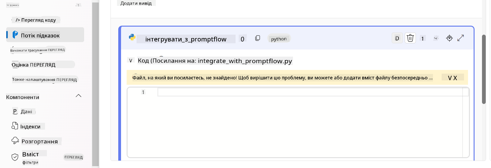

<!--
CO_OP_TRANSLATOR_METADATA:
{
  "original_hash": "ecbd9179a21edbaafaf114d47f09f3e3",
  "translation_date": "2025-07-17T02:11:00+00:00",
  "source_file": "md/02.Application/01.TextAndChat/Phi3/E2E_Phi-3-FineTuning_PromptFlow_Integration_AIFoundry.md",
  "language_code": "uk"
}
-->
# Налаштування та інтеграція кастомних моделей Phi-3 з Prompt flow в Azure AI Foundry

Цей покроковий (E2E) приклад базується на керівництві "[Fine-Tune and Integrate Custom Phi-3 Models with Prompt Flow in Azure AI Foundry](https://techcommunity.microsoft.com/t5/educator-developer-blog/fine-tune-and-integrate-custom-phi-3-models-with-prompt-flow-in/ba-p/4191726?WT.mc_id=aiml-137032-kinfeylo)" з Microsoft Tech Community. Він демонструє процеси тонкого налаштування, розгортання та інтеграції кастомних моделей Phi-3 з Prompt flow в Azure AI Foundry.  
На відміну від E2E прикладу "[Fine-Tune and Integrate Custom Phi-3 Models with Prompt Flow](./E2E_Phi-3-FineTuning_PromptFlow_Integration.md)", де код запускався локально, цей посібник повністю зосереджений на тонкому налаштуванні та інтеграції вашої моделі в Azure AI / ML Studio.

## Огляд

У цьому E2E прикладі ви навчитеся тонко налаштовувати модель Phi-3 та інтегрувати її з Prompt flow в Azure AI Foundry. Використовуючи Azure AI / ML Studio, ви створите робочий процес для розгортання та використання кастомних AI моделей. Цей E2E приклад поділено на три сценарії:

**Сценарій 1: Налаштування ресурсів Azure та підготовка до тонкого налаштування**

**Сценарій 2: Тонке налаштування моделі Phi-3 та розгортання в Azure Machine Learning Studio**

**Сценарій 3: Інтеграція з Prompt flow та спілкування з вашою кастомною моделлю в Azure AI Foundry**

Ось загальний огляд цього E2E прикладу.


### Зміст

1. **[Сценарій 1: Налаштування ресурсів Azure та підготовка до тонкого налаштування](../../../../../../md/02.Application/01.TextAndChat/Phi3)**
    - [Створення Azure Machine Learning Workspace](../../../../../../md/02.Application/01.TextAndChat/Phi3)
    - [Запит квот на GPU в підписці Azure](../../../../../../md/02.Application/01.TextAndChat/Phi3)
    - [Додавання призначення ролі](../../../../../../md/02.Application/01.TextAndChat/Phi3)
    - [Налаштування проєкту](../../../../../../md/02.Application/01.TextAndChat/Phi3)
    - [Підготовка датасету для тонкого налаштування](../../../../../../md/02.Application/01.TextAndChat/Phi3)

1. **[Сценарій 2: Тонке налаштування моделі Phi-3 та розгортання в Azure Machine Learning Studio](../../../../../../md/02.Application/01.TextAndChat/Phi3)**
    - [Тонке налаштування моделі Phi-3](../../../../../../md/02.Application/01.TextAndChat/Phi3)
    - [Розгортання тонко налаштованої моделі Phi-3](../../../../../../md/02.Application/01.TextAndChat/Phi3)

1. **[Сценарій 3: Інтеграція з Prompt flow та спілкування з вашою кастомною моделлю в Azure AI Foundry](../../../../../../md/02.Application/01.TextAndChat/Phi3)**
    - [Інтеграція кастомної моделі Phi-3 з Prompt flow](../../../../../../md/02.Application/01.TextAndChat/Phi3)
    - [Спілкування з вашою кастомною моделлю Phi-3](../../../../../../md/02.Application/01.TextAndChat/Phi3)

## Сценарій 1: Налаштування ресурсів Azure та підготовка до тонкого налаштування

### Створення Azure Machine Learning Workspace

1. Введіть *azure machine learning* у **рядок пошуку** у верхній частині порталу та оберіть **Azure Machine Learning** зі списку.

    

2. Оберіть **+ Create** у навігаційному меню.

3. Оберіть **New workspace** у навігаційному меню.

    

4. Виконайте наступні дії:

    - Оберіть вашу Azure **Subscription**.
    - Оберіть **Resource group** для використання (створіть нову, якщо потрібно).
    - Введіть **Workspace Name**. Ім’я має бути унікальним.
    - Оберіть **Region**, яку хочете використовувати.
    - Оберіть **Storage account** для використання (створіть новий, якщо потрібно).
    - Оберіть **Key vault** для використання (створіть новий, якщо потрібно).
    - Оберіть **Application insights** для використання (створіть новий, якщо потрібно).
    - Оберіть **Container registry** для використання (створіть новий, якщо потрібно).

    

5. Оберіть **Review + Create**.

6. Оберіть **Create**.

### Запит квот на GPU в підписці Azure

У цьому посібнику ви навчитеся тонко налаштовувати та розгортати модель Phi-3, використовуючи GPU. Для тонкого налаштування буде використано GPU *Standard_NC24ads_A100_v4*, для якого потрібно подати запит на квоту. Для розгортання буде використано GPU *Standard_NC6s_v3*, для якого також потрібен запит квоти.

> [!NOTE]
>
> Квоти на GPU доступні лише для підписок типу Pay-As-You-Go (стандартний тип підписки); підписки з пільгами наразі не підтримуються.
>

1. Перейдіть на [Azure ML Studio](https://ml.azure.com/home?wt.mc_id=studentamb_279723).

1. Виконайте наступні дії, щоб подати запит на квоту для *Standard NCADSA100v4 Family*:

    - Оберіть **Quota** у лівому меню.
    - Оберіть **Virtual machine family** для використання. Наприклад, оберіть **Standard NCADSA100v4 Family Cluster Dedicated vCPUs**, що включає GPU *Standard_NC24ads_A100_v4*.
    - Оберіть **Request quota** у навігаційному меню.

        

    - На сторінці Request quota введіть бажаний **New cores limit**. Наприклад, 24.
    - Натисніть **Submit**, щоб подати запит на квоту GPU.

1. Виконайте наступні дії, щоб подати запит на квоту для *Standard NCSv3 Family*:

    - Оберіть **Quota** у лівому меню.
    - Оберіть **Virtual machine family** для використання. Наприклад, оберіть **Standard NCSv3 Family Cluster Dedicated vCPUs**, що включає GPU *Standard_NC6s_v3*.
    - Оберіть **Request quota** у навігаційному меню.
    - На сторінці Request quota введіть бажаний **New cores limit**. Наприклад, 24.
    - Натисніть **Submit**, щоб подати запит на квоту GPU.

### Додавання призначення ролі

Для тонкого налаштування та розгортання моделей спочатку потрібно створити User Assigned Managed Identity (UAI) та надати їй відповідні дозволи. Ця UAI буде використовуватися для автентифікації під час розгортання.

#### Створення User Assigned Managed Identity (UAI)

1. Введіть *managed identities* у **рядок пошуку** у верхній частині порталу та оберіть **Managed Identities** зі списку.

    

1. Оберіть **+ Create**.

    

1. Виконайте наступні дії:

    - Оберіть вашу Azure **Subscription**.
    - Оберіть **Resource group** для використання (створіть нову, якщо потрібно).
    - Оберіть **Region**, яку хочете використовувати.
    - Введіть **Name**. Ім’я має бути унікальним.

    

1. Оберіть **Review + create**.

1. Оберіть **+ Create**.

#### Додавання ролі Contributor до Managed Identity

1. Перейдіть до ресурсу Managed Identity, який ви створили.

1. Оберіть **Azure role assignments** у лівому меню.

1. Оберіть **+Add role assignment** у навігаційному меню.

1. На сторінці Add role assignment виконайте наступні дії:
    - Оберіть **Scope** як **Resource group**.
    - Оберіть вашу Azure **Subscription**.
    - Оберіть **Resource group** для використання.
    - Оберіть роль **Contributor**.

    

2. Оберіть **Save**.

#### Додавання ролі Storage Blob Data Reader до Managed Identity

1. Введіть *storage accounts* у **рядок пошуку** у верхній частині порталу та оберіть **Storage accounts** зі списку.

    

1. Оберіть обліковий запис зберігання, пов’язаний з Azure Machine Learning workspace, який ви створили. Наприклад, *finetunephistorage*.

1. Виконайте наступні дії, щоб перейти на сторінку додавання ролі:

    - Перейдіть до створеного облікового запису Azure Storage.
    - Оберіть **Access Control (IAM)** у лівому меню.
    - Оберіть **+ Add** у навігаційному меню.
    - Оберіть **Add role assignment** у навігаційному меню.

    

1. На сторінці Add role assignment виконайте наступні дії:

    - У полі ролей введіть *Storage Blob Data Reader* у **рядок пошуку** та оберіть **Storage Blob Data Reader** зі списку.
    - Оберіть **Next**.
    - На сторінці Members оберіть **Assign access to** — **Managed identity**.
    - Оберіть **+ Select members**.
    - На сторінці вибору Managed identities оберіть вашу Azure **Subscription**.
    - Оберіть **Managed identity** як **Manage Identity**.
    - Оберіть створену Managed Identity. Наприклад, *finetunephi-managedidentity*.
    - Оберіть **Select**.

    

1. Оберіть **Review + assign**.

#### Додавання ролі AcrPull до Managed Identity

1. Введіть *container registries* у **рядок пошуку** у верхній частині порталу та оберіть **Container registries** зі списку.

    

1. Оберіть контейнерний реєстр, пов’язаний з Azure Machine Learning workspace. Наприклад, *finetunephicontainerregistry*.

1. Виконайте наступні дії, щоб перейти на сторінку додавання ролі:

    - Оберіть **Access Control (IAM)** у лівому меню.
    - Оберіть **+ Add** у навігаційному меню.
    - Оберіть **Add role assignment** у навігаційному меню.

1. На сторінці Add role assignment виконайте наступні дії:

    - У полі ролей введіть *AcrPull* у **рядок пошуку** та оберіть **AcrPull** зі списку.
    - Оберіть **Next**.
    - На сторінці Members оберіть **Assign access to** — **Managed identity**.
    - Оберіть **+ Select members**.
    - На сторінці вибору Managed identities оберіть вашу Azure **Subscription**.
    - Оберіть **Managed identity** як **Manage Identity**.
    - Оберіть створену Managed Identity. Наприклад, *finetunephi-managedidentity*.
    - Оберіть **Select**.
    - Оберіть **Review + assign**.

### Налаштування проєкту

Щоб завантажити датасети, необхідні для тонкого налаштування, налаштуйте локальне середовище.

У цьому завданні ви:

- Створите папку для роботи.
- Створите віртуальне середовище.
- Встановите необхідні пакети.
- Створите файл *download_dataset.py* для завантаження датасету.

#### Створення папки для роботи

1. Відкрийте термінал і введіть команду для створення папки з назвою *finetune-phi* у стандартному каталозі.

    ```console
    mkdir finetune-phi
    ```

2. Введіть наступну команду у терміналі, щоб перейти до створеної папки *finetune-phi*.
#### Створення віртуального середовища

1. Введіть наступну команду у вашому терміналі, щоб створити віртуальне середовище з назвою *.venv*.

    ```console
    python -m venv .venv
    ```

2. Введіть наступну команду у вашому терміналі, щоб активувати віртуальне середовище.

    ```console
    .venv\Scripts\activate.bat
    ```


> [!NOTE]
> Якщо все спрацювало, ви повинні побачити *(.venv)* перед рядком введення команд.

#### Встановлення необхідних пакетів

1. Введіть наступні команди у вашому терміналі, щоб встановити необхідні пакети.

    ```console
    pip install datasets==2.19.1
    ```

#### Створення `download_dataset.py`

> [!NOTE]
> Повна структура папок:
>
> ```text
> └── YourUserName
> .    └── finetune-phi
> .        └── download_dataset.py
> ```

1. Відкрийте **Visual Studio Code**.

1. Виберіть **File** у меню.

1. Виберіть **Open Folder**.

1. Виберіть папку *finetune-phi*, яку ви створили, розташовану за адресою *C:\Users\yourUserName\finetune-phi*.

    

1. У лівій панелі Visual Studio Code клацніть правою кнопкою миші та виберіть **New File**, щоб створити новий файл з назвою *download_dataset.py*.

    

### Підготовка датасету для донавчання

У цьому завданні ви запустите файл *download_dataset.py*, щоб завантажити датасети *ultrachat_200k* у ваше локальне середовище. Потім ви використаєте ці датасети для донавчання моделі Phi-3 в Azure Machine Learning.

У цьому завданні ви:

- Додасте код у файл *download_dataset.py* для завантаження датасетів.
- Запустите файл *download_dataset.py* для завантаження датасетів у локальне середовище.

#### Завантаження датасету за допомогою *download_dataset.py*

1. Відкрийте файл *download_dataset.py* у Visual Studio Code.

1. Додайте наступний код у файл *download_dataset.py*.

    ```python
    import json
    import os
    from datasets import load_dataset

    def load_and_split_dataset(dataset_name, config_name, split_ratio):
        """
        Load and split a dataset.
        """
        # Load the dataset with the specified name, configuration, and split ratio
        dataset = load_dataset(dataset_name, config_name, split=split_ratio)
        print(f"Original dataset size: {len(dataset)}")
        
        # Split the dataset into train and test sets (80% train, 20% test)
        split_dataset = dataset.train_test_split(test_size=0.2)
        print(f"Train dataset size: {len(split_dataset['train'])}")
        print(f"Test dataset size: {len(split_dataset['test'])}")
        
        return split_dataset

    def save_dataset_to_jsonl(dataset, filepath):
        """
        Save a dataset to a JSONL file.
        """
        # Create the directory if it does not exist
        os.makedirs(os.path.dirname(filepath), exist_ok=True)
        
        # Open the file in write mode
        with open(filepath, 'w', encoding='utf-8') as f:
            # Iterate over each record in the dataset
            for record in dataset:
                # Dump the record as a JSON object and write it to the file
                json.dump(record, f)
                # Write a newline character to separate records
                f.write('\n')
        
        print(f"Dataset saved to {filepath}")

    def main():
        """
        Main function to load, split, and save the dataset.
        """
        # Load and split the ULTRACHAT_200k dataset with a specific configuration and split ratio
        dataset = load_and_split_dataset("HuggingFaceH4/ultrachat_200k", 'default', 'train_sft[:1%]')
        
        # Extract the train and test datasets from the split
        train_dataset = dataset['train']
        test_dataset = dataset['test']

        # Save the train dataset to a JSONL file
        save_dataset_to_jsonl(train_dataset, "data/train_data.jsonl")
        
        # Save the test dataset to a separate JSONL file
        save_dataset_to_jsonl(test_dataset, "data/test_data.jsonl")

    if __name__ == "__main__":
        main()

    ```

1. Введіть наступну команду у вашому терміналі, щоб запустити скрипт і завантажити датасет у локальне середовище.

    ```console
    python download_dataset.py
    ```

1. Перевірте, що датасети успішно збережені у локальній директорії *finetune-phi/data*.

> [!NOTE]
>
> #### Примітка щодо розміру датасету та часу донавчання
>
> У цьому посібнику ви використовуєте лише 1% датасету (`split='train[:1%]'`). Це значно зменшує обсяг даних, прискорюючи як завантаження, так і процес донавчання. Ви можете регулювати цей відсоток, щоб знайти оптимальний баланс між часом навчання та продуктивністю моделі. Використання меншої частини датасету скорочує час донавчання, роблячи процес більш зручним для навчального посібника.

## Сценарій 2: Донавчання моделі Phi-3 та розгортання в Azure Machine Learning Studio

### Донавчання моделі Phi-3

У цьому завданні ви донавчите модель Phi-3 в Azure Machine Learning Studio.

У цьому завданні ви:

- Створите кластер обчислювальних ресурсів для донавчання.
- Донавчите модель Phi-3 в Azure Machine Learning Studio.

#### Створення кластера обчислювальних ресурсів для донавчання

1. Відвідайте [Azure ML Studio](https://ml.azure.com/home?wt.mc_id=studentamb_279723).

1. Виберіть **Compute** у лівій панелі.

1. Виберіть **Compute clusters** у навігаційному меню.

1. Виберіть **+ New**.

    

1. Виконайте наступні дії:

    - Виберіть **Region**, який хочете використовувати.
    - Виберіть **Virtual machine tier** як **Dedicated**.
    - Виберіть **Virtual machine type** як **GPU**.
    - Виберіть фільтр **Virtual machine size** на **Select from all options**.
    - Виберіть розмір віртуальної машини **Standard_NC24ads_A100_v4**.

    

1. Виберіть **Next**.

1. Виконайте наступні дії:

    - Введіть унікальне ім’я для **Compute name**.
    - Встановіть **Minimum number of nodes** на **0**.
    - Встановіть **Maximum number of nodes** на **1**.
    - Встановіть **Idle seconds before scale down** на **120**.

    

1. Виберіть **Create**.

#### Донавчання моделі Phi-3

1. Відвідайте [Azure ML Studio](https://ml.azure.com/home?wt.mc_id=studentamb_279723).

1. Виберіть робоче середовище Azure Machine Learning, яке ви створили.

    

1. Виконайте наступні дії:

    - Виберіть **Model catalog** у лівій панелі.
    - Введіть *phi-3-mini-4k* у **search bar** і виберіть **Phi-3-mini-4k-instruct** зі списку.

    

1. Виберіть **Fine-tune** у навігаційному меню.

    

1. Виконайте наступні дії:

    - Виберіть **Select task type** як **Chat completion**.
    - Виберіть **+ Select data** для завантаження **Training data**.
    - Виберіть тип завантаження Validation data як **Provide different validation data**.
    - Виберіть **+ Select data** для завантаження **Validation data**.

    

    > [!TIP]
    >
    > Ви можете вибрати **Advanced settings**, щоб налаштувати параметри, такі як **learning_rate** та **lr_scheduler_type**, для оптимізації процесу донавчання відповідно до ваших потреб.

1. Виберіть **Finish**.

1. У цьому завданні ви успішно донавчили модель Phi-3 за допомогою Azure Machine Learning. Зверніть увагу, що процес донавчання може зайняти значний час. Після запуску завдання донавчання потрібно дочекатися його завершення. Ви можете відстежувати статус завдання у вкладці Jobs у лівій панелі вашого Azure Machine Learning Workspace. У наступній серії ви розгорнете донавчену модель і інтегруєте її з Prompt flow.

    

### Розгортання донавченої моделі Phi-3

Щоб інтегрувати донавчену модель Phi-3 з Prompt flow, потрібно розгорнути модель, щоб зробити її доступною для інференсу в реальному часі. Цей процес включає реєстрацію моделі, створення онлайн-ендпоінту та розгортання моделі.

У цьому завданні ви:

- Зареєструєте донавчену модель у робочому середовищі Azure Machine Learning.
- Створите онлайн-ендпоінт.
- Розгорнете зареєстровану донавчену модель Phi-3.

#### Реєстрація донавченої моделі

1. Відвідайте [Azure ML Studio](https://ml.azure.com/home?wt.mc_id=studentamb_279723).

1. Виберіть робоче середовище Azure Machine Learning, яке ви створили.

    

1. Виберіть **Models** у лівій панелі.
1. Виберіть **+ Register**.
1. Виберіть **From a job output**.

    

1. Виберіть створене вами завдання.

    

1. Виберіть **Next**.

1. Виберіть тип моделі **MLflow**.

1. Переконайтеся, що вибрано **Job output**; це має бути вибрано автоматично.

    

2. Виберіть **Next**.

3. Виберіть **Register**.

    

4. Ви можете переглянути зареєстровану модель, перейшовши до меню **Models** у лівій панелі.

    

#### Розгортання донавченої моделі

1. Перейдіть до робочого середовища Azure Machine Learning, яке ви створили.

1. Виберіть **Endpoints** у лівій панелі.

1. Виберіть **Real-time endpoints** у навігаційному меню.

    

1. Виберіть **Create**.

1. Виберіть зареєстровану модель, яку ви створили.

    

1. Виберіть **Select**.

1. Виконайте наступні дії:

    - Виберіть **Virtual machine** як *Standard_NC6s_v3*.
    - Виберіть кількість інстансів, яку хочете використовувати, наприклад, *1*.
    - Виберіть **Endpoint** як **New** для створення нового ендпоінту.
    - Введіть унікальне ім’я для **Endpoint name**.
    - Введіть унікальне ім’я для **Deployment name**.

    

1. Виберіть **Deploy**.

> [!WARNING]
> Щоб уникнути додаткових витрат, обов’язково видаліть створений ендпоінт у робочому середовищі Azure Machine Learning.
>

#### Перевірка статусу розгортання в Azure Machine Learning Workspace

1. Перейдіть до робочого середовища Azure Machine Learning, яке ви створили.

1. Виберіть **Endpoints** у лівій панелі.

1. Виберіть створений вами ендпоінт.

    

1. На цій сторінці ви можете керувати ендпоінтами під час процесу розгортання.

> [!NOTE]
> Після завершення розгортання переконайтеся, що **Live traffic** встановлено на **100%**. Якщо ні, виберіть **Update traffic**, щоб налаштувати трафік. Зверніть увагу, що тестувати модель неможливо, якщо трафік встановлено на 0%.
>
> 
>

## Сценарій 3: Інтеграція з Prompt flow та спілкування з вашою кастомною моделлю в Azure AI Foundry

### Інтеграція кастомної моделі Phi-3 з Prompt flow

Після успішного розгортання донавченої моделі ви можете інтегрувати її з Prompt Flow, щоб використовувати модель у реальних додатках, що дозволяє виконувати різноманітні інтерактивні завдання з вашою кастомною моделлю Phi-3.

У цьому завданні ви:

- Створите Azure AI Foundry Hub.
- Створите проект Azure AI Foundry.
- Створите Prompt flow.
- Додасте кастомне підключення для донавченої моделі Phi-3.
- Налаштуєте Prompt flow для спілкування з вашою кастомною моделлю Phi-3.
> [!NOTE]
> Ви також можете інтегруватися з Promptflow, використовуючи Azure ML Studio. Той самий процес інтеграції можна застосувати до Azure ML Studio.
#### Створення Azure AI Foundry Hub

Спочатку потрібно створити Hub перед створенням Проєкту. Hub працює як Група ресурсів, дозволяючи організовувати та керувати кількома Проєктами в Azure AI Foundry.

1. Перейдіть на [Azure AI Foundry](https://ai.azure.com/?WT.mc_id=aiml-137032-kinfeylo).

1. Виберіть **All hubs** у лівій вкладці.

1. Виберіть **+ New hub** у навігаційному меню.

    

1. Виконайте наступні дії:

    - Введіть **Hub name**. Він має бути унікальним.
    - Виберіть вашу Azure **Subscription**.
    - Виберіть **Resource group** для використання (створіть нову, якщо потрібно).
    - Виберіть **Location**, яку хочете використовувати.
    - Виберіть **Connect Azure AI Services** для підключення (створіть нову, якщо потрібно).
    - Виберіть **Connect Azure AI Search** і оберіть **Skip connecting**.

    

1. Натисніть **Next**.

#### Створення Azure AI Foundry Проєкту

1. У створеному Hub виберіть **All projects** у лівій вкладці.

1. Виберіть **+ New project** у навігаційному меню.

    

1. Введіть **Project name**. Він має бути унікальним.

    

1. Натисніть **Create a project**.

#### Додавання кастомного підключення для тонко налаштованої моделі Phi-3

Щоб інтегрувати вашу кастомну модель Phi-3 з Prompt flow, потрібно зберегти endpoint і ключ моделі у кастомному підключенні. Це забезпечить доступ до вашої моделі Phi-3 у Prompt flow.

#### Встановлення api key та endpoint uri для тонко налаштованої моделі Phi-3

1. Перейдіть на [Azure ML Studio](https://ml.azure.com/home?WT.mc_id=aiml-137032-kinfeylo).

1. Перейдіть до робочого простору Azure Machine learning, який ви створили.

1. Виберіть **Endpoints** у лівій вкладці.

    

1. Виберіть створений вами endpoint.

    

1. Виберіть **Consume** у навігаційному меню.

1. Скопіюйте ваш **REST endpoint** та **Primary key**.

    

#### Додавання кастомного підключення

1. Перейдіть на [Azure AI Foundry](https://ai.azure.com/?WT.mc_id=aiml-137032-kinfeylo).

1. Перейдіть до створеного вами проєкту Azure AI Foundry.

1. У створеному Проєкті виберіть **Settings** у лівій вкладці.

1. Виберіть **+ New connection**.

    

1. Виберіть **Custom keys** у навігаційному меню.

    

1. Виконайте наступні дії:

    - Виберіть **+ Add key value pairs**.
    - Для імені ключа введіть **endpoint** і вставте скопійований endpoint з Azure ML Studio у поле значення.
    - Знову виберіть **+ Add key value pairs**.
    - Для імені ключа введіть **key** і вставте скопійований ключ з Azure ML Studio у поле значення.
    - Після додавання ключів виберіть **is secret**, щоб приховати ключ від відображення.

    

1. Натисніть **Add connection**.

#### Створення Prompt flow

Ви додали кастомне підключення в Azure AI Foundry. Тепер створимо Prompt flow за наступними кроками. Потім ви підключите цей Prompt flow до кастомного підключення, щоб використовувати тонко налаштовану модель у Prompt flow.

1. Перейдіть до створеного вами проєкту Azure AI Foundry.

1. Виберіть **Prompt flow** у лівій вкладці.

1. Виберіть **+ Create** у навігаційному меню.

    

1. Виберіть **Chat flow** у навігаційному меню.

    

1. Введіть **Folder name** для використання.

    

2. Натисніть **Create**.

#### Налаштування Prompt flow для спілкування з вашою кастомною моделлю Phi-3

Потрібно інтегрувати тонко налаштовану модель Phi-3 у Prompt flow. Однак існуючий Prompt flow не призначений для цього, тому його потрібно переробити, щоб забезпечити інтеграцію кастомної моделі.

1. У Prompt flow виконайте наступні дії для перебудови існуючого потоку:

    - Виберіть **Raw file mode**.
    - Видаліть увесь існуючий код у файлі *flow.dag.yml*.
    - Додайте наступний код у файл *flow.dag.yml*.

        ```yml
        inputs:
          input_data:
            type: string
            default: "Who founded Microsoft?"

        outputs:
          answer:
            type: string
            reference: ${integrate_with_promptflow.output}

        nodes:
        - name: integrate_with_promptflow
          type: python
          source:
            type: code
            path: integrate_with_promptflow.py
          inputs:
            input_data: ${inputs.input_data}
        ```

    - Натисніть **Save**.

    

1. Додайте наступний код у файл *integrate_with_promptflow.py* для використання кастомної моделі Phi-3 у Prompt flow.

    ```python
    import logging
    import requests
    from promptflow import tool
    from promptflow.connections import CustomConnection

    # Logging setup
    logging.basicConfig(
        format="%(asctime)s - %(levelname)s - %(name)s - %(message)s",
        datefmt="%Y-%m-%d %H:%M:%S",
        level=logging.DEBUG
    )
    logger = logging.getLogger(__name__)

    def query_phi3_model(input_data: str, connection: CustomConnection) -> str:
        """
        Send a request to the Phi-3 model endpoint with the given input data using Custom Connection.
        """

        # "connection" is the name of the Custom Connection, "endpoint", "key" are the keys in the Custom Connection
        endpoint_url = connection.endpoint
        api_key = connection.key

        headers = {
            "Content-Type": "application/json",
            "Authorization": f"Bearer {api_key}"
        }
        data = {
            "input_data": {
                "input_string": [
                    {"role": "user", "content": input_data}
                ],
                "parameters": {
                    "temperature": 0.7,
                    "max_new_tokens": 128
                }
            }
        }
        try:
            response = requests.post(endpoint_url, json=data, headers=headers)
            response.raise_for_status()
            
            # Log the full JSON response
            logger.debug(f"Full JSON response: {response.json()}")

            result = response.json()["output"]
            logger.info("Successfully received response from Azure ML Endpoint.")
            return result
        except requests.exceptions.RequestException as e:
            logger.error(f"Error querying Azure ML Endpoint: {e}")
            raise

    @tool
    def my_python_tool(input_data: str, connection: CustomConnection) -> str:
        """
        Tool function to process input data and query the Phi-3 model.
        """
        return query_phi3_model(input_data, connection)

    ```

    

> [!NOTE]
> Для детальнішої інформації про використання Prompt flow в Azure AI Foundry зверніться до [Prompt flow in Azure AI Foundry](https://learn.microsoft.com/azure/ai-studio/how-to/prompt-flow).

1. Виберіть **Chat input**, **Chat output**, щоб увімкнути чат з вашою моделлю.

    

1. Тепер ви готові спілкуватися з вашою кастомною моделлю Phi-3. У наступному завданні ви дізнаєтеся, як запустити Prompt flow і використовувати його для спілкування з тонко налаштованою моделлю Phi-3.

> [!NOTE]
>
> Перебудований потік має виглядати, як на зображенні нижче:
>
> 
>

### Спілкування з вашою кастомною моделлю Phi-3

Тепер, коли ви тонко налаштували та інтегрували кастомну модель Phi-3 з Prompt flow, ви готові почати взаємодію з нею. Це завдання допоможе вам налаштувати та розпочати чат з моделлю через Prompt flow. Дотримуючись цих кроків, ви зможете повністю використовувати можливості вашої тонко налаштованої моделі Phi-3 для різних завдань і розмов.

- Спілкуйтеся з вашою кастомною моделлю Phi-3 за допомогою Prompt flow.

#### Запуск Prompt flow

1. Виберіть **Start compute sessions**, щоб запустити Prompt flow.

    

1. Виберіть **Validate and parse input**, щоб оновити параметри.

    

1. Виберіть **Value** для **connection**, що відповідає створеному кастомному підключенню. Наприклад, *connection*.

    

#### Спілкування з вашою кастомною моделлю

1. Виберіть **Chat**.

    

1. Ось приклад результатів: тепер ви можете спілкуватися з вашою кастомною моделлю Phi-3. Рекомендується ставити питання, базуючись на даних, використаних для тонкого налаштування.

    

**Відмова від відповідальності**:  
Цей документ було перекладено за допомогою сервісу автоматичного перекладу [Co-op Translator](https://github.com/Azure/co-op-translator). Хоча ми прагнемо до точності, будь ласка, майте на увазі, що автоматичні переклади можуть містити помилки або неточності. Оригінальний документ рідною мовою слід вважати авторитетним джерелом. Для критично важливої інформації рекомендується звертатися до професійного людського перекладу. Ми не несемо відповідальності за будь-які непорозуміння або неправильні тлумачення, що виникли внаслідок використання цього перекладу.