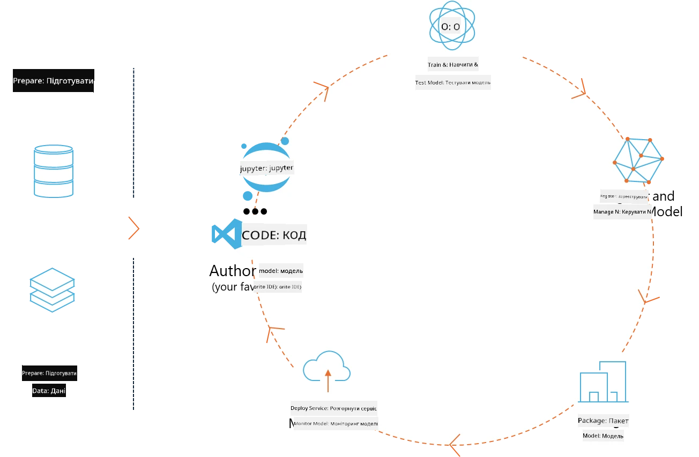
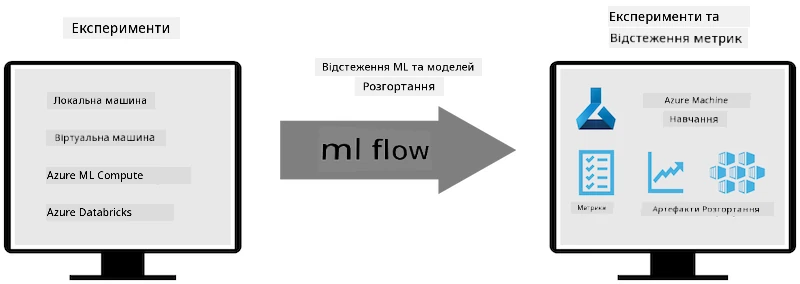
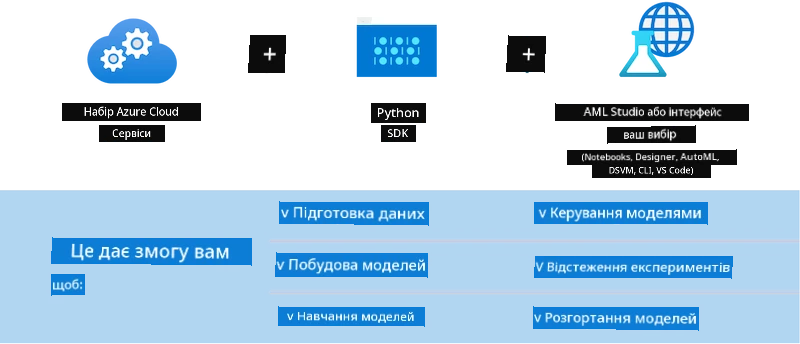

# MLflow

[MLflow](https://mlflow.org/) — це платформа з відкритим кодом, створена для управління повним життєвим циклом машинного навчання.



MLFlow використовується для керування життєвим циклом ML, включаючи експерименти, відтворюваність, розгортання та центральний реєстр моделей. Наразі MLflow пропонує чотири компоненти.

- **MLflow Tracking:** Запис і запит експериментів, коду, конфігурації даних та результатів.
- **MLflow Projects:** Упаковка коду для науки про дані у форматі, що дозволяє відтворювати запуск на будь-якій платформі.
- **Mlflow Models:** Розгортання моделей машинного навчання в різних середовищах обслуговування.
- **Model Registry:** Зберігання, анотування та управління моделями в центральному репозиторії.

Він включає можливості для відстеження експериментів, упаковки коду у відтворювані запуски, а також для спільного використання та розгортання моделей. MLFlow інтегрований у Databricks і підтримує різноманітні бібліотеки ML, що робить його незалежним від конкретної бібліотеки. Його можна використовувати з будь-якою бібліотекою машинного навчання та будь-якою мовою програмування, оскільки він надає REST API та CLI для зручності.



Основні функції MLFlow включають:

- **Відстеження експериментів:** Запис і порівняння параметрів та результатів.
- **Управління моделями:** Розгортання моделей на різних платформах обслуговування та інференсу.
- **Model Registry:** Спільне управління життєвим циклом моделей MLflow, включаючи версіонування та анотації.
- **Projects:** Упаковка ML-коду для спільного використання або виробничого застосування.

MLFlow також підтримує цикл MLOps, який включає підготовку даних, реєстрацію та управління моделями, упаковку моделей для виконання, розгортання сервісів і моніторинг моделей. Його мета — спростити перехід від прототипу до виробничого процесу, особливо в хмарних та edge-середовищах.

## E2E сценарій — створення обгортки та використання Phi-3 як моделі MLFlow

У цьому E2E прикладі ми продемонструємо два різні підходи до створення обгортки навколо малої мовної моделі Phi-3 (SLM) і подальшого запуску її як моделі MLFlow локально або в хмарі, наприклад, у робочому просторі Azure Machine Learning.



| Проєкт | Опис | Розташування |
| ------------ | ----------- | -------- |
| Transformer Pipeline | Transformer Pipeline — найпростіший варіант створення обгортки, якщо ви хочете використовувати модель HuggingFace з експериментальним варіантом трансформерів MLFlow. | [**TransformerPipeline.ipynb**](../../../../../../code/06.E2E/E2E_Phi-3-MLflow_TransformerPipeline.ipynb) |
| Custom Python Wrapper | На момент написання, трансформерний pipeline не підтримував генерацію обгортки MLFlow для моделей HuggingFace у форматі ONNX, навіть з експериментальним пакетом optimum Python. У таких випадках можна створити власну обгортку на Python для режиму MLFlow. | [**CustomPythonWrapper.ipynb**](../../../../../../code/06.E2E/E2E_Phi-3-MLflow_CustomPythonWrapper.ipynb) |

## Проєкт: Transformer Pipeline

1. Вам знадобляться відповідні пакети Python від MLFlow та HuggingFace:

    ``` Python
    import mlflow
    import transformers
    ```

2. Далі слід ініціалізувати трансформерний pipeline, звертаючись до цільової моделі Phi-3 у реєстрі HuggingFace. Як видно з картки моделі _Phi-3-mini-4k-instruct_, її завдання — «Генерація тексту»:

    ``` Python
    pipeline = transformers.pipeline(
        task = "text-generation",
        model = "microsoft/Phi-3-mini-4k-instruct"
    )
    ```

3. Тепер ви можете зберегти трансформерний pipeline моделі Phi-3 у форматі MLFlow і вказати додаткові деталі, такі як шлях до артефактів, конкретні налаштування моделі та тип API для інференсу:

    ``` Python
    model_info = mlflow.transformers.log_model(
        transformers_model = pipeline,
        artifact_path = "phi3-mlflow-model",
        model_config = model_config,
        task = "llm/v1/chat"
    )
    ```

## Проєкт: Custom Python Wrapper

1. Тут ми можемо використати API generate() від Microsoft [ONNX Runtime](https://github.com/microsoft/onnxruntime-genai) для інференсу моделі ONNX та кодування/декодування токенів. Вам потрібно обрати пакет _onnxruntime_genai_ для вашого цільового обчислювального середовища, у наведеному прикладі — CPU:

    ``` Python
    import mlflow
    from mlflow.models import infer_signature
    import onnxruntime_genai as og
    ```

1. Наш власний клас реалізує два методи: _load_context()_ для ініціалізації **ONNX-моделі** Phi-3 Mini 4K Instruct, **параметрів генератора** та **токенізатора**; і _predict()_ для генерації вихідних токенів за заданим запитом:

    ``` Python
    class Phi3Model(mlflow.pyfunc.PythonModel):
        def load_context(self, context):
            # Retrieving model from the artifacts
            model_path = context.artifacts["phi3-mini-onnx"]
            model_options = {
                 "max_length": 300,
                 "temperature": 0.2,         
            }
        
            # Defining the model
            self.phi3_model = og.Model(model_path)
            self.params = og.GeneratorParams(self.phi3_model)
            self.params.set_search_options(**model_options)
            
            # Defining the tokenizer
            self.tokenizer = og.Tokenizer(self.phi3_model)
    
        def predict(self, context, model_input):
            # Retrieving prompt from the input
            prompt = model_input["prompt"][0]
            self.params.input_ids = self.tokenizer.encode(prompt)
    
            # Generating the model's response
            response = self.phi3_model.generate(self.params)
    
            return self.tokenizer.decode(response[0][len(self.params.input_ids):])
    ```

1. Тепер ви можете використати функцію _mlflow.pyfunc.log_model()_ для створення власної обгортки на Python (у форматі pickle) для моделі Phi-3 разом з оригінальною ONNX-моделлю та необхідними залежностями:

    ``` Python
    model_info = mlflow.pyfunc.log_model(
        artifact_path = artifact_path,
        python_model = Phi3Model(),
        artifacts = {
            "phi3-mini-onnx": "cpu_and_mobile/cpu-int4-rtn-block-32-acc-level-4",
        },
        input_example = input_example,
        signature = infer_signature(input_example, ["Run"]),
        extra_pip_requirements = ["torch", "onnxruntime_genai", "numpy"],
    )
    ```

## Підписи згенерованих моделей MLFlow

1. У кроці 3 проєкту Transformer Pipeline вище ми встановили завдання MLFlow-моделі як “_llm/v1/chat_”. Така інструкція генерує API-обгортку моделі, сумісну з OpenAI Chat API, як показано нижче:

    ``` Python
    {inputs: 
      ['messages': Array({content: string (required), name: string (optional), role: string (required)}) (required), 'temperature': double (optional), 'max_tokens': long (optional), 'stop': Array(string) (optional), 'n': long (optional), 'stream': boolean (optional)],
    outputs: 
      ['id': string (required), 'object': string (required), 'created': long (required), 'model': string (required), 'choices': Array({finish_reason: string (required), index: long (required), message: {content: string (required), name: string (optional), role: string (required)} (required)}) (required), 'usage': {completion_tokens: long (required), prompt_tokens: long (required), total_tokens: long (required)} (required)],
    params: 
      None}
    ```

1. В результаті ви можете надсилати свій запит у такому форматі:

    ``` Python
    messages = [{"role": "user", "content": "What is the capital of Spain?"}]
    ```

1. Потім використовуйте постобробку, сумісну з OpenAI API, наприклад, _response[0][‘choices’][0][‘message’][‘content’]_, щоб оформити вихідні дані приблизно так:

    ``` JSON
    Question: What is the capital of Spain?
    
    Answer: The capital of Spain is Madrid. It is the largest city in Spain and serves as the political, economic, and cultural center of the country. Madrid is located in the center of the Iberian Peninsula and is known for its rich history, art, and architecture, including the Royal Palace, the Prado Museum, and the Plaza Mayor.
    
    Usage: {'prompt_tokens': 11, 'completion_tokens': 73, 'total_tokens': 84}
    ```

1. У кроці 3 проєкту Custom Python Wrapper вище ми дозволяємо пакету MLFlow згенерувати підпис моделі на основі заданого прикладу вхідних даних. Підпис нашої обгортки MLFlow виглядатиме так:

    ``` Python
    {inputs: 
      ['prompt': string (required)],
    outputs: 
      [string (required)],
    params: 
      None}
    ```

1. Отже, наш запит має містити ключ словника "prompt", подібно до цього:

    ``` Python
    {"prompt": "<|system|>You are a stand-up comedian.<|end|><|user|>Tell me a joke about atom<|end|><|assistant|>",}
    ```

1. Вихідні дані моделі будуть надані у вигляді рядка:

    ``` JSON
    Alright, here's a little atom-related joke for you!
    
    Why don't electrons ever play hide and seek with protons?
    
    Because good luck finding them when they're always "sharing" their electrons!
    
    Remember, this is all in good fun, and we're just having a little atomic-level humor!
    ```

**Відмова від відповідальності**:  
Цей документ було перекладено за допомогою сервісу автоматичного перекладу [Co-op Translator](https://github.com/Azure/co-op-translator). Хоча ми прагнемо до точності, будь ласка, майте на увазі, що автоматичні переклади можуть містити помилки або неточності. Оригінальний документ рідною мовою слід вважати авторитетним джерелом. Для критично важливої інформації рекомендується звертатися до професійного людського перекладу. Ми не несемо відповідальності за будь-які непорозуміння або неправильні тлумачення, що виникли внаслідок використання цього перекладу.