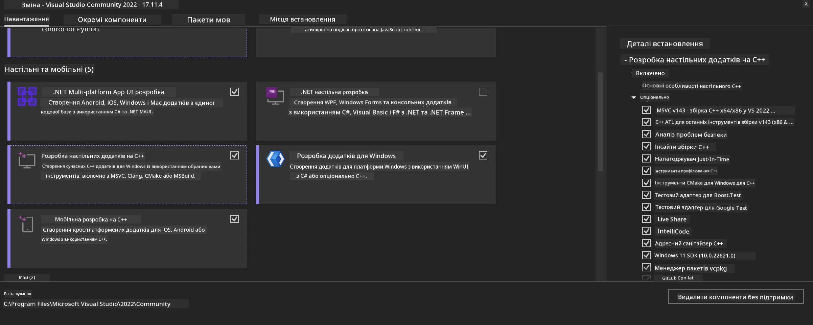
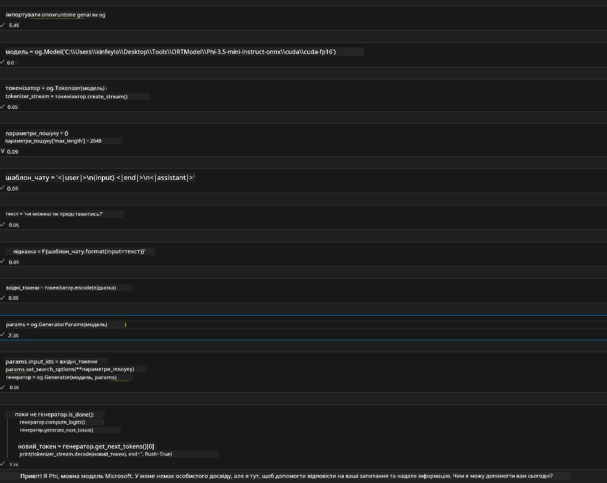
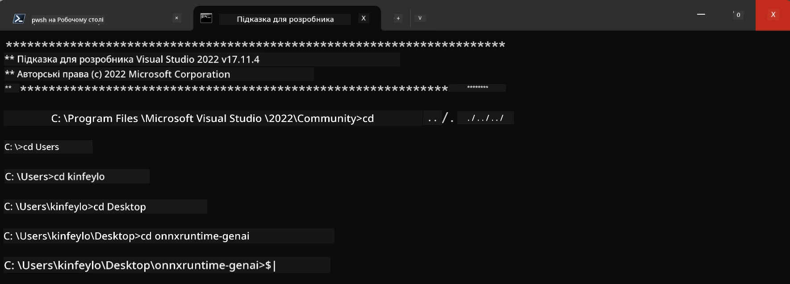

# **Інструкція для OnnxRuntime GenAI Windows GPU**

Ця інструкція містить кроки для налаштування та використання ONNX Runtime (ORT) з GPU на Windows. Вона допоможе вам використовувати апаратне прискорення на GPU для ваших моделей, покращуючи продуктивність та ефективність.

Документ містить рекомендації щодо:

- Налаштування середовища: інструкції з встановлення необхідних залежностей, таких як CUDA, cuDNN та ONNX Runtime.
- Конфігурації: як налаштувати середовище та ONNX Runtime для ефективного використання ресурсів GPU.
- Поради з оптимізації: рекомендації щодо тонкого налаштування параметрів GPU для досягнення максимальної продуктивності.

### **1. Python 3.10.x /3.11.8**

   ***Note*** Рекомендується використовувати [miniforge](https://github.com/conda-forge/miniforge/releases/latest/download/Miniforge3-Windows-x86_64.exe) як ваше Python середовище

   ```bash

   conda create -n pydev python==3.11.8

   conda activate pydev

   ```

   ***Reminder*** Якщо у вас встановлена будь-яка бібліотека ONNX для Python, будь ласка, видаліть її

### **2. Встановлення CMake за допомогою winget**

   ```bash

   winget install -e --id Kitware.CMake

   ```

### **3. Встановлення Visual Studio 2022 - Desktop Development with C++**

   ***Note*** Якщо ви не плануєте компілювати, цей крок можна пропустити



### **4. Встановлення драйвера NVIDIA**

1. **Драйвер NVIDIA GPU**  [https://www.nvidia.com/en-us/drivers/](https://www.nvidia.com/en-us/drivers/)

2. **NVIDIA CUDA 12.4** [https://developer.nvidia.com/cuda-12-4-0-download-archive](https://developer.nvidia.com/cuda-12-4-0-download-archive)

3. **NVIDIA CUDNN 9.4**  [https://developer.nvidia.com/cudnn-downloads](https://developer.nvidia.com/cudnn-downloads)

***Reminder*** Будь ласка, використовуйте стандартні налаштування під час встановлення

### **5. Налаштування середовища NVIDIA**

Скопіюйте бібліотеки NVIDIA CUDNN 9.4 (lib, bin, include) до відповідних папок NVIDIA CUDA 12.4 (lib, bin, include)

- скопіюйте файли з *'C:\Program Files\NVIDIA\CUDNN\v9.4\bin\12.6'* до  *'C:\Program Files\NVIDIA GPU Computing Toolkit\CUDA\v12.4\bin'*

- скопіюйте файли з *'C:\Program Files\NVIDIA\CUDNN\v9.4\include\12.6'* до  *'C:\Program Files\NVIDIA GPU Computing Toolkit\CUDA\v12.4\include'*

- скопіюйте файли з *'C:\Program Files\NVIDIA\CUDNN\v9.4\lib\12.6'* до  *'C:\Program Files\NVIDIA GPU Computing Toolkit\CUDA\v12.4\lib\x64'*

### **6. Завантаження Phi-3.5-mini-instruct-onnx**

   ```bash

   winget install -e --id Git.Git

   winget install -e --id GitHub.GitLFS

   git lfs install

   git clone https://huggingface.co/microsoft/Phi-3.5-mini-instruct-onnx

   ```

### **7. Запуск InferencePhi35Instruct.ipynb**

   Відкрийте [Notebook](../../../../../../code/09.UpdateSamples/Aug/ortgpu-phi35-instruct.ipynb) та виконайте



### **8. Компіляція ORT GenAI GPU**

   ***Note*** 
   
   1. Спочатку видаліть усі пакети, пов’язані з onnx, onnxruntime та onnxruntime-genai

   ```bash

   pip list 
   
   ```

   Потім видаліть усі бібліотеки onnxruntime, наприклад:

   ```bash

   pip uninstall onnxruntime

   pip uninstall onnxruntime-genai

   pip uninstall onnxruntume-genai-cuda
   
   ```

   2. Перевірте підтримку розширень Visual Studio

   Перевірте папку C:\Program Files\NVIDIA GPU Computing Toolkit\CUDA\v12.4\extras, щоб переконатися, що там є C:\Program Files\NVIDIA GPU Computing Toolkit\CUDA\v12.4\extras\visual_studio_integration. 
   
   Якщо її немає, перевірте інші папки драйверів CUDA toolkit і скопіюйте папку visual_studio_integration з вмістом до C:\Program Files\NVIDIA GPU Computing Toolkit\CUDA\v12.4\extras\visual_studio_integration

   - Якщо ви не плануєте компілювати, цей крок можна пропустити

   ```bash

   git clone https://github.com/microsoft/onnxruntime-genai

   ```

   - Завантажте [https://github.com/microsoft/onnxruntime/releases/download/v1.19.2/onnxruntime-win-x64-gpu-1.19.2.zip](https://github.com/microsoft/onnxruntime/releases/download/v1.19.2/onnxruntime-win-x64-gpu-1.19.2.zip)

   - Розпакуйте onnxruntime-win-x64-gpu-1.19.2.zip, перейменуйте папку на **ort** та скопіюйте її до onnxruntime-genai

   - Використовуючи Windows Terminal, відкрийте Developer Command Prompt для VS 2022 і перейдіть до onnxruntime-genai



   - Скомпілюйте з вашим Python середовищем

   ```bash

   cd onnxruntime-genai

   python build.py --use_cuda  --cuda_home "C:\Program Files\NVIDIA GPU Computing Toolkit\CUDA\v12.4" --config Release
 

   cd build/Windows/Release/Wheel

   pip install .whl

   ```

**Відмова від відповідальності**:  
Цей документ було перекладено за допомогою сервісу автоматичного перекладу [Co-op Translator](https://github.com/Azure/co-op-translator). Хоча ми прагнемо до точності, будь ласка, майте на увазі, що автоматичні переклади можуть містити помилки або неточності. Оригінальний документ рідною мовою слід вважати авторитетним джерелом. Для критично важливої інформації рекомендується звертатися до професійного людського перекладу. Ми не несемо відповідальності за будь-які непорозуміння або неправильні тлумачення, що виникли внаслідок використання цього перекладу.