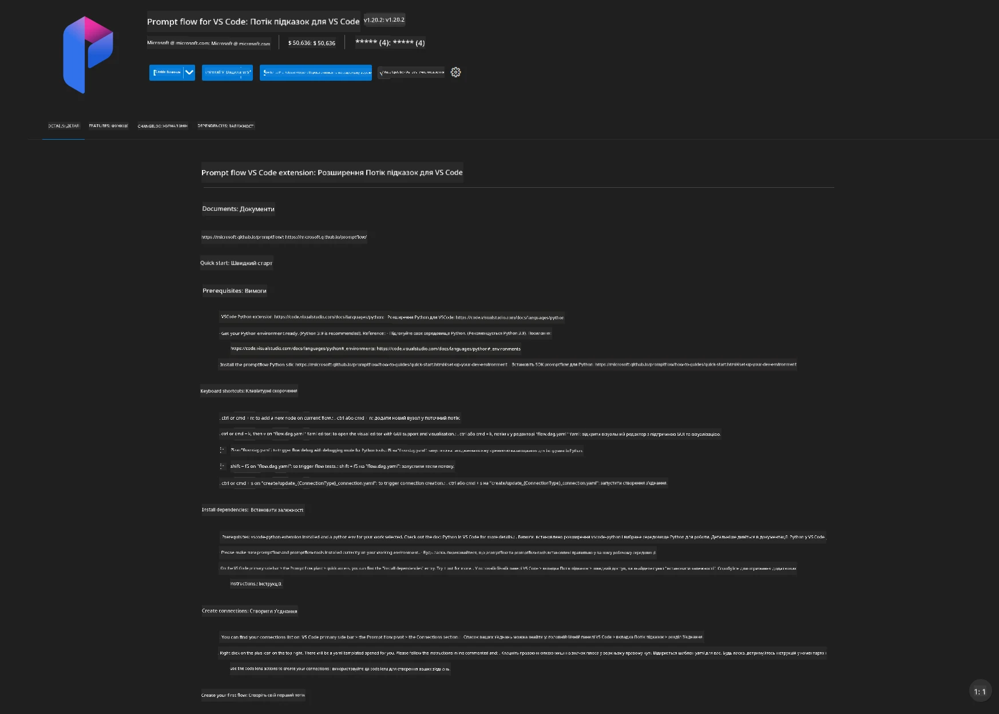
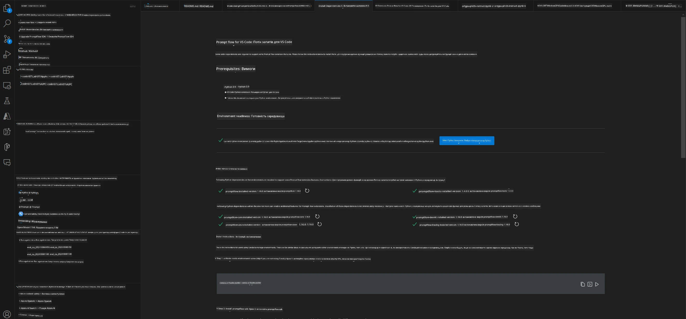
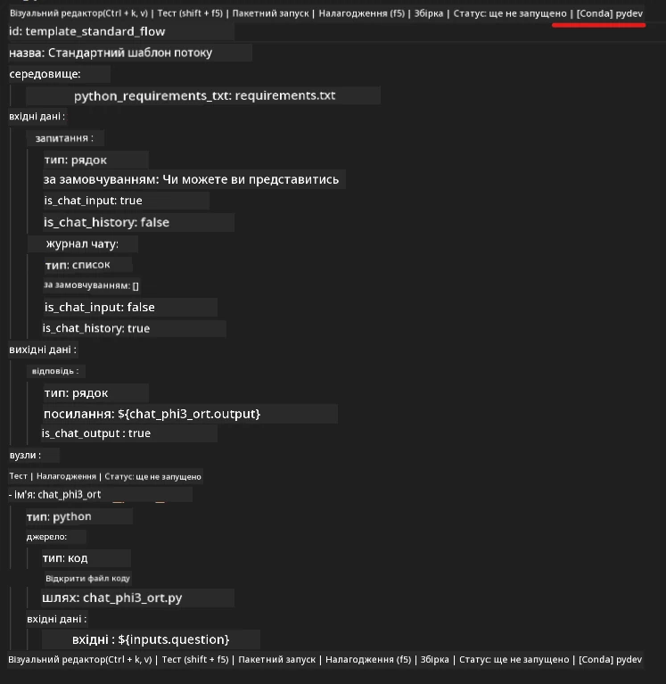
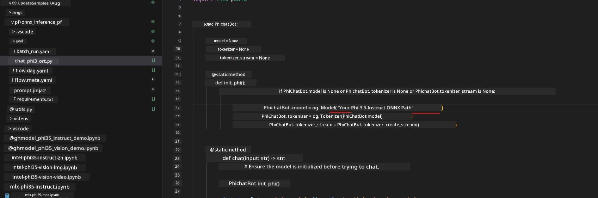
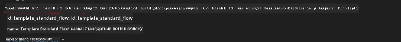
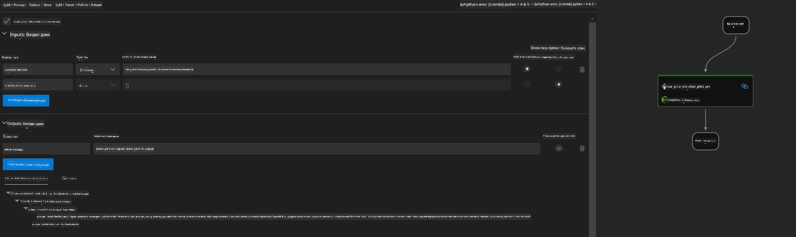
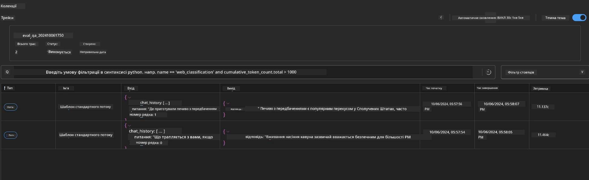

<!--
CO_OP_TRANSLATOR_METADATA:
{
  "original_hash": "92e7dac1e5af0dd7c94170fdaf6860fe",
  "translation_date": "2025-07-17T03:04:48+00:00",
  "source_file": "md/02.Application/01.TextAndChat/Phi3/UsingPromptFlowWithONNX.md",
  "language_code": "uk"
}
-->
# Використання Windows GPU для створення рішення Prompt flow з Phi-3.5-Instruct ONNX

Цей документ є прикладом того, як використовувати PromptFlow з ONNX (Open Neural Network Exchange) для розробки AI-додатків на основі моделей Phi-3.

PromptFlow — це набір інструментів для розробки, створений для оптимізації повного циклу розробки AI-додатків на базі LLM (великі мовні моделі), від ідеї та прототипування до тестування та оцінки.

Інтегруючи PromptFlow з ONNX, розробники можуть:

- Оптимізувати продуктивність моделі: використовувати ONNX для ефективного виконання та розгортання моделей.
- Спрощувати розробку: застосовувати PromptFlow для керування робочим процесом і автоматизації рутинних завдань.
- Покращувати співпрацю: забезпечувати кращу взаємодію між членами команди завдяки єдиному середовищу розробки.

**Prompt flow** — це набір інструментів для розробки, який допомагає оптимізувати повний цикл створення AI-додатків на основі LLM: від ідеї, прототипування, тестування, оцінки до розгортання в продакшн і моніторингу. Він значно спрощує інженерію промптів і дозволяє створювати LLM-додатки з якістю, придатною для продакшну.

Prompt flow може підключатися до OpenAI, Azure OpenAI Service та налаштовуваних моделей (Huggingface, локальні LLM/SLM). Ми плануємо розгорнути квантизовану ONNX-модель Phi-3.5 у локальних додатках. Prompt flow допоможе нам краще планувати бізнес і створювати локальні рішення на основі Phi-3.5. У цьому прикладі ми поєднаємо ONNX Runtime GenAI Library для створення рішення Prompt flow на базі Windows GPU.

## **Встановлення**

### **ONNX Runtime GenAI для Windows GPU**

Прочитайте цю інструкцію, щоб налаштувати ONNX Runtime GenAI для Windows GPU [натисніть тут](./ORTWindowGPUGuideline.md)

### **Налаштування Prompt flow у VSCode**

1. Встановіть розширення Prompt flow для VS Code



2. Після встановлення розширення Prompt flow для VS Code, натисніть на розширення та оберіть **Installation dependencies**, дотримуйтесь цієї інструкції, щоб встановити Prompt flow SDK у вашому середовищі



3. Завантажте [Приклад коду](../../../../../../code/09.UpdateSamples/Aug/pf/onnx_inference_pf) і відкрийте його у VS Code


4. Відкрийте **flow.dag.yaml**, щоб обрати ваше Python-середовище



   Відкрийте **chat_phi3_ort.py**, щоб змінити шлях до вашої ONNX-моделі Phi-3.5-instruct



5. Запустіть ваш prompt flow для тестування

Відкрийте **flow.dag.yaml** і натисніть візуальний редактор



Після цього натисніть запуск для тестування



1. Ви можете запускати пакетні завдання у терміналі, щоб переглянути більше результатів


```bash

pf run create --file batch_run.yaml --stream --name 'Your eval qa name'    

```

Результати можна переглянути у вашому браузері за замовчуванням




**Відмова від відповідальності**:  
Цей документ було перекладено за допомогою сервісу автоматичного перекладу [Co-op Translator](https://github.com/Azure/co-op-translator). Хоча ми прагнемо до точності, будь ласка, майте на увазі, що автоматичні переклади можуть містити помилки або неточності. Оригінальний документ рідною мовою слід вважати авторитетним джерелом. Для критично важливої інформації рекомендується звертатися до професійного людського перекладу. Ми не несемо відповідальності за будь-які непорозуміння або неправильні тлумачення, що виникли внаслідок використання цього перекладу.