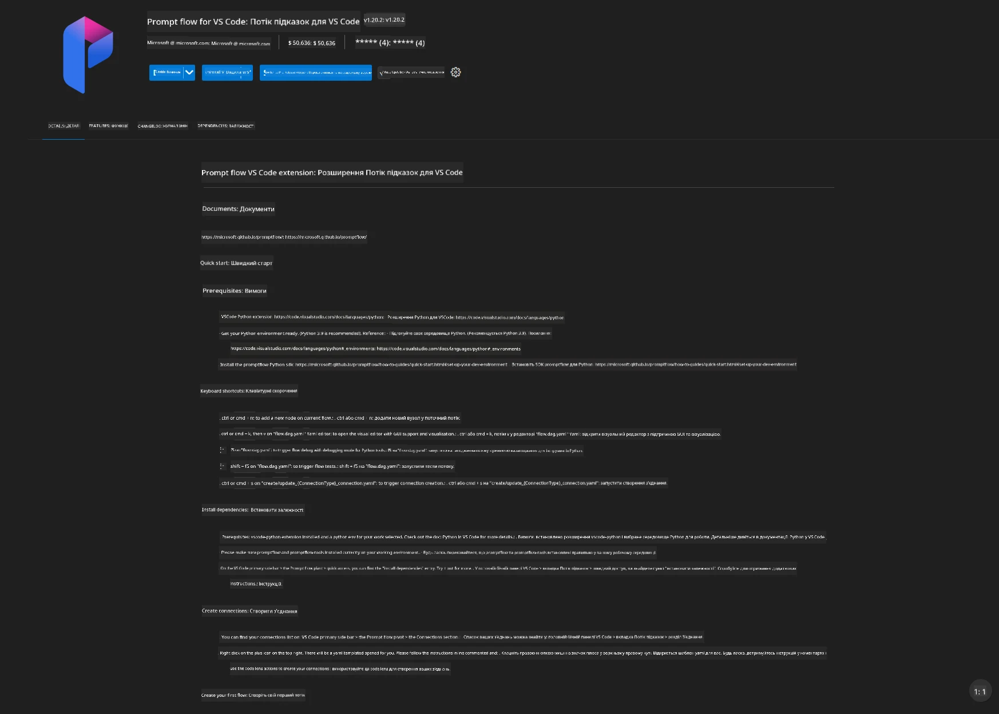
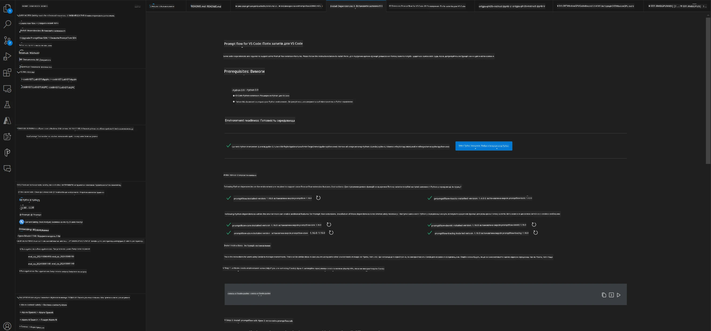
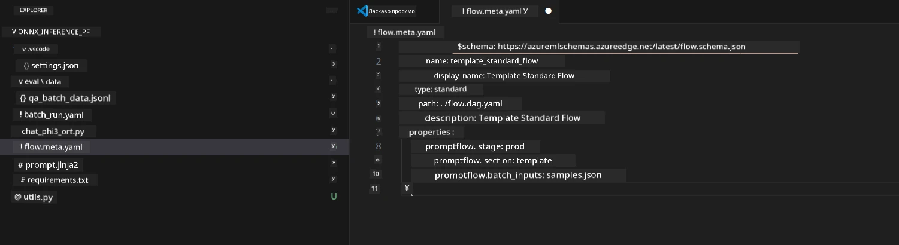
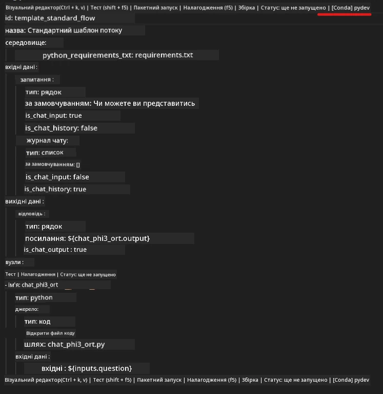
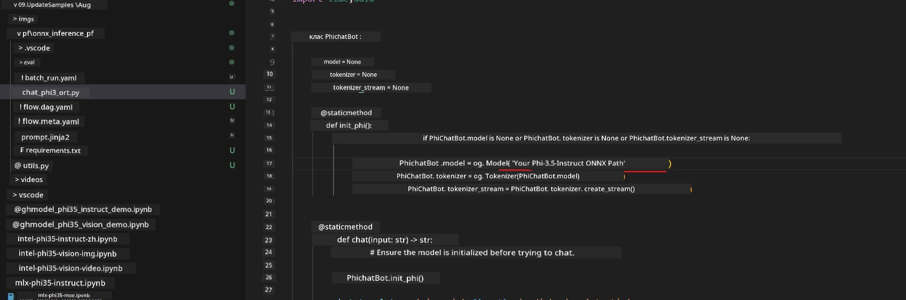
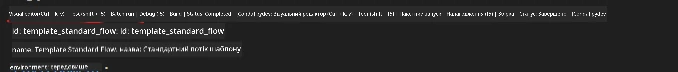
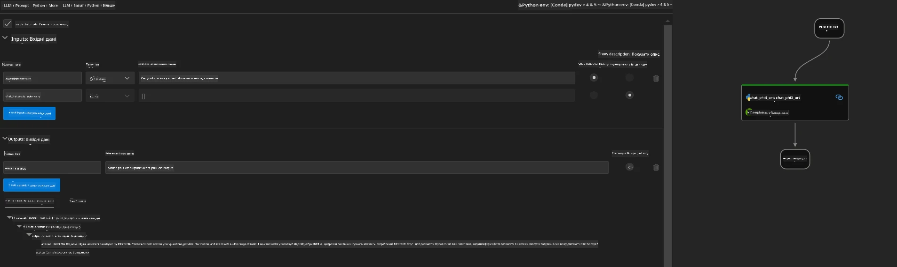
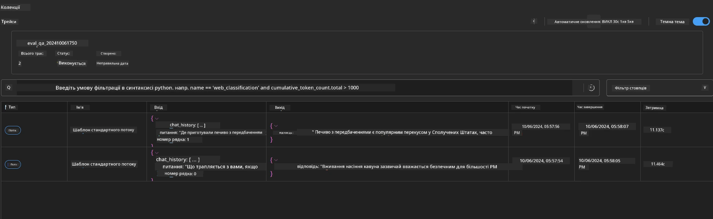

# Використання Windows GPU для створення рішення Prompt flow з Phi-3.5-Instruct ONNX 

Наступний документ є прикладом того, як використовувати PromptFlow з ONNX (Open Neural Network Exchange) для розробки AI-додатків на основі моделей Phi-3.

PromptFlow — це пакет інструментів для розробки, призначених для оптимізації повного циклу розробки AI-додатків на основі LLM (Велика мовна модель), від генерації ідеї та прототипування до тестування та оцінки.

Інтегруючи PromptFlow з ONNX, розробники можуть:

- Оптимізувати продуктивність моделі: використовуйте ONNX для ефективного виконання та розгортання моделей.
- Спрощувати розробку: використовуйте PromptFlow для керування робочим процесом і автоматизації рутинних завдань.
- Покращувати співпрацю: сприяти кращій взаємодії між членами команди, надаючи єдине середовище розробки.

**Prompt flow** — це пакет інструментів для розробки, що дозволяє оптимізувати повний цикл розробки AI-додатків на основі LLM, від генерації ідеї, прототипування, тестування та оцінки до розгортання у виробництві та моніторингу. Він значно полегшує prompt engineering і дозволяє створювати якісні LLM додатки для виробництва.

Prompt flow може підключатися до OpenAI, Azure OpenAI Service та налаштовуваних моделей (Huggingface, локальних LLM/SLM). Ми сподіваємося розгорнути квантизовану ONNX модель Phi-3.5 у локальних додатках. Prompt flow допоможе краще планувати бізнес і реалізувати локальні рішення на базі Phi-3.5. У цьому прикладі ми поєднаємо ONNX Runtime GenAI Library для завершення рішення Prompt flow на основі Windows GPU.

## **Інсталяція**

### **ONNX Runtime GenAI для Windows GPU**

Прочитайте цей посібник для налаштування ONNX Runtime GenAI для Windows GPU [click here](./ORTWindowGPUGuideline.md)

### **Налаштування Prompt flow у VSCode**

1. Встановіть розширення Prompt flow для VS Code



2. Після встановлення розширення Prompt flow для VS Code, натисніть розширення та виберіть **Інсталяційні залежності**, дотримуючись цього посібника, щоб встановити Prompt flow SDK у ваше середовище



3. Завантажте [Приклад коду](../../../../../../code/09.UpdateSamples/Aug/pf/onnx_inference_pf) та відкрийте цей приклад у VS Code



4. Відкрийте **flow.dag.yaml** та виберіть ваше Python середовище



Відкрийте **chat_phi3_ort.py** для зміни розташування вашої моделі Phi-3.5-instruct ONNX



5. Запустіть ваш prompt flow для тестування

Відкрийте **flow.dag.yaml** і натисніть візуальний редактор



Після натискання запустіть його для тестування



1. Ви можете запускати пакетні команди у терміналі для отримання більшої кількості результатів


```bash

pf run create --file batch_run.yaml --stream --name 'Your eval qa name'    

```

Ви можете переглядати результати у вашому браузері за замовчуванням




---

<!-- CO-OP TRANSLATOR DISCLAIMER START -->
**Відмова від відповідальності**:
Цей документ було перекладено за допомогою сервісу штучного інтелекту для перекладу [Co-op Translator](https://github.com/Azure/co-op-translator). Хоча ми прагнемо до точності, будь ласка, майте на увазі, що автоматичні переклади можуть містити помилки або неточності. Оригінальний документ рідною мовою слід вважати авторитетним джерелом. Для критично важливої інформації рекомендується професійний людський переклад. Ми не несемо відповідальності за будь-які непорозуміння або неправильні тлумачення, що виникли внаслідок використання цього перекладу.
<!-- CO-OP TRANSLATOR DISCLAIMER END -->