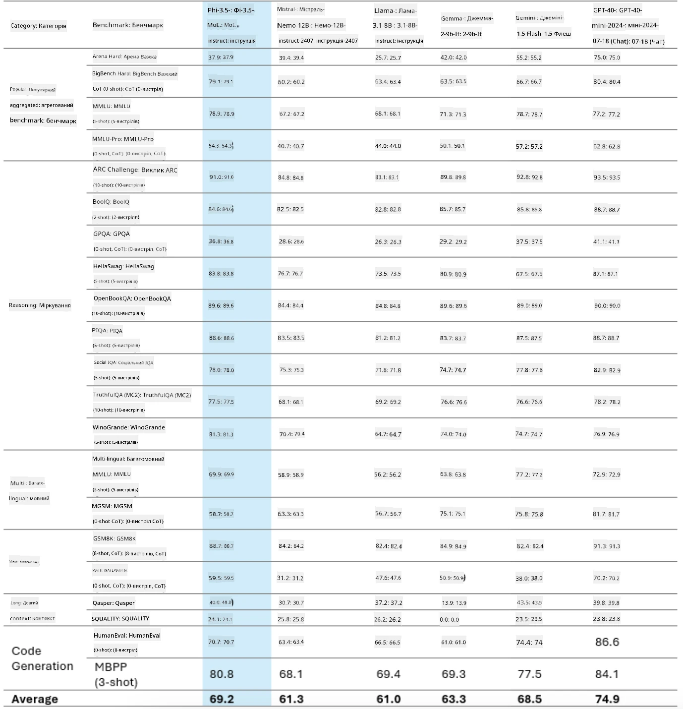
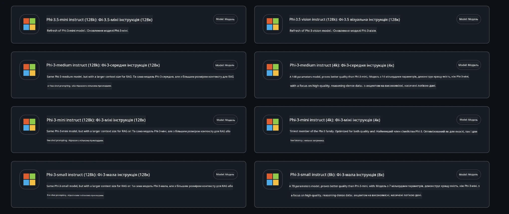
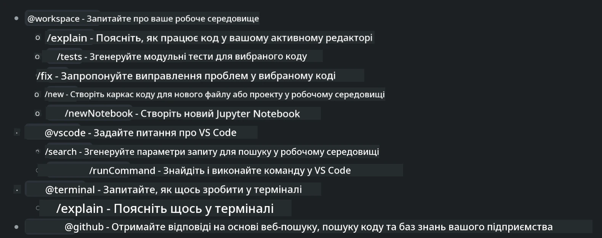
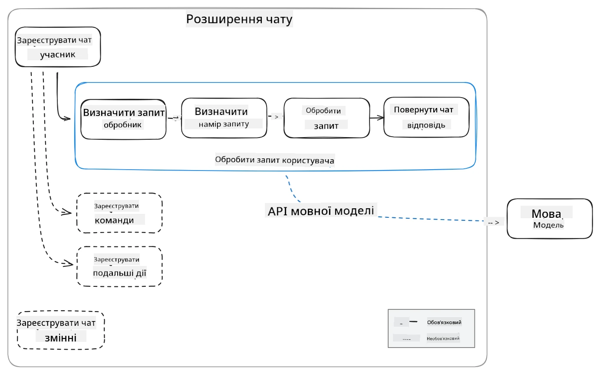
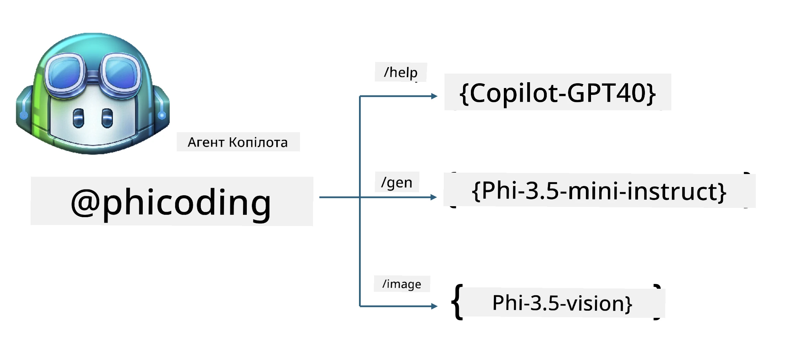
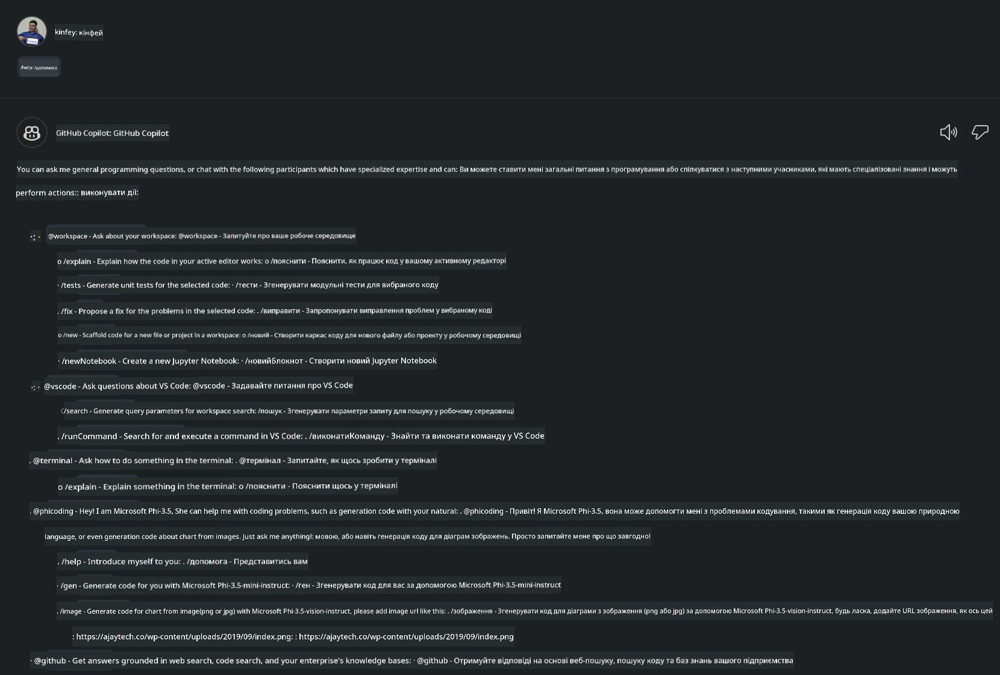
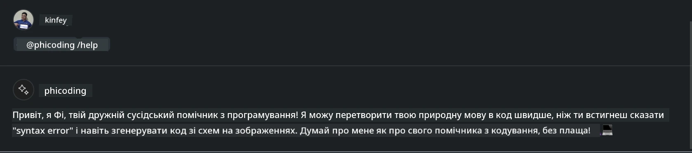
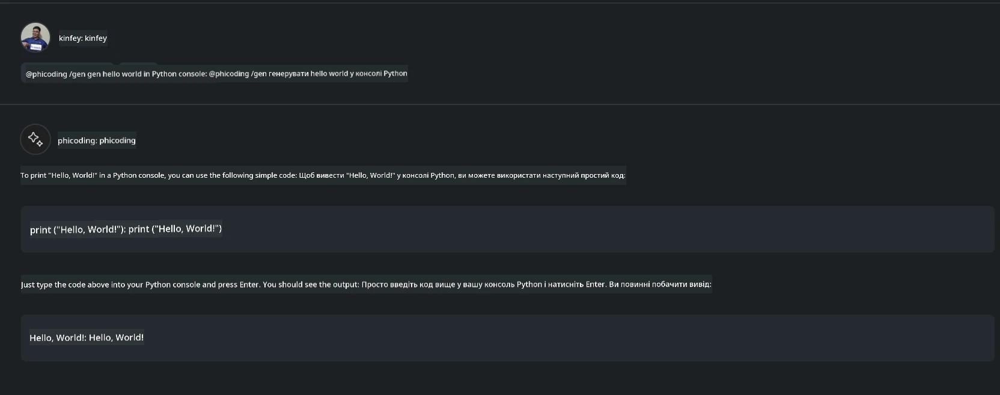

<!--
CO_OP_TRANSLATOR_METADATA:
{
  "original_hash": "35bf81388ac6917277b8d9a0c39bdc70",
  "translation_date": "2025-07-17T03:31:49+00:00",
  "source_file": "md/02.Application/02.Code/Phi3/CreateVSCodeChatAgentWithGitHubModels.md",
  "language_code": "uk"
}
-->
# **Створіть власного агента Visual Studio Code Chat Copilot з Phi-3.5 від GitHub Models**

Ви користуєтесь Visual Studio Code Copilot? Особливо в Chat, ви можете використовувати різних агентів, щоб покращити можливості створення, написання та підтримки проєктів у Visual Studio Code. Visual Studio Code надає API, який дозволяє компаніям та окремим користувачам створювати різних агентів, орієнтованих на їхній бізнес, щоб розширити можливості у різних спеціалізованих сферах. У цій статті ми зосередимось на **Phi-3.5-mini-instruct (128k)** та **Phi-3.5-vision-instruct (128k)** від GitHub Models для створення власного агента Visual Studio Code.

## **Про Phi-3.5 на GitHub Models**

Відомо, що Phi-3/3.5-mini-instruct у сімействі Phi-3/3.5 має потужні можливості розуміння та генерації коду, і має переваги над Gemma-2-9b та Mistral-Nemo-12B-instruct-2407.



Останні GitHub Models вже надають доступ до моделей Phi-3.5-mini-instruct (128k) та Phi-3.5-vision-instruct (128k). Розробники можуть отримати до них доступ через OpenAI SDK, Azure AI Inference SDK та REST API.



***Note: *** Рекомендується використовувати Azure AI Inference SDK, оскільки він краще інтегрується з Azure Model Catalog у виробничому середовищі.

Нижче наведені результати роботи **Phi-3.5-mini-instruct (128k)** та **Phi-3.5-vision-instruct (128k)** у сценарії генерації коду після інтеграції з GitHub Models, а також підготовка до наступних прикладів.

**Демо: GitHub Models Phi-3.5-mini-instruct (128k) генерує код з Prompt** ([перейти за посиланням](../../../../../../code/09.UpdateSamples/Aug/ghmodel_phi35_instruct_demo.ipynb))

**Демо: GitHub Models Phi-3.5-vision-instruct (128k) генерує код з зображення** ([перейти за посиланням](../../../../../../code/09.UpdateSamples/Aug/ghmodel_phi35_vision_demo.ipynb))


## **Про GitHub Copilot Chat Agent**

GitHub Copilot Chat Agent може виконувати різні завдання у різних проєктних сценаріях на основі коду. Система має чотири агенти: workspace, github, terminal, vscode



Додаючи ім’я агента з ‘@’, ви можете швидко виконати відповідну роботу. Для підприємств, якщо додати власний бізнес-контент, такий як вимоги, кодування, тестові специфікації та релізи, можна отримати більш потужні приватні функції на базі GitHub Copilot.

Visual Studio Code Chat Agent офіційно випустив свій API, що дозволяє підприємствам або розробникам створювати агентів на основі різних екосистем програмного забезпечення. Використовуючи метод розробки розширень Visual Studio Code, ви легко можете отримати доступ до інтерфейсу API Visual Studio Code Chat Agent. Ми можемо розробляти на основі цього процесу.



Сценарій розробки підтримує доступ до API сторонніх моделей (наприклад, GitHub Models, Azure Model Catalog, а також власних сервісів на базі відкритих моделей) і може також використовувати моделі gpt-35-turbo, gpt-4 та gpt-4o, які надає GitHub Copilot.

## **Додати агента @phicoding на базі Phi-3.5**

Ми намагаємось інтегрувати програмні можливості Phi-3.5 для виконання написання коду, генерації коду зображень та інших завдань. Створити агента на основі Phi-3.5 - @PHI, ось деякі функції:

1. Генерація самопрезентації на основі GPT-4o, наданої GitHub Copilot, через команду **@phicoding /help**

2. Генерація коду для різних мов програмування на основі **Phi-3.5-mini-instruct (128k)** через команду **@phicoding /gen**

3. Генерація коду на основі **Phi-3.5-vision-instruct (128k)** та доповнення зображень через команду **@phicoding /image**



## **Пов’язані кроки**

1. Встановіть підтримку розробки розширень Visual Studio Code за допомогою npm

```bash

npm install --global yo generator-code 

```
2. Створіть плагін розширення Visual Studio Code (використовуючи режим розробки на Typescript, назва phiext)

```bash

yo code 

```

3. Відкрийте створений проєкт і змініть package.json. Тут наведені відповідні інструкції та конфігурації, а також налаштування GitHub Models. Зверніть увагу, що потрібно додати свій токен GitHub Models.

```json

{
  "name": "phiext",
  "displayName": "phiext",
  "description": "",
  "version": "0.0.1",
  "engines": {
    "vscode": "^1.93.0"
  },
  "categories": [
    "AI",
    "Chat"
  ],
  "activationEvents": [],
  "enabledApiProposals": [
      "chatVariableResolver"
  ],
  "main": "./dist/extension.js",
  "contributes": {
    "chatParticipants": [
        {
            "id": "chat.phicoding",
            "name": "phicoding",
            "description": "Hey! I am Microsoft Phi-3.5, She can help me with coding problems, such as generation code with your natural language, or even generation code about chart from images. Just ask me anything!",
            "isSticky": true,
            "commands": [
                {
                    "name": "help",
                    "description": "Introduce myself to you"
                },
                {
                    "name": "gen",
                    "description": "Generate code for you with Microsoft Phi-3.5-mini-instruct"
                },
                {
                    "name": "image",
                    "description": "Generate code for chart from image(png or jpg) with Microsoft Phi-3.5-vision-instruct, please add image url like this : https://ajaytech.co/wp-content/uploads/2019/09/index.png"
                }
            ]
        }
    ],
    "commands": [
        {
            "command": "phicoding.namesInEditor",
            "title": "Use Microsoft Phi 3.5 in Editor"
        }
    ],
    "configuration": {
      "type": "object",
      "title": "githubmodels",
      "properties": {
        "githubmodels.endpoint": {
          "type": "string",
          "default": "https://models.inference.ai.azure.com",
          "description": "Your GitHub Models Endpoint",
          "order": 0
        },
        "githubmodels.api_key": {
          "type": "string",
          "default": "Your GitHub Models Token",
          "description": "Your GitHub Models Token",
          "order": 1
        },
        "githubmodels.phi35instruct": {
          "type": "string",
          "default": "Phi-3.5-mini-instruct",
          "description": "Your Phi-35-Instruct Model",
          "order": 2
        },
        "githubmodels.phi35vision": {
          "type": "string",
          "default": "Phi-3.5-vision-instruct",
          "description": "Your Phi-35-Vision Model",
          "order": 3
        }
      }
    }
  },
  "scripts": {
    "vscode:prepublish": "npm run package",
    "compile": "webpack",
    "watch": "webpack --watch",
    "package": "webpack --mode production --devtool hidden-source-map",
    "compile-tests": "tsc -p . --outDir out",
    "watch-tests": "tsc -p . -w --outDir out",
    "pretest": "npm run compile-tests && npm run compile && npm run lint",
    "lint": "eslint src",
    "test": "vscode-test"
  },
  "devDependencies": {
    "@types/vscode": "^1.93.0",
    "@types/mocha": "^10.0.7",
    "@types/node": "20.x",
    "@typescript-eslint/eslint-plugin": "^8.3.0",
    "@typescript-eslint/parser": "^8.3.0",
    "eslint": "^9.9.1",
    "typescript": "^5.5.4",
    "ts-loader": "^9.5.1",
    "webpack": "^5.94.0",
    "webpack-cli": "^5.1.4",
    "@vscode/test-cli": "^0.0.10",
    "@vscode/test-electron": "^2.4.1"
  },
  "dependencies": {
    "@types/node-fetch": "^2.6.11",
    "node-fetch": "^3.3.2",
    "@azure-rest/ai-inference": "latest",
    "@azure/core-auth": "latest",
    "@azure/core-sse": "latest"
  }
}


```

4. Змініть src/extension.ts

```typescript

// The module 'vscode' contains the VS Code extensibility API
// Import the module and reference it with the alias vscode in your code below
import * as vscode from 'vscode';
import ModelClient from "@azure-rest/ai-inference";
import { AzureKeyCredential } from "@azure/core-auth";


interface IPhiChatResult extends vscode.ChatResult {
    metadata: {
        command: string;
    };
}


const MODEL_SELECTOR: vscode.LanguageModelChatSelector = { vendor: 'copilot', family: 'gpt-4o' };

function isValidImageUrl(url: string): boolean {
    const regex = /^(https?:\/\/.*\.(?:png|jpg))$/i;
    return regex.test(url);
}
  

// This method is called when your extension is activated
// Your extension is activated the very first time the command is executed
export function activate(context: vscode.ExtensionContext) {

    const codinghandler: vscode.ChatRequestHandler = async (request: vscode.ChatRequest, context: vscode.ChatContext, stream: vscode.ChatResponseStream, token: vscode.CancellationToken): Promise<IPhiChatResult> => {


        const config : any = vscode.workspace.getConfiguration('githubmodels');
        const endPoint: string = config.get('endpoint');
        const apiKey: string = config.get('api_key');
        const phi35instruct: string = config.get('phi35instruct');
        const phi35vision: string = config.get('phi35vision');
        
        if (request.command === 'help') {

            const content = "Welcome to Coding assistant with Microsoft Phi-3.5"; 
            stream.progress(content);


            try {
                const [model] = await vscode.lm.selectChatModels(MODEL_SELECTOR);
                if (model) {
                    const messages = [
                        vscode.LanguageModelChatMessage.User("Please help me express this content in a humorous way: I am a programming assistant who can help you convert natural language into code and generate code based on the charts in the images. output format like this : Hey I am Phi ......")
                    ];
                    const chatResponse = await model.sendRequest(messages, {}, token);
                    for await (const fragment of chatResponse.text) {
                        stream.markdown(fragment);
                    }
                }
            } catch(err) {
                console.log(err);
            }


            return { metadata: { command: 'help' } };

        }

        
        if (request.command === 'gen') {

            const content = "Welcome to use phi-3.5 to generate code";

            stream.progress(content);

            const client = new ModelClient(endPoint, new AzureKeyCredential(apiKey));

            const response = await client.path("/chat/completions").post({
              body: {
                messages: [
                  { role:"system", content: "You are a coding assistant.Help answer all code generation questions." },
                  { role:"user", content: request.prompt }
                ],
                model: phi35instruct,
                temperature: 0.4,
                max_tokens: 1000,
                top_p: 1.
              }
            });

            stream.markdown(response.body.choices[0].message.content);

            return { metadata: { command: 'gen' } };

        }


        
        if (request.command === 'image') {


            const content = "Welcome to use phi-3.5 to generate code from image(png or jpg),image url like this:https://ajaytech.co/wp-content/uploads/2019/09/index.png";

            stream.progress(content);

            if (!isValidImageUrl(request.prompt)) {
                stream.markdown('Please provide a valid image URL');
                return { metadata: { command: 'image' } };
            }
            else
            {

                const client = new ModelClient(endPoint, new AzureKeyCredential(apiKey));
    
                const response = await client.path("/chat/completions").post({
                    body: {
                      messages: [
                        { role: "system", content: "You are a helpful assistant that describes images in details." },
                        { role: "user", content: [
                            { type: "text", text: "Please generate code according to the chart in the picture according to the following requirements\n1. Keep all information in the chart, including data and text\n2. Do not generate additional information that is not included in the chart\n3. Please extract data from the picture, do not generate it from csv\n4. Please save the regenerated chart as a chart and save it to ./output/demo.png"},
                            { type: "image_url", image_url: {url: request.prompt}
                            }
                          ]
                        }
                      ],
                      model: phi35vision,
                      temperature: 0.4,
                      max_tokens: 2048,
                      top_p: 1.
                    }
                  });
    
                
                stream.markdown(response.body.choices[0].message.content);
    
                return { metadata: { command: 'image' } };
            }


        }


        return { metadata: { command: '' } };
    };


    const phi_ext = vscode.chat.createChatParticipant("chat.phicoding", codinghandler);

    phi_ext.iconPath = new vscode.ThemeIcon('sparkle');


    phi_ext.followupProvider = {
        provideFollowups(result: IPhiChatResult, context: vscode.ChatContext, token: vscode.CancellationToken) {
            return [{
                prompt: 'Let us coding with Phi-3.5 😋😋😋😋',
                label: vscode.l10n.t('Enjoy coding with Phi-3.5'),
                command: 'help'
            } satisfies vscode.ChatFollowup];
        }
    };

    context.subscriptions.push(phi_ext);
}

// This method is called when your extension is deactivated
export function deactivate() {}


```

6. Запуск

***/help***



***@phicoding /help***



***@phicoding /gen***



***@phicoding /image***


Ви можете завантажити приклади коду: [перейти](../../../../../../code/09.UpdateSamples/Aug/vscode)

## **Ресурси**

1. Зареєструйтесь у GitHub Models [https://gh.io/models](https://gh.io/models)

2. Вивчайте розробку розширень Visual Studio Code [https://code.visualstudio.com/api/get-started/your-first-extension](https://code.visualstudio.com/api/get-started/your-first-extension)

3. Дізнайтеся про Visual Studio Code Copilot Chat API [https://code.visualstudio.com/api/extension-guides/chat](https://code.visualstudio.com/api/extension-guides/chat)

**Відмова від відповідальності**:  
Цей документ було перекладено за допомогою сервісу автоматичного перекладу [Co-op Translator](https://github.com/Azure/co-op-translator). Хоча ми прагнемо до точності, будь ласка, майте на увазі, що автоматичні переклади можуть містити помилки або неточності. Оригінальний документ рідною мовою слід вважати авторитетним джерелом. Для критично важливої інформації рекомендується звертатися до професійного людського перекладу. Ми не несемо відповідальності за будь-які непорозуміння або неправильні тлумачення, що виникли внаслідок використання цього перекладу.