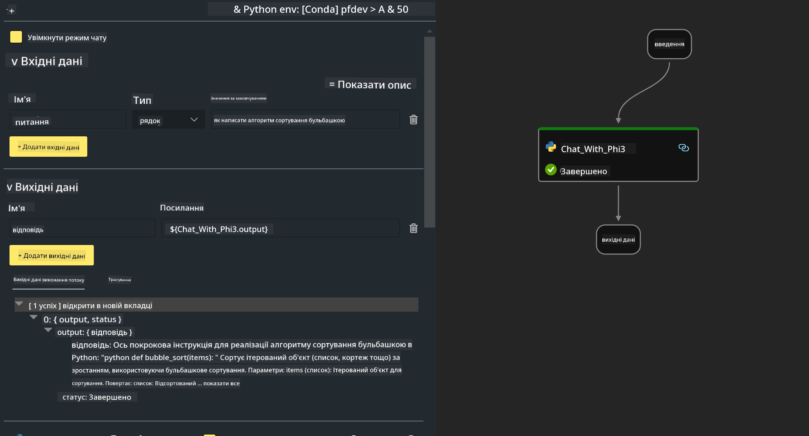

<!--
CO_OP_TRANSLATOR_METADATA:
{
  "original_hash": "3dbbf568625b1ee04b354c2dc81d3248",
  "translation_date": "2025-07-17T04:30:06+00:00",
  "source_file": "md/02.Application/02.Code/Phi3/VSCodeExt/HOL/Apple/02.PromptflowWithMLX.md",
  "language_code": "uk"
}
-->
# **Лабораторна робота 2 - Запуск Prompt flow з Phi-3-mini в AIPC**

## **Що таке Prompt flow**

Prompt flow — це набір інструментів для розробки, створений для спрощення повного циклу розробки AI-додатків на основі LLM: від ідеї, прототипування, тестування, оцінки до розгортання в продакшн і моніторингу. Він значно полегшує роботу з prompt engineering і дозволяє створювати LLM-додатки з якістю, придатною для продакшн.

За допомогою Prompt flow ви зможете:

- Створювати потоки, які поєднують LLM, промпти, Python-код та інші інструменти в єдиний виконуваний робочий процес.

- Відлагоджувати та ітерувати ваші потоки, особливо взаємодію з LLM, легко та швидко.

- Оцінювати ваші потоки, розраховувати метрики якості та продуктивності на великих наборах даних.

- Інтегрувати тестування та оцінку у вашу CI/CD систему для забезпечення якості потоку.

- Розгортати потоки на обраній платформі для сервінгу або легко інтегрувати їх у код вашого додатку.

- (Опційно, але дуже рекомендовано) Співпрацювати з командою, використовуючи хмарну версію Prompt flow в Azure AI.

## **Створення генераційних кодових потоків на Apple Silicon**

***Note*** ：Якщо ви ще не завершили встановлення середовища, будь ласка, відвідайте [Lab 0 -Installations](./01.Installations.md)

1. Відкрийте розширення Prompt flow у Visual Studio Code та створіть порожній проект потоку


2. Додайте параметри Inputs та Outputs і додайте Python-код як новий потік



Ви можете орієнтуватися на цю структуру (flow.dag.yaml) для побудови вашого потоку

```yaml

inputs:
  prompt:
    type: string
    default: Write python code for Fibonacci serie. Please use markdown as output
outputs:
  result:
    type: string
    reference: ${gen_code_by_phi3.output}
nodes:
- name: gen_code_by_phi3
  type: python
  source:
    type: code
    path: gen_code_by_phi3.py
  inputs:
    prompt: ${inputs.prompt}


```

3. Квантифікація phi-3-mini

Ми прагнемо краще запускати SLM на локальних пристроях. Зазвичай ми квантифікуємо модель (INT4, FP16, FP32)

```bash

python -m mlx_lm.convert --hf-path microsoft/Phi-3-mini-4k-instruct

```

**Note:** папка за замовчуванням — mlx_model

4. Додайте код у ***Chat_With_Phi3.py***

```python


from promptflow import tool

from mlx_lm import load, generate


# The inputs section will change based on the arguments of the tool function, after you save the code
# Adding type to arguments and return value will help the system show the types properly
# Please update the function name/signature per need
@tool
def my_python_tool(prompt: str) -> str:

    model_id = './mlx_model_phi3_mini'

    model, tokenizer = load(model_id)

    # <|user|>\nWrite python code for Fibonacci serie. Please use markdown as output<|end|>\n<|assistant|>

    response = generate(model, tokenizer, prompt="<|user|>\n" + prompt  + "<|end|>\n<|assistant|>", max_tokens=2048, verbose=True)

    return response


```

4. Ви можете протестувати потік через Debug або Run, щоб перевірити, чи працює генерація коду


5. Запустіть потік як API для розробки у терміналі

```

pf flow serve --source ./ --port 8080 --host localhost   

```

Ви можете протестувати його у Postman / Thunder Client

### **Note**

1. Перший запуск займає багато часу. Рекомендується завантажити модель phi-3 через Hugging face CLI.

2. Враховуючи обмежену обчислювальну потужність Intel NPU, рекомендується використовувати Phi-3-mini-4k-instruct.

3. Ми використовуємо Intel NPU Acceleration для квантифікації в INT4, але якщо ви повторно запускаєте сервіс, потрібно видалити папки cache та nc_workshop.

## **Ресурси**

1. Вивчайте Promptflow [https://microsoft.github.io/promptflow/](https://microsoft.github.io/promptflow/)

2. Вивчайте Intel NPU Acceleration [https://github.com/intel/intel-npu-acceleration-library](https://github.com/intel/intel-npu-acceleration-library)

3. Приклад коду, завантажте [Local NPU Agent Sample Code](../../../../../../../../../code/07.Lab/01/AIPC/local-npu-agent)

**Відмова від відповідальності**:  
Цей документ було перекладено за допомогою сервісу автоматичного перекладу [Co-op Translator](https://github.com/Azure/co-op-translator). Хоча ми прагнемо до точності, будь ласка, майте на увазі, що автоматичні переклади можуть містити помилки або неточності. Оригінальний документ рідною мовою слід вважати авторитетним джерелом. Для критично важливої інформації рекомендується звертатися до професійного людського перекладу. Ми не несемо відповідальності за будь-які непорозуміння або неправильні тлумачення, що виникли внаслідок використання цього перекладу.