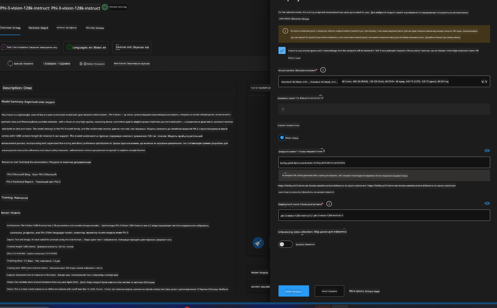
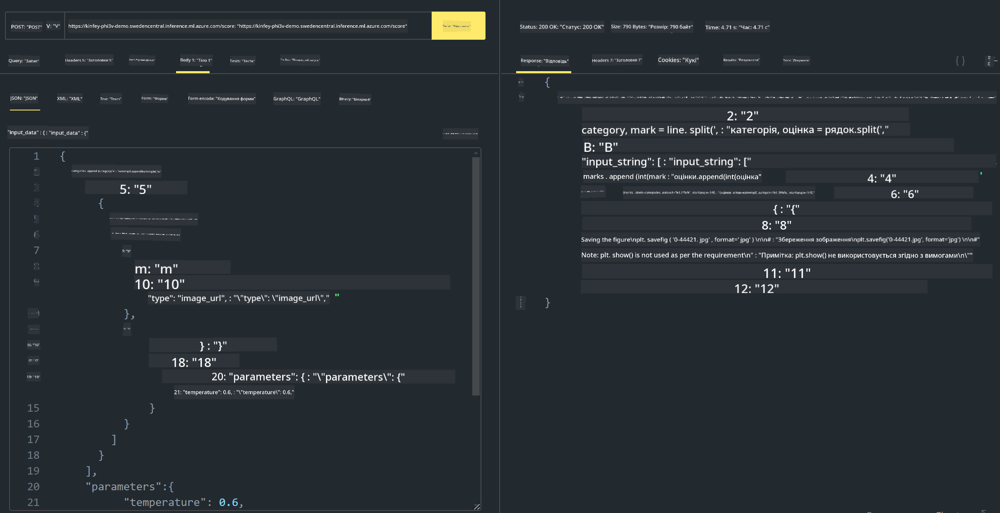

<!--
CO_OP_TRANSLATOR_METADATA:
{
  "original_hash": "20cb4e6ac1686248e8be913ccf6c2bc2",
  "translation_date": "2025-07-17T04:36:36+00:00",
  "source_file": "md/02.Application/02.Code/Phi3/VSCodeExt/HOL/Apple/03.DeployPhi3VisionOnAzure.md",
  "language_code": "uk"
}
-->
# **Лабораторна робота 3 - Розгортання Phi-3-vision у Azure Machine Learning Service**

Ми використовуємо NPU для завершення виробничого розгортання локального коду, а потім хочемо додати можливість інтеграції PHI-3-VISION через нього для генерації коду на основі зображень.

У цьому вступі ми швидко створимо сервіс Model As Service Phi-3 Vision у Azure Machine Learning Service.

***Note***: Phi-3 Vision потребує обчислювальних ресурсів для швидшої генерації контенту. Нам потрібна хмарна обчислювальна потужність, щоб допомогти в цьому.


### **1. Створення Azure Machine Learning Service**

Потрібно створити Azure Machine Learning Service у порталі Azure. Якщо хочете дізнатися, як це зробити, відвідайте це посилання [https://learn.microsoft.com/azure/machine-learning/quickstart-create-resources?view=azureml-api-2](https://learn.microsoft.com/azure/machine-learning/quickstart-create-resources?view=azureml-api-2)


### **2. Вибір Phi-3 Vision у Azure Machine Learning Service**


### **3. Розгортання Phi-3-Vision в Azure**





### **4. Тестування Endpoint у Postman**





***Note***

1. Параметри, які потрібно передати, мають включати Authorization, azureml-model-deployment та Content-Type. Необхідно перевірити інформацію про розгортання, щоб отримати їх.

2. Для передачі параметрів Phi-3-Vision потрібно передати посилання на зображення. Будь ласка, зверніться до методу GPT-4-Vision для передачі параметрів, наприклад

```json

{
  "input_data":{
    "input_string":[
      {
        "role":"user",
        "content":[ 
          {
            "type": "text",
            "text": "You are a Python coding assistant.Please create Python code for image "
          },
          {
              "type": "image_url",
              "image_url": {
                "url": "https://ajaytech.co/wp-content/uploads/2019/09/index.png"
              }
          }
        ]
      }
    ],
    "parameters":{
          "temperature": 0.6,
          "top_p": 0.9,
          "do_sample": false,
          "max_new_tokens": 2048
    }
  }
}

```

3. Викликайте **/score** за допомогою методу Post

**Вітаємо**! Ви успішно завершили швидке розгортання PHI-3-VISION і спробували, як за допомогою зображень генерувати код. Далі ми можемо створювати додатки, поєднуючи NPU та хмарні сервіси.

**Відмова від відповідальності**:  
Цей документ було перекладено за допомогою сервісу автоматичного перекладу [Co-op Translator](https://github.com/Azure/co-op-translator). Хоча ми прагнемо до точності, будь ласка, майте на увазі, що автоматичні переклади можуть містити помилки або неточності. Оригінальний документ рідною мовою слід вважати авторитетним джерелом. Для критично важливої інформації рекомендується звертатися до професійного людського перекладу. Ми не несемо відповідальності за будь-які непорозуміння або неправильні тлумачення, що виникли внаслідок використання цього перекладу.