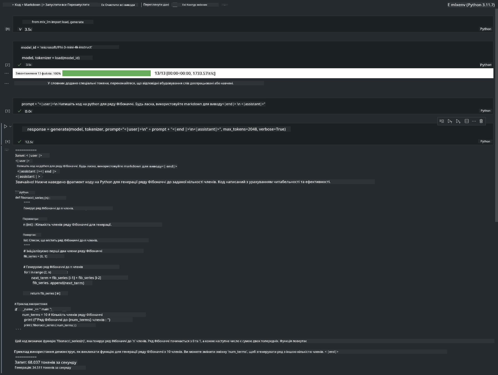

<!--
CO_OP_TRANSLATOR_METADATA:
{
  "original_hash": "dcb656f3d206fc4968e236deec5d4384",
  "translation_date": "2025-07-17T10:10:19+00:00",
  "source_file": "md/03.FineTuning/03.Inference/MLX_Inference.md",
  "language_code": "uk"
}
-->
# **Інференс Phi-3 з Apple MLX Framework**

## **Що таке MLX Framework**

MLX — це фреймворк для машинного навчання на Apple Silicon, розроблений дослідниками машинного навчання Apple.

MLX створений дослідниками машинного навчання для дослідників машинного навчання. Фреймворк має бути зручним у використанні, але водночас ефективним для навчання та розгортання моделей. Концепція самого фреймворку також досить проста. Ми прагнемо зробити його легким для розширення та вдосконалення, щоб швидко досліджувати нові ідеї.

Великі мовні моделі (LLMs) можна прискорювати на пристроях Apple Silicon за допомогою MLX, а моделі можна запускати локально дуже зручно.

## **Використання MLX для інференсу Phi-3-mini**

### **1. Налаштування середовища MLX**

1. Python 3.11.x  
2. Встановіть бібліотеку MLX


```bash

pip install mlx-lm

```

### **2. Запуск Phi-3-mini в терміналі з MLX**


```bash

python -m mlx_lm.generate --model microsoft/Phi-3-mini-4k-instruct --max-token 2048 --prompt  "<|user|>\nCan you introduce yourself<|end|>\n<|assistant|>"

```

Результат (моє середовище — Apple M1 Max, 64GB):


### **3. Квантування Phi-3-mini з MLX у терміналі**


```bash

python -m mlx_lm.convert --hf-path microsoft/Phi-3-mini-4k-instruct

```

***Примітка:*** Модель можна квантувати за допомогою mlx_lm.convert, за замовчуванням використовується INT4. У цьому прикладі Phi-3-mini квантується до INT4.

Модель можна квантувати через mlx_lm.convert, і за замовчуванням використовується INT4. У цьому прикладі Phi-3-mini квантується до INT4. Після квантування модель зберігається у стандартній директорії ./mlx_model

Ми можемо протестувати квантизовану модель з MLX через термінал


```bash

python -m mlx_lm.generate --model ./mlx_model/ --max-token 2048 --prompt  "<|user|>\nCan you introduce yourself<|end|>\n<|assistant|>"

```

Результат:


### **4. Запуск Phi-3-mini з MLX у Jupyter Notebook**




***Примітка:*** Будь ласка, ознайомтеся з цим прикладом [натисніть тут](../../../../../code/03.Inference/MLX/MLX_DEMO.ipynb)


## **Ресурси**

1. Дізнайтеся про Apple MLX Framework [https://ml-explore.github.io](https://ml-explore.github.io/mlx/build/html/index.html)

2. Репозиторій Apple MLX на GitHub [https://github.com/ml-explore](https://github.com/ml-explore)

**Відмова від відповідальності**:  
Цей документ було перекладено за допомогою сервісу автоматичного перекладу [Co-op Translator](https://github.com/Azure/co-op-translator). Хоча ми прагнемо до точності, будь ласка, майте на увазі, що автоматичні переклади можуть містити помилки або неточності. Оригінальний документ рідною мовою слід вважати авторитетним джерелом. Для критично важливої інформації рекомендується звертатися до професійного людського перекладу. Ми не несемо відповідальності за будь-які непорозуміння або неправильні тлумачення, що виникли внаслідок використання цього перекладу.