<!--
CO_OP_TRANSLATOR_METADATA:
{
  "original_hash": "c1559c5af6caccf6f623fd43a6b3a9a3",
  "translation_date": "2025-07-17T06:17:09+00:00",
  "source_file": "md/03.FineTuning/FineTuning_AIFoundry.md",
  "language_code": "uk"
}
-->
# Тонке налаштування Phi-3 за допомогою Azure AI Foundry

Давайте розглянемо, як тонко налаштувати мовну модель Microsoft Phi-3 Mini за допомогою Azure AI Foundry. Тонке налаштування дозволяє адаптувати Phi-3 Mini до конкретних завдань, роблячи її ще потужнішою та більш контекстно орієнтованою.

## Важливі аспекти

- **Можливості:** Які моделі можна тонко налаштовувати? Для чого можна налаштувати базову модель?
- **Вартість:** Яка модель ціноутворення для тонкого налаштування?
- **Налаштовуваність:** Наскільки можна змінювати базову модель – і яким чином?
- **Зручність:** Як саме відбувається тонке налаштування – чи потрібно писати власний код? Чи потрібно мати власні обчислювальні ресурси?
- **Безпека:** Відомо, що тонко налаштовані моделі можуть мати ризики безпеки – чи є якісь захисні механізми, щоб уникнути небажаної шкоди?

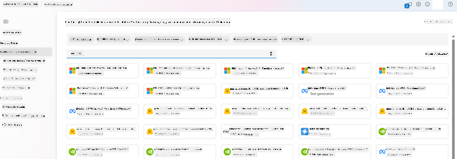

## Підготовка до тонкого налаштування

### Вимоги

> [!NOTE]
> Для моделей сімейства Phi-3 пропозиція тонкого налаштування за моделлю оплати за використання доступна лише для хабів, створених у регіонах **East US 2**.

- Підписка Azure. Якщо у вас немає підписки Azure, створіть [платний обліковий запис Azure](https://azure.microsoft.com/pricing/purchase-options/pay-as-you-go), щоб почати.

- Проєкт [AI Foundry](https://ai.azure.com?WT.mc_id=aiml-138114-kinfeylo).
- Для надання доступу до операцій в Azure AI Foundry використовується контроль доступу на основі ролей Azure (Azure RBAC). Щоб виконати кроки цієї статті, вашому обліковому запису користувача має бути призначена __роль Azure AI Developer__ у групі ресурсів.

### Реєстрація провайдера підписки

Переконайтеся, що підписка зареєстрована у провайдера ресурсів `Microsoft.Network`.

1. Увійдіть у [Azure портал](https://portal.azure.com).
1. Виберіть **Subscriptions** у лівому меню.
1. Виберіть підписку, яку хочете використовувати.
1. Виберіть **AI project settings** > **Resource providers** у лівому меню.
1. Переконайтеся, що **Microsoft.Network** є у списку провайдерів ресурсів. Якщо ні – додайте його.

### Підготовка даних

Підготуйте ваші навчальні та валідаційні дані для тонкого налаштування моделі. Ваші навчальні та валідаційні набори даних повинні містити приклади вхідних і вихідних даних, які демонструють, як ви хочете, щоб модель працювала.

Переконайтеся, що всі навчальні приклади відповідають очікуваному формату для інференсу. Для ефективного тонкого налаштування моделей забезпечте збалансований і різноманітний набір даних.

Це включає підтримку балансу даних, включення різних сценаріїв і періодичне оновлення навчальних даних, щоб вони відповідали реальним очікуванням, що в кінцевому результаті призводить до більш точних і збалансованих відповідей моделі.

Різні типи моделей вимагають різного формату навчальних даних.

### Chat Completion

Навчальні та валідаційні дані, які ви використовуєте, **повинні** бути відформатовані у вигляді документа JSON Lines (JSONL). Для `Phi-3-mini-128k-instruct` набір даних для тонкого налаштування має бути у форматі розмови, який використовується API Chat completions.

### Приклад формату файлу

```json
    {"messages": [{"role": "system", "content": "You are an Xbox customer support agent whose primary goal is to help users with issues they are experiencing with their Xbox devices. You are friendly and concise. You only provide factual answers to queries, and do not provide answers that are not related to Xbox."}, {"role": "user", "content": "Is Xbox better than PlayStation?"}, {"role": "assistant", "content": "I apologize, but I cannot provide personal opinions. My primary job is to assist you with any issues related to your Xbox device. Do you have any Xbox-related issues that need addressing?"}]}
    {"messages": [{"role": "system", "content": "You are an Xbox customer support agent whose primary goal is to help users with issues they are experiencing with their Xbox devices. You are friendly and concise. You only provide factual answers to queries, and do not provide answers that are not related to Xbox."}, {"role": "user", "content": "Can I play PC games on my Xbox?"}, {"role": "assistant", "content": "While Xbox consoles don't natively support PC games, they can play an array of Xbox games, many of which are also available on PC. Can I assist you with finding games compatible with your Xbox device?"}]}
    {"messages": [{"role": "system", "content": "You are an Xbox customer support agent whose primary goal is to help users with issues they are experiencing with their Xbox devices. You are friendly and concise. You only provide factual answers to queries, and do not provide answers that are not related to Xbox."}, {"role": "user", "content": "I'm having trouble connecting my Xbox to the Wi-Fi."}, {"role": "assistant", "content": "No worries, let's go through the network settings on your Xbox. Can you please tell me what happens when you try to connect it to the Wi-Fi?"}]}
```

Підтримуваний тип файлу – JSON Lines. Файли завантажуються у сховище за замовчуванням і стають доступними у вашому проєкті.

## Тонке налаштування Phi-3 за допомогою Azure AI Foundry

Azure AI Foundry дозволяє налаштовувати великі мовні моделі під ваші власні набори даних за допомогою процесу, відомого як тонке налаштування. Тонке налаштування дає значну користь, дозволяючи кастомізувати та оптимізувати модель для конкретних завдань і застосунків. Це покращує продуктивність, знижує витрати, зменшує затримки та забезпечує більш релевантні результати.

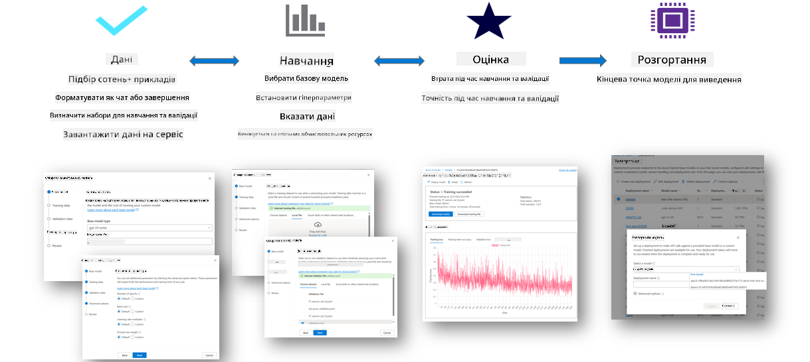

### Створення нового проєкту

1. Увійдіть у [Azure AI Foundry](https://ai.azure.com).

1. Виберіть **+New project**, щоб створити новий проєкт у Azure AI Foundry.

    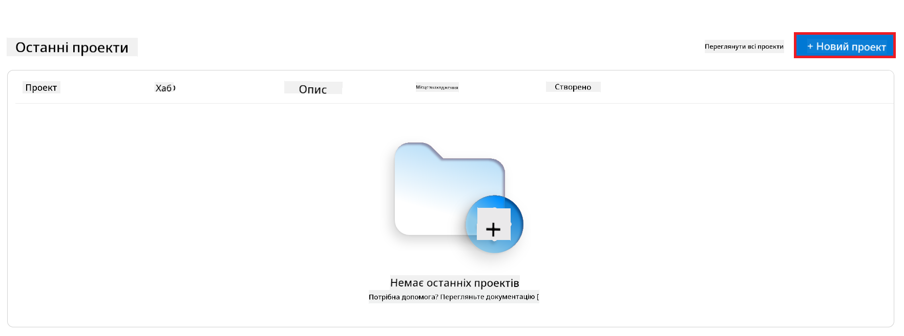

1. Виконайте наступні дії:

    - Вкажіть унікальне ім’я **Hub name**.
    - Виберіть **Hub** для використання (створіть новий, якщо потрібно).

    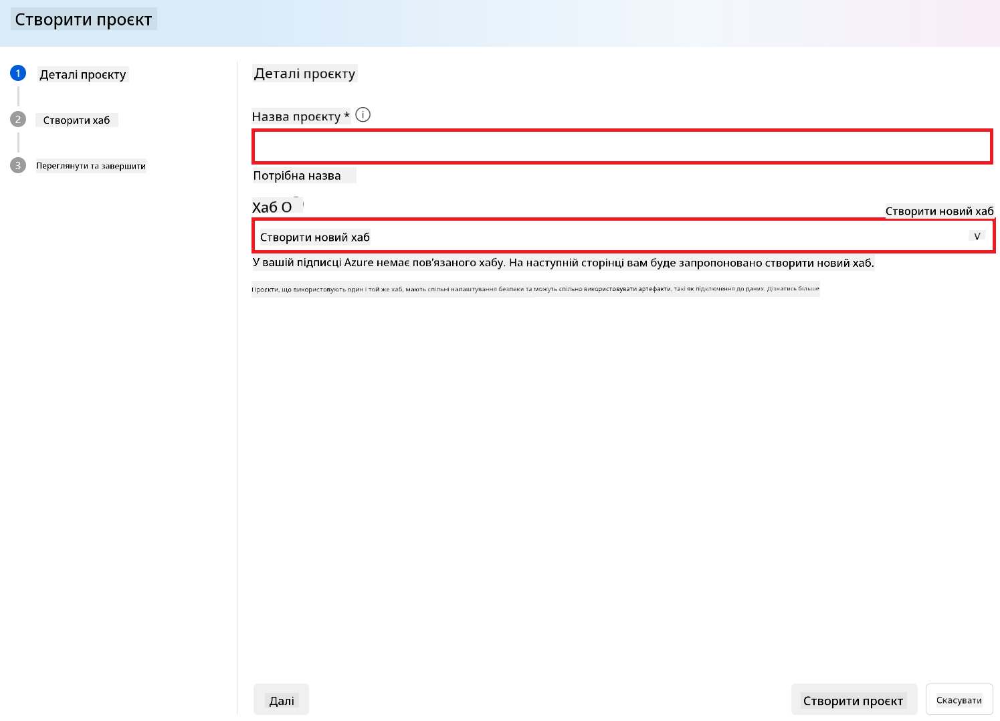

1. Виконайте наступні дії для створення нового хабу:

    - Введіть унікальне ім’я **Hub name**.
    - Виберіть вашу підписку Azure (**Subscription**).
    - Виберіть групу ресурсів (**Resource group**) для використання (створіть нову, якщо потрібно).
    - Виберіть регіон (**Location**), який хочете використовувати.
    - Виберіть **Connect Azure AI Services** для підключення (створіть нове, якщо потрібно).
    - Виберіть **Connect Azure AI Search** і оберіть **Skip connecting**.

    

1. Виберіть **Next**.
1. Виберіть **Create a project**.

### Підготовка даних

Перед тонким налаштуванням зберіть або створіть набір даних, релевантний вашому завданню, наприклад, інструкції для чату, пари запитання-відповідь або інші відповідні текстові дані. Очистіть і попередньо обробіть ці дані, видаливши шум, обробивши пропущені значення та токенізувавши текст.

### Тонке налаштування моделей Phi-3 в Azure AI Foundry

> [!NOTE]
> Тонке налаштування моделей Phi-3 наразі підтримується лише у проєктах, розташованих у регіоні East US 2.

1. Виберіть **Model catalog** у лівій панелі.

1. Введіть *phi-3* у **рядок пошуку** і виберіть модель phi-3, яку хочете використовувати.

    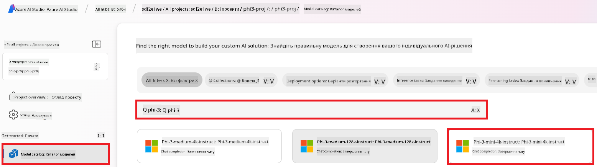

1. Виберіть **Fine-tune**.

    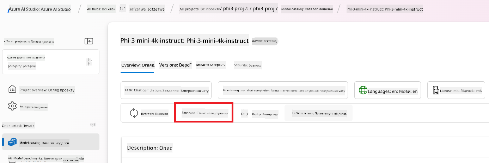

1. Введіть ім’я для **Fine-tuned model name**.

    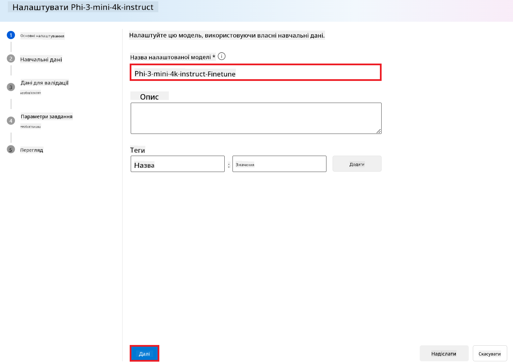

1. Виберіть **Next**.

1. Виконайте наступні дії:

    - Виберіть тип завдання (**task type**) – **Chat completion**.
    - Виберіть навчальні дані (**Training data**), які хочете використати. Ви можете завантажити їх через сховище Azure AI Foundry або з локального середовища.

    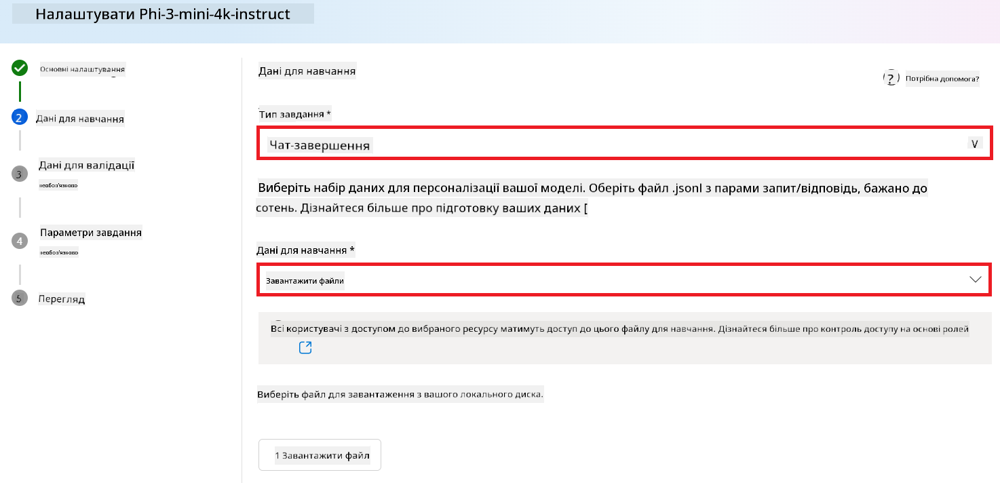

1. Виберіть **Next**.

1. Завантажте валідаційні дані (**Validation data**), які хочете використати, або оберіть **Automatic split of training data**.

    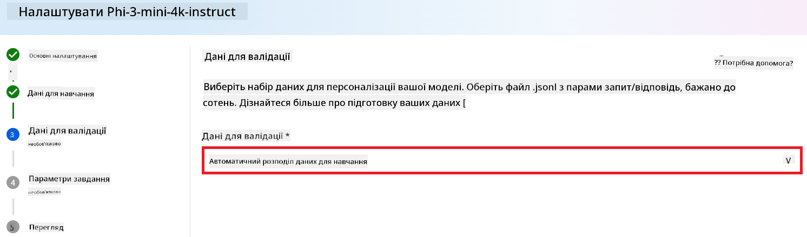

1. Виберіть **Next**.

1. Виконайте наступні дії:

    - Виберіть множник розміру пакету (**Batch size multiplier**).
    - Виберіть швидкість навчання (**Learning rate**).
    - Виберіть кількість епох (**Epochs**).

    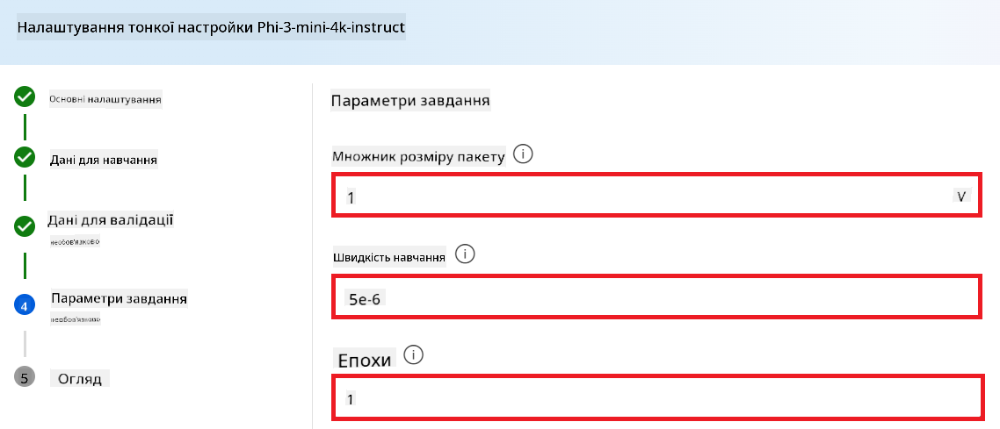

1. Виберіть **Submit**, щоб розпочати процес тонкого налаштування.

    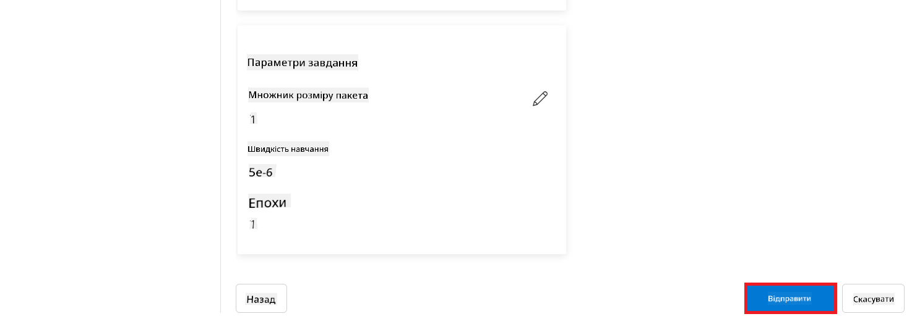

1. Після завершення тонкого налаштування статус моделі відобразиться як **Completed**, як показано на зображенні нижче. Тепер ви можете розгорнути модель і використовувати її у власному застосунку, у playground або в prompt flow. Для детальнішої інформації дивіться [Як розгорнути сімейство малих мовних моделей Phi-3 з Azure AI Foundry](https://learn.microsoft.com/azure/ai-studio/how-to/deploy-models-phi-3?tabs=phi-3-5&pivots=programming-language-python).

    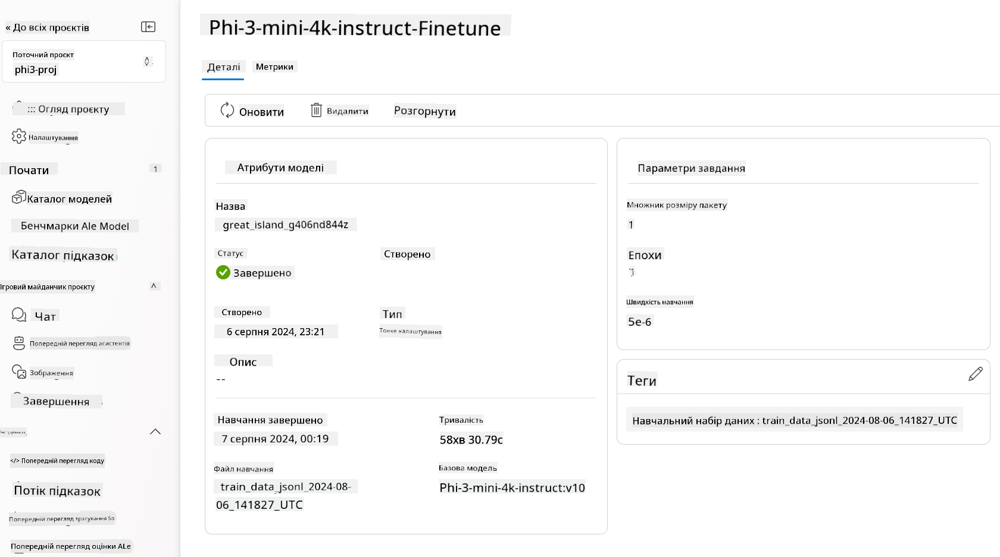

> [!NOTE]
> Для більш детальної інформації про тонке налаштування Phi-3 відвідайте [Fine-tune Phi-3 models in Azure AI Foundry](https://learn.microsoft.com/azure/ai-studio/how-to/fine-tune-phi-3?tabs=phi-3-mini).

## Видалення тонко налаштованих моделей

Ви можете видалити тонко налаштовану модель зі списку моделей для тонкого налаштування в [Azure AI Foundry](https://ai.azure.com) або зі сторінки деталей моделі. Виберіть модель для видалення на сторінці тонкого налаштування, а потім натисніть кнопку Delete, щоб видалити модель.

> [!NOTE]
> Ви не можете видалити кастомну модель, якщо вона має активне розгортання. Спочатку потрібно видалити розгортання моделі, перш ніж видаляти саму модель.

## Вартість і квоти

### Вартість і квоти для моделей Phi-3, тонко налаштованих як сервіс

Моделі Phi, тонко налаштовані як сервіс, пропонуються Microsoft і інтегровані з Azure AI Foundry для використання. Ви можете дізнатися ціни під час [розгортання](https://learn.microsoft.com/azure/ai-studio/how-to/deploy-models-phi-3?tabs=phi-3-5&pivots=programming-language-python) або тонкого налаштування моделей у вкладці Pricing and terms у майстрі розгортання.

## Фільтрація контенту

Моделі, розгорнуті як сервіс за моделлю оплати за використання, захищені Azure AI Content Safety. Під час розгортання на кінцевих точках у реальному часі ви можете відмовитися від цієї функції. З увімкненою Azure AI Content Safety як запит, так і відповідь проходять через ансамбль класифікаційних моделей, спрямованих на виявлення та запобігання виводу шкідливого контенту. Система фільтрації контенту виявляє та реагує на певні категорії потенційно шкідливого контенту як у вхідних запитах, так і у відповідях. Дізнайтеся більше про [Azure AI Content Safety](https://learn.microsoft.com/azure/ai-studio/concepts/content-filtering).

**Конфігурація тонкого налаштування**

Гіперпараметри: Визначте гіперпараметри, такі як швидкість навчання, розмір пакету та кількість епох.

**Функція втрат**

Виберіть відповідну функцію втрат для вашого завдання (наприклад, крос-ентропія).

**Оптимізатор**

Виберіть оптимізатор (наприклад, Adam) для оновлення градієнтів під час навчання.

**Процес тонкого налаштування**

- Завантаження попередньо навченого чекпойнта моделі Phi-3 Mini.
- Додавання кастомних шарів: додайте шари, специфічні для завдання (наприклад, голова класифікації для інструкцій чату).

**Навчання моделі**  
Тонко налаштуйте модель, використовуючи підготовлений набір даних. Слідкуйте за прогресом навчання та за потреби коригуйте гіперпараметри.

**Оцінка та валідація**

Валідаційний набір: розділіть дані на навчальний та валідаційний набори.

**Оцінка продуктивності**

Використовуйте метрики, такі як точність, F1-міра або perplexity, для оцінки роботи моделі.

## Збереження тонко налаштованої моделі

**Чекпойнт**  
Збережіть чекпойнт тонко налаштованої моделі для подальшого використання.

## Розгортання

- Розгортання як веб-сервіс: розгорніть тонко налаштовану модель як веб-сервіс у Azure AI Foundry.
- Тестування кінцевої точки: надсилайте тестові запити до розгорнутої кінцевої точки, щоб перевірити її функціональність.

## Ітерації та покращення

Ітеруйте: якщо продуктивність не задовольняє, коригуйте гіперпараметри, додавайте більше даних або виконуйте тонке налаштування на додаткових епохах.

## Моніторинг і вдосконалення

Постійно відстежуйте поведінку моделі та вдосконалюйте її за потреби.

## Налаштування та розширення

Кастомні завдання: Phi-3 Mini можна тонко налаштовувати для різних завдань, окрім інструкцій для чату. Досліджуйте інші варіанти використання!  
Експериментуйте: пробуйте різні архітектури, комбінації шарів і техніки для покращення продуктивності.

> [!NOTE]
> Тонке налаштування – це ітеративний процес. Експериментуйте, вчіться і адаптуйте модель, щоб досягти найкращих результатів для вашого конкретного завдання!

**Відмова від відповідальності**:  
Цей документ було перекладено за допомогою сервісу автоматичного перекладу [Co-op Translator](https://github.com/Azure/co-op-translator). Хоча ми прагнемо до точності, будь ласка, майте на увазі, що автоматичні переклади можуть містити помилки або неточності. Оригінальний документ рідною мовою слід вважати авторитетним джерелом. Для критично важливої інформації рекомендується звертатися до професійного людського перекладу. Ми не несемо відповідальності за будь-які непорозуміння або неправильні тлумачення, що виникли внаслідок використання цього перекладу.