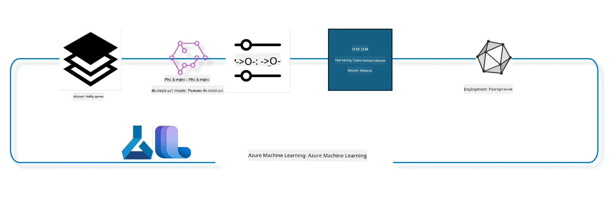

## Як використовувати компоненти chat-completion із реєстру системи Azure ML для тонкого налаштування моделі

У цьому прикладі ми виконаємо тонке налаштування моделі Phi-3-mini-4k-instruct, щоб завершити розмову між 2 людьми, використовуючи набір даних ultrachat_200k.



Приклад покаже, як виконати тонке налаштування за допомогою Azure ML SDK і Python, а потім розгорнути модель з тонким налаштуванням до онлайн кінцевої точки для інференсу в реальному часі.

### Дані для навчання

Ми використаємо набір даних ultrachat_200k. Це сильно відфільтрована версія набору даних UltraChat, яка використовувалася для навчання Zephyr-7B-β, передової чат-моделі на 7 млрд параметрів.

### Модель

Ми використаємо модель Phi-3-mini-4k-instruct, щоб показати, як користувач може тонко налаштувати модель для завдання завершення чатів. Якщо ви відкрили цей ноутбук з певної картки моделі, не забудьте замінити назву моделі на відповідну.

### Завдання

- Вибрати модель для тонкого налаштування.
- Вибрати та дослідити дані для навчання.
- Налаштувати роботу тонкого налаштування.
- Запустити роботу тонкого налаштування.
- Переглянути метрики навчання та оцінки.
- Зареєструвати модель з тонким налаштуванням.
- Розгорнути модель з тонким налаштуванням для інференсу в реальному часі.
- Звільнити ресурси.

## 1. Встановлення передумов

- Встановити залежності
- Підключитися до робочої області AzureML. Дізнайтеся більше в документації про налаштування автентифікації SDK. Замініть <WORKSPACE_NAME>, <RESOURCE_GROUP> та <SUBSCRIPTION_ID> нижче.
- Підключитися до реєстру системи azureml
- Встановити необов’язкову назву експерименту
- Перевірити або створити обчислювальний ресурс.

> [!NOTE]
> Вимоги: один вузол GPU може мати кілька графічних карт. Наприклад, у одному вузлі Standard_NC24rs_v3 є 4 NVIDIA V100 GPU, тоді як у Standard_NC12s_v3 їх 2. Зверніться до документації для отримання цієї інформації. Кількість GPU-карт на вузол задається в параметрі gpus_per_node нижче. Правильна установка цього значення гарантує використання всіх GPU на вузлі. Рекомендовані SKU обчислювального ресурсу GPU можна знайти тут і тут.

### Бібліотеки Python

Встановіть залежності, виконавши нижченаведену клітинку. Це не опціональний крок, якщо ви працюєте в новому середовищі.

```bash
pip install azure-ai-ml
pip install azure-identity
pip install datasets==2.9.0
pip install mlflow
pip install azureml-mlflow
```

### Взаємодія з Azure ML

1. Цей Python-скрипт використовується для взаємодії з сервісом Azure Machine Learning (Azure ML). Ось, що він робить:

    - Імпортує необхідні модулі з пакетів azure.ai.ml, azure.identity та azure.ai.ml.entities. Також імпортує модуль time.

    - Прагне автентифікуватися за допомогою DefaultAzureCredential(), що забезпечує спрощений досвід автентифікації для швидкої розробки додатків у хмарі Azure. Якщо це не вдається, переходить до InteractiveBrowserCredential(), що відкриває інтерактивний запит на вхід.

    - Далі намагається створити екземпляр MLClient за допомогою методу from_config, який зчитує конфігурацію з файлу config.json. Якщо це не вдається, створює MLClient, вручну передаючи subscription_id, resource_group_name та workspace_name.

    - Створює інший екземпляр MLClient, цього разу для реєстру Azure ML під назвою "azureml". Цей реєстр призначений для збереження моделей, пайплайнів тонкого налаштування та середовищ.

    - Встановлює ім’я експерименту "chat_completion_Phi-3-mini-4k-instruct".

    - Генерує унікальний часовий штамп, конвертуючи поточний час (у секундах з початку епохи, як число з плаваючою крапкою) в ціле число та потім у рядок. Цей штамп можна використовувати для створення унікальних імен і версій.

    ```python
    # Імпортуйте необхідні модулі з Azure ML та Azure Identity
    from azure.ai.ml import MLClient
    from azure.identity import (
        DefaultAzureCredential,
        InteractiveBrowserCredential,
    )
    from azure.ai.ml.entities import AmlCompute
    import time  # Імпортуйте модуль time
    
    # Спробуйте автентифікуватися, використовуючи DefaultAzureCredential
    try:
        credential = DefaultAzureCredential()
        credential.get_token("https://management.azure.com/.default")
    except Exception as ex:  # Якщо DefaultAzureCredential не вдається, використовуйте InteractiveBrowserCredential
        credential = InteractiveBrowserCredential()
    
    # Спробуйте створити екземпляр MLClient, використовуючи файл конфігурації за замовчуванням
    try:
        workspace_ml_client = MLClient.from_config(credential=credential)
    except:  # Якщо це не вдається, створіть екземпляр MLClient, вручну надаючи деталі
        workspace_ml_client = MLClient(
            credential,
            subscription_id="<SUBSCRIPTION_ID>",
            resource_group_name="<RESOURCE_GROUP>",
            workspace_name="<WORKSPACE_NAME>",
        )
    
    # Створіть ще один екземпляр MLClient для реєстру Azure ML з ім’ям "azureml"
    # Цей реєстр використовується для зберігання моделей, конвеєрів донавчання та оточень
    registry_ml_client = MLClient(credential, registry_name="azureml")
    
    # Встановіть ім’я експерименту
    experiment_name = "chat_completion_Phi-3-mini-4k-instruct"
    
    # Згенеруйте унікальну відмітку часу, яку можна використовувати для імен та версій, що потребують унікальності
    timestamp = str(int(time.time()))
    ```

## 2. Вибір базової моделі для тонкого налаштування

1. Phi-3-mini-4k-instruct — це легка відкритої архітектури модель із 3,8 млрд параметрів, створена на основі наборів даних для Phi-2. Модель належить до сімейства Phi-3, а версія Mini представлена двома варіантами — 4K і 128K, які позначають довжину контексту (у токенах), яку модель підтримує. Нам потрібно тонко налаштувати модель для нашої конкретної мети. Ви можете переглядати ці моделі в каталозі моделей AzureML Studio, фільтруючи за завданням chat-completion. У цьому прикладі ми використовуємо модель Phi-3-mini-4k-instruct. Якщо ви відкрили цей ноутбук для іншої моделі, замініть назву та версію моделі відповідно.

> [!NOTE]
> Ідентифікатор моделі (model id) є властивістю моделі. Він буде переданий як вхідні дані до роботи тонкого налаштування. Цей ідентифікатор також доступний у полі Asset ID на сторінці деталей моделі в каталозі моделей AzureML Studio.

2. Цей Python-скрипт взаємодіє з сервісом Azure Machine Learning (Azure ML). Ось що він виконує:

    - Встановлює model_name як "Phi-3-mini-4k-instruct".

    - Використовує метод get властивості models об’єкта registry_ml_client для отримання останньої версії моделі з Azure ML реєстру за вказаною назвою. Функція get викликається з двома аргументами: ім’я моделі і мітка, що вказує на доступність останньої версії.

    - Виводить у консоль повідомлення про назву, версію та ідентифікатор моделі, яка буде використана для тонкого налаштування. Метод format рядка використовується для вставки цих значень. Назву, версію та id моделі беруть із властивостей foundation_model.

    ```python
    # Встановити ім'я моделі
    model_name = "Phi-3-mini-4k-instruct"
    
    # Отримати останню версію моделі з реєстру Azure ML
    foundation_model = registry_ml_client.models.get(model_name, label="latest")
    
    # Вивести ім'я моделі, версію та ідентифікатор
    # Ця інформація корисна для відстеження та налагодження
    print(
        "\n\nUsing model name: {0}, version: {1}, id: {2} for fine tuning".format(
            foundation_model.name, foundation_model.version, foundation_model.id
        )
    )
    ```

## 3. Створення обчислювального ресурсу, який буде використаний для роботи

Робота тонкого налаштування працює ЛИШЕ з обчислювальним ресурсом GPU. Розмір ресурсу залежить від розміру моделі, і в багатьох випадках визначити правильний ресурс буває складно. У цій клітинці ми допомагаємо користувачу обрати правильний обчислювальний ресурс.

> [!NOTE]
> Нижчеописані ресурси працюють із найбільш оптимізованою конфігурацією. Будь-які зміни можуть викликати помилку "Cuda Out Of Memory". У таких випадках спробуйте збільшити розмір ресурсу.

> [!NOTE]
> Під час вибору compute_cluster_size переконайтесь, що ресурс доступний у вашій групі ресурсів. Якщо певний ресурс недоступний, можна подати запит на отримання доступу.

### Перевірка підтримки моделі для тонкого налаштування

1. Цей Python-скрипт працює з моделлю Azure Machine Learning (Azure ML). Ось пояснення, що він робить:

    - Імпортує модуль ast, який надає функції для обробки дерев абстрактного синтаксису Python.

    - Перевіряє, чи має об’єкт foundation_model (що представляє модель Azure ML) тег finetune_compute_allow_list. Теги в Azure ML — це пари ключ-значення, які можна використовувати для фільтрації чи сортування моделей.

    - Якщо тег finetune_compute_allow_list присутній, він використовує ast.literal_eval для безпечного розбору рядкового значення тегу в список Python. Цей список присвоюється змінній computes_allow_list. Після цього виводить повідомлення, що обчислювальний ресурс слід брати зі списку.

    - Якщо тег finetune_compute_allow_list відсутній, встановлює computes_allow_list в None та виводить повідомлення, що тег не є частиною тегів моделі.

    - Підсумовуючи, цей скрипт перевіряє наявність конкретного тегу у метаданих моделі, конвертує значення тегу у список за наявності та відповідно інформує користувача.

    ```python
    # Імпортуйте модуль ast, який надає функції для обробки дерев абстрактного синтаксису Python
    import ast
    
    # Перевірте, чи присутній тег 'finetune_compute_allow_list' у тегах моделі
    if "finetune_compute_allow_list" in foundation_model.tags:
        # Якщо тег присутній, використовуйте ast.literal_eval для безпечного розбору значення тегу (рядка) у список Python
        computes_allow_list = ast.literal_eval(
            foundation_model.tags["finetune_compute_allow_list"]
        )  # конвертувати рядок у список Python
        # Виведіть повідомлення, що вказує на те, що потрібно створити compute зі списку
        print(f"Please create a compute from the above list - {computes_allow_list}")
    else:
        # Якщо тег відсутній, встановіть computes_allow_list у None
        computes_allow_list = None
        # Виведіть повідомлення, що тег 'finetune_compute_allow_list' не є частиною тегів моделі
        print("`finetune_compute_allow_list` is not part of model tags")
    ```

### Перевірка обчислювального інстансу

1. Цей Python-скрипт взаємодіє з сервісом Azure Machine Learning (Azure ML) та виконує декілька перевірок обчислювального інстансу. Ось що він робить:

    - Прагне отримати обчислювальний інстанс з ім’ям compute_cluster з робочої області Azure ML. Якщо стан створення інстансу "failed", він викликає помилку ValueError.

    - Перевіряє, чи змінна computes_allow_list не None. Якщо ні, приводить всі розміри обчислювальних ресурсів у списку до нижнього регістру та перевіряє, чи є розмір поточного інстансу в цьому списку. Якщо ні — викликає ValueError.

    - Якщо computes_allow_list дорівнює None, перевіряє, чи розмір інстансу GPU є в списку непідтримуваних розмірів віртуальних машин. Якщо так — викликає ValueError.

    - Отримує список усіх доступних розмірів обчислювальних ресурсів у робочій області. Перебирає цей список і шукає розмір, який співпадає з поточним. Якщо знаходить співпадіння, дістає кількість GPU для цього розміру і встановлює прапорець gpu_count_found у True.

    - Якщо gpu_count_found True, виводить кількість GPU у обчислювальному інстансі. Якщо False — викликає ValueError.

    - Підсумовуючи, цей скрипт виконує кілька перевірок обчислювального інстансу в Azure ML: стан створення, відповідність дозволеному чи забороненому списку розмірів, а також наявність GPU.

    ```python
    # Вивести повідомлення виключення
    print(e)
    # Викинути ValueError, якщо розмір обчислення недоступний у робочому просторі
    raise ValueError(
        f"WARNING! Compute size {compute_cluster_size} not available in workspace"
    )
    
    # Отримати обчислювальний екземпляр з робочого простору Azure ML
    compute = workspace_ml_client.compute.get(compute_cluster)
    # Перевірити, чи стан забезпечення обчислювального екземпляра є "failed"
    if compute.provisioning_state.lower() == "failed":
        # Викинути ValueError, якщо стан забезпечення "failed"
        raise ValueError(
            f"Provisioning failed, Compute '{compute_cluster}' is in failed state. "
            f"please try creating a different compute"
        )
    
    # Перевірити, чи computes_allow_list не дорівнює None
    if computes_allow_list is not None:
        # Перетворити всі розміри обчислень у computes_allow_list на малі літери
        computes_allow_list_lower_case = [x.lower() for x in computes_allow_list]
        # Перевірити, чи розмір обчислювального екземпляра є в computes_allow_list_lower_case
        if compute.size.lower() not in computes_allow_list_lower_case:
            # Викинути ValueError, якщо розмір обчислювального екземпляра відсутній у computes_allow_list_lower_case
            raise ValueError(
                f"VM size {compute.size} is not in the allow-listed computes for finetuning"
            )
    else:
        # Визначити список непідтримуваних розмірів GPU VM
        unsupported_gpu_vm_list = [
            "standard_nc6",
            "standard_nc12",
            "standard_nc24",
            "standard_nc24r",
        ]
        # Перевірити, чи розмір обчислювального екземпляра є в unsupported_gpu_vm_list
        if compute.size.lower() in unsupported_gpu_vm_list:
            # Викинути ValueError, якщо розмір обчислювального екземпляра є в unsupported_gpu_vm_list
            raise ValueError(
                f"VM size {compute.size} is currently not supported for finetuning"
            )
    
    # Ініціалізувати прапорець для перевірки, чи знайдено кількість GPU в обчислювальному екземплярі
    gpu_count_found = False
    # Отримати список усіх доступних розмірів обчислень у робочому просторі
    workspace_compute_sku_list = workspace_ml_client.compute.list_sizes()
    available_sku_sizes = []
    # Перебрати список доступних розмірів обчислень
    for compute_sku in workspace_compute_sku_list:
        available_sku_sizes.append(compute_sku.name)
        # Перевірити, чи ім'я розміру обчислення співпадає з розміром обчислювального екземпляра
        if compute_sku.name.lower() == compute.size.lower():
            # Якщо так, отримати кількість GPU для цього розміру обчислення і встановити gpu_count_found в True
            gpus_per_node = compute_sku.gpus
            gpu_count_found = True
    # Якщо gpu_count_found дорівнює True, вивести кількість GPU в обчислювальному екземплярі
    if gpu_count_found:
        print(f"Number of GPU's in compute {compute.size}: {gpus_per_node}")
    else:
        # Якщо gpu_count_found дорівнює False, викинути ValueError
        raise ValueError(
            f"Number of GPU's in compute {compute.size} not found. Available skus are: {available_sku_sizes}."
            f"This should not happen. Please check the selected compute cluster: {compute_cluster} and try again."
        )
    ```

## 4. Вибір набору даних для тонкого налаштування моделі

1. Ми використовуємо набір даних ultrachat_200k. Набір містить чотири частини, придатні для супервайзингованого тонкого налаштування (sft).
Рейтинг генерації (gen). Кількість прикладів у кожній частині наведена нижче:

    ```bash
    train_sft test_sft  train_gen  test_gen
    207865  23110  256032  28304
    ```

1. Наступні кілька клітинок показують базову підготовку даних для тонкого налаштування:

### Візуалізація кількох рядків даних

Ми хочемо, щоб цей приклад швидко виконався, тому збережемо файли train_sft, test_sft, що містять 5% вже відрізаних рядків. Це означає, що модель з тонким налаштуванням матиме меншу точність, тож її не слід використовувати у реальних сценаріях.
Скрипт download-dataset.py використовується для завантаження набору ultrachat_200k та трансформації даних у формат, придатний для компонента пайплайна тонкого налаштування. Оскільки набір великий, тут показано лише частину даних.

1. Запуск наведеного нижче скрипту завантажує лише 5% даних. Можна збільшити кількість, змінивши параметр dataset_split_pc на потрібний відсоток.

> [!NOTE]
> Деякі мовні моделі мають різні коди мов, тому назви стовпців у наборі даних мають відповідати цим кодам.

1. Ось приклад, як повинні виглядати дані.
Набір даних chat-completion збережений у форматі parquet, кожен запис використовує наступну схему:

    - Це JSON (JavaScript Object Notation) документ, популярний формат обміну даними. Це не виконуваний код, а спосіб зберігання й передачі даних. Ось пояснення структури:

    - "prompt": ключ містить рядок — завдання або питання, задане AI-помічнику.

    - "messages": ключ містить масив об’єктів. Кожен об’єкт — це повідомлення у розмові між користувачем і AI-помічником. Кожне повідомлення має два ключі:

    - "content": рядок, що містить вміст повідомлення.
    - "role": рядок, що визначає роль відправника — "user" або "assistant".
    - "prompt_id": рядок, що є унікальним ідентифікатором запиту.

1. У цьому конкретному JSON-документі представлена розмова, де користувач просить AI-помічника створити головного героя для дистопічної історії. Помічник відповідає, користувач просить більше деталей, і помічник погоджується надати їх. Вся розмова пов’язана з конкретним prompt id.

    ```python
    {
        // The task or question posed to an AI assistant
        "prompt": "Create a fully-developed protagonist who is challenged to survive within a dystopian society under the rule of a tyrant. ...",
        
        // An array of objects, each representing a message in a conversation between a user and an AI assistant
        "messages":[
            {
                // The content of the user's message
                "content": "Create a fully-developed protagonist who is challenged to survive within a dystopian society under the rule of a tyrant. ...",
                // The role of the entity that sent the message
                "role": "user"
            },
            {
                // The content of the assistant's message
                "content": "Name: Ava\n\n Ava was just 16 years old when the world as she knew it came crashing down. The government had collapsed, leaving behind a chaotic and lawless society. ...",
                // The role of the entity that sent the message
                "role": "assistant"
            },
            {
                // The content of the user's message
                "content": "Wow, Ava's story is so intense and inspiring! Can you provide me with more details.  ...",
                // The role of the entity that sent the message
                "role": "user"
            }, 
            {
                // The content of the assistant's message
                "content": "Certainly! ....",
                // The role of the entity that sent the message
                "role": "assistant"
            }
        ],
        
        // A unique identifier for the prompt
        "prompt_id": "d938b65dfe31f05f80eb8572964c6673eddbd68eff3db6bd234d7f1e3b86c2af"
    }
    ```

### Завантаження даних

1. Цей Python-скрипт використовується для завантаження набору даних за допомогою допоміжного скрипта download-dataset.py. Ось, що він робить:

    - Імпортує модуль os, що надає кросплатформений доступ до функцій операційної системи.

    - Використовує os.system для запуску скрипта download-dataset.py у командному рядку з певними аргументами. Аргументи вказують набір даних для завантаження (HuggingFaceH4/ultrachat_200k), каталог для збереження (ultrachat_200k_dataset) та відсоток розрізання набору (5). os.system повертає код виходу, який зберігається у змінній exit_status.

    - Перевіряє, чи exit_status не 0. У Unix-подібних системах 0 вказує на успіх, інші значення — на помилку. Якщо не 0, викликає Exception із повідомленням про помилку завантаження.

    - Підсумовуючи, скрипт запускає команду для завантаження набору даних за допомогою допоміжного скрипта і викидає помилку, якщо команда не виконалась успішно.

    ```python
    # Імпортуйте модуль os, який надає спосіб використання функціональності, залежної від операційної системи
    import os
    
    # Використовуйте функцію os.system для запуску скрипта download-dataset.py в оболонці з конкретними аргументами командного рядка
    # Аргументи вказують датасет для завантаження (HuggingFaceH4/ultrachat_200k), каталог для завантаження (ultrachat_200k_dataset) і відсоток датасету для розподілу (5)
    # Функція os.system повертає код завершення виконаної команди; цей код зберігається у змінній exit_status
    exit_status = os.system(
        "python ./download-dataset.py --dataset HuggingFaceH4/ultrachat_200k --download_dir ultrachat_200k_dataset --dataset_split_pc 5"
    )
    
    # Перевірте, чи exit_status не дорівнює 0
    # В операційних системах, подібних до Unix, код завершення 0 зазвичай означає, що команда виконалась успішно, тоді як будь-яке інше число вказує на помилку
    # Якщо exit_status не дорівнює 0, викличте виключення Exception з повідомленням про помилку під час завантаження датасету
    if exit_status != 0:
        raise Exception("Error downloading dataset")
    ```

### Завантаження даних у DataFrame

1. Цей Python-скрипт завантажує файл у форматі JSON Lines у pandas DataFrame і відображає перші 5 рядків. Ось що він робить:

    - Імпортує бібліотеку pandas, яка є потужним інструментом для маніпулювання та аналізу даних.

    - Встановлює максимальну ширину колонок для відображення в pandas на 0, щоб повний текст кожного стовпця відображався без обрізання при виводі DataFrame.
    - Він використовує функцію pd.read_json для завантаження файлу train_sft.jsonl з каталогу ultrachat_200k_dataset у DataFrame. Аргумент lines=True вказує, що файл у форматі JSON Lines, де кожен рядок є окремим JSON-об'єктом.

    - Він використовує метод head для відображення перших 5 рядків DataFrame. Якщо у DataFrame менше 5 рядків, буде показано всі рядки.

    - Підсумовуючи, цей скрипт завантажує файл JSON Lines у DataFrame і відображає перші 5 рядків з повним текстом стовпців.
    
    ```python
    # Імпортуйте бібліотеку pandas, яка є потужною бібліотекою для обробки та аналізу даних
    import pandas as pd
    
    # Встановіть максимальну ширину стовпця для параметрів відображення pandas рівною 0
    # Це означає, що повний текст кожного стовпця буде відображатися без обрізання під час друку DataFrame
    pd.set_option("display.max_colwidth", 0)
    
    # Використовуйте функцію pd.read_json для завантаження файлу train_sft.jsonl з директорії ultrachat_200k_dataset у DataFrame
    # Аргумент lines=True вказує, що файл у форматі JSON Lines, де кожен рядок є окремим об'єктом JSON
    df = pd.read_json("./ultrachat_200k_dataset/train_sft.jsonl", lines=True)
    
    # Використовуйте метод head для відображення перших 5 рядків DataFrame
    # Якщо в DataFrame менше 5 рядків, буде відображено всі з них
    df.head()
    ```

## 5. Надіслати завдання тонкого налаштування, використовуючи модель та дані як вхідні параметри

Створіть завдання, що використовує компонент pipeline для chat-completion. Дізнайтеся більше про всі параметри, що підтримуються для тонкого налаштування.

### Визначення параметрів тонкого налаштування

1. Параметри тонкого налаштування можна розділити на 2 категорії - параметри навчання, параметри оптимізації

1. Параметри навчання визначають аспекти тренування, такі як -

    - Оптимізатор, шедулер для використання
    - Метрика для оптимізації тонкого налаштування
    - Кількість кроків навчання, розмір батчу тощо
    - Параметри оптимізації допомагають оптимізувати пам’ять GPU та ефективно використовувати обчислювальні ресурси.

1. Нижче наведено кілька параметрів, які належать до цієї категорії. Параметри оптимізації відрізняються для кожної моделі і входять у пакет моделі для обробки цих варіацій.

    - Увімкнути deepspeed та LoRA
    - Увімкнути навчання зі змішаною точністю
    - Увімкнути багатонодовий тренінг

> [!NOTE]
> Управлюване тонке налаштування може призвести до втрати вирівнювання або катастрофічного забуття. Ми рекомендуємо перевірити цю проблему і запустити стадію вирівнювання після тонкого налаштування.

### Параметри тонкого налаштування

1. Цей скрипт на Python налаштовує параметри для тонкого налаштування моделі машинного навчання. Ось огляд того, що він робить:

    - Він встановлює параметри навчання за замовчуванням, такі як кількість епох навчання, розмір батчів для тренування і оцінки, швидкість навчання та тип шедулера швидкості навчання.

    - Він встановлює параметри оптимізації за замовчуванням, такі як застосування Layer-wise Relevance Propagation (LoRa) та DeepSpeed, а також стадію DeepSpeed.

    - Об'єднує параметри навчання та параметри оптимізації в один словник finetune_parameters.

    - Перевіряє, чи має foundation_model якісь модель-специфічні параметри за замовчуванням. Якщо так, виводить попередження та оновлює словник finetune_parameters цими параметрами. Функція ast.literal_eval використовується для перетворення рядка з модель-специфічними параметрами на словник Python.

    - Виводить кінцевий набір параметрів тонкого налаштування, які будуть використані для запуску.

    - Підсумовуючи, цей скрипт налаштовує та відображає параметри для тонкого налаштування моделі машинного навчання, з можливістю заміни стандартних параметрів модель-специфічними.

    ```python
    # Встановіть стандартні параметри навчання, такі як кількість епох навчання, розміри пакетів для навчання та оцінки, швидкість навчання та тип планувальника швидкості навчання
    training_parameters = dict(
        num_train_epochs=3,
        per_device_train_batch_size=1,
        per_device_eval_batch_size=1,
        learning_rate=5e-6,
        lr_scheduler_type="cosine",
    )
    
    # Встановіть стандартні параметри оптимізації, такі як застосування покрокової релевантності (LoRa) та DeepSpeed, а також стадію DeepSpeed
    optimization_parameters = dict(
        apply_lora="true",
        apply_deepspeed="true",
        deepspeed_stage=2,
    )
    
    # Об’єднайте параметри навчання та оптимізації в один словник під назвою finetune_parameters
    finetune_parameters = {**training_parameters, **optimization_parameters}
    
    # Перевірте, чи має foundation_model якісь специфічні для моделі стандартні параметри
    # Якщо має, виведіть попереджувальне повідомлення і оновіть словник finetune_parameters цими специфічними для моделі стандартами
    # Функція ast.literal_eval використовується для перетворення специфічних для моделі стандартів зі рядка у словник Python
    if "model_specific_defaults" in foundation_model.tags:
        print("Warning! Model specific defaults exist. The defaults could be overridden.")
        finetune_parameters.update(
            ast.literal_eval(  # перетворити рядок на python словник
                foundation_model.tags["model_specific_defaults"]
            )
        )
    
    # Виведіть кінцевий набір параметрів тонкого налаштування, які будуть використані для запуску
    print(
        f"The following finetune parameters are going to be set for the run: {finetune_parameters}"
    )
    ```

### Тренувальний конвеєр

1. Цей скрипт на Python визначає функцію для створення відображуваного імені тренувального конвеєра машинного навчання, а потім викликає цю функцію для генерації імені та його виведення. Ось огляд того, що він робить:

1. Визначена функція get_pipeline_display_name. Вона генерує ім’я для відображення на основі різних параметрів, пов’язаних із тренувальним конвеєром.

1. Всередині функції обчислюється загальний розмір батчу шляхом множення розміру батчу на пристрій, кількості кроків накопичення градієнта, кількості GPU на вузол та кількості вузлів, які використовуються для тонкого налаштування.

1. Отримуються інші параметри, такі як тип шедулера швидкості навчання, чи застосовується DeepSpeed, стадія DeepSpeed, чи застосовується Layer-wise Relevance Propagation (LoRa), обмеження на кількість збережених контрольних точок моделі і максимальна довжина послідовності.

1. Створюється рядок, що включає всі ці параметри, розділені дефісами. Якщо застосовується DeepSpeed або LoRa, рядок включає "ds" з номером стадії DeepSpeed або "lora", відповідно. Якщо ні, він включає "nods" або "nolora", відповідно.

1. Функція повертає цей рядок, який служить ім’ям для відображення тренувального конвеєра.

1. Після визначення функції її викликають для отримання імені, яке потім виводять.

1. Підсумовуючи, цей скрипт генерує відображуване ім’я для тренувального конвеєра машинного навчання на основі різних параметрів і виводить це ім’я.

    ```python
    # Визначте функцію для генерації імені відображення для навчального конвеєра
    def get_pipeline_display_name():
        # Обчисліть загальний розмір пакета, помноживши розмір пакета на пристрій, кількість кроків акумуляції градієнтів, кількість GPU на вузол і кількість вузлів, що використовуються для тонкого налаштування
        batch_size = (
            int(finetune_parameters.get("per_device_train_batch_size", 1))
            * int(finetune_parameters.get("gradient_accumulation_steps", 1))
            * int(gpus_per_node)
            * int(finetune_parameters.get("num_nodes_finetune", 1))
        )
        # Отримайте тип планувальника швидкості навчання
        scheduler = finetune_parameters.get("lr_scheduler_type", "linear")
        # Отримайте інформацію, чи застосовується DeepSpeed
        deepspeed = finetune_parameters.get("apply_deepspeed", "false")
        # Отримайте стадію DeepSpeed
        ds_stage = finetune_parameters.get("deepspeed_stage", "2")
        # Якщо DeepSpeed застосовується, включіть "ds" з номером стадії DeepSpeed в ім’я відображення; якщо ні, включіть "nods"
        if deepspeed == "true":
            ds_string = f"ds{ds_stage}"
        else:
            ds_string = "nods"
        # Отримайте інформацію, чи застосовується поширення релевантності по шарах (LoRa)
        lora = finetune_parameters.get("apply_lora", "false")
        # Якщо LoRa застосовується, включіть "lora" в ім’я відображення; якщо ні, включіть "nolora"
        if lora == "true":
            lora_string = "lora"
        else:
            lora_string = "nolora"
        # Отримайте обмеження на кількість збережених контрольних точок моделі
        save_limit = finetune_parameters.get("save_total_limit", -1)
        # Отримайте максимальну довжину послідовності
        seq_len = finetune_parameters.get("max_seq_length", -1)
        # Побудуйте ім’я відображення, об’єднавши всі ці параметри, розділені дефісами
        return (
            model_name
            + "-"
            + "ultrachat"
            + "-"
            + f"bs{batch_size}"
            + "-"
            + f"{scheduler}"
            + "-"
            + ds_string
            + "-"
            + lora_string
            + f"-save_limit{save_limit}"
            + f"-seqlen{seq_len}"
        )
    
    # Викличте функцію для генерації імені відображення
    pipeline_display_name = get_pipeline_display_name()
    # Виведіть ім’я відображення
    print(f"Display name used for the run: {pipeline_display_name}")
    ```

### Налаштування конвеєра

Цей скрипт на Python визначає та налаштовує конвеєр машинного навчання за допомогою Azure Machine Learning SDK. Ось огляд того, що він робить:

1. Імпортує необхідні модулі з Azure AI ML SDK.

1. Отримує компонент pipeline під назвою "chat_completion_pipeline" із реєстру.

1. Визначає pipeline job за допомогою декоратора `@pipeline` та функції `create_pipeline`. Ім’я pipeline встановлюється у `pipeline_display_name`.

1. Всередині функції `create_pipeline` ініціалізує отриманий компонент pipeline з різними параметрами, включаючи шлях до моделі, обчислювальні кластери для різних етапів, розбиття датасету для навчання і тестування, кількість GPU для тонкого налаштування та інші параметри тонкого налаштування.

1. Виводить результат роботи тонкого налаштування як вихід конвеєра. Це робиться для того, щоб легко зареєструвати тонко налаштовану модель, що потрібно для розгортання на онлайн- або пакетній кінцевій точці.

1. Створює екземпляр pipeline, викликаючи функцію `create_pipeline`.

1. Встановлює параметр `force_rerun` конвеєра в `True`, що означає, що кешовані результати з попередніх запусків не будуть використовуватись.

1. Встановлює параметр `continue_on_step_failure` конвеєра в `False`, що означає, що конвеєр зупиниться, якщо будь-який крок зазнає невдачі.

1. Підсумовуючи, цей скрипт визначає та налаштовує конвеєр машинного навчання для завдання chat completion з використанням Azure Machine Learning SDK.

    ```python
    # Імпортуйте необхідні модулі з Azure AI ML SDK
    from azure.ai.ml.dsl import pipeline
    from azure.ai.ml import Input
    
    # Отримайте компонент конвеєра з реєстру з назвою "chat_completion_pipeline"
    pipeline_component_func = registry_ml_client.components.get(
        name="chat_completion_pipeline", label="latest"
    )
    
    # Визначте роботу конвеєра, використовуючи декоратор @pipeline та функцію create_pipeline
    # Ім’я конвеєра встановлено в pipeline_display_name
    @pipeline(name=pipeline_display_name)
    def create_pipeline():
        # Ініціалізуйте отриманий компонент конвеєра з різними параметрами
        # Вони включають шлях до моделі, обчислювальні кластери для різних етапів, розподіл наборів даних для навчання та тестування, кількість GPU для тонкого налаштування та інші параметри тонкого налаштування
        chat_completion_pipeline = pipeline_component_func(
            mlflow_model_path=foundation_model.id,
            compute_model_import=compute_cluster,
            compute_preprocess=compute_cluster,
            compute_finetune=compute_cluster,
            compute_model_evaluation=compute_cluster,
            # Відобразіть розподіли наборів даних у параметри
            train_file_path=Input(
                type="uri_file", path="./ultrachat_200k_dataset/train_sft.jsonl"
            ),
            test_file_path=Input(
                type="uri_file", path="./ultrachat_200k_dataset/test_sft.jsonl"
            ),
            # Налаштування навчання
            number_of_gpu_to_use_finetuning=gpus_per_node,  # Встановлено у кількість доступних GPU у обчислювальному середовищі
            **finetune_parameters
        )
        return {
            # Відобразіть вихідні дані роботи тонкого налаштування у вихідні дані роботи конвеєра
            # Це зроблено, щоб ми могли легко зареєструвати тонко налаштовану модель
            # Реєстрація моделі потрібна для розгортання моделі на онлайн або пакетній кінцевій точці
            "trained_model": chat_completion_pipeline.outputs.mlflow_model_folder
        }
    
    # Створіть екземпляр конвеєра, викликавши функцію create_pipeline
    pipeline_object = create_pipeline()
    
    # Не використовуйте кешовані результати з попередніх робіт
    pipeline_object.settings.force_rerun = True
    
    # Встановіть продовження при збоях кроку у False
    # Це означає, що конвеєр зупиниться, якщо будь-який крок зазнає збою
    pipeline_object.settings.continue_on_step_failure = False
    ```

### Надіслати завдання

1. Цей скрипт на Python надсилає завдання конвеєра машинного навчання до робочої області Azure Machine Learning, а потім чекає на завершення завдання. Ось огляд того, що він робить:

    - Викликає метод create_or_update об’єкта jobs у workspace_ml_client для надсилання завдання конвеєра. Конвеєр, що буде запущений, задається pipeline_object, а експеримент, під яким запускається завдання, задається експериментом experiment_name.

    - Потім викликає метод stream об’єкта jobs у workspace_ml_client, щоб чекати завершення завдання конвеєра. Завдання, яке треба чекати, задається іменем pipeline_job.

    - Підсумовуючи, цей скрипт надсилає завдання конвеєра машинного навчання до робочої області Azure Machine Learning і чекає, поки воно завершиться.

    ```python
    # Надіслати завдання конвеєра в робоче середовище Azure Machine Learning
    # Конвеєр, який потрібно виконати, вказано за допомогою pipeline_object
    # Експеримент, у межах якого запускається завдання, вказано за допомогою experiment_name
    pipeline_job = workspace_ml_client.jobs.create_or_update(
        pipeline_object, experiment_name=experiment_name
    )
    
    # Очікувати завершення завдання конвеєра
    # Завдання, на яке слід чекати, вказане атрибутом name об’єкта pipeline_job
    workspace_ml_client.jobs.stream(pipeline_job.name)
    ```

## 6. Зареєструвати тонко налаштовану модель у робочій області

Ми зареєструємо модель із виходу завдання тонкого налаштування. Це відстежуватиме походження між тонко налаштованою моделлю та завданням тонкого налаштування. Завдання тонкого налаштування, у свою чергу, відстежує походження моделі фундаменту, даних і коду навчання.

### Реєстрація моделі машинного навчання

1. Цей скрипт на Python реєструє модель машинного навчання, яка була навчена у конвеєрі Azure Machine Learning. Ось огляд того, що він робить:

    - Імпортує необхідні модулі з Azure AI ML SDK.

    - Перевіряє, чи доступний вивід trained_model із завдання pipeline, викликаючи метод get об’єкта jobs в workspace_ml_client і звертаючись до його атрибуту outputs.

    - Формує шлях до навченої моделі, форматуючи рядок із іменем завдання pipeline та назвою виходу "trained_model".

    - Визначає ім’я для тонко налаштованої моделі, додаючи "-ultrachat-200k" до оригінальної назви моделі та замінюючи всі слеші на дефіси.

    - Готується зареєструвати модель, створюючи об’єкт Model із різними параметрами, включаючи шлях до моделі, тип моделі (MLflow модель), ім’я та версію моделі, а також опис моделі.

    - Реєструє модель, викликаючи метод create_or_update об’єкта models у workspace_ml_client із об’єктом Model.

    - Виводить зареєстровану модель.

1. Підсумовуючи, цей скрипт реєструє модель машинного навчання, навчану у конвеєрі Azure Machine Learning.
    
    ```python
    # Імпортуйте необхідні модулі з Azure AI ML SDK
    from azure.ai.ml.entities import Model
    from azure.ai.ml.constants import AssetTypes
    
    # Перевірте, чи доступний вихід `trained_model` з конвеєрної задачі
    print("pipeline job outputs: ", workspace_ml_client.jobs.get(pipeline_job.name).outputs)
    
    # Побудуйте шлях до тренованої моделі, форматуючи рядок з ім'ям конвеєрної задачі та назвою виходу ("trained_model")
    model_path_from_job = "azureml://jobs/{0}/outputs/{1}".format(
        pipeline_job.name, "trained_model"
    )
    
    # Визначте ім'я для налаштованої моделі, додаючи "-ultrachat-200k" до оригінальної назви моделі та замінюючи всі слеші на дефіси
    finetuned_model_name = model_name + "-ultrachat-200k"
    finetuned_model_name = finetuned_model_name.replace("/", "-")
    
    print("path to register model: ", model_path_from_job)
    
    # Підготуйтеся до реєстрації моделі, створивши об'єкт Model з різними параметрами
    # Вони включають шлях до моделі, тип моделі (MLflow модель), ім'я та версію моделі, а також опис моделі
    prepare_to_register_model = Model(
        path=model_path_from_job,
        type=AssetTypes.MLFLOW_MODEL,
        name=finetuned_model_name,
        version=timestamp,  # Використовуйте позначку часу як версію, щоб уникнути конфлікту версій
        description=model_name + " fine tuned model for ultrachat 200k chat-completion",
    )
    
    print("prepare to register model: \n", prepare_to_register_model)
    
    # Зареєструйте модель, викликавши метод create_or_update об'єкта models у workspace_ml_client з об'єктом Model як аргументом
    registered_model = workspace_ml_client.models.create_or_update(
        prepare_to_register_model
    )
    
    # Виведіть зареєстровану модель на друк
    print("registered model: \n", registered_model)
    ```

## 7. Розгорнути тонко налаштовану модель на онлайн кінцевій точці

Онлайн кінцеві точки надають надійне REST API, яке можна використовувати для інтеграції з додатками, що потребують модель.

### Керування кінцевою точкою

1. Цей скрипт на Python створює керовану онлайн кінцеву точку в Azure Machine Learning для зареєстрованої моделі. Ось огляд того, що він робить:

    - Імпортує необхідні модулі з Azure AI ML SDK.

    - Визначає унікальне ім’я для онлайн кінцевої точки, додаючи позначку часу до рядка "ultrachat-completion-".

    - Готується створити онлайн кінцеву точку, створюючи об’єкт ManagedOnlineEndpoint з різними параметрами, включно з іменем кінцевої точки, описом та режимом автентифікації ("key").

    - Створює онлайн кінцеву точку, викликаючи метод begin_create_or_update об'єкта workspace_ml_client з ManagedOnlineEndpoint, а потім чекає завершення операції створення, викликаючи wait.

1. Підсумовуючи, цей скрипт створює керовану онлайн кінцеву точку в Azure Machine Learning для зареєстрованої моделі.

    ```python
    # Імпортуйте необхідні модулі з Azure AI ML SDK
    from azure.ai.ml.entities import (
        ManagedOnlineEndpoint,
        ManagedOnlineDeployment,
        ProbeSettings,
        OnlineRequestSettings,
    )
    
    # Визначте унікальне ім’я для онлайн-ендпоїнта, додавши часову позначку до рядка "ultrachat-completion-"
    online_endpoint_name = "ultrachat-completion-" + timestamp
    
    # Підготуйтеся до створення онлайн-ендпоїнта, створюючи об’єкт ManagedOnlineEndpoint з різними параметрами
    # До них входять ім’я ендпоїнта, опис ендпоїнта та режим аутентифікації ("key")
    endpoint = ManagedOnlineEndpoint(
        name=online_endpoint_name,
        description="Online endpoint for "
        + registered_model.name
        + ", fine tuned model for ultrachat-200k-chat-completion",
        auth_mode="key",
    )
    
    # Створіть онлайн-ендпоїнт, викликавши метод begin_create_or_update клієнта workspace_ml_client з об’єктом ManagedOnlineEndpoint як аргументом
    # Потім дочекайтеся завершення операції створення, викликавши метод wait
    workspace_ml_client.begin_create_or_update(endpoint).wait()
    ```

> [!NOTE]
> Ви можете знайти тут список підтримуваних SKU для розгортання - [Список SKU керованих онлайн кінцевих точок](https://learn.microsoft.com/azure/machine-learning/reference-managed-online-endpoints-vm-sku-list)

### Розгортання моделі машинного навчання

1. Цей скрипт на Python розгортає зареєстровану модель машинного навчання на керованій онлайн кінцевій точці в Azure Machine Learning. Ось огляд того, що він робить:

    - Імпортує модуль ast, який надає функції для обробки дерев абстрактного синтаксичного дерева Python.

    - Встановлює тип інстанції для розгортання у "Standard_NC6s_v3".

    - Перевіряє, чи є в тегу inference_compute_allow_list у foundation model. Якщо є, конвертує значення з рядка у список Python і присвоює змінній inference_computes_allow_list. Якщо ні, присвоює None.

    - Перевіряє, чи входить вказаний тип інстанції у список дозволених. Якщо ні, виводить повідомлення з проханням обрати тип інстанції зі списку дозволених.

    - Готується створити розгортання, створюючи об’єкт ManagedOnlineDeployment з різними параметрами, включаючи ім’я розгортання, ім’я кінцевої точки, ID моделі, тип і кількість інстанцій, налаштування перевірок живучості та налаштування запитів.

    - Створює розгортання, викликаючи метод begin_create_or_update об'єкта workspace_ml_client з ManagedOnlineDeployment, і чекає завершення операції, викликаючи wait.

    - Встановлює трафік кінцевої точки на 100% для розгортання "demo".

    - Оновлює кінцеву точку, викликаючи метод begin_create_or_update з об’єктом endpoint, і чекає завершення, викликаючи result.

1. Підсумовуючи, цей скрипт розгортає зареєстровану модель машинного навчання на керованій онлайн кінцевій точці в Azure Machine Learning.

    ```python
    # Імпортувати модуль ast, який надає функції для обробки дерев абстрактного синтаксичного граматичного представлення Python
    import ast
    
    # Встановити тип екземпляра для розгортання
    instance_type = "Standard_NC6s_v3"
    
    # Перевірити, чи присутній тег `inference_compute_allow_list` у модельній основі
    if "inference_compute_allow_list" in foundation_model.tags:
        # Якщо так, конвертувати значення тегу зі рядка у список Python і присвоїти його `inference_computes_allow_list`
        inference_computes_allow_list = ast.literal_eval(
            foundation_model.tags["inference_compute_allow_list"]
        )
        print(f"Please create a compute from the above list - {computes_allow_list}")
    else:
        # Якщо ні, встановити `inference_computes_allow_list` у `None`
        inference_computes_allow_list = None
        print("`inference_compute_allow_list` is not part of model tags")
    
    # Перевірити, чи вказаний тип екземпляра є у списку дозволених
    if (
        inference_computes_allow_list is not None
        and instance_type not in inference_computes_allow_list
    ):
        print(
            f"`instance_type` is not in the allow listed compute. Please select a value from {inference_computes_allow_list}"
        )
    
    # Підготуватися до створення розгортання, створивши об'єкт `ManagedOnlineDeployment` з різними параметрами
    demo_deployment = ManagedOnlineDeployment(
        name="demo",
        endpoint_name=online_endpoint_name,
        model=registered_model.id,
        instance_type=instance_type,
        instance_count=1,
        liveness_probe=ProbeSettings(initial_delay=600),
        request_settings=OnlineRequestSettings(request_timeout_ms=90000),
    )
    
    # Створити розгортання, викликавши метод `begin_create_or_update` у `workspace_ml_client` з об'єктом `ManagedOnlineDeployment` як аргументом
    # Потім чекати на завершення операції створення, викликавши метод `wait`
    workspace_ml_client.online_deployments.begin_create_or_update(demo_deployment).wait()
    
    # Встановити трафік кінцевої точки так, щоб 100% трафіку направлявся на розгортання "demo"
    endpoint.traffic = {"demo": 100}
    
    # Оновити кінцеву точку, викликавши метод `begin_create_or_update` у `workspace_ml_client` з об'єктом `endpoint` як аргументом
    # Потім чекати на завершення операції оновлення, викликавши метод `result`
    workspace_ml_client.begin_create_or_update(endpoint).result()
    ```

## 8. Перевірка кінцевої точки за допомогою тестових даних

Ми візьмемо деякі тестові дані з тестового набору та надішлемо їх до онлайн кінцевої точки для інференсу. Потім відобразимо передбачені мітки поруч із істинними мітками.

### Читання результатів

1. Цей скрипт на Python читає файл у форматі JSON Lines у pandas DataFrame, бере випадкову вибірку і скидає індекс. Ось огляд того, що він робить:

    - Читає файл ./ultrachat_200k_dataset/test_gen.jsonl у pandas DataFrame. Для цього функція read_json використовується з аргументом lines=True, оскільки файл у форматі JSON Lines, де кожен рядок — окремий JSON-об'єкт.

    - Бере випадкову вибірку з 1 рядка з DataFrame. Функція sample викликається з аргументом n=1, щоб вибрати один випадковий рядок.

    - Скидає індекс DataFrame. Функція reset_index використовується з аргументом drop=True, щоб видалити оригінальний індекс і замінити його новим індексом з цілими числами за замовчуванням.

    - Відображає перші 2 рядки DataFrame за допомогою функції head з аргументом 2. Оскільки після вибірки у DataFrame лише один рядок, буде показано лише цей рядок.

1. Підсумовуючи, цей скрипт читає файл у форматі JSON Lines у pandas DataFrame, бере випадкову вибірку з 1 рядка, скидає індекс і відображає перший рядок.
    
    ```python
    # Імпортувати бібліотеку pandas
    import pandas as pd
    
    # Прочитати файл JSON Lines './ultrachat_200k_dataset/test_gen.jsonl' у pandas DataFrame
    # Аргумент 'lines=True' вказує, що файл у форматі JSON Lines, де кожен рядок є окремим JSON об'єктом
    test_df = pd.read_json("./ultrachat_200k_dataset/test_gen.jsonl", lines=True)
    
    # Взяти випадкову вибірку з 1 рядка з DataFrame
    # Аргумент 'n=1' вказує кількість випадкових рядків для вибору
    test_df = test_df.sample(n=1)
    
    # Скинути індекс DataFrame
    # Аргумент 'drop=True' означає, що оригінальний індекс слід видалити і замінити на новий індекс з типовими цілими числами
    # Аргумент 'inplace=True' означає, що DataFrame слід змінити безпосередньо (без створення нового об'єкта)
    test_df.reset_index(drop=True, inplace=True)
    
    # Відобразити перші 2 рядки DataFrame
    # Але оскільки DataFrame містить лише один рядок після вибірки, буде відображено тільки цей один рядок
    test_df.head(2)
    ```

### Створення JSON-об'єкта

1. Цей скрипт на Python створює JSON-об’єкт із конкретними параметрами та зберігає його у файл. Ось огляд того, що він робить:

    - Імпортує модуль json, який надає функції для роботи з JSON-даними.
    - Він створює словник parameters з ключами та значеннями, що представляють параметри для моделі машинного навчання. Ключі — "temperature", "top_p", "do_sample" та "max_new_tokens", а їхні відповідні значення — 0.6, 0.9, True і 200 відповідно.

    - Він створює інший словник test_json з двома ключами: "input_data" та "params". Значенням "input_data" є інший словник із ключами "input_string" та "parameters". Значенням "input_string" є список, що містить перше повідомлення з DataFrame test_df. Значенням "parameters" є словник parameters, створений раніше. Значенням "params" є порожній словник.

    - Він відкриває файл з назвою sample_score.json
    
    ```python
    # Імпортуйте модуль json, який надає функції для роботи з JSON-даними
    import json
    
    # Створіть словник `parameters` з ключами та значеннями, що представляють параметри для моделі машинного навчання
    # Ключі - це "temperature", "top_p", "do_sample" і "max_new_tokens", а їхні відповідні значення 0.6, 0.9, True та 200 відповідно
    parameters = {
        "temperature": 0.6,
        "top_p": 0.9,
        "do_sample": True,
        "max_new_tokens": 200,
    }
    
    # Створіть інший словник `test_json` із двома ключами: "input_data" і "params"
    # Значення "input_data" є іншим словником із ключами "input_string" і "parameters"
    # Значення "input_string" - це список, що містить перше повідомлення з DataFrame `test_df`
    # Значення "parameters" - це словник `parameters`, створений раніше
    # Значення "params" - порожній словник
    test_json = {
        "input_data": {
            "input_string": [test_df["messages"][0]],
            "parameters": parameters,
        },
        "params": {},
    }
    
    # Відкрийте файл з назвою `sample_score.json` у директорії `./ultrachat_200k_dataset` в режимі запису
    with open("./ultrachat_200k_dataset/sample_score.json", "w") as f:
        # Запишіть словник `test_json` у файл у форматі JSON за допомогою функції `json.dump`
        json.dump(test_json, f)
    ```

### Виклик кінцевої точки

1. Цей Python-скрипт виконує виклик онлайн-кінцевої точки в Azure Machine Learning для оцінки JSON-файлу. Ось розбір того, що він робить:

    - Він викликає метод invoke властивості online_endpoints об'єкта workspace_ml_client. Цей метод використовується для надсилання запиту до онлайн-кінцевої точки та отримання відповіді.

    - Він вказує ім'я кінцевої точки та розгортання за допомогою аргументів endpoint_name та deployment_name. У цьому випадку ім'я кінцевої точки зберігається у змінній online_endpoint_name, а ім'я розгортання — "demo".

    - Він вказує шлях до JSON-файлу, який потрібно оцінити, за допомогою аргументу request_file. У цьому випадку файл розташований за адресою ./ultrachat_200k_dataset/sample_score.json.

    - Він зберігає відповідь від кінцевої точки у змінній response.

    - Він виводить необроблену відповідь.

1. Підсумовуючи, цей скрипт викликає онлайн-кінцеву точку в Azure Machine Learning для оцінки JSON-файлу і виводить отриману відповідь.

    ```python
    # Виконайте виклик онлайн кінцевої точки в Azure Machine Learning для оцінки файлу `sample_score.json`
    # Метод `invoke` властивості `online_endpoints` об'єкта `workspace_ml_client` використовується для надсилання запиту до онлайн кінцевої точки та отримання відповіді
    # Аргумент `endpoint_name` визначає назву кінцевої точки, яка зберігається у змінній `online_endpoint_name`
    # Аргумент `deployment_name` визначає назву розгортання, яка дорівнює "demo"
    # Аргумент `request_file` визначає шлях до JSON файлу для оцінки, яким є `./ultrachat_200k_dataset/sample_score.json`
    response = workspace_ml_client.online_endpoints.invoke(
        endpoint_name=online_endpoint_name,
        deployment_name="demo",
        request_file="./ultrachat_200k_dataset/sample_score.json",
    )
    
    # Виведіть сирий відгук від кінцевої точки
    print("raw response: \n", response, "\n")
    ```

## 9. Видалення онлайн-кінцевої точки

1. Не забудьте видалити онлайн-кінцеву точку, інакше ви залишите працювати лічильник оплати за використані обчислювальні ресурси кінцевої точки. Цей рядок Python-коду видаляє онлайн-кінцеву точку в Azure Machine Learning. Ось розбір того, що він робить:

    - Він викликає метод begin_delete властивості online_endpoints об'єкта workspace_ml_client. Цей метод використовується для початку видалення онлайн-кінцевої точки.

    - Він вказує ім'я кінцевої точки для видалення за допомогою аргументу name. У цьому випадку ім'я кінцевої точки зберігається у змінній online_endpoint_name.

    - Він викликає метод wait для очікування завершення операції видалення. Це блокуюча операція, що означає, що вона не дозволить скрипту продовжуватися, поки видалення не завершиться.

    - Підсумовуючи, цей рядок коду запускає видалення онлайн-кінцевої точки в Azure Machine Learning і чекає на завершення операції.

    ```python
    # Видалити онлайн кінцеву точку в Azure Machine Learning
    # Метод `begin_delete` властивості `online_endpoints` об'єкта `workspace_ml_client` використовується для початку видалення онлайн кінцевої точки
    # Аргумент `name` задає ім'я кінцевої точки для видалення, яке зберігається у змінній `online_endpoint_name`
    # Викликається метод `wait`, щоб дочекатися завершення операції видалення. Це блокуюча операція, що означає, що скрипт не продовжить виконання, доки видалення не завершиться
    workspace_ml_client.online_endpoints.begin_delete(name=online_endpoint_name).wait()
    ```

---

<!-- CO-OP TRANSLATOR DISCLAIMER START -->
**Відмова від відповідальності**:  
Цей документ був перекладений за допомогою сервісу автоматичного перекладу [Co-op Translator](https://github.com/Azure/co-op-translator). Хоча ми прагнемо до точності, будь ласка, майте на увазі, що автоматичні переклади можуть містити помилки або неточності. Оригінальний документ рідною мовою слід вважати офіційним джерелом інформації. Для критично важливої інформації рекомендується звертатися до професійного людського перекладу. Ми не несемо відповідальності за будь-які непорозуміння або неправильне тлумачення, що виникли внаслідок використання цього перекладу.
<!-- CO-OP TRANSLATOR DISCLAIMER END -->