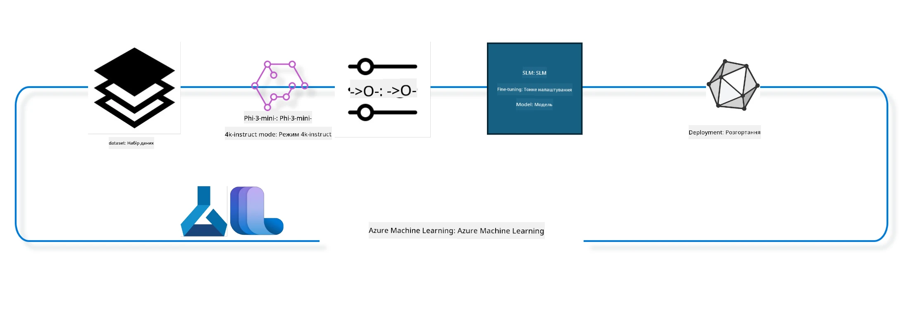

## Як використовувати компоненти чат-завершення з реєстру системи Azure ML для тонкого налаштування моделі

У цьому прикладі ми проведемо тонке налаштування моделі Phi-3-mini-4k-instruct для завершення розмови між двома особами, використовуючи набір даних ultrachat_200k.



Приклад покаже, як виконати тонке налаштування за допомогою Azure ML SDK і Python, а потім розгорнути налаштовану модель на онлайн-ендпоінті для реального часу висновку.

### Навчальні дані

Ми використаємо набір даних ultrachat_200k. Це сильно відфільтрована версія набору UltraChat, яка була використана для навчання Zephyr-7B-β, провідної моделі чат 7b.

### Модель

Ми використаємо модель Phi-3-mini-4k-instruct, щоб показати, як користувач може виконати тонке налаштування моделі для задачі чат-завершення. Якщо ви відкрили цей ноутбук із конкретної картки моделі, не забудьте замінити ім'я моделі.

### Завдання

- Обрати модель для тонкого налаштування.
- Вибрати та дослідити навчальні дані.
- Налаштувати завдання тонкого налаштування.
- Запустити завдання тонкого налаштування.
- Переглянути метрики навчання та оцінки.
- Зареєструвати тонко налаштовану модель.
- Розгорнути тонко налаштовану модель для висновку в режимі реального часу.
- Очистити ресурси.

## 1. Налаштування передумов

- Встановити залежності
- Підключитися до AzureML Workspace. Дізнайтеся більше в set up SDK authentication. Замініть <WORKSPACE_NAME>, <RESOURCE_GROUP> та <SUBSCRIPTION_ID> нижче.
- Підключитися до реєстру системи azureml
- Встановити необов’язкову назву експерименту
- Перевірити або створити обчислювальні ресурси.

> [!NOTE]
> Вимоги: один GPU-вузол може містити кілька графічних карт. Наприклад, у вузлі Standard_NC24rs_v3 є 4 NVIDIA V100 GPU, а в Standard_NC12s_v3 — 2 NVIDIA V100 GPU. Деталі див. у документації. Кількість карток GPU на вузол задається параметром gpus_per_node нижче. Встановлення цього значення правильно забезпечить використання усіх GPU вузла. Рекомендовані SKU GPU для обчислень можна знайти тут і тут.

### Бібліотеки Python

Встановіть залежності, запустивши нижченаведену клітинку. Це не опційний крок, якщо ви запускаєте в новому середовищі.

```bash
pip install azure-ai-ml
pip install azure-identity
pip install datasets==2.9.0
pip install mlflow
pip install azureml-mlflow
```

### Взаємодія з Azure ML

1. Цей Python-скрипт використовується для взаємодії з сервісом Azure Machine Learning (Azure ML). Ось короткий опис його роботи:

    - Імпортує необхідні модулі з пакетів azure.ai.ml, azure.identity, azure.ai.ml.entities. Також імпортує модуль time.

    - Прагне аутентифікуватися за допомогою DefaultAzureCredential(), що забезпечує спрощений досвід аутентифікації для швидкого початку розробки додатків у хмарі Azure. Якщо це не вдається, використовується InteractiveBrowserCredential() з інтерактивним запитом входу.

    - Прагне створити екземпляр MLClient за допомогою методу from_config, який читає конфігурацію з файлу config.json за замовчуванням. Якщо це не вдається, створюється MLClient вручну з параметрами subscription_id, resource_group_name та workspace_name.

    - Створюється ще один екземпляр MLClient для реєстру Azure ML із назвою "azureml". Цей реєстр використовується для зберігання моделей, конвеєрів тонкого налаштування та середовищ.

    - Встановлює назву експерименту як "chat_completion_Phi-3-mini-4k-instruct".

    - Генерує унікальний часовий штамп, конвертуючи поточний час (у секундах із епохи, у вигляді числа з плаваючою точкою) в ціле число, а потім у рядок. Цей штамп можна використовувати для створення унікальних імен і версій.

    ```python
    # Імпортуйте необхідні модулі з Azure ML та Azure Identity
    from azure.ai.ml import MLClient
    from azure.identity import (
        DefaultAzureCredential,
        InteractiveBrowserCredential,
    )
    from azure.ai.ml.entities import AmlCompute
    import time  # Імпортуйте модуль time
    
    # Спробуйте аутентифікуватися за допомогою DefaultAzureCredential
    try:
        credential = DefaultAzureCredential()
        credential.get_token("https://management.azure.com/.default")
    except Exception as ex:  # Якщо DefaultAzureCredential не вдається, використовуйте InteractiveBrowserCredential
        credential = InteractiveBrowserCredential()
    
    # Спробуйте створити екземпляр MLClient, використовуючи файл конфігурації за замовчуванням
    try:
        workspace_ml_client = MLClient.from_config(credential=credential)
    except:  # Якщо це не вдається, створіть екземпляр MLClient, вручну вказавши деталі
        workspace_ml_client = MLClient(
            credential,
            subscription_id="<SUBSCRIPTION_ID>",
            resource_group_name="<RESOURCE_GROUP>",
            workspace_name="<WORKSPACE_NAME>",
        )
    
    # Створіть ще один екземпляр MLClient для реєстру Azure ML з назвою "azureml"
    # Цей реєстр використовується для зберігання моделей, конвеєрів донавчання та середовищ
    registry_ml_client = MLClient(credential, registry_name="azureml")
    
    # Встановіть назву експерименту
    experiment_name = "chat_completion_Phi-3-mini-4k-instruct"
    
    # Згенеруйте унікальний часовий штамп, який можна використовувати для унікальних назв і версій
    timestamp = str(int(time.time()))
    ```

## 2. Вибір базової моделі для тонкого налаштування

1. Phi-3-mini-4k-instruct — це модель із 3,8 млрд параметрів, легка, сучасна відкрита модель, побудована на наборах даних, використаних для Phi-2. Модель належить до сімейства Phi-3 і має дві версії Mini: 4K та 128K — це довжина контексту (у токенах), яку вона підтримує. Для використання потрібно виконати тонке налаштування моделі під наші конкретні потреби. Ці моделі можна переглядати у каталозі моделей AzureML Studio, відфільтрованому за задачею чат-завершення. У цьому прикладі ми використовуємо модель Phi-3-mini-4k-instruct. Якщо ви відкрили цей ноутбук для іншої моделі, замініть ім'я та версію моделі відповідно.

> [!NOTE]
> це властивість id моделі. Воно передається як вхід до завдання тонкого налаштування. Також доступне як поле Asset ID на сторінці деталей моделі у каталозі моделей AzureML Studio.

2. Цей Python-скрипт взаємодіє з сервісом Azure Machine Learning (Azure ML). Ось короткий опис його роботи:

    - Встановлює model_name як "Phi-3-mini-4k-instruct".

    - Використовує метод get об'єкта models реєстру registry_ml_client, щоб отримати останню версію моделі з зазначеною назвою з реєстру Azure ML. Метод get викликається з двома аргументами: назва моделі та мітка, що вказує на отримання останньої версії.

    - Виводить у консоль повідомлення з іменем, версією та ідентифікатором моделі, яку буде використано для тонкого налаштування. Метод format рядка використовується для вставки значень у повідомлення. Ім'я, версія та id моделі отримуються як властивості об'єкта foundation_model.

    ```python
    # Встановити назву моделі
    model_name = "Phi-3-mini-4k-instruct"
    
    # Отримати останню версію моделі з реєстру Azure ML
    foundation_model = registry_ml_client.models.get(model_name, label="latest")
    
    # Вивести назву моделі, версію та ідентифікатор
    # Ця інформація корисна для відстеження та налагодження
    print(
        "\n\nUsing model name: {0}, version: {1}, id: {2} for fine tuning".format(
            foundation_model.name, foundation_model.version, foundation_model.id
        )
    )
    ```

## 3. Створення обчислювального ресурсу для роботи із завданням

Завдання тонкого налаштування працює ЛИШЕ з обчисленнями на GPU. Розмір обчислювального ресурсу залежить від розміру моделі, і у більшості випадків вибрати відповідний ресурс є складним завданням. У цій клітинці ми допомагаємо користувачеві вибрати правильний обчислювальний ресурс.

> [!NOTE]
> Нижче наведені обчислювальні ресурси працюють з найбільш оптимізованими налаштуваннями. Будь-які зміни конфігурації можуть призвести до помилки Cuda Out Of Memory. У таких випадках спробуйте оновити обчислювальний ресурс до більшого розміру.

> [!NOTE]
> При виборі compute_cluster_size нижче переконайтеся, що ресурс доступний у вашій групі ресурсів. Якщо певний обчислювальний ресурс недоступний, можна подати запит на доступ до нього.

### Перевірка підтримки тонкого налаштування моделі

1. Цей Python-скрипт взаємодіє з моделлю в Azure Machine Learning (Azure ML). Ось короткий опис його роботи:

    - Імпортує модуль ast, який забезпечує функції для обробки дерев абстрактного синтаксису Python.

    - Перевіряє, чи має об'єкт foundation_model (що представляє модель в Azure ML) тег із назвою finetune_compute_allow_list. Теги в Azure ML — це ключ-значення, які можна створювати та використовувати для фільтрації й сортування моделей.

    - Якщо тег finetune_compute_allow_list присутній, використовує ast.literal_eval для безпечного парсингу значення тегу (рядка) у список Python. Цей список присвоюється змінній computes_allow_list. Потім виводиться повідомлення, що потрібно створити обчислювальний ресурс зі списку.

    - Якщо тег finetune_compute_allow_list відсутній, встановлюється computes_allow_list у None і виводиться повідомлення, що тег finetune_compute_allow_list відсутній серед тегів моделі.

    - Підсумовуючи: скрипт перевіряє наявність конкретного тегу в метаданих моделі, перетворює його значення у список, якщо він існує, та відповідно інформує користувача.

    ```python
    # Імпортуйте модуль ast, який надає функції для обробки дерев абстрактного синтаксису Python
    import ast
    
    # Перевірте, чи присутній тег 'finetune_compute_allow_list' у тегах моделі
    if "finetune_compute_allow_list" in foundation_model.tags:
        # Якщо тег присутній, використовуйте ast.literal_eval для безпечного аналізу значення тегу (рядка) у список Python
        computes_allow_list = ast.literal_eval(
            foundation_model.tags["finetune_compute_allow_list"]
        )  # конвертувати рядок у python список
        # Виведіть повідомлення, що потрібно створити обчислення зі списку
        print(f"Please create a compute from the above list - {computes_allow_list}")
    else:
        # Якщо тег відсутній, встановіть computes_allow_list у None
        computes_allow_list = None
        # Виведіть повідомлення, що тег 'finetune_compute_allow_list' не входить до тегів моделі
        print("`finetune_compute_allow_list` is not part of model tags")
    ```

### Перевірка обчислювального інстансу

1. Цей Python-скрипт взаємодіє з сервісом Azure Machine Learning (Azure ML) і проводить декілька перевірок обчислювального інстансу. Ось короткий опис його роботи:

    - Прагне отримати обчислювальний інстанс із назвою, що зберігається у compute_cluster, з робочого простору Azure ML. Якщо стан забезпечення інстансу – "failed", викликає ValueError.

    - Перевіряє, чи не є computes_allow_list None. Якщо ні, конвертує всі розміри обчислювальних ресурсів у списку до нижнього регістру і перевіряє, чи входить розмір поточного обчислювального інстансу у цей список. Якщо ні – викликає ValueError.

    - Якщо computes_allow_list дорівнює None, то перевіряє, чи входить розмір інстансу у список непідтримуваних розмірів GPU VM. Якщо так, викликає ValueError.

    - Отримує список усіх доступних розмірів обчислювальних ресурсів у робочому просторі. Ітерує цей список і для кожного розміру перевіряє, чи співпадає його ім'я з розміром поточного інстансу. Якщо так, отримує кількість GPU для цього розміру і встановлює gpu_count_found у True.

    - Якщо gpu_count_found дорівнює True, виводить кількість GPU у обчислювальному інстансі. Якщо False – викликає ValueError.

    - Підсумовуючи: скрипт виконує кілька перевірок обчислювального інстансу в робочому просторі Azure ML, включно зі станом забезпечення, перевіркою розміру за списками дозволених або заборонених, а також кількістю GPU.

    ```python
    # Вивести повідомлення про виняток
    print(e)
    # Підняти ValueError, якщо розмір обчислень недоступний у робочому просторі
    raise ValueError(
        f"WARNING! Compute size {compute_cluster_size} not available in workspace"
    )
    
    # Отримати екземпляр обчислень з робочого простору Azure ML
    compute = workspace_ml_client.compute.get(compute_cluster)
    # Перевірити, чи стан надання екземпляру обчислень є "failed"
    if compute.provisioning_state.lower() == "failed":
        # Підняти ValueError, якщо стан надання є "failed"
        raise ValueError(
            f"Provisioning failed, Compute '{compute_cluster}' is in failed state. "
            f"please try creating a different compute"
        )
    
    # Перевірити, чи computes_allow_list не дорівнює None
    if computes_allow_list is not None:
        # Перетворити всі розміри обчислень у computes_allow_list у нижній регістр
        computes_allow_list_lower_case = [x.lower() for x in computes_allow_list]
        # Перевірити, чи розмір екземпляру обчислень є у computes_allow_list_lower_case
        if compute.size.lower() not in computes_allow_list_lower_case:
            # Підняти ValueError, якщо розмір екземпляру обчислень відсутній у computes_allow_list_lower_case
            raise ValueError(
                f"VM size {compute.size} is not in the allow-listed computes for finetuning"
            )
    else:
        # Визначити список непідтримуваних розмірів GPU VM
        unsupported_gpu_vm_list = [
            "standard_nc6",
            "standard_nc12",
            "standard_nc24",
            "standard_nc24r",
        ]
        # Перевірити, чи розмір екземпляру обчислень є у unsupported_gpu_vm_list
        if compute.size.lower() in unsupported_gpu_vm_list:
            # Підняти ValueError, якщо розмір екземпляру обчислень є у unsupported_gpu_vm_list
            raise ValueError(
                f"VM size {compute.size} is currently not supported for finetuning"
            )
    
    # Ініціалізувати прапорець для перевірки наявності кількості GPU в екземплярі обчислень
    gpu_count_found = False
    # Отримати список усіх доступних розмірів обчислень у робочому просторі
    workspace_compute_sku_list = workspace_ml_client.compute.list_sizes()
    available_sku_sizes = []
    # Ітеруватися по списку доступних розмірів обчислень
    for compute_sku in workspace_compute_sku_list:
        available_sku_sizes.append(compute_sku.name)
        # Перевірити, чи ім’я розміру обчислень співпадає з розміром екземпляру обчислень
        if compute_sku.name.lower() == compute.size.lower():
            # Якщо так, отримати кількість GPU для цього розміру обчислень та встановити gpu_count_found у True
            gpus_per_node = compute_sku.gpus
            gpu_count_found = True
    # Якщо gpu_count_found дорівнює True, вивести кількість GPU у екземплярі обчислень
    if gpu_count_found:
        print(f"Number of GPU's in compute {compute.size}: {gpus_per_node}")
    else:
        # Якщо gpu_count_found дорівнює False, підняти ValueError
        raise ValueError(
            f"Number of GPU's in compute {compute.size} not found. Available skus are: {available_sku_sizes}."
            f"This should not happen. Please check the selected compute cluster: {compute_cluster} and try again."
        )
    ```

## 4. Вибір набору даних для тонкого налаштування моделі

1. Ми використовуємо набір даних ultrachat_200k. Набір містить чотири частини, придатні для навчання з контролем (Supervised fine-tuning, sft).
Ранжування генерації (gen). Кількість прикладів у частинах наведена нижче:

    ```bash
    train_sft test_sft  train_gen  test_gen
    207865  23110  256032  28304
    ```

1. Наступні кілька клітинок показують основну підготовку даних для тонкого налаштування:

### Візуалізація деяких рядків даних

Ми хочемо, щоб цей приклад виконувався швидко, тому збережемо файли train_sft, test_sft, що містять 5% вже відфільтрованих рядків. Це означає, що тонко налаштована модель матиме нижчу точність, тому її не слід використовувати у реальному застосуванні.
download-dataset.py використовується для завантаження набору даних ultrachat_200k і трансформації його у формат, сумісний з конвеєром тонкого налаштування. Оскільки набір великий, тут наведена тільки частина набору.

1. Запуск наведеного нижче скрипта завантажує лише 5% даних. Цей відсоток можна збільшити, змінивши параметр dataset_split_pc на бажане значення.

> [!NOTE]
> Деякі мовні моделі мають різні коди мов, тому назви стовпців у наборі даних повинні відповідати цим кодам.

1. Ось приклад того, як повинні виглядати дані
Набір даних для чат-завершення зберігається у форматі parquet, кожен запис має таку схему:

    - Це JSON-документ (JavaScript Object Notation) — популярний формат обміну даними. Це не виконуваний код, а спосіб зберігання та транспортування даних. Ось його структура:

    - "prompt": цей ключ містить рядок, що представляє завдання або питання, задане помічнику AI.

    - "messages": цей ключ містить масив об’єктів. Кожен об'єкт представляє повідомлення в розмові між користувачем і AI-помічником. Кожне повідомлення має два ключі:

    - "content": рядок, що містить вміст повідомлення.
    - "role": рядок, який вказує роль автора повідомлення — "user" або "assistant".
    - "prompt_id": рядок, що містить унікальний ідентифікатор завдання.

1. У цьому конкретному JSON-документі показано розмову, в якій користувач просить AI-помічника створити протагоніста для дистопічної історії. Помічник відповідає, а користувач просить надати більше деталей. Помічник погоджується надати більше інформації. Вся розмова пов’язана з конкретним ідентифікатором завдання.

    ```python
    {
        // The task or question posed to an AI assistant
        "prompt": "Create a fully-developed protagonist who is challenged to survive within a dystopian society under the rule of a tyrant. ...",
        
        // An array of objects, each representing a message in a conversation between a user and an AI assistant
        "messages":[
            {
                // The content of the user's message
                "content": "Create a fully-developed protagonist who is challenged to survive within a dystopian society under the rule of a tyrant. ...",
                // The role of the entity that sent the message
                "role": "user"
            },
            {
                // The content of the assistant's message
                "content": "Name: Ava\n\n Ava was just 16 years old when the world as she knew it came crashing down. The government had collapsed, leaving behind a chaotic and lawless society. ...",
                // The role of the entity that sent the message
                "role": "assistant"
            },
            {
                // The content of the user's message
                "content": "Wow, Ava's story is so intense and inspiring! Can you provide me with more details.  ...",
                // The role of the entity that sent the message
                "role": "user"
            }, 
            {
                // The content of the assistant's message
                "content": "Certainly! ....",
                // The role of the entity that sent the message
                "role": "assistant"
            }
        ],
        
        // A unique identifier for the prompt
        "prompt_id": "d938b65dfe31f05f80eb8572964c6673eddbd68eff3db6bd234d7f1e3b86c2af"
    }
    ```

### Завантаження даних

1. Цей Python-скрипт використовується для завантаження набору даних з допомогою допоміжного скрипта download-dataset.py. Ось що він робить:

    - Імпортує модуль os, що надає портативні засоби для роботи з операційною системою.

    - Використовує функцію os.system для запуску скрипта download-dataset.py в оболонці з певними аргументами командного рядка. Аргументи вказують, який набір даних завантажувати (HuggingFaceH4/ultrachat_200k), директорію для збереження (ultrachat_200k_dataset) і відсоток розбиття набору (5). os.system повертає код завершення виконання команди; результат зберігається у змінній exit_status.

    - Перевіряє, чи exit_status не дорівнює 0. У Unix-подібних системах 0 означає успіх, будь-яке інше число – помилку. Якщо exit_status не 0, викликається виключення Exception із повідомленням про помилку завантаження набору даних.

    - Підсумовуючи: скрипт виконує команду для завантаження набору даних за допомогою допоміжного скрипта і викидає виключення у разі невдачі.

    ```python
    # Імпортуйте модуль os, який забезпечує спосіб використання функціональності, залежної від операційної системи
    import os
    
    # Використовуйте функцію os.system для запуску скрипту download-dataset.py у shell з конкретними аргументами командного рядка
    # Аргументи вказують датасет для завантаження (HuggingFaceH4/ultrachat_200k), директорію для завантаження (ultrachat_200k_dataset) та відсоток датасету для розділення (5)
    # Функція os.system повертає код завершення виконаної команди; цей код зберігається у змінній exit_status
    exit_status = os.system(
        "python ./download-dataset.py --dataset HuggingFaceH4/ultrachat_200k --download_dir ultrachat_200k_dataset --dataset_split_pc 5"
    )
    
    # Перевірте, чи exit_status не дорівнює 0
    # В операційних системах подібних до Unix код завершення 0 зазвичай означає успішне виконання команди, а будь-яке інше число свідчить про помилку
    # Якщо exit_status не 0, викличте виключення Exception з повідомленням про помилку під час завантаження датасету
    if exit_status != 0:
        raise Exception("Error downloading dataset")
    ```

### Завантаження даних у DataFrame
1. Цей скрипт на Python завантажує файл у форматі JSON Lines у DataFrame бібліотеки pandas і відображає перші 5 рядків. Ось розбір того, що він робить:

    - Імпортує бібліотеку pandas, яка є потужною бібліотекою для обробки та аналізу даних.

    - Встановлює максимальну ширину колонки для відображення у pandas на 0. Це означає, що повний текст кожної колонки буде відображено без скорочень при виведенні DataFrame.

    - Використовує функцію pd.read_json для завантаження файлу train_sft.jsonl з директорії ultrachat_200k_dataset у DataFrame. Аргумент lines=True вказує, що файл у форматі JSON Lines, де кожен рядок є окремим об’єктом JSON.

    - Використовує метод head, щоб відобразити перші 5 рядків DataFrame. Якщо рядків менше 5, відобразить всі.

    - Підсумовуючи, цей скрипт завантажує файл у форматі JSON Lines у DataFrame і показує перші 5 рядків з повним текстом у колонках.
    
    ```python
    # Імпортуйте бібліотеку pandas, яка є потужною бібліотекою для обробки та аналізу даних
    import pandas as pd
    
    # Встановіть максимальну ширину стовпця для параметрів відображення pandas рівною 0
    # Це означає, що повний текст кожного стовпця буде відображатися без обрізання при виведенні DataFrame
    pd.set_option("display.max_colwidth", 0)
    
    # Використовуйте функцію pd.read_json для завантаження файлу train_sft.jsonl з каталогу ultrachat_200k_dataset у DataFrame
    # Аргумент lines=True вказує, що файл у форматі JSON Lines, де кожен рядок є окремим JSON-об’єктом
    df = pd.read_json("./ultrachat_200k_dataset/train_sft.jsonl", lines=True)
    
    # Використовуйте метод head для відображення перших 5 рядків DataFrame
    # Якщо у DataFrame менше 5 рядків, буде відображено всі рядки
    df.head()
    ```

## 5. Надіслати завдання тонкого налаштування, використовуючи модель та дані як вхідні параметри

Створіть завдання, яке використовує компонент pipeline для chat-completion. Дізнайтеся більше про всі параметри, які підтримуються для тонкого налаштування.

### Визначення параметрів тонкого налаштування

1. Параметри тонкого налаштування можна розділити на 2 категорії - параметри тренування, параметри оптимізації.

1. Параметри тренування визначають аспекти тренування, такі як:

    - Оптимізатор, scheduler для використання
    - Метрика для оптимізації тонкого налаштування
    - Кількість кроків тренування, розмір батчу тощо
    - Параметри оптимізації допомагають оптимізувати пам’ять GPU та ефективно використовувати обчислювальні ресурси.

1. Нижче наведено кілька параметрів цієї категорії. Параметри оптимізації відрізняються для кожної моделі і пакуються разом з моделлю для підтримки цих варіацій.

    - Увімкнути deepspeed та LoRA
    - Увімкнути тренування з мішаною точністю
    - Увімкнути тренування на кількох вузлах

> [!NOTE]
> Кероване тонке налаштування може призвести до втрати вирівнювання або катастрофічного забування. Радимо перевіряти цю проблему і запускати етап вирівнювання після тонкого налаштування.

### Параметри тонкого налаштування

1. Цей скрипт на Python встановлює параметри для тонкого налаштування моделі машинного навчання. Ось розбір того, що він робить:

    - Встановлює стандартні параметри тренування, такі як кількість епох тренування, розмір батчу для тренування та оцінки, швидкість навчання та тип scheduler-a швидкості навчання.

    - Встановлює стандартні параметри оптимізації, такі як чи застосовувати Layer-wise Relevance Propagation (LoRa) та DeepSpeed, а також стадію DeepSpeed.

    - Об’єднує параметри тренування та оптимізації в один словник finetune_parameters.

    - Перевіряє, чи має foundation_model якісь модель-специфічні стандартні параметри. Якщо так, виводить попереджувальне повідомлення та оновлює словник finetune_parameters цими параметрами. Функція ast.literal_eval використовується для перетворення рядка з модель-специфічними параметрами у словник Python.

    - Виводить кінцевий набір параметрів тонкого налаштування, які будуть використані для запуску.

    - Підсумовуючи, цей скрипт налаштовує і показує параметри для тонкого налаштування моделі машинного навчання з можливістю переозначення стандартних параметрів модель-специфічними.

    ```python
    # Встановити параметри тренування за замовчуванням, такі як кількість епох тренування, розміри батчів для тренування та оцінки, швидкість навчання та тип планувальника швидкості навчання
    training_parameters = dict(
        num_train_epochs=3,
        per_device_train_batch_size=1,
        per_device_eval_batch_size=1,
        learning_rate=5e-6,
        lr_scheduler_type="cosine",
    )
    
    # Встановити параметри оптимізації за замовчуванням, такі як використання Layer-wise Relevance Propagation (LoRa) та DeepSpeed, а також стадію DeepSpeed
    optimization_parameters = dict(
        apply_lora="true",
        apply_deepspeed="true",
        deepspeed_stage=2,
    )
    
    # Об’єднати параметри тренування та оптимізації в один словник під назвою finetune_parameters
    finetune_parameters = {**training_parameters, **optimization_parameters}
    
    # Перевірити, чи має foundation_model якісь параметри за замовчуванням, специфічні для моделі
    # Якщо так, вивести повідомлення-попередження та оновити словник finetune_parameters цими специфічними для моделі параметрами за замовчуванням
    # Функція ast.literal_eval використовується для перетворення специфічних для моделі параметрів за замовчуванням із рядка у словник Python
    if "model_specific_defaults" in foundation_model.tags:
        print("Warning! Model specific defaults exist. The defaults could be overridden.")
        finetune_parameters.update(
            ast.literal_eval(  # перетворити рядок у словник Python
                foundation_model.tags["model_specific_defaults"]
            )
        )
    
    # Вивести остаточний набір параметрів тонкої настройки, який буде використаний під час запуску
    print(
        f"The following finetune parameters are going to be set for the run: {finetune_parameters}"
    )
    ```

### Тренувальна Pipeline

1. Цей скрипт на Python визначає функцію для генерації відображуваного імені для pipeline тренування машинного навчання, а потім викликає цю функцію, щоб згенерувати і надрукувати це ім’я. Ось розбір того, що він робить:

1. Визначена функція get_pipeline_display_name. Ця функція генерує відображуване ім’я на основі різних параметрів, пов’язаних з pipeline тренування.

1. Усередині функції обчислюється загальний розмір батчу множенням розміру батчу на пристрій, кількості кроків накопичення градієнтів, кількості GPU на вузол та кількості вузлів, що використовуються для тонкого налаштування.

1. Отримуються різні інші параметри, такі як тип scheduler-а швидкості навчання, чи застосовується DeepSpeed, стадія DeepSpeed, чи застосовується Layer-wise Relevance Propagation (LoRa), обмеження кількості контрольних точок моделі, які зберігаються, і максимальна довжина послідовності.

1. Створюється рядок, що містить усі ці параметри, розділені дефісами. Якщо використовується DeepSpeed або LoRa, у рядку включається "ds" з наступною стадією DeepSpeed або "lora" відповідно. Якщо ні — то "nods" або "nolora".

1. Функція повертає цей рядок, що слугує відображуваним іменем для pipeline тренування.

1. Після визначення функції її викликають для генерації відображуваного імені, яке потім виводять.

1. Підсумовуючи, цей скрипт генерує відображуване ім’я для pipeline тренування машинного навчання на основі різних параметрів, а потім його виводить.

    ```python
    # Визначити функцію для генерації назви відображення для навчального конвеєра
    def get_pipeline_display_name():
        # Розрахувати загальний розмір батчу, помноживши розмір батчу на пристрій, кількість кроків акумуляції градієнта, кількість GPU на вузол та кількість вузлів, що використовуються для тонкого налаштування
        batch_size = (
            int(finetune_parameters.get("per_device_train_batch_size", 1))
            * int(finetune_parameters.get("gradient_accumulation_steps", 1))
            * int(gpus_per_node)
            * int(finetune_parameters.get("num_nodes_finetune", 1))
        )
        # Отримати тип планувальника швидкості навчання
        scheduler = finetune_parameters.get("lr_scheduler_type", "linear")
        # Отримати інформацію про застосування DeepSpeed
        deepspeed = finetune_parameters.get("apply_deepspeed", "false")
        # Отримати етап DeepSpeed
        ds_stage = finetune_parameters.get("deepspeed_stage", "2")
        # Якщо DeepSpeed застосовується, включити "ds" з етапом DeepSpeed у назву відображення; якщо ні, включити "nods"
        if deepspeed == "true":
            ds_string = f"ds{ds_stage}"
        else:
            ds_string = "nods"
        # Отримати інформацію про застосування пошарового розповсюдження релевантності (LoRa)
        lora = finetune_parameters.get("apply_lora", "false")
        # Якщо LoRa застосовується, включити "lora" у назву відображення; якщо ні, включити "nolora"
        if lora == "true":
            lora_string = "lora"
        else:
            lora_string = "nolora"
        # Отримати обмеження на кількість збережених контрольних точок моделі
        save_limit = finetune_parameters.get("save_total_limit", -1)
        # Отримати максимальну довжину послідовності
        seq_len = finetune_parameters.get("max_seq_length", -1)
        # Побудувати назву відображення, об’єднавши всі ці параметри, розділені дефісами
        return (
            model_name
            + "-"
            + "ultrachat"
            + "-"
            + f"bs{batch_size}"
            + "-"
            + f"{scheduler}"
            + "-"
            + ds_string
            + "-"
            + lora_string
            + f"-save_limit{save_limit}"
            + f"-seqlen{seq_len}"
        )
    
    # Викликати функцію для генерації назви відображення
    pipeline_display_name = get_pipeline_display_name()
    # Вивести назву відображення на друк
    print(f"Display name used for the run: {pipeline_display_name}")
    ```

### Конфігурація Pipeline

Цей скрипт на Python визначає і налаштовує pipeline машинного навчання, використовуючи Azure Machine Learning SDK. Ось розбір того, що він робить:

1. Імпортує необхідні модулі з Azure AI ML SDK.

1. Отримує компонент pipeline з іменем "chat_completion_pipeline" з реєстру.

1. Визначає job pipeline за допомогою декоратора `@pipeline` і функції `create_pipeline`. Ім’я pipeline встановлено в `pipeline_display_name`.

1. Усередині функції `create_pipeline` ініціалізує отриманий компонент pipeline з різними параметрами, включно з шляхом до моделі, обчислювальними кластерами для різних етапів, розподілами датасету для тренування та тестування, кількістю GPU для тонкого налаштування і іншими параметрами тонкого налаштування.

1. Зіставляє вивід завдання тонкого налаштування з виводом job pipeline. Це зроблено для того, щоб тонко налаштовану модель можна було легко зареєструвати, що потрібно для розгортання моделі на онлайн або пакетній кінцевій точці.

1. Створює екземпляр pipeline, викликаючи функцію `create_pipeline`.

1. Встановлює налаштування `force_rerun` pipeline в `True`, що означає, що кешовані результати з попередніх завдань не використовуватимуться.

1. Встановлює налаштування `continue_on_step_failure` pipeline в `False`, що означає, що pipeline припиниться, якщо будь-який крок зазнає невдачі.

1. Підсумовуючи, цей скрипт визначає і конфігурує pipeline машинного навчання для завдання chat completion, використовуючи Azure Machine Learning SDK.

    ```python
    # Імпортувати необхідні модулі з Azure AI ML SDK
    from azure.ai.ml.dsl import pipeline
    from azure.ai.ml import Input
    
    # Отримати компонент конвеєра з ім'ям "chat_completion_pipeline" зі сховища
    pipeline_component_func = registry_ml_client.components.get(
        name="chat_completion_pipeline", label="latest"
    )
    
    # Визначити завдання конвеєра за допомогою декоратора @pipeline та функції create_pipeline
    # Ім'я конвеєра встановлено в pipeline_display_name
    @pipeline(name=pipeline_display_name)
    def create_pipeline():
        # Ініціалізувати отриманий компонент конвеєра з різними параметрами
        # Вони включають шлях до моделі, кластери обчислень для різних етапів, розподіли наборів даних для навчання та тестування, кількість GPU для тонкого налаштування та інші параметри тонкого налаштування
        chat_completion_pipeline = pipeline_component_func(
            mlflow_model_path=foundation_model.id,
            compute_model_import=compute_cluster,
            compute_preprocess=compute_cluster,
            compute_finetune=compute_cluster,
            compute_model_evaluation=compute_cluster,
            # Відобразити розподіли наборів даних на параметри
            train_file_path=Input(
                type="uri_file", path="./ultrachat_200k_dataset/train_sft.jsonl"
            ),
            test_file_path=Input(
                type="uri_file", path="./ultrachat_200k_dataset/test_sft.jsonl"
            ),
            # Налаштування навчання
            number_of_gpu_to_use_finetuning=gpus_per_node,  # Встановити кількість доступних GPU в обчисленнях
            **finetune_parameters
        )
        return {
            # Відобразити вихідні дані завдання тонкого налаштування на вихідні дані завдання конвеєра
            # Це зроблено, щоб ми могли легко зареєструвати тонко налаштовану модель
            # Реєстрація моделі необхідна для впровадження моделі на онлайн чи пакетну кінцеву точку
            "trained_model": chat_completion_pipeline.outputs.mlflow_model_folder
        }
    
    # Створити інстанцію конвеєра, викликавши функцію create_pipeline
    pipeline_object = create_pipeline()
    
    # Не використовувати кешовані результати з попередніх завдань
    pipeline_object.settings.force_rerun = True
    
    # Встановити продовження при помилці кроку в False
    # Це означає, що конвеєр зупиниться, якщо будь-який крок зазнає невдачі
    pipeline_object.settings.continue_on_step_failure = False
    ```

### Надіслати Job

1. Цей скрипт на Python подає job pipeline машинного навчання в робочу область Azure Machine Learning і чекає на завершення job. Ось розбір того, що він робить:

    - Викликає метод create_or_update об’єкта jobs у workspace_ml_client для подання pipeline job. Pipeline, що запускається, задається аргументом pipeline_object, а експеримент, під яким працює job — експериментом experiment_name.

    - Потім викликає метод stream того самого об’єкта jobs у workspace_ml_client, щоб чекати завершення pipeline job. Job, на який чекають — за іменем атрибута name об’єкта pipeline_job.

    - Підсумовуючи, цей скрипт подає job pipeline машинного навчання в Azure Machine Learning workspace і чекає, поки job завершиться.

    ```python
    # Відправте конвеєрну роботу до робочої області Azure Machine Learning
    # Конвеєр для запуску вказується об'єктом pipeline_object
    # Експеримент, під яким запускається робота, вказується через experiment_name
    pipeline_job = workspace_ml_client.jobs.create_or_update(
        pipeline_object, experiment_name=experiment_name
    )
    
    # Чекати на завершення конвеєрної роботи
    # Робота, на яку очікують, вказується атрибутом name об'єкта pipeline_job
    workspace_ml_client.jobs.stream(pipeline_job.name)
    ```

## 6. Зареєструвати тонко налаштовану модель у робочій області

Ми зареєструємо модель з виводу завдання тонкого налаштування. Це відстежить походження між тонко налаштованою моделлю та самим завданням тонкого налаштування. Завдання тонкого налаштування у свою чергу відстежує походження фундаментальної моделі, даних і коду тренування.

### Реєстрація ML моделі

1. Цей скрипт на Python реєструє модель машинного навчання, яка була натренована у pipeline Azure Machine Learning. Ось розбір того, що він робить:

    - Імпортує необхідні модулі з Azure AI ML SDK.

    - Перевіряє, чи доступний вивід trained_model із pipeline job, викликаючи метод get об’єкта jobs у workspace_ml_client і звертаючись до атрибута outputs.

    - Створює шлях до натренованої моделі, форматуючи рядок з іменем pipeline job та іменем виводу ("trained_model").

    - Визначає ім’я для тонко налаштованої моделі, додаючи "-ultrachat-200k" до оригінального імені моделі і замінюючи слеші на дефіси.

    - Готується зареєструвати модель, створюючи об’єкт Model із різними параметрами, включно зі шляхом до моделі, типом моделі (MLflow модель), ім’ям та версією моделі, а також описом.

    - Реєструє модель, викликаючи метод create_or_update об’єкта models у workspace_ml_client з цим об’єктом Model.

    - Виводить зареєстровану модель.

1. Підсумовуючи, цей скрипт реєструє модель машинного навчання, натреновану у pipeline Azure Machine Learning.
    
    ```python
    # Імпортуйте необхідні модулі з Azure AI ML SDK
    from azure.ai.ml.entities import Model
    from azure.ai.ml.constants import AssetTypes
    
    # Перевірте, чи доступний вихід `trained_model` з конвеєрної роботи
    print("pipeline job outputs: ", workspace_ml_client.jobs.get(pipeline_job.name).outputs)
    
    # Сконструюйте шлях до навченого моделю, форматуючи рядок з ім’ям конвеєрної роботи та ім’ям виходу ("trained_model")
    model_path_from_job = "azureml://jobs/{0}/outputs/{1}".format(
        pipeline_job.name, "trained_model"
    )
    
    # Визначте ім’я для донавченого моделю, додавши "-ultrachat-200k" до оригінальної назви моделі та замінивши слеші на дефіси
    finetuned_model_name = model_name + "-ultrachat-200k"
    finetuned_model_name = finetuned_model_name.replace("/", "-")
    
    print("path to register model: ", model_path_from_job)
    
    # Підготуйтеся до реєстрації моделі, створивши об’єкт Model з різними параметрами
    # Вони включають шлях до моделі, тип моделі (MLflow модель), ім’я та версію моделі, а також опис моделі
    prepare_to_register_model = Model(
        path=model_path_from_job,
        type=AssetTypes.MLFLOW_MODEL,
        name=finetuned_model_name,
        version=timestamp,  # Використовуйте позначку часу як версію, щоб уникнути конфлікту версій
        description=model_name + " fine tuned model for ultrachat 200k chat-completion",
    )
    
    print("prepare to register model: \n", prepare_to_register_model)
    
    # Зареєструйте модель, викликавши метод create_or_update об’єкта models у workspace_ml_client з об’єктом Model як аргументом
    registered_model = workspace_ml_client.models.create_or_update(
        prepare_to_register_model
    )
    
    # Виведіть зареєстровану модель
    print("registered model: \n", registered_model)
    ```

## 7. Розгорнути тонко налаштовану модель на онлайн кінцевій точці

Онлайн кінцеві точки забезпечують надійний REST API, який можна використовувати для інтеграції з додатками, що потребують користування моделлю.

### Керування кінцевою точкою

1. Цей скрипт на Python створює керовану онлайн кінцеву точку в Azure Machine Learning для зареєрованої моделі. Ось розбір того, що він робить:

    - Імпортує необхідні модулі з Azure AI ML SDK.

    - Визначає унікальне ім’я для онлайн кінцевої точки, додаючи часову позначку до рядка "ultrachat-completion-".

    - Готується створити онлайн кінцеву точку, створюючи об’єкт ManagedOnlineEndpoint з різними параметрами, включно з ім’ям кінцевої точки, описом та режимом автентифікації ("key").

    - Створює онлайн кінцеву точку, викликаючи метод begin_create_or_update у workspace_ml_client з об’єктом ManagedOnlineEndpoint, а потім чекає завершення операції, викликаючи wait.

1. Підсумовуючи, цей скрипт створює керовану онлайн кінцеву точку в Azure Machine Learning для зареєрованої моделі.

    ```python
    # Імпортуйте необхідні модулі з Azure AI ML SDK
    from azure.ai.ml.entities import (
        ManagedOnlineEndpoint,
        ManagedOnlineDeployment,
        ProbeSettings,
        OnlineRequestSettings,
    )
    
    # Визначте унікальне ім'я для онлайн-ендпоінта, додавши мітку часу до рядка "ultrachat-completion-"
    online_endpoint_name = "ultrachat-completion-" + timestamp
    
    # Підготуйтеся до створення онлайн-ендпоінта, створивши об'єкт ManagedOnlineEndpoint з різними параметрами
    # До них входять ім'я ендпоінта, опис ендпоінта та режим автентифікації ("key")
    endpoint = ManagedOnlineEndpoint(
        name=online_endpoint_name,
        description="Online endpoint for "
        + registered_model.name
        + ", fine tuned model for ultrachat-200k-chat-completion",
        auth_mode="key",
    )
    
    # Створіть онлайн-ендпоінт, викликавши метод begin_create_or_update об'єкта workspace_ml_client з об'єктом ManagedOnlineEndpoint як аргументом
    # Потім зачекайте, поки операція створення завершиться, викликавши метод wait
    workspace_ml_client.begin_create_or_update(endpoint).wait()
    ```

> [!NOTE]
> Тут можна знайти список SKU, підтримуваних для розгортання — [Managed online endpoints SKU list](https://learn.microsoft.com/azure/machine-learning/reference-managed-online-endpoints-vm-sku-list)

### Розгортання ML моделі

1. Цей скрипт на Python розгортає зареєровану модель машинного навчання на керовану онлайн кінцеву точку в Azure Machine Learning. Ось розбір того, що він робить:

    - Імпортує модуль ast, який надає функції для обробки дерев синтаксичного аналізу Python.

    - Встановлює тип інстансу для розгортання як "Standard_NC6s_v3".

    - Перевіряє, чи є тег inference_compute_allow_list у базовій моделі. Якщо є, конвертує значення тега з рядка у список Python і присвоює його змінній inference_computes_allow_list. Якщо ні — встановлює цю змінну в None.

    - Перевіряє, чи вказаний тип інстанса знаходиться у списку дозволених. Якщо ні, виводить повідомлення про те, щоб користувач вибрав тип інстанса зі списку дозволених.

    - Готується створити розгортання, створюючи об’єкт ManagedOnlineDeployment з параметрами, включно з ім’ям розгортання, ім’ям кінцевої точки, ID моделі, типом і кількістю інстансів, настройками liveness probe і запитів.

    - Створює розгортання, викликаючи метод begin_create_or_update у workspace_ml_client із об’єктом ManagedOnlineDeployment, а потім чекає завершення виклику через wait.

    - Встановлює трафік кінцевої точки так, щоб 100% трафіку йшло на розгортання з ім’ям "demo".

    - Оновлює кінцеву точку, викликаючи метод begin_create_or_update для workspace_ml_client із кінцевою точкою, та чекає завершення виклику через result.

1. Підсумовуючи, цей скрипт розгортає зареєстровану модель машинного навчання на керовану онлайн кінцеву точку в Azure Machine Learning.

    ```python
    # Імпортуйте модуль ast, який надає функції для обробки дерев абстрактної синтаксичної граматики Python
    import ast
    
    # Встановіть тип екземпляра для розгортання
    instance_type = "Standard_NC6s_v3"
    
    # Перевірте, чи присутній тег `inference_compute_allow_list` у базовій моделі
    if "inference_compute_allow_list" in foundation_model.tags:
        # Якщо так, конвертуйте значення тегу зі рядка у список Python і призначте його змінній `inference_computes_allow_list`
        inference_computes_allow_list = ast.literal_eval(
            foundation_model.tags["inference_compute_allow_list"]
        )
        print(f"Please create a compute from the above list - {computes_allow_list}")
    else:
        # Якщо ні, встановіть `inference_computes_allow_list` в `None`
        inference_computes_allow_list = None
        print("`inference_compute_allow_list` is not part of model tags")
    
    # Перевірте, чи вказаний тип екземпляра знаходиться у списку дозволених
    if (
        inference_computes_allow_list is not None
        and instance_type not in inference_computes_allow_list
    ):
        print(
            f"`instance_type` is not in the allow listed compute. Please select a value from {inference_computes_allow_list}"
        )
    
    # Підготуйте створення розгортання, створивши обʼєкт `ManagedOnlineDeployment` з різними параметрами
    demo_deployment = ManagedOnlineDeployment(
        name="demo",
        endpoint_name=online_endpoint_name,
        model=registered_model.id,
        instance_type=instance_type,
        instance_count=1,
        liveness_probe=ProbeSettings(initial_delay=600),
        request_settings=OnlineRequestSettings(request_timeout_ms=90000),
    )
    
    # Створіть розгортання, викликавши метод `begin_create_or_update` обʼєкта `workspace_ml_client` з обʼєктом `ManagedOnlineDeployment` як аргументом
    # Потім дочекайтесь завершення операції створення, викликавши метод `wait`
    workspace_ml_client.online_deployments.begin_create_or_update(demo_deployment).wait()
    
    # Встановіть трафік кінцевої точки так, щоб 100% трафіку йшло до розгортання "demo"
    endpoint.traffic = {"demo": 100}
    
    # Оновіть кінцеву точку, викликавши метод `begin_create_or_update` обʼєкта `workspace_ml_client` з обʼєктом `endpoint` як аргументом
    # Потім дочекайтесь завершення операції оновлення, викликавши метод `result`
    workspace_ml_client.begin_create_or_update(endpoint).result()
    ```

## 8. Тестування кінцевої точки за допомогою прикладів даних

Ми дістанемо приклади даних із тестового датасету і подамо до онлайн кінцевої точки для інференсу. Потім відобразимо оцінені мітки разом із еталонними мітками.

### Читання результатів

1. Цей скрипт на Python завантажує файл у форматі JSON Lines у pandas DataFrame, бере випадкову вибірку і скидає індекс. Ось розбір того, що він робить:

    - Читає файл ./ultrachat_200k_dataset/test_gen.jsonl у pandas DataFrame. Функція read_json використовується з аргументом lines=True, бо файл у форматі JSON Lines, де кожен рядок — окремий JSON-об’єкт.

    - Береться випадкова вибірка з 1 рядка з DataFrame. Використовується функція sample з параметром n=1, що вказує кількість випадкових рядків.

    - Скидає індекс у DataFrame. Функція reset_index використовується з параметром drop=True, щоб видалити старий індекс та замінити на новий індекс з типовими цілими числами.

    - Відображає перші 2 рядки DataFrame за допомогою head з аргументом 2. Оскільки після вибірки DataFrame містить лише один рядок, виведеться цей один рядок.

1. Підсумовуючи, цей скрипт завантажує файл у форматі JSON Lines у pandas DataFrame, бере випадкову вибірку з одного рядка, скидає індекс і відображає цей рядок.
    
    ```python
    # Імпортувати бібліотеку pandas
    import pandas as pd
    
    # Прочитати файл JSON Lines './ultrachat_200k_dataset/test_gen.jsonl' у pandas DataFrame
    # Аргумент 'lines=True' вказує, що файл у форматі JSON Lines, де кожен рядок — це окремий JSON-об'єкт
    test_df = pd.read_json("./ultrachat_200k_dataset/test_gen.jsonl", lines=True)
    
    # Взяти випадкову вибірку з 1 рядка з DataFrame
    # Аргумент 'n=1' визначає кількість випадкових рядків для вибору
    test_df = test_df.sample(n=1)
    
    # Скинути індекс DataFrame
    # Аргумент 'drop=True' вказує, що початковий індекс слід видалити і замінити на новий індекс за замовчуванням з цілих чисел
    # Аргумент 'inplace=True' вказує, що DataFrame має бути змінено на місці (без створення нового об'єкта)
    test_df.reset_index(drop=True, inplace=True)
    
    # Відобразити перші 2 рядки DataFrame
    # Однак, оскільки DataFrame містить лише один рядок після вибірки, буде відображено лише цей один рядок
    test_df.head(2)
    ```

### Створення JSON об'єкта
1. Цей скрипт на Python створює JSON-об'єкт із певними параметрами та зберігає його у файл. Ось роз'яснення того, що він робить:

    - Він імпортує модуль json, який надає функції для роботи з даними JSON.

    - Він створює словник parameters із ключами та значеннями, які представляють параметри для моделі машинного навчання. Ключі — "temperature", "top_p", "do_sample" і "max_new_tokens", а їхні відповідні значення — 0.6, 0.9, True і 200.

    - Він створює інший словник test_json із двома ключами: "input_data" і "params". Значенням "input_data" є інший словник з ключами "input_string" і "parameters". Значенням "input_string" є список, що містить перше повідомлення з DataFrame test_df. Значенням "parameters" є раніше створений словник parameters. Значенням "params" є порожній словник.

    - Він відкриває файл із ім'ям sample_score.json
    
    ```python
    # Імпортуйте модуль json, який надає функції для роботи з даними у форматі JSON
    import json
    
    # Створіть словник `parameters` з ключами та значеннями, що представляють параметри для моделі машинного навчання
    # Ключами є "temperature", "top_p", "do_sample" та "max_new_tokens", а їх відповідні значення: 0.6, 0.9, True та 200 відповідно
    parameters = {
        "temperature": 0.6,
        "top_p": 0.9,
        "do_sample": True,
        "max_new_tokens": 200,
    }
    
    # Створіть інший словник `test_json` з двома ключами: "input_data" та "params"
    # Значенням "input_data" є інший словник з ключами "input_string" та "parameters"
    # Значенням "input_string" є список, що містить перше повідомлення з DataFrame `test_df`
    # Значенням "parameters" є словник `parameters`, створений раніше
    # Значенням "params" є порожній словник
    test_json = {
        "input_data": {
            "input_string": [test_df["messages"][0]],
            "parameters": parameters,
        },
        "params": {},
    }
    
    # Відкрийте файл з назвою `sample_score.json` у директорії `./ultrachat_200k_dataset` в режимі запису
    with open("./ultrachat_200k_dataset/sample_score.json", "w") as f:
        # Запишіть словник `test_json` у файл у форматі JSON за допомогою функції `json.dump`
        json.dump(test_json, f)
    ```

### Виклик кінцевої точки

1. Цей скрипт на Python виконує виклик онлайн кінцевої точки в Azure Machine Learning для оцінювання JSON-файлу. Ось роз'яснення того, що він робить:

    - Він викликає метод invoke властивості online_endpoints об'єкта workspace_ml_client. Цей метод використовується для надсилання запиту до онлайн кінцевої точки та отримання відповіді.

    - Він вказує ім'я кінцевої точки та розгортання за допомогою аргументів endpoint_name і deployment_name. У цьому випадку ім'я кінцевої точки збережено в змінній online_endpoint_name, а ім'я розгортання — "demo".

    - Він вказує шлях до JSON-файлу для оцінювання за допомогою аргументу request_file. У цьому випадку файл — ./ultrachat_200k_dataset/sample_score.json.

    - Він зберігає відповідь від кінцевої точки у змінній response.

    - Він виводить необроблену відповідь.

1. Підсумовуючи, цей скрипт виконує виклик онлайн кінцевої точки в Azure Machine Learning для оцінювання JSON-файлу та виводить відповідь.

    ```python
    # Викликати онлайн кінцеву точку в Azure Machine Learning для оцінки файлу `sample_score.json`
    # Метод `invoke` властивості `online_endpoints` об'єкта `workspace_ml_client` використовується для надсилання запиту до онлайн кінцевої точки та отримання відповіді
    # Аргумент `endpoint_name` вказує ім'я кінцевої точки, яке збережено у змінній `online_endpoint_name`
    # Аргумент `deployment_name` вказує ім'я розгортання, яке є "demo"
    # Аргумент `request_file` вказує шлях до JSON файлу, що буде оцінений, що є `./ultrachat_200k_dataset/sample_score.json`
    response = workspace_ml_client.online_endpoints.invoke(
        endpoint_name=online_endpoint_name,
        deployment_name="demo",
        request_file="./ultrachat_200k_dataset/sample_score.json",
    )
    
    # Вивести необроблену відповідь від кінцевої точки
    print("raw response: \n", response, "\n")
    ```

## 9. Видалення онлайн кінцевої точки

1. Не забудьте видалити онлайн кінцеву точку, інакше у вас буде продовжувати працювати лічильник оплати за використання обчислювальних ресурсів кінцевої точки. Цей рядок коду Python видаляє онлайн кінцеву точку в Azure Machine Learning. Ось роз'яснення того, що він робить:

    - Він викликає метод begin_delete властивості online_endpoints об'єкта workspace_ml_client. Цей метод використовується для початку видалення онлайн кінцевої точки.

    - Він вказує ім'я кінцевої точки, яку потрібно видалити, за допомогою аргументу name. У цьому випадку ім'я кінцевої точки збережено в змінній online_endpoint_name.

    - Він викликає метод wait, щоб дочекатися завершення операції видалення. Це блокуюча операція, що означає, що скрипт не продовжить виконання, доки видалення не завершиться.

    - Підсумовуючи, цей рядок коду запускає видалення онлайн кінцевої точки в Azure Machine Learning і чекає на завершення операції.

    ```python
    # Видалити онлайн кінцеву точку в Azure Machine Learning
    # Метод `begin_delete` властивості `online_endpoints` об'єкта `workspace_ml_client` використовується для початку видалення онлайн кінцевої точки
    # Аргумент `name` вказує назву кінцевої точки, яку потрібно видалити, що збережена у змінній `online_endpoint_name`
    # Викликається метод `wait` для очікування завершення операції видалення. Це блокуюча операція, що означає, що скрипт не продовжить виконання, доки видалення не завершиться
    workspace_ml_client.online_endpoints.begin_delete(name=online_endpoint_name).wait()
    ```

---

<!-- CO-OP TRANSLATOR DISCLAIMER START -->
**Відмова від відповідальності**:
Цей документ було перекладено за допомогою сервісу автоматичного перекладу [Co-op Translator](https://github.com/Azure/co-op-translator). Хоча ми прагнемо до точності, будь ласка, майте на увазі, що автоматичні переклади можуть містити помилки або неточності. Оригінальний документ рідною мовою слід вважати авторитетним джерелом. Для важливої інформації рекомендується звертатися до професійного людського перекладу. Ми не несемо відповідальності за будь-які непорозуміння чи неправильні тлумачення, що виникли внаслідок використання цього перекладу.
<!-- CO-OP TRANSLATOR DISCLAIMER END -->