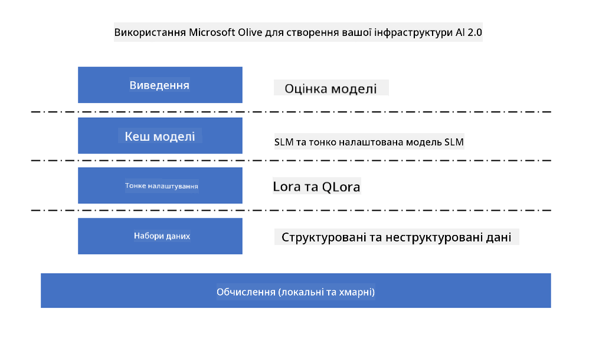
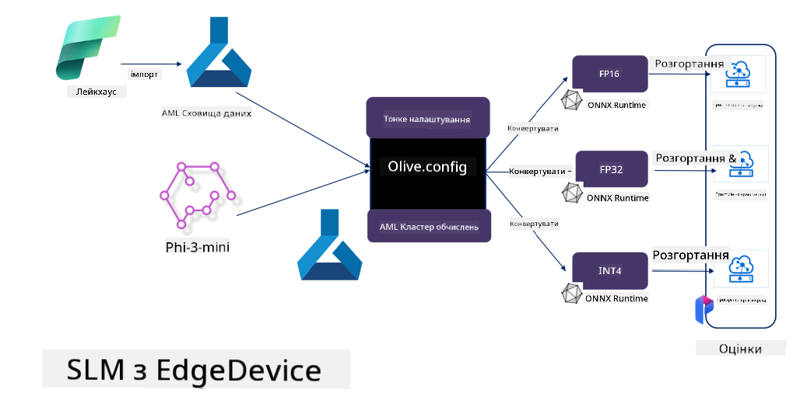

<!--
CO_OP_TRANSLATOR_METADATA:
{
  "original_hash": "5764be88ad2eb4f341e742eb8f14fab1",
  "translation_date": "2025-07-17T06:53:06+00:00",
  "source_file": "md/03.FineTuning/FineTuning_MicrosoftOlive.md",
  "language_code": "uk"
}
-->
# **Тонке налаштування Phi-3 за допомогою Microsoft Olive**

[Olive](https://github.com/microsoft/OLive?WT.mc_id=aiml-138114-kinfeylo) — це зручний інструмент для оптимізації моделей з урахуванням апаратного забезпечення, який об’єднує провідні в галузі методи стиснення, оптимізації та компіляції моделей.

Він створений для спрощення процесу оптимізації моделей машинного навчання, забезпечуючи максимально ефективне використання конкретних апаратних архітектур.

Незалежно від того, чи працюєте ви з хмарними додатками чи пристроями на периферії, Olive дозволяє легко та ефективно оптимізувати ваші моделі.

## Основні можливості:
- Olive агрегує та автоматизує методи оптимізації для потрібних апаратних цілей.
- Оскільки жоден метод оптимізації не підходить для всіх випадків, Olive підтримує розширення, дозволяючи експертам галузі додавати власні інновації в оптимізації.

## Зменшення інженерних зусиль:
- Розробникам часто доводиться вивчати та використовувати кілька специфічних для виробника апаратного забезпечення інструментальних ланцюжків для підготовки та оптимізації навчених моделей для розгортання.
- Olive спрощує цей процес, автоматизуючи методи оптимізації для потрібного апаратного забезпечення.

## Готове рішення для наскрізної оптимізації:

Об’єднуючи та налаштовуючи інтегровані методи, Olive пропонує єдине рішення для наскрізної оптимізації.
Він враховує обмеження, такі як точність і затримка, під час оптимізації моделей.

## Використання Microsoft Olive для тонкого налаштування

Microsoft Olive — це дуже простий у використанні інструмент з відкритим кодом для оптимізації моделей, який охоплює як тонке налаштування, так і референс у сфері генеративного штучного інтелекту. Він вимагає лише простої конфігурації, у поєднанні з використанням відкритих малих мовних моделей та відповідних середовищ виконання (AzureML / локальний GPU, CPU, DirectML), що дозволяє автоматично оптимізувати модель для тонкого налаштування або референсу та знайти найкращу модель для розгортання у хмарі або на периферійних пристроях. Це дає змогу підприємствам створювати власні галузеві вертикальні моделі як локально, так і у хмарі.



## Тонке налаштування Phi-3 за допомогою Microsoft Olive



## Приклад коду та демонстрація Phi-3 Olive
У цьому прикладі ви використаєте Olive для:

- Тонкого налаштування адаптера LoRA для класифікації фраз на Sad, Joy, Fear, Surprise.
- Об’єднання ваг адаптера з базовою моделлю.
- Оптимізації та квантизації моделі до int4.

[Приклад коду](../../code/03.Finetuning/olive-ort-example/README.md)

### Встановлення Microsoft Olive

Встановлення Microsoft Olive дуже просте, і його можна встановити для CPU, GPU, DirectML та Azure ML

```bash
pip install olive-ai
```

Якщо ви хочете запускати ONNX модель на CPU, можна використати

```bash
pip install olive-ai[cpu]
```

Якщо ви хочете запускати ONNX модель на GPU, можна використати

```python
pip install olive-ai[gpu]
```

Якщо ви хочете використовувати Azure ML, використовуйте

```python
pip install git+https://github.com/microsoft/Olive#egg=olive-ai[azureml]
```

**Увага**
Вимоги до ОС: Ubuntu 20.04 / 22.04

### **Файл конфігурації Microsoft Olive Config.json**

Після встановлення ви можете налаштувати різні параметри, специфічні для моделі, через файл конфігурації, включно з даними, обчисленнями, навчанням, розгортанням та генерацією моделей.

**1. Дані**

У Microsoft Olive підтримується навчання як на локальних, так і на хмарних даних, що можна налаштувати у параметрах.

*Налаштування локальних даних*

Ви можете просто налаштувати набір даних, який потрібно використовувати для тонкого налаштування, зазвичай у форматі json, і адаптувати його за допомогою шаблону даних. Це потрібно коригувати відповідно до вимог моделі (наприклад, адаптувати до формату, потрібного для Microsoft Phi-3-mini. Якщо у вас інші моделі, зверніться до вимог щодо форматів тонкого налаштування інших моделей).

```json

    "data_configs": [
        {
            "name": "dataset_default_train",
            "type": "HuggingfaceContainer",
            "load_dataset_config": {
                "params": {
                    "data_name": "json", 
                    "data_files":"dataset/dataset-classification.json",
                    "split": "train"
                }
            },
            "pre_process_data_config": {
                "params": {
                    "dataset_type": "corpus",
                    "text_cols": [
                            "phrase",
                            "tone"
                    ],
                    "text_template": "### Text: {phrase}\n### The tone is:\n{tone}",
                    "corpus_strategy": "join",
                    "source_max_len": 2048,
                    "pad_to_max_len": false,
                    "use_attention_mask": false
                }
            }
        }
    ],
```

**Налаштування джерел хмарних даних**

Підключивши сховище даних Azure AI Studio/Azure Machine Learning Service для доступу до даних у хмарі, ви можете вибрати різні джерела даних для Azure AI Studio/Azure Machine Learning Service через Microsoft Fabric та Azure Data як підтримку для тонкого налаштування.

```json

    "data_configs": [
        {
            "name": "dataset_default_train",
            "type": "HuggingfaceContainer",
            "load_dataset_config": {
                "params": {
                    "data_name": "json", 
                    "data_files": {
                        "type": "azureml_datastore",
                        "config": {
                            "azureml_client": {
                                "subscription_id": "Your Azure Subscrition ID",
                                "resource_group": "Your Azure Resource Group",
                                "workspace_name": "Your Azure ML Workspaces name"
                            },
                            "datastore_name": "workspaceblobstore",
                            "relative_path": "Your train_data.json Azure ML Location"
                        }
                    },
                    "split": "train"
                }
            },
            "pre_process_data_config": {
                "params": {
                    "dataset_type": "corpus",
                    "text_cols": [
                            "Question",
                            "Best Answer"
                    ],
                    "text_template": "<|user|>\n{Question}<|end|>\n<|assistant|>\n{Best Answer}\n<|end|>",
                    "corpus_strategy": "join",
                    "source_max_len": 2048,
                    "pad_to_max_len": false,
                    "use_attention_mask": false
                }
            }
        }
    ],
    
```

**2. Налаштування обчислень**

Якщо потрібно працювати локально, можна безпосередньо використовувати локальні ресурси даних. Якщо потрібно використовувати ресурси Azure AI Studio / Azure Machine Learning Service, необхідно налаштувати відповідні параметри Azure, назву обчислювального ресурсу тощо.

```json

    "systems": {
        "aml": {
            "type": "AzureML",
            "config": {
                "accelerators": ["gpu"],
                "hf_token": true,
                "aml_compute": "Your Azure AI Studio / Azure Machine Learning Service Compute Name",
                "aml_docker_config": {
                    "base_image": "Your Azure AI Studio / Azure Machine Learning Service docker",
                    "conda_file_path": "conda.yaml"
                }
            }
        },
        "azure_arc": {
            "type": "AzureML",
            "config": {
                "accelerators": ["gpu"],
                "aml_compute": "Your Azure AI Studio / Azure Machine Learning Service Compute Name",
                "aml_docker_config": {
                    "base_image": "Your Azure AI Studio / Azure Machine Learning Service docker",
                    "conda_file_path": "conda.yaml"
                }
            }
        }
    },
```

***Увага***

Оскільки запуск відбувається через контейнер у Azure AI Studio/Azure Machine Learning Service, потрібно налаштувати необхідне середовище. Це робиться у файлі conda.yaml.

```yaml

name: project_environment
channels:
  - defaults
dependencies:
  - python=3.8.13
  - pip=22.3.1
  - pip:
      - einops
      - accelerate
      - azure-keyvault-secrets
      - azure-identity
      - bitsandbytes
      - datasets
      - huggingface_hub
      - peft
      - scipy
      - sentencepiece
      - torch>=2.2.0
      - transformers
      - git+https://github.com/microsoft/Olive@jiapli/mlflow_loading_fix#egg=olive-ai[gpu]
      - --extra-index-url https://aiinfra.pkgs.visualstudio.com/PublicPackages/_packaging/ORT-Nightly/pypi/simple/ 
      - ort-nightly-gpu==1.18.0.dev20240307004
      - --extra-index-url https://aiinfra.pkgs.visualstudio.com/PublicPackages/_packaging/onnxruntime-genai/pypi/simple/
      - onnxruntime-genai-cuda

    

```

**3. Вибір SLM**

Ви можете використовувати модель безпосередньо з Hugging Face або поєднувати її з каталогом моделей Azure AI Studio / Azure Machine Learning для вибору потрібної моделі. У наведеному нижче прикладі ми використаємо Microsoft Phi-3-mini.

Якщо модель у вас локально, можна використати цей спосіб

```json

    "input_model":{
        "type": "PyTorchModel",
        "config": {
            "hf_config": {
                "model_name": "model-cache/microsoft/phi-3-mini",
                "task": "text-generation",
                "model_loading_args": {
                    "trust_remote_code": true
                }
            }
        }
    },
```

Якщо хочете використовувати модель з Azure AI Studio / Azure Machine Learning Service, можна використати цей спосіб

```json

    "input_model":{
        "type": "PyTorchModel",
        "config": {
            "model_path": {
                "type": "azureml_registry_model",
                "config": {
                    "name": "microsoft/Phi-3-mini-4k-instruct",
                    "registry_name": "azureml-msr",
                    "version": "11"
                }
            },
             "model_file_format": "PyTorch.MLflow",
             "hf_config": {
                "model_name": "microsoft/Phi-3-mini-4k-instruct",
                "task": "text-generation",
                "from_pretrained_args": {
                    "trust_remote_code": true
                }
            }
        }
    },
```

**Увага:**
Потрібна інтеграція з Azure AI Studio / Azure Machine Learning Service, тому при налаштуванні моделі звертайте увагу на номер версії та відповідні назви.

Усі моделі в Azure мають бути налаштовані як PyTorch.MLflow.

Потрібно мати обліковий запис Hugging Face і прив’язати ключ до значення Key в Azure AI Studio / Azure Machine Learning.

**4. Алгоритм**

Microsoft Olive дуже добре інкапсулює алгоритми тонкого налаштування Lora та QLora. Вам потрібно лише налаштувати деякі відповідні параметри. Тут я наведу приклад на основі QLora.

```json
        "lora": {
            "type": "LoRA",
            "config": {
                "target_modules": [
                    "o_proj",
                    "qkv_proj"
                ],
                "double_quant": true,
                "lora_r": 64,
                "lora_alpha": 64,
                "lora_dropout": 0.1,
                "train_data_config": "dataset_default_train",
                "eval_dataset_size": 0.3,
                "training_args": {
                    "seed": 0,
                    "data_seed": 42,
                    "per_device_train_batch_size": 1,
                    "per_device_eval_batch_size": 1,
                    "gradient_accumulation_steps": 4,
                    "gradient_checkpointing": false,
                    "learning_rate": 0.0001,
                    "num_train_epochs": 3,
                    "max_steps": 10,
                    "logging_steps": 10,
                    "evaluation_strategy": "steps",
                    "eval_steps": 187,
                    "group_by_length": true,
                    "adam_beta2": 0.999,
                    "max_grad_norm": 0.3
                }
            }
        },
```

Якщо ви хочете виконати квантизацію, основна гілка Microsoft Olive вже підтримує метод onnxruntime-genai. Ви можете налаштувати це відповідно до своїх потреб:

1. об’єднати ваги адаптера з базовою моделлю
2. конвертувати модель у onnx з потрібною точністю за допомогою ModelBuilder

наприклад, конвертація у квантизований INT4

```json

        "merge_adapter_weights": {
            "type": "MergeAdapterWeights"
        },
        "builder": {
            "type": "ModelBuilder",
            "config": {
                "precision": "int4"
            }
        }
```

**Увага**
- Якщо ви використовуєте QLoRA, наразі не підтримується квантизація через ONNXRuntime-genai.

- Варто зазначити, що ви можете налаштовувати наведені кроки відповідно до своїх потреб. Не обов’язково повністю виконувати всі ці кроки. Залежно від завдань, можна безпосередньо використовувати алгоритмічні кроки без тонкого налаштування. Наприкінці потрібно налаштувати відповідні рушії.

```json

    "engine": {
        "log_severity_level": 0,
        "host": "aml",
        "target": "aml",
        "search_strategy": false,
        "execution_providers": ["CUDAExecutionProvider"],
        "cache_dir": "../model-cache/models/phi3-finetuned/cache",
        "output_dir" : "../model-cache/models/phi3-finetuned"
    }
```

**5. Завершення тонкого налаштування**

У командному рядку виконайте команду у директорії з файлом olive-config.json

```bash
olive run --config olive-config.json  
```

**Відмова від відповідальності**:  
Цей документ було перекладено за допомогою сервісу автоматичного перекладу [Co-op Translator](https://github.com/Azure/co-op-translator). Хоча ми прагнемо до точності, будь ласка, майте на увазі, що автоматичні переклади можуть містити помилки або неточності. Оригінальний документ рідною мовою слід вважати авторитетним джерелом. Для критично важливої інформації рекомендується звертатися до професійного людського перекладу. Ми не несемо відповідальності за будь-які непорозуміння або неправильні тлумачення, що виникли внаслідок використання цього перекладу.