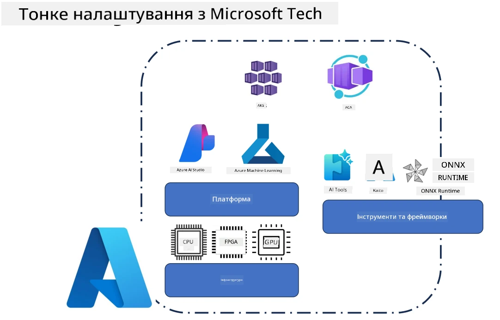
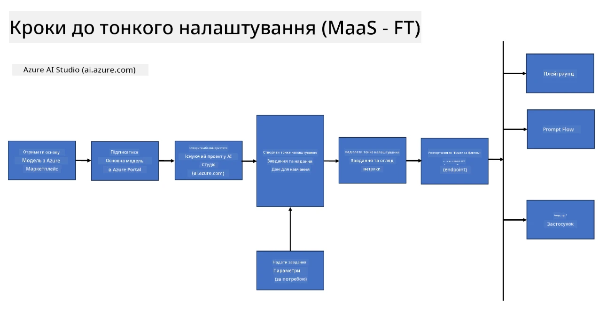
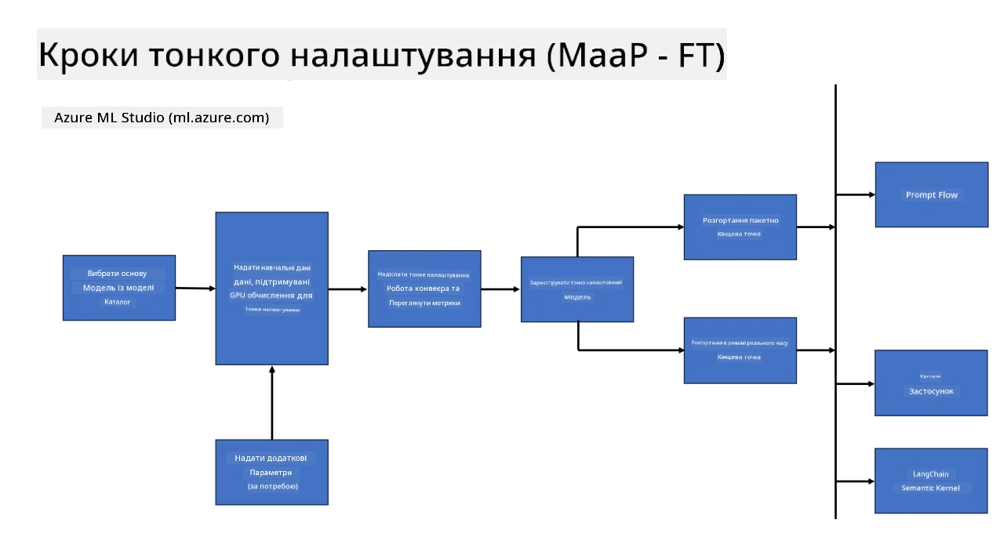
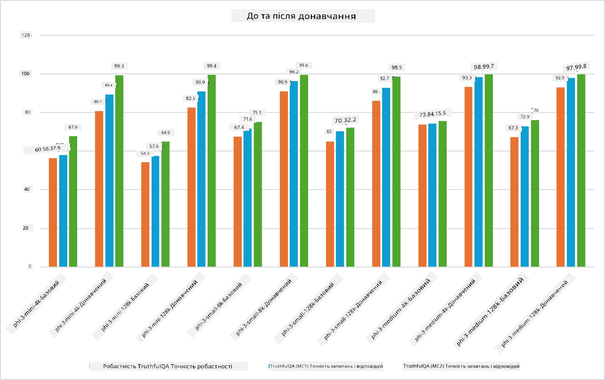

## Сценарії тонкого налаштування

У цьому розділі наведено огляд сценаріїв тонкого налаштування в середовищах Microsoft Foundry та Azure, включаючи моделі розгортання, рівні інфраструктури та поширені методи оптимізації.

**Платформа**  
Сюди входять керовані служби, такі як Microsoft Foundry (раніше Azure AI Foundry) та Azure Machine Learning, які забезпечують управління моделями, оркестрацію, відстеження експериментів і робочі процеси розгортання.

**Інфраструктура**  
Тонке налаштування вимагає масштабованих обчислювальних ресурсів. У середовищах Azure це зазвичай включає віртуальні машини на основі GPU і CPU ресурси для легких навантажень, а також масштабоване сховище для наборів даних і контрольних точок.

**Інструменти та фреймворк**  
Робочі процеси тонкого налаштування часто спираються на фреймворки та бібліотеки оптимізації, такі як Hugging Face Transformers, DeepSpeed і PEFT (Parameter-Efficient Fine-Tuning).

Процес тонкого налаштування з використанням технологій Microsoft охоплює платформні служби, обчислювальну інфраструктуру та фреймворки для навчання. Розуміючи, як ці компоненти працюють разом, розробники можуть ефективно адаптувати базові моделі до конкретних завдань і виробничих сценаріїв.

## Модель як послуга

Тонке налаштування моделі за допомогою розміщеного тонкого налаштування, без необхідності створювати і керувати обчислювальними ресурсами.

Безсерверне тонке налаштування зараз доступне для сімейств моделей Phi-3, Phi-3.5 та Phi-4, що дозволяє розробникам швидко та легко налаштовувати моделі для хмарних та крайових сценаріїв без необхідності організовувати обчислення.

## Модель як платформа

Користувачі керують власними обчислювальними ресурсами для тонкого налаштування своїх моделей.

[Приклад тонкого налаштування](https://github.com/Azure/azureml-examples/blob/main/sdk/python/foundation-models/system/finetune/chat-completion/chat-completion.ipynb)

## Порівняння технік тонкого налаштування

|Сценарій|LoRA|QLoRA|PEFT|DeepSpeed|ZeRO|DoRA|
|---|---|---|---|---|---|---|
|Адаптація попередньо навчених LLM до конкретних завдань або доменів|Так|Так|Так|Так|Так|Так|
|Тонке налаштування для NLP-завдань, таких як класифікація тексту, розпізнавання іменованих сутностей та машинний переклад|Так|Так|Так|Так|Так|Так|
|Тонке налаштування для завдань QA|Так|Так|Так|Так|Так|Так|
|Тонке налаштування для генерації текстів, подібних до людських відповідей у чат-ботах|Так|Так|Так|Так|Так|Так|
|Тонке налаштування для генерації музики, мистецтва або інших форм творчості|Так|Так|Так|Так|Так|Так|
|Зменшення обчислювальних та фінансових витрат|Так|Так|Так|Так|Так|Так|
|Зменшення використання пам’яті|Так|Так|Так|Так|Так|Так|
|Використання меншої кількості параметрів для ефективного тонкого налаштування|Так|Так|Так|Ні|Ні|Так|
|Енергоефективна форма розподіленого навчання, що дає доступ до сумарної пам’яті GPU усіх доступних пристроїв GPU|Ні|Ні|Ні|Так|Так|Ні|

> [!NOTE]
> LoRA, QLoRA, PEFT і DoRA — це методи ефективного тонкого налаштування параметрів, тоді як DeepSpeed і ZeRO зосереджені на розподіленому навчанні та оптимізації пам’яті.

## Приклади продуктивності тонкого налаштування

---

<!-- CO-OP TRANSLATOR DISCLAIMER START -->
**Відмова від відповідальності**:
Цей документ було перекладено за допомогою сервісу автоматичного перекладу [Co-op Translator](https://github.com/Azure/co-op-translator). Хоча ми прагнемо до точності, зверніть увагу, що автоматичні переклади можуть містити помилки або неточності. Оригінальний документ рідною мовою слід вважати авторитетним джерелом. Для важливої інформації рекомендується звертатися до професійного перекладу, виконаного людьми. Ми не несемо відповідальності за будь-які непорозуміння або неправильне тлумачення, що виникли внаслідок використання цього перекладу.
<!-- CO-OP TRANSLATOR DISCLAIMER END -->