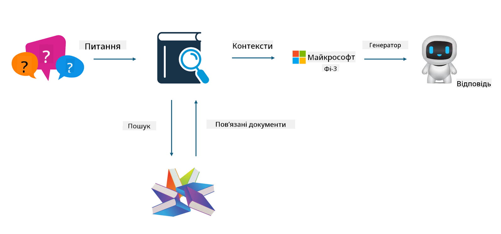
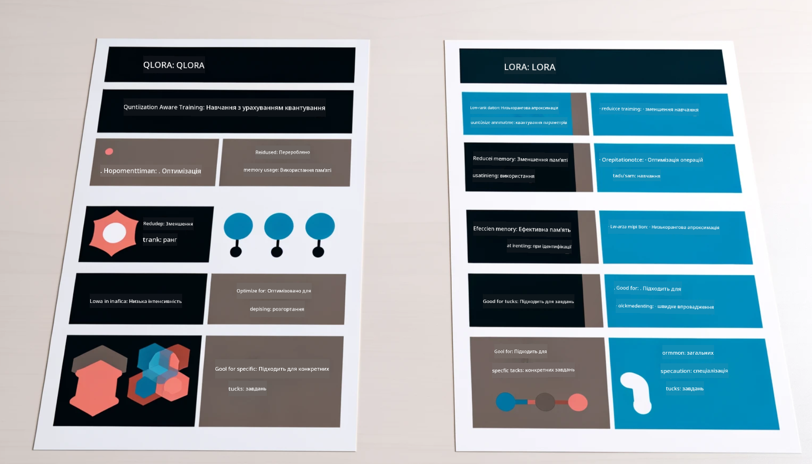

<!--
CO_OP_TRANSLATOR_METADATA:
{
  "original_hash": "743d7e9cb9c4e8ea642d77bee657a7fa",
  "translation_date": "2025-07-17T10:02:45+00:00",
  "source_file": "md/03.FineTuning/LetPhi3gotoIndustriy.md",
  "language_code": "uk"
}
-->
# **Дайте Phi-3 стати експертом у галузі**

Щоб впровадити модель Phi-3 у певну галузь, потрібно додати бізнес-дані цієї галузі до моделі Phi-3. У нас є два варіанти: перший — RAG (Retrieval Augmented Generation), другий — Fine Tuning.

## **RAG проти Fine-Tuning**

### **Retrieval Augmented Generation**

RAG — це поєднання пошуку даних і генерації тексту. Структуровані та неструктуровані дані підприємства зберігаються у векторній базі даних. Під час пошуку релевантного контенту знаходиться відповідне резюме та зміст, які формують контекст, а потім використовується здатність LLM/SLM до доповнення тексту для генерації контенту.

### **Fine-tuning**

Fine-tuning базується на покращенні певної моделі. Не потрібно починати з алгоритму моделі, але дані потрібно постійно накопичувати. Якщо вам потрібна більш точна термінологія та мовне оформлення у галузевих застосунках, fine-tuning буде кращим вибором. Але якщо ваші дані часто змінюються, fine-tuning може ускладнитися.

### **Як обрати**

1. Якщо для відповіді потрібно залучити зовнішні дані, RAG — найкращий вибір.

2. Якщо потрібно видавати стабільні та точні галузеві знання, fine-tuning буде хорошим варіантом. RAG пріоритетно витягує релевантний контент, але не завжди враховує спеціалізовані нюанси.

3. Fine-tuning потребує якісного набору даних, і якщо даних мало, це не дасть великого ефекту. RAG більш гнучкий.

4. Fine-tuning — це «чорний ящик», метафізика, і важко зрозуміти внутрішній механізм. Натомість RAG полегшує пошук джерела даних, що допомагає ефективно коригувати галюцинації або помилки в контенті та забезпечує кращу прозорість.

### **Сценарії**

1. Вертикальні галузі, які потребують специфічної професійної лексики та виразів, ***Fine-tuning*** буде найкращим вибором.

2. QA-системи, що включають синтез різних знань, ***RAG*** буде найкращим вибором.

3. Поєднання автоматизованих бізнес-процесів — ***RAG + Fine-tuning*** — найкращий варіант.

## **Як використовувати RAG**

Векторна база даних — це колекція даних, збережених у математичній формі. Векторні бази даних полегшують машинним моделям запам’ятовувати попередні введення, що дозволяє використовувати машинне навчання для підтримки таких сценаріїв, як пошук, рекомендації та генерація тексту. Дані можна ідентифікувати на основі метрик схожості, а не точних збігів, що дає змогу комп’ютерним моделям розуміти контекст даних.

Векторна база даних — ключ до реалізації RAG. Ми можемо конвертувати дані у векторне зберігання за допомогою векторних моделей, таких як text-embedding-3, jina-ai-embedding тощо.

Дізнайтеся більше про створення RAG-застосунку [https://github.com/microsoft/Phi-3CookBook](https://github.com/microsoft/Phi-3CookBook?WT.mc_id=aiml-138114-kinfeylo)

## **Як використовувати Fine-tuning**

Поширені алгоритми для Fine-tuning — це Lora та QLora. Як обрати?
- [Дізнайтеся більше з цього прикладу ноутбука](../../../../code/04.Finetuning/Phi_3_Inference_Finetuning.ipynb)
- [Приклад Python FineTuning Sample](../../../../code/04.Finetuning/FineTrainingScript.py)

### **Lora та QLora**

LoRA (Low-Rank Adaptation) та QLoRA (Quantized Low-Rank Adaptation) — це техніки для тонкого налаштування великих мовних моделей (LLM) за допомогою Parameter Efficient Fine Tuning (PEFT). Техніки PEFT розроблені для більш ефективного навчання моделей у порівнянні з традиційними методами.  
LoRA — це окрема техніка fine-tuning, яка зменшує обсяг пам’яті, застосовуючи низькоранговану апроксимацію до матриці оновлення ваг. Вона забезпечує швидке навчання та підтримує продуктивність, близьку до традиційного fine-tuning.

QLoRA — розширена версія LoRA, яка включає квантовані техніки для подальшого зменшення використання пам’яті. QLoRA квантовує точність ваг у попередньо навченій LLM до 4-бітної точності, що є більш ефективним за LoRA. Однак навчання QLoRA приблизно на 30% повільніше за LoRA через додаткові кроки квантування та деквантування.

QLoRA використовує LoRA як доповнення для виправлення помилок, що виникають під час квантування. QLoRA дозволяє тонко налаштовувати величезні моделі з мільярдами параметрів на відносно невеликих, широко доступних GPU. Наприклад, QLoRA може тонко налаштувати модель з 70 млрд параметрів, яка зазвичай потребує 36 GPU, використовуючи лише 2.

**Відмова від відповідальності**:  
Цей документ було перекладено за допомогою сервісу автоматичного перекладу [Co-op Translator](https://github.com/Azure/co-op-translator). Хоча ми прагнемо до точності, будь ласка, майте на увазі, що автоматичні переклади можуть містити помилки або неточності. Оригінальний документ рідною мовою слід вважати авторитетним джерелом. Для критично важливої інформації рекомендується звертатися до професійного людського перекладу. Ми не несемо відповідальності за будь-які непорозуміння або неправильні тлумачення, що виникли внаслідок використання цього перекладу.