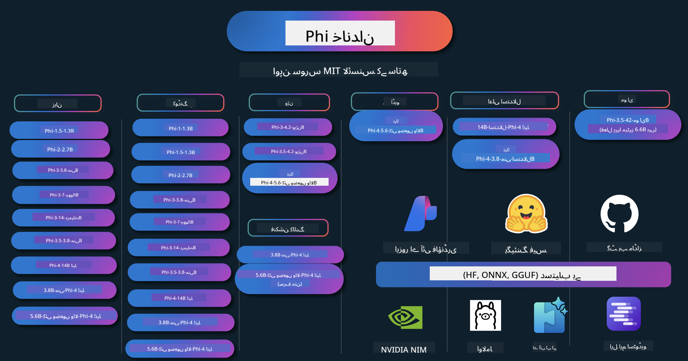

<!--
CO_OP_TRANSLATOR_METADATA:
{
  "original_hash": "f133aeb5a2b33942b50a761d56389d91",
  "translation_date": "2025-07-09T16:18:10+00:00",
  "source_file": "README.md",
  "language_code": "ur"
}
-->
# Phi Cookbook: Microsoft کے Phi ماڈلز کے ساتھ عملی مثالیں

  

  
  
  

  
  

Phi مائیکروسافٹ کی طرف سے تیار کردہ اوپن سورس AI ماڈلز کی ایک سیریز ہے۔

Phi اس وقت سب سے طاقتور اور کم قیمت چھوٹا زبان ماڈل (SLM) ہے، جو کثیر زبان، استدلال، متن/چیٹ جنریشن، کوڈنگ، تصاویر، آڈیو اور دیگر حالات میں بہترین کارکردگی دکھاتا ہے۔

آپ Phi کو کلاؤڈ یا ایج ڈیوائسز پر تعینات کر سکتے ہیں، اور محدود کمپیوٹنگ طاقت کے ساتھ آسانی سے جنریٹو AI ایپلیکیشنز بنا سکتے ہیں۔

ان وسائل کو استعمال شروع کرنے کے لیے یہ مراحل فالو کریں:  
1. **ریپوزیٹری کو فورک کریں**: کلک کریں   
2. **ریپوزیٹری کلون کریں**: `git clone https://github.com/microsoft/PhiCookBook.git`  
3. [**Microsoft AI Discord کمیونٹی میں شامل ہوں اور ماہرین و دیگر ڈویلپرز سے ملیں**](https://discord.com/invite/ByRwuEEgH4?WT.mc_id=aiml-137032-kinfeylo)

## 🌐 کثیر لسانی معاونت

### GitHub Action کے ذریعے سپورٹ (خودکار اور ہمیشہ تازہ ترین)

[فرانسیسی](../fr/README.md) | [ہسپانوی](../es/README.md) | [جرمن](../de/README.md) | [روسی](../ru/README.md) | [عربی](../ar/README.md) | [فارسی](../fa/README.md) | [اردو](./README.md) | [چینی (سادہ)](../zh/README.md) | [چینی (روایتی، میکاؤ)](../mo/README.md) | [چینی (روایتی، ہانگ کانگ)](../hk/README.md) | [چینی (روایتی، تائیوان)](../tw/README.md) | [جاپانی](../ja/README.md) | [کوریائی](../ko/README.md) | [ہندی](../hi/README.md)

### CLI کے ذریعے سپورٹ

[بنگالی](../bn/README.md) | [مراٹھی](../mr/README.md) | [نیپالی](../ne/README.md) | [پنجابی (گرمکھی)](../pa/README.md) | [پرتگالی (پرتگال)](../pt/README.md) | [پرتگالی (برازیل)](../br/README.md) | [اطالوی](../it/README.md) | [پولش](../pl/README.md) | [ترکی](../tr/README.md) | [یونانی](../el/README.md) | [تھائی](../th/README.md) | [سویڈش](../sv/README.md) | [ڈینش](../da/README.md) | [ناروے](../no/README.md) | [فنش](../fi/README.md) | [ڈچ](../nl/README.md) | [عبرانی](../he/README.md) | [ویتنامی](../vi/README.md) | [انڈونیشین](../id/README.md) | [ملائی](../ms/README.md) | [تاگالوگ (فلپائنی)](../tl/README.md) | [سواحلی](../sw/README.md) | [ہنگری](../hu/README.md) | [چیک](../cs/README.md) | [سلوواک](../sk/README.md) | [رومانیائی](../ro/README.md) | [بلغاریائی](../bg/README.md) | [سربیائی (سریلیک)](../sr/README.md) | [کروشیائی](../hr/README.md) | [سلووینیائی](../sl/README.md)

## فہرست مضامین

- تعارف  
  - [Phi فیملی میں خوش آمدید](./md/01.Introduction/01/01.PhiFamily.md)  
  - [اپنا ماحول سیٹ اپ کرنا](./md/01.Introduction/01/01.EnvironmentSetup.md)  
  - [اہم ٹیکنالوجیز کو سمجھنا](./md/01.Introduction/01/01.Understandingtech.md)  
  - [Phi ماڈلز کے لیے AI سیفٹی](./md/01.Introduction/01/01.AISafety.md)  
  - [Phi ہارڈویئر سپورٹ](./md/01.Introduction/01/01.Hardwaresupport.md)  
  - [Phi ماڈلز اور پلیٹ فارمز پر دستیابی](./md/01.Introduction/01/01.Edgeandcloud.md)  
  - [Guidance-ai اور Phi کا استعمال](./md/01.Introduction/01/01.Guidance.md)  
  - [GitHub مارکیٹ پلیس ماڈلز](https://github.com/marketplace/models)  
  - [Azure AI ماڈل کیٹلاگ](https://ai.azure.com)

- مختلف ماحول میں Phi کی انفرنس  
    -  [Hugging face](./md/01.Introduction/02/01.HF.md)  
    -  [GitHub ماڈلز](./md/01.Introduction/02/02.GitHubModel.md)  
    -  [Azure AI Foundry ماڈل کیٹلاگ](./md/01.Introduction/02/03.AzureAIFoundry.md)  
    -  [Ollama](./md/01.Introduction/02/04.Ollama.md)  
    -  [AI Toolkit VSCode (AITK)](./md/01.Introduction/02/05.AITK.md)  
    -  [NVIDIA NIM](./md/01.Introduction/02/06.NVIDIA.md)  
    -  [Foundry Local](./md/01.Introduction/02/07.FoundryLocal.md)

- Phi فیملی کی انفرنس  
    - [iOS میں Phi کی انفرنس](./md/01.Introduction/03/iOS_Inference.md)  
    - [Android میں Phi کی انفرنس](./md/01.Introduction/03/Android_Inference.md)  
    - [Jetson میں Phi کی انفرنس](./md/01.Introduction/03/Jetson_Inference.md)  
    - [AI PC میں Phi کی انفرنس](./md/01.Introduction/03/AIPC_Inference.md)  
    - [Apple MLX فریم ورک کے ساتھ Phi کی انفرنس](./md/01.Introduction/03/MLX_Inference.md)  
    - [لوکل سرور میں Phi کی انفرنس](./md/01.Introduction/03/Local_Server_Inference.md)  
    - [AI Toolkit کے ذریعے ریموٹ سرور میں Phi کی انفرنس](./md/01.Introduction/03/Remote_Interence.md)  
    - [Rust کے ساتھ Phi کی انفرنس](./md/01.Introduction/03/Rust_Inference.md)  
    - [لوکل میں Phi--Vision کی انفرنس](./md/01.Introduction/03/Vision_Inference.md)  
    - [Kaito AKS، Azure Containers (سرکاری سپورٹ) کے ساتھ Phi کی انفرنس](./md/01.Introduction/03/Kaito_Inference.md)  
-  [Phi فیملی کی کوانٹیفیکیشن](./md/01.Introduction/04/QuantifyingPhi.md)  
    - [llama.cpp کے ذریعے Phi-3.5 / 4 کی کوانٹائزنگ](./md/01.Introduction/04/UsingLlamacppQuantifyingPhi.md)  
    - [onnxruntime کے لیے جنریٹو AI ایکسٹینشنز کے ذریعے Phi-3.5 / 4 کی کوانٹائزنگ](./md/01.Introduction/04/UsingORTGenAIQuantifyingPhi.md)  
    - [Intel OpenVINO کے ذریعے Phi-3.5 / 4 کی کوانٹائزنگ](./md/01.Introduction/04/UsingIntelOpenVINOQuantifyingPhi.md)  
    - [Apple MLX فریم ورک کے ذریعے Phi-3.5 / 4 کی کوانٹائزنگ](./md/01.Introduction/04/UsingAppleMLXQuantifyingPhi.md)

- Phi کی تشخیص  
    - [Responsible AI](./md/01.Introduction/05/ResponsibleAI.md)  
    - [Azure AI Foundry برائے تشخیص](./md/01.Introduction/05/AIFoundry.md)  
    - [Promptflow کے ذریعے تشخیص](./md/01.Introduction/05/Promptflow.md)

- Azure AI سرچ کے ساتھ RAG  
    - [Phi-4-mini اور Phi-4-multimodal (RAG) کو Azure AI سرچ کے ساتھ کیسے استعمال کریں](https://github.com/microsoft/PhiCookBook/blob/main/code/06.E2E/E2E_Phi-4-RAG-Azure-AI-Search.ipynb)

- Phi ایپلیکیشن ڈیولپمنٹ کے نمونے  
  - متن اور چیٹ ایپلیکیشنز  
    - Phi-4 نمونے 🆕  
      - [📓] [Phi-4-mini ONNX ماڈل کے ساتھ چیٹ کریں](./md/02.Application/01.TextAndChat/Phi4/ChatWithPhi4ONNX/README.md)  
      - [Phi-4 لوکل ONNX ماڈل کے ساتھ چیٹ .NET](../../md/04.HOL/dotnet/src/LabsPhi4-Chat-01OnnxRuntime)  
      - [Semantic Kernel استعمال کرتے ہوئے Phi-4 ONNX کے ساتھ .NET کنسول ایپ میں چیٹ](../../md/04.HOL/dotnet/src/LabsPhi4-Chat-02SK)  
    - Phi-3 / 3.5 نمونے  
      - [براؤزر میں لوکل چیٹ بوٹ Phi3، ONNX Runtime Web اور WebGPU کے ساتھ](https://github.com/microsoft/onnxruntime-inference-examples/tree/main/js/chat)  
      - [OpenVino چیٹ](./md/02.Application/01.TextAndChat/Phi3/E2E_OpenVino_Chat.md)  
      - [کثیر ماڈل - Interactive Phi-3-mini اور OpenAI Whisper](./md/02.Application/01.TextAndChat/Phi3/E2E_Phi-3-mini_with_whisper.md)  
      - [MLFlow - ایک ریپر بنانا اور Phi-3 کو MLFlow کے ساتھ استعمال کرنا](./md//02.Application/01.TextAndChat/Phi3/E2E_Phi-3-MLflow.md)  
      - [ماڈل کی اصلاح - ONNX Runtime Web کے لیے Phi-3-min ماڈل کو Olive کے ساتھ کیسے بہتر بنائیں](https://github.com/microsoft/Olive/tree/main/examples/phi3)  
      - [WinUI3 ایپ Phi-3 mini-4k-instruct-onnx کے ساتھ](https://github.com/microsoft/Phi3-Chat-WinUI3-Sample/)  
      - [WinUI3 کثیر ماڈل AI پاورڈ نوٹس ایپ کا نمونہ](https://github.com/microsoft/ai-powered-notes-winui3-sample)
- [اپنے کسٹم Phi-3 ماڈلز کو Prompt flow کے ساتھ Fine-tune اور انٹیگریٹ کریں](./md/02.Application/01.TextAndChat/Phi3/E2E_Phi-3-FineTuning_PromptFlow_Integration.md)
- [Azure AI Foundry میں Prompt flow کے ساتھ اپنے کسٹم Phi-3 ماڈلز کو Fine-tune اور انٹیگریٹ کریں](./md/02.Application/01.TextAndChat/Phi3/E2E_Phi-3-FineTuning_PromptFlow_Integration_AIFoundry.md)
- [Azure AI Foundry میں Fine-tuned Phi-3 / Phi-3.5 ماڈل کا جائزہ لیں، خاص طور پر Microsoft کے Responsible AI اصولوں پر توجہ دیتے ہوئے](./md/02.Application/01.TextAndChat/Phi3/E2E_Phi-3-Evaluation_AIFoundry.md)
- [📓] [Phi-3.5-mini-instruct زبان کی پیش گوئی کا نمونہ (چینی/انگریزی)](../../md/02.Application/01.TextAndChat/Phi3/phi3-instruct-demo.ipynb)
- [Phi-3.5-Instruct WebGPU RAG چیٹ بوٹ](./md/02.Application/01.TextAndChat/Phi3/WebGPUWithPhi35Readme.md)
- [Windows GPU کا استعمال کرتے ہوئے Phi-3.5-Instruct ONNX کے ساتھ Prompt flow حل بنانا](./md/02.Application/01.TextAndChat/Phi3/UsingPromptFlowWithONNX.md)
- [Microsoft Phi-3.5 tflite کا استعمال کرتے ہوئے Android ایپ بنائیں](./md/02.Application/01.TextAndChat/Phi3/UsingPhi35TFLiteCreateAndroidApp.md)
- [Microsoft.ML.OnnxRuntime کا استعمال کرتے ہوئے مقامی ONNX Phi-3 ماڈل کے ساتھ Q&A .NET مثال](../../md/04.HOL/dotnet/src/LabsPhi301)
- [Semantic Kernel اور Phi-3 کے ساتھ Console چیٹ .NET ایپ](../../md/04.HOL/dotnet/src/LabsPhi302)

- Azure AI Inference SDK کوڈ پر مبنی نمونے  
  - Phi-4 نمونے 🆕  
    - [📓] [Phi-4-multimodal کا استعمال کرتے ہوئے پروجیکٹ کوڈ تیار کریں](./md/02.Application/02.Code/Phi4/GenProjectCode/README.md)  
  - Phi-3 / 3.5 نمونے  
    - [Microsoft Phi-3 فیملی کے ساتھ اپنا Visual Studio Code GitHub Copilot چیٹ بنائیں](./md/02.Application/02.Code/Phi3/VSCodeExt/README.md)  
    - [GitHub ماڈلز کے ذریعے Phi-3.5 کے ساتھ اپنا Visual Studio Code چیٹ کوپائلٹ ایجنٹ بنائیں](/md/02.Application/02.Code/Phi3/CreateVSCodeChatAgentWithGitHubModels.md)  

- ایڈوانسڈ ریزننگ نمونے  
  - Phi-4 نمونے 🆕  
    - [📓] [Phi-4-mini-reasoning یا Phi-4-reasoning نمونے](./md/02.Application/03.AdvancedReasoning/Phi4/AdvancedResoningPhi4mini/README.md)  
    - [📓] [Microsoft Olive کے ساتھ Phi-4-mini-reasoning کی Fine-tuning](../../md/02.Application/03.AdvancedReasoning/Phi4/AdvancedResoningPhi4mini/olive_ft_phi_4_reasoning_with_medicaldata.ipynb)  
    - [📓] [Apple MLX کے ساتھ Phi-4-mini-reasoning کی Fine-tuning](../../md/02.Application/03.AdvancedReasoning/Phi4/AdvancedResoningPhi4mini/mlx_ft_phi_4_reasoning_with_medicaldata.ipynb)  
    - [📓] [GitHub ماڈلز کے ساتھ Phi-4-mini-reasoning](../../md/02.Application/02.Code/Phi4r/github_models_inference.ipynb)  
    - [📓] [Azure AI Foundry ماڈلز کے ساتھ Phi-4-mini-reasoning](../../md/02.Application/02.Code/Phi4r/azure_models_inference.ipynb)  
- ڈیموز  
    - [Phi-4-mini ڈیموز جو Hugging Face Spaces پر ہوسٹ کیے گئے ہیں](https://huggingface.co/spaces/microsoft/phi-4-mini?WT.mc_id=aiml-137032-kinfeylo)  
    - [Phi-4-multimodal ڈیموز جو Hugging Face Spaces پر ہوسٹ کیے گئے ہیں](https://huggingface.co/spaces/microsoft/phi-4-multimodal?WT.mc_id=aiml-137032-kinfeylo)  
- وژن نمونے  
  - Phi-4 نمونے 🆕  
    - [📓] [Phi-4-multimodal کا استعمال کرتے ہوئے تصاویر پڑھیں اور کوڈ تیار کریں](./md/02.Application/04.Vision/Phi4/CreateFrontend/README.md)  
  - Phi-3 / 3.5 نمونے  
    - [📓][Phi-3-vision-تصویر سے متن تک آن لائن اینڈپوائنٹ](../../md/02.Application/04.Vision/Phi3/E2E_Phi-3-vision-image-text-to-text-online-endpoint.ipynb)  
    - [Phi-3-vision-ONNX](https://onnxruntime.ai/docs/genai/tutorials/phi3-v.html)  
    - [📓][Phi-3-vision CLIP ایمبیڈنگ](../../md/02.Application/04.Vision/Phi3/E2E_Phi-3-vision-image-text-to-text-online-endpoint.ipynb)  
    - [ڈیمو: Phi-3 ری سائیکلنگ](https://github.com/jennifermarsman/PhiRecycling/)  
    - [Phi-3-vision - بصری زبان کا معاون - Phi3-Vision اور OpenVINO کے ساتھ](https://docs.openvino.ai/nightly/notebooks/phi-3-vision-with-output.html)  
    - [Phi-3 وژن Nvidia NIM](./md/02.Application/04.Vision/Phi3/E2E_Nvidia_NIM_Vision.md)  
    - [Phi-3 وژن OpenVino](./md/02.Application/04.Vision/Phi3/E2E_OpenVino_Phi3Vision.md)  
    - [📓][Phi-3.5 وژن ملٹی فریم یا ملٹی امیج نمونہ](../../md/02.Application/04.Vision/Phi3/phi3-vision-demo.ipynb)  
    - [Microsoft.ML.OnnxRuntime .NET کا استعمال کرتے ہوئے Phi-3 وژن لوکل ONNX ماڈل](../../md/04.HOL/dotnet/src/LabsPhi303)  
    - [مینو پر مبنی Phi-3 وژن لوکل ONNX ماڈل Microsoft.ML.OnnxRuntime .NET کے ساتھ](../../md/04.HOL/dotnet/src/LabsPhi304)  

- ریاضی کے نمونے  
  - Phi-4-Mini-Flash-Reasoning-Instruct نمونے 🆕 [Phi-4-Mini-Flash-Reasoning-Instruct کے ساتھ ریاضی کا ڈیمو](../../md/02.Application/09.Math/MathDemo.ipynb)  

- آڈیو نمونے  
  - Phi-4 نمونے 🆕  
    - [📓] [Phi-4-multimodal کا استعمال کرتے ہوئے آڈیو ٹرانسکرپٹس نکالنا](./md/02.Application/05.Audio/Phi4/Transciption/README.md)  
    - [📓] [Phi-4-multimodal آڈیو نمونہ](../../md/02.Application/05.Audio/Phi4/Siri/demo.ipynb)  
    - [📓] [Phi-4-multimodal تقریر ترجمہ کا نمونہ](../../md/02.Application/05.Audio/Phi4/Translate/demo.ipynb)  
    - [Phi-4-multimodal آڈیو کا تجزیہ کرنے اور ٹرانسکرپٹ تیار کرنے کے لیے .NET کنسول ایپلیکیشن](../../md/04.HOL/dotnet/src/LabsPhi4-MultiModal-02Audio)  

- MOE نمونے  
  - Phi-3 / 3.5 نمونے  
    - [📓] [Phi-3.5 Mixture of Experts Models (MoEs) سوشل میڈیا نمونہ](../../md/02.Application/06.MoE/Phi3/phi3_moe_demo.ipynb)  
    - [📓] [NVIDIA NIM Phi-3 MOE، Azure AI سرچ، اور LlamaIndex کے ساتھ Retrieval-Augmented Generation (RAG) پائپ لائن بنانا](../../md/02.Application/06.MoE/Phi3/azure-ai-search-nvidia-rag.ipynb)  

- فنکشن کالنگ نمونے  
  - Phi-4 نمونے 🆕  
    - [📓] [Phi-4-mini کے ساتھ فنکشن کالنگ کا استعمال](./md/02.Application/07.FunctionCalling/Phi4/FunctionCallingBasic/README.md)  
    - [📓] [Phi-4-mini کے ساتھ ملٹی ایجنٹس بنانے کے لیے فنکشن کالنگ کا استعمال](../../md/02.Application/07.FunctionCalling/Phi4/Multiagents/Phi_4_mini_multiagent.ipynb)  
    - [📓] [Ollama کے ساتھ فنکشن کالنگ کا استعمال](../../md/02.Application/07.FunctionCalling/Phi4/Ollama/ollama_functioncalling.ipynb)  
    - [📓] [ONNX کے ساتھ فنکشن کالنگ کا استعمال](../../md/02.Application/07.FunctionCalling/Phi4/ONNX/onnx_parallel_functioncalling.ipynb)  

- ملٹی موڈل مکسنگ نمونے  
  - Phi-4 نمونے 🆕  
    - [📓] [Phi-4-multimodal کو ٹیکنالوجی صحافی کے طور پر استعمال کرنا](../../md/02.Application/08.Multimodel/Phi4/TechJournalist/phi_4_mm_audio_text_publish_news.ipynb)  
    - [Phi-4-multimodal کا استعمال کرتے ہوئے تصاویر کا تجزیہ کرنے والی .NET کنسول ایپلیکیشن](../../md/04.HOL/dotnet/src/LabsPhi4-MultiModal-01Images)  

- Phi ماڈلز کی Fine-tuning  
  - [Fine-tuning کے منظرنامے](./md/03.FineTuning/FineTuning_Scenarios.md)  
  - [Fine-tuning بمقابلہ RAG](./md/03.FineTuning/FineTuning_vs_RAG.md)  
  - [Phi-3 کو انڈسٹری ماہر بنائیں Fine-tuning کے ذریعے](./md/03.FineTuning/LetPhi3gotoIndustriy.md)  
  - [VS Code کے لیے AI Toolkit کے ساتھ Phi-3 کی Fine-tuning](./md/03.FineTuning/Finetuning_VSCodeaitoolkit.md)  
  - [Azure Machine Learning Service کے ساتھ Phi-3 کی Fine-tuning](./md/03.FineTuning/Introduce_AzureML.md)  
  - [Lora کے ساتھ Phi-3 کی Fine-tuning](./md/03.FineTuning/FineTuning_Lora.md)  
  - [QLora کے ساتھ Phi-3 کی Fine-tuning](./md/03.FineTuning/FineTuning_Qlora.md)  
  - [Azure AI Foundry کے ساتھ Phi-3 کی Fine-tuning](./md/03.FineTuning/FineTuning_AIFoundry.md)  
  - [Azure ML CLI/SDK کے ساتھ Phi-3 کی Fine-tuning](./md/03.FineTuning/FineTuning_MLSDK.md)  
  - [Microsoft Olive کے ساتھ Fine-tuning](./md/03.FineTuning/FineTuning_MicrosoftOlive.md)  
  - [Microsoft Olive Hands-On Lab کے ساتھ Fine-tuning](./md/03.FineTuning/olive-lab/readme.md)  
  - [Weights and Bias کے ساتھ Phi-3-vision کی Fine-tuning](./md/03.FineTuning/FineTuning_Phi-3-visionWandB.md)  
  - [Apple MLX Framework کے ساتھ Phi-3 کی Fine-tuning](./md/03.FineTuning/FineTuning_MLX.md)  
  - [Phi-3-vision کی Fine-tuning (سرکاری حمایت)](./md/03.FineTuning/FineTuning_Vision.md)  
  - [Kaito AKS، Azure Containers کے ساتھ Phi-3 کی Fine-tuning (سرکاری حمایت)](./md/03.FineTuning/FineTuning_Kaito.md)  
  - [Phi-3 اور 3.5 وژن کی Fine-Tuning](https://github.com/2U1/Phi3-Vision-Finetune)  

- Hands on Lab  
  - [جدید ماڈلز کی تلاش: LLMs، SLMs، مقامی ترقی اور مزید](https://github.com/microsoft/aitour-exploring-cutting-edge-models)  
  - [NLP کی صلاحیت کو کھولنا: Microsoft Olive کے ساتھ Fine-Tuning](https://github.com/azure/Ignite_FineTuning_workshop)  

- علمی تحقیقی مقالے اور اشاعتیں  
  - [Textbooks Are All You Need II: phi-1.5 تکنیکی رپورٹ](https://arxiv.org/abs/2309.05463)  
  - [Phi-3 تکنیکی رپورٹ: آپ کے فون پر ایک انتہائی قابل زبان ماڈل](https://arxiv.org/abs/2404.14219)  
  - [Phi-4 تکنیکی رپورٹ](https://arxiv.org/abs/2412.08905)  
  - [Phi-4-Mini تکنیکی رپورٹ: کمپیکٹ مگر طاقتور ملٹی موڈل زبان کے ماڈلز Mixture-of-LoRAs کے ذریعے](https://arxiv.org/abs/2503.01743)  
  - [گاڑی میں فنکشن کالنگ کے لیے چھوٹے زبان کے ماڈلز کی اصلاح](https://arxiv.org/abs/2501.02342)  
  - [(WhyPHI) PHI-3 کی Fine-Tuning ملٹیپل چوائس سوالات کے جواب کے لیے: طریقہ کار، نتائج، اور چیلنجز](https://arxiv.org/abs/2501.01588)
- [Phi-4-reasoning Technical Report](https://www.microsoft.com/en-us/research/wp-content/uploads/2025/04/phi_4_reasoning.pdf)
- [Phi-4-mini-reasoning Technical Report](https://huggingface.co/microsoft/Phi-4-mini-reasoning/blob/main/Phi-4-Mini-Reasoning.pdf)

## Phi ماڈلز کا استعمال

### Azure AI Foundry پر Phi

آپ سیکھ سکتے ہیں کہ Microsoft Phi کو کیسے استعمال کیا جائے اور اپنے مختلف ہارڈویئر ڈیوائسز میں E2E حل کیسے بنائیں۔ خود Phi کا تجربہ کرنے کے لیے، ماڈلز کے ساتھ کھیلنا شروع کریں اور اپنے منظرناموں کے لیے Phi کو حسب ضرورت بنائیں [Azure AI Foundry Azure AI Model Catalog](https://aka.ms/phi3-azure-ai) کے ذریعے۔ آپ مزید جاننے کے لیے Getting Started with [Azure AI Foundry](/md/02.QuickStart/AzureAIFoundry_QuickStart.md) دیکھ سکتے ہیں۔

**Playground**  
ہر ماڈل کے لیے ایک مخصوص playground موجود ہے جہاں آپ ماڈل کو آزما سکتے ہیں [Azure AI Playground](https://aka.ms/try-phi3)۔

### GitHub ماڈلز پر Phi

آپ سیکھ سکتے ہیں کہ Microsoft Phi کو کیسے استعمال کیا جائے اور اپنے مختلف ہارڈویئر ڈیوائسز میں E2E حل کیسے بنائیں۔ خود Phi کا تجربہ کرنے کے لیے، ماڈل کے ساتھ کھیلنا شروع کریں اور اپنے منظرناموں کے لیے Phi کو حسب ضرورت بنائیں [GitHub Model Catalog](https://github.com/marketplace/models?WT.mc_id=aiml-137032-kinfeylo) کے ذریعے۔ آپ مزید جاننے کے لیے Getting Started with [GitHub Model Catalog](/md/02.QuickStart/GitHubModel_QuickStart.md) دیکھ سکتے ہیں۔

**Playground**  
ہر ماڈل کے لیے ایک مخصوص [playground موجود ہے جہاں ماڈل کو آزمایا جا سکتا ہے](/md/02.QuickStart/GitHubModel_QuickStart.md)۔

### Hugging Face پر Phi

آپ ماڈل کو [Hugging Face](https://huggingface.co/microsoft) پر بھی تلاش کر سکتے ہیں۔

**Playground**  
[Hugging Chat playground](https://huggingface.co/chat/models/microsoft/Phi-3-mini-4k-instruct)

## ذمہ دار AI

Microsoft اپنے صارفین کی مدد کے لیے پرعزم ہے کہ وہ ہمارے AI مصنوعات کو ذمہ داری کے ساتھ استعمال کریں، اپنے تجربات شیئر کریں، اور شفافیت نوٹس اور اثرات کے جائزوں جیسے اوزار کے ذریعے اعتماد پر مبنی شراکت داری قائم کریں۔ ان میں سے بہت سے وسائل [https://aka.ms/RAI](https://aka.ms/RAI) پر دستیاب ہیں۔  
Microsoft کا ذمہ دار AI کا طریقہ کار ہمارے AI اصولوں پر مبنی ہے جن میں انصاف، اعتبار اور حفاظت، رازداری اور سیکیورٹی، شمولیت، شفافیت، اور جوابدہی شامل ہیں۔

بڑے پیمانے پر قدرتی زبان، تصویر، اور تقریر کے ماڈلز - جیسے کہ اس نمونے میں استعمال ہونے والے - ممکنہ طور پر غیر منصفانہ، غیر قابل اعتماد، یا توہین آمیز رویہ اختیار کر سکتے ہیں، جو نقصان کا باعث بن سکتے ہیں۔ براہ کرم خطرات اور حدود کے بارے میں آگاہی کے لیے [Azure OpenAI service Transparency note](https://learn.microsoft.com/legal/cognitive-services/openai/transparency-note?tabs=text) ملاحظہ کریں۔

ان خطرات کو کم کرنے کے لیے تجویز کردہ طریقہ یہ ہے کہ آپ اپنی ساخت میں ایک حفاظتی نظام شامل کریں جو نقصان دہ رویے کا پتہ لگا سکے اور اسے روک سکے۔ [Azure AI Content Safety](https://learn.microsoft.com/azure/ai-services/content-safety/overview) ایک آزاد حفاظتی پرت فراہم کرتا ہے جو ایپلیکیشنز اور خدمات میں نقصان دہ صارف اور AI کی تخلیق کردہ مواد کا پتہ لگا سکتا ہے۔ Azure AI Content Safety میں متن اور تصویر کے APIs شامل ہیں جو نقصان دہ مواد کی شناخت کی اجازت دیتے ہیں۔ Azure AI Foundry کے اندر، Content Safety سروس آپ کو مختلف طریقوں سے نقصان دہ مواد کی شناخت کے لیے نمونہ کوڈ دیکھنے، دریافت کرنے اور آزمانے کی سہولت دیتی ہے۔ درج ذیل [quickstart documentation](https://learn.microsoft.com/azure/ai-services/content-safety/quickstart-text?tabs=visual-studio%2Clinux&pivots=programming-language-rest) آپ کو سروس کو درخواستیں بھیجنے کے عمل میں رہنمائی فراہم کرتی ہے۔

ایک اور پہلو جسے مدنظر رکھنا ضروری ہے وہ مجموعی ایپلیکیشن کی کارکردگی ہے۔ کثیر النوع اور کثیر ماڈل ایپلیکیشنز کے ساتھ، ہم کارکردگی کو اس طرح سمجھتے ہیں کہ نظام آپ اور آپ کے صارفین کی توقعات کے مطابق کام کرے، بشمول نقصان دہ نتائج پیدا نہ کرنا۔ اپنی مجموعی ایپلیکیشن کی کارکردگی کا جائزہ لینے کے لیے [Performance and Quality and Risk and Safety evaluators](https://learn.microsoft.com/azure/ai-studio/concepts/evaluation-metrics-built-in) استعمال کریں۔ آپ کے پاس [custom evaluators](https://learn.microsoft.com/azure/ai-studio/how-to/develop/evaluate-sdk#custom-evaluators) بنانے اور ان کا جائزہ لینے کی بھی صلاحیت موجود ہے۔

آپ اپنے AI ایپلیکیشن کا جائزہ اپنے ترقیاتی ماحول میں [Azure AI Evaluation SDK](https://microsoft.github.io/promptflow/index.html) کے ذریعے لے سکتے ہیں۔ چاہے آپ کے پاس ٹیسٹ ڈیٹا سیٹ ہو یا کوئی ہدف، آپ کی جنریٹو AI ایپلیکیشن کی تخلیقات کو بلٹ ان یا اپنی مرضی کے مطابق evaluators کے ذریعے مقداری طور پر ناپا جاتا ہے۔ اپنے نظام کا جائزہ لینے کے لیے azure ai evaluation sdk کے ساتھ شروع کرنے کے لیے، آپ [quickstart guide](https://learn.microsoft.com/azure/ai-studio/how-to/develop/flow-evaluate-sdk) پر عمل کر سکتے ہیں۔ ایک بار جب آپ جائزہ چلائیں، تو آپ [Azure AI Foundry میں نتائج کو دیکھ سکتے ہیں](https://learn.microsoft.com/azure/ai-studio/how-to/evaluate-flow-results)۔

## ٹریڈ مارکس

یہ پروجیکٹ پروجیکٹس، مصنوعات، یا خدمات کے ٹریڈ مارکس یا لوگوز پر مشتمل ہو سکتا ہے۔ Microsoft کے ٹریڈ مارکس یا لوگوز کے مجاز استعمال کے لیے [Microsoft's Trademark & Brand Guidelines](https://www.microsoft.com/legal/intellectualproperty/trademarks/usage/general) کی پابندی ضروری ہے۔  
Microsoft کے ٹریڈ مارکس یا لوگوز کا اس پروجیکٹ کے ترمیم شدہ ورژنز میں استعمال الجھن پیدا نہیں کرے گا اور نہ ہی Microsoft کی سرپرستی کا تاثر دے گا۔ کسی بھی تیسرے فریق کے ٹریڈ مارکس یا لوگوز کا استعمال ان فریقوں کی پالیسیوں کے تابع ہے۔

**دستخطی نوٹ**:  
یہ دستاویز AI ترجمہ سروس [Co-op Translator](https://github.com/Azure/co-op-translator) کے ذریعے ترجمہ کی گئی ہے۔ اگرچہ ہم درستگی کے لیے کوشاں ہیں، براہ کرم آگاہ رہیں کہ خودکار ترجمے میں غلطیاں یا عدم درستیاں ہو سکتی ہیں۔ اصل دستاویز اپنی مادری زبان میں ہی معتبر ماخذ سمجھی جانی چاہیے۔ اہم معلومات کے لیے پیشہ ور انسانی ترجمہ کی سفارش کی جاتی ہے۔ اس ترجمے کے استعمال سے پیدا ہونے والی کسی بھی غلط فہمی یا غلط تشریح کی ذمہ داری ہم پر عائد نہیں ہوتی۔