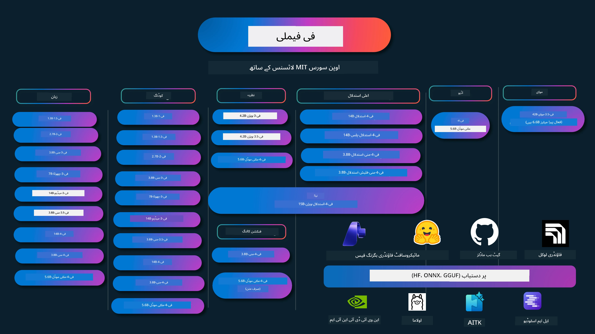

# فی کک بُک: مائیکروسافٹ کے فی ماڈلز کے ساتھ عملی مثالیں

[](https://codespaces.new/microsoft/phicookbook)
[](https://vscode.dev/redirect?url=vscode://ms-vscode-remote.remote-containers/cloneInVolume?url=https://github.com/microsoft/phicookbook)

[](https://GitHub.com/microsoft/phicookbook/graphs/contributors/?WT.mc_id=aiml-137032-kinfeylo)
[](https://GitHub.com/microsoft/phicookbook/issues/?WT.mc_id=aiml-137032-kinfeylo)
[](https://GitHub.com/microsoft/phicookbook/pulls/?WT.mc_id=aiml-137032-kinfeylo)
[](http://makeapullrequest.com?WT.mc_id=aiml-137032-kinfeylo)

[](https://GitHub.com/microsoft/phicookbook/watchers/?WT.mc_id=aiml-137032-kinfeylo)
[](https://GitHub.com/microsoft/phicookbook/network/?WT.mc_id=aiml-137032-kinfeylo)
[](https://GitHub.com/microsoft/phicookbook/stargazers/?WT.mc_id=aiml-137032-kinfeylo)

[](https://discord.com/invite/ByRwuEEgH4)

فی ایک سلسلہ ہے اوپن سورس AI ماڈلز کا جو مائیکروسافٹ نے تیار کیے ہیں۔

فی فی الحال سب سے طاقتور اور لاگت مؤثر چھوٹا زبان ماڈل (SLM) ہے، جس کے پاس ملٹی لینگویج، استدلال، متن/چیٹ جنریشن، کوڈنگ، تصاویر، آڈیو اور دیگر منظرناموں میں بہت اچھے بینچ مارکس ہیں۔

آپ فی کو کلاؤڈ یا ایج ڈیوائسز پر ڈیپلائے کر سکتے ہیں، اور محدود کمپیوٹنگ پاور کے ساتھ آسانی سے جنریٹیو AI ایپلیکیشنز بنا سکتے ہیں۔

ان وسائل کو استعمال شروع کرنے کے لیے یہ اقدامات کریں:
1. **ریپوزیٹری فورک کریں**: کلک کریں [](https://GitHub.com/microsoft/phicookbook/network/?WT.mc_id=aiml-137032-kinfeylo)
2. **ریپوزیٹری کلون کریں**: `git clone https://github.com/microsoft/PhiCookBook.git`
3. [**مائیکروسافٹ AI ڈسکورڈ کمیونٹی میں شامل ہوں اور ماہرین و دیگر ڈویلپرز سے ملاقات کریں**](https://discord.com/invite/ByRwuEEgH4?WT.mc_id=aiml-137032-kinfeylo)



### 🌐 کثیراللسانی معاونت

#### GitHub ایکشن کے ذریعے معاونت (خودکار اور ہمیشہ اپ ڈیٹ)

<!-- CO-OP TRANSLATOR LANGUAGES TABLE START -->
[عربی](../ar/README.md) | [بنگالی](../bn/README.md) | [بلغاریائی](../bg/README.md) | [برمی (میانمار)](../my/README.md) | [چینی (سادہ)](../zh-CN/README.md) | [چینی (روایتی، ہانگ کانگ)](../zh-HK/README.md) | [چینی (روایتی، مکاؤ)](../zh-MO/README.md) | [چینی (روایتی، تائیوان)](../zh-TW/README.md) | [کروشین](../hr/README.md) | [چیک](../cs/README.md) | [ڈینش](../da/README.md) | [ڈچ](../nl/README.md) | [ایسٹونین](../et/README.md) | [فننش](../fi/README.md) | [فرانسیسی](../fr/README.md) | [جرمن](../de/README.md) | [یونانی](../el/README.md) | [عبرانی](../he/README.md) | [ہندی](../hi/README.md) | [ہنگریائی](../hu/README.md) | [انڈونیشین](../id/README.md) | [اطالوی](../it/README.md) | [جاپانی](../ja/README.md) | [کنڑا](../kn/README.md) | [کوریائی](../ko/README.md) | [لتھوانین](../lt/README.md) | [مالے](../ms/README.md) | [مالیالم](../ml/README.md) | [مرہٹی](../mr/README.md) | [نیپالی](../ne/README.md) | [نائیجیرین پڈگن](../pcm/README.md) | [نارویجین](../no/README.md) | [فارسی (فتحی)](../fa/README.md) | [پولش](../pl/README.md) | [پرتگالی (برازیل)](../pt-BR/README.md) | [پرتگالی (پرتگال)](../pt-PT/README.md) | [پنجابی (گرمکھی)](../pa/README.md) | [رومانیائی](../ro/README.md) | [روسی](../ru/README.md) | [سربین (سریلیک)](../sr/README.md) | [سلوواک](../sk/README.md) | [سلووینین](../sl/README.md) | [ہسپانوی](../es/README.md) | [سواہلی](../sw/README.md) | [سوئیڈش](../sv/README.md) | [ٹاگالوگ (فلپائنی)](../tl/README.md) | [تمل](../ta/README.md) | [تلگو](../te/README.md) | [تھائی](../th/README.md) | [ترکی](../tr/README.md) | [یوکرینیائی](../uk/README.md) | [اردو](./README.md) | [ویٹنامی](../vi/README.md)

> **کیا آپ مقامی طور پر کلون کرنا پسند کریں گے؟**

> اس ریپوزیٹری میں 50+ زبانوں کے ترجمے شامل ہیں جو ڈاؤن لوڈ کے حجم کو بہت بڑھاتے ہیں۔ ترجموں کے بغیر کلون کرنے کے لیے sparse checkout استعمال کریں:
> ```bash
> git clone --filter=blob:none --sparse https://github.com/microsoft/PhiCookBook.git
> cd PhiCookBook
> git sparse-checkout set --no-cone '/*' '!translations' '!translated_images'
> ```
> اس سے آپ کو کورس مکمل کرنے کے لیے سب کچھ مل جائے گا اور ڈاؤن لوڈ بہت تیز ہوگا۔
<!-- CO-OP TRANSLATOR LANGUAGES TABLE END -->

## فہرست مضامین

- تعارف
  - [فی فیملی میں خوش آمدید](./md/01.Introduction/01/01.PhiFamily.md)
  - [اپنا ماحول ترتیب دیں](./md/01.Introduction/01/01.EnvironmentSetup.md)
  - [اہم ٹیکنالوجیز کو سمجھنا](./md/01.Introduction/01/01.Understandingtech.md)
  - [فی ماڈلز کے لیے AI سیفٹی](./md/01.Introduction/01/01.AISafety.md)
  - [فی ہارڈویئر سپورٹ](./md/01.Introduction/01/01.Hardwaresupport.md)
  - [فی ماڈلز اور پلیٹ فارمز پر دستیابی](./md/01.Introduction/01/01.Edgeandcloud.md)
  - [گائیڈنس-ai اور فی کا استعمال](./md/01.Introduction/01/01.Guidance.md)
  - [گٹ ہب مارکیٹ پلیس ماڈلز](https://github.com/marketplace/models)
  - [ایژور AI ماڈل کیٹلاگ](https://ai.azure.com)

- مختلف ماحول میں فی کی انفرنس
    -  [ہگنگ فیس](./md/01.Introduction/02/01.HF.md)
    -  [گٹ ہب ماڈلز](./md/01.Introduction/02/02.GitHubModel.md)
    -  [ایژور AI فاؤنڈری ماڈل کیٹلاگ](./md/01.Introduction/02/03.AzureAIFoundry.md)
    -  [اولاما](./md/01.Introduction/02/04.Ollama.md)
    -  [AI ٹول کِٹ VSCode (AITK)](./md/01.Introduction/02/05.AITK.md)
    -  [NVIDIA NIM](./md/01.Introduction/02/06.NVIDIA.md)
    -  [فاؤنڈری لوکل](./md/01.Introduction/02/07.FoundryLocal.md)

- فی فیملی کی انفرنس
    - [iOS میں فی کی انفرنس](./md/01.Introduction/03/iOS_Inference.md)
    - [اینڈرائیڈ میں فی کی انفرنس](./md/01.Introduction/03/Android_Inference.md)
    - [جیٹسن میں فی کی انفرنس](./md/01.Introduction/03/Jetson_Inference.md)
    - [AI پی سی میں فی کی انفرنس](./md/01.Introduction/03/AIPC_Inference.md)
    - [ایپل MLX فریم ورک کے ساتھ فی کی انفرنس](./md/01.Introduction/03/MLX_Inference.md)
    - [لوکل سرور میں فی کی انفرنس](./md/01.Introduction/03/Local_Server_Inference.md)
    - [رموٹ سرور میں AI ٹول کِٹ استعمال کرکے فی کی انفرنس](./md/01.Introduction/03/Remote_Interence.md)
    - [رسٹ کے ساتھ فی کی انفرنس](./md/01.Introduction/03/Rust_Inference.md)
    - [مقامی طور پر فی-ویژن کی انفرنس](./md/01.Introduction/03/Vision_Inference.md)
    - [کائٹو AKS، ایژور کنٹینرز (سرکاری سپورٹ) کے ساتھ فی کی انفرنس](./md/01.Introduction/03/Kaito_Inference.md)
-  [فی فیملی کی کوانٹیفائنگ](./md/01.Introduction/04/QuantifyingPhi.md)
    - [لاما.cpp کے ذریعے فی-3.5 / 4 کو کوانٹائز کرنا](./md/01.Introduction/04/UsingLlamacppQuantifyingPhi.md)
    - [onnxruntime کے لیے جنریٹیو AI ایکسٹینشنز کے ذریعے فی-3.5 / 4 کو کوانٹائز کرنا](./md/01.Introduction/04/UsingORTGenAIQuantifyingPhi.md)
    - [انٹیل اوپن وینو کے ذریعے فی-3.5 / 4 کو کوانٹائز کرنا](./md/01.Introduction/04/UsingIntelOpenVINOQuantifyingPhi.md)
    - [ایپل MLX فریم ورک کے ذریعے فی-3.5 / 4 کو کوانٹائز کرنا](./md/01.Introduction/04/UsingAppleMLXQuantifyingPhi.md)

-  فی کی ایویلیوایشن
    - [ریسپانسبل AI](./md/01.Introduction/05/ResponsibleAI.md)
    - [ایژور AI فاؤنڈری برائے ایویلیوایشن](./md/01.Introduction/05/AIFoundry.md)
    - [ایویلیوایشن کے لیے پرومٹ فلو کا استعمال](./md/01.Introduction/05/Promptflow.md)
 
- ایژور AI سرچ کے ساتھ RAG
    - [Phi-4-mini اور Phi-4-multimodal(RAG) کو ایژور AI سرچ کے ساتھ کیسے استعمال کریں](https://github.com/microsoft/PhiCookBook/blob/main/code/06.E2E/E2E_Phi-4-RAG-Azure-AI-Search.ipynb)

- فی اپلیکیشن ڈیولپمنٹ کے نمونے
  - متن اور چیٹ کی ایپلیکیشنز
    - فی-4 کے نمونے 🆕
      - [📓] [Phi-4-mini ONNX ماڈل کے ساتھ چیٹ کریں](./md/02.Application/01.TextAndChat/Phi4/ChatWithPhi4ONNX/README.md)
      - [اپنے لوکل Phi-4 ONNX ماڈل کے ساتھ چیٹ کریں .NET](../../md/04.HOL/dotnet/src/LabsPhi4-Chat-01OnnxRuntime)
      - [Semantic Kernel استعمال کرتے ہوئے Phi-4 ONNX کے ساتھ .NET کنسول ایپ چیٹ](../../md/04.HOL/dotnet/src/LabsPhi4-Chat-02SK)
    - Phi-3 / 3.5 کے نمونے
      - [براوزر میں مقامی چیٹ بوٹ استعمال کرتے ہوئے Phi3، ONNX Runtime Web اور WebGPU](https://github.com/microsoft/onnxruntime-inference-examples/tree/main/js/chat)
      - [اوپن وینو چیٹ](./md/02.Application/01.TextAndChat/Phi3/E2E_OpenVino_Chat.md)
      - [کثیر النموذج - انٹرایکٹو فائی-3-منی اور اوپن اے آئی وسپر](./md/02.Application/01.TextAndChat/Phi3/E2E_Phi-3-mini_with_whisper.md)
      - [ایم ایل فلو - ریپر بنانے اور فائی-3 کو ایم ایل فلو کے ساتھ استعمال کرنا](./md//02.Application/01.TextAndChat/Phi3/E2E_Phi-3-MLflow.md)
      - [ماڈل آپٹیمائزیشن - Olive کے ساتھ ONNX رن ٹائم ویب کے لیے فائی-3-منی ماڈل کو کیسے بہتر بنایا جائے](https://github.com/microsoft/Olive/tree/main/examples/phi3)
      - [WinUI3 ایپ کے ساتھ فائی-3 منی-4k-انسٹرکٹ-onnx](https://github.com/microsoft/Phi3-Chat-WinUI3-Sample/)
      -[WinUI3 کثیر النموذج AI طاقتور نوٹس ایپ سیمپل](https://github.com/microsoft/ai-powered-notes-winui3-sample)
      - [اپنی مرضی کے مطابق فائی-3 ماڈلز کو فائن ٹیون اور پرامپٹ فلو کے ساتھ انٹیگریٹ کریں](./md/02.Application/01.TextAndChat/Phi3/E2E_Phi-3-FineTuning_PromptFlow_Integration.md)
      - [Azure AI Foundry میں پرامپٹ فلو کے ذریعے اپنی مرضی کے مطابق فائی-3 ماڈلز کو فائن ٹیون اور انٹیگریٹ کریں](./md/02.Application/01.TextAndChat/Phi3/E2E_Phi-3-FineTuning_PromptFlow_Integration_AIFoundry.md)
      - [Azure AI Foundry میں مائیکروسافٹ کے ذمہ دار AI اصولوں پر توجہ دیتے ہوئے فائن ٹیون شدہ فائی-3 / فائی-3.5 ماڈل کا جائزہ لیں](./md/02.Application/01.TextAndChat/Phi3/E2E_Phi-3-Evaluation_AIFoundry.md)
      - [📓] [فائی-3.5-منی-انسٹرکٹ زبان کی پیش گوئی کا نمونہ (چینی/انگریزی)](./md/02.Application/01.TextAndChat/Phi3/phi3-instruct-demo.ipynb)
      - [فائی-3.5-انسٹرکٹ WebGPU RAG چیٹ بوٹ](./md/02.Application/01.TextAndChat/Phi3/WebGPUWithPhi35Readme.md)
      - [ونڈوز GPU کا استعمال کرتے ہوئے فائی-3.5-انسٹرکٹ ONNX کے ساتھ پرامپٹ فلو سلوشن بنائیں](./md/02.Application/01.TextAndChat/Phi3/UsingPromptFlowWithONNX.md)
      - [مائیکروسافٹ فائی-3.5 tflite کا استعمال کرتے ہوئے اینڈروئڈ ایپ بنائیں](./md/02.Application/01.TextAndChat/Phi3/UsingPhi35TFLiteCreateAndroidApp.md)
      - [مائیکروسافٹ.ML.OnnxRuntime کا استعمال کرتے ہوئے لوکل ONNX فائی-3 ماڈل کے ساتھ Q&A .NET مثال](../../md/04.HOL/dotnet/src/LabsPhi301)
      - [Semantic Kernel اور فائی-3 کے ساتھ کنسول چیٹ .NET ایپ](../../md/04.HOL/dotnet/src/LabsPhi302)

  - Azure AI Inference SDK کوڈ پر مبنی نمونے
    - فائی-4 نمونے 🆕
      - [📓] [فائی-4-کثیرالنموذج کے ذریعے پروجیکٹ کوڈ تیار کریں](./md/02.Application/02.Code/Phi4/GenProjectCode/README.md)
    - فائی-3 / 3.5 نمونے
      - [اپنی مرضی کا Visual Studio Code GitHub Copilot Chat مائیکروسافٹ فائی-3 فیملی کے ساتھ بنائیں](./md/02.Application/02.Code/Phi3/VSCodeExt/README.md)
      - [فائی-3.5 کے ذریعے GitHub ماڈلز کے ساتھ اپنی مرضی کا Visual Studio Code چیٹ کوپائلٹ ایجنٹ بنائیں](/md/02.Application/02.Code/Phi3/CreateVSCodeChatAgentWithGitHubModels.md)

  - اعلیٰ منطقی استدلال کے نمونے
    - فائی-4 نمونے 🆕
      - [📓] [فائی-4-منی استدلال یا فائی-4 استدلال کے نمونے](./md/02.Application/03.AdvancedReasoning/Phi4/AdvancedResoningPhi4mini/README.md)
      - [📓] [مائیکروسافٹ Olive کے ساتھ فائی-4-منی استدلال کی فائن ٹیوننگ](./md/02.Application/03.AdvancedReasoning/Phi4/AdvancedResoningPhi4mini/olive_ft_phi_4_reasoning_with_medicaldata.ipynb)
      - [📓] [ایپل MLX کے ساتھ فائی-4-منی استدلال کی فائن ٹیوننگ](./md/02.Application/03.AdvancedReasoning/Phi4/AdvancedResoningPhi4mini/mlx_ft_phi_4_reasoning_with_medicaldata.ipynb)
      - [📓] [GitHub ماڈلز کے ساتھ فائی-4-منی استدلال](./md/02.Application/02.Code/Phi4r/github_models_inference.ipynb)
      - [📓] [Azure AI Foundry ماڈلز کے ساتھ فائی-4-منی استدلال](./md/02.Application/02.Code/Phi4r/azure_models_inference.ipynb)
  - نمونے پیشکش
      - [Hugging Face Spaces پر میزبانی شدہ فائی-4-منی ڈیموز](https://huggingface.co/spaces/microsoft/phi-4-mini?WT.mc_id=aiml-137032-kinfeylo)
      - [Hugging Face Spaces پر میزبانی شدہ فائی-4-کثیرالنموذج ڈیموز](https://huggingface.co/spaces/microsoft/phi-4-multimodal?WT.mc_id=aiml-137032-kinfeylo)
  - وژن کے نمونے
    - فائی-4 نمونے 🆕
      - [📓] [فائی-4-کثیرالنموذج کے ذریعے تصاویر پڑھیں اور کوڈ بنائیں](./md/02.Application/04.Vision/Phi4/CreateFrontend/README.md)
    - فائی-3 / 3.5 نمونے
      -  [📓][فائی-3-وژن-تصویر متن سے متن](./md/02.Application/04.Vision/Phi3/E2E_Phi-3-vision-image-text-to-text-online-endpoint.ipynb)
      - [فائی-3-وژن-ONNX](https://onnxruntime.ai/docs/genai/tutorials/phi3-v.html)
      - [📓][فائی-3-وژن CLIP ایمبیڈنگ](./md/02.Application/04.Vision/Phi3/E2E_Phi-3-vision-image-text-to-text-online-endpoint.ipynb)
      - [نمونہ: فائی-3 ری سائیکلنگ](https://github.com/jennifermarsman/PhiRecycling/)
      - [فائی-3-وژن - بصری زبان معاون - فائی3-وژن اور OpenVINO کے ساتھ](https://docs.openvino.ai/nightly/notebooks/phi-3-vision-with-output.html)
      - [فائی-3 وژن Nvidia NIM](./md/02.Application/04.Vision/Phi3/E2E_Nvidia_NIM_Vision.md)
      - [فائی-3 وژن OpenVino](./md/02.Application/04.Vision/Phi3/E2E_OpenVino_Phi3Vision.md)
      - [📓][فائی-3.5 وژن ملٹی-فریم یا ملٹی-امیج نمونہ](./md/02.Application/04.Vision/Phi3/phi3-vision-demo.ipynb)
      - [مائیکروسافٹ.ML.OnnxRuntime .NET کے ذریعے فائی-3 وژن لوکل ONNX ماڈل](../../md/04.HOL/dotnet/src/LabsPhi303)
      - [مینو پر مبنی فائی-3 وژن لوکل ONNX ماڈل مائیکروسافٹ.ML.OnnxRuntime .NET کے ساتھ](../../md/04.HOL/dotnet/src/LabsPhi304)

  - ریاضی کے نمونے
    - فائی-4-منی-فلیش-استدلال-انسٹرکٹ نمونے 🆕 [فائی-4-منی-فلیش-استدلال-انسٹرکٹ کے ساتھ ریاضی کا ڈیمو](./md/02.Application/09.Math/MathDemo.ipynb)

  - آڈیو کے نمونے
    - فائی-4 نمونے 🆕
      - [📓] [فائی-4-کثیرالنموذج کا استعمال کرتے ہوئے آڈیو ٹرانسکرپٹس نکالنا](./md/02.Application/05.Audio/Phi4/Transciption/README.md)
      - [📓] [فائی-4-کثیرالنموذج آڈیو نمونہ](./md/02.Application/05.Audio/Phi4/Siri/demo.ipynb)
      - [📓] [فائی-4-کثیرالنموذج تقریر ترجمہ کا نمونہ](./md/02.Application/05.Audio/Phi4/Translate/demo.ipynb)
      - [.NET کنسول ایپلی کیشن جو فائی-4-کثیرالنموذج آڈیو کا استعمال کرتے ہوئے آڈیو فائل کا تجزیہ کرتی ہے اور ٹرانسکرپٹ تیار کرتی ہے](../../md/04.HOL/dotnet/src/LabsPhi4-MultiModal-02Audio)

  - MOE نمونے
    - فائی-3 / 3.5 نمونے
      - [📓] [فائی-3.5 ماہرین کا مخلوط ماڈلز (MoEs) سوشل میڈیا نمونہ](./md/02.Application/06.MoE/Phi3/phi3_moe_demo.ipynb)
      - [📓] [NVIDIA NIM فائی-3 MOE، Azure AI سرچ، اور LlamaIndex کے ساتھ ریٹریول-آگمینٹڈ جنریشن (RAG) پائپ لائن بنانا](./md/02.Application/06.MoE/Phi3/azure-ai-search-nvidia-rag.ipynb)
      - 
  - فنکشن کالنگ کے نمونے
    - فائی-4 نمونے 🆕
      -  [📓] [فائی-4-منی کے ساتھ فنکشن کالنگ کا استعمال](./md/02.Application/07.FunctionCalling/Phi4/FunctionCallingBasic/README.md)
      -  [📓] [فائی-4-منی کے ساتھ ملٹی ایجنٹس بنانے کے لیے فنکشن کالنگ کا استعمال](./md/02.Application/07.FunctionCalling/Phi4/Multiagents/Phi_4_mini_multiagent.ipynb)
      -  [📓] [Ollama کے ساتھ فنکشن کالنگ کا استعمال](./md/02.Application/07.FunctionCalling/Phi4/Ollama/ollama_functioncalling.ipynb)
      -  [📓] [ONNX کے ساتھ فنکشن کالنگ کا استعمال](./md/02.Application/07.FunctionCalling/Phi4/ONNX/onnx_parallel_functioncalling.ipynb)
  - کثیرالماڈل مکسنگ کے نمونے
    - فائی-4 نمونے 🆕
      -  [📓] [ایک ٹیکنالوجی صحافی کے طور پر فائی-4-کثیرالنموذج کا استعمال](./md/02.Application/08.Multimodel/Phi4/TechJournalist/phi_4_mm_audio_text_publish_news.ipynb)
      - [.NET کنسول ایپلی کیشن جو فائی-4-کثیرالنموذج کا استعمال کرتے ہوئے تصاویر کا تجزیہ کرتی ہے](../../md/04.HOL/dotnet/src/LabsPhi4-MultiModal-01Images)

- فائی نمونوں کی فائن ٹیوننگ
  - [فائن ٹیوننگ کے منظرنامے](./md/03.FineTuning/FineTuning_Scenarios.md)
  - [فائن ٹیوننگ بمقابلہ RAG](./md/03.FineTuning/FineTuning_vs_RAG.md)
  - [فائی-3 کو صنعت کا ماہر بنائیں - فائن ٹیوننگ](./md/03.FineTuning/LetPhi3gotoIndustriy.md)
  - [VS کوڈ کے AI ٹول کٹ کے ساتھ فائی-3 کی فائن ٹیوننگ](./md/03.FineTuning/Finetuning_VSCodeaitoolkit.md)
  - [Azure مشین لرننگ سروس کے ساتھ فائی-3 کی فائن ٹیوننگ](./md/03.FineTuning/Introduce_AzureML.md)
  - [Lora کے ساتھ فائی-3 کی فائن ٹیوننگ](./md/03.FineTuning/FineTuning_Lora.md)
  - [QLora کے ساتھ فائی-3 کی فائن ٹیوننگ](./md/03.FineTuning/FineTuning_Qlora.md)
  - [Azure AI Foundry کے ساتھ فائی-3 کی فائن ٹیوننگ](./md/03.FineTuning/FineTuning_AIFoundry.md)
  - [Azure ML CLI/SDK کے ساتھ فائی-3 کی فائن ٹیوننگ](./md/03.FineTuning/FineTuning_MLSDK.md)
  - [مائیکروسافٹ Olive کے ساتھ فائن ٹیوننگ](./md/03.FineTuning/FineTuning_MicrosoftOlive.md)
  - [مائیکروسافٹ Olive Hands-On Lab کے ساتھ فائن ٹیوننگ](./md/03.FineTuning/olive-lab/readme.md)
  - [Weights and Bias کے ساتھ فائی-3-وژن کی فائن ٹیوننگ](./md/03.FineTuning/FineTuning_Phi-3-visionWandB.md)
  - [ایپل MLX فریم ورک کے ساتھ فائی-3 کی فائن ٹیوننگ](./md/03.FineTuning/FineTuning_MLX.md)
  - [فائی-3-وژن کی فائن ٹیوننگ (سرکاری حمایت)](./md/03.FineTuning/FineTuning_Vision.md)
  - [Kaito AKS، Azure Containers کے ساتھ فائی-3 کی فائن ٹیوننگ (سرکاری حمایت)](./md/03.FineTuning/FineTuning_Kaito.md)
  - [فائی-3 اور 3.5 وژن کی فائن ٹیوننگ](https://github.com/2U1/Phi3-Vision-Finetune)

- ہینڈز آن لیب
  - [جدید ترین ماڈلز کی تلاش: LLMs، SLMs، لوکل ڈیولپمنٹ اور مزید](https://github.com/microsoft/aitour-exploring-cutting-edge-models)
  - [نیشنل لینگویج پروسیسنگ کی صلاحیت کھولنا: مائیکروسافٹ Olive کے ساتھ فائن ٹیوننگ](https://github.com/azure/Ignite_FineTuning_workshop)

- تعلیمی تحقیقاتی مقالے اور اشاعتیں
  - [ٹیکسٹ بکس ہی آپ کو درکار ہیں II: phi-1.5 تکنیکی رپورٹ](https://arxiv.org/abs/2309.05463)
  - [Phi-3 تکنیکی رپورٹ: ایک انتہائی قابل زبان ماڈل آپ کے فون پر مقامی طور پر](https://arxiv.org/abs/2404.14219)
  - [Phi-4 تکنیکی رپورٹ](https://arxiv.org/abs/2412.08905)
  - [Phi-4-Mini تکنیکی رپورٹ: مرکب LoRAs کے ذریعے کمپیکٹ لیکن طاقتور ملٹی موڈل زبان کے ماڈلز](https://arxiv.org/abs/2503.01743)
  - [گاڑی میں فنکشن کالنگ کے لیے چھوٹے زبان کے ماڈلز کو بہتر بنانا](https://arxiv.org/abs/2501.02342)
  - [(WhyPHI) PHI-3 کو متعدد انتخاب کے سوالات کے جواب دینے کے لیے فائن ٹیوننگ: طریقہ کار، نتائج، اور چیلنجز](https://arxiv.org/abs/2501.01588)
  - [Phi-4-ریزننگ تکنیکی رپورٹ](https://www.microsoft.com/en-us/research/wp-content/uploads/2025/04/phi_4_reasoning.pdf)
  - [Phi-4-منی-ریزننگ تکنیکی رپورٹ](https://huggingface.co/microsoft/Phi-4-mini-reasoning/blob/main/Phi-4-Mini-Reasoning.pdf)

## Phi ماڈلز کا استعمال

### Azure AI Foundry پر Phi

آپ سیکھ سکتے ہیں کہ Microsoft Phi کو کیسے استعمال کیا جائے اور مختلف ہارڈ ویئر ڈیوائسز میں E2E حل کیسے بنائے جائیں۔ Phi کا خود تجربہ کرنے کے لیے، ماڈلز کے ساتھ کھیلنا شروع کریں اور اپنے مناظر کے لیے Phi کو حسب ضرورت بنائیں [Azure AI Foundry Azure AI Model Catalog](https://aka.ms/phi3-azure-ai) کے ذریعے، آپ [Azure AI Foundry](/md/02.QuickStart/AzureAIFoundry_QuickStart.md) سے شروع کرنے کے بارے میں مزید جان سکتے ہیں۔

**پلے گراؤنڈ**  
ہر ماڈل کے لیے ایک مخصوص پلے گراؤنڈ موجود ہے جہاں ماڈل کی جانچ کی جا سکتی ہے [Azure AI Playground](https://aka.ms/try-phi3)۔

### GitHub ماڈلز پر Phi

آپ سیکھ سکتے ہیں کہ Microsoft Phi کو کیسے استعمال کیا جائے اور مختلف ہارڈ ویئر ڈیوائسز میں E2E حل کیسے بنائے جائیں۔ Phi کا خود تجربہ کرنے کے لیے، ماڈل کے ساتھ کھیلنا شروع کریں اور اپنے مناظر کے لیے Phi کو حسب ضرورت بنائیں [GitHub Model Catalog](https://github.com/marketplace/models?WT.mc_id=aiml-137032-kinfeylo) کے ذریعے، آپ [GitHub Model Catalog](/md/02.QuickStart/GitHubModel_QuickStart.md) سے شروع کرنے کے بارے میں مزید جان سکتے ہیں۔

**پلے گراؤنڈ**  
ہر ماڈل کے لیے ایک مخصوص [پلے گراؤنڈ موجود ہے جہاں ماڈل کی جانچ کی جا سکتی ہے](/md/02.QuickStart/GitHubModel_QuickStart.md)۔

### Hugging Face پر Phi

آپ ماڈل کو [Hugging Face](https://huggingface.co/microsoft) پر بھی تلاش کر سکتے ہیں۔

**پلے گراؤنڈ**  
[Hugging Chat پلے گراؤنڈ](https://huggingface.co/chat/models/microsoft/Phi-3-mini-4k-instruct)

## 🎒 دیگر کورسز

ہماری ٹیم دوسرے کورسز بھی تیار کرتی ہے! دیکھیں:

<!-- CO-OP TRANSLATOR OTHER COURSES START -->
### LangChain  
[](https://aka.ms/langchain4j-for-beginners)  
[](https://aka.ms/langchainjs-for-beginners?WT.mc_id=m365-94501-dwahlin)  

---

### Azure / Edge / MCP / Agents  
[](https://github.com/microsoft/AZD-for-beginners?WT.mc_id=academic-105485-koreyst)  
[](https://github.com/microsoft/edgeai-for-beginners?WT.mc_id=academic-105485-koreyst)  
[](https://github.com/microsoft/mcp-for-beginners?WT.mc_id=academic-105485-koreyst)  
[](https://github.com/microsoft/ai-agents-for-beginners?WT.mc_id=academic-105485-koreyst)  

---

### جنریٹیو AI سیریز  
[](https://github.com/microsoft/generative-ai-for-beginners?WT.mc_id=academic-105485-koreyst)  
[-9333EA?style=for-the-badge&labelColor=E5E7EB&color=9333EA)](https://github.com/microsoft/Generative-AI-for-beginners-dotnet?WT.mc_id=academic-105485-koreyst)  
[-C084FC?style=for-the-badge&labelColor=E5E7EB&color=C084FC)](https://github.com/microsoft/generative-ai-for-beginners-java?WT.mc_id=academic-105485-koreyst)  
[-E879F9?style=for-the-badge&labelColor=E5E7EB&color=E879F9)](https://github.com/microsoft/generative-ai-with-javascript?WT.mc_id=academic-105485-koreyst)  

---

### کور لرننگ  
[](https://aka.ms/ml-beginners?WT.mc_id=academic-105485-koreyst)  
[](https://aka.ms/datascience-beginners?WT.mc_id=academic-105485-koreyst)  
[](https://aka.ms/ai-beginners?WT.mc_id=academic-105485-koreyst)  
[](https://github.com/microsoft/Security-101?WT.mc_id=academic-96948-sayoung)  
[](https://aka.ms/webdev-beginners?WT.mc_id=academic-105485-koreyst)  
[](https://aka.ms/iot-beginners?WT.mc_id=academic-105485-koreyst)  
[](https://github.com/microsoft/xr-development-for-beginners?WT.mc_id=academic-105485-koreyst)  

---

### کوپائلٹ سیریز  
[](https://aka.ms/GitHubCopilotAI?WT.mc_id=academic-105485-koreyst)  
[](https://github.com/microsoft/mastering-github-copilot-for-dotnet-csharp-developers?WT.mc_id=academic-105485-koreyst)  
[](https://github.com/microsoft/CopilotAdventures?WT.mc_id=academic-105485-koreyst)  
<!-- CO-OP TRANSLATOR OTHER COURSES END -->

## ذمہ دار AI  

Microsoft ہمارے صارفین کی مدد کے لیے پرعزم ہے کہ وہ ہمارے AI مصنوعات کو ذمہ داری سے استعمال کریں، اپنی سیکھ کو شیئر کریں، اور شفافیت نوٹس اور امپیکٹ اسیسمنٹس جیسے اوزار کے ذریعے اعتماد پر مبنی شراکت داری قائم کریں۔ آپ کو یہ وسائل [https://aka.ms/RAI](https://aka.ms/RAI) پر دستیاب مل سکتے ہیں۔  
Microsoft کا ذمہ دار AI کا طریقہ کار ہماری AI اصولوں پر مبنی ہے جن میں انصاف، قابل اعتمادی اور سلامتی، رازداری اور سیکورٹی، شمولیت، شفافیت، اور جوابدہی شامل ہیں۔

بڑے پیمانے پر قدرتی زبان، تصویر، اور تقریر کے ماڈلز - جو اس نمونے میں استعمال ہوتے ہیں - ممکن ہے کہ غیر منصفانہ، ناقابل اعتماد، یا توہین آمیز انداز میں چلیں، جو نقصان کا باعث بن سکتے ہیں۔ براہ کرم خطرات اور حدود کے بارے میں آگاہی کے لیے [Azure OpenAI سروس کی شفافیت نوٹ](https://learn.microsoft.com/legal/cognitive-services/openai/transparency-note?tabs=text) کو ملاحظہ کریں۔

ان خطرات کو کم کرنے کا تجویز کردہ طریقہ یہ ہے کہ آپ کے فن تعمیر میں ایک حفاظتی نظام شامل کیا جائے جو نقصان دہ رویے کی شناخت اور روک تھام کر سکے۔ [Azure AI Content Safety](https://learn.microsoft.com/azure/ai-services/content-safety/overview) ایک آزاد حفاظتی پرت فراہم کرتا ہے، جو ایپلیکیشنز اور خدمات میں نقصان دہ صارف-جنریٹڈ اور AI-جنریٹڈ مواد کی شناخت کر سکتا ہے۔ Azure AI Content Safety میں ٹیکسٹ اور امیج APIs شامل ہیں جو نقصان دہ مواد کی شناخت کی اجازت دیتے ہیں۔ Azure AI Foundry کے اندر، Content Safety سروس مختلف موڈالیٹیز میں نقصان دہ مواد کی شناخت کے لیے نمونہ کوڈ دیکھنے، دریافت کرنے اور آزمانے کی سہولت فراہم کرتی ہے۔ درج ذیل [quickstart دستاویزات](https://learn.microsoft.com/azure/ai-services/content-safety/quickstart-text?tabs=visual-studio%2Clinux&pivots=programming-language-rest) آپ کو سروس کو درخواستیں بھیجنے کے عمل کی رہنمائی کرتی ہے۔

ایک اور پہلو جس کا خیال رکھنا ضروری ہے وہ مجموعی ایپلیکیشن کی کارکردگی ہے۔ ملٹی-موڈل اور ملٹی-ماڈل ایپلیکیشنز کے ساتھ، ہم کارکردگی کو اس طرح سمجھتے ہیں کہ نظام آپ اور آپ کے صارفین کی توقعات کے مطابق کام کرے، جس میں نقصان دہ آؤٹ پٹ پیدا نہ کرنا بھی شامل ہے۔ آپ کو مشورہ دیا جاتا ہے کہ اپنی مجموعی ایپلیکیشن کی کارکردگی کا اندازہ [Performance and Quality اور Risk and Safety evaluators](https://learn.microsoft.com/azure/ai-studio/concepts/evaluation-metrics-built-in) کے ذریعے لگائیں۔ آپ کے پاس [custom evaluators](https://learn.microsoft.com/azure/ai-studio/how-to/develop/evaluate-sdk#custom-evaluators) بنانے اور ان کے ساتھ جائزہ لینے کی بھی صلاحیت موجود ہے۔
آپ اپنے AI ایپلیکیشن کو اپنے ڈیولپمنٹ ماحول میں [Azure AI Evaluation SDK](https://microsoft.github.io/promptflow/index.html) کا استعمال کرتے ہوئے جانچ سکتے ہیں۔ چاہے آپ کے پاس کوئی ٹیسٹ ڈیٹا سیٹ ہو یا کوئی ہدف، آپ کی جنریٹیو AI ایپلیکیشن کی جنریشنز کو بلٹ ان ایولیویٹروں یا آپ کی پسند کے کسٹم ایولیویٹروں کے ذریعہ مقداری طور پر ناپا جاتا ہے۔ اپنے سسٹم کا جائزہ لینے کے لئے azure ai evaluation sdk کے ساتھ شروع کرنے کے لئے، آپ [quickstart guide](https://learn.microsoft.com/azure/ai-studio/how-to/develop/flow-evaluate-sdk) پر عمل کر سکتے ہیں۔ ایک بار جب آپ ایک ایویلیوایشن رن مکمل کر لیتے ہیں، تو آپ [Azure AI Foundry میں نتائج کو دیکھ سکتے ہیں](https://learn.microsoft.com/azure/ai-studio/how-to/evaluate-flow-results)۔

## ٹریڈ مارکس

یہ پروجیکٹ ممکنہ طور پر پروجیکٹس، مصنوعات، یا خدمات کے ٹریڈ مارکس یا لوگوز پر مشتمل ہو سکتا ہے۔ مائیکروسافٹ کے ٹریڈ مارکس یا لوگوز کا مجاز استعمال [Microsoft's Trademark & Brand Guidelines](https://www.microsoft.com/legal/intellectualproperty/trademarks/usage/general) کے تابع ہے اور ان کی پیروی کرنا ضروری ہے۔  
اس پروجیکٹ کے تبدیل شدہ ورژنز میں مائیکروسافٹ کے ٹریڈ مارکس یا لوگوز کا استعمال الجھن پیدا نہیں کرنا چاہیے اور نہ ہی مائیکروسافٹ کی سرپرستی کی تاثر دینا چاہیے۔ کسی تیسری پارٹی کے ٹریڈ مارکس یا لوگوز کا استعمال متعلقہ تیسری پارٹی کی پالیسیوں کے ماتحت ہوگا۔

## مدد حاصل کرنا

اگر آپ پھنس جائیں یا AI ایپ بنانے کے بارے میں کوئی سوال ہو تو شامل ہوں:

[](https://aka.ms/foundry/discord)

اگر آپ کے پاس پروڈکٹ کی رائے یا تعمیر کے دوران کوئی خرابی ہو تو ذیل پر جائیں:

[](https://aka.ms/foundry/forum)

---

<!-- CO-OP TRANSLATOR DISCLAIMER START -->
**ڈس کلیمر**:
یہ دستاویز AI ترجمہ سروس [Co-op Translator](https://github.com/Azure/co-op-translator) کی مدد سے ترجمہ کی گئی ہے۔ اگرچہ ہم درستگی کی کوشش کرتے ہیں، براہ کرم نوٹ کریں کہ خودکار ترجمے میں غلطیاں یا نقصانات ہو سکتے ہیں۔ اصل دستاویز اپنی مادری زبان میں مستند ماخذ سمجھی جانی چاہیے۔ اہم معلومات کے لیے پیشہ ور انسانی ترجمہ کی سفارش کی جاتی ہے۔ اس ترجمے کے استعمال سے پیدا ہونے والی کسی بھی غلط فہمی یا غلط تشریح کی ذمہ داری ہم پر عائد نہیں ہوتی۔
<!-- CO-OP TRANSLATOR DISCLAIMER END -->