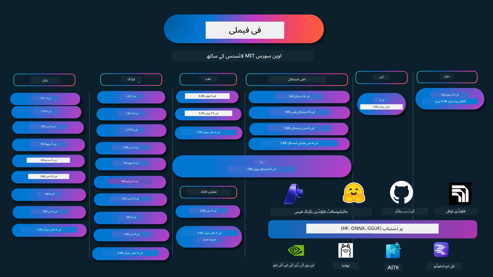

# فی کلیاتی کتاب: مائیکروسافٹ کے فی ماڈلز کے ساتھ عملی مثالیں

[](https://codespaces.new/microsoft/phicookbook)
[](https://vscode.dev/redirect?url=vscode://ms-vscode-remote.remote-containers/cloneInVolume?url=https://github.com/microsoft/phicookbook)

[](https://GitHub.com/microsoft/phicookbook/graphs/contributors/?WT.mc_id=aiml-137032-kinfeylo)
[](https://GitHub.com/microsoft/phicookbook/issues/?WT.mc_id=aiml-137032-kinfeylo)
[](https://GitHub.com/microsoft/phicookbook/pulls/?WT.mc_id=aiml-137032-kinfeylo)
[](http://makeapullrequest.com?WT.mc_id=aiml-137032-kinfeylo)

[](https://GitHub.com/microsoft/phicookbook/watchers/?WT.mc_id=aiml-137032-kinfeylo)
[](https://GitHub.com/microsoft/phicookbook/network/?WT.mc_id=aiml-137032-kinfeylo)
[](https://GitHub.com/microsoft/phicookbook/stargazers/?WT.mc_id=aiml-137032-kinfeylo)

[](https://discord.com/invite/ByRwuEEgH4)

فی ایک سلسلہ ہے اوپن سورس AI ماڈلز کا جو مائیکروسافٹ نے تیار کیے ہیں۔

فی اس وقت سب سے طاقتور اور کم لاگت والا چھوٹا زبان ماڈل (SLM) ہے، جس کے بہت اچھے معیار ہیں مختلف زبانوں میں، استدلال، متن/چیٹ تخلیق، کوڈنگ، تصاویر، آڈیو اور دیگر حالات میں۔

آپ فی کو کلاؤڈ یا ایج ڈیوائسز پر تعینات کر سکتے ہیں، اور آپ آسانی سے محدود کمپیوٹنگ طاقت کے ساتھ جنریشن AI ایپلی کیشنز بنا سکتے ہیں۔

ان وسائل کو استعمال شروع کرنے کے لئے یہ اقدامات کریں:
1. **ریپوزیٹری کو فورک کریں**: کلک کریں [](https://GitHub.com/microsoft/phicookbook/network/?WT.mc_id=aiml-137032-kinfeylo)
2. **ریپوزیٹری کو کلون کریں**: `git clone https://github.com/microsoft/PhiCookBook.git`
3. [**مائیکروسافٹ AI ڈسکارڈ کمیونٹی میں شامل ہوں اور ماہرین اور دیگر ڈویلپرز سے ملاقات کریں**](https://discord.com/invite/ByRwuEEgH4?WT.mc_id=aiml-137032-kinfeylo)



### 🌐 کثیر الزبان معاونت

#### GitHub ایکشن کے ذریعے معاونت (خودکار اور ہمیشہ تازہ ترین)

<!-- CO-OP TRANSLATOR LANGUAGES TABLE START -->
[عربی](../ar/README.md) | [بنگالی](../bn/README.md) | [بلغاریائی](../bg/README.md) | [برمی (میانمار)](../my/README.md) | [چینی (سادہ)](../zh-CN/README.md) | [چینی (روایتی، ہانگ کانگ)](../zh-HK/README.md) | [چینی (روایتی، میکاؤ)](../zh-MO/README.md) | [چینی (روایتی، تائیوان)](../zh-TW/README.md) | [کروشیاوی](../hr/README.md) | [چیک](../cs/README.md) | [ڈینش](../da/README.md) | [ڈچ](../nl/README.md) | [ایسٹونین](../et/README.md) | [فنش](../fi/README.md) | [فرانسیسی](../fr/README.md) | [جرمن](../de/README.md) | [یونانی](../el/README.md) | [عبرانی](../he/README.md) | [ہندی](../hi/README.md) | [ہنگریائی](../hu/README.md) | [انڈونیشین](../id/README.md) | [اطالوی](../it/README.md) | [جاپانی](../ja/README.md) | [کنڑا](../kn/README.md) | [خمیر](../km/README.md) | [کوریائی](../ko/README.md) | [لتھونین](../lt/README.md) | [ملائی](../ms/README.md) | [ملایالم](../ml/README.md) | [مراٹھی](../mr/README.md) | [نیپالی](../ne/README.md) | [نائجیرین پیجین](../pcm/README.md) | [ناروے](../no/README.md) | [فارسی (فارسی)](../fa/README.md) | [پولش](../pl/README.md) | [پرتگالی (برازیل)](../pt-BR/README.md) | [پرتگالی (پرتگال)](../pt-PT/README.md) | [پنجابی (گرمکھی)](../pa/README.md) | [رومانیائی](../ro/README.md) | [روسی](../ru/README.md) | [سربیائی (سریلیک)](../sr/README.md) | [سلوواک](../sk/README.md) | [سلووینیائی](../sl/README.md) | [ہسپانوی](../es/README.md) | [سواحلی](../sw/README.md) | [سویڈش](../sv/README.md) | [تاگالوگ (فلپائنی)](../tl/README.md) | [تمل](../ta/README.md) | [تیلگو](../te/README.md) | [تھائی](../th/README.md) | [ترک](../tr/README.md) | [یوکرائنی](../uk/README.md) | [اردو](./README.md) | [ویتنامی](../vi/README.md)

> **کیا آپ لوکل کلون کرنا پسند کریں گے؟**
>
> یہ ریپوزیٹری 50+ زبانوں کی ترجمے شامل ہے جو ڈاؤن لوڈ کے حجم میں نمایاں اضافہ کرتے ہیں۔ ترجمے کے بغیر کلون کرنے کے لیے، سپارس چیک آؤٹ استعمال کریں:
>
> **باش / میک او ایس / لینکس:**
> ```bash
> git clone --filter=blob:none --sparse https://github.com/microsoft/PhiCookBook.git
> cd PhiCookBook
> git sparse-checkout set --no-cone '/*' '!translations' '!translated_images'
> ```
>
> **CMD (ونڈوز):**
> ```cmd
> git clone --filter=blob:none --sparse https://github.com/microsoft/PhiCookBook.git
> cd PhiCookBook
> git sparse-checkout set --no-cone "/*" "!translations" "!translated_images"
> ```
>
> اس سے آپ کو کورس مکمل کرنے کے لیے سب کچھ مل جاتا ہے اور ڈاؤن لوڈ بہت تیز ہو جاتا ہے۔
<!-- CO-OP TRANSLATOR LANGUAGES TABLE END -->

## فہرست مضامین

- تعارف
  - [فی خاندان میں خوش آمدید](./md/01.Introduction/01/01.PhiFamily.md)
  - [اپنا ماحول ترتیب دینا](./md/01.Introduction/01/01.EnvironmentSetup.md)
  - [اہم ٹیکنالوجیز کو سمجھنا](./md/01.Introduction/01/01.Understandingtech.md)
  - [فی ماڈلز کے لیے AI سیفٹی](./md/01.Introduction/01/01.AISafety.md)
  - [فی ہارڈویئر سپورٹ](./md/01.Introduction/01/01.Hardwaresupport.md)
  - [پی اور کلاؤڈ کے درمیان فی ماڈلز اور دستیابی](./md/01.Introduction/01/01.Edgeandcloud.md)
  - [گائیڈنس- ای آئی اور فی کا استعمال](./md/01.Introduction/01/01.Guidance.md)
  - [گیٹ ہب مارکیٹ پلیس ماڈلز](https://github.com/marketplace/models)
  - [ایزور AI ماڈل کیٹلاگ](https://ai.azure.com)

- مختلف ماحول میں فی کی پیشگوئی
    -  [ہگیگ فیس](./md/01.Introduction/02/01.HF.md)
    -  [گیٹ ہب ماڈلز](./md/01.Introduction/02/02.GitHubModel.md)
    -  [مائیکروسافٹ فاؤنڈری ماڈل کیٹلاگ](./md/01.Introduction/02/03.AzureAIFoundry.md)
    -  [اولاما](./md/01.Introduction/02/04.Ollama.md)
    -  [AI ٹول کٹ VSCode (AITK)](./md/01.Introduction/02/05.AITK.md)
    -  [NVIDIA NIM](./md/01.Introduction/02/06.NVIDIA.md)
    -  [لوکل فاؤنڈری](./md/01.Introduction/02/07.FoundryLocal.md)

- فی خاندان کی پیشگوئی
    - [iOS میں فی کی پیشگوئی](./md/01.Introduction/03/iOS_Inference.md)
    - [اینڈرائیڈ میں فی کی پیشگوئی](./md/01.Introduction/03/Android_Inference.md)
    - [جیٹسن میں فی کی پیشگوئی](./md/01.Introduction/03/Jetson_Inference.md)
    - [AI پی سی میں فی کی پیشگوئی](./md/01.Introduction/03/AIPC_Inference.md)
    - [ایپل MLX فریم ورک کے ساتھ فی کی پیشگوئی](./md/01.Introduction/03/MLX_Inference.md)
    - [لوکل سرور میں فی کی پیشگوئی](./md/01.Introduction/03/Local_Server_Inference.md)
    - [AI ٹول کٹ استعمال کرتے ہوئے ریموٹ سرور پر فی کی پیشگوئی](./md/01.Introduction/03/Remote_Interence.md)
    - [رسٹ کے ساتھ فی کی پیشگوئی](./md/01.Introduction/03/Rust_Inference.md)
    - [لوکل میں فی وژن کی پیشگوئی](./md/01.Introduction/03/Vision_Inference.md)
    - [کایٹو AKS، ایزور کنٹینرز (سرکاری حمایت) کے ساتھ فی کی پیشگوئی](./md/01.Introduction/03/Kaito_Inference.md)
-  [فی خاندان کی مقداری جانچ](./md/01.Introduction/04/QuantifyingPhi.md)
    - [لاما.cpp کے ذریعے فی-3.5 / 4 کی مقداری جانچ](./md/01.Introduction/04/UsingLlamacppQuantifyingPhi.md)
    - [onnxruntime کے لیے جنریٹو AI توسیعات کے ذریعے فی-3.5 / 4 کی مقداری جانچ](./md/01.Introduction/04/UsingORTGenAIQuantifyingPhi.md)
    - [انٹیل اوپن وی نو کے ذریعے فی-3.5 / 4 کی مقداری جانچ](./md/01.Introduction/04/UsingIntelOpenVINOQuantifyingPhi.md)
    - [ایپل MLX فریم ورک کے ذریعے فی-3.5 / 4 کی مقداری جانچ](./md/01.Introduction/04/UsingAppleMLXQuantifyingPhi.md)

-  فی کی تشخیص
    - [ذمہ دار AI](./md/01.Introduction/05/ResponsibleAI.md)
    - [مائیکروسافٹ فاؤنڈری برائے تشخیص](./md/01.Introduction/05/AIFoundry.md)
    - [پرومپٹ فلو کے ذریعے تشخیص](./md/01.Introduction/05/Promptflow.md)
 
- ایزور AI سرچ کے ساتھ RAG
    - [فی-4-منی اور فی-4-ملٹی موڈل (RAG) کو ایزور AI سرچ کے ساتھ استعمال کرنا](https://github.com/microsoft/PhiCookBook/blob/main/code/06.E2E/E2E_Phi-4-RAG-Azure-AI-Search.ipynb)
    - [زیرو کلاؤڈ لوکل ہائبرڈ RAG SQLite FTS5 اور فی-4-منی کے ساتھ](https://github.com/microsoft/PhiCookBook/blob/main/code/06.E2E/E2E_Phi-4-mini_Local_Hybrid_RAG_SQLite_FTS5.ipynb)

- فی ایپلیکیشن ڈیولپمنٹ نمونے
  - متن اور چیٹ ایپلیکیشنز
    - فی-4 کے نمونے
      - [📓] [فی-4-منی ONNX ماڈل کے ساتھ چیٹ](./md/02.Application/01.TextAndChat/Phi4/ChatWithPhi4ONNX/README.md)
      - [فی-4 لوکل ONNX ماڈل کے ساتھ چیٹ .NET](../../md/04.HOL/dotnet/src/LabsPhi4-Chat-01OnnxRuntime)
      - [Sementic Kernel کا استعمال کرتے ہوئے فی-4 ONNX کے ساتھ چیٹ .NET کونسول ایپ](../../md/04.HOL/dotnet/src/LabsPhi4-Chat-02SK)

    - فائی-3 / 3.5 نمونے
      - [براؤزر میں مقامی چیٹ بوٹ جو فی 3، ONNX Runtime Web اور WebGPU استعمال کرتا ہے](https://github.com/microsoft/onnxruntime-inference-examples/tree/main/js/chat)
      - [اوپن وینو چیٹ](./md/02.Application/01.TextAndChat/Phi3/E2E_OpenVino_Chat.md)
      - [کثیر ماڈل - انٹرایکٹو Phi-3-mini اور OpenAI Whisper](./md/02.Application/01.TextAndChat/Phi3/E2E_Phi-3-mini_with_whisper.md)
      - [MLFlow - ریپر بنانے اور Phi-3 کو MLFlow کے ساتھ استعمال کرنے کا طریقہ](./md//02.Application/01.TextAndChat/Phi3/E2E_Phi-3-MLflow.md)
      - [ماڈل کی اصلاح - ONNX Runtime Web کے لیے Phi-3-min ماڈل کو Olive کے ساتھ کیسے بہتر بنایا جائے](https://github.com/microsoft/Olive/tree/main/examples/phi3)
      - [WinUI3 ایپ Phi-3 mini-4k-instruct-onnx کے ساتھ](https://github.com/microsoft/Phi3-Chat-WinUI3-Sample/)
      -[WinUI3 ملٹی ماڈل AI پاورڈ نوٹس ایپ کا نمونہ](https://github.com/microsoft/ai-powered-notes-winui3-sample)
      - [کسٹم فائی-3 ماڈلز کو فائن ٹون کریں اور پرامپٹ فلو کے ساتھ انضمام کریں](./md/02.Application/01.TextAndChat/Phi3/E2E_Phi-3-FineTuning_PromptFlow_Integration.md)
      - [Microsoft Foundry میں پرامپٹ فلو کے ساتھ کسٹم فائی-3 ماڈلز کو فائن ٹون کریں اور انضمام کریں](./md/02.Application/01.TextAndChat/Phi3/E2E_Phi-3-FineTuning_PromptFlow_Integration_AIFoundry.md)
      - [Microsoft Foundry میں فائن ٹون کیے گئے Phi-3 / Phi-3.5 ماڈل کا جائزہ لیں، Microsoft کی ذمہ دار AI اصولوں پر توجہ کے ساتھ](./md/02.Application/01.TextAndChat/Phi3/E2E_Phi-3-Evaluation_AIFoundry.md)
      - [📓] [Phi-3.5-mini-instruct زبان کی پیش گوئی کا نمونہ (چینی/انگریزی)](./md/02.Application/01.TextAndChat/Phi3/phi3-instruct-demo.ipynb)
      - [Phi-3.5-Instruct WebGPU RAG چیٹ بوٹ](./md/02.Application/01.TextAndChat/Phi3/WebGPUWithPhi35Readme.md)
      - [Phi-3.5-Instruct ONNX کے ساتھ پرامپٹ فلو حل بنانے کے لیے ونڈوز GPU کا استعمال](./md/02.Application/01.TextAndChat/Phi3/UsingPromptFlowWithONNX.md)
      - [مائیکروسافٹ Phi-3.5 tflite استعمال کرتے ہوئے اینڈرائیڈ ایپ بنائیں](./md/02.Application/01.TextAndChat/Phi3/UsingPhi35TFLiteCreateAndroidApp.md)
      - [Q&A .NET مثال مائیکروسافٹ.ML.OnnxRuntime استعمال کرتے ہوئے مقامی ONNX Phi-3 ماڈل کے ساتھ](../../md/04.HOL/dotnet/src/LabsPhi301)
      - [Semantic Kernel اور Phi-3 کے ساتھ کنسول چیٹ .NET ایپ](../../md/04.HOL/dotnet/src/LabsPhi302)

  - Azure AI Inference SDK کوڈ کی بنیاد پر نمونے 
    - فائی-4 نمونے 
      - [📓] [Phi-4-multimodal استعمال کرتے ہوئے پروجیکٹ کوڈ جنریٹ کریں](./md/02.Application/02.Code/Phi4/GenProjectCode/README.md)
    - فائی-3 / 3.5 نمونے
      - [مائیکروسافٹ Phi-3 فیملی کے ساتھ اپنا Visual Studio Code GitHub Copilot چیٹ بنائیں](./md/02.Application/02.Code/Phi3/VSCodeExt/README.md)
      - [GitHub ماڈلز کے ذریعے Phi-3.5 کے ساتھ اپنا Visual Studio Code Chat Copilot ایجنٹ بنائیں](/md/02.Application/02.Code/Phi3/CreateVSCodeChatAgentWithGitHubModels.md)

  - جدید استدلال کے نمونے
    - فائی-4 نمونے 
      - [📓] [Phi-4-mini-reasoning یا Phi-4-reasoning نمونے](./md/02.Application/03.AdvancedReasoning/Phi4/AdvancedResoningPhi4mini/README.md)
      - [📓] [Microsoft Olive کے ساتھ Phi-4-mini-reasoning کی فائن ٹوننگ](./md/02.Application/03.AdvancedReasoning/Phi4/AdvancedResoningPhi4mini/olive_ft_phi_4_reasoning_with_medicaldata.ipynb)
      - [📓] [Apple MLX کے ساتھ Phi-4-mini-reasoning کی فائن ٹوننگ](./md/02.Application/03.AdvancedReasoning/Phi4/AdvancedResoningPhi4mini/mlx_ft_phi_4_reasoning_with_medicaldata.ipynb)
      - [📓] [GitHub ماڈلز کے ساتھ Phi-4-mini-reasoning](./md/02.Application/02.Code/Phi4r/github_models_inference.ipynb)
      - [📓] [Microsoft Foundry ماڈلز کے ساتھ Phi-4-mini-reasoning](./md/02.Application/02.Code/Phi4r/azure_models_inference.ipynb)
  - ڈیموز
      - [Phi-4-mini ڈیموز جو Hugging Face Spaces پر میزبانی کی گئی ہیں](https://huggingface.co/spaces/microsoft/phi-4-mini?WT.mc_id=aiml-137032-kinfeylo)
      - [Phi-4-multimodal ڈیموز جو Hugginge Face Spaces پر میزبانی کی گئی ہیں](https://huggingface.co/spaces/microsoft/phi-4-multimodal?WT.mc_id=aiml-137032-kinfeylo)
  - وژن نمونے
    - فائی-4 نمونے 
      - [📓] [Phi-4-multimodal استعمال کرتے ہوئے تصاویر پڑھیں اور کوڈ بنائیں](./md/02.Application/04.Vision/Phi4/CreateFrontend/README.md) 
    - فائی-3 / 3.5 نمونے
      -  [📓][Phi-3-vision-تصویر سے متن تک متن](./md/02.Application/04.Vision/Phi3/E2E_Phi-3-vision-image-text-to-text-online-endpoint.ipynb)
      - [Phi-3-vision-ONNX](https://onnxruntime.ai/docs/genai/tutorials/phi3-v.html)
      - [📓][Phi-3-vision CLIP ایمبیڈنگ](./md/02.Application/04.Vision/Phi3/E2E_Phi-3-vision-image-text-to-text-online-endpoint.ipynb)
      - [ڈیمو: Phi-3 ریسائیکلنگ](https://github.com/jennifermarsman/PhiRecycling/)
      - [Phi-3-vision - بصری زبان کا معاون - Phi3-Vision اور OpenVINO کے ساتھ](https://docs.openvino.ai/nightly/notebooks/phi-3-vision-with-output.html)
      - [Phi-3 وژن Nvidia NIM](./md/02.Application/04.Vision/Phi3/E2E_Nvidia_NIM_Vision.md)
      - [Phi-3 وژن OpenVino](./md/02.Application/04.Vision/Phi3/E2E_OpenVino_Phi3Vision.md)
      - [📓][Phi-3.5 وژن کثیر فریم یا کثیر تصویر کا نمونہ](./md/02.Application/04.Vision/Phi3/phi3-vision-demo.ipynb)
      - [Phi-3 وژن مقامی ONNX ماڈل مائیکروسافٹ.ML.OnnxRuntime .NET استعمال کرتے ہوئے](../../md/04.HOL/dotnet/src/LabsPhi303)
      - [مینیو پر مبنی Phi-3 وژن مقامی ONNX ماڈل مائیکروسافٹ.ML.OnnxRuntime .NET استعمال کرتے ہوئے](../../md/04.HOL/dotnet/src/LabsPhi304)

  - استدلال-وژن نمونے
    - Phi-4-Reasoning-Vision-15B 
      - [📓] [Phi-4-Reasoning-Vision-15B کا استعمال کرتے ہوئے جے واکنگ کی شناخت](./md/02.Application/10.ReasoningVision/Phi_4_reasoning_vision_15b_Jaywalking.ipynb)
      - [📓] [Phi-4-Reasoning-Vision-15B کا استعمال کرتے ہوئے ریاضی](./md/02.Application/10.ReasoningVision/Phi_4_reasoning_vision_15b_Math.ipynb)
      - [📓] [Phi-4-Reasoning-Vision-15B کا استعمال کرتے ہوئے UI کی شناخت](./md/02.Application/10.ReasoningVision/Phi_4_reasoning_vision_15b_ui.ipynb)

  - ریاضی کے نمونے
    -  Phi-4-Mini-Flash-Reasoning-Instruct نمونے  [Phi-4-Mini-Flash-Reasoning-Instruct کے ساتھ ریاضی کا ڈیمو](./md/02.Application/09.Math/MathDemo.ipynb)

  - آڈیو نمونے
    - فائی-4 نمونے 
      - [📓] [Phi-4-multimodal کا استعمال کرتے ہوئے آڈیو نقلیں نکالنا](./md/02.Application/05.Audio/Phi4/Transciption/README.md)
      - [📓] [Phi-4-multimodal آڈیو نمونہ](./md/02.Application/05.Audio/Phi4/Siri/demo.ipynb)
      - [📓] [Phi-4-multimodal تقریر ترجمہ کا نمونہ](./md/02.Application/05.Audio/Phi4/Translate/demo.ipynb)
      - [.NET کنسول ایپلی کیشن کا استعمال کرتے ہوئے Phi-4-multimodal آڈیو فائل کا تجزیہ اور نقل تیار کرنا](../../md/04.HOL/dotnet/src/LabsPhi4-MultiModal-02Audio)

  - MOE نمونے
    - فائی-3 / 3.5 نمونے
      - [📓] [Phi-3.5 ماہرین کے امتزاج (MoEs) سے متعلق سوشل میڈیا نمونہ](./md/02.Application/06.MoE/Phi3/phi3_moe_demo.ipynb)
      - [📓] [NVIDIA NIM Phi-3 MOE، Azure AI Search، اور LlamaIndex کے ساتھ ریٹریول-آگمینٹڈ جنریشن (RAG) پائپ لائن بنانا](./md/02.Application/06.MoE/Phi3/azure-ai-search-nvidia-rag.ipynb)
      - 
  - فنکشن کالنگ نمونے
    - فائی-4 نمونے 🆕
      -  [📓] [Phi-4-mini کے ساتھ فنکشن کالنگ کا استعمال](./md/02.Application/07.FunctionCalling/Phi4/FunctionCallingBasic/README.md)
      -  [📓] [Phi-4-mini کے ساتھ ملٹی ایجنٹس بنانے کے لیے فنکشن کالنگ کا استعمال](./md/02.Application/07.FunctionCalling/Phi4/Multiagents/Phi_4_mini_multiagent.ipynb)
      -  [📓] [Ollama کے ساتھ فنکشن کالنگ کا استعمال](./md/02.Application/07.FunctionCalling/Phi4/Ollama/ollama_functioncalling.ipynb)
      -  [📓] [ONNX کے ساتھ فنکشن کالنگ کا استعمال](./md/02.Application/07.FunctionCalling/Phi4/ONNX/onnx_parallel_functioncalling.ipynb)
  - ملٹی موڈل مکسنگ نمونے
    - فائی-4 نمونے 🆕
      -  [📓] [ٹیکنالوجی صحافی کے طور پر Phi-4-multimodal کا استعمال](./md/02.Application/08.Multimodel/Phi4/TechJournalist/phi_4_mm_audio_text_publish_news.ipynb)
      - [.NET کنسول ایپلی کیشن کا استعمال کرتے ہوئے Phi-4-multimodal تصاویر کا تجزیہ](../../md/04.HOL/dotnet/src/LabsPhi4-MultiModal-01Images)

- فائن ٹوننگ فی نمونے
  - [فائن ٹوننگ کے منظرنامے](./md/03.FineTuning/FineTuning_Scenarios.md)
  - [فائن ٹوننگ بمقابلہ RAG](./md/03.FineTuning/FineTuning_vs_RAG.md)
  - [Phi-3 کو صنعتی ماہر بنائیں](./md/03.FineTuning/LetPhi3gotoIndustriy.md)
  - [VS Code کے لیے AI Toolkit کے ساتھ Phi-3 کی فائن ٹوننگ](./md/03.FineTuning/Finetuning_VSCodeaitoolkit.md)
  - [Azure Machine Learning سروس کے ساتھ Phi-3 کی فائن ٹوننگ](./md/03.FineTuning/Introduce_AzureML.md)
  - [Lora کے ساتھ Phi-3 کی فائن ٹوننگ](./md/03.FineTuning/FineTuning_Lora.md)
  - [QLora کے ساتھ Phi-3 کی فائن ٹوننگ](./md/03.FineTuning/FineTuning_Qlora.md)
  - [Microsoft Foundry کے ساتھ Phi-3 کی فائن ٹوننگ](./md/03.FineTuning/FineTuning_AIFoundry.md)
  - [Azure ML CLI/SDK کے ساتھ Phi-3 کی فائن ٹوننگ](./md/03.FineTuning/FineTuning_MLSDK.md)
  - [Microsoft Olive کے ساتھ فائن ٹوننگ](./md/03.FineTuning/FineTuning_MicrosoftOlive.md)
  - [Microsoft Olive Hands-On Lab سے فائن ٹوننگ](./md/03.FineTuning/olive-lab/readme.md)
  - [Weights اور Bias کے ساتھ Phi-3-vision کی فائن ٹوننگ](./md/03.FineTuning/FineTuning_Phi-3-visionWandB.md)

  - [ایپل MLX فریم ورک کے ساتھ فی-3 کو فائن ٹون کرنا](./md/03.FineTuning/FineTuning_MLX.md)
  - [Phi-3-vision کو فائن ٹون کرنا (سرکاری حمایت)](./md/03.FineTuning/FineTuning_Vision.md)
  - [کائٹو AKS، ایزور کنٹینرز کے ساتھ Phi-3 کو فائن ٹون کرنا (سرکاری حمایت)](./md/03.FineTuning/FineTuning_Kaito.md)
  - [Phi-3 اور 3.5 وژن کو فائن ٹون کرنا](https://github.com/2U1/Phi3-Vision-Finetune)

- عملی لیب
  - [جدید ترین ماڈلز کی تلاش: LLMs، SLMs، مقامی ترقی اور مزید](https://github.com/microsoft/aitour-exploring-cutting-edge-models)
  - [NLP کی صلاحیت کھولنا: مائیکروسافٹ اولیو کے ساتھ فائن ٹوننگ](https://github.com/azure/Ignite_FineTuning_workshop)

- تعلیمی تحقیقی مقالے اور اشاعتیں
  - [صرف درسی کتابیں کافی ہیں II: phi-1.5 تکنیکی رپورٹ](https://arxiv.org/abs/2309.05463)
  - [Phi-3 تکنیکی رپورٹ: آپ کے فون پر ایک انتہائی قابل زبان ماڈل](https://arxiv.org/abs/2404.14219)
  - [Phi-4 تکنیکی رپورٹ](https://arxiv.org/abs/2412.08905)
  - [Phi-4-Mini تکنیکی رپورٹ: مختصر مگر طاقتور ملٹی ماڈل زبان کے ماڈلز LoRA کے امتزاج کے ذریعے](https://arxiv.org/abs/2503.01743)
  - [گاڑی میں فنکشن کالنگ کے لیے چھوٹے زبان کے ماڈلز کی اصلاح](https://arxiv.org/abs/2501.02342)
  - [(WhyPHI) فائن ٹوننگ PHI-3 برائے کثیر انتخاب سوالات کا جواب دینا: طریقہ کار، نتائج، اور چیلنجز](https://arxiv.org/abs/2501.01588)
  - [Phi-4-ریزننگ تکنیکی رپورٹ](https://www.microsoft.com/en-us/research/wp-content/uploads/2025/04/phi_4_reasoning.pdf)
  - [Phi-4-منی-ریزننگ تکنیکی رپورٹ](https://huggingface.co/microsoft/Phi-4-mini-reasoning/blob/main/Phi-4-Mini-Reasoning.pdf)

## فی ماڈلز کا استعمال

### مائیکروسافٹ فاؤنڈری پر Phi

آپ مائیکروسافٹ فی کا استعمال کرنا اور اپنے مختلف ہارڈویئر آلات میں ای2ای حل تیار کرنا سیکھ سکتے ہیں۔ خود فی کا تجربہ کرنے کے لیے، ماڈلز کے ساتھ کھیلنا شروع کریں اور اپنے منظرناموں کے لیے فی کو حسب ضرورت بنائیں [Microsoft Foundry Azure AI Model Catalog](https://aka.ms/phi3-azure-ai) کا استعمال کرتے ہوئے آپ مزید جان سکتے ہیں Getting Started with [Microsoft Foundry](/md/02.QuickStart/AzureAIFoundry_QuickStart.md)

**پلے گراؤنڈ**
ہر ماڈل کے لیے ایک مخصوص پلے گراؤنڈ موجود ہے تاکہ ماڈل کو ٹیسٹ کیا جا سکے [Azure AI Playground](https://aka.ms/try-phi3).

### GitHub ماڈلز پر Phi

آپ مائیکروسافٹ فی کا استعمال کرنا اور اپنے مختلف ہارڈویئر آلات میں ای2ای حل تیار کرنا سیکھ سکتے ہیں۔ خود فی کا تجربہ کرنے کے لیے، ماڈل کے ساتھ کھیلنا شروع کریں اور اپنے منظرناموں کے لیے فی کو حسب ضرورت بنائیں [GitHub Model Catalog](https://github.com/marketplace/models?WT.mc_id=aiml-137032-kinfeylo) کا استعمال کرتے ہوئے آپ مزید جان سکتے ہیں Getting Started with [GitHub Model Catalog](/md/02.QuickStart/GitHubModel_QuickStart.md)

**پلے گراؤنڈ**
ہر ماڈل کے لیے ایک مخصوص [پلے گراؤنڈ تاکہ ماڈل کو ٹیسٹ کیا جا سکے](/md/02.QuickStart/GitHubModel_QuickStart.md) موجود ہے۔

### Hugging Face پر Phi

آپ ماڈل کو [Hugging Face](https://huggingface.co/microsoft) پر بھی تلاش کر سکتے ہیں۔

**پلے گراؤنڈ**
 [Hugging Chat playground](https://huggingface.co/chat/models/microsoft/Phi-3-mini-4k-instruct)

 ## 🎒 دیگر کورسز

ہماری ٹیم دیگر کورسز بھی تیار کرتی ہے! دیکھیں:

<!-- CO-OP TRANSLATOR OTHER COURSES START -->
### لینگ چین
[](https://aka.ms/langchain4j-for-beginners)
[](https://aka.ms/langchainjs-for-beginners?WT.mc_id=m365-94501-dwahlin)
[](https://github.com/microsoft/langchain-for-beginners?WT.mc_id=m365-94501-dwahlin)
---

### ایزور / ایج / MCP / ایجنٹس
[](https://github.com/microsoft/AZD-for-beginners?WT.mc_id=academic-105485-koreyst)
[](https://github.com/microsoft/edgeai-for-beginners?WT.mc_id=academic-105485-koreyst)
[](https://github.com/microsoft/mcp-for-beginners?WT.mc_id=academic-105485-koreyst)
[](https://github.com/microsoft/ai-agents-for-beginners?WT.mc_id=academic-105485-koreyst)

---
 
### جنریٹیو AI سیریز
[](https://github.com/microsoft/generative-ai-for-beginners?WT.mc_id=academic-105485-koreyst)
[-9333EA?style=for-the-badge&labelColor=E5E7EB&color=9333EA)](https://github.com/microsoft/Generative-AI-for-beginners-dotnet?WT.mc_id=academic-105485-koreyst)
[-C084FC?style=for-the-badge&labelColor=E5E7EB&color=C084FC)](https://github.com/microsoft/generative-ai-for-beginners-java?WT.mc_id=academic-105485-koreyst)
[-E879F9?style=for-the-badge&labelColor=E5E7EB&color=E879F9)](https://github.com/microsoft/generative-ai-with-javascript?WT.mc_id=academic-105485-koreyst)

---
 
### کور لرننگ
[](https://aka.ms/ml-beginners?WT.mc_id=academic-105485-koreyst)
[](https://aka.ms/datascience-beginners?WT.mc_id=academic-105485-koreyst)
[](https://aka.ms/ai-beginners?WT.mc_id=academic-105485-koreyst)
[](https://github.com/microsoft/Security-101?WT.mc_id=academic-96948-sayoung)
[](https://aka.ms/webdev-beginners?WT.mc_id=academic-105485-koreyst)
[](https://aka.ms/iot-beginners?WT.mc_id=academic-105485-koreyst)
[](https://github.com/microsoft/xr-development-for-beginners?WT.mc_id=academic-105485-koreyst)

---
 
### کوپائلٹ سیریز
[](https://aka.ms/GitHubCopilotAI?WT.mc_id=academic-105485-koreyst)
[](https://github.com/microsoft/mastering-github-copilot-for-dotnet-csharp-developers?WT.mc_id=academic-105485-koreyst)
[](https://github.com/microsoft/CopilotAdventures?WT.mc_id=academic-105485-koreyst)
<!-- CO-OP TRANSLATOR OTHER COURSES END -->

## ذمہ دار AI

مائیکروسافٹ ہمارے صارفین کی مدد کرنے کے لیے پرعزم ہے کہ وہ ہمارے AI مصنوعات کو ذمے داری کے ساتھ استعمال کریں، ہماری سیکھوں کو شیئر کریں، اور ٹرانسپیرنسی نوٹس اور امپیکٹ اسسمنٹس جیسے اوزار کے ذریعے اعتماد پر مبنی شراکت داری قائم کریں۔ ان میں سے بہت سے وسائل [https://aka.ms/RAI](https://aka.ms/RAI) پر دستیاب ہیں۔
مائیکروسافٹ کا ذمہ دار AI کا طریقہ کار ہمارے AI اصولوں پر مبنی ہے جس میں منصفانہ، قابل اعتماد اور محفوظ، پرائیویسی اور سیکیورٹی، شمولیت، شفافیت، اور جوابدہی شامل ہیں۔

بڑے پیمانے پر قدرتی زبان، تصویر، اور تقریر کے ماڈلز - جیسا کہ اس نمونے میں استعمال کیے گئے ہیں - ممکنہ طور پر ایسے طریقوں سے برتاو کر سکتے ہیں جو غیر منصفانہ، غیر قابل اعتماد، یا ناگوار ہوں، جو نقصان کا باعث بن سکتے ہیں۔ براہ کرم رجوع کریں [Azure OpenAI service Transparency note](https://learn.microsoft.com/legal/cognitive-services/openai/transparency-note?tabs=text) تا کہ خطرات اور حدود کے بارے میں معلومات حاصل کر سکیں۔


ان خطرات کو کم کرنے کے لیے تجویز کردہ طریقہ کار یہ ہے کہ آپ اپنے آرکیٹیکچر میں ایک حفاظتی نظام شامل کریں جو نقصان دہ رویے کا پتہ لگا سکے اور اسے روک سکے۔ [Azure AI Content Safety](https://learn.microsoft.com/azure/ai-services/content-safety/overview) ایک آزاد حفاظتی پرت فراہم کرتا ہے، جو ایپلیکیشنز اور خدمات میں نقصان دہ صارف کی طرف سے تیار کردہ اور AI کی طرف سے تیار کردہ مواد کا پتہ لگانے کے قابل ہے۔ Azure AI Content Safety میں متن اور تصویر کے APIs شامل ہیں جو آپ کو نقصان دہ مواد کا پتہ لگانے کی اجازت دیتے ہیں۔ Microsoft Foundry کے اندر، Content Safety سروس آپ کو مختلف طریقوں سے نقصان دہ مواد کا پتہ لگانے کے لیے نمونہ کوڈ دیکھنے، دریافت کرنے اور آزمانے کی اجازت دیتی ہے۔ درج ذیل [quickstart ڈاکیومنٹیشن](https://learn.microsoft.com/azure/ai-services/content-safety/quickstart-text?tabs=visual-studio%2Clinux&pivots=programming-language-rest) آپ کو سروس کو درخواستیں کرنے کے طریقہ کار سے رہنمائی فراہم کرتی ہے۔

ایک اور پہلو جس کا خیال رکھنا ضروری ہے وہ مجموعی ایپلیکیشن کی کارکردگی ہے۔ کثیر وضع اور کثیر ماڈل ایپلیکیشنز کے ساتھ، ہم کارکردگی کو اس طرح سمجھتے ہیں کہ سسٹم ویسا ہی کام کرے جیسا کہ آپ اور آپ کے صارفین توقع کرتے ہیں، جس میں نقصان دہ نتائج پیدا نہ ہوں۔ اپنی مجموعی ایپلیکیشن کی کارکردگی کا اندازہ لگانا ضروری ہے جس کے لیے [Performance and Quality and Risk and Safety evaluators](https://learn.microsoft.com/azure/ai-studio/concepts/evaluation-metrics-built-in) کا استعمال کریں۔ آپ کے پاس [custom evaluators](https://learn.microsoft.com/azure/ai-studio/how-to/develop/evaluate-sdk#custom-evaluators) تخلیق کرنے اور ان سے جانچ کرنے کی بھی صلاحیت موجود ہے۔

آپ اپنے AI ایپلیکیشن کا اپنے ترقیاتی ماحول میں [Azure AI Evaluation SDK](https://microsoft.github.io/promptflow/index.html) کے ذریعے جائزہ لے سکتے ہیں۔ چاہے ایک ٹیسٹ ڈیٹاسیٹ ہو یا ہدف، آپ کی جنریٹیو AI ایپلیکیشن کی جنریشنز کو بلٹ ان ایوالویٹرز یا اپنی پسند کے کسٹم ایوالویٹرز کے ذریعے مقداری طور پر ماپا جاتا ہے۔ اپنے سسٹم کا جائزہ لینے کے لیے Azure AI Evaluation SDK کے ساتھ شروع ہونے کے لیے، آپ [quickstart guide](https://learn.microsoft.com/azure/ai-studio/how-to/develop/flow-evaluate-sdk) کی پیروی کر سکتے ہیں۔ ایک بار جب آپ جائزے کا عمل انجام دیتے ہیں، تو آپ [Microsoft Foundry میں نتائج کا تجزیہ کر سکتے ہیں](https://learn.microsoft.com/azure/ai-studio/how-to/evaluate-flow-results)۔

## تجارتی نشان

یہ پروجیکٹ پروجیکٹس، مصنوعات، یا خدمات کے لیے تجارتی نشان یا لوگوز رکھ سکتا ہے۔ Microsoft کے تجارتی نشانوں یا لوگوز کے مجاز استعمال کے لیے [Microsoft کے تجارتی نشان اور برانڈ کی ہدایات](https://www.microsoft.com/legal/intellectualproperty/trademarks/usage/general) کی پیروی کرنا ضروری ہے۔
Microsoft کے تجارتی نشانوں یا لوگوز کے ترمیم شدہ ورژنز میں استعمال سے الجھن پیدا نہیں ہونی چاہیے اور نہ ہی وہ Microsoft کی اسپانسرشپ ظاہر کریں۔ کسی بھی تیسرے فریق کے تجارتی نشانوں یا لوگوز کے استعمال پر ان تیسرے فریق کی پالیسیاں لاگو ہوتی ہیں۔

## مدد حاصل کریں

اگر آپ کو پھنسنے کا سامنا ہو یا AI ایپس بنانے کے بارے میں کوئی سوال ہو تو شامل ہوں:

[](https://aka.ms/foundry/discord)

اگر آپ کے پاس مصنوع کے بارے میں آراء ہوں یا تعمیر کے دوران کوئی خرابی ہو تو دیکھیں:

[](https://aka.ms/foundry/forum)

---

<!-- CO-OP TRANSLATOR DISCLAIMER START -->
**ڈس کلیمر**:
یہ دستاویز AI ترجمہ سروس [Co-op Translator](https://github.com/Azure/co-op-translator) کے ذریعے ترجمہ کی گئی ہے۔ جبکہ ہم درستگی کے لیے کوشاں ہیں، براہ کرم اس بات سے آگاہ رہیں کہ خودکار ترجمے میں غلطیاں یا عدم درستیاں ہو سکتی ہیں۔ اصل دستاویز اپنے مادری زبان میں مستند ماخذ سمجھی جائے گی۔ حساس معلومات کے لیے پیشہ ور انسانی ترجمہ کی سفارش کی جاتی ہے۔ اس ترجمے کے استعمال سے پیدا ہونے والی کسی بھی غلط فہمی یا غلط تشریح کی ذمہ داری ہم قبول نہیں کرتے۔
<!-- CO-OP TRANSLATOR DISCLAIMER END -->