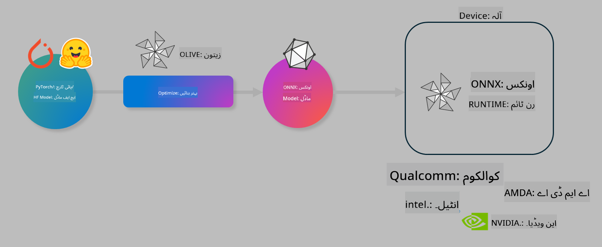

<!--
CO_OP_TRANSLATOR_METADATA:
{
  "original_hash": "6bbe47de3b974df7eea29dfeccf6032b",
  "translation_date": "2025-05-07T15:16:43+00:00",
  "source_file": "code/03.Finetuning/olive-lab/readme.md",
  "language_code": "ur"
}
-->
# لیب۔ آن-ڈیوائس انفرنس کے لیے AI ماڈلز کو بہتر بنائیں

## تعارف

> [!IMPORTANT]  
> اس لیب کے لیے **Nvidia A10 یا A100 GPU** اور متعلقہ ڈرائیورز اور CUDA ٹول کٹ (ورژن 12+) انسٹال ہونا ضروری ہے۔

> [!NOTE]  
> یہ ایک **35 منٹ** کی لیب ہے جو آپ کو OLIVE کے ذریعے آن-ڈیوائس انفرنس کے لیے ماڈلز کو بہتر بنانے کے بنیادی تصورات کا عملی تعارف دے گی۔

## سیکھنے کے مقاصد

اس لیب کے آخر میں، آپ OLIVE استعمال کر کے کر سکیں گے:

- AWQ کوانٹائزیشن طریقہ کار استعمال کرتے ہوئے AI ماڈل کو کوانٹائز کرنا۔  
- کسی مخصوص کام کے لیے AI ماڈل کو فائن ٹیون کرنا۔  
- ONNX Runtime پر مؤثر آن-ڈیوائس انفرنس کے لیے LoRA ایڈاپٹرز (فائن ٹیونڈ ماڈل) تیار کرنا۔

### Olive کیا ہے

Olive (*O*NNX *live*) ایک ماڈل آپٹیمائزیشن ٹول کٹ ہے جس کے ساتھ CLI آتا ہے جو آپ کو ONNX runtime +++https://onnxruntime.ai+++ کے لیے معیار اور کارکردگی کے ساتھ ماڈلز بھیجنے کی سہولت دیتا ہے۔



Olive میں ان پٹ عموماً PyTorch یا Hugging Face ماڈل ہوتا ہے اور آؤٹ پٹ ایک بہتر بنایا ہوا ONNX ماڈل ہوتا ہے جو ڈیوائس (ڈیپلائمنٹ ٹارگٹ) پر چلتا ہے جو ONNX runtime استعمال کرتا ہے۔ Olive ماڈل کو ہارڈویئر وینڈر جیسے Qualcomm، AMD، Nvidia یا Intel کے فراہم کردہ AI ایکسلریٹر (NPU، GPU، CPU) کے لیے بہتر بناتا ہے۔

Olive ایک *workflow* چلاتا ہے، جو کہ ماڈل آپٹیمائزیشن کے انفرادی کاموں کی ترتیب وار سیریز ہوتی ہے جسے *passes* کہتے ہیں - جیسے ماڈل کمپریشن، گراف کیپچر، کوانٹائزیشن، گراف آپٹیمائزیشن۔ ہر پاس کے پیرامیٹرز ہوتے ہیں جنہیں بہتر میٹرکس (جیسے accuracy اور latency) حاصل کرنے کے لیے ٹیون کیا جا سکتا ہے، جنہیں متعلقہ ایویلیویٹر سے پرکھا جاتا ہے۔ Olive ایک سرچ اسٹریٹجی استعمال کرتا ہے جو ہر پاس کو الگ الگ یا پاسز کے سیٹ کو ایک ساتھ آٹو-ٹیون کرنے کے لیے سرچ الگورتھم کا استعمال کرتی ہے۔

#### Olive کے فوائد

- گراف آپٹیمائزیشن، کمپریشن اور کوانٹائزیشن کے مختلف تکنیکوں کے ساتھ ہاتھ سے تجربات کرنے کے وقت اور پریشانی کو کم کریں۔ اپنی کوالٹی اور کارکردگی کی حدود متعین کریں اور Olive بہترین ماڈل خود تلاش کرے گا۔  
- **40+ بلٹ ان ماڈل آپٹیمائزیشن کمپونینٹس** جو جدید تکنیکوں کو کوانٹائزیشن، کمپریشن، گراف آپٹیمائزیشن اور فائن ٹیوننگ میں شامل کرتے ہیں۔  
- عام ماڈل آپٹیمائزیشن کاموں کے لیے آسان CLI، مثلاً olive quantize، olive auto-opt، olive finetune۔  
- ماڈل پیکجنگ اور ڈیپلائمنٹ بلٹ ان۔  
- **Multi LoRA سروِسنگ** کے لیے ماڈلز بنانے کی حمایت۔  
- YAML/JSON استعمال کر کے ورک فلو تیار کرنا تاکہ ماڈل آپٹیمائزیشن اور ڈیپلائمنٹ کے کام منظم کیے جا سکیں۔  
- **Hugging Face** اور **Azure AI** انٹیگریشن۔  
- بلٹ ان **کیشنگ** میکانزم جو **لاگت بچاتا ہے**۔

## لیب کی ہدایات

> [!NOTE]  
> براہ کرم یقینی بنائیں کہ آپ نے اپنا Azure AI Hub اور پروجیکٹ فراہم کیا ہے اور Lab 1 کے مطابق اپنا A100 کمپیوٹ سیٹ اپ کر لیا ہے۔

### مرحلہ 0: اپنے Azure AI کمپیوٹ سے کنیکٹ کریں

آپ **VS Code** میں ریموٹ فیچر استعمال کرتے ہوئے Azure AI کمپیوٹ سے کنیکٹ ہوں گے۔

1. اپنا **VS Code** ڈیسک ٹاپ ایپلیکیشن کھولیں۔  
2. **Shift+Ctrl+P** دبائیں تاکہ **کمانڈ پیلیٹ** کھلے۔  
3. کمانڈ پیلیٹ میں تلاش کریں **AzureML - remote: Connect to compute instance in New Window**۔  
4. آن اسکرین ہدایات پر عمل کریں تاکہ کمپیوٹ سے کنیکٹ ہو سکیں۔ اس میں آپ کی Azure سبسکرپشن، Resource Group، پروجیکٹ اور کمپیوٹ کا نام منتخب کرنا شامل ہوگا جو آپ نے Lab 1 میں سیٹ کیا تھا۔  
5. جب آپ Azure ML کمپیوٹ نوڈ سے کنیکٹ ہو جائیں گے، تو یہ **Visual Code کے نیچے بائیں جانب** دکھائی دے گا `><Azure ML: Compute Name`

### مرحلہ 1: اس ریپو کو کلون کریں

VS Code میں، **Ctrl+J** دبائیں تاکہ نیا ٹرمینل کھلے اور اس ریپو کو کلون کریں:

ٹرمینل میں پرامپٹ دیکھیں

```
azureuser@computername:~/cloudfiles/code$ 
```  
حل کو کلون کریں  

```bash
cd ~/localfiles
git clone https://github.com/microsoft/phi-3cookbook.git
```

### مرحلہ 2: VS Code میں فولڈر کھولیں

ٹرمینل میں درج ذیل کمانڈ چلائیں تاکہ متعلقہ فولڈر میں VS Code نیا ونڈو کھولے:

```bash
code phi-3cookbook/code/04.Finetuning/Olive-lab
```

یا پھر آپ **File** > **Open Folder** منتخب کر کے فولڈر کھول سکتے ہیں۔

### مرحلہ 3: Dependencies

VS Code میں اپنے Azure AI کمپیوٹ انسٹنس میں ٹرمینل کھولیں (اشارہ: **Ctrl+J**) اور درج ذیل کمانڈز چلائیں تاکہ dependencies انسٹال ہوں:

```bash
conda create -n olive-ai python=3.11 -y
conda activate olive-ai
pip install -r requirements.txt
az extension remove -n azure-cli-ml
az extension add -n ml
```

> [!NOTE]  
> تمام dependencies انسٹال ہونے میں تقریباً 5 منٹ لگیں گے۔

اس لیب میں آپ ماڈلز Azure AI ماڈل کیٹلاگ سے ڈاؤن لوڈ اور اپلوڈ کریں گے۔ ماڈل کیٹلاگ تک رسائی کے لیے آپ کو Azure میں لاگ ان کرنا ہوگا:

```bash
az login
```

> [!NOTE]  
> لاگ ان کے وقت آپ سے سبسکرپشن منتخب کرنے کو کہا جائے گا۔ یقینی بنائیں کہ آپ وہی سبسکرپشن منتخب کریں جو اس لیب کے لیے دی گئی ہے۔

### مرحلہ 4: Olive کمانڈز چلائیں

VS Code میں Azure AI کمپیوٹ انسٹنس کے ٹرمینل میں `olive-ai` conda ماحول کو فعال کریں:

```bash
conda activate olive-ai
```

اس کے بعد درج ذیل Olive کمانڈز کمانڈ لائن پر چلائیں۔

1. **ڈیٹا کا معائنہ کریں:** اس مثال میں، آپ Phi-3.5-Mini ماڈل کو فائن ٹیون کریں گے تاکہ یہ سفر سے متعلق سوالات کے جواب دینے میں ماہر ہو جائے۔ نیچے دیا گیا کوڈ JSON لائنز فارمیٹ میں ڈیٹاسیٹ کے چند ریکارڈ دکھاتا ہے:

    ```bash
    head data/data_sample_travel.jsonl
    ```  
2. **ماڈل کو کوانٹائز کریں:** ماڈل کی ٹریننگ سے پہلے، آپ نیچے دی گئی کمانڈ سے کوانٹائز کریں گے جو Active Aware Quantization (AWQ) تکنیک استعمال کرتی ہے +++https://arxiv.org/abs/2306.00978+++. AWQ ماڈل کے وزنوں کو ان ایکٹیویشنز کی بنیاد پر کوانٹائز کرتی ہے جو انفرنس کے دوران بنتی ہیں۔ اس کا مطلب ہے کہ کوانٹائزیشن عمل اصل ڈیٹا ڈسٹری بیوشن کو مدنظر رکھتا ہے، جس سے روایتی وزن کوانٹائزیشن کے مقابلے میں ماڈل کی درستگی بہتر برقرار رہتی ہے۔

    ```bash
    olive quantize \
       --model_name_or_path microsoft/Phi-3.5-mini-instruct \
       --trust_remote_code \
       --algorithm awq \
       --output_path models/phi/awq \
       --log_level 1
    ```

    AWQ کوانٹائزیشن مکمل ہونے میں **تقریباً 8 منٹ** لگتے ہیں، جو ماڈل کے سائز کو **تقریباً 7.5GB سے 2.5GB** تک کم کر دیتا ہے۔

    اس لیب میں، ہم آپ کو دکھا رہے ہیں کہ کیسے Hugging Face سے ماڈلز ان پٹ کیے جاتے ہیں (مثلاً: `microsoft/Phi-3.5-mini-instruct`). However, Olive also allows you to input models from the Azure AI catalog by updating the `model_name_or_path` argument to an Azure AI asset ID (for example:  `azureml://registries/azureml/models/Phi-3.5-mini-instruct/versions/4`). 

1. **Train the model:** Next, the `olive finetune` کمانڈ کوانٹائزڈ ماڈل کو فائن ٹیون کرتی ہے۔ کوانٹائزیشن فائن ٹیوننگ سے پہلے کرنے سے بہتر درستگی ملتی ہے کیونکہ فائن ٹیوننگ کوانٹائزیشن کی وجہ سے ہونے والے نقصان کو کچھ حد تک بحال کر دیتی ہے۔

    ```bash
    olive finetune \
        --method lora \
        --model_name_or_path models/phi/awq \
        --data_files "data/data_sample_travel.jsonl" \
        --data_name "json" \
        --text_template "<|user|>\n{prompt}<|end|>\n<|assistant|>\n{response}<|end|>" \
        --max_steps 100 \
        --output_path ./models/phi/ft \
        --log_level 1
    ```

    فائن ٹیوننگ مکمل ہونے میں **تقریباً 6 منٹ** لگتے ہیں (100 steps کے ساتھ)۔

3. **بہتری کریں:** ماڈل کی ٹریننگ کے بعد، آپ Olive کے `auto-opt` command, which will capture the ONNX graph and automatically perform a number of optimizations to improve the model performance for CPU by compressing the model and doing fusions. It should be noted, that you can also optimize for other devices such as NPU or GPU by just updating the `--device` and `--provider` آرگیومنٹس استعمال کرتے ہوئے ماڈل کو بہتر بنائیں گے - لیکن اس لیب کے لیے ہم CPU استعمال کریں گے۔

    ```bash
    olive auto-opt \
       --model_name_or_path models/phi/ft/model \
       --adapter_path models/phi/ft/adapter \
       --device cpu \
       --provider CPUExecutionProvider \
       --use_ort_genai \
       --output_path models/phi/onnx-ao \
       --log_level 1
    ```

    بہتر بنانے میں **تقریباً 5 منٹ** لگتے ہیں۔

### مرحلہ 5: ماڈل انفرنس کا فوری ٹیسٹ

ماڈل انفرنس ٹیسٹ کرنے کے لیے، اپنے فولڈر میں **app.py** نامی Python فائل بنائیں اور درج ذیل کوڈ پیسٹ کریں:

```python
import onnxruntime_genai as og
import numpy as np

print("loading model and adapters...", end="", flush=True)
model = og.Model("models/phi/onnx-ao/model")
adapters = og.Adapters(model)
adapters.load("models/phi/onnx-ao/model/adapter_weights.onnx_adapter", "travel")
print("DONE!")

tokenizer = og.Tokenizer(model)
tokenizer_stream = tokenizer.create_stream()

params = og.GeneratorParams(model)
params.set_search_options(max_length=100, past_present_share_buffer=False)
user_input = "what is the best thing to see in chicago"
params.input_ids = tokenizer.encode(f"<|user|>\n{user_input}<|end|>\n<|assistant|>\n")

generator = og.Generator(model, params)

generator.set_active_adapter(adapters, "travel")

print(f"{user_input}")

while not generator.is_done():
    generator.compute_logits()
    generator.generate_next_token()

    new_token = generator.get_next_tokens()[0]
    print(tokenizer_stream.decode(new_token), end='', flush=True)

print("\n")
```

کوڈ چلائیں:

```bash
python app.py
```

### مرحلہ 6: ماڈل Azure AI پر اپلوڈ کریں

ماڈل کو Azure AI ماڈل ریپوزیٹری پر اپلوڈ کرنے سے ماڈل آپ کی ڈیویلپمنٹ ٹیم کے دیگر ارکان کے ساتھ شیئر کیا جا سکتا ہے اور ماڈل کا ورژن کنٹرول بھی ہو جاتا ہے۔ ماڈل اپلوڈ کرنے کے لیے درج ذیل کمانڈ چلائیں:

> [!NOTE]  
> `{}` میں `resourceGroup` اور Azure AI پروجیکٹ کا نام اپڈیٹ کریں، پھر درج ذیل کمانڈ چلائیں۔

```
az ml workspace show
```

یا +++ai.azure.com+++ پر جا کر **management center** > **project** > **overview** منتخب کریں۔

`{}` پلیس ہولڈرز کو اپنے resource group اور Azure AI پروجیکٹ کے نام سے اپڈیٹ کریں۔

```bash
az ml model create \
    --name ft-for-travel \
    --version 1 \
    --path ./models/phi/onnx-ao \
    --resource-group {RESOURCE_GROUP_NAME} \
    --workspace-name {PROJECT_NAME}
```  
اس کے بعد آپ اپنا اپلوڈ کیا ہوا ماڈل https://ml.azure.com/model/list پر دیکھ اور ڈیپلائے کر سکتے ہیں۔

**ڈسکلیمر**:  
یہ دستاویز AI ترجمہ سروس [Co-op Translator](https://github.com/Azure/co-op-translator) کے ذریعے ترجمہ کی گئی ہے۔ اگرچہ ہم درستگی کے لیے کوشاں ہیں، براہ کرم آگاہ رہیں کہ خودکار تراجم میں غلطیاں یا عدم درستیاں ہو سکتی ہیں۔ اصل دستاویز اپنی مادری زبان میں معتبر ماخذ سمجھی جانی چاہیے۔ اہم معلومات کے لیے پیشہ ورانہ انسانی ترجمہ تجویز کیا جاتا ہے۔ ہم اس ترجمہ کے استعمال سے پیدا ہونے والی کسی بھی غلط فہمی یا غلط تشریح کے ذمہ دار نہیں ہیں۔