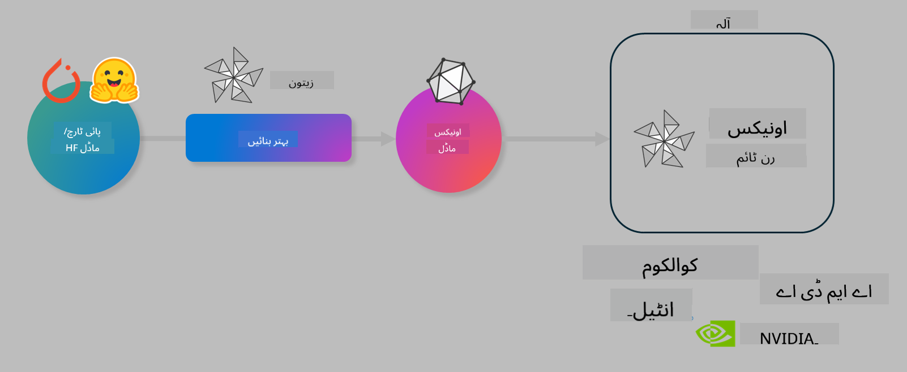

<!--
CO_OP_TRANSLATOR_METADATA:
{
  "original_hash": "76956c0c22e5686908a6d85ec72126af",
  "translation_date": "2025-04-03T06:16:54+00:00",
  "source_file": "code\\04.Finetuning\\olive-lab\\readme.md",
  "language_code": "ur"
}
-->
# لیب: AI ماڈلز کو ڈیوائس پر انفرینس کے لیے بہتر بنائیں

## تعارف

> [!IMPORTANT]
> اس لیب کے لیے **Nvidia A10 یا A100 GPU** کی ضرورت ہے، جس کے ساتھ متعلقہ ڈرائیورز اور CUDA ٹول کٹ (ورژن 12+) انسٹال ہو۔

> [!NOTE]
> یہ ایک **35 منٹ** کا لیب ہے جو آپ کو OLIVE کا استعمال کرتے ہوئے ماڈلز کو ڈیوائس انفرینس کے لیے بہتر بنانے کے بنیادی تصورات کا عملی تعارف فراہم کرے گا۔

## سیکھنے کے مقاصد

اس لیب کے اختتام پر، آپ OLIVE کا استعمال کرتے ہوئے درج ذیل کام کرنے کے قابل ہوں گے:

- AWQ کوانٹائزیشن طریقہ استعمال کرتے ہوئے AI ماڈل کو کوانٹائز کریں۔
- کسی مخصوص کام کے لیے AI ماڈل کو فائن ٹیون کریں۔
- LoRA اڈاپٹرز (فائن ٹیونڈ ماڈل) تیار کریں تاکہ ONNX Runtime پر مؤثر ڈیوائس انفرینس کو ممکن بنایا جا سکے۔

### اولیو کیا ہے؟

اولیو (*O*NNX *live*) ایک ماڈل آپٹیمائزیشن ٹول کٹ ہے، جس کے ساتھ CLI شامل ہے، جو آپ کو ONNX Runtime +++https://onnxruntime.ai+++ کے لیے ماڈلز تیار کرنے میں مدد دیتا ہے، جو معیار اور کارکردگی فراہم کرتا ہے۔



اولیو میں عام طور پر ان پٹ PyTorch یا Hugging Face ماڈل ہوتا ہے اور آؤٹ پٹ ایک بہتر بنایا ہوا ONNX ماڈل ہوتا ہے جو ایک ڈیوائس (ڈیپلائمنٹ ٹارگٹ) پر چلایا جاتا ہے، جو ONNX Runtime چلا رہا ہوتا ہے۔ اولیو ماڈل کو ڈیپلائمنٹ ٹارگٹ کے AI ایکسلریٹر (NPU، GPU، CPU) کے لیے بہتر بناتا ہے، جو کوالکوم، AMD، Nvidia یا Intel جیسے ہارڈویئر وینڈرز فراہم کرتے ہیں۔

اولیو ایک *ورک فلو* چلاتا ہے، جو ماڈل آپٹیمائزیشن کے انفرادی کاموں کی ترتیب ہوتی ہے جسے *پاسز* کہا جاتا ہے - مثال کے طور پر: ماڈل کمپریشن، گراف کیپچر، کوانٹائزیشن، گراف آپٹیمائزیشن۔ ہر پاس کے پاس پیرامیٹرز کا ایک سیٹ ہوتا ہے، جسے بہترین میٹرکس حاصل کرنے کے لیے ٹیون کیا جا سکتا ہے، جیسے کہ ایکوریسی اور لیٹینسی، جن کا جائزہ متعلقہ ایویلیویٹر کے ذریعے لیا جاتا ہے۔ اولیو ایک سرچ اسٹریٹجی استعمال کرتا ہے جو ہر پاس کو ایک ایک کر کے یا پاسز کے سیٹ کو ایک ساتھ آٹو ٹیون کرنے کے لیے سرچ الگورتھم کا استعمال کرتا ہے۔

#### اولیو کے فوائد

- گراف آپٹیمائزیشن، کمپریشن اور کوانٹائزیشن کے مختلف تکنیکوں کے ساتھ آزمائش اور غلطی کے دستی تجربات کے وقت اور پریشانی کو کم کریں۔ اپنی معیار اور کارکردگی کی حدود کی وضاحت کریں اور اولیو کو خود بخود آپ کے لیے بہترین ماڈل تلاش کرنے دیں۔
- **40+ بلٹ ان ماڈل آپٹیمائزیشن کمپوننٹس**، جو کوانٹائزیشن، کمپریشن، گراف آپٹیمائزیشن اور فائن ٹیوننگ میں جدید ترین تکنیکوں کا احاطہ کرتے ہیں۔
- عام ماڈل آپٹیمائزیشن کاموں کے لیے **استعمال میں آسان CLI**۔ مثال کے طور پر، olive quantize، olive auto-opt، olive finetune۔
- ماڈل پیکجنگ اور ڈیپلائمنٹ بلٹ ان۔
- **ملٹی LoRA سرونگ** کے لیے ماڈلز تیار کرنے کی سپورٹ۔
- YAML/JSON کا استعمال کرتے ہوئے ورک فلو بنائیں تاکہ ماڈل آپٹیمائزیشن اور ڈیپلائمنٹ کاموں کو ترتیب دیا جا سکے۔
- **Hugging Face** اور **Azure AI** انٹیگریشن۔
- **بلٹ ان کیشنگ میکانزم** جو **لاگت بچاتا ہے**۔

## لیب ہدایات

> [!NOTE]
> براہ کرم یقینی بنائیں کہ آپ نے اپنے Azure AI Hub اور پروجیکٹ کو تیار کر لیا ہے اور اپنی A100 کمپیوٹ کو لیب 1 کے مطابق سیٹ اپ کر لیا ہے۔

### مرحلہ 0: اپنے Azure AI کمپیوٹ سے کنیکٹ کریں

آپ **VS Code** میں ریموٹ فیچر استعمال کرتے ہوئے Azure AI کمپیوٹ سے کنیکٹ کریں گے۔

1. اپنی **VS Code** ڈیسک ٹاپ ایپلیکیشن کھولیں:
1. **کمانڈ پیلیٹ** کھولنے کے لیے **Shift+Ctrl+P** دبائیں۔
1. کمانڈ پیلیٹ میں **AzureML - remote: Connect to compute instance in New Window** تلاش کریں۔
1. کمپیوٹ سے کنیکٹ کرنے کے لیے آن اسکرین ہدایات پر عمل کریں۔ اس میں آپ کے Azure سبسکرپشن، ریسورس گروپ، پروجیکٹ اور کمپیوٹ کا نام منتخب کرنا شامل ہوگا، جو آپ نے لیب 1 میں سیٹ اپ کیا تھا۔
1. ایک بار جب آپ Azure ML کمپیوٹ نوڈ سے کنیکٹ ہو جائیں گے، تو یہ **Visual Code کے نیچے بائیں طرف** دکھایا جائے گا `><Azure ML: Compute Name`

### مرحلہ 1: اس ریپو کو کلون کریں

VS Code میں، آپ **Ctrl+J** کے ساتھ ایک نیا ٹرمینل کھول سکتے ہیں اور اس ریپو کو کلون کر سکتے ہیں:

ٹرمینل میں آپ کو پرامپٹ نظر آئے گا

```
azureuser@computername:~/cloudfiles/code$ 
```
ریپو کلون کریں 

```bash
cd ~/localfiles
git clone https://github.com/microsoft/phi-3cookbook.git
```

### مرحلہ 2: فولڈر کو VS Code میں کھولیں

متعلقہ فولڈر میں VS Code کھولنے کے لیے، ٹرمینل میں درج ذیل کمانڈ چلائیں، جو ایک نیا ونڈو کھولے گا:

```bash
code phi-3cookbook/code/04.Finetuning/Olive-lab
```

یا آپ فولڈر کو **File** > **Open Folder** منتخب کر کے بھی کھول سکتے ہیں۔

### مرحلہ 3: ڈیپینڈنسیز

Azure AI کمپیوٹ انسٹینس میں VS Code میں ایک ٹرمینل ونڈو کھولیں (ٹپ: **Ctrl+J**) اور درج ذیل کمانڈز چلائیں تاکہ ڈیپینڈنسیز انسٹال کی جا سکیں:

```bash
conda create -n olive-ai python=3.11 -y
conda activate olive-ai
pip install -r requirements.txt
az extension remove -n azure-cli-ml
az extension add -n ml
```

> [!NOTE]
> تمام ڈیپینڈنسیز انسٹال ہونے میں **~5 منٹ** لگتے ہیں۔

اس لیب میں آپ ماڈلز کو Azure AI ماڈل کیٹلاگ میں ڈاؤنلوڈ اور اپلوڈ کریں گے۔ تاکہ آپ ماڈل کیٹلاگ تک رسائی حاصل کر سکیں، آپ کو Azure میں لاگ ان کرنے کی ضرورت ہوگی:

```bash
az login
```

> [!NOTE]
> لاگ ان کے وقت آپ سے اپنی سبسکرپشن منتخب کرنے کو کہا جائے گا۔ اس لیب کے لیے فراہم کردہ سبسکرپشن کو منتخب کریں۔

### مرحلہ 4: اولیو کمانڈز چلائیں

Azure AI کمپیوٹ انسٹینس میں VS Code میں ایک ٹرمینل ونڈو کھولیں (ٹپ: **Ctrl+J**) اور یقینی بنائیں کہ `olive-ai` کونڈا ماحول ایکٹیویٹ ہے:

```bash
conda activate olive-ai
```

اب درج ذیل اولیو کمانڈز کمانڈ لائن میں چلائیں۔

1. **ڈیٹا کا معائنہ کریں:** اس مثال میں، آپ Phi-3.5-Mini ماڈل کو فائن ٹیون کریں گے تاکہ یہ سفر سے متعلق سوالات کے جوابات دینے میں مہارت حاصل کرے۔ نیچے دیے گئے کوڈ کے ذریعے ڈیٹاسیٹ کے ابتدائی چند ریکارڈز دکھائے جاتے ہیں، جو JSON لائنز فارمیٹ میں ہیں:

    ```bash
    head data/data_sample_travel.jsonl
    ```
1. **ماڈل کو کوانٹائز کریں:** ماڈل کو تربیت دینے سے پہلے، آپ درج ذیل کمانڈ کے ذریعے کوانٹائز کریں گے، جو Active Aware Quantization (AWQ) تکنیک کا استعمال کرتی ہے +++https://arxiv.org/abs/2306.00978+++. AWQ ماڈل کے ویٹس کو انفرینس کے دوران پیدا ہونے والی ایکٹیویشنز کو مدنظر رکھ کر کوانٹائز کرتا ہے۔ اس کا مطلب ہے کہ کوانٹائزیشن عمل ایکٹیویشنز میں اصل ڈیٹا ڈسٹریبیوشن کو مدنظر رکھتا ہے، جو روایتی ویٹ کوانٹائزیشن طریقوں کے مقابلے میں ماڈل کی درستگی کو بہتر طریقے سے محفوظ رکھتا ہے۔

    ```bash
    olive quantize \
       --model_name_or_path microsoft/Phi-3.5-mini-instruct \
       --trust_remote_code \
       --algorithm awq \
       --output_path models/phi/awq \
       --log_level 1
    ```
    
    AWQ کوانٹائزیشن مکمل ہونے میں **~8 منٹ** لگتے ہیں، جو **ماڈل کا سائز ~7.5GB سے ~2.5GB تک کم** کر دیتا ہے۔
   
   اس لیب میں، ہم آپ کو دکھا رہے ہیں کہ کس طرح Hugging Face سے ماڈلز انپٹ کریں (مثال کے طور پر: `microsoft/Phi-3.5-mini-instruct`). However, Olive also allows you to input models from the Azure AI catalog by updating the `model_name_or_path` argument to an Azure AI asset ID (for example:  `azureml://registries/azureml/models/Phi-3.5-mini-instruct/versions/4`). 

1. **Train the model:** Next, the `olive finetune` کمانڈ کوانٹائزڈ ماڈل کو فائن ٹیون کرتا ہے۔ ماڈل کو فائن ٹیون کرنے کے بجائے پہلے کوانٹائز کرنا بہتر درستگی فراہم کرتا ہے کیونکہ فائن ٹیوننگ عمل کوانٹائزیشن سے ہونے والے نقصان کو کچھ حد تک بحال کرتا ہے۔

    ```bash
    olive finetune \
        --method lora \
        --model_name_or_path models/phi/awq \
        --data_files "data/data_sample_travel.jsonl" \
        --data_name "json" \
        --text_template "<|user|>\n{prompt}<|end|>\n<|assistant|>\n{response}<|end|>" \
        --max_steps 100 \
        --output_path ./models/phi/ft \
        --log_level 1
    ```
    
    فائن ٹیوننگ مکمل ہونے میں **~6 منٹ** لگتے ہیں (100 مراحل کے ساتھ)۔

1. **آپٹیمائز کریں:** ماڈل کو تربیت دینے کے بعد، آپ اولیو کے `auto-opt` command, which will capture the ONNX graph and automatically perform a number of optimizations to improve the model performance for CPU by compressing the model and doing fusions. It should be noted, that you can also optimize for other devices such as NPU or GPU by just updating the `--device` and `--provider` آرگومنٹس کا استعمال کرتے ہوئے ماڈل کو آپٹیمائز کریں گے - لیکن اس لیب کے لیے ہم CPU استعمال کریں گے۔

    ```bash
    olive auto-opt \
       --model_name_or_path models/phi/ft/model \
       --adapter_path models/phi/ft/adapter \
       --device cpu \
       --provider CPUExecutionProvider \
       --use_ort_genai \
       --output_path models/phi/onnx-ao \
       --log_level 1
    ```
    
    آپٹیمائزیشن مکمل ہونے میں **~5 منٹ** لگتے ہیں۔

### مرحلہ 5: ماڈل انفرینس کا فوری ٹیسٹ

ماڈل کا انفرینس ٹیسٹ کرنے کے لیے، اپنے فولڈر میں ایک Python فائل بنائیں جس کا نام **app.py** ہو اور درج ذیل کوڈ کو کاپی اور پیسٹ کریں:

```python
import onnxruntime_genai as og
import numpy as np

print("loading model and adapters...", end="", flush=True)
model = og.Model("models/phi/onnx-ao/model")
adapters = og.Adapters(model)
adapters.load("models/phi/onnx-ao/model/adapter_weights.onnx_adapter", "travel")
print("DONE!")

tokenizer = og.Tokenizer(model)
tokenizer_stream = tokenizer.create_stream()

params = og.GeneratorParams(model)
params.set_search_options(max_length=100, past_present_share_buffer=False)
user_input = "what is the best thing to see in chicago"
params.input_ids = tokenizer.encode(f"<|user|>\n{user_input}<|end|>\n<|assistant|>\n")

generator = og.Generator(model, params)

generator.set_active_adapter(adapters, "travel")

print(f"{user_input}")

while not generator.is_done():
    generator.compute_logits()
    generator.generate_next_token()

    new_token = generator.get_next_tokens()[0]
    print(tokenizer_stream.decode(new_token), end='', flush=True)

print("\n")
```

کوڈ کو چلانے کے لیے درج ذیل کمانڈ استعمال کریں:

```bash
python app.py
```

### مرحلہ 6: ماڈل کو Azure AI پر اپلوڈ کریں

ماڈل کو Azure AI ماڈل ریپوزٹری میں اپلوڈ کرنے سے ماڈل کو آپ کی ڈویلپمنٹ ٹیم کے دیگر ممبرز کے ساتھ شیئر کرنا ممکن ہو جاتا ہے اور ماڈل کے ورژن کنٹرول کو بھی ہینڈل کیا جاتا ہے۔ ماڈل کو اپلوڈ کرنے کے لیے درج ذیل کمانڈ چلائیں:

> [!NOTE]
> `{}`` placeholders with the name of your resource group and Azure AI Project Name. 

To find your resource group `"resourceGroup" اور Azure AI پروجیکٹ کے نام کو اپڈیٹ کریں اور درج ذیل کمانڈ چلائیں 

```
az ml workspace show
```

یا +++ai.azure.com+++ پر جا کر **management center** **project** **overview** منتخب کریں۔

`{}` پلیس ہولڈرز کو اپنے ریسورس گروپ اور Azure AI پروجیکٹ کے نام سے اپڈیٹ کریں۔

```bash
az ml model create \
    --name ft-for-travel \
    --version 1 \
    --path ./models/phi/onnx-ao \
    --resource-group {RESOURCE_GROUP_NAME} \
    --workspace-name {PROJECT_NAME}
```
آپ اپنا اپلوڈ شدہ ماڈل دیکھ سکتے ہیں اور اسے https://ml.azure.com/model/list پر ڈیپلائی کر سکتے ہیں۔

**ڈسکلوزر**:  
یہ دستاویز AI ترجمہ سروس [Co-op Translator](https://github.com/Azure/co-op-translator) کا استعمال کرتے ہوئے ترجمہ کی گئی ہے۔ ہم درستگی کے لیے کوشش کرتے ہیں، لیکن براہ کرم یہ بات ذہن میں رکھیں کہ خودکار ترجمے میں غلطیاں یا عدم درستگیاں ہو سکتی ہیں۔ اصل دستاویز کو اس کی اصل زبان میں مستند ذریعہ سمجھا جانا چاہیے۔ اہم معلومات کے لیے، پیشہ ور انسانی ترجمہ کی سفارش کی جاتی ہے۔ ہم اس ترجمے کے استعمال سے پیدا ہونے والی کسی بھی غلط فہمی یا غلط تشریح کے ذمہ دار نہیں ہیں۔