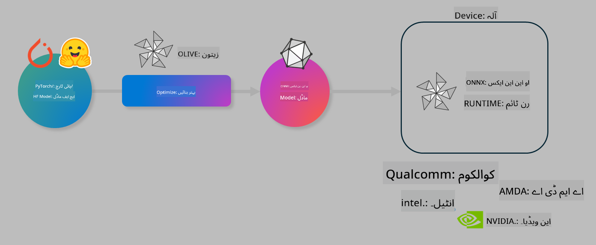

<!--
CO_OP_TRANSLATOR_METADATA:
{
  "original_hash": "6bbe47de3b974df7eea29dfeccf6032b",
  "translation_date": "2025-05-07T15:13:37+00:00",
  "source_file": "code/04.Finetuning/olive-lab/readme.md",
  "language_code": "ur"
}
-->
# لیب۔ آن-ڈیوائس انفرنس کے لیے AI ماڈلز کو بہتر بنائیں

## تعارف

> [!IMPORTANT]  
> اس لیب کے لیے **Nvidia A10 یا A100 GPU** درکار ہے جس کے ساتھ متعلقہ ڈرائیورز اور CUDA ٹول کٹ (ورژن 12+) انسٹال ہوں۔

> [!NOTE]  
> یہ ایک **35 منٹ** کی لیب ہے جو آپ کو OLIVE استعمال کرتے ہوئے آن-ڈیوائس انفرنس کے لیے ماڈلز کو بہتر بنانے کے بنیادی تصورات کا عملی تعارف دے گی۔

## سیکھنے کے مقاصد

اس لیب کے اختتام تک، آپ OLIVE استعمال کر کے یہ کر سکیں گے:

- AWQ کوانٹائزیشن طریقہ کار کے ذریعے AI ماڈل کو کوانٹائز کرنا۔  
- کسی مخصوص کام کے لیے AI ماڈل کو فائن ٹیون کرنا۔  
- ONNX Runtime پر موثر آن-ڈیوائس انفرنس کے لیے LoRA ایڈاپٹرز (فائن ٹیون کیا ہوا ماڈل) تیار کرنا۔

### Olive کیا ہے

Olive (*O*NNX *live*) ایک ماڈل آپٹیمائزیشن ٹول کٹ ہے جس کے ساتھ CLI آتا ہے جو آپ کو ONNX runtime +++https://onnxruntime.ai+++ کے لیے معیاری اور کارکردگی والے ماڈلز بھیجنے کی سہولت دیتا ہے۔



Olive میں ان پٹ عموماً PyTorch یا Hugging Face ماڈل ہوتا ہے اور آؤٹ پٹ ایک بہتر بنایا ہوا ONNX ماڈل ہوتا ہے جو کسی ڈیوائس (ڈپلائمنٹ ٹارگٹ) پر چلتا ہے جو ONNX runtime استعمال کر رہا ہو۔ Olive ماڈل کو ڈپلائمنٹ ٹارگٹ کے AI ایکسیلیریٹر (NPU, GPU, CPU) کے مطابق بہتر بناتا ہے جو Qualcomm، AMD، Nvidia یا Intel جیسے ہارڈویئر وینڈر فراہم کرتے ہیں۔

Olive ایک *ورک فلو* چلاتا ہے، جو انفرادی ماڈل آپٹیمائزیشن ٹاسکس کی ترتیب شدہ سیریز ہوتی ہے جنہیں *پاسز* کہا جاتا ہے - مثال کے طور پر: ماڈل کمپریشن، گراف کیپچر، کوانٹائزیشن، گراف آپٹیمائزیشن۔ ہر پاس کے پیرامیٹرز ہوتے ہیں جنہیں بہترین میٹرکس جیسے درستگی اور لیٹینسی کے لیے ٹیون کیا جا سکتا ہے، جو متعلقہ ایویلیوایٹر کے ذریعے جانچے جاتے ہیں۔ Olive ایک سرچ الگورتھم استعمال کرتا ہے جو ہر پاس کو ایک ایک کر کے یا پاسز کے سیٹ کو خودکار طریقے سے ٹیون کرتا ہے۔

#### Olive کے فوائد

- گراف آپٹیمائزیشن، کمپریشن اور کوانٹائزیشن کے مختلف طریقوں کے ساتھ دستی تجربات کے وقت اور الجھن کو کم کریں۔ اپنی کوالٹی اور کارکردگی کی حدود مقرر کریں اور Olive بہترین ماڈل خود تلاش کرے گا۔  
- کوانٹائزیشن، کمپریشن، گراف آپٹیمائزیشن اور فائن ٹیوننگ میں جدید تکنیکوں پر مشتمل **40+ بلٹ ان ماڈل آپٹیمائزیشن کمپونینٹس**۔  
- عام ماڈل آپٹیمائزیشن ٹاسکس کے لیے آسان CLI، مثلاً olive quantize، olive auto-opt، olive finetune۔  
- ماڈل پیکجنگ اور ڈپلائمنٹ بلٹ ان۔  
- **Multi LoRA serving** کے لیے ماڈلز تیار کرنے کی سپورٹ۔  
- YAML/JSON استعمال کر کے ورک فلو تعمیر کریں تاکہ ماڈل آپٹیمائزیشن اور ڈپلائمنٹ ٹاسکس کو آرکیسٹریٹ کیا جا سکے۔  
- **Hugging Face** اور **Azure AI** انٹیگریشن۔  
- لاگت بچانے کے لیے بلٹ ان **کیشنگ** میکانزم۔

## لیب کی ہدایات

> [!NOTE]  
> براہ کرم یقینی بنائیں کہ آپ نے اپنی Azure AI Hub اور پروجیکٹ کو ترتیب دیا ہے اور Lab 1 کے مطابق اپنا A100 کمپیوٹ سیٹ اپ کیا ہے۔

### مرحلہ 0: اپنے Azure AI کمپیوٹ سے کنیکٹ ہوں

آپ **VS Code** میں ریموٹ فیچر استعمال کرتے ہوئے Azure AI کمپیوٹ سے کنیکٹ ہوں گے۔

1. اپنا **VS Code** ڈیسک ٹاپ ایپلیکیشن کھولیں:  
1. **Shift+Ctrl+P** سے **کمانڈ پیلیٹ** کھولیں  
1. کمانڈ پیلیٹ میں تلاش کریں **AzureML - remote: Connect to compute instance in New Window**  
1. کمپیوٹ سے کنیکٹ کرنے کے لیے آن اسکرین ہدایات پر عمل کریں، جس میں آپ کی Azure سبسکرپشن، ریسورس گروپ، پروجیکٹ اور کمپیوٹ نام منتخب کرنا شامل ہوگا جو آپ نے Lab 1 میں سیٹ کیا تھا۔  
1. جب آپ Azure ML کمپیوٹ نوڈ سے کنیکٹ ہو جائیں گے، تو یہ **Visual Code کے نیچے بائیں کونے** میں ظاہر ہوگا `><Azure ML: Compute Name`

### مرحلہ 1: اس ریپو کو کلون کریں

VS Code میں، **Ctrl+J** سے نیا ٹرمینل کھولیں اور اس ریپو کو کلون کریں:

ٹرمینل میں آپ کو پرامپٹ نظر آئے گا

```
azureuser@computername:~/cloudfiles/code$ 
```  
حل کو کلون کریں

```bash
cd ~/localfiles
git clone https://github.com/microsoft/phi-3cookbook.git
```

### مرحلہ 2: VS Code میں فولڈر کھولیں

متعلقہ فولڈر میں VS Code کھولنے کے لیے ٹرمینل میں یہ کمانڈ چلائیں، جو نیا ونڈو کھولے گی:

```bash
code phi-3cookbook/code/04.Finetuning/Olive-lab
```

دوسری صورت میں، آپ **File** > **Open Folder** منتخب کر کے بھی فولڈر کھول سکتے ہیں۔

### مرحلہ 3: Dependencies

VS Code میں Azure AI کمپیوٹ انسٹینس میں ٹرمینل کھولیں (ٹپ: **Ctrl+J**) اور dependencies انسٹال کرنے کے لیے درج ذیل کمانڈز چلائیں:

```bash
conda create -n olive-ai python=3.11 -y
conda activate olive-ai
pip install -r requirements.txt
az extension remove -n azure-cli-ml
az extension add -n ml
```

> [!NOTE]  
> تمام dependencies انسٹال ہونے میں تقریباً 5 منٹ لگیں گے۔

اس لیب میں آپ ماڈلز کو Azure AI ماڈل کیٹلاگ سے ڈاؤن لوڈ اور اپ لوڈ کریں گے۔ ماڈل کیٹلاگ تک رسائی کے لیے Azure میں لاگ ان کریں:

```bash
az login
```

> [!NOTE]  
> لاگ ان کے وقت آپ سے سبسکرپشن منتخب کرنے کو کہا جائے گا۔ یقینی بنائیں کہ آپ اس لیب کے لیے فراہم کردہ سبسکرپشن منتخب کریں۔

### مرحلہ 4: Olive کمانڈز چلائیں

VS Code میں Azure AI کمپیوٹ انسٹینس میں ٹرمینل کھولیں (ٹپ: **Ctrl+J**) اور `olive-ai` کونڈا ماحول کو فعال کریں:

```bash
conda activate olive-ai
```

اس کے بعد، کمانڈ لائن میں درج ذیل Olive کمانڈز چلائیں۔

1. **ڈیٹا کا معائنہ کریں:** اس مثال میں، آپ Phi-3.5-Mini ماڈل کو فائن ٹیون کریں گے تاکہ یہ سفر سے متعلق سوالات کے جواب دینے میں مہارت حاصل کر لے۔ نیچے والا کوڈ ڈیٹاسیٹ کے چند پہلے ریکارڈز دکھاتا ہے جو JSON لائنز فارمیٹ میں ہیں:

    ```bash
    head data/data_sample_travel.jsonl
    ```

1. **ماڈل کو کوانٹائز کریں:** ماڈل کو ٹریننگ سے پہلے کوانٹائز کریں، درج ذیل کمانڈ کے ذریعے جو Active Aware Quantization (AWQ) تکنیک استعمال کرتی ہے +++https://arxiv.org/abs/2306.00978+++. AWQ انفرنس کے دوران پیدا ہونے والی ایکٹیویشنز کو مدنظر رکھتے ہوئے ماڈل کے وزن کو کوانٹائز کرتی ہے۔ اس کا مطلب ہے کہ کوانٹائزیشن کا عمل ایکٹیویشنز میں اصل ڈیٹا ڈسٹری بیوشن کو شامل کرتا ہے، جو روایتی وزن کوانٹائزیشن کے مقابلے میں بہتر درستگی برقرار رکھتا ہے۔

    ```bash
    olive quantize \
       --model_name_or_path microsoft/Phi-3.5-mini-instruct \
       --trust_remote_code \
       --algorithm awq \
       --output_path models/phi/awq \
       --log_level 1
    ```

    AWQ کوانٹائزیشن مکمل ہونے میں **تقریباً 8 منٹ** لگتے ہیں، جو ماڈل کا سائز تقریباً ~7.5GB سے ~2.5GB تک کم کر دیتا ہے۔

    اس لیب میں ہم آپ کو دکھا رہے ہیں کہ کیسے Hugging Face سے ماڈلز ان پٹ کیے جاتے ہیں (مثلاً: `microsoft/Phi-3.5-mini-instruct`). However, Olive also allows you to input models from the Azure AI catalog by updating the `model_name_or_path` argument to an Azure AI asset ID (for example:  `azureml://registries/azureml/models/Phi-3.5-mini-instruct/versions/4`). 

1. **Train the model:** Next, the `olive finetune` کمانڈ کوانٹائزڈ ماڈل کو فائن ٹیون کرتی ہے۔ ماڈل کو فائن ٹیون کرنے سے پہلے کوانٹائز کرنا بہتر درستگی دیتا ہے کیونکہ فائن ٹیوننگ عمل کوانٹائزیشن کے نقصانات کو کچھ حد تک بحال کر دیتا ہے۔

    ```bash
    olive finetune \
        --method lora \
        --model_name_or_path models/phi/awq \
        --data_files "data/data_sample_travel.jsonl" \
        --data_name "json" \
        --text_template "<|user|>\n{prompt}<|end|>\n<|assistant|>\n{response}<|end|>" \
        --max_steps 100 \
        --output_path ./models/phi/ft \
        --log_level 1
    ```

    فائن ٹیوننگ مکمل ہونے میں **تقریباً 6 منٹ** لگتے ہیں (100 اسٹیپس کے ساتھ)۔

1. **بہتر بنائیں:** ماڈل کی ٹریننگ کے بعد، آپ Olive کے `auto-opt` command, which will capture the ONNX graph and automatically perform a number of optimizations to improve the model performance for CPU by compressing the model and doing fusions. It should be noted, that you can also optimize for other devices such as NPU or GPU by just updating the `--device` and `--provider` آرگیومنٹس استعمال کر کے ماڈل کو بہتر بنائیں گے - لیکن اس لیب میں ہم CPU استعمال کریں گے۔

    ```bash
    olive auto-opt \
       --model_name_or_path models/phi/ft/model \
       --adapter_path models/phi/ft/adapter \
       --device cpu \
       --provider CPUExecutionProvider \
       --use_ort_genai \
       --output_path models/phi/onnx-ao \
       --log_level 1
    ```

    بہتر بنانے میں **تقریباً 5 منٹ** لگتے ہیں۔

### مرحلہ 5: ماڈل انفرنس کا فوری ٹیسٹ

ماڈل کی انفرنس ٹیسٹ کرنے کے لیے، اپنے فولڈر میں **app.py** نامی پائتھن فائل بنائیں اور درج ذیل کوڈ کاپی پیسٹ کریں:

```python
import onnxruntime_genai as og
import numpy as np

print("loading model and adapters...", end="", flush=True)
model = og.Model("models/phi/onnx-ao/model")
adapters = og.Adapters(model)
adapters.load("models/phi/onnx-ao/model/adapter_weights.onnx_adapter", "travel")
print("DONE!")

tokenizer = og.Tokenizer(model)
tokenizer_stream = tokenizer.create_stream()

params = og.GeneratorParams(model)
params.set_search_options(max_length=100, past_present_share_buffer=False)
user_input = "what is the best thing to see in chicago"
params.input_ids = tokenizer.encode(f"<|user|>\n{user_input}<|end|>\n<|assistant|>\n")

generator = og.Generator(model, params)

generator.set_active_adapter(adapters, "travel")

print(f"{user_input}")

while not generator.is_done():
    generator.compute_logits()
    generator.generate_next_token()

    new_token = generator.get_next_tokens()[0]
    print(tokenizer_stream.decode(new_token), end='', flush=True)

print("\n")
```

کوڈ چلانے کے لیے:

```bash
python app.py
```

### مرحلہ 6: ماڈل کو Azure AI پر اپ لوڈ کریں

ماڈل کو Azure AI ماڈل ریپوزٹری پر اپ لوڈ کرنے سے آپ کی ٹیم کے دیگر ممبران کے ساتھ ماڈل شیئر کرنا آسان ہو جاتا ہے اور ماڈل کے ورژن کنٹرول کا انتظام بھی ہوتا ہے۔ ماڈل اپ لوڈ کرنے کے لیے درج ذیل کمانڈ چلائیں:

> [!NOTE]  
> `{}` میں `resourceGroup` اور Azure AI پروجیکٹ کا نام اپ ڈیٹ کریں، پھر یہ کمانڈ چلائیں:

```
az ml workspace show
```

یا +++ai.azure.com+++ پر جا کر **management center** > **project** > **overview** منتخب کریں۔

`{}` پلیس ہولڈرز کو اپنے ریسورس گروپ اور Azure AI پروجیکٹ کے نام سے تبدیل کریں۔

```bash
az ml model create \
    --name ft-for-travel \
    --version 1 \
    --path ./models/phi/onnx-ao \
    --resource-group {RESOURCE_GROUP_NAME} \
    --workspace-name {PROJECT_NAME}
```

آپ پھر اپنے اپ لوڈ کیے گئے ماڈل کو دیکھ سکتے ہیں اور اسے https://ml.azure.com/model/list پر ڈپلائے کر سکتے ہیں۔

**ڈس کلیمر**:  
یہ دستاویز AI ترجمہ سروس [Co-op Translator](https://github.com/Azure/co-op-translator) کا استعمال کرتے ہوئے ترجمہ کی گئی ہے۔ اگرچہ ہم درستگی کی کوشش کرتے ہیں، براہ کرم اس بات سے آگاہ رہیں کہ خودکار تراجم میں غلطیاں یا کمی بیشی ہو سکتی ہے۔ اصل دستاویز اپنی مادری زبان میں ہی مستند ماخذ سمجھی جانی چاہیے۔ اہم معلومات کے لیے پیشہ ورانہ انسانی ترجمہ تجویز کیا جاتا ہے۔ ہم اس ترجمہ کے استعمال سے پیدا ہونے والی کسی بھی غلط فہمی یا غلط تشریح کے ذمہ دار نہیں ہیں۔