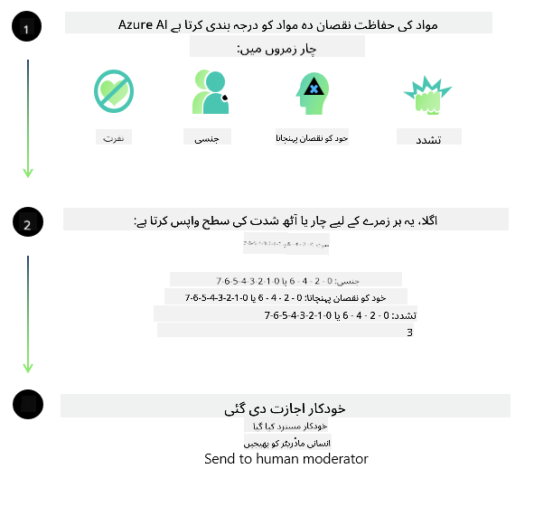

<!--
CO_OP_TRANSLATOR_METADATA:
{
  "original_hash": "c8273672cc57df2be675407a1383aaf0",
  "translation_date": "2025-07-16T17:43:03+00:00",
  "source_file": "md/01.Introduction/01/01.AISafety.md",
  "language_code": "ur"
}
-->
# Phi ماڈلز کے لیے AI کی حفاظت  
Phi ماڈلز کا خاندان [Microsoft Responsible AI Standard](https://query.prod.cms.rt.microsoft.com/cms/api/am/binary/RE5cmFl) کے مطابق تیار کیا گیا ہے، جو کمپنی بھر میں نافذ کیے جانے والے اصولوں کا مجموعہ ہے اور ان چھ بنیادی اصولوں پر مبنی ہے: جوابدہی، شفافیت، انصاف، اعتبار اور حفاظت، رازداری اور سیکیورٹی، اور شمولیت، جو [Microsoft کے Responsible AI اصول](https://www.microsoft.com/ai/responsible-ai) کی تشکیل کرتے ہیں۔  

پچھلے Phi ماڈلز کی طرح، ایک جامع حفاظتی جائزہ اور تربیت کے بعد حفاظتی طریقہ کار اپنایا گیا ہے، جس میں اس ریلیز کی کثیر لسانی صلاحیتوں کو مدنظر رکھتے ہوئے اضافی اقدامات کیے گئے ہیں۔ ہماری حفاظتی تربیت اور جائزہ لینے کا طریقہ کار، جس میں متعدد زبانوں اور خطرے کی اقسام میں جانچ شامل ہے، [Phi Safety Post-Training Paper](https://arxiv.org/abs/2407.13833) میں بیان کیا گیا ہے۔ اگرچہ Phi ماڈلز اس طریقہ کار سے فائدہ اٹھاتے ہیں، لیکن ڈویلپرز کو چاہیے کہ وہ ذمہ دار AI کی بہترین مشقیں اپنائیں، جن میں اپنے مخصوص استعمال کے کیس اور ثقافتی و لسانی سیاق و سباق سے متعلق خطرات کی نقشہ سازی، پیمائش، اور ان کا تدارک شامل ہے۔  

## بہترین مشقیں  

دوسرے ماڈلز کی طرح، Phi ماڈلز کا خاندان ممکنہ طور پر ایسے رویے اختیار کر سکتا ہے جو غیر منصفانہ، غیر قابل اعتماد، یا توہین آمیز ہوں۔  

SLM اور LLM کے کچھ محدود رویے جن سے آگاہ ہونا ضروری ہے، درج ذیل ہیں:  

- **خدمت کا معیار:** Phi ماڈلز بنیادی طور پر انگریزی متن پر تربیت یافتہ ہیں۔ انگریزی کے علاوہ دیگر زبانوں میں کارکردگی کم ہو سکتی ہے۔ تربیتی ڈیٹا میں کم نمائندگی والی انگریزی زبان کی اقسام، جیسے کہ معیاری امریکی انگریزی کے مقابلے میں، کم کارکردگی دکھا سکتی ہیں۔  
- **نقصانات کی نمائندگی اور دقیانوسی تصورات کا تسلسل:** یہ ماڈلز بعض گروہوں کی نمائندگی زیادہ یا کم کر سکتے ہیں، کچھ گروہوں کی نمائندگی مٹا سکتے ہیں، یا توہین آمیز یا منفی دقیانوسی تصورات کو مضبوط کر سکتے ہیں۔ حفاظتی تربیت کے باوجود، یہ حدود موجود رہ سکتی ہیں کیونکہ مختلف گروہوں کی نمائندگی کی سطح مختلف ہوتی ہے یا تربیتی ڈیٹا میں منفی دقیانوسی تصورات کی مثالیں موجود ہوتی ہیں جو حقیقی دنیا کے نمونوں اور سماجی تعصبات کی عکاسی کرتی ہیں۔  
- **نا مناسب یا توہین آمیز مواد:** یہ ماڈلز دیگر اقسام کا نا مناسب یا توہین آمیز مواد بھی پیدا کر سکتے ہیں، جس کی وجہ سے حساس سیاق و سباق میں اضافی حفاظتی اقدامات کے بغیر ان کا استعمال مناسب نہیں ہو سکتا۔  
- **معلومات کی قابلِ اعتمادیت:** زبان کے ماڈلز غیر منطقی مواد پیدا کر سکتے ہیں یا ایسا مواد بنا سکتے ہیں جو بظاہر معقول لگے لیکن غلط یا پرانا ہو۔  
- **کوڈ کے لیے محدود دائرہ:** Phi-3 کے تربیتی ڈیٹا کا زیادہ تر حصہ Python پر مبنی ہے اور عام پیکجز جیسے "typing, math, random, collections, datetime, itertools" استعمال کرتا ہے۔ اگر ماڈل Python اسکرپٹس تیار کرتا ہے جو دیگر پیکجز یا دوسری زبانوں میں اسکرپٹس استعمال کرتے ہیں، تو ہم صارفین کو سختی سے مشورہ دیتے ہیں کہ وہ تمام API استعمالات کو دستی طور پر تصدیق کریں۔  

ڈویلپرز کو چاہیے کہ وہ ذمہ دار AI کی بہترین مشقیں اپنائیں اور اس بات کو یقینی بنائیں کہ مخصوص استعمال کا کیس متعلقہ قوانین اور ضوابط (مثلاً رازداری، تجارت وغیرہ) کی پابندی کرتا ہو۔  

## ذمہ دار AI کے پہلو  

دوسرے زبان کے ماڈلز کی طرح، Phi سیریز کے ماڈلز ممکنہ طور پر ایسے رویے اختیار کر سکتے ہیں جو غیر منصفانہ، غیر قابل اعتماد، یا توہین آمیز ہوں۔ جن محدود رویوں سے آگاہ ہونا ضروری ہے، وہ درج ذیل ہیں:  

**خدمت کا معیار:** Phi ماڈلز بنیادی طور پر انگریزی متن پر تربیت یافتہ ہیں۔ انگریزی کے علاوہ دیگر زبانوں میں کارکردگی کم ہو سکتی ہے۔ تربیتی ڈیٹا میں کم نمائندگی والی انگریزی زبان کی اقسام، جیسے کہ معیاری امریکی انگریزی کے مقابلے میں، کم کارکردگی دکھا سکتی ہیں۔  

**نقصانات کی نمائندگی اور دقیانوسی تصورات کا تسلسل:** یہ ماڈلز بعض گروہوں کی نمائندگی زیادہ یا کم کر سکتے ہیں، کچھ گروہوں کی نمائندگی مٹا سکتے ہیں، یا توہین آمیز یا منفی دقیانوسی تصورات کو مضبوط کر سکتے ہیں۔ حفاظتی تربیت کے باوجود، یہ حدود موجود رہ سکتی ہیں کیونکہ مختلف گروہوں کی نمائندگی کی سطح مختلف ہوتی ہے یا تربیتی ڈیٹا میں منفی دقیانوسی تصورات کی مثالیں موجود ہوتی ہیں جو حقیقی دنیا کے نمونوں اور سماجی تعصبات کی عکاسی کرتی ہیں۔  

**نا مناسب یا توہین آمیز مواد:** یہ ماڈلز دیگر اقسام کا نا مناسب یا توہین آمیز مواد بھی پیدا کر سکتے ہیں، جس کی وجہ سے حساس سیاق و سباق میں اضافی حفاظتی اقدامات کے بغیر ان کا استعمال مناسب نہیں ہو سکتا۔  
معلومات کی قابلِ اعتمادیت: زبان کے ماڈلز غیر منطقی مواد پیدا کر سکتے ہیں یا ایسا مواد بنا سکتے ہیں جو بظاہر معقول لگے لیکن غلط یا پرانا ہو۔  

**کوڈ کے لیے محدود دائرہ:** Phi-3 کے تربیتی ڈیٹا کا زیادہ تر حصہ Python پر مبنی ہے اور عام پیکجز جیسے "typing, math, random, collections, datetime, itertools" استعمال کرتا ہے۔ اگر ماڈل Python اسکرپٹس تیار کرتا ہے جو دیگر پیکجز یا دوسری زبانوں میں اسکرپٹس استعمال کرتے ہیں، تو ہم صارفین کو سختی سے مشورہ دیتے ہیں کہ وہ تمام API استعمالات کو دستی طور پر تصدیق کریں۔  

ڈویلپرز کو چاہیے کہ وہ ذمہ دار AI کی بہترین مشقیں اپنائیں اور اس بات کو یقینی بنائیں کہ مخصوص استعمال کا کیس متعلقہ قوانین اور ضوابط (مثلاً رازداری، تجارت وغیرہ) کی پابندی کرتا ہو۔ غور طلب اہم پہلو درج ذیل ہیں:  

**تفویض:** ماڈلز ایسے حالات کے لیے موزوں نہیں ہو سکتے جہاں قانونی حیثیت یا وسائل یا زندگی کے مواقع کی تقسیم پر گہرا اثر پڑ سکتا ہو (مثلاً: رہائش، ملازمت، قرض وغیرہ) جب تک کہ مزید جائزے اور اضافی تعصبات کو دور کرنے کی تکنیکیں نہ اپنائی جائیں۔  

**اعلیٰ خطرے والے حالات:** ڈویلپرز کو چاہیے کہ وہ ایسے اعلیٰ خطرے والے حالات میں ماڈلز کے استعمال کی موزونیت کا جائزہ لیں جہاں غیر منصفانہ، غیر قابل اعتماد، یا توہین آمیز نتائج بہت مہنگے یا نقصان دہ ہو سکتے ہیں۔ اس میں حساس یا ماہر شعبوں میں مشورہ دینا شامل ہے جہاں درستگی اور اعتبار انتہائی اہم ہو (مثلاً: قانونی یا صحت کے مشورے)۔ تعیناتی کے سیاق و سباق کے مطابق ایپلیکیشن کی سطح پر اضافی حفاظتی اقدامات کیے جانے چاہئیں۔  

**غلط معلومات:** ماڈلز غلط معلومات پیدا کر سکتے ہیں۔ ڈویلپرز کو چاہیے کہ وہ شفافیت کی بہترین مشقیں اپنائیں اور صارفین کو آگاہ کریں کہ وہ AI نظام کے ساتھ بات چیت کر رہے ہیں۔ ایپلیکیشن کی سطح پر، ڈویلپرز فیڈبیک میکانزم اور پائپ لائنز بنا سکتے ہیں تاکہ جوابات کو مخصوص استعمال کے کیس اور سیاق و سباق کی معلومات کے ساتھ مربوط کیا جا سکے، جسے Retrieval Augmented Generation (RAG) کہا جاتا ہے۔  

**نقصان دہ مواد کی تخلیق:** ڈویلپرز کو چاہیے کہ وہ اپنے سیاق و سباق کے لیے نتائج کا جائزہ لیں اور دستیاب حفاظتی کلاسیفائرز یا اپنی مرضی کے مطابق حل استعمال کریں جو ان کے استعمال کے کیس کے لیے مناسب ہوں۔  

**غلط استعمال:** دھوکہ دہی، اسپیم، یا میلویئر کی تخلیق جیسے دیگر غلط استعمال کے امکانات موجود ہو سکتے ہیں، اور ڈویلپرز کو چاہیے کہ وہ یقینی بنائیں کہ ان کی ایپلیکیشنز متعلقہ قوانین اور ضوابط کی خلاف ورزی نہ کریں۔  

### فائن ٹیوننگ اور AI مواد کی حفاظت  

ماڈل کی فائن ٹیوننگ کے بعد، ہم سختی سے مشورہ دیتے ہیں کہ [Azure AI Content Safety](https://learn.microsoft.com/azure/ai-services/content-safety/overview) کے اقدامات کو استعمال کیا جائے تاکہ ماڈلز کے ذریعہ پیدا کردہ مواد کی نگرانی کی جا سکے، ممکنہ خطرات، دھمکیوں، اور معیار کے مسائل کی نشاندہی اور روک تھام کی جا سکے۔  

  

[Azure AI Content Safety](https://learn.microsoft.com/azure/ai-services/content-safety/overview) متن اور تصویر دونوں قسم کے مواد کی حمایت کرتا ہے۔ اسے کلاؤڈ، منقطع کنٹینرز، اور ایج/ایمبیڈڈ ڈیوائسز پر تعینات کیا جا سکتا ہے۔  

## Azure AI Content Safety کا جائزہ  

Azure AI Content Safety ایک ایسا حل نہیں ہے جو ہر صورت حال کے لیے یکساں ہو؛ اسے کاروبار کی مخصوص پالیسیوں کے مطابق حسب ضرورت بنایا جا سکتا ہے۔ اس کے علاوہ، اس کے کثیر لسانی ماڈلز اسے متعدد زبانوں کو بیک وقت سمجھنے کے قابل بناتے ہیں۔  

  

- **Azure AI Content Safety**  
- **Microsoft Developer**  
- **5 ویڈیوز**  

Azure AI Content Safety سروس ایپلیکیشنز اور سروسز میں نقصان دہ صارف اور AI پیدا کردہ مواد کا پتہ لگاتی ہے۔ اس میں متن اور تصویر کے API شامل ہیں جو نقصان دہ یا نا مناسب مواد کی شناخت کی اجازت دیتے ہیں۔  

[AI Content Safety Playlist](https://www.youtube.com/playlist?list=PLlrxD0HtieHjaQ9bJjyp1T7FeCbmVcPkQ)

**دستخطی نوٹ**:  
یہ دستاویز AI ترجمہ سروس [Co-op Translator](https://github.com/Azure/co-op-translator) کے ذریعے ترجمہ کی گئی ہے۔ اگرچہ ہم درستگی کے لیے کوشاں ہیں، براہ کرم آگاہ رہیں کہ خودکار ترجمے میں غلطیاں یا عدم درستیاں ہو سکتی ہیں۔ اصل دستاویز اپنی مادری زبان میں معتبر ماخذ سمجھی جانی چاہیے۔ اہم معلومات کے لیے پیشہ ور انسانی ترجمہ کی سفارش کی جاتی ہے۔ اس ترجمے کے استعمال سے پیدا ہونے والی کسی بھی غلط فہمی یا غلط تشریح کی ذمہ داری ہم پر عائد نہیں ہوتی۔